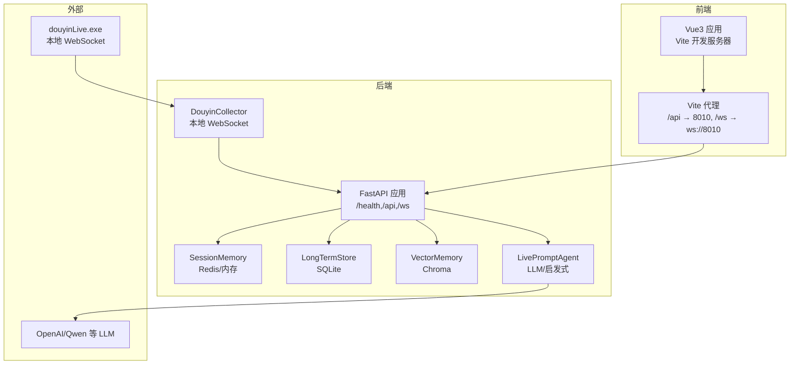
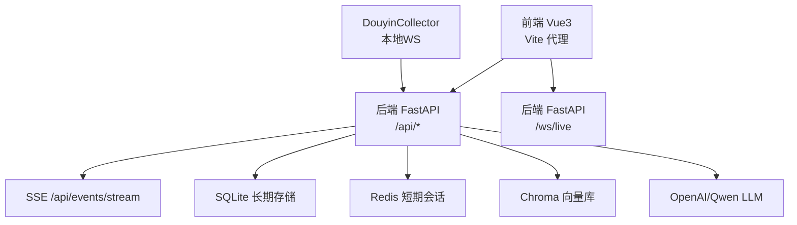
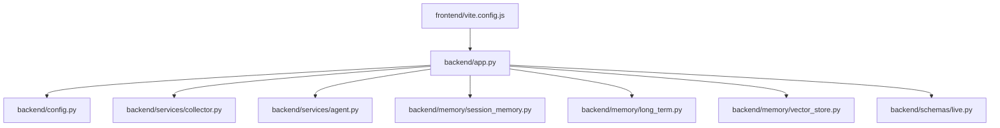

# 安全考虑

<cite>
**本文引用的文件**
- [README.md](file://README.md)
- [backend/app.py](file://backend/app.py)
- [backend/config.py](file://backend/config.py)
- [backend/services/collector.py](file://backend/services/collector.py)
- [backend/services/agent.py](file://backend/services/agent.py)
- [backend/memory/long_term.py](file://backend/memory/long_term.py)
- [backend/memory/session_memory.py](file://backend/memory/session_memory.py)
- [backend/memory/vector_store.py](file://backend/memory/vector_store.py)
- [backend/schemas/live.py](file://backend/schemas/live.py)
- [frontend/vite.config.js](file://frontend/vite.config.js)
- [requirements.txt](file://requirements.txt)
- [start_backend_qwen.ps1](file://start_backend_qwen.ps1)
- [start_all.ps1](file://start_all.ps1)
</cite>

## 目录
1. [简介](#简介)
2. [项目结构](#项目结构)
3. [核心组件](#核心组件)
4. [架构总览](#架构总览)
5. [详细组件分析](#详细组件分析)
6. [依赖关系分析](#依赖关系分析)
7. [性能与安全权衡](#性能与安全权衡)
8. [故障排查指南](#故障排查指南)
9. [结论](#结论)
10. [附录](#附录)

## 简介
本指南聚焦于DouYin_llm项目的安全考虑，结合现有实现与部署现状，系统性梳理认证授权、数据保护、网络安全、前端与后端安全实践，以及安全审计与漏洞扫描的实施方法。项目当前为本地开发/演示用途，未内置鉴权与多租户隔离，因此本指南特别强调在生产化改造时应遵循的安全基线与加固策略。

## 项目结构
项目采用“采集器 + FastAPI后端 + Vue3前端”的三层架构，数据层包含短期会话内存（Redis/内存）、长期存储（SQLite）、向量索引（Chroma）。后端通过REST/SSE/WebSocket对外提供接口，前端通过Vite代理访问后端。

图表来源
- [backend/app.py:108-126](file://backend/app.py#L108-L126)
- [backend/services/collector.py:118-140](file://backend/services/collector.py#L118-L140)
- [frontend/vite.config.js:10-22](file://frontend/vite.config.js#L10-L22)

章节来源
- [README.md:5-44](file://README.md#L5-L44)
- [backend/app.py:108-126](file://backend/app.py#L108-L126)
- [frontend/vite.config.js:10-22](file://frontend/vite.config.js#L10-L22)

## 核心组件
- 认证与授权
  - 当前实现：后端与前端均未实现登录、权限与多租户隔离，适合单人本地排练，不适合直接暴露到公网。
  - 建议：引入基于角色的访问控制（RBAC）、会话/令牌管理、资源级授权与租户隔离。
- API密钥管理
  - 当前实现：通过环境变量加载LLM与嵌入API密钥，未做密钥轮换与访问审计。
  - 建议：密钥分层存储、最小权限原则、定期轮换与访问日志。
- JWT令牌处理
  - 当前实现：未实现JWT。
  - 建议：引入JWT签发/校验、刷新、撤销与黑名单。
- 访问控制策略
  - 当前实现：未实现。
  - 建议：IP白名单、速率限制、请求来源校验、CORS精细化配置。
- 数据保护
  - 存储：SQLite/Chroma本地文件；短期会话可选Redis。
  - 传输：后端监听127.0.0.1，前端通过Vite代理访问；未启用TLS。
  - 建议：启用TLS、对敏感字段加密、最小化数据留存与脱敏。
- 网络安全
  - 防火墙：未配置。
  - DDoS：未配置。
  - 恶意请求拦截：未配置。
  - 建议：反向代理+WAF、限流、黑白名单、请求体大小限制。
- 前端安全
  - XSS：未配置。
  - CSRF：未配置。
  - CORS：当前允许所有来源，存在风险。
  - 建议：严格的CSP、SameSite Cookie、CSRF Token、内容安全策略。
- 后端安全
  - 输入验证：部分接口进行参数清洗，但未统一框架级校验。
  - SQL注入：使用ORM风格的参数化写法，但存在字符串拼接风险点。
  - 文件上传：未发现上传接口。
  - 建议：统一Pydantic校验、SQLAlchemy ORM、参数化查询、输入净化。
- 安全审计与漏洞扫描
  - 当前实现：未集成。
  - 建议：CI中加入静态分析（bandit/flake8/semgrep）、依赖漏洞扫描（pip-audit/trivy）、渗透测试。

章节来源
- [README.md:209-211](file://README.md#L209-L211)
- [backend/app.py:120-126](file://backend/app.py#L120-L126)
- [backend/config.py:60-67](file://backend/config.py#L60-L67)

## 架构总览
后端通过FastAPI提供REST/SSE/WebSocket接口，前端通过Vite代理访问。采集器与后端在同一主机运行，当前监听127.0.0.1，未启用TLS。

图表来源
- [backend/app.py:129-166](file://backend/app.py#L129-L166)
- [backend/services/collector.py:118-140](file://backend/services/collector.py#L118-L140)
- [frontend/vite.config.js:10-22](file://frontend/vite.config.js#L10-L22)

## 详细组件分析

### 认证授权与访问控制
- 现状
  - 后端未实现登录态与权限控制，接口完全公开。
  - 前端未携带鉴权头，CORS允许任意来源。
- 建议
  - 引入登录/注册、会话管理、JWT签发与校验。
  - 实施基于角色的访问控制（RBAC），区分操作员、管理员。
  - 限制来源IP与来源域名，启用严格CORS策略。
  - 为敏感接口增加速率限制与配额控制。

章节来源
- [README.md:209-211](file://README.md#L209-L211)
- [backend/app.py:120-126](file://backend/app.py#L120-L126)

### API密钥管理
- 现状
  - LLM与嵌入API密钥通过环境变量注入，未做密钥轮换与访问审计。
- 建议
  - 使用密钥管理服务（KMS/HashiCorp Vault）或加密存储。
  - 密钥最小权限与按需授权，定期轮换。
  - 在后端记录密钥使用审计日志（不含明文）。

章节来源
- [backend/config.py:60-67](file://backend/config.py#L60-L67)
- [start_backend_qwen.ps1:6-9](file://start_backend_qwen.ps1#L6-L9)

### JWT令牌处理
- 现状
  - 未实现JWT。
- 建议
  - 登录成功后签发短期访问令牌与刷新令牌。
  - 令牌包含必要声明（角色、租户、过期时间），服务端校验签名与有效期。
  - 刷新令牌单独存储与轮换，支持撤销与黑名单。

章节来源
- [backend/app.py:129-166](file://backend/app.py#L129-L166)

### 访问控制策略
- 现状
  - 未实现。
- 建议
  - IP白名单/黑名单、来源域名白名单。
  - 速率限制（每IP/每账户/每路由）。
  - 请求来源校验与CSRF Token。

章节来源
- [backend/app.py:120-126](file://backend/app.py#L120-L126)

### 数据保护
- 存储安全
  - SQLite/Chroma为本地文件，建议：
    - 限制文件系统权限（仅运行用户可读写）。
    - 启用文件系统加密（BitLocker/EncFS）。
    - 定期备份与异地存放，备份介质加密。
- 传输安全
  - 当前后端监听127.0.0.1，未启用TLS。
  - 建议：生产环境启用TLS（Nginx/反向代理），强制HTTPS。
- 敏感信息处理
  - 建议：对用户昵称、评论内容等进行脱敏与最小化留存。
  - 日志避免记录完整事件与密钥。

章节来源
- [backend/memory/long_term.py:63-182](file://backend/memory/long_term.py#L63-L182)
- [backend/memory/vector_store.py:70-84](file://backend/memory/vector_store.py#L70-L84)
- [README.md:93-94](file://README.md#L93-L94)

### 网络安全防护
- 防火墙
  - 建议：仅开放必需端口（8010、5173），限制来源IP。
- DDoS防护
  - 建议：反向代理层开启限流与连接数限制，必要时接入云WAF/DDoS防护。
- 恶意请求拦截
  - 建议：请求体大小限制、URL/参数白名单、速率限制、WAF规则。

章节来源
- [backend/app.py:129-166](file://backend/app.py#L129-L166)

### 前端安全最佳实践
- XSS防护
  - 建议：启用内容安全策略（CSP），禁止内联脚本与eval。
- CSRF保护
  - 建议：为POST/PUT/DELETE接口引入CSRF Token与SameSite Cookie。
- CORS配置
  - 现状：允许所有来源，存在跨域风险。
  - 建议：仅允许可信域名，限定方法与头部，禁用credentials或精确配置。

章节来源
- [backend/app.py:120-126](file://backend/app.py#L120-L126)
- [frontend/vite.config.js:10-22](file://frontend/vite.config.js#L10-L22)

### 后端安全措施
- 输入验证
  - 建议：统一使用Pydantic模型进行参数校验，避免裸参数处理。
- SQL注入防护
  - 现状：多数写入使用参数化，但存在字符串拼接风险点。
  - 建议：全部迁移至ORM（如SQLAlchemy）或严格参数化查询。
- 文件上传安全
  - 现状：未发现上传接口。
  - 建议：如后续新增上传，限制类型与大小、存储到受控目录、禁用执行权限。

章节来源
- [backend/memory/long_term.py:454-488](file://backend/memory/long_term.py#L454-L488)
- [backend/services/agent.py:302-437](file://backend/services/agent.py#L302-L437)

### 安全审计与漏洞扫描
- 建议
  - CI集成：Python静态分析（bandit/flake8/semgrep）、依赖漏洞扫描（pip-audit/trivy）。
  - 渗透测试：定期对后端接口与前端页面进行安全评估。
  - 日志审计：记录关键操作与异常，保留合规期内的日志。

章节来源
- [requirements.txt:1-6](file://requirements.txt#L1-L6)

## 依赖关系分析
后端依赖FastAPI、Uvicorn、Redis、ChromaDB等，前端通过Vite代理访问后端。当前未发现循环依赖，但存在跨组件的安全边界模糊（CORS、来源校验）。

图表来源
- [frontend/vite.config.js:10-22](file://frontend/vite.config.js#L10-L22)
- [backend/app.py:13-22](file://backend/app.py#L13-L22)

章节来源
- [backend/app.py:13-22](file://backend/app.py#L13-L22)
- [frontend/vite.config.js:10-22](file://frontend/vite.config.js#L10-L22)

## 性能与安全权衡
- CORS宽松配置可能带来跨域风险，建议逐步收紧。
- Redis可提升短期会话性能，但需注意网络暴露与访问控制。
- LLM调用存在延迟与成本，建议在网关层做缓存与降级策略。

[本节为通用指导，不直接分析具体文件]

## 故障排查指南
- 健康检查
  - 后端健康端点用于确认房间与会话状态。
- 环境变量缺失
  - 启动脚本会提示缺少.env文件或密钥。
- 代理配置
  - 前端代理确保同源访问后端，避免CORS问题。

章节来源
- [backend/app.py:129-135](file://backend/app.py#L129-L135)
- [start_backend_qwen.ps1:6-9](file://start_backend_qwen.ps1#L6-L9)
- [start_all.ps1:6-9](file://start_all.ps1#L6-L9)
- [frontend/vite.config.js:10-22](file://frontend/vite.config.js#L10-L22)

## 结论
DouYin_llm当前为本地演示用途，未内置安全机制。建议在生产化改造时，优先补齐认证授权、访问控制、数据与传输加密、前端安全策略与安全审计体系，形成完整的安全闭环。

[本节为总结，不直接分析具体文件]

## 附录
- 快速启动与健康检查
  - 后端健康检查端点与默认监听地址见项目说明。
- 配置项参考
  - LLM与嵌入相关环境变量、数据目录与会话TTL等。

章节来源
- [README.md:93-94](file://README.md#L93-L94)
- [backend/config.py:44-112](file://backend/config.py#L44-L112)