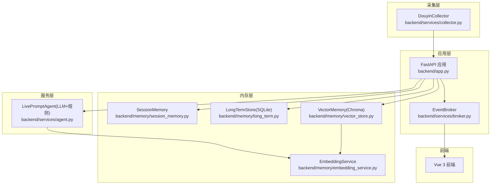
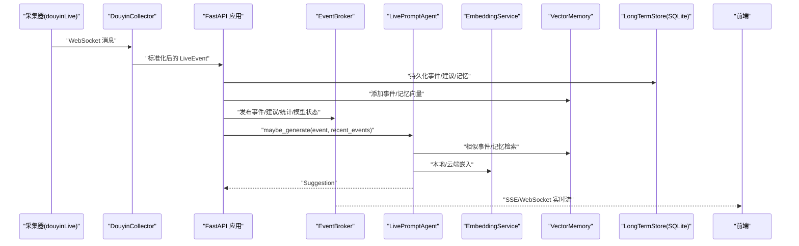
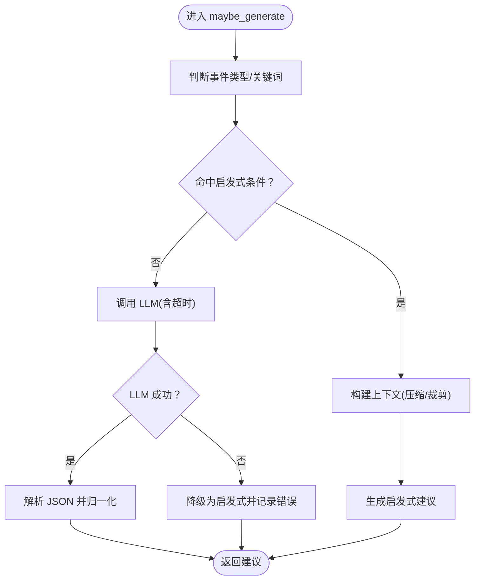
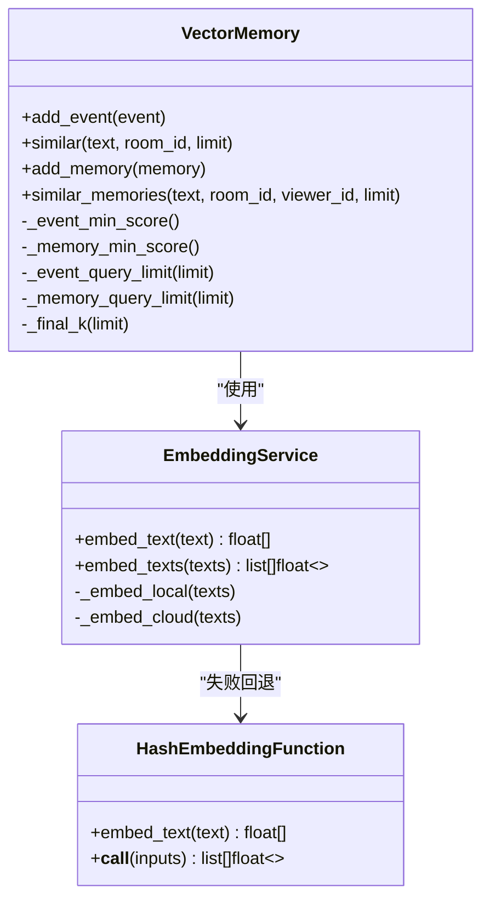
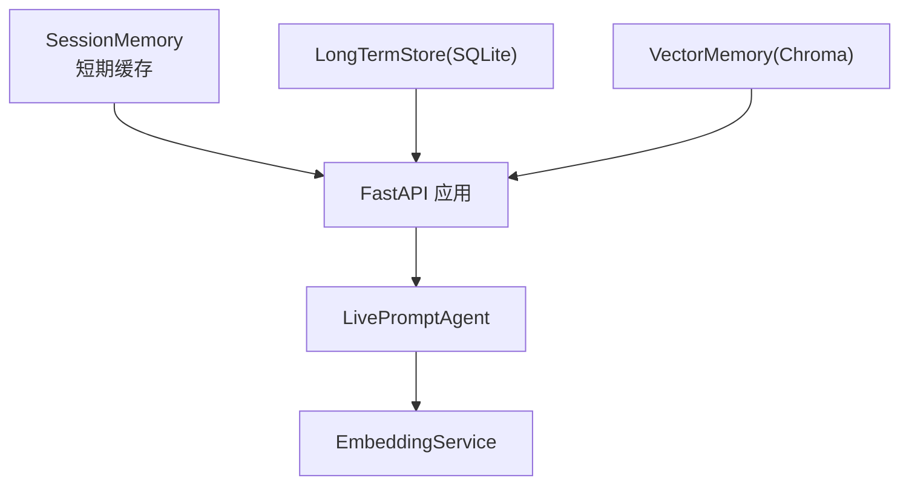
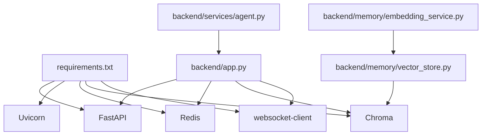

# LLM推理优化

<cite>
**本文引用的文件**
- [backend/app.py](file://backend/app.py)
- [backend/config.py](file://backend/config.py)
- [backend/services/agent.py](file://backend/services/agent.py)
- [backend/memory/embedding_service.py](file://backend/memory/embedding_service.py)
- [backend/memory/vector_store.py](file://backend/memory/vector_store.py)
- [backend/services/broker.py](file://backend/services/broker.py)
- [backend/memory/session_memory.py](file://backend/memory/session_memory.py)
- [backend/memory/long_term.py](file://backend/memory/long_term.py)
- [backend/services/collector.py](file://backend/services/collector.py)
- [backend/schemas/live.py](file://backend/schemas/live.py)
- [requirements.txt](file://requirements.txt)
- [README.md](file://README.md)
- [tests/test_agent.py](file://tests/test_agent.py)
- [tests/test_embedding_service.py](file://tests/test_embedding_service.py)
</cite>

## 目录
1. [简介](#简介)
2. [项目结构](#项目结构)
3. [核心组件](#核心组件)
4. [架构总览](#架构总览)
5. [详细组件分析](#详细组件分析)
6. [依赖分析](#依赖分析)
7. [性能考量](#性能考量)
8. [故障排查指南](#故障排查指南)
9. [结论](#结论)
10. [附录](#附录)

## 简介
本技术指南聚焦于 DouYin_llm 项目的 LLM 推理优化，围绕以下目标展开：
- 模型批处理策略：请求聚合、并发控制与资源分配优化
- 推理加速技术：模型量化、推理引擎优化与硬件加速利用
- 超时控制与错误处理：请求超时设置、重试策略与降级方案
- 上下文窗口优化：提示词压缩、关键信息提取与内存使用控制
- 性能监控指标与成本优化策略

通过对后端 FastAPI 应用、LLM 提示生成器、向量检索与嵌入服务、事件采集与内存层的深入分析，给出可操作的优化建议与最佳实践。

## 项目结构
后端采用分层设计：采集层负责将直播流标准化为事件；应用层进行事件处理、持久化与实时推送；内存层提供短期会话、长期存储与向量检索；服务层包含 LLM 提示生成器与嵌入服务。



图表来源
- [backend/app.py:108-127](file://backend/app.py#L108-L127)
- [backend/services/collector.py:38-100](file://backend/services/collector.py#L38-L100)
- [backend/services/broker.py:10-40](file://backend/services/broker.py#L10-L40)
- [backend/memory/session_memory.py:17-113](file://backend/memory/session_memory.py#L17-L113)
- [backend/memory/long_term.py:44-187](file://backend/memory/long_term.py#L44-L187)
- [backend/memory/vector_store.py:59-317](file://backend/memory/vector_store.py#L59-L317)
- [backend/memory/embedding_service.py:18-102](file://backend/memory/embedding_service.py#L18-L102)
- [backend/services/agent.py:23-496](file://backend/services/agent.py#L23-L496)

章节来源
- [README.md:5-17](file://README.md#L5-L17)
- [backend/app.py:108-127](file://backend/app.py#L108-L127)

## 核心组件
- FastAPI 应用与路由：提供健康检查、房间切换、事件注入、观众数据查询、LLM 设置管理、SSE 与 WebSocket 实时流等接口。
- LivePromptAgent：根据事件类型与上下文选择 LLM 或启发式规则生成建议，并上报模型状态。
- 向量检索与嵌入：EmbeddingService 支持本地/云端嵌入；VectorMemory 提供基于 Chroma 或内存的相似度检索与重排。
- 内存层：SessionMemory（Redis/内存）短期缓存；LongTermStore（SQLite）长期持久化；ViewerMemory 语义记忆。
- 事件采集与广播：DouyinCollector 将直播流标准化为事件并投递到事件循环；EventBroker 负责广播至 SSE/WebSocket。

章节来源
- [backend/app.py:129-285](file://backend/app.py#L129-L285)
- [backend/services/agent.py:23-496](file://backend/services/agent.py#L23-L496)
- [backend/memory/vector_store.py:59-317](file://backend/memory/vector_store.py#L59-L317)
- [backend/memory/embedding_service.py:18-102](file://backend/memory/embedding_service.py#L18-L102)
- [backend/memory/session_memory.py:17-113](file://backend/memory/session_memory.py#L17-L113)
- [backend/memory/long_term.py:44-187](file://backend/memory/long_term.py#L44-L187)
- [backend/services/broker.py:10-40](file://backend/services/broker.py#L10-L40)
- [backend/services/collector.py:38-100](file://backend/services/collector.py#L38-L100)

## 架构总览
系统通过采集器接收直播事件，经 FastAPI 归一化后写入短期与长期存储，并同步更新向量索引。当需要生成建议时，Agent 依据上下文与规则选择 LLM 或启发式策略，最终通过 SSE/WebSocket 推送至前端。



图表来源
- [backend/services/collector.py:145-160](file://backend/services/collector.py#L145-L160)
- [backend/app.py:73-102](file://backend/app.py#L73-L102)
- [backend/services/broker.py:28-40](file://backend/services/broker.py#L28-L40)
- [backend/services/agent.py:105-142](file://backend/services/agent.py#L105-L142)
- [backend/memory/vector_store.py:149-171](file://backend/memory/vector_store.py#L149-L171)
- [backend/memory/long_term.py:454-488](file://backend/memory/long_term.py#L454-L488)

## 详细组件分析

### 组件A：LivePromptAgent（LLM推理与降级）
- 请求聚合与上下文构建：根据事件类型与关键词触发启发式或 LLM；构建上下文时对最近事件、相似历史、用户画像与语义记忆进行压缩与裁剪，避免提示词冗余。
- 并发与资源分配：在单请求维度上，Agent 使用同步 HTTP 调用（urllib）与超时控制；未见显式的并发池或批处理队列，建议在上游引入限流与背压策略。
- 推理加速与降级：优先尝试 LLM，失败后自动降级为启发式规则；同时上报模型状态（模式、模型名、后端、结果与错误）。
- 错误处理：覆盖 HTTP 错误、网络错误、超时、JSON 解析异常、缺失字段等场景，统一记录并标记状态。



图表来源
- [backend/services/agent.py:105-142](file://backend/services/agent.py#L105-L142)
- [backend/services/agent.py:200-217](file://backend/services/agent.py#L200-L217)
- [backend/services/agent.py:302-437](file://backend/services/agent.py#L302-L437)

章节来源
- [backend/services/agent.py:23-496](file://backend/services/agent.py#L23-L496)
- [tests/test_agent.py:91-115](file://tests/test_agent.py#L91-L115)
- [tests/test_agent.py:116-172](file://tests/test_agent.py#L116-L172)

### 组件B：向量检索与嵌入（上下文窗口优化）
- 向量检索：支持基于 Chroma 的向量查询与基于内存的近似检索；通过最小分数阈值、查询上限与最终 K 值控制召回规模，避免上下文膨胀。
- 上下文压缩：在 Agent 构建上下文时，对最近事件、相似历史与语义记忆进行裁剪与去重，减少 token 使用。
- 嵌入策略：支持本地 SentenceTransformers 与云端 Embedding API；失败时回退到哈希嵌入函数，保证可用性。



图表来源
- [backend/memory/embedding_service.py:18-102](file://backend/memory/embedding_service.py#L18-L102)
- [backend/memory/vector_store.py:59-317](file://backend/memory/vector_store.py#L59-L317)
- [backend/memory/vector_store.py:34-57](file://backend/memory/vector_store.py#L34-L57)

章节来源
- [backend/memory/vector_store.py:172-231](file://backend/memory/vector_store.py#L172-L231)
- [backend/memory/vector_store.py:257-317](file://backend/memory/vector_store.py#L257-L317)
- [backend/memory/embedding_service.py:28-48](file://backend/memory/embedding_service.py#L28-L48)
- [tests/test_embedding_service.py:71-79](file://tests/test_embedding_service.py#L71-L79)

### 组件C：事件采集与并发控制
- 采集线程与事件循环：采集器在独立线程中接收 WebSocket 消息，标准化后通过 run_coroutine_threadsafe 投递到 FastAPI 事件循环，避免阻塞 IO。
- 并发与背压：当前未见显式队列长度限制或拒绝策略；建议在上游增加队列容量与超时，防止事件积压导致延迟上升。
- 重连与稳定性：采集器具备断线重连与 ping 保活，降低链路抖动影响。

```mermaid
sequenceDiagram
participant WS as "WebSocket(douyinLive)"
participant DC as "DouyinCollector"
participant Loop as "Asyncio 事件循环"
WS->>DC : "消息到达"
DC->>DC : "标准化为 LiveEvent"
DC->>Loop : "run_coroutine_threadsafe(event_handler)"
Loop-->>DC : "回调日志(异常记录)"
```

图表来源
- [backend/services/collector.py:145-160](file://backend/services/collector.py#L145-L160)
- [backend/services/collector.py:182-196](file://backend/services/collector.py#L182-L196)

章节来源
- [backend/services/collector.py:118-140](file://backend/services/collector.py#L118-L140)
- [backend/services/collector.py:182-196](file://backend/services/collector.py#L182-L196)

### 组件D：内存层（短期/长期/向量）
- SessionMemory：优先 Redis（可选），否则使用进程内 deque；控制短期事件与建议窗口大小，避免内存无限增长。
- LongTermStore：SQLite 持久化事件、建议、观众画像、记忆与笔记；建立多处索引以支撑查询。
- VectorMemory：Chroma 持久化向量索引；回退到内存近似检索；通过阈值与查询上限控制上下文规模。



图表来源
- [backend/memory/session_memory.py:17-113](file://backend/memory/session_memory.py#L17-L113)
- [backend/memory/long_term.py:44-187](file://backend/memory/long_term.py#L44-L187)
- [backend/memory/vector_store.py:59-84](file://backend/memory/vector_store.py#L59-L84)

章节来源
- [backend/memory/session_memory.py:42-84](file://backend/memory/session_memory.py#L42-L84)
- [backend/memory/long_term.py:501-554](file://backend/memory/long_term.py#L501-L554)
- [backend/memory/vector_store.py:172-231](file://backend/memory/vector_store.py#L172-L231)

## 依赖分析
- 外部依赖：FastAPI、Uvicorn、Redis、Chroma、websocket-client；可选依赖为 sentence-transformers。
- 组件耦合：Agent 依赖 VectorMemory 与 LongTermStore；VectorMemory 依赖 EmbeddingService；App 依赖 Broker、Agent、各 Memory 组件。
- 潜在风险：Agent 的 urllib 调用为同步阻塞；若上游并发激增，可能成为瓶颈。



图表来源
- [requirements.txt:1-6](file://requirements.txt#L1-L6)
- [backend/app.py:13-35](file://backend/app.py#L13-L35)

章节来源
- [requirements.txt:1-6](file://requirements.txt#L1-L6)
- [backend/app.py:13-35](file://backend/app.py#L13-L35)

## 性能考量
- 批处理与请求聚合
  - 当前 Agent 在单请求维度上进行 LLM 调用，未见批量聚合逻辑。建议在上游引入队列与批处理窗口，合并多个事件后再触发推理，以提升吞吐与降低 API 调用次数。
  - 上下文压缩：已在 Agent 构建阶段对最近事件、相似历史与语义记忆进行裁剪，建议进一步引入动态上下文截断策略，按 token 预算自适应调整。
- 并发控制与资源分配
  - 采集器通过线程与事件循环解耦；建议在 App 层引入速率限制与队列长度控制，防止突发流量导致内存与 CPU 峰值。
  - 向量检索与嵌入：通过最小分数阈值与查询上限控制召回规模；建议将阈值与上限参数化，结合 SLA 动态调整。
- 推理加速与硬件利用
  - 本地嵌入：可配置设备与批大小；建议在 GPU/CPU 上评估不同批大小的吞吐与延迟权衡。
  - LLM 调用：当前为同步 HTTP 调用；建议引入异步 HTTP 客户端与连接池，或在 Agent 层增加并发池与令牌桶限流。
- 超时与错误处理
  - LLM 超时：已设置超时参数；建议在上游增加指数退避重试与熔断保护，避免雪崩效应。
  - 降级策略：Agent 已具备 LLM 失败后的启发式降级；建议将降级阈值与成功率指标纳入监控。
- 成本优化
  - 通过减少上下文长度、降低 max_tokens、选择合适模型与温度，控制 token 消耗。
  - 向量检索阈值与查询上限直接影响 API 调用频率与成本，应结合业务 SLA 调优。

## 故障排查指南
- LLM 推理失败
  - 现象：模型状态标记为错误，返回启发式建议。
  - 排查：检查 LLM_BASE_URL、LLM_MODEL、LLM_API_KEY、LLM_TIMEOUT_SECONDS；确认网络可达与鉴权有效。
  - 参考
    - [backend/services/agent.py:330-393](file://backend/services/agent.py#L330-L393)
    - [backend/config.py:84-104](file://backend/config.py#L84-L104)
- 嵌入服务异常
  - 现象：云端嵌入失败，回落到哈希嵌入。
  - 排查：检查 EMBEDDING_MODE、EMBEDDING_BASE_URL、EMBEDDING_API_KEY、EMBEDDING_TIMEOUT_SECONDS。
  - 参考
    - [backend/memory/embedding_service.py:33-48](file://backend/memory/embedding_service.py#L33-L48)
    - [tests/test_embedding_service.py:71-79](file://tests/test_embedding_service.py#L71-L79)
- 采集器断线/重连
  - 现象：日志出现断开与重连提示。
  - 排查：检查 COLLECTOR_HOST、COLLECTOR_PORT、COLLECTOR_PING_INTERVAL_SECONDS、COLLECTOR_RECONNECT_DELAY_SECONDS。
  - 参考
    - [backend/services/collector.py:118-140](file://backend/services/collector.py#L118-L140)
- SSE/WebSocket 推送异常
  - 现象：前端无法接收实时流。
  - 排查：确认 /api/events/stream 与 /ws/live 路由可用，检查 Broker 订阅队列是否满载。
  - 参考
    - [backend/app.py:252-285](file://backend/app.py#L252-L285)
    - [backend/services/broker.py:28-40](file://backend/services/broker.py#L28-L40)

章节来源
- [backend/services/agent.py:330-393](file://backend/services/agent.py#L330-L393)
- [backend/memory/embedding_service.py:33-48](file://backend/memory/embedding_service.py#L33-L48)
- [backend/services/collector.py:118-140](file://backend/services/collector.py#L118-L140)
- [backend/app.py:252-285](file://backend/app.py#L252-L285)
- [backend/services/broker.py:28-40](file://backend/services/broker.py#L28-L40)

## 结论
本项目在 LLM 推理与实时交互方面具备清晰的分层架构与稳健的降级策略。为进一步提升吞吐与稳定性，建议在上游引入批处理与并发控制，在 Agent 层引入异步与限流，在向量检索与嵌入层引入参数化阈值与硬件优化。通过完善的监控与成本控制策略，可在保证质量的前提下显著降低延迟与费用。

## 附录
- 关键配置项（节选）
  - LLM 推理：LLM_MODE、LLM_BASE_URL、LLM_MODEL、LLM_API_KEY、LLM_TIMEOUT_SECONDS、LLM_TEMPERATURE、LLM_MAX_TOKENS
  - 向量与嵌入：EMBEDDING_MODE、EMBEDDING_MODEL、EMBEDDING_BASE_URL、EMBEDDING_API_KEY、LOCAL_EMBEDDING_DEVICE、LOCAL_EMBEDDING_BATCH_SIZE、SEMANTIC_* 系列
  - 会话与存储：SESSION_TTL_SECONDS、DATA_DIR、DATABASE_PATH、CHROMA_DIR
  - 采集器：COLLECTOR_HOST、COLLECTOR_PORT、COLLECTOR_PING_INTERVAL_SECONDS、COLLECTOR_RECONNECT_DELAY_SECONDS
- 相关接口
  - /health、/api/bootstrap、/api/room、/api/events、/api/events/stream、/ws/live、/api/settings/llm、/api/viewer*
- 测试参考
  - LLM 推理与上下文构建：tests/test_agent.py
  - 嵌入服务行为：tests/test_embedding_service.py

章节来源
- [backend/config.py:40-113](file://backend/config.py#L40-L113)
- [backend/app.py:129-285](file://backend/app.py#L129-L285)
- [tests/test_agent.py:41-90](file://tests/test_agent.py#L41-L90)
- [tests/test_agent.py:116-172](file://tests/test_agent.py#L116-L172)
- [tests/test_embedding_service.py:23-54](file://tests/test_embedding_service.py#L23-L54)