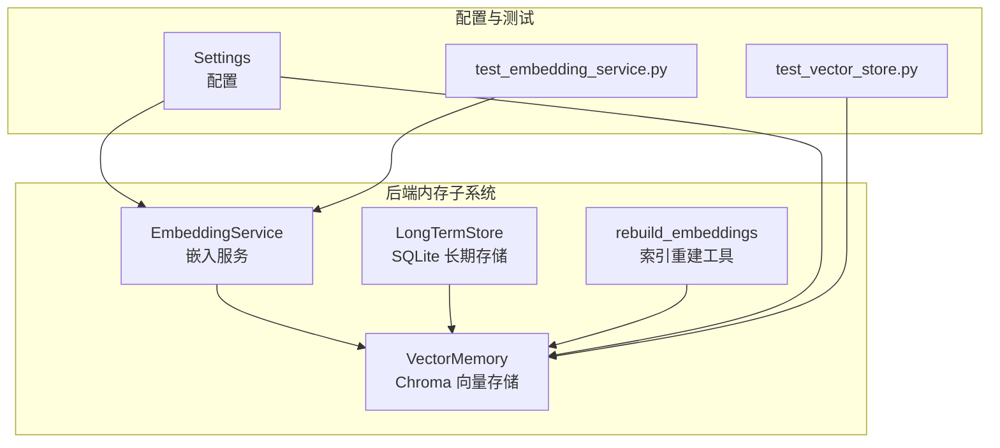
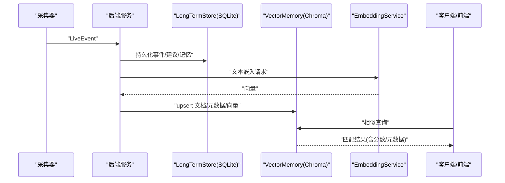
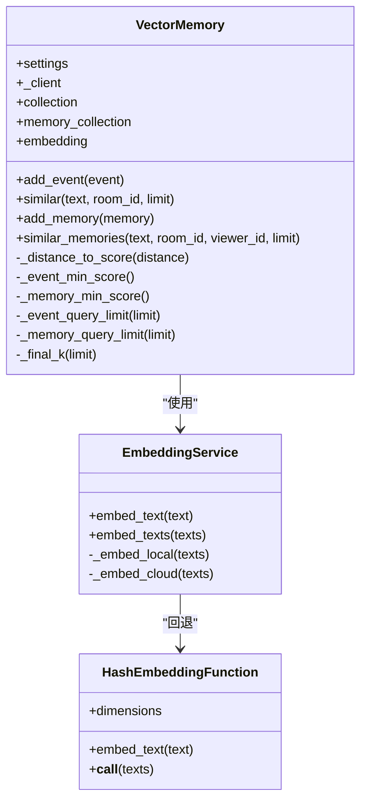
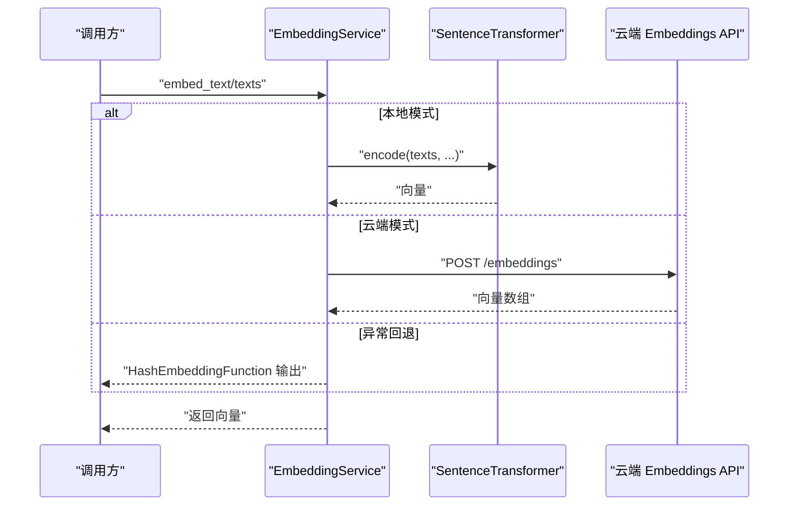
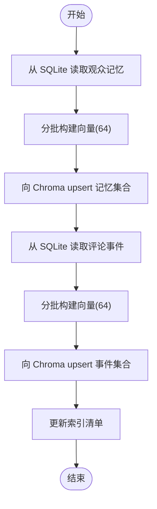
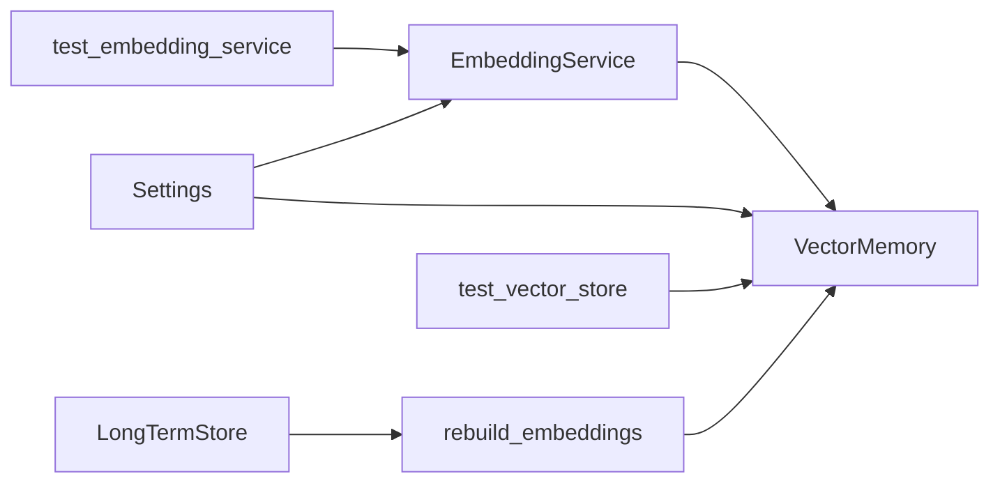
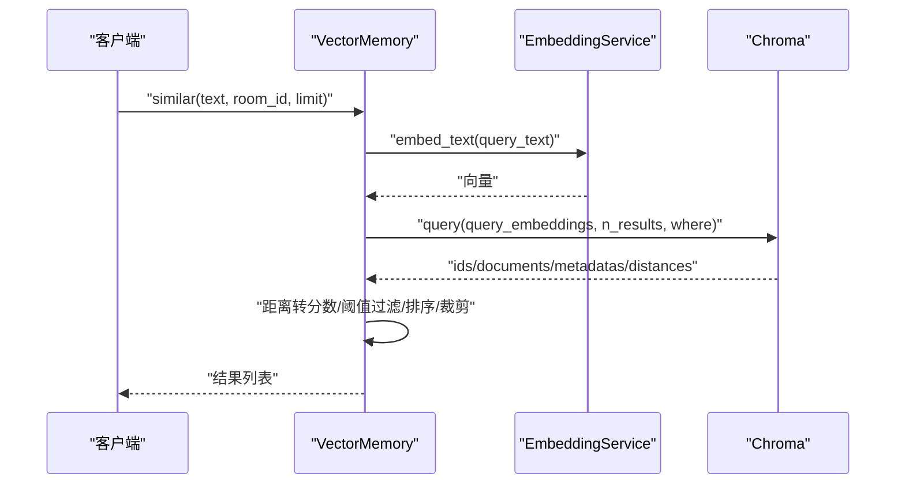

# 向量数据库优化

<cite>
**本文引用的文件列表**
- [vector_store.py](file://backend/memory/vector_store.py)
- [embedding_service.py](file://backend/memory/embedding_service.py)
- [long_term.py](file://backend/memory/long_term.py)
- [rebuild_embeddings.py](file://backend/memory/rebuild_embeddings.py)
- [config.py](file://backend/config.py)
- [test_vector_store.py](file://tests/test_vector_store.py)
- [test_embedding_service.py](file://tests/test_embedding_service.py)
- [requirements.txt](file://requirements.txt)
- [README.md](file://README.md)
</cite>

## 目录
1. [简介](#简介)
2. [项目结构](#项目结构)
3. [核心组件](#核心组件)
4. [架构总览](#架构总览)
5. [详细组件分析](#详细组件分析)
6. [依赖关系分析](#依赖关系分析)
7. [性能考量](#性能考量)
8. [故障排查指南](#故障排查指南)
9. [结论](#结论)
10. [附录](#附录)

## 简介
本指南聚焦于 DouYin_llm 项目的向量数据库优化，围绕 ChromaDB 索引优化、嵌入向量压缩策略、检索性能监控、批量向量操作优化以及容量规划与扩展性进行系统化说明。通过对现有代码的深入分析，提炼出可操作的优化路径与最佳实践，帮助在直播场景下实现低延迟、高召回与高精度的语义检索。

## 项目结构
项目采用“采集-后端-前端”三层架构，其中后端 memory 子系统包含向量存储(VectorMemory)、长短期存储(LongTermStore)、嵌入服务(EmbeddingService)与索引重建工具(rebuild_embeddings)，共同支撑直播间的语义记忆与检索。

图表来源
- [vector_store.py:59-317](file://backend/memory/vector_store.py#L59-L317)
- [embedding_service.py:18-102](file://backend/memory/embedding_service.py#L18-L102)
- [long_term.py:44-967](file://backend/memory/long_term.py#L44-L967)
- [rebuild_embeddings.py:233-276](file://backend/memory/rebuild_embeddings.py#L233-L276)
- [config.py:40-113](file://backend/config.py#L40-L113)
- [test_vector_store.py:20-103](file://tests/test_vector_store.py#L20-L103)
- [test_embedding_service.py:23-83](file://tests/test_embedding_service.py#L23-L83)

章节来源
- [README.md:1-223](file://README.md#L1-L223)
- [requirements.txt:1-6](file://requirements.txt#L1-L6)

## 核心组件
- VectorMemory：基于 Chroma 的向量存储与查询，支持事件历史与观众记忆两类集合，具备降级回退机制。
- EmbeddingService：统一的嵌入服务，支持本地(SentenceTransformer)、云端(OpenAI 兼容)与哈希回退三种模式。
- LongTermStore：SQLite 长期存储，承载事件、建议、观众画像、记忆与笔记等结构化数据。
- rebuild_embeddings：从 SQLite 源数据重建 Chroma 索引，支持按房间与批次增量重建，并维护索引清单。

章节来源
- [vector_store.py:59-317](file://backend/memory/vector_store.py#L59-L317)
- [embedding_service.py:18-102](file://backend/memory/embedding_service.py#L18-L102)
- [long_term.py:44-967](file://backend/memory/long_term.py#L44-L967)
- [rebuild_embeddings.py:233-276](file://backend/memory/rebuild_embeddings.py#L233-L276)

## 架构总览
下图展示了从采集到向量检索的关键流程，以及向量数据库在整体架构中的位置。

图表来源
- [vector_store.py:149-231](file://backend/memory/vector_store.py#L149-L231)
- [embedding_service.py:28-48](file://backend/memory/embedding_service.py#L28-L48)
- [long_term.py:454-488](file://backend/memory/long_term.py#L454-L488)

## 详细组件分析

### VectorMemory 组件分析
VectorMemory 负责：
- 初始化 Chroma 客户端与两个集合：事件历史与观众记忆，集合命名包含嵌入签名后缀，便于区分不同嵌入配置。
- 提供 add_event/add_memory 与 similar/similar_memories 查询接口，支持按房间过滤与阈值控制。
- 使用距离到分数的映射函数将底层距离转换为可解释的相似度分数，并对候选结果进行二次排序与裁剪。

图表来源
- [vector_store.py:59-317](file://backend/memory/vector_store.py#L59-L317)
- [embedding_service.py:18-102](file://backend/memory/embedding_service.py#L18-L102)

章节来源
- [vector_store.py:59-317](file://backend/memory/vector_store.py#L59-L317)

### EmbeddingService 组件分析
EmbeddingService 提供统一的嵌入接口：
- 支持本地模型(SentenceTransformer)与云端(OpenAI 兼容)两种模式，异常时自动回退至哈希嵌入。
- 本地模式支持设备选择与批大小配置，云端模式支持自定义 BaseURL 与超时。
- 返回的向量默认归一化，便于后续相似度计算。

图表来源
- [embedding_service.py:28-101](file://backend/memory/embedding_service.py#L28-L101)

章节来源
- [embedding_service.py:18-102](file://backend/memory/embedding_service.py#L18-L102)

### rebuild_embeddings 组件分析
rebuild_embeddings 用于从 SQLite 源数据重建 Chroma 索引：
- 支持按房间与上限限制增量重建，避免一次性重建造成压力。
- 通过批处理(64)减少网络与磁盘 IO 压力，提升吞吐。
- 维护索引清单(index_manifest.json)，记录活动签名与各集合的重建时间、条数与模型信息，便于审计与回滚。

图表来源
- [rebuild_embeddings.py:155-230](file://backend/memory/rebuild_embeddings.py#L155-L230)
- [rebuild_embeddings.py:130-152](file://backend/memory/rebuild_embeddings.py#L130-L152)

章节来源
- [rebuild_embeddings.py:233-276](file://backend/memory/rebuild_embeddings.py#L233-L276)

### 配置与签名机制
Settings 提供嵌入签名生成逻辑，用于区分不同嵌入模式与模型，确保集合命名唯一且可追溯。

章节来源
- [config.py:106-113](file://backend/config.py#L106-L113)

## 依赖关系分析
- VectorMemory 依赖 EmbeddingService 生成向量，Chroma 作为持久化后端。
- rebuild_embeddings 依赖 LongTermStore 读取源数据，再写入 VectorMemory 的集合。
- 测试用例验证集合命名、嵌入调用与阈值过滤行为。

图表来源
- [vector_store.py:59-317](file://backend/memory/vector_store.py#L59-L317)
- [embedding_service.py:18-102](file://backend/memory/embedding_service.py#L18-L102)
- [rebuild_embeddings.py:233-276](file://backend/memory/rebuild_embeddings.py#L233-L276)
- [config.py:40-113](file://backend/config.py#L40-L113)
- [test_vector_store.py:20-103](file://tests/test_vector_store.py#L20-L103)
- [test_embedding_service.py:23-83](file://tests/test_embedding_service.py#L23-L83)

章节来源
- [requirements.txt:1-6](file://requirements.txt#L1-L6)

## 性能考量

### 向量维度选择与索引类型配置
- 当前实现中，嵌入维度由回退哈希函数的维度参数决定，默认为 256。该值影响向量存储大小与计算复杂度。
- ChromaDB 在初始化时未显式配置索引类型与度量方式，通常采用默认 ANN 索引与余弦距离。建议结合业务规模与硬件资源评估是否需要调整底层索引参数（例如向量维度、索引类型、度量方式等）。

章节来源
- [embedding_service.py:19-24](file://backend/memory/embedding_service.py#L19-L24)
- [vector_store.py:36-56](file://backend/memory/vector_store.py#L36-L56)

### 查询性能调优
- 查询阈值与召回控制：通过设置事件与记忆的最小相似度阈值与最终 K 值，平衡召回与精度。
- 查询限制：在相似查询中，先扩大查询上限再裁剪，有助于提升召回质量。
- 元数据过滤：支持按房间 ID 等条件过滤，减少无效候选集。

章节来源
- [vector_store.py:92-108](file://backend/memory/vector_store.py#L92-L108)
- [vector_store.py:172-231](file://backend/memory/vector_store.py#L172-L231)
- [vector_store.py:257-317](file://backend/memory/vector_store.py#L257-L317)

### 嵌入向量压缩策略
- 哈希回退：当云端/本地嵌入不可用时，使用哈希嵌入作为回退方案，维度可配置。
- 归一化：本地嵌入返回时已进行归一化，有利于相似度计算稳定。
- 批处理：嵌入服务与重建工具均采用批处理，降低网络与模型调用开销。

章节来源
- [embedding_service.py:67-73](file://backend/memory/embedding_service.py#L67-L73)
- [rebuild_embeddings.py:173-192](file://backend/memory/rebuild_embeddings.py#L173-L192)

### 相似度计算优化
- 距离到分数映射：将底层距离转换为 0~1 的分数，便于阈值与排序。
- 多维排序：事件与记忆分别定义排序键，综合考虑分数、关键词包含、元数据权重等，提升相关性排序质量。

章节来源
- [vector_store.py:87-133](file://backend/memory/vector_store.py#L87-L133)

### 存储空间节省
- 哈希嵌入：在不依赖外部模型时，使用固定维度的哈希向量，占用空间可控。
- 清理与上限：事件与记忆集合在内存中维持固定窗口大小，避免无限增长。

章节来源
- [vector_store.py:162](file://backend/memory/vector_store.py#L162)
- [vector_store.py:247](file://backend/memory/vector_store.py#L247)

### 批量向量操作优化
- 批处理大小：重建工具默认批大小为 64，可在大规模数据重建时平衡吞吐与内存占用。
- upsert 写入：Chroma upsert 支持批量写入，减少往返次数。
- 增量重建：支持按房间与上限增量重建，降低全量重建风险。

章节来源
- [rebuild_embeddings.py:173-192](file://backend/memory/rebuild_embeddings.py#L173-L192)
- [rebuild_embeddings.py:213-230](file://backend/memory/rebuild_embeddings.py#L213-L230)

### 容量规划与扩展性
- 数据库与索引分离：SQLite 负责结构化数据，Chroma 负责向量索引，便于独立扩展。
- 集合命名与签名：集合名包含嵌入签名，便于多配置共存与切换。
- 索引清单：记录重建时间、集合名称与条数，便于容量审计与回滚。

章节来源
- [config.py:106-113](file://backend/config.py#L106-L113)
- [rebuild_embeddings.py:130-152](file://backend/memory/rebuild_embeddings.py#L130-L152)

## 故障排查指南

### 常见问题定位
- 嵌入服务异常：检查嵌入模式、BaseURL、API Key 与超时设置；确认本地模型是否可用。
- Chroma 不可用：确认 Chroma 客户端初始化与集合创建成功；查看集合命名是否包含正确签名。
- 查询无结果：检查最小相似度阈值、查询上限与元数据过滤条件；确认文档与向量是否正确 upsert。

章节来源
- [embedding_service.py:33-48](file://backend/memory/embedding_service.py#L33-L48)
- [vector_store.py:70-84](file://backend/memory/vector_store.py#L70-L84)
- [vector_store.py:172-231](file://backend/memory/vector_store.py#L172-L231)

### 单元测试参考
- VectorMemory 测试：验证集合命名、嵌入调用与阈值过滤。
- EmbeddingService 测试：验证云端/本地模式与回退行为。

章节来源
- [test_vector_store.py:20-103](file://tests/test_vector_store.py#L20-L103)
- [test_embedding_service.py:23-83](file://tests/test_embedding_service.py#L23-L83)

## 结论
DouYin_llm 的向量数据库优化以 VectorMemory 为核心，结合 EmbeddingService 的多模式嵌入与 rebuild_embeddings 的增量重建能力，在直播场景下实现了可扩展的语义检索。通过合理的阈值控制、批处理与索引清单管理，能够在保证召回与精度的同时，有效控制存储与计算成本。建议在生产环境中进一步结合硬件资源与业务规模，对嵌入维度、索引参数与查询策略进行针对性调优。

## 附录

### 关键流程时序图：相似查询

图表来源
- [vector_store.py:172-231](file://backend/memory/vector_store.py#L172-L231)
- [embedding_service.py:28-48](file://backend/memory/embedding_service.py#L28-L48)