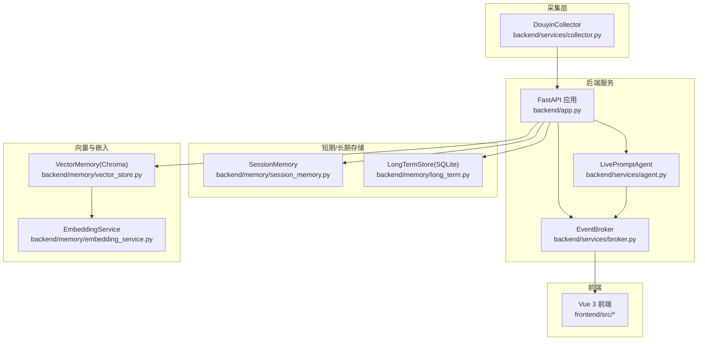
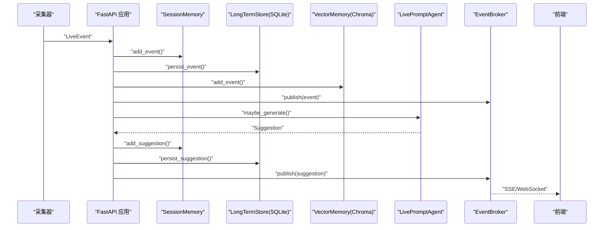
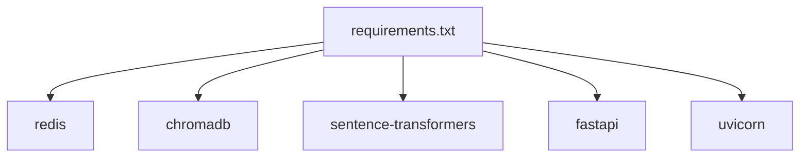

# 性能优化

<cite>
**本文引用的文件**
- [backend/app.py](file://backend/app.py)
- [backend/config.py](file://backend/config.py)
- [backend/memory/session_memory.py](file://backend/memory/session_memory.py)
- [backend/memory/vector_store.py](file://backend/memory/vector_store.py)
- [backend/memory/embedding_service.py](file://backend/memory/embedding_service.py)
- [backend/memory/long_term.py](file://backend/memory/long_term.py)
- [backend/services/broker.py](file://backend/services/broker.py)
- [backend/services/agent.py](file://backend/services/agent.py)
- [backend/schemas/live.py](file://backend/schemas/live.py)
- [requirements.txt](file://requirements.txt)
- [README.md](file://README.md)
- [USAGE.md](file://USAGE.md)
- [data/DATABASE.md](file://data/DATABASE.md)
- [tests/test_vector_store.py](file://tests/test_vector_store.py)
- [tests/test_embedding_service.py](file://tests/test_embedding_service.py)
</cite>

## 目录
1. [简介](#简介)
2. [项目结构](#项目结构)
3. [核心组件](#核心组件)
4. [架构总览](#架构总览)
5. [详细组件分析](#详细组件分析)
6. [依赖分析](#依赖分析)
7. [性能考量](#性能考量)
8. [故障排查指南](#故障排查指南)
9. [结论](#结论)
10. [附录](#附录)

## 简介
本指南聚焦于 DouYin_llm 项目的性能优化，围绕以下方面给出系统性建议与实操要点：
- 缓存策略：SessionMemory 的 TTL 配置、Redis 共享机制与内存管理优化
- 数据库优化：SQLite 查询优化、索引设计、事务处理与批量操作
- 网络优化：WebSocket 连接池、SSE 流优化与 API 响应时间优化
- 向量数据库性能调优：Chroma 索引优化、嵌入向量压缩与查询性能监控
- LLM 推理优化：模型批处理、请求合并与超时控制
- 性能监控指标与基准测试方法

## 项目结构
后端采用 FastAPI 提供 REST/SSE/WebSocket 接口，核心处理链路为：采集器将原始事件标准化为 LiveEvent，随后写入短期会话内存（SessionMemory，Redis/内存）、长期存储（SQLite/Chroma）与向量索引，再由 LivePromptAgent 基于 LLM 或启发式规则生成建议，最后通过 SSE/WebSocket 推送至前端。

图表来源
- [backend/app.py:108-126](file://backend/app.py#L108-L126)
- [backend/services/broker.py:10-40](file://backend/services/broker.py#L10-L40)
- [backend/memory/session_memory.py:17-113](file://backend/memory/session_memory.py#L17-L113)
- [backend/memory/long_term.py:44-967](file://backend/memory/long_term.py#L44-L967)
- [backend/memory/vector_store.py:59-317](file://backend/memory/vector_store.py#L59-L317)
- [backend/memory/embedding_service.py:18-102](file://backend/memory/embedding_service.py#L18-L102)

章节来源
- [README.md:5-17](file://README.md#L5-L17)
- [backend/app.py:108-126](file://backend/app.py#L108-L126)

## 核心组件
- SessionMemory：短期会话窗口（Redis/内存），支持 TTL 控制与热数据淘汰
- LongTermStore(SQLite)：事件、建议、观众画像、礼物、会话、笔记等持久化
- VectorMemory(Chroma)：事件与观众记忆的向量检索，支持本地/云端嵌入
- EmbeddingService：本地/云端嵌入后端切换与降级
- LivePromptAgent：LLM/启发式建议生成，含错误回退与状态上报
- EventBroker：SSE/WebSocket 广播器

章节来源
- [backend/memory/session_memory.py:17-113](file://backend/memory/session_memory.py#L17-L113)
- [backend/memory/long_term.py:44-967](file://backend/memory/long_term.py#L44-L967)
- [backend/memory/vector_store.py:59-317](file://backend/memory/vector_store.py#L59-L317)
- [backend/memory/embedding_service.py:18-102](file://backend/memory/embedding_service.py#L18-L102)
- [backend/services/agent.py:23-496](file://backend/services/agent.py#L23-L496)
- [backend/services/broker.py:10-40](file://backend/services/broker.py#L10-L40)

## 架构总览
下图展示事件从采集到前端推送的关键路径与性能相关节点。

图表来源
- [backend/app.py:73-102](file://backend/app.py#L73-L102)
- [backend/memory/session_memory.py:42-84](file://backend/memory/session_memory.py#L42-L84)
- [backend/memory/long_term.py:454-500](file://backend/memory/long_term.py#L454-L500)
- [backend/memory/vector_store.py:149-171](file://backend/memory/vector_store.py#L149-L171)
- [backend/services/broker.py:28-39](file://backend/services/broker.py#L28-L39)
- [backend/services/agent.py:105-142](file://backend/services/agent.py#L105-L142)

## 详细组件分析

### 缓存策略：SessionMemory 与 Redis 共享
- TTL 配置：通过 Settings 中的 SESSION_TTL_SECONDS 控制 Redis 热数据生命周期；内存模式下通过固定长度队列实现窗口淘汰
- Redis 共享：当配置 Redis_URL 时，SessionMemory 使用 Redis 列表存储事件与建议，并设置过期时间；未配置时回退到进程内字典+双端队列
- 内存管理：内存模式下事件与建议分别维护固定容量的双端队列，避免无限增长；Redis 模式下通过 lpush/ltrim 与 expire 控制容量与过期

优化建议
- 合理设置 TTL：根据峰值并发与事件密度调整 SESSION_TTL_SECONDS，避免过早过期导致热点丢失
- 容量与窗口：结合业务需求调整事件/建议窗口大小（当前分别为 120/40），平衡内存占用与上下文完整性
- Redis 连接：生产环境建议使用连接池与合适的超时配置，避免阻塞主线程

章节来源
- [backend/config.py:56](file://backend/config.py#L56)
- [backend/memory/session_memory.py:17-113](file://backend/memory/session_memory.py#L17-L113)
- [backend/app.py:28](file://backend/app.py#L28)

### 数据库优化：SQLite 查询、索引、事务与批量
- 表结构与索引：events、viewer_profiles、viewer_gifts、live_sessions、viewer_notes、viewer_memories 等表均建立复合索引，覆盖常见查询条件
- 事务与一致性：使用连接工厂与行工厂，确保读写一致性；对重建聚合与增量更新采用原子操作
- 批量写入：事件写入采用 INSERT OR REPLACE 与批量 upsert，减少往返次数
- 读优化：按 room_id/ts 顺序查询，限制返回条数，避免全表扫描

优化建议
- 查询裁剪：仅选择必要字段，避免 SELECT *
- 索引维护：定期评估查询模式，新增或调整索引以覆盖高频过滤条件
- 事务边界：将相关写入放入单事务，减少锁竞争；对只读查询使用只读事务
- 分页与限流：对外部接口增加分页与速率限制，避免一次性返回过多数据

章节来源
- [backend/memory/long_term.py:63-187](file://backend/memory/long_term.py#L63-L187)
- [backend/memory/long_term.py:216-229](file://backend/memory/long_term.py#L216-L229)
- [backend/memory/long_term.py:454-488](file://backend/memory/long_term.py#L454-L488)
- [data/DATABASE.md:1-151](file://data/DATABASE.md#L1-L151)

### 网络优化：WebSocket、SSE 与 API 响应
- SSE 流：/api/events/stream 返回 server-sent events，包含重连提示与按房间过滤逻辑
- WebSocket：/ws/live 先下发 bootstrap 快照，随后持续推送事件、建议、统计与模型状态
- 广播器：EventBroker 使用 asyncio.Queue 管理订阅队列，自动清理阻塞队列

优化建议
- 连接池：WebSocket 与 SSE 通道建议引入连接池与心跳检测，避免资源泄露
- 背压控制：对订阅队列设置最大长度与丢弃策略，防止内存膨胀
- 压缩与分片：对大对象序列化采用高效格式，必要时启用传输压缩
- 超时与重试：为上游依赖（LLM、嵌入服务）设置合理超时与指数退避

章节来源
- [backend/app.py:252-271](file://backend/app.py#L252-L271)
- [backend/app.py:274-285](file://backend/app.py#L274-L285)
- [backend/services/broker.py:10-40](file://backend/services/broker.py#L10-L40)

### 向量数据库性能调优：Chroma、嵌入与查询
- 向量索引：VectorMemory 基于 Chroma 持久化集合，事件与观众记忆分别维护独立集合
- 嵌入服务：支持本地（SentenceTransformer）与云端（OpenAI 兼容）嵌入，失败时回退到哈希嵌入函数
- 查询与排序：相似度计算后进行阈值过滤与二次排序（时间戳、置信度、召回次数等）
- 降级与回退：Chroma 不可用时使用内存索引；嵌入失败时使用哈希嵌入

优化建议
- 索引参数：根据数据规模与维度调整 Chroma 的索引参数（如向量维度、距离度量）
- 嵌入批处理：EmbeddingService 支持批量编码，建议在批量写入时合并请求
- 查询限流：对相似查询设置查询上限与最小分数阈值，避免过度扫描
- 监控指标：记录查询耗时、召回数量、阈值命中率等指标，指导参数调优

章节来源
- [backend/memory/vector_store.py:59-317](file://backend/memory/vector_store.py#L59-L317)
- [backend/memory/embedding_service.py:18-102](file://backend/memory/embedding_service.py#L18-L102)
- [tests/test_vector_store.py:20-103](file://tests/test_vector_store.py#L20-L103)
- [tests/test_embedding_service.py:23-83](file://tests/test_embedding_service.py#L23-L83)

### LLM 推理优化：批处理、合并与超时
- 生成路径：LivePromptAgent 优先尝试在线模型，失败回退启发式规则；同时更新模型状态
- 超时控制：LLM 请求设置超时，异常分类记录，便于快速定位
- 上下文构建：结合相似历史、观众记忆与用户画像，减少冗余字段

优化建议
- 请求合并：对短时间内多个建议请求进行合并，统一生成后再拆分下发
- 批量嵌入：在相似查询与记忆检索中批量生成嵌入，降低网络往返
- 超时与重试：为 LLM 与嵌入服务设置合理的超时与重试策略，避免阻塞主线程
- 模型参数：根据业务场景调整 temperature、max_tokens 等参数，平衡质量与时延

章节来源
- [backend/services/agent.py:23-496](file://backend/services/agent.py#L23-L496)
- [backend/config.py:62](file://backend/config.py#L62)
- [backend/config.py:68](file://backend/config.py#L68)

## 依赖分析
- 可选依赖：Redis、Chroma、sentence-transformers
- 运行时依赖：FastAPI、Uvicorn、websocket-client
- 项目通过 requirements.txt 管理依赖，建议在生产环境锁定版本

图表来源
- [requirements.txt:1-6](file://requirements.txt#L1-L6)

章节来源
- [requirements.txt:1-6](file://requirements.txt#L1-L6)

## 性能考量
- 缓存层
  - Redis 模式下，TTL 与过期策略直接影响热数据命中率；建议结合峰值流量与事件密度动态调整
  - 内存模式下，固定窗口大小与队列长度需与前端渲染频率匹配，避免频繁截断
- 存储层
  - SQLite 读写分离与索引优化是关键；对高频查询建立合适索引，避免全表扫描
  - 批量写入与事务边界优化可显著降低 IO 压力
- 向量检索
  - 嵌入维度与相似度阈值影响召回质量与时延；建议通过 A/B 实验确定最优参数
  - Chroma 索引参数与磁盘 I/O 配置需与数据规模匹配
- LLM 推理
  - 超时与回退策略保障稳定性；批处理与请求合并可提升吞吐
- 网络与广播
  - SSE/WebSocket 的背压控制与连接池配置决定用户体验与资源占用

## 故障排查指南
- 模型状态异常
  - 检查 /health 与模型状态接口，确认 LLM 模型名、Base URL、API Key 与超时配置
- 嵌入失败
  - 观察嵌入服务日志，确认云端/本地模式与超时设置；必要时回退到哈希嵌入
- 向量检索异常
  - 检查 Chroma 集合是否存在、索引是否损坏；必要时重建集合
- SQLite 写入慢
  - 检查索引是否缺失、事务是否过大、是否有锁竞争
- SSE/WebSocket 推送卡顿
  - 检查 EventBroker 队列长度与订阅端消费速度，避免队列积压

章节来源
- [backend/services/agent.py:37-70](file://backend/services/agent.py#L37-L70)
- [backend/memory/embedding_service.py:33-48](file://backend/memory/embedding_service.py#L33-L48)
- [backend/memory/vector_store.py:164-171](file://backend/memory/vector_store.py#L164-L171)
- [backend/memory/long_term.py:454-488](file://backend/memory/long_term.py#L454-L488)
- [backend/services/broker.py:28-39](file://backend/services/broker.py#L28-L39)

## 结论
通过在缓存、存储、向量检索、LLM 推理与网络广播等层面的系统性优化，DouYin_llm 可在保证实时性的同时提升稳定性与可扩展性。建议以监控指标与基准测试为依据，持续迭代参数与架构，逐步引入连接池、批处理与更精细的索引策略。

## 附录

### 性能监控指标建议
- 缓存层
  - Redis/内存命中率、过期比例、队列长度
- 存储层
  - SQLite 读写延迟、事务耗时、索引命中率
- 向量检索
  - 嵌入耗时、相似查询耗时、召回数量、阈值命中率
- LLM 推理
  - 生成耗时、成功率、回退比例、错误类型分布
- 网络层
  - SSE/WebSocket 连接数、消息延迟、队列积压

### 基准测试方法
- 缓存层：模拟峰值事件速率，测量不同 TTL 与窗口大小下的命中率与延迟
- 存储层：构造不同规模的数据集，对比索引存在与否的查询性能
- 向量检索：批量生成嵌入与查询，评估吞吐与延迟
- LLM 推理：固定输入，测量不同超时与批大小下的成功率与时延
- 网络层：并发连接与消息推送，评估背压与资源占用