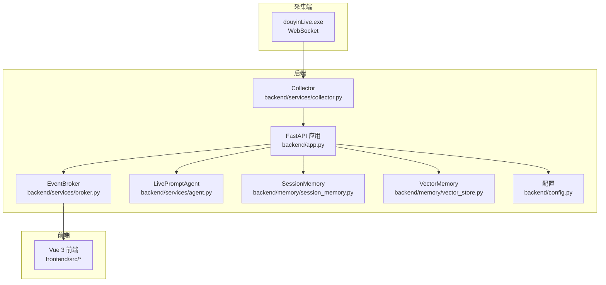
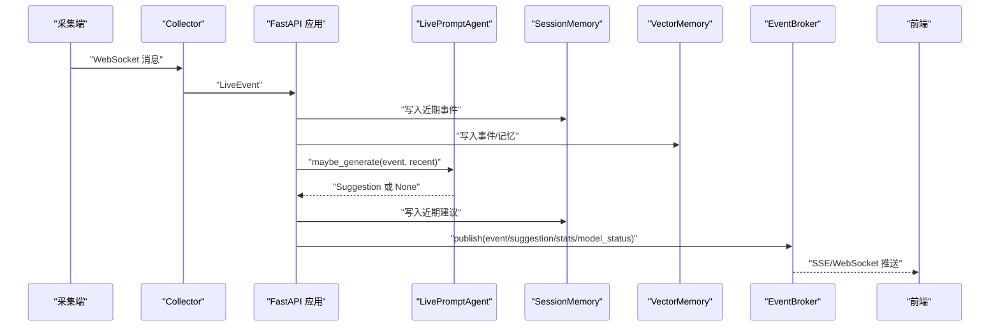

# 性能监控与指标

<cite>
**本文引用的文件**
- [README.md](file://README.md)
- [backend/app.py](file://backend/app.py)
- [backend/config.py](file://backend/config.py)
- [backend/services/agent.py](file://backend/services/agent.py)
- [backend/services/broker.py](file://backend/services/broker.py)
- [backend/services/collector.py](file://backend/services/collector.py)
- [backend/memory/session_memory.py](file://backend/memory/session_memory.py)
- [backend/memory/vector_store.py](file://backend/memory/vector_store.py)
- [backend/schemas/live.py](file://backend/schemas/live.py)
- [requirements.txt](file://requirements.txt)
- [start_all.ps1](file://start_all.ps1)
- [start_backend_qwen.ps1](file://start_backend_qwen.ps1)
- [start_frontend.ps1](file://start_frontend.ps1)
</cite>

## 目录
1. [简介](#简介)
2. [项目结构](#项目结构)
3. [核心组件](#核心组件)
4. [架构总览](#架构总览)
5. [关键性能指标定义](#关键性能指标定义)
6. [监控指标采集方法](#监控指标采集方法)
7. [性能基准测试方法](#性能基准测试方法)
8. [告警机制配置](#告警机制配置)
9. [性能数据分析与趋势预测](#性能数据分析与趋势预测)
10. [故障排查指南](#故障排查指南)
11. [结论](#结论)

## 简介
本指南围绕 DouYin_llm 项目的性能监控与指标体系，结合现有代码结构与运行流程，给出可落地的指标定义、采集方法、基准测试与告警配置建议。项目采用 FastAPI 提供后端服务，通过内置采集器对接抖音直播 WebSocket，经事件归一化、记忆抽取、LLM/规则引擎生成提词建议，并通过 SSE/WebSocket 推送至前端。当前仓库未内置 APM 或指标导出，因此本指南提供基于日志、性能采样与外部工具集成的方案。

## 项目结构
项目主要由三部分构成：采集端（tool/douyinLive.exe）、后端（FastAPI + 业务逻辑）、前端（Vue 3）。后端通过事件总线将处理结果广播到 SSE 与 WebSocket，前端通过 Store 与组件展示状态与事件流。

图表来源
- [backend/app.py:108-126](file://backend/app.py#L108-L126)
- [backend/services/collector.py:38-98](file://backend/services/collector.py#L38-L98)
- [backend/services/broker.py:10-40](file://backend/services/broker.py#L10-L40)
- [backend/services/agent.py:23-496](file://backend/services/agent.py#L23-L496)
- [backend/memory/session_memory.py:17-113](file://backend/memory/session_memory.py#L17-L113)
- [backend/memory/vector_store.py:59-317](file://backend/memory/vector_store.py#L59-L317)
- [backend/config.py:40-113](file://backend/config.py#L40-L113)

章节来源
- [README.md:19-44](file://README.md#L19-L44)
- [backend/app.py:108-126](file://backend/app.py#L108-L126)

## 核心组件
- 采集器（DouyinCollector）：负责连接本地 WebSocket，解析并规范化为 LiveEvent，提交到后端事件循环。
- 事件总线（EventBroker）：接收处理结果并广播到 SSE/WebSocket 订阅者。
- 提词代理（LivePromptAgent）：根据事件与上下文选择 LLM 或启发式规则生成建议，并维护模型状态。
- 会话内存（SessionMemory）：短期事件与建议缓存，支持 Redis 与进程内回退。
- 向量内存（VectorMemory）：事件与观众记忆的语义召回，支持 Chroma 与本地哈希回退。
- 配置（Settings）：集中管理运行参数，含 LLM、嵌入、会话 TTL、采集器等。

章节来源
- [backend/services/collector.py:38-266](file://backend/services/collector.py#L38-L266)
- [backend/services/broker.py:10-40](file://backend/services/broker.py#L10-L40)
- [backend/services/agent.py:23-496](file://backend/services/agent.py#L23-L496)
- [backend/memory/session_memory.py:17-113](file://backend/memory/session_memory.py#L17-L113)
- [backend/memory/vector_store.py:59-317](file://backend/memory/vector_store.py#L59-L317)
- [backend/config.py:40-113](file://backend/config.py#L40-L113)

## 架构总览
后端应用在启动时初始化采集器、内存与代理，并在生命周期内负责事件处理、状态统计与实时推送。采集器与事件总线是性能敏感链路，建议重点监控其延迟与丢弃情况。

图表来源
- [backend/services/collector.py:182-196](file://backend/services/collector.py#L182-L196)
- [backend/app.py:73-102](file://backend/app.py#L73-L102)
- [backend/services/broker.py:28-39](file://backend/services/broker.py#L28-L39)
- [backend/services/agent.py:105-142](file://backend/services/agent.py#L105-L142)
- [backend/memory/session_memory.py:42-64](file://backend/memory/session_memory.py#L42-L64)
- [backend/memory/vector_store.py:149-171](file://backend/memory/vector_store.py#L149-L171)

## 关键性能指标定义
以下指标用于衡量系统整体与关键链路的性能表现，便于定位瓶颈与评估容量。

- 响应时间（Latency）
  - 接口级：/health、/api/bootstrap、/api/room、/api/events、/api/events/stream、/ws/live
  - 事件端到端：从采集器收到消息到前端收到建议的总耗时
  - LLM 推理：Agent 生成建议的耗时（含网络与解析）
- 吞吐量（Throughput）
  - 事件速率：单位时间内处理的 LiveEvent 数量
  - 建议速率：单位时间内生成的 Suggestion 数量
  - 推送速率：SSE/WebSocket 广播的消息速率
- 错误率（Error Rate）
  - 采集器错误：WebSocket 连接异常、消息解析失败、提交到事件循环失败
  - LLM 错误：HTTP 错误、网络错误、超时、JSON 解析失败、无效负载
  - 存储错误：会话/向量写入失败（如 Redis/Chroma 不可用）
- 资源利用率（Resource Utilization）
  - CPU/内存：后端进程、采集器进程
  - 网络：LLM 推理请求的往返时间与带宽
  - 存储：Redis/Chroma 的写入与查询延迟

章节来源
- [backend/app.py:129-135](file://backend/app.py#L129-L135)
- [backend/services/collector.py:145-196](file://backend/services/collector.py#L145-L196)
- [backend/services/agent.py:302-437](file://backend/services/agent.py#L302-L437)
- [backend/memory/session_memory.py:42-112](file://backend/memory/session_memory.py#L42-L112)
- [backend/memory/vector_store.py:149-316](file://backend/memory/vector_store.py#L149-L316)

## 监控指标采集方法
- 日志分析
  - 后端日志：INFO/ERROR/WARNING 级别，覆盖采集器连接、事件处理、LLM 请求、存储写入与异常
  - 前端日志：浏览器控制台与日志文件，关注连接断开、重连、消息缺失
  - 采集器日志：douyinLive.exe 输出，关注 ping/pong、重连间隔与消息解析
- 性能采样
  - 事件端到端采样：对关键路径（采集 -> 处理 -> 生成 -> 推送）进行采样计时
  - LLM 采样：记录请求耗时、状态码、错误类型与响应体长度
  - 存储采样：记录 Redis/Chroma 的写入/查询耗时与失败次数
- APM 工具集成（建议）
  - 使用 OpenTelemetry 或同类 APM 在 FastAPI 上埋点，采集 HTTP 请求链路、异步任务与外部调用
  - 对 Agent 的 LLM 调用与向量检索分别打点，形成端到端与组件级指标
  - 结合日志与指标建立关联，便于定位慢调用与异常

章节来源
- [backend/services/collector.py:141-196](file://backend/services/collector.py#L141-L196)
- [backend/services/agent.py:330-437](file://backend/services/agent.py#L330-L437)
- [backend/memory/vector_store.py:172-230](file://backend/memory/vector_store.py#L172-L230)
- [backend/app.py:252-285](file://backend/app.py#L252-L285)

## 性能基准测试方法
- 负载测试
  - 压测采集器：模拟高并发 WebSocket 消息，观察采集器与事件循环的背压与丢弃
  - 压测后端接口：对 /api/events、/api/room、/api/events/stream、/ws/live 进行并发请求，测量 P50/P95/P99 延迟与错误率
  - 压测 LLM：在不同模型与温度、最大 token 下进行吞吐与延迟测试
- 压力测试
  - 逐步提升并发与消息速率，直至出现明显延迟上升、错误率升高或资源耗尽
  - 观察 Redis/Chroma 的写入延迟与查询延迟拐点
- 容量规划
  - 基于峰值 QPS 与平均响应时间估算后端实例数与资源配额
  - 评估 Redis/Chroma 的写入/查询能力，确定扩容阈值与副本策略

章节来源
- [backend/app.py:144-166](file://backend/app.py#L144-L166)
- [backend/services/agent.py:302-437](file://backend/services/agent.py#L302-L437)
- [backend/memory/session_memory.py:42-112](file://backend/memory/session_memory.py#L42-L112)
- [backend/memory/vector_store.py:172-316](file://backend/memory/vector_store.py#L172-L316)

## 告警机制配置
- 阈值设置
  - 采集器：连接断开次数/分钟、消息解析失败率、重连频率异常
  - 接口：/health 与关键接口 5xx 比例、P95 延迟超过阈值
  - LLM：HTTP 错误率、超时比例、JSON 解析失败率
  - 存储：Redis/Chroma 写入/查询 P95 超时、失败次数
- 通知策略
  - 多级告警：轻微（邮件/IM）、严重（电话/短信）、紧急（全量通知）
  - 降噪：同类型告警合并、静默窗口、收敛策略
- 故障自动恢复
  - 自动重启：后端进程退出后自动拉起
  - 采集器自愈：检测到异常断开后自动重连，指数退避
  - LLM 失败回退：触发启发式规则，降低对 LLM 的依赖

章节来源
- [backend/services/collector.py:118-140](file://backend/services/collector.py#L118-L140)
- [backend/services/agent.py:200-216](file://backend/services/agent.py#L200-L216)
- [backend/app.py:108-117](file://backend/app.py#L108-L117)

## 性能数据分析与趋势预测
- 数据分析
  - 按小时/天聚合延迟分布、错误率与吞吐量，识别周期性波动
  - 对比不同模型与参数组合的性能差异，指导参数优化
- 趋势预测
  - 基于历史数据拟合线性/指数趋势，预测未来容量需求
  - 对关键指标设置动态阈值，随业务增长自适应调整

## 故障排查指南
- 采集器问题
  - 症状：连接断开、消息丢失、重连频繁
  - 排查：检查 ROOM_ID、采集器地址与端口、网络连通性、ping 间隔与重连延迟
- 后端接口问题
  - 症状：/health 异常、SSE/WebSocket 推送中断
  - 排查：查看事件总线订阅队列是否积压、广播失败、前端连接断开
- LLM 问题
  - 症状：生成失败、超时、错误率升高
  - 排查：检查模型地址、API Key、超时与最大 token、网络连通性
- 存储问题
  - 症状：写入失败、查询缓慢
  - 排查：检查 Redis/Chroma 可用性、磁盘空间、索引重建

章节来源
- [backend/services/collector.py:61-98](file://backend/services/collector.py#L61-L98)
- [backend/services/broker.py:28-39](file://backend/services/broker.py#L28-L39)
- [backend/services/agent.py:330-437](file://backend/services/agent.py#L330-L437)
- [backend/memory/session_memory.py:42-112](file://backend/memory/session_memory.py#L42-L112)
- [backend/memory/vector_store.py:172-316](file://backend/memory/vector_store.py#L172-L316)

## 结论
通过明确关键性能指标、完善日志与采样、引入 APM 与告警，结合基准测试与容量规划，可有效提升 DouYin_llm 的可观测性与稳定性。建议优先落地采集器与后端接口的监控，随后扩展到 LLM 与存储链路，持续优化参数与资源配置，保障直播场景下的低延迟与高可用。