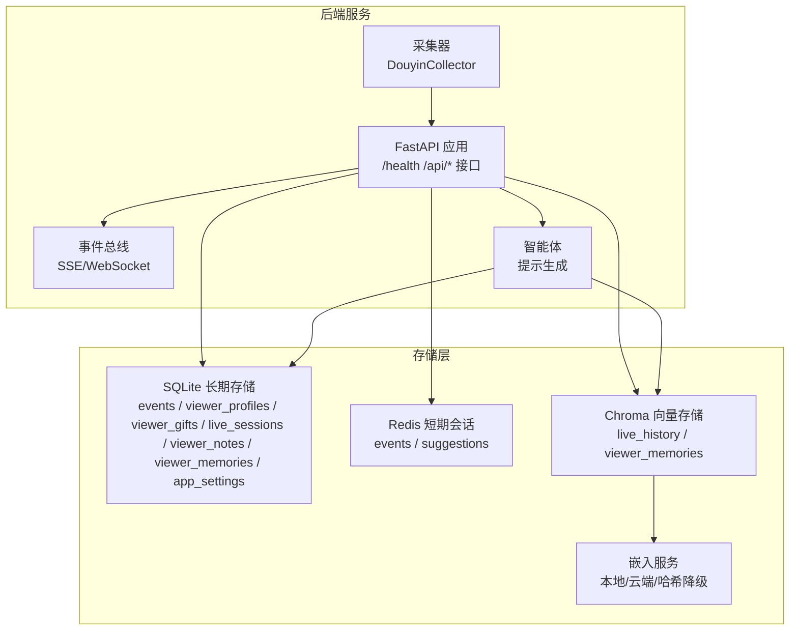
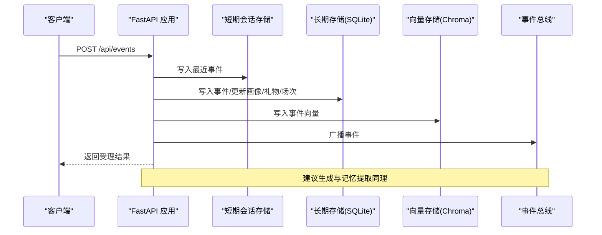
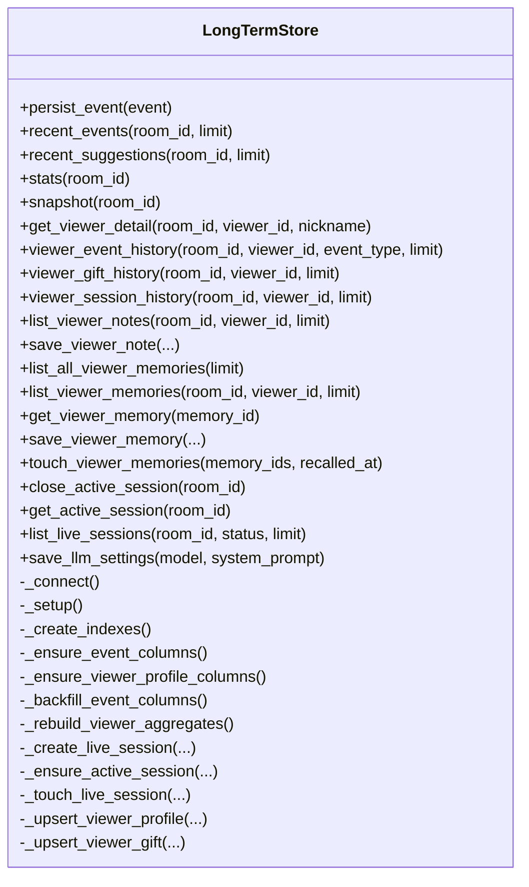
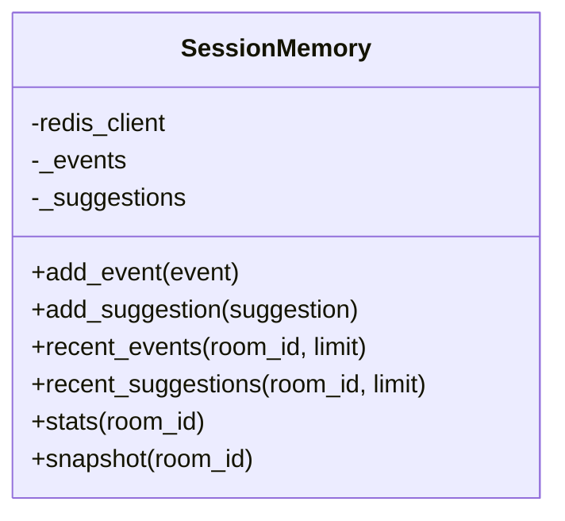
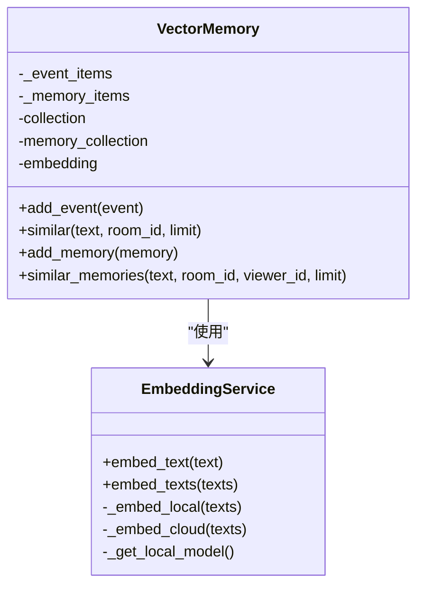
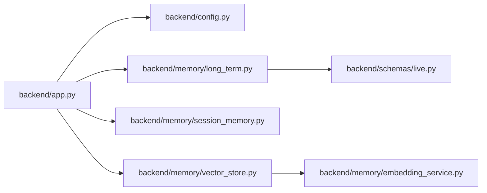

# 数据库优化

<cite>
**本文引用的文件**
- [data/DATABASE.md](file://data/DATABASE.md)
- [backend/config.py](file://backend/config.py)
- [backend/memory/long_term.py](file://backend/memory/long_term.py)
- [backend/memory/session_memory.py](file://backend/memory/session_memory.py)
- [backend/memory/vector_store.py](file://backend/memory/vector_store.py)
- [backend/memory/embedding_service.py](file://backend/memory/embedding_service.py)
- [backend/app.py](file://backend/app.py)
- [backend/schemas/live.py](file://backend/schemas/live.py)
- [tests/test_long_term.py](file://tests/test_long_term.py)
- [requirements.txt](file://requirements.txt)
</cite>

## 目录
1. [简介](#简介)
2. [项目结构](#项目结构)
3. [核心组件](#核心组件)
4. [架构总览](#架构总览)
5. [详细组件分析](#详细组件分析)
6. [依赖关系分析](#依赖关系分析)
7. [性能考量](#性能考量)
8. [故障排查指南](#故障排查指南)
9. [结论](#结论)
10. [附录](#附录)

## 简介
本指南聚焦于DouYin_llm项目的数据库优化，围绕SQLite查询与事务优化、索引设计、查询计划分析、慢查询优化、连接池与预编译语句、批量写入与并发访问、表结构与字段类型选择、分区策略以及性能监控与维护最佳实践进行系统性梳理。文档同时结合项目现有代码与数据模型，给出可落地的优化建议与实施路径。

## 项目结构
项目采用“后端服务 + 内存/向量存储 + 配置”的分层组织：
- 后端服务通过FastAPI提供REST/WebSocket接口，负责事件采集、持久化、会话状态与流式输出。
- 长期存储采用SQLite（events、viewer_profiles、viewer_gifts、live_sessions、viewer_notes、viewer_memories、app_settings）。
- 短期会话存储优先使用Redis，若不可用则回退至进程内队列。
- 向量记忆存储采用Chroma（可持久化），并提供本地/云端嵌入服务降级方案。
- 配置集中于Settings，支持环境变量注入与默认值保障本地可运行。

图表来源
- [backend/app.py:108-126](file://backend/app.py#L108-L126)
- [backend/memory/long_term.py:44-63](file://backend/memory/long_term.py#L44-L63)
- [backend/memory/session_memory.py:17-31](file://backend/memory/session_memory.py#L17-L31)
- [backend/memory/vector_store.py:59-84](file://backend/memory/vector_store.py#L59-L84)
- [backend/memory/embedding_service.py:18-48](file://backend/memory/embedding_service.py#L18-L48)

章节来源
- [backend/app.py:108-126](file://backend/app.py#L108-L126)
- [backend/config.py:40-113](file://backend/config.py#L40-L113)

## 核心组件
- SQLite长期存储层：负责事件流水、观众画像、礼物聚合、直播场次、备注、向量记忆与设置项的持久化与查询。
- 短期会话存储层：优先Redis，回退进程内队列，用于高频读写与低延迟场景。
- 向量存储层：Chroma持久化集合，配合嵌入服务实现语义检索与召回。
- 配置中心：集中管理数据库路径、Redis地址、嵌入模型参数等。

章节来源
- [backend/memory/long_term.py:44-63](file://backend/memory/long_term.py#L44-L63)
- [backend/memory/session_memory.py:17-31](file://backend/memory/session_memory.py#L17-L31)
- [backend/memory/vector_store.py:59-84](file://backend/memory/vector_store.py#L59-L84)
- [backend/config.py:40-113](file://backend/config.py#L40-L113)

## 架构总览
后端服务在启动时初始化各存储组件，并在事件处理流程中协调写入与查询：
- 事件到达：写入短期会话（Redis/队列）、长期存储（SQLite）、向量存储（Chroma）。
- 建议生成：基于短期窗口统计与向量检索，持久化建议并推送到客户端。
- 查询接口：优先短期缓存，缺失时回退到SQLite；向量检索通过Chroma完成。

图表来源
- [backend/app.py:73-102](file://backend/app.py#L73-L102)
- [backend/memory/long_term.py:454-488](file://backend/memory/long_term.py#L454-L488)
- [backend/memory/session_memory.py:42-64](file://backend/memory/session_memory.py#L42-L64)
- [backend/memory/vector_store.py:149-171](file://backend/memory/vector_store.py#L149-L171)

## 详细组件分析

### SQLite长期存储层（LongTermStore）
- 连接工厂与事务边界：使用自定义Connection工厂，确保连接退出时自动关闭；每个业务操作在独立连接上下文中执行，避免跨调用共享状态。
- 索引设计：已建立多组复合索引，覆盖常见查询模式（房间+时间、房间+观众+时间、房间+状态+最后事件时间等）。
- DDL迁移：动态检测并补齐缺失列，确保Schema演进兼容。
- 写入策略：事件写入采用INSERT OR REPLACE/UPSERT，配合ON CONFLICT更新聚合表；重建聚合时全量扫描事件并逐条重算。
- 查询接口：提供近期事件、建议、统计、观众画像、礼物历史、会话历史、备注、记忆等查询。

图表来源
- [backend/memory/long_term.py:44-63](file://backend/memory/long_term.py#L44-L63)
- [backend/memory/long_term.py:216-229](file://backend/memory/long_term.py#L216-L229)
- [backend/memory/long_term.py:454-488](file://backend/memory/long_term.py#L454-L488)

章节来源
- [backend/memory/long_term.py:44-63](file://backend/memory/long_term.py#L44-L63)
- [backend/memory/long_term.py:216-229](file://backend/memory/long_term.py#L216-L229)
- [backend/memory/long_term.py:454-488](file://backend/memory/long_term.py#L454-L488)

### 短期会话存储层（SessionMemory）
- 存储介质：优先Redis（列表+过期），否则回退进程内双端队列。
- TTL控制：Redis模式下通过TTL控制热数据生命周期，避免无限增长。
- 读写接口：提供最近事件/建议的读写与统计、快照构造。

图表来源
- [backend/memory/session_memory.py:17-31](file://backend/memory/session_memory.py#L17-L31)
- [backend/memory/session_memory.py:42-84](file://backend/memory/session_memory.py#L42-L84)

章节来源
- [backend/memory/session_memory.py:17-31](file://backend/memory/session_memory.py#L17-L31)
- [backend/memory/session_memory.py:42-84](file://backend/memory/session_memory.py#L42-L84)

### 向量存储层（VectorMemory）
- 集合管理：Chroma持久化集合，事件与记忆分别维护集合；无Chroma时使用进程内降级索引。
- 嵌入函数：支持本地SentenceTransformer、云端OpenAI/DashScope、哈希降级三种模式。
- 查询排序：基于距离得分与元数据（事件类型、时间戳、记忆置信度、召回次数）进行重排，提升相关性。

图表来源
- [backend/memory/vector_store.py:59-84](file://backend/memory/vector_store.py#L59-L84)
- [backend/memory/vector_store.py:149-230](file://backend/memory/vector_store.py#L149-L230)
- [backend/memory/vector_store.py:257-316](file://backend/memory/vector_store.py#L257-L316)
- [backend/memory/embedding_service.py:18-48](file://backend/memory/embedding_service.py#L18-L48)

章节来源
- [backend/memory/vector_store.py:59-84](file://backend/memory/vector_store.py#L59-L84)
- [backend/memory/embedding_service.py:18-48](file://backend/memory/embedding_service.py#L18-L48)

### 数据库表结构与常用查询
- 表清单与用途：events、viewer_profiles、viewer_gifts、live_sessions、viewer_notes、viewer_memories、app_settings。
- 关键字段与索引：events按房间+时间倒序、房间+观众+时间倒序、房间+事件类型+时间倒序；viewer_profiles按房间+昵称；viewer_gifts按房间+观众+最后发送时间倒序；live_sessions按房间+状态+最后事件时间倒序；viewer_notes按房间+观众+更新时间倒序；viewer_memories按房间+观众+更新时间倒序。
- 常用查询：观众画像、评论历史、礼物聚合、活动场次、备注列表等。

章节来源
- [data/DATABASE.md:16-151](file://data/DATABASE.md#L16-L151)
- [backend/memory/long_term.py:216-229](file://backend/memory/long_term.py#L216-L229)

## 依赖关系分析
- 应用层依赖：FastAPI、事件总线、智能体、采集器。
- 存储层依赖：SQLite（Python内置）、Redis（可选）、Chroma（可选）。
- 配置依赖：Settings集中管理数据库路径、Redis地址、嵌入模型参数等。

图表来源
- [backend/app.py:13-35](file://backend/app.py#L13-L35)
- [backend/config.py:40-113](file://backend/config.py#L40-L113)
- [backend/memory/long_term.py:44-63](file://backend/memory/long_term.py#L44-L63)
- [backend/memory/session_memory.py:17-31](file://backend/memory/session_memory.py#L17-L31)
- [backend/memory/vector_store.py:59-84](file://backend/memory/vector_store.py#L59-L84)
- [backend/memory/embedding_service.py:18-48](file://backend/memory/embedding_service.py#L18-L48)
- [backend/schemas/live.py:29-44](file://backend/schemas/live.py#L29-L44)

章节来源
- [backend/app.py:13-35](file://backend/app.py#L13-L35)
- [requirements.txt:1-6](file://requirements.txt#L1-6)

## 性能考量

### SQLite查询优化
- 索引设计策略
  - 已有索引覆盖常见过滤条件（房间、观众、事件类型、状态、时间）。建议对高选择性的查询添加复合索引，如针对“房间+事件类型+时间”和“房间+昵称”的组合。
  - 对viewer_profiles的last_seen_at、viewer_gifts的last_sent_at等热点字段，考虑建立单列索引以加速排序与过滤。
- 查询计划分析
  - 使用EXPLAIN QUERY PLAN或PRAGMA query_only分析SQL执行路径，确认是否命中预期索引。
  - 对复杂JOIN（如viewer_session_history）应关注GROUP BY与LEFT JOIN的顺序与条件，避免全表扫描。
- 慢查询优化
  - 将频繁的聚合查询（如stats、viewer_event_history）拆分为增量更新与定期重建两种策略，减少在线写入时的重算成本。
  - 对大结果集的ORDER BY + LIMIT，优先确保排序字段在索引中，避免临时表排序。

章节来源
- [backend/memory/long_term.py:216-229](file://backend/memory/long_term.py#L216-L229)
- [backend/memory/long_term.py:538-554](file://backend/memory/long_term.py#L538-L554)
- [backend/memory/long_term.py:600-620](file://backend/memory/long_term.py#L600-L620)
- [backend/memory/long_term.py:621-632](file://backend/memory/long_term.py#L621-L632)
- [backend/memory/long_term.py:634-652](file://backend/memory/long_term.py#L634-L652)
- [backend/memory/long_term.py:654-666](file://backend/memory/long_term.py#L654-L666)

### 事务处理优化
- 批量插入
  - 在重建聚合（如_rebuild_viewer_aggregates）时，建议使用事务包裹批量INSERT/UPDATE，减少WAL日志与fsync开销。
  - 对高频写入场景（如事件写入），保持每个操作在独立连接上下文内，避免长事务导致锁竞争。
- 事务边界控制
  - 采用“写入即提交”的策略，避免长时间持有事务；必要时使用显式BEGIN/COMMIT包裹批量操作。
- 并发访问优化
  - SQLite默认在写入时加锁，建议通过连接池与连接复用降低锁竞争；对于高并发写入，可考虑分表或分库策略（见分区策略）。

章节来源
- [backend/memory/long_term.py:438-453](file://backend/memory/long_term.py#L438-L453)
- [backend/memory/long_term.py:454-488](file://backend/memory/long_term.py#L454-L488)

### 数据库连接池与预编译语句
- 连接池配置
  - 当前实现为每个操作新建连接并在退出时关闭，适合低并发场景。对于高并发，建议引入连接池（如sqlite3.pool）以复用连接、减少握手与WAL切换成本。
- 预编译语句
  - 所有写入均使用参数化SQL，有效防止SQL注入并提升执行计划复用率。
- 连接复用策略
  - 对只读查询（如recent_events、stats）可考虑短连接复用，但需注意事务隔离级别与一致性要求。

章节来源
- [backend/memory/long_term.py:49-54](file://backend/memory/long_term.py#L49-L54)
- [tests/test_long_term.py:8-26](file://tests/test_long_term.py#L8-L26)

### 表结构优化
- 字段类型选择
  - 时间戳统一使用整型（毫秒/秒），便于排序与范围查询；JSON字段使用TEXT存储，避免类型不一致。
  - 主键与外键：events使用event_id为主键；viewer_profiles、viewer_gifts使用复合主键（room_id, viewer_id）或（room_id, viewer_id, gift_name）。
- 约束设计
  - 使用NOT NULL与DEFAULT值确保数据完整性；对枚举类字段（如event_type、status）建议在应用层校验或使用CHECK约束。
- 分区策略
  - 按时间分区（如按天/周）可显著降低大表扫描范围；对events表可考虑按ts字段进行物理分片或逻辑分表。
  - 对viewer_memories等大表，可按room_id进行水平分片，减少单表膨胀。

章节来源
- [data/DATABASE.md:16-151](file://data/DATABASE.md#L16-L151)
- [backend/memory/long_term.py:67-182](file://backend/memory/long_term.py#L67-L182)

### 性能监控指标与维护最佳实践
- 监控指标
  - SQLite：事务提交耗时、索引命中率、锁等待时间、WAL大小、页命中率。
  - Redis：命令耗时分布、内存使用、过期键比例、网络延迟。
  - Chroma：集合大小、查询耗时、嵌入请求失败率。
- 维护最佳实践
  - 定期执行VACUUM与ANALYZE，优化碎片与统计信息。
  - 对大表执行DDL变更时使用在线迁移（如添加列、重命名列）。
  - 设置合理的TTL与清理策略，避免短期存储无限增长。

章节来源
- [backend/memory/session_memory.py:18-31](file://backend/memory/session_memory.py#L18-L31)
- [backend/memory/vector_store.py:59-84](file://backend/memory/vector_store.py#L59-L84)

## 故障排查指南
- 连接与事务问题
  - 若出现“数据库忙”或锁超时，检查是否存在长事务或高并发写入；考虑减少批量操作粒度或引入连接池。
  - 确认journal_mode设置为TRUNCATE以减少Windows挂载盘写入失败风险。
- 查询性能问题
  - 使用EXPLAIN QUERY PLAN确认索引使用情况；对未命中索引的查询添加合适索引。
  - 对复杂聚合查询，评估是否可拆分为增量更新与离线重建。
- 向量检索异常
  - 检查嵌入服务可用性与网络连通性；若云端失败，确认哈希降级逻辑是否生效。
  - 对Chroma不可用的情况，确认进程内降级索引是否按预期工作。

章节来源
- [tests/test_long_term.py:8-26](file://tests/test_long_term.py#L8-L26)
- [backend/memory/embedding_service.py:33-48](file://backend/memory/embedding_service.py#L33-L48)
- [backend/memory/vector_store.py:80-84](file://backend/memory/vector_store.py#L80-L84)

## 结论
DouYin_llm项目在数据库层面已具备较为完善的表结构与索引设计，结合短期Redis与长期SQLite的混合存储策略，能够满足直播场景的实时性与稳定性需求。为进一步提升性能，建议在以下方面持续优化：完善索引覆盖、引入连接池与批量事务、实施分区与分表策略、强化查询计划分析与慢查询治理、完善监控与维护流程。通过这些措施，可在保证数据一致性的同时，显著提升系统的吞吐与响应能力。

## 附录
- 数据库说明与常用查询参考：[data/DATABASE.md:101-151](file://data/DATABASE.md#L101-L151)
- 配置项与默认值：[backend/config.py:40-113](file://backend/config.py#L40-L113)
- 应用入口与组件初始化：[backend/app.py:24-35](file://backend/app.py#L24-L35)