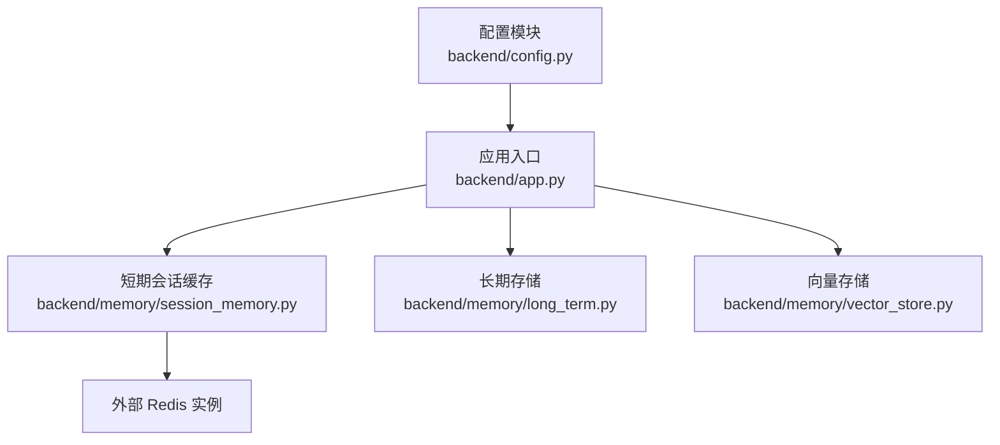
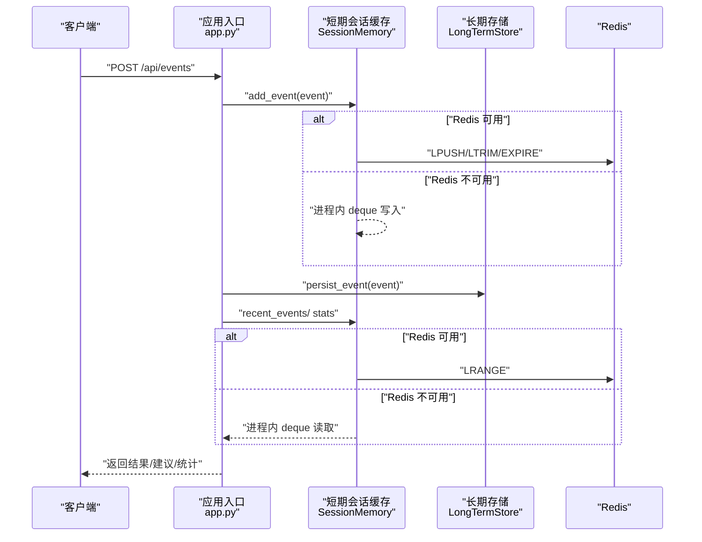
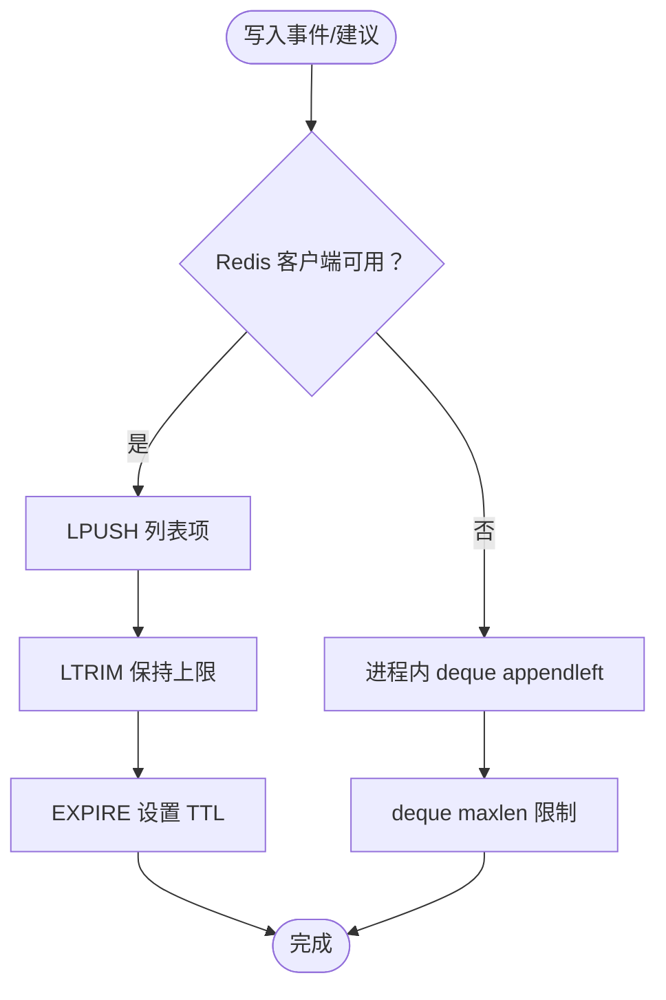
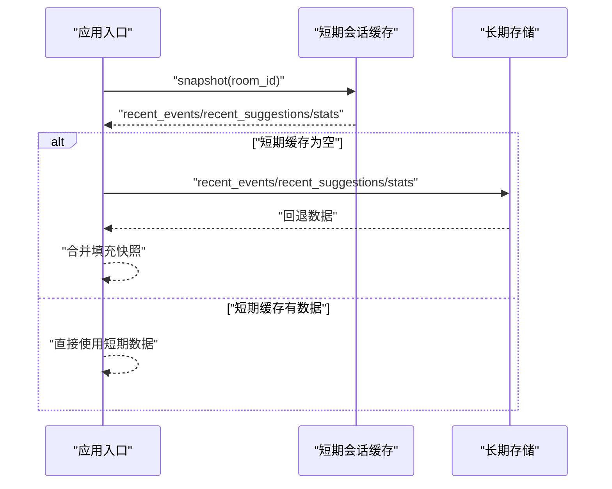
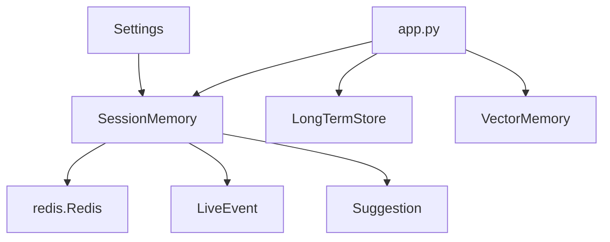

# 缓存策略

<cite>
**本文引用的文件**
- [backend/memory/session_memory.py](file://backend/memory/session_memory.py)
- [backend/config.py](file://backend/config.py)
- [backend/app.py](file://backend/app.py)
- [backend/schemas/live.py](file://backend/schemas/live.py)
- [backend/memory/vector_store.py](file://backend/memory/vector_store.py)
- [backend/memory/long_term.py](file://backend/memory/long_term.py)
</cite>

## 目录
1. [引言](#引言)
2. [项目结构](#项目结构)
3. [核心组件](#核心组件)
4. [架构总览](#架构总览)
5. [详细组件分析](#详细组件分析)
6. [依赖分析](#依赖分析)
7. [性能考虑](#性能考虑)
8. [故障排查指南](#故障排查指南)
9. [结论](#结论)
10. [附录](#附录)

## 引言
本文件聚焦于 DouYin_llm 项目的短期会话缓存策略，系统性阐述 SessionMemory 的 TTL 配置机制、缓存键设计与失效策略、Redis 共享缓存实现、内存清理策略、缓存一致性保障、性能调优参数（缓存大小限制、LRU 淘汰、内存压力处理）、监控指标与故障恢复机制，并结合实际代码路径给出配置与使用模式示例。

## 项目结构
与缓存策略直接相关的模块与职责如下：
- 后端配置：集中管理运行时参数，包括 Redis 地址与会话 TTL。
- 应用入口：初始化短期会话缓存实例，并在业务流程中调用其接口。
- 短期会话内存：提供 Redis/进程内双栈能力，负责事件与建议的写入、读取、统计与快照。
- 长期存储：提供持久化与回退读取能力，作为短期缓存的兜底。
- 向量存储：提供语义检索能力，与短期缓存共同构成“热数据 + 语义检索”的组合缓存。

图表来源
- [backend/config.py:55](file://backend/config.py#L55)
- [backend/app.py:27](file://backend/app.py#L27)
- [backend/memory/session_memory.py:17](file://backend/memory/session_memory.py#L17)
- [backend/memory/long_term.py:44](file://backend/memory/long_term.py#L44)
- [backend/memory/vector_store.py:59](file://backend/memory/vector_store.py#L59)

章节来源
- [backend/config.py:55](file://backend/config.py#L55)
- [backend/app.py:27](file://backend/app.py#L27)
- [backend/memory/session_memory.py:17](file://backend/memory/session_memory.py#L17)
- [backend/memory/long_term.py:44](file://backend/memory/long_term.py#L44)
- [backend/memory/vector_store.py:59](file://backend/memory/vector_store.py#L59)

## 核心组件
- 短期会话缓存 SessionMemory
  - 提供 Redis 与进程内双栈能力，Redis 模式下通过 TTL 控制热数据生命周期。
  - 写入：事件与建议分别维护独立列表，上限分别为 120 与 40。
  - 读取：支持按房间 ID 获取最近事件与建议，返回反序列化对象。
  - 统计与快照：基于近期窗口生成轻量统计与房间快照。
- 配置模块 Settings
  - 提供 redis_url 与 session_ttl_seconds 两个关键参数，用于初始化短期会话缓存。
- 应用入口 app.py
  - 初始化 SessionMemory 并在事件处理链路中调用其接口，同时回退至长期存储以保证一致性。
- 长期存储 LongTermStore
  - 提供持久化与回退读取能力，作为短期缓存失效后的兜底。
- 向量存储 VectorMemory
  - 提供语义检索与本地回退索引，补充短期缓存的召回能力。

章节来源
- [backend/memory/session_memory.py:17](file://backend/memory/session_memory.py#L17)
- [backend/config.py:55](file://backend/config.py#L55)
- [backend/app.py:27](file://backend/app.py#L27)
- [backend/memory/long_term.py:44](file://backend/memory/long_term.py#L44)
- [backend/memory/vector_store.py:59](file://backend/memory/vector_store.py#L59)

## 架构总览
短期会话缓存采用“Redis 热数据 + 进程内降级 + 长期存储兜底”的三层架构：
- Redis：存放最近事件与建议，配合 TTL 实现自动过期，降低延迟与提升吞吐。
- 进程内：当未配置 Redis 时，使用双向队列（deque）维持相同接口行为，保证功能可用。
- 长期存储：作为兜底与回放能力，确保前端首次加载或缓存缺失时仍可返回历史数据。

图表来源
- [backend/app.py:73](file://backend/app.py#L73)
- [backend/memory/session_memory.py:42](file://backend/memory/session_memory.py#L42)
- [backend/memory/session_memory.py:66](file://backend/memory/session_memory.py#L66)
- [backend/memory/long_term.py:454](file://backend/memory/long_term.py#L454)

## 详细组件分析

### SessionMemory：TTL 配置与过期机制
- TTL 参数来源
  - 通过配置模块 Settings 的 session_ttl_seconds 提供默认值与环境变量覆盖。
- Redis 模式下的过期控制
  - 写入事件与建议时，分别对对应列表执行裁剪与设置过期时间，确保热数据生命周期可控。
- 进程内模式下的清理策略
  - 使用固定上限的双向队列，超出容量自动丢弃最旧元素，实现 LRU 风格的内存淘汰。
- 键设计原则
  - 事件列表键：room:{room_id}:events
  - 建议列表键：room:{room_id}:suggestions
- 失效策略
  - Redis 模式：TTL 到期后键自动删除，下次访问前不再可见。
  - 进程内模式：容量达到上限时丢弃最旧元素，不涉及外部失效通知。
- 一致性保障
  - 写入短期缓存的同时持久化到长期存储，读取失败时回退至长期存储，保证前端快照与统计数据的完整性。

图表来源
- [backend/memory/session_memory.py:42](file://backend/memory/session_memory.py#L42)
- [backend/memory/session_memory.py:54](file://backend/memory/session_memory.py#L54)
- [backend/memory/session_memory.py:26](file://backend/memory/session_memory.py#L26)

章节来源
- [backend/config.py:55](file://backend/config.py#L55)
- [backend/memory/session_memory.py:17](file://backend/memory/session_memory.py#L17)
- [backend/memory/session_memory.py:42](file://backend/memory/session_memory.py#L42)
- [backend/memory/session_memory.py:54](file://backend/memory/session_memory.py#L54)
- [backend/memory/session_memory.py:66](file://backend/memory/session_memory.py#L66)

### 缓存键设计与失效策略
- 键命名规范
  - 事件列表键：room:{room_id}:events
  - 建议列表键：room:{room_id}:suggestions
- 失效策略
  - Redis：通过 EXPIRE 对键设置 TTL，到期后键被删除，避免无限增长。
  - 进程内：通过 deque 的 maxlen 实现固定容量，超出即丢弃最旧元素。
- 读取策略
  - Redis：使用 LRANGE 按需读取指定数量，返回 JSON 字符串并反序列化为对象。
  - 进程内：直接切片返回指定数量的元素。

章节来源
- [backend/memory/session_memory.py:32](file://backend/memory/session_memory.py#L32)
- [backend/memory/session_memory.py:37](file://backend/memory/session_memory.py#L37)
- [backend/memory/session_memory.py:66](file://backend/memory/session_memory.py#L66)
- [backend/memory/session_memory.py:75](file://backend/memory/session_memory.py#L75)

### 缓存一致性与回退机制
- 写入一致性
  - 事件与建议在写入短期缓存的同时持久化到长期存储，确保后续读取与回放可用。
- 读取一致性
  - 若短期缓存为空，应用入口会回退到长期存储读取最近事件与建议，并合并统计信息。
- 快照生成
  - 基于短期缓存的 recent_events/recent_suggestions 与 stats 生成 SessionSnapshot，必要时由长期存储补全。

图表来源
- [backend/app.py:60](file://backend/app.py#L60)
- [backend/memory/session_memory.py:104](file://backend/memory/session_memory.py#L104)
- [backend/memory/long_term.py:501](file://backend/memory/long_term.py#L501)

章节来源
- [backend/app.py:60](file://backend/app.py#L60)
- [backend/memory/session_memory.py:104](file://backend/memory/session_memory.py#L104)
- [backend/memory/long_term.py:501](file://backend/memory/long_term.py#L501)

### 数据模型与接口约束
- 事件与建议的数据模型定义，用于序列化/反序列化与接口交互。
- 接口约束
  - 写入方法：add_event、add_suggestion
  - 读取方法：recent_events、recent_suggestions
  - 统计与快照：stats、snapshot

章节来源
- [backend/schemas/live.py:29](file://backend/schemas/live.py#L29)
- [backend/schemas/live.py:47](file://backend/schemas/live.py#L47)
- [backend/schemas/live.py:103](file://backend/schemas/live.py#L103)
- [backend/memory/session_memory.py:42](file://backend/memory/session_memory.py#L42)
- [backend/memory/session_memory.py:54](file://backend/memory/session_memory.py#L54)
- [backend/memory/session_memory.py:66](file://backend/memory/session_memory.py#L66)
- [backend/memory/session_memory.py:75](file://backend/memory/session_memory.py#L75)
- [backend/memory/session_memory.py:86](file://backend/memory/session_memory.py#L86)
- [backend/memory/session_memory.py:104](file://backend/memory/session_memory.py#L104)

## 依赖分析
- SessionMemory 依赖
  - 配置模块 Settings：提供 redis_url 与 session_ttl_seconds。
  - Redis 客户端：在可用时启用 Redis 模式。
  - Pydantic 模型：用于事件与建议的序列化/反序列化。
- 应用入口依赖
  - 在事件处理链路中调用 SessionMemory 的写入、读取、统计与快照接口，并在必要时回退到长期存储。
- 向量存储与长期存储
  - 与短期缓存互补，提供语义检索与持久化能力。

图表来源
- [backend/config.py:55](file://backend/config.py#L55)
- [backend/memory/session_memory.py:17](file://backend/memory/session_memory.py#L17)
- [backend/schemas/live.py:29](file://backend/schemas/live.py#L29)
- [backend/schemas/live.py:47](file://backend/schemas/live.py#L47)
- [backend/app.py:27](file://backend/app.py#L27)
- [backend/memory/long_term.py:44](file://backend/memory/long_term.py#L44)
- [backend/memory/vector_store.py:59](file://backend/memory/vector_store.py#L59)

章节来源
- [backend/config.py:55](file://backend/config.py#L55)
- [backend/memory/session_memory.py:17](file://backend/memory/session_memory.py#L17)
- [backend/schemas/live.py:29](file://backend/schemas/live.py#L29)
- [backend/schemas/live.py:47](file://backend/schemas/live.py#L47)
- [backend/app.py:27](file://backend/app.py#L27)
- [backend/memory/long_term.py:44](file://backend/memory/long_term.py#L44)
- [backend/memory/vector_store.py:59](file://backend/memory/vector_store.py#L59)

## 性能考虑
- 缓存大小限制与 LRU 淘汰
  - Redis 模式：通过列表长度裁剪与 TTL 控制热数据规模，避免无限增长。
  - 进程内模式：通过 deque 的 maxlen 实现固定容量，超出即丢弃最旧元素。
- 内存压力处理
  - 当 Redis 不可用时，自动降级为进程内模式，避免单点故障导致服务不可用。
  - 长期存储作为兜底，减少短期缓存压力峰值。
- 查询与序列化
  - 事件与建议以 JSON 字符串形式存储，读取时进行反序列化，注意批量读取的序列化成本。
- 语义检索补充
  - 向量存储提供语义召回，与短期缓存形成互补，提高整体召回质量与响应速度。

章节来源
- [backend/memory/session_memory.py:26](file://backend/memory/session_memory.py#L26)
- [backend/memory/session_memory.py:42](file://backend/memory/session_memory.py#L42)
- [backend/memory/session_memory.py:54](file://backend/memory/session_memory.py#L54)
- [backend/memory/vector_store.py:149](file://backend/memory/vector_store.py#L149)
- [backend/memory/vector_store.py:232](file://backend/memory/vector_store.py#L232)

## 故障排查指南
- Redis 不可用
  - 现象：短期缓存无法使用 Redis，自动降级为进程内模式。
  - 处理：检查 redis_url 是否正确配置；若无需 Redis，确认进程内模式满足容量需求。
- TTL 未生效
  - 现象：热数据未按预期过期。
  - 处理：确认 session_ttl_seconds 已正确传入 SessionMemory；检查 Redis 服务器时间同步。
- 读取为空
  - 现象：前端快照为空或统计为 0。
  - 处理：确认事件已写入短期缓存并持久化到长期存储；检查房间 ID 是否一致。
- 写入失败
  - 现象：事件或建议未写入。
  - 处理：检查 Redis 连接状态与网络；确认写入接口调用链路正常。

章节来源
- [backend/config.py:55](file://backend/config.py#L55)
- [backend/memory/session_memory.py:17](file://backend/memory/session_memory.py#L17)
- [backend/app.py:73](file://backend/app.py#L73)

## 结论
DouYin_llm 的短期会话缓存通过 Redis/TTL 与进程内 deque 的双栈设计，在保证高吞吐与低延迟的同时提供了良好的容错能力。结合长期存储与向量存储，形成了“热数据 + 语义检索 + 持久化兜底”的完整缓存体系。通过合理配置 TTL 与容量上限，可在不同负载场景下获得稳定的服务质量。

## 附录

### 缓存配置与使用模式
- 配置项
  - redis_url：Redis 连接地址，留空则禁用 Redis。
  - session_ttl_seconds：Redis 模式下短期事件与建议的过期时间（秒）。
- 初始化与使用
  - 在应用启动时根据配置初始化 SessionMemory。
  - 在事件处理链路中调用 add_event/add_suggestion、recent_events/recent_suggestions、stats/snapshot。
  - 当短期缓存为空时，回退到长期存储读取。

章节来源
- [backend/config.py:55](file://backend/config.py#L55)
- [backend/app.py:27](file://backend/app.py#L27)
- [backend/app.py:73](file://backend/app.py#L73)
- [backend/memory/session_memory.py:17](file://backend/memory/session_memory.py#L17)
- [backend/memory/session_memory.py:66](file://backend/memory/session_memory.py#L66)
- [backend/memory/session_memory.py:75](file://backend/memory/session_memory.py#L75)
- [backend/memory/session_memory.py:86](file://backend/memory/session_memory.py#L86)
- [backend/memory/session_memory.py:104](file://backend/memory/session_memory.py#L104)