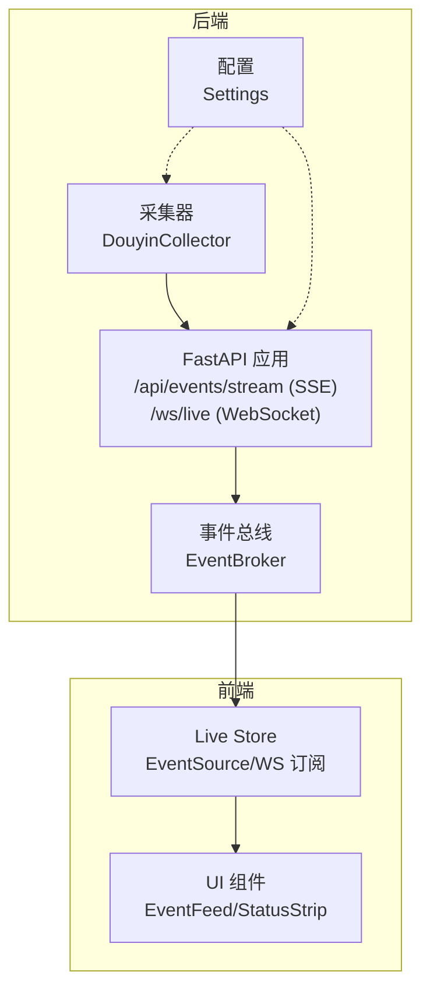
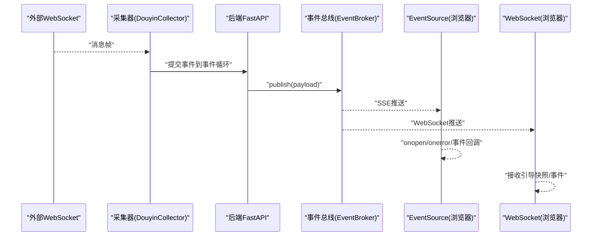
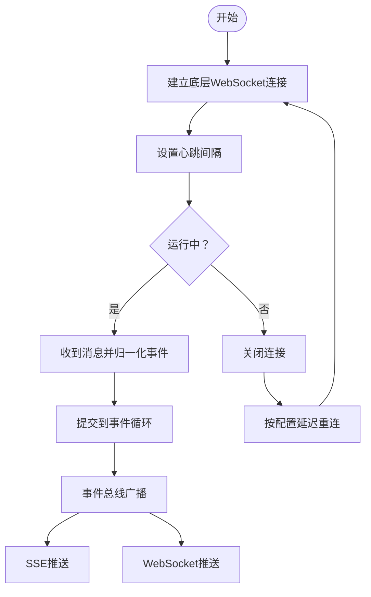
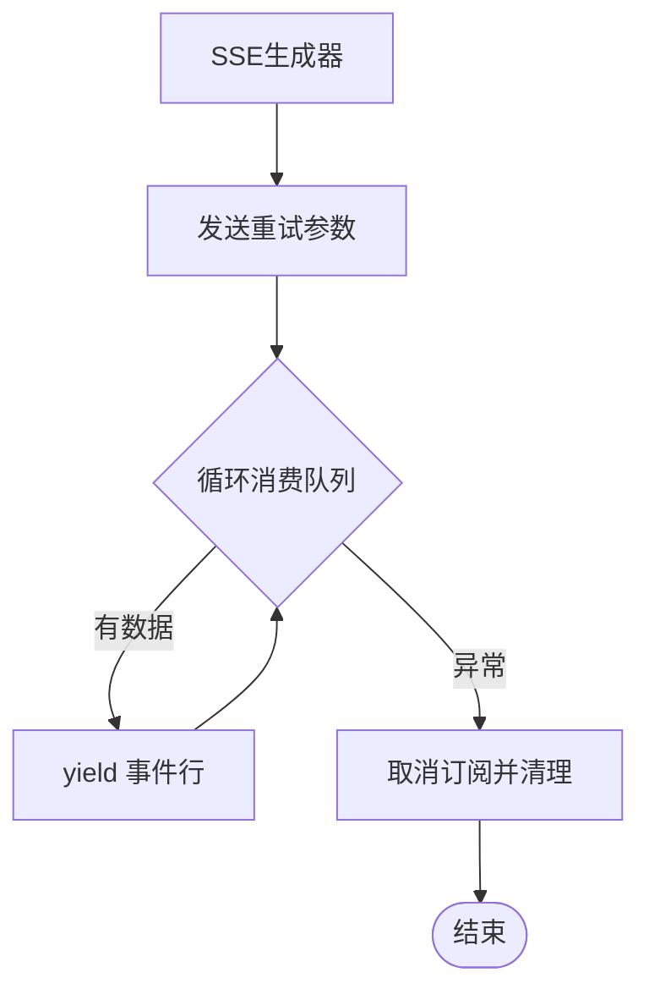
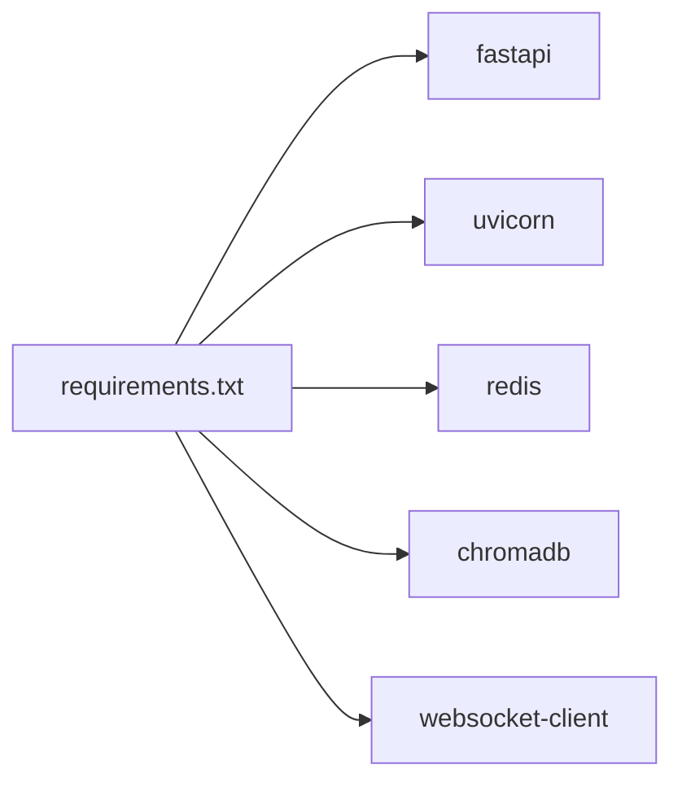

# 网络优化

<cite>
**本文引用的文件**   
- [backend/app.py](file://backend/app.py)
- [backend/config.py](file://backend/config.py)
- [backend/services/broker.py](file://backend/services/broker.py)
- [backend/services/collector.py](file://backend/services/collector.py)
- [backend/services/agent.py](file://backend/services/agent.py)
- [backend/schemas/live.py](file://backend/schemas/live.py)
- [frontend/src/stores/live.js](file://frontend/src/stores/live.js)
- [frontend/src/components/EventFeed.vue](file://frontend/src/components/EventFeed.vue)
- [frontend/src/components/StatusStrip.vue](file://frontend/src/components/StatusStrip.vue)
- [frontend/src/components/status-strip-presenter.js](file://frontend/src/components/status-strip-presenter.js)
- [requirements.txt](file://requirements.txt)
</cite>

## 目录
1. [简介](#简介)
2. [项目结构](#项目结构)
3. [核心组件](#核心组件)
4. [架构总览](#架构总览)
5. [详细组件分析](#详细组件分析)
6. [依赖分析](#依赖分析)
7. [性能考量](#性能考量)
8. [故障排查指南](#故障排查指南)
9. [结论](#结论)
10. [附录](#附录)

## 简介
本指南聚焦于 DouYin_llm 项目的网络优化实践，围绕以下目标展开：
- WebSocket 连接池管理：连接复用、心跳机制与断线重连策略
- SSE 流优化：缓冲区管理、错误重试与客户端兼容性
- API 响应时间优化：请求合并、批量处理与异步处理
- 网络带宽优化：数据压缩、传输协议选择与流量控制
- 网络监控指标与性能测试方法

在当前代码库中，后端通过 FastAPI 提供 SSE 与 WebSocket 接口，前端以 EventSource 和 WebSocket 订阅实时事件；采集器通过独立线程连接外部 WebSocket 并将事件投递到后端事件循环。这些构成了网络优化的关键切入点。

## 项目结构
后端采用 FastAPI 应用入口，统一注册 SSE 与 WebSocket 路由，并通过事件总线进行广播。采集器在独立线程中维持外部 WebSocket 连接，负责心跳与断线重连。前端通过 EventSource 订阅 SSE，同时维护连接状态与错误重试逻辑。



**图表来源**
- [backend/app.py:274-285](file://backend/app.py#L274-L285)
- [backend/services/broker.py:10-40](file://backend/services/broker.py#L10-L40)
- [backend/services/collector.py:38-100](file://backend/services/collector.py#L38-L100)
- [backend/config.py:40-113](file://backend/config.py#L40-L113)
- [frontend/src/stores/live.js:474-523](file://frontend/src/stores/live.js#L474-L523)

**章节来源**
- [backend/app.py:108-127](file://backend/app.py#L108-L127)
- [backend/services/broker.py:10-40](file://backend/services/broker.py#L10-L40)
- [backend/services/collector.py:38-100](file://backend/services/collector.py#L38-L100)
- [backend/config.py:40-113](file://backend/config.py#L40-L113)
- [frontend/src/stores/live.js:474-523](file://frontend/src/stores/live.js#L474-L523)

## 核心组件
- 后端应用与路由
  - SSE 路由：/api/events/stream，使用 StreamingResponse 输出 Server-Sent Events，支持按房间过滤与重试参数
  - WebSocket 路由：/ws/live，推送引导快照与实时事件
- 事件总线
  - 内部广播器，维护订阅队列集合，发布时尝试非阻塞入队，清理满队列
- 采集器
  - 在独立线程中连接外部 WebSocket，设置 ping 间隔，异常与关闭时记录日志并按退避延迟重连
- 配置
  - 包含采集器心跳与重连参数、LLM 与嵌入模型参数等
- 前端 Store
  - 使用 EventSource 订阅 SSE，维护连接状态并在错误时进入重连态
  - 通过 WebSocket 接收引导快照与后续事件

**章节来源**
- [backend/app.py:252-271](file://backend/app.py#L252-L271)
- [backend/app.py:274-285](file://backend/app.py#L274-L285)
- [backend/services/broker.py:10-40](file://backend/services/broker.py#L10-L40)
- [backend/services/collector.py:38-100](file://backend/services/collector.py#L38-L100)
- [backend/config.py:40-113](file://backend/config.py#L40-L113)
- [frontend/src/stores/live.js:474-523](file://frontend/src/stores/live.js#L474-L523)

## 架构总览
下图展示从外部 WebSocket 到前端的完整链路，以及后端内部的事件广播与订阅流程。



**图表来源**
- [backend/services/collector.py:118-140](file://backend/services/collector.py#L118-L140)
- [backend/app.py:73-102](file://backend/app.py#L73-L102)
- [backend/services/broker.py:28-40](file://backend/services/broker.py#L28-L40)
- [frontend/src/stores/live.js:474-523](file://frontend/src/stores/live.js#L474-L523)

## 详细组件分析

### WebSocket 连接池管理
- 连接复用
  - 后端通过单一 WebSocket 路由向多个订阅者推送，无需为每个客户端建立独立上游连接
  - 事件总线维护订阅队列集合，避免重复创建连接
- 心跳机制
  - 采集器在底层 WebSocket 中设置 ping 间隔，确保长连存活
- 断线重连策略
  - 采集器在连接关闭或异常时记录日志，并按固定延迟重试
  - 前端在 SSE 错误时切换到“重连中”状态，等待自动恢复



**图表来源**
- [backend/services/collector.py:118-140](file://backend/services/collector.py#L118-L140)
- [backend/services/broker.py:28-40](file://backend/services/broker.py#L28-L40)
- [frontend/src/stores/live.js:492-494](file://frontend/src/stores/live.js#L492-L494)

**章节来源**
- [backend/services/collector.py:118-140](file://backend/services/collector.py#L118-L140)
- [backend/services/broker.py:10-40](file://backend/services/broker.py#L10-L40)
- [frontend/src/stores/live.js:492-494](file://frontend/src/stores/live.js#L492-L494)

### SSE 流优化
- 缓冲区管理
  - 事件总线在发布时尝试非阻塞入队，若队列已满则标记为“陈旧队列”，并在后续清理，避免内存膨胀
- 错误重试
  - 前端在 SSE onerror 时进入“重连中”状态；后端在 SSE 生成器中持续重试参数与队列消费
- 客户端兼容性
  - 前端使用标准 EventSource，按事件类型注册监听器，解析 JSON 数据，具备基础容错



**图表来源**
- [backend/app.py:256-271](file://backend/app.py#L256-L271)
- [backend/services/broker.py:28-40](file://backend/services/broker.py#L28-L40)
- [frontend/src/stores/live.js:496-522](file://frontend/src/stores/live.js#L496-L522)

**章节来源**
- [backend/app.py:256-271](file://backend/app.py#L256-L271)
- [backend/services/broker.py:28-40](file://backend/services/broker.py#L28-L40)
- [frontend/src/stores/live.js:496-522](file://frontend/src/stores/live.js#L496-L522)

### API 响应时间优化
- 请求合并与批量处理
  - 当前后端未实现显式的请求合并或批量处理；可在前端侧对高频接口调用进行去抖/节流
- 异步处理策略
  - 采集器通过线程与事件循环桥接，将外部消息提交到异步事件循环，避免阻塞底层连接
  - SSE 与 WebSocket 路由均基于异步生成器与异步队列，减少同步阻塞

```mermaid
sequenceDiagram
participant FE as "前端"
participant API as "后端API"
participant LOOP as "事件循环"
participant COL as "采集器"
FE->>API : "HTTP 请求(如 /api/room)"
API->>LOOP : "异步处理"
COL->>LOOP : "线程提交事件"
LOOP-->>FE : "返回响应"
```

**图表来源**
- [backend/services/collector.py:182-189](file://backend/services/collector.py#L182-L189)
- [backend/app.py:144-156](file://backend/app.py#L144-L156)

**章节来源**
- [backend/services/collector.py:182-189](file://backend/services/collector.py#L182-L189)
- [backend/app.py:144-156](file://backend/app.py#L144-L156)

### 网络带宽优化
- 数据压缩
  - 当前未启用压缩；可在反向代理层启用 gzip/br 压缩，或在 SSE/WS 层引入压缩策略
- 传输协议选择
  - SSE 适合单向推送；WebSocket 适合双向交互与低延迟场景
- 流量控制
  - 事件总线对满队列进行清理，前端对事件进行截断与过滤，降低带宽占用

**章节来源**
- [backend/services/broker.py:31-39](file://backend/services/broker.py#L31-L39)
- [frontend/src/stores/live.js:5-7](file://frontend/src/stores/live.js#L5-L7)
- [frontend/src/stores/live.js:453-459](file://frontend/src/stores/live.js#L453-L459)

### 网络监控指标与性能测试
- 指标建议
  - SSE/WS 连接数、队列长度、发布速率、事件延迟、错误率
- 性能测试
  - 使用压测工具模拟高并发 SSE/WS 订阅，观察队列积压与丢弃情况
  - 对比不同 ping 间隔与重连延迟对稳定性的影响

[本节为通用指导，不直接分析具体文件]

## 依赖分析
后端依赖包括 FastAPI、Uvicorn、Redis、ChromaDB 与 WebSocket 客户端库。这些依赖直接影响网络栈的可用性与性能。



**图表来源**
- [requirements.txt:1-6](file://requirements.txt#L1-L6)

**章节来源**
- [requirements.txt:1-6](file://requirements.txt#L1-L6)

## 性能考量
- 心跳与重连
  - 采集器心跳间隔与重连延迟需根据网络波动调整，避免频繁抖动
- 队列容量与清理
  - 发布时的满队列清理有助于防止内存泄漏，但需结合前端消费能力评估
- 前端渲染与带宽
  - 限制事件列表长度与事件类型过滤，有助于降低前端渲染压力与带宽占用

[本节为通用指导，不直接分析具体文件]

## 故障排查指南
- SSE 连接问题
  - 前端 EventSource onerror 会触发“重连中”状态；检查后端 SSE 生成器是否正常产出
- WebSocket 连接断开
  - 采集器在连接关闭时记录状态码与消息；确认外部 WebSocket 地址与房间号配置
- 事件丢失
  - 若队列过快填满，会被标记为“陈旧队列”并清理；适当增大队列容量或提升前端消费速度

**章节来源**
- [frontend/src/stores/live.js:492-494](file://frontend/src/stores/live.js#L492-L494)
- [backend/services/collector.py:167-181](file://backend/services/collector.py#L167-L181)
- [backend/services/broker.py:31-39](file://backend/services/broker.py#L31-L39)

## 结论
当前实现已具备较为完善的实时推送能力：SSE 与 WebSocket 双通道、事件总线广播、采集器心跳与断线重连。为进一步优化网络性能，建议在反向代理层引入压缩、合理设置心跳与重连参数、在前端增加去抖与批量策略，并通过监控与压测持续迭代。

[本节为总结，不直接分析具体文件]

## 附录
- 前端连接状态展示
  - 状态条组件根据连接状态映射不同提示与图标，便于用户感知网络状况

**章节来源**
- [frontend/src/components/status-strip-presenter.js:1-34](file://frontend/src/components/status-strip-presenter.js#L1-L34)
- [frontend/src/components/StatusStrip.vue:199-218](file://frontend/src/components/StatusStrip.vue#L199-L218)