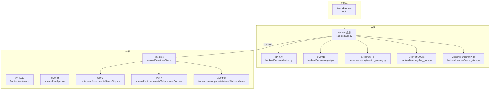
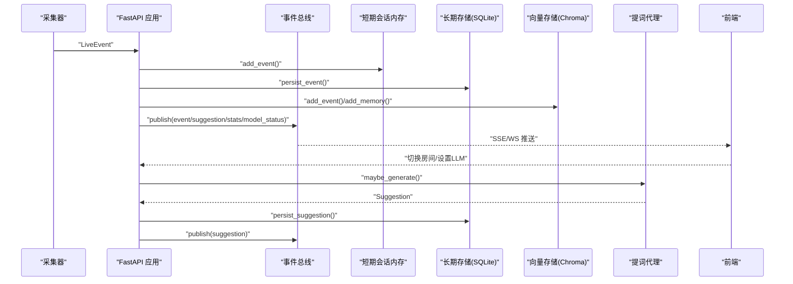
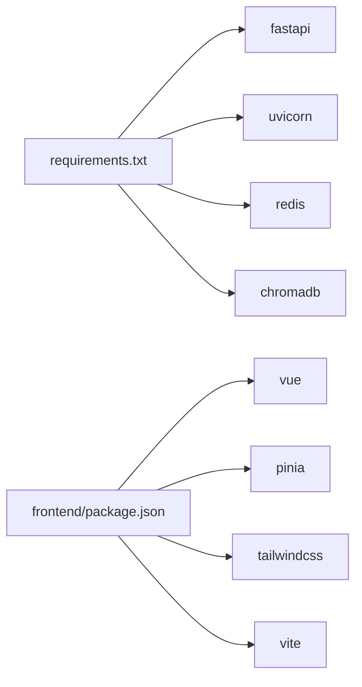

# 最佳实践

<cite>
**本文引用的文件**   
- [README.md](file://README.md)
- [backend/app.py](file://backend/app.py)
- [backend/config.py](file://backend/config.py)
- [backend/memory/session_memory.py](file://backend/memory/session_memory.py)
- [backend/memory/long_term.py](file://backend/memory/long_term.py)
- [backend/memory/vector_store.py](file://backend/memory/vector_store.py)
- [backend/services/agent.py](file://backend/services/agent.py)
- [backend/services/broker.py](file://backend/services/broker.py)
- [frontend/src/main.js](file://frontend/src/main.js)
- [frontend/src/App.vue](file://frontend/src/App.vue)
- [frontend/src/stores/live.js](file://frontend/src/stores/live.js)
- [frontend/src/components/StatusStrip.vue](file://frontend/src/components/StatusStrip.vue)
- [frontend/src/components/TeleprompterCard.vue](file://frontend/src/components/TeleprompterCard.vue)
- [frontend/src/components/ViewerWorkbench.vue](file://frontend/src/components/ViewerWorkbench.vue)
- [tests/test_agent.py](file://tests/test_agent.py)
- [requirements.txt](file://requirements.txt)
- [frontend/package.json](file://frontend/package.json)
</cite>

## 目录
1. [简介](#简介)
2. [项目结构](#项目结构)
3. [核心组件](#核心组件)
4. [架构总览](#架构总览)
5. [详细组件分析](#详细组件分析)
6. [依赖分析](#依赖分析)
7. [性能考量](#性能考量)
8. [故障排查指南](#故障排查指南)
9. [结论](#结论)
10. [附录](#附录)

## 简介
本指南面向DouYin_llm项目，聚焦于性能优化、安全加固、可扩展性与高可用、代码质量与测试、运维监控与日志、用户体验与交互设计、团队协作与知识沉淀，以及版本升级与迁移策略。文档结合现有代码结构与实现，给出可落地的最佳实践建议。

## 项目结构
项目采用“采集器 + FastAPI后端 + Vue3前端”的三层架构，后端通过事件总线将采集到的直播事件进行标准化、持久化、记忆抽取与提词生成，并通过SSE/WS实时推送到前端。前端通过Pinia集中管理状态，组件化展示事件流、提词建议与观众工单。

图示来源
- [backend/app.py:108-126](file://backend/app.py#L108-L126)
- [backend/services/broker.py:10-39](file://backend/services/broker.py#L10-L39)
- [backend/memory/session_memory.py:17-113](file://backend/memory/session_memory.py#L17-L113)
- [backend/memory/long_term.py:44-967](file://backend/memory/long_term.py#L44-L967)
- [backend/memory/vector_store.py:59-317](file://backend/memory/vector_store.py#L59-L317)
- [backend/services/agent.py:23-496](file://backend/services/agent.py#L23-L496)
- [frontend/src/main.js:1-17](file://frontend/src/main.js#L1-L17)
- [frontend/src/App.vue:1-139](file://frontend/src/App.vue#L1-L139)
- [frontend/src/stores/live.js:75-846](file://frontend/src/stores/live.js#L75-L846)
- [frontend/src/components/StatusStrip.vue:1-316](file://frontend/src/components/StatusStrip.vue#L1-L316)
- [frontend/src/components/TeleprompterCard.vue:1-97](file://frontend/src/components/TeleprompterCard.vue#L1-L97)
- [frontend/src/components/ViewerWorkbench.vue:1-302](file://frontend/src/components/ViewerWorkbench.vue#L1-L302)

章节来源
- [README.md:1-223](file://README.md#L1-L223)
- [backend/app.py:108-126](file://backend/app.py#L108-L126)
- [frontend/src/main.js:1-17](file://frontend/src/main.js#L1-L17)
- [frontend/src/App.vue:1-139](file://frontend/src/App.vue#L1-L139)

## 核心组件
- 配置中心：集中管理运行参数与环境变量，支持LLM、嵌入、Redis、Chroma、会话TTL等。
- 事件总线：统一发布/订阅机制，支撑SSE与WebSocket实时分发。
- 提词代理：根据事件类型与上下文选择LLM或启发式规则生成建议。
- 记忆系统：短期会话内存、长期SQLite存储、向量Chroma索引与回退方案。
- 前端状态与UI：Pinia集中管理，组件化展示状态条、提词卡、事件流、观众工坊。

章节来源
- [backend/config.py:40-113](file://backend/config.py#L40-L113)
- [backend/services/broker.py:10-39](file://backend/services/broker.py#L10-L39)
- [backend/services/agent.py:23-496](file://backend/services/agent.py#L23-L496)
- [backend/memory/session_memory.py:17-113](file://backend/memory/session_memory.py#L17-L113)
- [backend/memory/long_term.py:44-967](file://backend/memory/long_term.py#L44-L967)
- [backend/memory/vector_store.py:59-317](file://backend/memory/vector_store.py#L59-L317)
- [frontend/src/stores/live.js:75-846](file://frontend/src/stores/live.js#L75-L846)

## 架构总览
整体数据流：采集器将直播事件标准化后进入后端，经短期会话、长期存储与向量检索，触发提词生成并通过SSE/WS推送到前端，前端组件实时渲染。

图示来源
- [backend/app.py:73-102](file://backend/app.py#L73-L102)
- [backend/services/broker.py:28-39](file://backend/services/broker.py#L28-L39)
- [backend/memory/session_memory.py:42-84](file://backend/memory/session_memory.py#L42-L84)
- [backend/memory/long_term.py:454-488](file://backend/memory/long_term.py#L454-L488)
- [backend/memory/vector_store.py:149-171](file://backend/memory/vector_store.py#L149-L171)
- [backend/services/agent.py:105-142](file://backend/services/agent.py#L105-L142)

## 详细组件分析

### 后端应用与路由
- 生命周期管理：启动时初始化采集器、内存、存储、向量、代理与提取器；关闭时清理活动会话与停止采集。
- CORS：允许任意来源，便于本地联调，生产需收紧。
- 接口：健康检查、引导快照、房间切换、事件注入、观众详情/笔记、LLM设置、SSE/WS流等。

章节来源
- [backend/app.py:108-117](file://backend/app.py#L108-L117)
- [backend/app.py:129-136](file://backend/app.py#L129-L136)
- [backend/app.py:138-156](file://backend/app.py#L138-L156)
- [backend/app.py:158-167](file://backend/app.py#L158-L167)
- [backend/app.py:169-176](file://backend/app.py#L169-L176)
- [backend/app.py:178-194](file://backend/app.py#L178-L194)
- [backend/app.py:196-222](file://backend/app.py#L196-L222)
- [backend/app.py:224-235](file://backend/app.py#L224-L235)
- [backend/app.py:237-250](file://backend/app.py#L237-L250)
- [backend/app.py:252-272](file://backend/app.py#L252-L272)
- [backend/app.py:274-285](file://backend/app.py#L274-L285)

### 配置中心
- 优先级：.env > 环境变量 > 代码默认值。
- 关键参数：房间ID、采集器开关与地址、Redis、会话TTL、LLM模式/地址/模型/API Key/超时/温度/最大Token、嵌入模式/模型/地址/Key/超时/设备/批大小、语义检索阈值与召回数。
- 解析逻辑：LLM地址/模型签名等。

章节来源
- [backend/config.py:12-37](file://backend/config.py#L12-L37)
- [backend/config.py:40-113](file://backend/config.py#L40-L113)

### 事件总线
- 维护订阅集合，异步广播；对满队列的订阅进行清理，避免泄漏。

章节来源
- [backend/services/broker.py:10-39](file://backend/services/broker.py#L10-L39)

### 提词代理
- 上下文构建：近期事件、相似历史、用户画像、观众记忆。
- 生成策略：命中特定事件或关键词时走启发式；否则构造OpenAI兼容请求，失败则回退启发式。
- 结果规范化：校验字段、归一化优先级与置信度、记录状态。

章节来源
- [backend/services/agent.py:83-103](file://backend/services/agent.py#L83-L103)
- [backend/services/agent.py:105-142](file://backend/services/agent.py#L105-L142)
- [backend/services/agent.py:179-198](file://backend/services/agent.py#L179-L198)
- [backend/services/agent.py:200-217](file://backend/services/agent.py#L200-L217)
- [backend/services/agent.py:228-301](file://backend/services/agent.py#L228-L301)
- [backend/services/agent.py:302-437](file://backend/services/agent.py#L302-L437)
- [backend/services/agent.py:439-496](file://backend/services/agent.py#L439-L496)

### 短期会话内存
- 优先使用Redis；未安装或未配置时退化为进程内deque。
- TTL仅在Redis模式生效；提供事件/建议的增删查与统计。

章节来源
- [backend/memory/session_memory.py:17-113](file://backend/memory/session_memory.py#L17-L113)

### 长期存储(SQLite)
- 表结构：事件、建议、观众画像、礼物、直播会话、笔记、记忆、应用设置。
- 索引：按房间/时间/类型/会话ID等建立索引。
- 能力：事件/建议查询、统计、会话聚合、画像与礼物聚合、记忆与笔记CRUD、LLM设置读写。

章节来源
- [backend/memory/long_term.py:63-187](file://backend/memory/long_term.py#L63-L187)
- [backend/memory/long_term.py:216-229](file://backend/memory/long_term.py#L216-L229)
- [backend/memory/long_term.py:454-557](file://backend/memory/long_term.py#L454-L557)
- [backend/memory/long_term.py:559-558](file://backend/memory/long_term.py#L559-L558)
- [backend/memory/long_term.py:599-652](file://backend/memory/long_term.py#L599-L652)
- [backend/memory/long_term.py:667-785](file://backend/memory/long_term.py#L667-L785)

### 向量存储(Chroma/回退)
- 支持Chroma持久化客户端；不可用时使用内存回退索引。
- 文本分词与哈希嵌入函数作为回退；相似检索支持房间过滤与评分重排。

章节来源
- [backend/memory/vector_store.py:59-85](file://backend/memory/vector_store.py#L59-L85)
- [backend/memory/vector_store.py:19-57](file://backend/memory/vector_store.py#L19-L57)
- [backend/memory/vector_store.py:149-231](file://backend/memory/vector_store.py#L149-L231)
- [backend/memory/vector_store.py:257-317](file://backend/memory/vector_store.py#L257-L317)

### 前端应用与状态
- 入口：创建Vue应用与Pinia，挂载根组件。
- 布局：状态条、提词卡、事件流、观众工坊、LLM设置面板。
- Store：事件/建议/统计/模型状态/房间/过滤器/主题/语言/LLM设置/观众工坊等；SSE连接、房间切换、笔记CRUD、错误处理。

章节来源
- [frontend/src/main.js:1-17](file://frontend/src/main.js#L1-L17)
- [frontend/src/App.vue:1-139](file://frontend/src/App.vue#L1-L139)
- [frontend/src/stores/live.js:75-846](file://frontend/src/stores/live.js#L75-L846)
- [frontend/src/components/StatusStrip.vue:1-316](file://frontend/src/components/StatusStrip.vue#L1-L316)
- [frontend/src/components/TeleprompterCard.vue:1-97](file://frontend/src/components/TeleprompterCard.vue#L1-L97)
- [frontend/src/components/ViewerWorkbench.vue:1-302](file://frontend/src/components/ViewerWorkbench.vue#L1-L302)

### 测试策略
- 后端：单元测试覆盖Agent行为、嵌入服务、向量存储、长时存储、空房间引导、LLM设置等。
- 前端：Store与Presenter测试，覆盖事件过滤、主题/语言持久化、SSE连接、房间切换、笔记保存/删除等。

章节来源
- [tests/test_agent.py:1-176](file://tests/test_agent.py#L1-L176)
- [README.md:180-191](file://README.md#L180-L191)

## 依赖分析
- 后端依赖：FastAPI、Uvicorn、Redis、ChromaDB、websocket-client。
- 前端依赖：Vue 3、Pinia、TailwindCSS、Vite。

图示来源
- [requirements.txt:1-6](file://requirements.txt#L1-L6)
- [frontend/package.json:11-22](file://frontend/package.json#L11-L22)

章节来源
- [requirements.txt:1-6](file://requirements.txt#L1-L6)
- [frontend/package.json:11-22](file://frontend/package.json#L11-L22)

## 性能考量
- 缓存策略
  - Redis短期会话内存：利用TTL控制热数据生命周期，降低频繁I/O；未配置时自动退化为进程内deque，保证可用性。
  - 嵌入与向量：Chroma持久化客户端减少重复计算；不可用时使用哈希嵌入回退，维持检索能力。
  - 前端本地存储：事件/建议上限与过滤器持久化，减少DOM与渲染压力。
- 数据库优化
  - SQLite：按房间/时间/类型/会话ID建立索引；使用PRAGMA与事务批量写入，减少磁盘争用。
  - 事件/建议写入：先写入短期会话，再持久化，避免阻塞主链路。
- 网络优化
  - SSE/WS：事件总线统一发布，订阅端按房间过滤，减少无效传输。
  - LLM调用：超时控制与回退策略，避免阻塞；并发请求需限流与熔断。
- 复杂度与容量
  - 向量检索：Chroma查询与回退索引均为O(N)扫描，建议控制查询K与阈值，必要时分片或降维。
  - SQLite查询：合理使用索引与LIMIT，避免全表扫描。

章节来源
- [backend/memory/session_memory.py:17-113](file://backend/memory/session_memory.py#L17-L113)
- [backend/memory/vector_store.py:59-85](file://backend/memory/vector_store.py#L59-L85)
- [backend/memory/long_term.py:216-229](file://backend/memory/long_term.py#L216-L229)
- [backend/services/broker.py:28-39](file://backend/services/broker.py#L28-L39)
- [backend/services/agent.py:302-437](file://backend/services/agent.py#L302-L437)
- [frontend/src/stores/live.js:5-7](file://frontend/src/stores/live.js#L5-L7)

## 故障排查指南
- 健康检查
  - 后端健康端点返回运行状态与当前房间及活动会话摘要。
- 日志与追踪
  - 后端使用标准日志格式；LLM异常分类记录HTTP/网络/超时/JSON解析/OS错误等。
  - 建议引入结构化日志与TraceID，便于跨服务定位。
- 常见问题
  - SSE/WS断连：前端检测onerror并重连；后端订阅满队列时清理陈旧队列。
  - Redis/Chroma不可用：自动回退至内存/哈希嵌入，不影响核心链路。
  - SQLite写入失败：检查journal模式与磁盘权限；必要时调整PRAGMA或迁移至更高性能存储。

章节来源
- [backend/app.py:129-136](file://backend/app.py#L129-L136)
- [backend/services/agent.py:330-437](file://backend/services/agent.py#L330-L437)
- [backend/services/broker.py:31-39](file://backend/services/broker.py#L31-L39)
- [backend/memory/long_term.py:36-42](file://backend/memory/long_term.py#L36-L42)

## 结论
本项目在本地排练场景具备完整链路与良好扩展性。建议在生产环境中强化鉴权与多租户隔离、完善可观测性与告警、优化LLM调用与缓存策略、加强数据库索引与查询规划，并建立完善的测试与CI流程，以支撑更高并发与更稳定的服务质量。

## 附录

### 安全加固建议
- 认证与授权
  - 引入登录态与角色权限控制，后端增加鉴权中间件与路由保护。
  - 前端对敏感操作进行二次确认与权限校验。
- 数据保护
  - 对敏感字段（如API Key）进行加密存储与最小暴露范围。
  - 传输加密：强制HTTPS与WSS，禁用不安全协议。
- 网络安全
  - CORS白名单化，仅允许受信域名；限制方法与头。
  - 防止常见攻击：输入校验、速率限制、SQL注入与XSS防护。

章节来源
- [backend/app.py:120-126](file://backend/app.py#L120-L126)
- [README.md:209-211](file://README.md#L209-L211)

### 可扩展性与高可用
- 负载均衡
  - 使用反向代理与多实例部署，结合会话亲和或共享状态（Redis）。
- 弹性伸缩
  - 前端静态资源CDN化；后端按CPU/延迟指标动态扩缩容。
- 多房间接入
  - 采集器与后端需支持多房间并行接入与独立会话管理。

章节来源
- [README.md:208-211](file://README.md#L208-L211)

### 代码质量与测试
- 单元测试
  - 后端：Agent、嵌入、向量、长时存储、空房间引导、LLM设置等。
  - 前端：Store与Presenter测试覆盖关键交互。
- 集成测试
  - 端到端验证SSE/WS、房间切换、笔记CRUD、LLM设置变更。
- 覆盖率与CI
  - 建立覆盖率门槛与自动化流水线，确保每次提交均通过测试。

章节来源
- [tests/test_agent.py:1-176](file://tests/test_agent.py#L1-L176)
- [README.md:180-191](file://README.md#L180-L191)

### 运维监控与日志
- 指标
  - 后端：QPS、P95/P99延迟、错误率、Redis/Chroma连接数、SQLite写入耗时。
  - 前端：SSE连接数、重连次数、事件/建议积压。
- 告警
  - 基于阈值触发与趋势异常检测，联动值班与自愈。
- 日志
  - 结构化日志与TraceID，保留关键上下文（房间ID、事件ID、模型名）。

章节来源
- [README.md:211-211](file://README.md#L211-L211)

### 用户体验与交互
- 界面设计
  - 状态条突出连接状态、模型状态与统计数据；提词卡强调回复文本与来源；事件流支持筛选与清空。
- 交互模式
  - 房间切换与SSE重连需反馈进度；错误信息本地化与可读化。
- 无障碍
  - 键盘导航、屏幕阅读器友好、颜色对比度与字体大小可调。

章节来源
- [frontend/src/components/StatusStrip.vue:1-316](file://frontend/src/components/StatusStrip.vue#L1-L316)
- [frontend/src/components/TeleprompterCard.vue:1-97](file://frontend/src/components/TeleprompterCard.vue#L1-L97)
- [frontend/src/components/ViewerWorkbench.vue:1-302](file://frontend/src/components/ViewerWorkbench.vue#L1-L302)
- [frontend/src/stores/live.js:474-523](file://frontend/src/stores/live.js#L474-L523)

### 团队协作与知识沉淀
- 代码审查
  - 建立PR模板与审查清单，覆盖安全性、性能、可维护性与测试。
- 知识分享
  - 文档与设计稿同步更新，定期回顾与复盘。
- 版本管理
  - 语义化版本与变更日志；重大变更提前沟通与演练。

章节来源
- [README.md:199-204](file://README.md#L199-L204)

### 维护、升级与迁移
- 维护
  - 定期更新依赖与安全补丁；滚动升级与灰度发布。
- 升级策略
  - LLM模型切换与系统提示词版本化；向量索引重建与迁移脚本。
- 迁移
  - SQLite迁移：备份、校验、回滚预案；Chroma迁移：导出导入与一致性校验。

章节来源
- [backend/memory/long_term.py:63-187](file://backend/memory/long_term.py#L63-L187)
- [backend/memory/vector_store.py:59-85](file://backend/memory/vector_store.py#L59-L85)