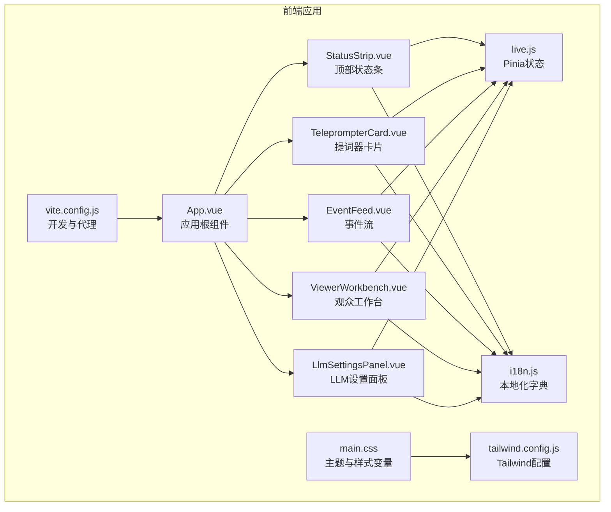
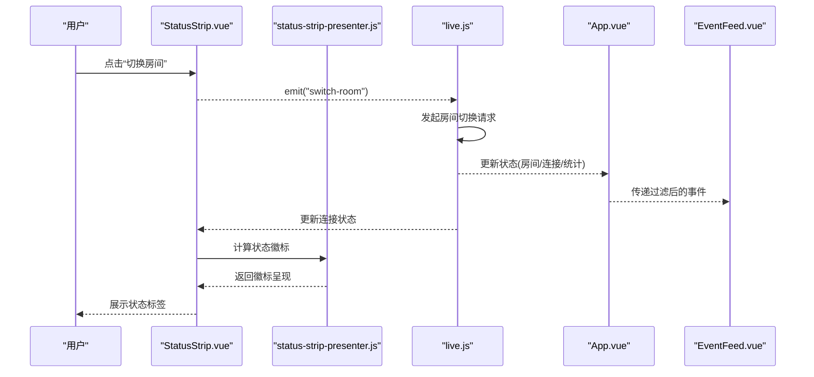
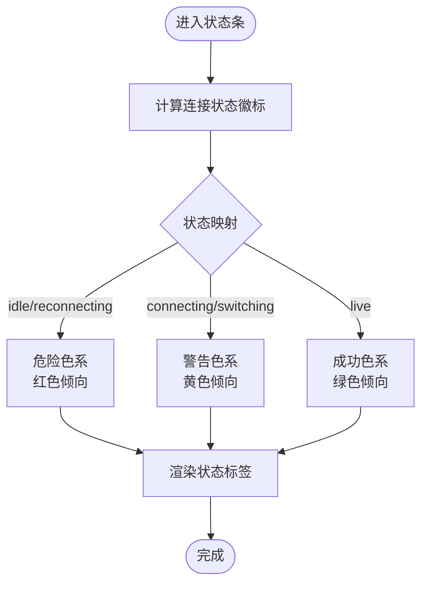
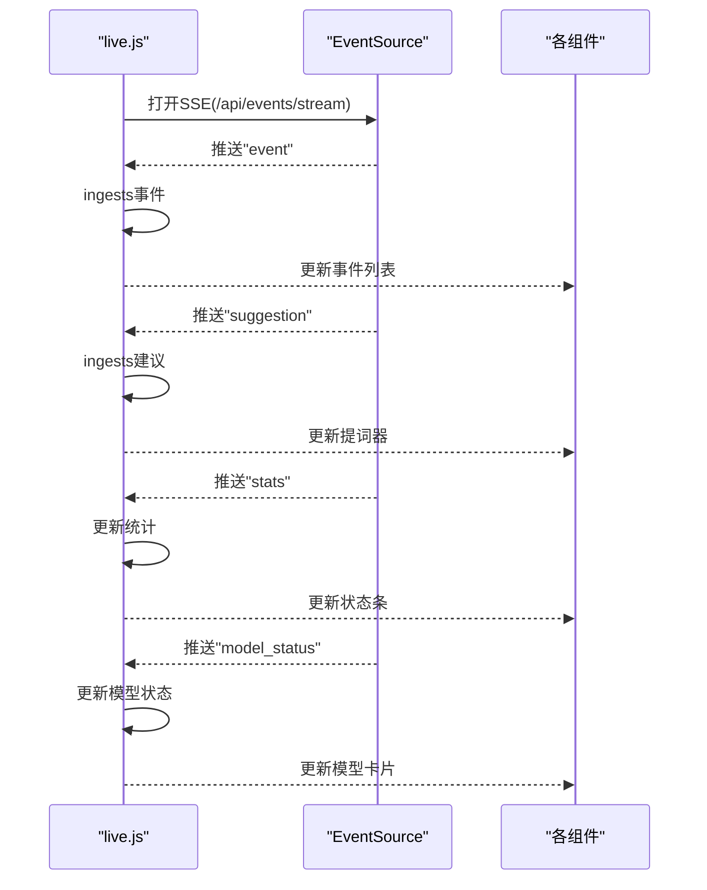
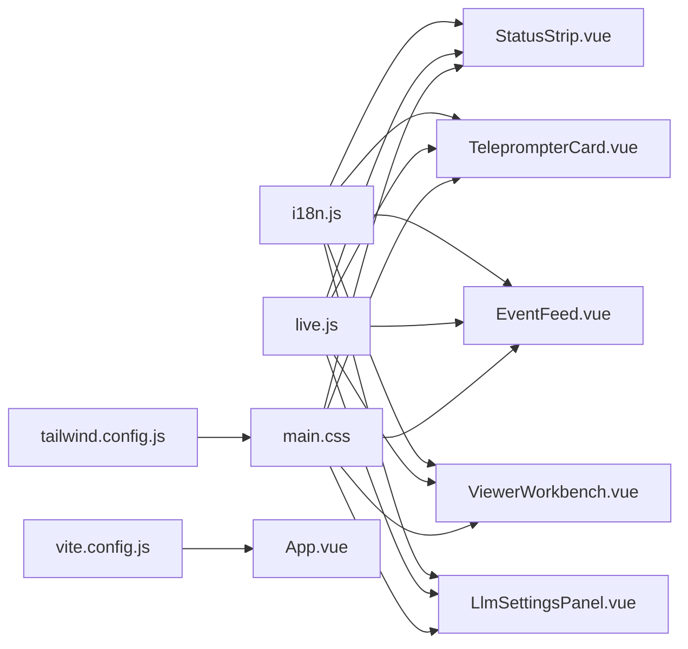

# 用户体验与界面设计

<cite>
**本文引用的文件**
- [main.css](file://frontend/src/assets/main.css)
- [tailwind.config.js](file://frontend/tailwind.config.js)
- [vite.config.js](file://frontend/vite/vite.config.js)
- [package.json](file://frontend/package.json)
- [App.vue](file://frontend/src/App.vue)
- [StatusStrip.vue](file://frontend/src/components/StatusStrip.vue)
- [status-strip-presenter.js](file://frontend/src/components/status-strip-presenter.js)
- [LlmSettingsPanel.vue](file://frontend/src/components/LlmSettingsPanel.vue)
- [TeleprompterCard.vue](file://frontend/src/components/TeleprompterCard.vue)
- [EventFeed.vue](file://frontend/src/components/EventFeed.vue)
- [ViewerWorkbench.vue](file://frontend/src/components/ViewerWorkbench.vue)
- [live.js](file://frontend/src/stores/live.js)
- [i18n.js](file://frontend/src/i18n.js)
- [2026-04-13-frontend-locale-toggle-design.md](file://docs/superpowers/specs/2026-04-13-frontend-locale-toggle-design.md)
- [2026-04-13-llm-settings-design.md](file://docs/superpowers/specs/2026-04-13-llm-settings-design.md)
- [2026-04-13-status-strip-layout-redesign-design.md](file://docs/superpowers/specs/2026-04-13-status-strip-layout-redesign-design.md)
</cite>

## 目录
1. [简介](#简介)
2. [项目结构](#项目结构)
3. [核心组件](#核心组件)
4. [架构总览](#架构总览)
5. [详细组件分析](#详细组件分析)
6. [依赖关系分析](#依赖关系分析)
7. [性能考量](#性能考量)
8. [故障排查指南](#故障排查指南)
9. [结论](#结论)
10. [附录](#附录)

## 简介
本指南面向DouYin_llm项目的前端界面与用户体验设计，聚焦于简洁性、一致性、可访问性与响应式设计原则；给出组件设计规范（颜色体系、字体规范、间距标准、交互反馈）；提供用户体验优化（加载状态、错误提示、用户引导）；说明实时数据展示（事件流可视化、状态指示器、数据刷新策略）；涵盖无障碍设计（键盘导航、屏幕阅读器支持、色彩对比度）；并提供移动端适配与跨浏览器兼容性建议。

## 项目结构
前端采用Vue 3 + Pinia + TailwindCSS + Vite技术栈，组件化组织，状态集中管理，通过SSE与WebSocket实现实时数据流接入。

图表来源
- [App.vue:1-139](file://frontend/src/App.vue#L1-L139)
- [StatusStrip.vue:1-316](file://frontend/src/components/StatusStrip.vue#L1-L316)
- [TeleprompterCard.vue:1-97](file://frontend/src/components/TeleprompterCard.vue#L1-L97)
- [EventFeed.vue:1-214](file://frontend/src/components/EventFeed.vue#L1-L214)
- [ViewerWorkbench.vue:1-302](file://frontend/src/components/ViewerWorkbench.vue#L1-L302)
- [LlmSettingsPanel.vue:1-122](file://frontend/src/components/LlmSettingsPanel.vue#L1-L122)
- [live.js:1-846](file://frontend/src/stores/live.js#L1-L846)
- [i18n.js:1-316](file://frontend/src/i18n.js#L1-L316)
- [main.css:1-144](file://frontend/src/assets/main.css#L1-L144)
- [tailwind.config.js:1-23](file://frontend/tailwind.config.js#L1-L23)
- [vite.config.js:1-23](file://frontend/vite/vite.config.js#L1-L23)

章节来源
- [App.vue:1-139](file://frontend/src/App.vue#L1-L139)
- [live.js:75-846](file://frontend/src/stores/live.js#L75-L846)
- [main.css:1-144](file://frontend/src/assets/main.css#L1-L144)
- [tailwind.config.js:1-23](file://frontend/tailwind.config.js#L1-L23)
- [vite.config.js:1-23](file://frontend/vite/vite.config.js#L1-L23)

## 核心组件
- 应用根组件负责布局与全局事件绑定，启动引导、建立SSE连接、清理资源。
- 顶部状态条承载房间切换、连接状态、模型状态、工具入口等关键控制。
- 提词器卡片展示最高优先级回复建议与来源事件摘要。
- 事件流展示实时事件列表，支持筛选、清空、查看观众详情。
- 观众工作台提供观众画像、记忆检索、备注管理等扩展能力。
- LLM设置面板允许在线编辑模型名与系统提示词并持久化。

章节来源
- [App.vue:1-139](file://frontend/src/App.vue#L1-L139)
- [StatusStrip.vue:1-316](file://frontend/src/components/StatusStrip.vue#L1-L316)
- [TeleprompterCard.vue:1-97](file://frontend/src/components/TeleprompterCard.vue#L1-L97)
- [EventFeed.vue:1-214](file://frontend/src/components/EventFeed.vue#L1-L214)
- [ViewerWorkbench.vue:1-302](file://frontend/src/components/ViewerWorkbench.vue#L1-L302)
- [LlmSettingsPanel.vue:1-122](file://frontend/src/components/LlmSettingsPanel.vue#L1-L122)
- [live.js:75-846](file://frontend/src/stores/live.js#L75-L846)

## 架构总览
前端通过Pinia集中管理状态，组件通过props与事件与store交互；SSE用于接收事件流、建议与统计；WebSocket代理用于后端WS；Tailwind提供原子化样式与主题变量；CSS变量驱动深浅色主题与品牌配色。

图表来源
- [StatusStrip.vue:1-316](file://frontend/src/components/StatusStrip.vue#L1-L316)
- [status-strip-presenter.js:1-35](file://frontend/src/components/status-strip-presenter.js#L1-L35)
- [live.js:474-569](file://frontend/src/stores/live.js#L474-L569)
- [App.vue:1-139](file://frontend/src/App.vue#L1-L139)
- [EventFeed.vue:1-214](file://frontend/src/components/EventFeed.vue#L1-L214)

## 详细组件分析

### 状态条组件（StatusStrip）
- 设计目标：重构为“左主控+右状态”的双栏结构，提升信息层级与可读性。
- 关键元素：房间标题/输入/切换、连接状态徽标、评论与事件统计、模型信息与设置入口、工具区（语言/主题）。
- 状态徽标：根据连接状态映射不同色调与图标，提供即时视觉反馈。
- 交互约束：保持现有功能不变，不新增业务交互。

图表来源
- [status-strip-presenter.js:1-35](file://frontend/src/components/status-strip-presenter.js#L1-L35)
- [StatusStrip.vue:137-169](file://frontend/src/components/StatusStrip.vue#L137-L169)

章节来源
- [2026-04-13-status-strip-layout-redesign-design.md:1-131](file://docs/superpowers/specs/2026-04-13-status-strip-layout-redesign-design.md#L1-L131)
- [StatusStrip.vue:1-316](file://frontend/src/components/StatusStrip.vue#L1-L316)
- [status-strip-presenter.js:1-35](file://frontend/src/components/status-strip-presenter.js#L1-L35)

### 提词器卡片（TeleprompterCard）
- 设计要点：采用品牌色背景与强调色高亮，突出“建议回复”内容；来源事件以面板形式展示，增强可读性。
- 交互反馈：无数据时显示“等待中”占位文案，确保界面稳定。

章节来源
- [TeleprompterCard.vue:1-97](file://frontend/src/components/TeleprompterCard.vue#L1-L97)
- [main.css:105-144](file://frontend/src/assets/main.css#L105-L144)

### 事件流（EventFeed）
- 设计要点：事件卡片按事件类型着色，筛选器采用胶囊式按钮；支持一键全选、清空；点击用户头像可打开观众工作台。
- 交互反馈：空状态友好提示；筛选状态动态显示。

章节来源
- [EventFeed.vue:1-214](file://frontend/src/components/EventFeed.vue#L1-L214)

### 观众工作台（ViewerWorkbench）
- 设计要点：对话框式布局，分区块展示观众基础信息、记忆、备注、近期互动与会话；支持备注编辑、置顶、保存与删除。
- 交互反馈：加载中、错误信息、空状态均有明确提示；保存/删除过程禁用交互避免竞态。

章节来源
- [ViewerWorkbench.vue:1-302](file://frontend/src/components/ViewerWorkbench.vue#L1-L302)

### LLM设置面板（LlmSettingsPanel）
- 设计要点：固定侧边抽屉式面板，包含模型名与系统提示词编辑区、保存/重置按钮与错误提示。
- 交互反馈：保存中禁用按钮；错误通过本地化字典统一呈现。

章节来源
- [LlmSettingsPanel.vue:1-122](file://frontend/src/components/LlmSettingsPanel.vue#L1-L122)
- [2026-04-13-llm-settings-design.md:1-166](file://docs/superpowers/specs/2026-04-13-llm-settings-design.md#L1-L166)

### 实时数据流与状态指示
- SSE事件：事件、建议、统计、模型状态分别监听并更新store，驱动UI即时变化。
- 连接状态：通过状态条徽标与颜色传达“未连接/连接中/已连接/重连中/切换中”。

图表来源
- [live.js:474-523](file://frontend/src/stores/live.js#L474-L523)
- [StatusStrip.vue:220-239](file://frontend/src/components/StatusStrip.vue#L220-L239)
- [TeleprompterCard.vue:49-94](file://frontend/src/components/TeleprompterCard.vue#L49-L94)
- [EventFeed.vue:162-210](file://frontend/src/components/EventFeed.vue#L162-L210)

## 依赖关系分析
- 组件依赖：App.vue组合所有子组件；各子组件依赖i18n.js进行本地化；状态由live.js集中管理。
- 样式依赖：main.css定义主题变量与品牌色；tailwind.config.js扩展颜色与字体族；组件通过类名消费变量。
- 开发依赖：vite.config.js配置代理，将/api与/ws转发至后端；package.json声明Vue与Pinia等依赖。

图表来源
- [i18n.js:1-316](file://frontend/src/i18n.js#L1-L316)
- [live.js:75-846](file://frontend/src/stores/live.js#L75-L846)
- [main.css:1-144](file://frontend/src/assets/main.css#L1-L144)
- [tailwind.config.js:1-23](file://frontend/tailwind.config.js#L1-L23)
- [vite.config.js:1-23](file://frontend/vite/vite.config.js#L1-L23)
- [App.vue:1-139](file://frontend/src/App.vue#L1-L139)

章节来源
- [i18n.js:1-316](file://frontend/src/i18n.js#L1-L316)
- [live.js:75-846](file://frontend/src/stores/live.js#L75-L846)
- [main.css:1-144](file://frontend/src/assets/main.css#L1-L144)
- [tailwind.config.js:1-23](file://frontend/tailwind.config.js#L1-L23)
- [vite.config.js:1-23](file://frontend/vite/vite.config.js#L1-L23)
- [App.vue:1-139](file://frontend/src/App.vue#L1-L139)

## 性能考量
- 渲染节流：事件与建议列表限制最大长度，避免DOM膨胀。
- 请求去抖：房间切换过程中禁用重复提交，失败回滚并重连。
- 资源释放：组件卸载时关闭SSE，防止内存泄漏。
- 样式体积：Tailwind按需扫描，避免无用类导致包体增大。

章节来源
- [live.js:5-6](file://frontend/src/stores/live.js#L5-L6)
- [live.js:525-569](file://frontend/src/stores/live.js#L525-L569)
- [live.js:186-191](file://frontend/src/stores/live.js#L186-L191)
- [tailwind.config.js:1-23](file://frontend/tailwind.config.js#L1-L23)

## 故障排查指南
- 连接异常：检查SSE连接状态与错误提示；确认代理配置与后端端口。
- 语言切换无效：确认locale状态与本地化字典键值；确保组件使用translate函数。
- 设置保存失败：检查后端接口返回与错误码；前端捕获并展示本地化错误。
- 观众工作台无法保存备注：确认viewer_id存在与内容非空；查看保存/删除流程中的错误提示。

章节来源
- [vite.config.js:10-22](file://frontend/vite/vite.config.js#L10-L22)
- [live.js:474-523](file://frontend/src/stores/live.js#L474-L523)
- [i18n.js:126-137](file://frontend/src/i18n.js#L126-L137)
- [ViewerWorkbench.vue:148-180](file://frontend/src/components/ViewerWorkbench.vue#L148-L180)

## 结论
本项目在简洁性与一致性方面已具备良好基础：统一的主题变量、卡片化布局与一致的交互反馈。建议在现有基础上进一步强化可访问性与响应式细节，完善错误提示与加载状态的统一化设计，持续优化实时数据的可读性与刷新策略，以提升整体用户体验。

## 附录

### 设计原则与规范

- 简洁性
  - 信息分层：状态条主控区与功能区分离；事件流与提词器各自独立。
  - 减少冗余：筛选器与清空按钮仅在必要时出现；空状态提供明确提示。
  - 品牌一致性：统一使用品牌色与阴影参数，保持视觉连贯。

- 一致性
  - 颜色体系：深浅主题通过CSS变量统一管理；颜色命名遵循语义（ink/paper/panel/muted/accent）。
  - 字体规范：使用display字体族，字号与行高在组件内保持一致。
  - 间距标准：统一使用Tailwind的间距单位，组件内外边距与行高一致。

- 可访问性
  - 键盘导航：按钮与输入框具备可聚焦性与键盘激活；禁用态明确。
  - 屏幕阅读器：为关键元素提供aria-label或title；状态徽标提供可见与听觉双重提示。
  - 色彩对比度：深色模式下强调色与背景对比满足可读性要求；浅色模式下同样保障。

- 响应式设计
  - 桌面端：状态条双栏布局；事件流与提词器两列网格；设置面板固定宽度抽屉。
  - 移动端：状态条左右分栏在小屏下改为上下堆叠；事件卡片与按钮尺寸适配触摸。
  - 字体缩放：使用相对单位与媒体查询，确保在不同设备下的可读性。

章节来源
- [main.css:1-144](file://frontend/src/assets/main.css#L1-L144)
- [tailwind.config.js:1-23](file://frontend/tailwind.config.js#L1-L23)
- [StatusStrip.vue:118-314](file://frontend/src/components/StatusStrip.vue#L118-L314)
- [EventFeed.vue:109-213](file://frontend/src/components/EventFeed.vue#L109-L213)
- [TeleprompterCard.vue:38-96](file://frontend/src/components/TeleprompterCard.vue#L38-L96)

### 组件设计规范

- 颜色体系
  - 主题变量：通过CSS变量定义ink、paper、panel、muted、accent等，深浅主题自动切换。
  - 品牌色：accent与accent-soft用于强调与交互反馈；line用于边框与分割线。
  - 状态色：成功/警告/危险通过不同透明度与色相表达，避免仅用颜色传达信息。

- 字体规范
  - 字体族：display使用IBM Plex Sans与Noto Sans SC，保证中英混排。
  - 字号与行高：标题、正文、说明采用递进字号与行高，确保层次清晰。

- 间距标准
  - 组件内外边距：统一使用Tailwind的gap与padding；组件圆角与阴影保持一致。
  - 表单与按钮：输入框与按钮尺寸与间距在各组件内统一。

- 交互反馈
  - 按钮：hover/focus/active/disabled状态具备明确视觉差异。
  - 徽标：状态标签采用胶囊圆角与轻透明背景，避免与主按钮混淆。
  - 卡片：卡片边框与阴影在深色模式下采用微亮底色与细边框，提升层次感。

章节来源
- [main.css:5-64](file://frontend/src/assets/main.css#L5-L64)
- [tailwind.config.js:4-19](file://frontend/tailwind.config.js#L4-L19)
- [StatusStrip.vue:137-169](file://frontend/src/components/StatusStrip.vue#L137-L169)
- [EventFeed.vue:140-156](file://frontend/src/components/EventFeed.vue#L140-L156)

### 用户体验优化

- 加载状态处理
  - 观众工作台：加载中显示统一提示；完成后渲染详情区块。
  - 设置面板：保存中禁用按钮并显示“保存中...”文案。
  - 事件流：空状态友好提示，避免空白带来的困惑。

- 错误提示设计
  - 统一使用本地化字典中的错误键值；translateError函数自动识别并翻译。
  - 错误区域与成功状态采用不同颜色与图标，便于识别。

- 用户引导流程
  - 顶部状态条提供房间切换与连接状态引导；工具区提供语言/主题切换入口。
  - 事件流提供筛选器与清空入口，帮助用户聚焦关键信息。

章节来源
- [ViewerWorkbench.vue:81-82](file://frontend/src/components/ViewerWorkbench.vue#L81-L82)
- [LlmSettingsPanel.vue:104-109](file://frontend/src/components/LlmSettingsPanel.vue#L104-L109)
- [EventFeed.vue:204-209](file://frontend/src/components/EventFeed.vue#L204-L209)
- [i18n.js:126-137](file://frontend/src/i18n.js#L126-L137)

### 实时数据展示

- 事件流可视化
  - 事件卡片按类型着色；用户与内容区域采用网格布局，提升可读性。
  - 支持筛选与清空，帮助用户聚焦特定事件类型。

- 状态指示器
  - 连接状态徽标：采用脉冲/勾选/实心点三种形态，配合颜色表达状态。
  - 模型状态：展示模型名、结果与模式，提供设置入口。

- 数据刷新策略
  - SSE事件驱动：事件、建议、统计、模型状态分别监听并更新。
  - 房间切换：切换过程中禁用交互，失败回滚并重连。

章节来源
- [EventFeed.vue:162-210](file://frontend/src/components/EventFeed.vue#L162-L210)
- [StatusStrip.vue:137-169](file://frontend/src/components/StatusStrip.vue#L137-L169)
- [live.js:474-523](file://frontend/src/stores/live.js#L474-L523)

### 无障碍设计

- 键盘导航
  - 所有可交互元素具备tab顺序；按钮与输入框支持Enter激活。
  - 禁用态元素不可聚焦，避免键盘卡顿。

- 屏幕阅读器支持
  - 关键按钮提供title与aria-label；状态徽标提供可见与听觉提示。
  - 对话框组件提供role与aria-modal属性，确保可被识别。

- 色彩对比度
  - 深浅主题均满足品牌色与背景的对比度要求；强调色在不同主题下保持可读性。

章节来源
- [StatusStrip.vue:245-310](file://frontend/src/components/StatusStrip.vue#L245-L310)
- [ViewerWorkbench.vue:62-79](file://frontend/src/components/ViewerWorkbench.vue#L62-L79)

### 移动端适配与跨浏览器兼容性

- 移动端适配
  - 状态条在小屏下采用上下堆叠；事件卡片与按钮尺寸适配触摸。
  - 抽屉式设置面板在移动端保持固定宽度，确保可读性。

- 跨浏览器兼容性
  - 使用现代CSS变量与Flex/Grid布局；为旧版本浏览器提供渐进增强。
  - 通过PostCSS与Autoprefixer自动添加厂商前缀，确保兼容性。

章节来源
- [StatusStrip.vue:118-314](file://frontend/src/components/StatusStrip.vue#L118-L314)
- [package.json:15-21](file://frontend/package.json#L15-L21)