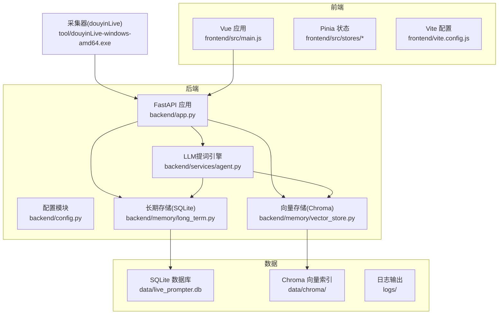
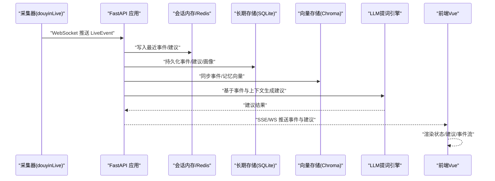
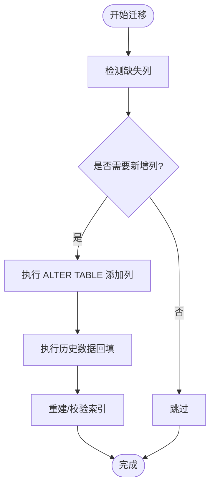
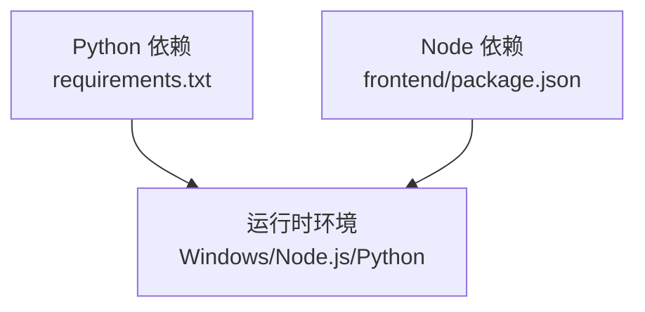

# 维护与升级策略

<cite>
**本文引用的文件**
- [README.md](file://README.md)
- [USAGE.md](file://USAGE.md)
- [requirements.txt](file://requirements.txt)
- [backend/app.py](file://backend/app.py)
- [backend/config.py](file://backend/config.py)
- [backend/memory/vector_store.py](file://backend/memory/vector_store.py)
- [backend/memory/long_term.py](file://backend/memory/long_term.py)
- [backend/services/agent.py](file://backend/services/agent.py)
- [frontend/package.json](file://frontend/package.json)
- [frontend/vite.config.js](file://frontend/vite.config.js)
- [frontend/src/main.js](file://frontend/src/main.js)
- [data/DATABASE.md](file://data/DATABASE.md)
- [start_all.ps1](file://start_all.ps1)
- [start_backend_qwen.ps1](file://start_backend_qwen.ps1)
- [tests/test_agent.py](file://tests/test_agent.py)
</cite>

## 目录
1. [简介](#简介)
2. [项目结构](#项目结构)
3. [核心组件](#核心组件)
4. [架构总览](#架构总览)
5. [详细组件分析](#详细组件分析)
6. [依赖分析](#依赖分析)
7. [性能考量](#性能考量)
8. [故障排查指南](#故障排查指南)
9. [结论](#结论)
10. [附录](#附录)

## 简介
本指南面向DouYin_llm项目的维护与升级，围绕版本管理、数据库迁移、依赖更新流程、配置管理、备份恢复策略以及升级风险评估等方面，提供可操作的策略与最佳实践。项目采用Python FastAPI后端、Vue 3前端与SQLite/Chroma向量存储的组合，具备可选Redis会话共享与在线LLM（Qwen/OpenAI兼容）能力。

## 项目结构
项目采用前后端分离与模块化组织：
- 后端（Python）：FastAPI应用、配置模块、内存与向量存储、事件处理与LLM提词引擎
- 前端（Vue 3）：Pinia状态管理、组件化UI、Vite开发与代理
- 数据与文档：SQLite数据库schema说明、Chroma向量索引、日志与工具脚本
- 运维脚本：Windows PowerShell启动脚本、依赖清单

图示来源
- [backend/app.py:1-285](file://backend/app.py#L1-L285)
- [backend/config.py:1-113](file://backend/config.py#L1-L113)
- [backend/memory/long_term.py:1-967](file://backend/memory/long_term.py#L1-L967)
- [backend/memory/vector_store.py:1-317](file://backend/memory/vector_store.py#L1-L317)
- [backend/services/agent.py:1-496](file://backend/services/agent.py#L1-L496)
- [frontend/src/main.js:1-17](file://frontend/src/main.js#L1-L17)
- [frontend/vite.config.js:1-23](file://frontend/vite.config.js#L1-L23)

章节来源
- [README.md:32-44](file://README.md#L32-L44)
- [USAGE.md:15-256](file://USAGE.md#L15-L256)

## 核心组件
- FastAPI后端应用：提供健康检查、事件流、会话与观众数据接口，集成会话内存、长期存储与向量存储
- 配置模块：统一从环境变量与.env加载配置，支持LLM、嵌入、Redis、Chroma与数据目录等参数
- 记忆与向量：会话内存（可选Redis）、SQLite长期存储、Chroma向量索引与回退哈希嵌入
- LLM提词引擎：OpenAI兼容调用与启发式规则双通道，具备错误降级与状态上报
- 前端应用：Vue 3 + Pinia，通过Vite代理访问后端REST与WebSocket

章节来源
- [backend/app.py:108-126](file://backend/app.py#L108-L126)
- [backend/config.py:40-113](file://backend/config.py#L40-L113)
- [backend/memory/vector_store.py:59-317](file://backend/memory/vector_store.py#L59-L317)
- [backend/memory/long_term.py:44-967](file://backend/memory/long_term.py#L44-L967)
- [backend/services/agent.py:23-496](file://backend/services/agent.py#L23-L496)
- [frontend/src/main.js:1-17](file://frontend/src/main.js#L1-L17)

## 架构总览
系统通过采集器将抖音直播事件转化为标准LiveEvent，后端进行事件归一化、持久化、记忆抽取与提词生成，并通过SSE/WS实时推送到前端。前端组件响应式展示事件流、建议与状态。

图示来源
- [README.md:7-17](file://README.md#L7-L17)
- [backend/app.py:73-102](file://backend/app.py#L73-L102)
- [backend/services/agent.py:105-142](file://backend/services/agent.py#L105-L142)

## 详细组件分析

### 版本管理策略
- 语义化版本控制
  - 后端应用版本：在FastAPI应用中显式声明版本号，便于监控与追踪
    - 参考路径：[backend/app.py:119](file://backend/app.py#L119)
  - 前端包版本：package.json中定义版本，用于发布与依赖锁定
    - 参考路径：[frontend/package.json:4](file://frontend/package.json#L4)
- 依赖版本锁定
  - Python依赖：requirements.txt固定版本范围，避免破坏性变更
    - 参考路径：[requirements.txt:1-6](file://requirements.txt#L1-L6)
  - Node依赖：通过package-lock.json锁定前端依赖版本
    - 参考路径：[frontend/package.json:1-23](file://frontend/package.json#L1-L23)
- 兼容性管理
  - 配置模块对环境变量与默认值的兼容处理，确保不同部署环境可平滑切换
    - 参考路径：[backend/config.py:40-113](file://backend/config.py#L40-L113)

章节来源
- [backend/app.py:119](file://backend/app.py#L119)
- [frontend/package.json:4](file://frontend/package.json#L4)
- [requirements.txt:1-6](file://requirements.txt#L1-L6)
- [backend/config.py:40-113](file://backend/config.py#L40-L113)

### 数据库迁移策略
- Schema变更
  - SQLite长期存储通过初始化阶段创建/更新表结构与索引，支持列增量添加与历史数据回填
    - 参考路径：[backend/memory/long_term.py:63-187](file://backend/memory/long_term.py#L63-L187)
  - 事件表新增字段（如session_id、viewer_id等）通过ALTER TABLE动态添加
    - 参考路径：[backend/memory/long_term.py:188-214](file://backend/memory/long_term.py#L188-L214)
- 数据迁移脚本
  - 历史数据回填逻辑集中于回填函数，确保旧数据与新字段一致性
    - 参考路径：[backend/memory/long_term.py:279-309](file://backend/memory/long_term.py#L279-L309)
- 回滚策略
  - 采用“向前兼容”的增量迁移：不删除现有列，仅新增必要字段；如需回滚，可移除新增列（谨慎操作）
  - 建议在迁移前备份SQLite数据库文件
    - 参考路径：[data/DATABASE.md:1-151](file://data/DATABASE.md#L1-L151)

图示来源
- [backend/memory/long_term.py:188-214](file://backend/memory/long_term.py#L188-L214)
- [backend/memory/long_term.py:279-309](file://backend/memory/long_term.py#L279-L309)
- [backend/memory/long_term.py:216-229](file://backend/memory/long_term.py#L216-L229)

章节来源
- [backend/memory/long_term.py:63-229](file://backend/memory/long_term.py#L63-L229)
- [data/DATABASE.md:1-151](file://data/DATABASE.md#L1-L151)

### 依赖更新流程
- 安全补丁
  - Python依赖：定期更新requirements.txt中的安全相关包版本，结合CI扫描
    - 参考路径：[requirements.txt:1-6](file://requirements.txt#L1-L6)
  - Node依赖：通过npm audit与更新策略，确保前端依赖安全
    - 参考路径：[frontend/package.json:1-23](file://frontend/package.json#L1-L23)
- 功能升级
  - 采用“小步快跑”策略，先在测试环境验证，再逐步引入新特性
  - 对LLM相关依赖（如OpenAI兼容SDK）进行灰度发布与降级回滚
- 破坏性变更处理
  - 通过配置模块与环境变量隔离变更，确保默认行为不变
    - 参考路径：[backend/config.py:40-113](file://backend/config.py#L40-L113)
  - 对向量存储与嵌入模型变更，提供回退机制（Hash嵌入）
    - 参考路径：[backend/memory/vector_store.py:34-57](file://backend/memory/vector_store.py#L34-L57)

章节来源
- [requirements.txt:1-6](file://requirements.txt#L1-L6)
- [frontend/package.json:1-23](file://frontend/package.json#L1-L23)
- [backend/config.py:40-113](file://backend/config.py#L40-L113)
- [backend/memory/vector_store.py:34-57](file://backend/memory/vector_store.py#L34-L57)

### 配置管理策略
- 环境变量迁移
  - 通过配置模块统一加载.env与环境变量，支持运行时切换
    - 参考路径：[backend/config.py:12-37](file://backend/config.py#L12-L37)
- 配置文件版本控制
  - .env示例与实际配置分离，避免敏感信息入库
    - 参考路径：[USAGE.md:28-41](file://USAGE.md#L28-L41)
- 敏感信息保护
  - LLM API Key与DashScope Key通过环境变量注入，不在代码中硬编码
    - 参考路径：[backend/config.py:60-67](file://backend/config.py#L60-L67)
  - 前端通过代理访问后端，避免泄露后端地址与密钥
    - 参考路径：[frontend/vite.config.js:12-20](file://frontend/vite.config.js#L12-L20)

章节来源
- [backend/config.py:12-37](file://backend/config.py#L12-L37)
- [USAGE.md:28-41](file://USAGE.md#L28-L41)
- [backend/config.py:60-67](file://backend/config.py#L60-L67)
- [frontend/vite.config.js:12-20](file://frontend/vite.config.js#L12-L20)

### 备份恢复策略
- 数据备份
  - SQLite数据库文件：定期复制data/live_prompter.db
    - 参考路径：[data/DATABASE.md:3](file://data/DATABASE.md#L3)
  - Chroma向量索引：备份data/chroma目录，支持重建
    - 参考路径：[README.md:196](file://README.md#L196)
- 灾难恢复
  - 通过重建脚本与回填逻辑恢复向量索引与历史数据
    - 参考路径：[backend/memory/long_term.py:438-453](file://backend/memory/long_term.py#L438-L453)
- 业务连续性
  - 启动脚本确保后端与前端同时启动，减少停机窗口
    - 参考路径：[start_all.ps1:11-17](file://start_all.ps1#L11-L17)

章节来源
- [data/DATABASE.md:3](file://data/DATABASE.md#L3)
- [README.md:196](file://README.md#L196)
- [backend/memory/long_term.py:438-453](file://backend/memory/long_term.py#L438-L453)
- [start_all.ps1:11-17](file://start_all.ps1#L11-L17)

### 升级风险评估
- 影响分析
  - LLM模型与系统提示词：通过SQLite app_settings与后端接口动态调整，降低升级影响
    - 参考路径：[backend/memory/long_term.py:176-181](file://backend/memory/long_term.py#L176-L181)
    - 参考路径：[backend/app.py:224-235](file://backend/app.py#L224-L235)
  - 向量模型与嵌入签名：通过embedding_signature区分不同模式与模型，便于切换与回滚
    - 参考路径：[backend/config.py:106-109](file://backend/config.py#L106-L109)
    - 参考路径：[backend/memory/vector_store.py:68](file://backend/memory/vector_store.py#L68)
- 测试验证
  - 单元测试覆盖LLM生成、向量检索与数据库操作
    - 参考路径：[tests/test_agent.py:41-176](file://tests/test_agent.py#L41-L176)
- 应急预案
  - LLM失败自动回退至启发式规则，确保系统可用性
    - 参考路径：[backend/services/agent.py:200-216](file://backend/services/agent.py#L200-L216)

章节来源
- [backend/memory/long_term.py:176-181](file://backend/memory/long_term.py#L176-L181)
- [backend/app.py:224-235](file://backend/app.py#L224-L235)
- [backend/config.py:106-109](file://backend/config.py#L106-L109)
- [backend/memory/vector_store.py:68](file://backend/memory/vector_store.py#L68)
- [tests/test_agent.py:41-176](file://tests/test_agent.py#L41-L176)
- [backend/services/agent.py:200-216](file://backend/services/agent.py#L200-L216)

## 依赖分析
- Python后端依赖
  - FastAPI、Uvicorn、Redis、Chromadb、websocket-client等，版本在requirements.txt中固定
    - 参考路径：[requirements.txt:1-6](file://requirements.txt#L1-L6)
- 前端依赖
  - Vue 3、Pinia、Vite及相关构建工具，版本在package.json中声明
    - 参考路径：[frontend/package.json:11-22](file://frontend/package.json#L11-L22)
- 运行时依赖
  - Windows可执行采集器、Node.js与Python运行时
    - 参考路径：[README.md:48-52](file://README.md#L48-L52)

图示来源
- [requirements.txt:1-6](file://requirements.txt#L1-L6)
- [frontend/package.json:11-22](file://frontend/package.json#L11-L22)
- [README.md:48-52](file://README.md#L48-L52)

章节来源
- [requirements.txt:1-6](file://requirements.txt#L1-L6)
- [frontend/package.json:11-22](file://frontend/package.json#L11-L22)
- [README.md:48-52](file://README.md#L48-L52)

## 性能考量
- 向量检索优化
  - 通过相似度阈值与查询上限控制召回规模，避免性能退化
    - 参考路径：[backend/memory/vector_store.py:92-108](file://backend/memory/vector_store.py#L92-L108)
- SQLite写入优化
  - 事务批量写入与索引优化，减少磁盘IO
    - 参考路径：[backend/memory/long_term.py:216-229](file://backend/memory/long_term.py#L216-L229)
- LLM调用超时与降级
  - 设置合理超时与回退策略，保障前端体验
    - 参考路径：[backend/services/agent.py:330-393](file://backend/services/agent.py#L330-L393)

## 故障排查指南
- 常见问题定位
  - 页面无建议：检查采集器是否启动、.env配置与房间号
    - 参考路径：[USAGE.md:200-208](file://USAGE.md#L200-L208)
  - 显示fallback：检查API Key、网络与限流
    - 参考路径：[USAGE.md:209-218](file://USAGE.md#L209-L218)
  - 前端无法打开：检查端口占用与启动脚本
    - 参考路径：[USAGE.md:226-232](file://USAGE.md#L226-L232)
  - 后端未写入数据：确认采集器连接与房间状态
    - 参考路径：[USAGE.md:233-240](file://USAGE.md#L233-L240)
- 日志与调试
  - 后端日志输出与调试客户端
    - 参考路径：[README.md:196](file://README.md#L196)
    - 参考路径：[USAGE.md:181-191](file://USAGE.md#L181-L191)

章节来源
- [USAGE.md:200-240](file://USAGE.md#L200-L240)
- [README.md:196](file://README.md#L196)
- [USAGE.md:181-191](file://USAGE.md#L181-L191)

## 结论
本策略以“可追踪、可回滚、可降级”为核心原则，结合语义化版本、依赖锁定、数据库增量迁移与配置隔离，确保系统在演进过程中的稳定性与可维护性。通过完善的测试与应急预案，可在升级过程中最大限度降低风险并保障业务连续性。

## 附录
- 启动与运维
  - 后端启动脚本：start_backend_qwen.ps1
    - 参考路径：[start_backend_qwen.ps1:11-12](file://start_backend_qwen.ps1#L11-L12)
  - 全量启动脚本：start_all.ps1
    - 参考路径：[start_all.ps1:11-17](file://start_all.ps1#L11-L17)
- 前端入口与代理
  - 应用入口：frontend/src/main.js
    - 参考路径：[frontend/src/main.js:12-16](file://frontend/src/main.js#L12-L16)
  - Vite代理配置：frontend/vite.config.js
    - 参考路径：[frontend/vite.config.js:12-20](file://frontend/vite.config.js#L12-L20)

章节来源
- [start_backend_qwen.ps1:11-12](file://start_backend_qwen.ps1#L11-L12)
- [start_all.ps1:11-17](file://start_all.ps1#L11-L17)
- [frontend/src/main.js:12-16](file://frontend/src/main.js#L12-L16)
- [frontend/vite.config.js:12-20](file://frontend/vite.config.js#L12-L20)