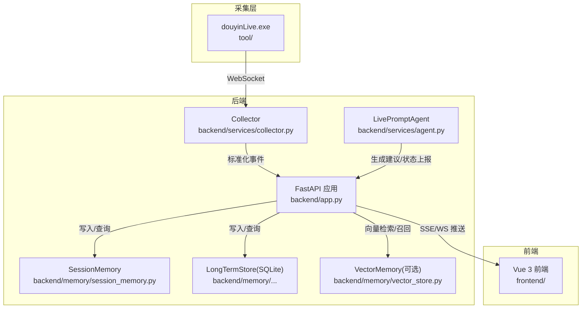
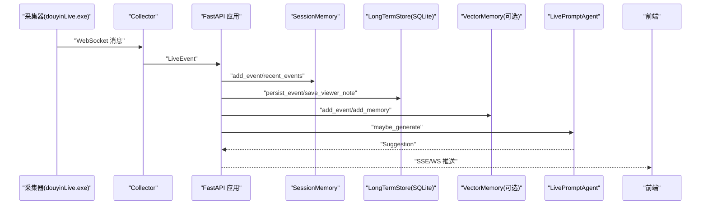
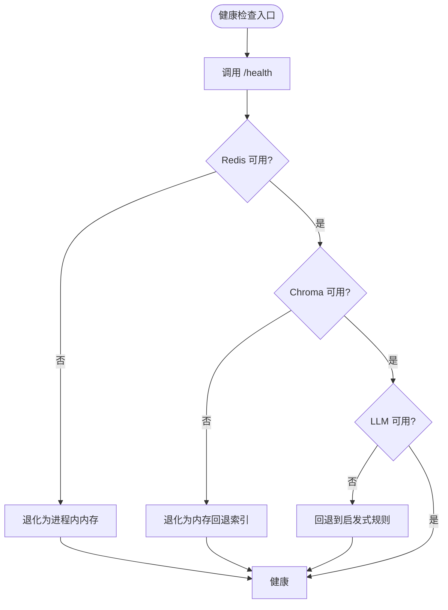
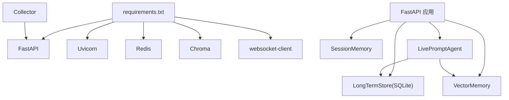
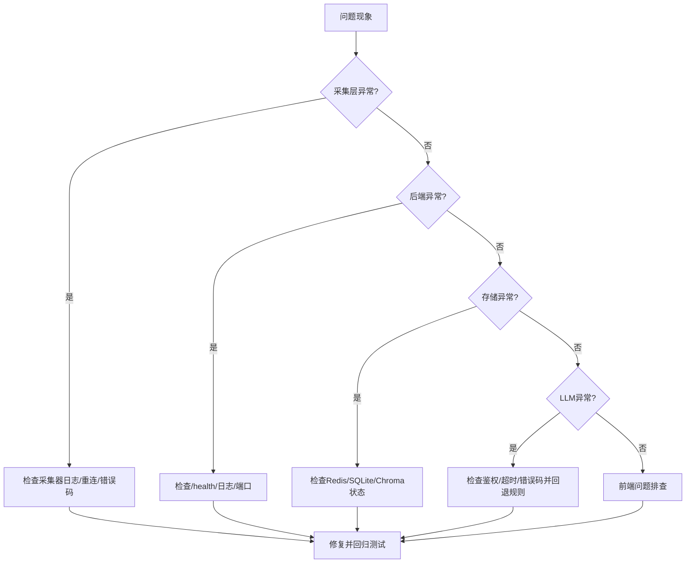

# 运维监控

<cite>
**本文引用的文件**
- [backend/app.py](file://backend/app.py)
- [backend/config.py](file://backend/config.py)
- [backend/services/collector.py](file://backend/services/collector.py)
- [backend/memory/session_memory.py](file://backend/memory/session_memory.py)
- [backend/memory/vector_store.py](file://backend/memory/vector_store.py)
- [backend/services/agent.py](file://backend/services/agent.py)
- [backend/schemas/live.py](file://backend/schemas/live.py)
- [README.md](file://README.md)
- [USAGE.md](file://USAGE.md)
- [requirements.txt](file://requirements.txt)
- [start_all.ps1](file://start_all.ps1)
- [start_backend_qwen.ps1](file://start_backend_qwen.ps1)
- [tests/test_agent.py](file://tests/test_agent.py)
- [tests/test_embedding_service.py](file://tests/test_embedding_service.py)
</cite>

## 目录
1. [简介](#简介)
2. [项目结构](#项目结构)
3. [核心组件](#核心组件)
4. [架构总览](#架构总览)
5. [详细组件分析](#详细组件分析)
6. [依赖分析](#依赖分析)
7. [性能考量](#性能考量)
8. [故障排查指南](#故障排查指南)
9. [结论](#结论)
10. [附录](#附录)

## 简介
本指南面向DouYin_llm项目的运维与监控，围绕日志管理、性能监控、告警机制、健康检查、容量规划与故障排查展开。结合后端FastAPI应用、采集器、内存与向量存储、LLM提词代理等模块的实际实现，给出可落地的运维实践建议与可视化图示。

## 项目结构
项目采用三层结构：采集层（tool/douyinLive.exe）、后端（FastAPI + 服务与内存模块）、前端（Vue 3）。后端提供REST/SSE/WebSocket接口，采集器对接本地WebSocket并将事件标准化后交由后端处理；短期会话与长期记忆分别落盘至Redis/内存与SQLite，向量索引可选Chroma；LLM提词代理在在线模型与启发式规则之间进行回退。

图表来源
- [README.md:7-17](file://README.md#L7-L17)
- [backend/app.py:108-126](file://backend/app.py#L108-L126)
- [backend/services/collector.py:38-59](file://backend/services/collector.py#L38-L59)
- [backend/memory/session_memory.py:17-31](file://backend/memory/session_memory.py#L17-L31)
- [backend/memory/vector_store.py:59-84](file://backend/memory/vector_store.py#L59-L84)
- [backend/services/agent.py:23-36](file://backend/services/agent.py#L23-L36)

章节来源
- [README.md:32-44](file://README.md#L32-L44)
- [USAGE.md:94-94](file://USAGE.md#L94-L94)

## 核心组件
- 配置中心：集中管理运行参数与默认值，支持环境变量与.env文件覆盖。
- 采集器：连接本地WebSocket，标准化消息为LiveEvent并投递到后端事件循环。
- 会话内存：短期事件与建议缓存，支持Redis或进程内deque退化。
- 长期存储：SQLite持久化事件、建议、观众记忆、笔记、LLM设置与会话。
- 向量存储：Chroma持久化与召回，支持云端/本地嵌入函数与回退哈希。
- 提词代理：在线模型与启发式规则双通道，生成建议并上报模型状态。
- 健康检查：/health接口返回运行状态、当前房间与活动会话。

章节来源
- [backend/config.py:40-113](file://backend/config.py#L40-L113)
- [backend/services/collector.py:38-266](file://backend/services/collector.py#L38-L266)
- [backend/memory/session_memory.py:17-113](file://backend/memory/session_memory.py#L17-L113)
- [backend/memory/vector_store.py:59-317](file://backend/memory/vector_store.py#L59-L317)
- [backend/services/agent.py:23-496](file://backend/services/agent.py#L23-L496)
- [backend/app.py:129-136](file://backend/app.py#L129-L136)

## 架构总览
后端作为统一入口，负责事件归一化、持久化、记忆抽取、提词生成与实时推送。采集器与后端通过WebSocket连接，后端通过SSE与WebSocket向前端推送事件、建议、统计与模型状态。

图表来源
- [backend/app.py:73-102](file://backend/app.py#L73-L102)
- [backend/services/collector.py:145-159](file://backend/services/collector.py#L145-L159)
- [backend/services/agent.py:105-142](file://backend/services/agent.py#L105-L142)
- [backend/memory/vector_store.py:149-171](file://backend/memory/vector_store.py#L149-L171)

## 详细组件分析

### 日志管理
- 日志级别与格式
  - 后端默认日志级别为INFO，格式包含级别、名称与消息。
  - 采集器、向量存储、提词代理均使用标准库日志记录关键事件与错误。
- 日志轮转与集中化
  - 当前未集成第三方日志轮转组件；建议在部署环境中引入日志轮转（如RotatingFileHandler）并在容器/主机侧通过日志代理（如Filebeat/Fluent Bit）集中到ELK/OTel等平台。
- 日志位置
  - 项目文档提及logs目录用于历史调试输出，可作为本地调试阶段的日志落盘位置。

章节来源
- [backend/app.py:25-25](file://backend/app.py#L25-L25)
- [backend/services/collector.py:20-20](file://backend/services/collector.py#L20-L20)
- [backend/memory/vector_store.py:16-16](file://backend/memory/vector_store.py#L16-L16)
- [backend/services/agent.py:15-15](file://backend/services/agent.py#L15-L15)
- [README.md:197-197](file://README.md#L197-L197)

### 性能监控
- 系统资源监控
  - CPU/内存/磁盘IO：通过操作系统监控工具（如top/htop、Windows任务管理器、Prometheus Node Exporter）采集。
  - 网络：采集器与后端之间的WebSocket延迟与丢包率。
- 应用性能指标
  - FastAPI端点耗时与错误率：可使用中间件或OpenTelemetry SDK埋点。
  - 采集器吞吐：记录每秒事件数、重连次数与错误码分布。
  - 会话内存与向量检索：记录最近事件/建议条数、查询耗时与命中率。
  - LLM调用：请求耗时、成功率、错误类型（网络/超时/解析失败）与回退次数。
- 业务指标
  - 建议生成速率、建议优先级分布、建议置信度分布、观众记忆命中率、会话活跃度（事件/建议/访客数）。

章节来源
- [backend/app.py:108-126](file://backend/app.py#L108-L126)
- [backend/services/collector.py:118-140](file://backend/services/collector.py#L118-L140)
- [backend/memory/session_memory.py:86-102](file://backend/memory/session_memory.py#L86-L102)
- [backend/memory/vector_store.py:172-230](file://backend/memory/vector_store.py#L172-L230)
- [backend/services/agent.py:200-217](file://backend/services/agent.py#L200-L217)

### 告警机制
- 阈值告警
  - LLM错误率、超时率、回退率超过阈值触发。
  - 采集器断线重连频率过高、WebSocket错误码异常。
  - 向量检索失败率上升、Chroma不可用。
  - SSE/WS连接断流、事件积压。
- 异常检测
  - 模型状态异常波动（如连续超时/网络错误）。
  - 事件类型分布异常（如礼物/关注事件骤降）。
- 通知渠道
  - 邮件、IM机器人（企业微信/钉钉/Slack）、PagerDuty等。

章节来源
- [backend/services/agent.py:302-437](file://backend/services/agent.py#L302-L437)
- [backend/services/collector.py:161-180](file://backend/services/collector.py#L161-L180)
- [backend/memory/vector_store.py:180-210](file://backend/memory/vector_store.py#L180-L210)

### 健康检查
- 服务可用性
  - /health接口返回状态、当前房间与活动会话，用于Kubernetes探针或负载均衡健康检查。
- 依赖服务检查
  - Redis可用性（SessionMemory退化逻辑依赖）。
  - SQLite写入与查询可用性。
  - Chroma客户端连接与集合存在性。
  - LLM服务连通性与鉴权。
- 自动故障转移
  - Redis不可用时自动切换到进程内内存。
  - Chroma不可用时使用内存回退索引。
  - LLM失败时自动回退到启发式规则。

图表来源
- [backend/app.py:129-136](file://backend/app.py#L129-L136)
- [backend/memory/session_memory.py:29-31](file://backend/memory/session_memory.py#L29-L31)
- [backend/memory/vector_store.py:70-84](file://backend/memory/vector_store.py#L70-L84)
- [backend/services/agent.py:200-217](file://backend/services/agent.py#L200-L217)

章节来源
- [backend/app.py:129-136](file://backend/app.py#L129-L136)
- [backend/memory/session_memory.py:29-31](file://backend/memory/session_memory.py#L29-L31)
- [backend/memory/vector_store.py:70-84](file://backend/memory/vector_store.py#L70-L84)
- [backend/services/agent.py:200-217](file://backend/services/agent.py#L200-L217)

### 容量规划
- 资源使用趋势分析
  - 事件/建议增长趋势、会话内存占用、SQLite文件大小、Chroma索引大小。
- 扩容预警
  - Redis/Chroma/LLM配额接近上限时发出预警。
  - SSE/WS连接数与消息积压达到阈值。
- 成本优化
  - 评估云端嵌入与LLM调用成本，选择合适模型与批大小。
  - 在低峰期降低会话TTL与查询限制，减少Chroma重建频率。

章节来源
- [backend/config.py:52-76](file://backend/config.py#L52-L76)
- [backend/memory/session_memory.py:86-102](file://backend/memory/session_memory.py#L86-L102)
- [backend/memory/vector_store.py:172-230](file://backend/memory/vector_store.py#L172-L230)

## 依赖分析
- 运行时依赖
  - FastAPI、Uvicorn、Redis、Chroma、websocket-client。
- 组件耦合
  - Collector与FastAPI事件循环耦合，通过run_coroutine_threadsafe回调处理异常。
  - Agent依赖VectorMemory与LongTermStore，状态通过ModelStatus上报。
  - SessionMemory可选Redis，避免强依赖。

图表来源
- [requirements.txt:1-6](file://requirements.txt#L1-L6)
- [backend/services/collector.py:187-188](file://backend/services/collector.py#L187-L188)
- [backend/services/agent.py:24-27](file://backend/services/agent.py#L24-L27)
- [backend/memory/session_memory.py:29-31](file://backend/memory/session_memory.py#L29-L31)

章节来源
- [requirements.txt:1-6](file://requirements.txt#L1-L6)
- [backend/services/collector.py:182-196](file://backend/services/collector.py#L182-L196)
- [backend/services/agent.py:23-36](file://backend/services/agent.py#L23-L36)

## 性能考量
- 事件处理路径
  - 采集器接收消息 → 标准化 → 投递到事件循环 → 写入短期/长期存储 → 向量索引 → 生成建议 → 推送前端。
- 关键瓶颈
  - LLM调用延迟与失败率。
  - 向量检索与排序计算。
  - SSE/WS推送并发与消息积压。
- 优化建议
  - 缓存LLM设置与模型签名，减少重复解析。
  - 合理设置会话TTL与查询限制，避免内存膨胀。
  - 在容器中限制CPU/内存，结合HPA实现弹性伸缩。

章节来源
- [backend/app.py:73-102](file://backend/app.py#L73-L102)
- [backend/services/agent.py:302-437](file://backend/services/agent.py#L302-L437)
- [backend/memory/vector_store.py:172-230](file://backend/memory/vector_store.py#L172-L230)

## 故障排查指南
- 采集层问题
  - 确认采集器已启动且WebSocket地址与房间号匹配；检查重连日志与错误码。
- 后端接口问题
  - 查看/health返回状态与活动会话；检查SSE/WS连接是否正常。
- 存储问题
  - Redis不可用时自动退化为进程内内存；SQLite写入失败需检查磁盘空间与权限。
  - Chroma不可用时使用内存回退索引；必要时重建索引。
- LLM问题
  - 检查鉴权头、超时与错误码；出现网络/超时/解析失败时回退到启发式规则。
- 前端问题
  - 确认端口占用与跨域配置；查看状态条与建议来源标签判断当前模式。

图表来源
- [backend/services/collector.py:118-140](file://backend/services/collector.py#L118-L140)
- [backend/app.py:129-136](file://backend/app.py#L129-L136)
- [backend/memory/session_memory.py:29-31](file://backend/memory/session_memory.py#L29-L31)
- [backend/memory/vector_store.py:70-84](file://backend/memory/vector_store.py#L70-L84)
- [backend/services/agent.py:302-437](file://backend/services/agent.py#L302-L437)

章节来源
- [USAGE.md:198-240](file://USAGE.md#L198-L240)
- [tests/test_agent.py:91-115](file://tests/test_agent.py#L91-L115)
- [tests/test_embedding_service.py:71-79](file://tests/test_embedding_service.py#L71-L79)

## 结论
本指南基于现有代码实现，给出了日志、性能、告警、健康检查与容量规划的运维实践建议。建议在生产环境中补充日志轮转与集中化、应用指标埋点与告警、健康检查探针与自动回退策略，并结合容量趋势制定弹性与成本优化方案。

## 附录
- 启动脚本
  - start_all.ps1：同时启动后端与前端。
  - start_backend_qwen.ps1：以Qwen在线模式启动后端。
- 接口速查
  - /health、/api/bootstrap、/api/room、/api/events、/api/viewer、/api/settings/llm、/api/events/stream、/ws/live。

章节来源
- [start_all.ps1:11-17](file://start_all.ps1#L11-L17)
- [start_backend_qwen.ps1:11-12](file://start_backend_qwen.ps1#L11-L12)
- [README.md:151-166](file://README.md#L151-L166)