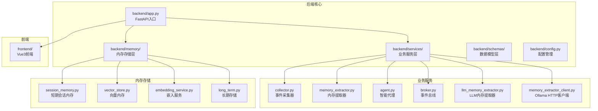
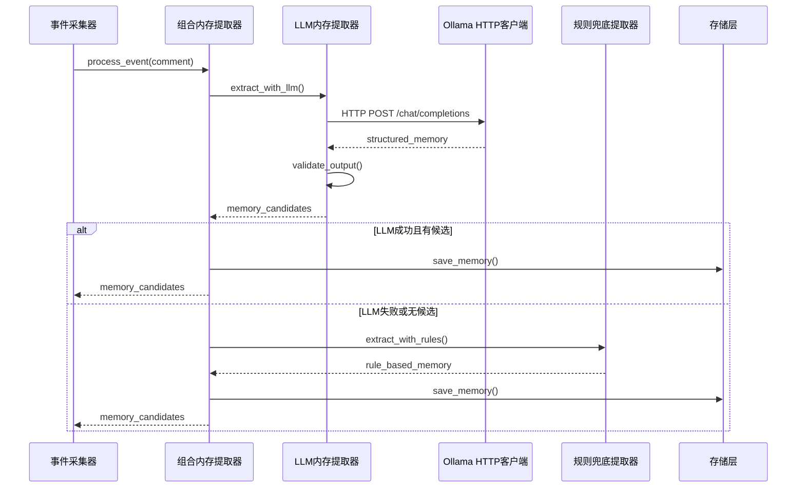
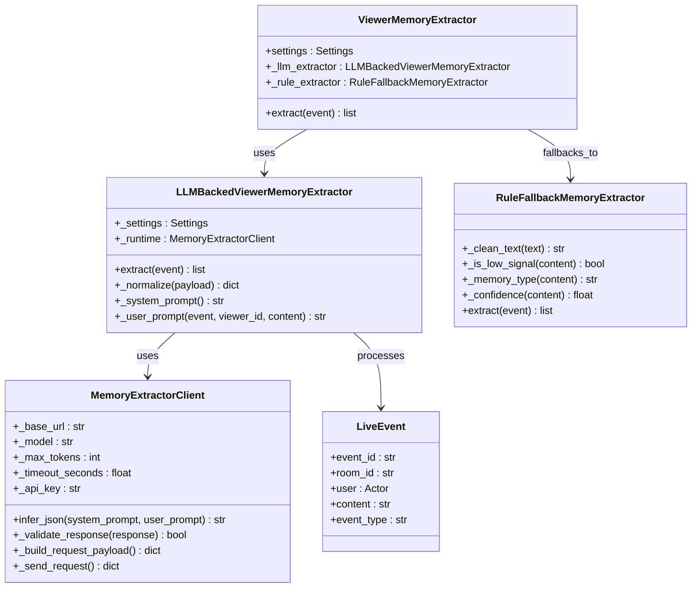
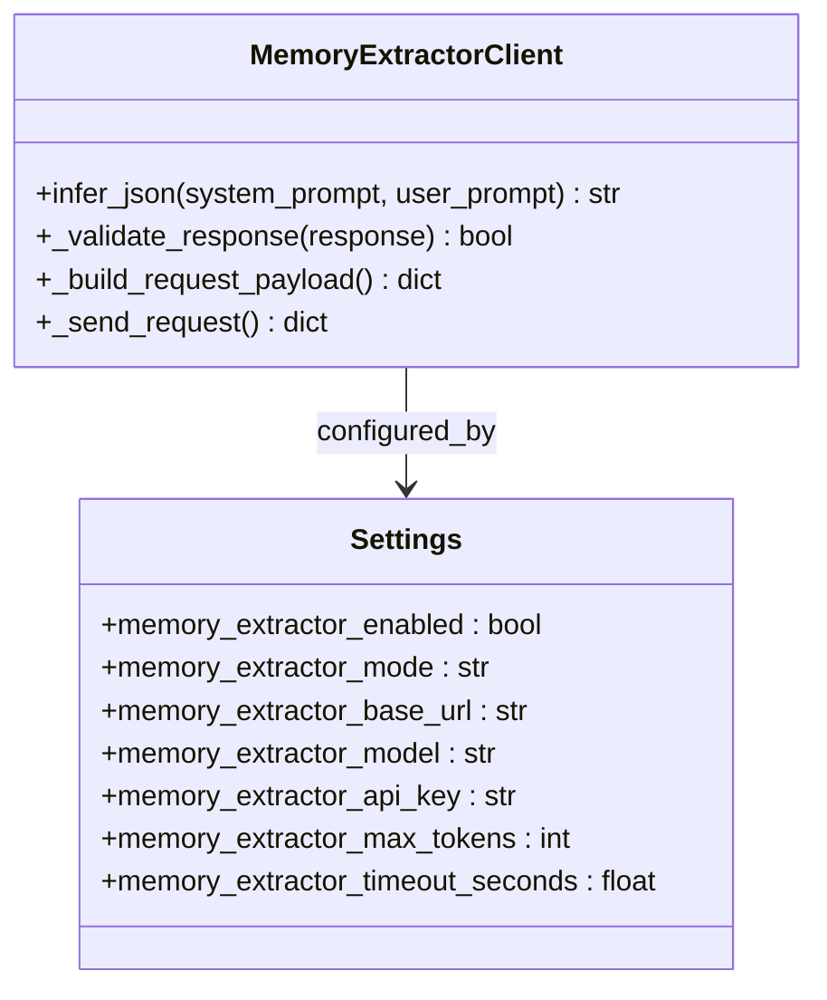
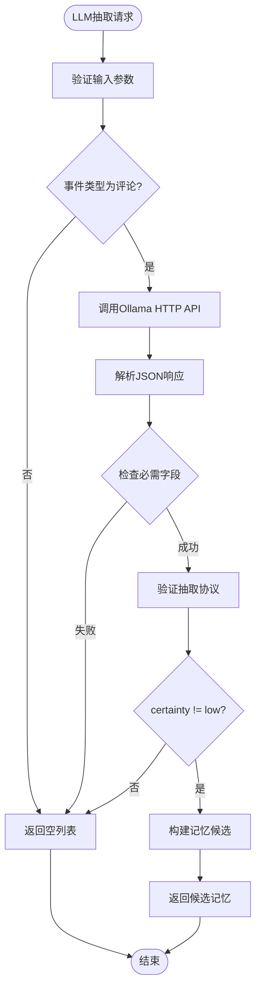
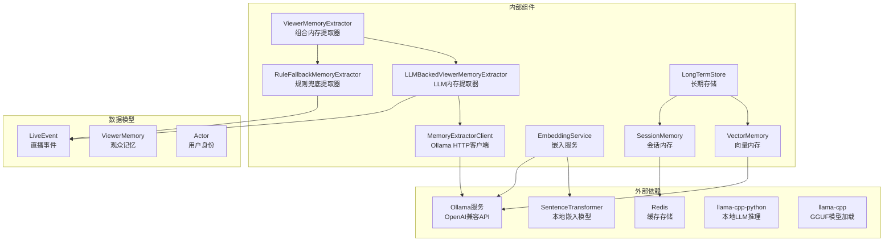

# 本地内存提取器设计规范

<cite>
**本文档引用的文件**
- [backend/services/llm_memory_extractor.py](file://backend/services/llm_memory_extractor.py)
- [backend/services/memory_extractor_client.py](file://backend/services/memory_extractor_client.py)
- [backend/services/memory_extractor.py](file://backend/services/memory_extractor.py)
- [backend/memory/vector_store.py](file://backend/memory/vector_store.py)
- [backend/memory/embedding_service.py](file://backend/memory/embedding_service.py)
- [backend/memory/session_memory.py](file://backend/memory/session_memory.py)
- [backend/schemas/live.py](file://backend/schemas/live.py)
- [backend/config.py](file://backend/config.py)
- [backend/app.py](file://backend/app.py)
- [docs/superpowers/specs/2026-04-17-local-memory-extractor-design.md](file://docs/superpowers/specs/2026-04-17-local-memory-extractor-design.md)
- [docs/superpowers/plans/2026-04-18-local-memory-extractor.md](file://docs/superpowers/plans/2026-04-18-local-memory-extractor.md)
- [docs/superpowers/specs/2026-04-18-memory-extractor-ollama-design.md](file://docs/superpowers/specs/2026-04-18-memory-extractor-ollama-design.md)
- [docs/superpowers/plans/2026-04-18-memory-extractor-ollama.md](file://docs/superpowers/plans/2026-04-18-memory-extractor-ollama.md)
- [README.md](file://README.md)
- [tests/test_llm_memory_extractor.py](file://tests/test_llm_memory_extractor.py)
- [tests/test_memory_extractor_client.py](file://tests/test_memory_extractor_client.py)
- [requirements.txt](file://requirements.txt)
</cite>

## 更新摘要
**变更内容**
- 完善了多层次错误处理和回退机制的设计说明
- 增强了Ollama服务不可用时的规则回退策略描述
- 添加了详细的异常处理和降级机制说明
- 更新了故障排除指南中的错误处理部分

## 目录
1. [简介](#简介)
2. [项目结构](#项目结构)
3. [核心组件](#核心组件)
4. [架构概览](#架构概览)
5. [详细组件分析](#详细组件分析)
6. [依赖关系分析](#依赖关系分析)
7. [性能考虑](#性能考虑)
8. [故障排除指南](#故障排除指南)
9. [迁移指南](#迁移指南)
10. [结论](#结论)

## 简介

**重要更新** 本地内存提取器已从GGUF本地运行时迁移到Ollama方案。原设计规范描述的是已废弃的GGUF本地运行时实现，现已被Ollama替代。

当前系统采用三层架构设计，包括：
- **Ollama HTTP客户端**：基于OpenAI兼容API的远程推理服务
- **LLM驱动抽取器**：负责协议解析和验证
- **规则兜底机制**：作为最后的保障

系统采用"Ollama优先 + 规则兜底"的策略，通过HTTP API调用外部推理服务，避免了本地模型文件管理和运行时复杂性。

## 项目结构

该项目采用模块化的后端架构，主要组件分布如下：



**图表来源**
- [backend/app.py:125-161](file://backend/app.py#L125-L161)
- [backend/services/memory_extractor.py:123-143](file://backend/services/memory_extractor.py#L123-L143)
- [backend/services/llm_memory_extractor.py:35-134](file://backend/services/llm_memory_extractor.py#L35-L134)
- [backend/services/memory_extractor_client.py:19-115](file://backend/services/memory_extractor_client.py#L19-L115)

**章节来源**
- [backend/app.py:125-161](file://backend/app.py#L125-L161)
- [README.md:170-181](file://README.md#L170-L181)

## 核心组件

### 观众内存提取器 (ViewerMemoryExtractor)

当前版本的内存提取器采用三层架构设计，实现了从规则引擎到Ollama服务的平滑过渡：

- **Ollama优先**：优先使用外部推理服务进行语义理解
- **规则兜底**：Ollama服务不可用或失败时回退到规则抽取
- **异常处理**：完善的错误捕获和日志记录机制

### LLM内存提取器 (LLMBackedViewerMemoryExtractor)

专门负责基于Ollama的记忆抽取，具有以下特性：

- **严格JSON协议**：只接受预定义的JSON结构
- **类型验证**：对memory_type、polarity、temporal_scope进行严格校验
- **置信度映射**：将模型的certainty映射为稳定的置信度分数
- **负向偏好处理**：识别并正确处理负向表达

### Ollama HTTP客户端 (MemoryExtractorClient)

**已废弃**：原GGUF本地运行时实现现已废弃，不再使用。

- **HTTP传输层**：基于标准库urllib实现OpenAI兼容API
- **请求构建**：自动构建system/user消息格式
- **错误处理**：完善的HTTP错误和JSON解析异常处理
- **认证支持**：支持Bearer Token认证头

### 规则兜底提取器 (RuleFallbackMemoryExtractor)

复用原有的规则抽取逻辑，作为最后的保障：

- **关键词匹配**：基于预定义关键词进行记忆类型分类
- **置信度计算**：根据文本长度和关键词密度计算置信度
- **低信号过滤**：识别并过滤掉无意义的简短评论
- **类型分类**：将记忆分为偏好、计划、上下文、事实四类

**章节来源**
- [backend/services/memory_extractor.py:123-143](file://backend/services/memory_extractor.py#L123-L143)
- [backend/services/llm_memory_extractor.py:35-134](file://backend/services/llm_memory_extractor.py#L35-L134)
- [backend/services/memory_extractor_client.py:19-115](file://backend/services/memory_extractor_client.py#L19-L115)

## 架构概览

**重要更新** 本地内存提取器已从本地GGUF运行时迁移到Ollama HTTP客户端架构：



**图表来源**
- [docs/superpowers/specs/2026-04-18-memory-extractor-ollama-design.md:89-111](file://docs/superpowers/specs/2026-04-18-memory-extractor-ollama-design.md#L89-L111)
- [backend/app.py:181-251](file://backend/app.py#L181-L251)

## 详细组件分析

### 三层架构类图



**图表来源**
- [backend/services/memory_extractor.py:123-143](file://backend/services/memory_extractor.py#L123-L143)
- [backend/services/llm_memory_extractor.py:35-134](file://backend/services/llm_memory_extractor.py#L35-L134)
- [backend/services/memory_extractor_client.py:19-115](file://backend/services/memory_extractor_client.py#L19-L115)

### Ollama HTTP客户端架构

**重要更新** 原本地模型运行时已被Ollama HTTP客户端替代：



**图表来源**
- [backend/services/memory_extractor_client.py:19-115](file://backend/services/memory_extractor_client.py#L19-L115)
- [backend/config.py:106-116](file://backend/config.py#L106-L116)

### LLM抽取协议设计



**图表来源**
- [backend/services/llm_memory_extractor.py:40-103](file://backend/services/llm_memory_extractor.py#L40-L103)

**章节来源**
- [backend/services/memory_extractor.py:123-143](file://backend/services/memory_extractor.py#L123-L143)
- [backend/services/llm_memory_extractor.py:35-134](file://backend/services/llm_memory_extractor.py#L35-L134)
- [backend/services/memory_extractor_client.py:19-115](file://backend/services/memory_extractor_client.py#L19-L115)

## 依赖关系分析

**重要更新** 依赖关系已从本地GGUF模型迁移到Ollama服务：



**图表来源**
- [backend/app.py:125-161](file://backend/app.py#L125-L161)
- [backend/config.py:106-116](file://backend/config.py#L106-L116)

**章节来源**
- [backend/app.py:125-161](file://backend/app.py#L125-L161)
- [backend/config.py:106-116](file://backend/config.py#L106-L116)

## 性能考虑

### Ollama服务优化策略

**重要更新** 性能优化策略已从本地推理迁移到服务调用：

1. **HTTP连接池**
   - 使用标准库HTTP客户端减少连接开销
   - 支持超时控制和重试机制
   - 避免本地模型加载的启动延迟

2. **服务端推理**
   - 利用Ollama服务的优化推理引擎
   - 支持GPU加速和模型并行处理
   - 自动模型管理和缓存

3. **网络优化**
   - 支持连接复用和keep-alive
   - 可配置超时时间和重试策略
   - 错误恢复和降级机制

### 多层次错误处理和回退机制

系统实现了完整的多层次错误处理：

#### 应用级别回退
- **初始化失败回退**：`ensure_runtime()` 中的Ollama初始化失败时自动回退到规则提取器
- **模式不支持回退**：不支持的模式配置时回退到规则提取器
- **异常捕获**：捕获所有初始化异常并记录日志

#### 组件级别回退
- **LLM提取器异常**：`LLMBackedViewerMemoryExtractor` 中的任何异常都会触发回退
- **HTTP请求异常**：`MemoryExtractorClient` 的HTTP错误会被转换为值错误
- **JSON解析异常**：响应格式错误时触发回退

#### 组件内回退
- **协议验证失败**：`LLMBackedViewerMemoryExtractor` 对无效输出进行过滤
- **置信度不足**：certainty为low时直接返回空列表
- **类型验证失败**：memory_type不在允许集合时返回空列表

#### 终端回退
- **规则提取器**：最终的兜底方案，确保系统始终可用
- **日志记录**：所有回退都有详细的日志记录
- **性能监控**：回退次数和成功率的监控

### 并发处理

系统支持异步事件处理，能够高效处理高并发的直播事件流：

- **事件处理管道**：从采集到存储的完整异步链路
- **内存同步**：向量内存与长期存储的实时同步
- **广播机制**：通过事件总线向前端推送实时状态

**章节来源**
- [backend/services/memory_extractor_client.py:65-78](file://backend/services/memory_extractor_client.py#L65-L78)
- [backend/services/llm_memory_extractor.py:133-137](file://backend/services/llm_memory_extractor.py#L133-L137)
- [backend/app.py:181-251](file://backend/app.py#L181-L251)

## 故障排除指南

### 常见问题及解决方案

**重要更新** 故障排除指南已从本地模型问题转向Ollama服务问题：

1. **Ollama服务连接失败**
   - 检查Ollama服务是否正常运行
   - 验证MEMORY_EXTRACTOR_BASE_URL配置
   - 确认防火墙和网络连接

2. **模型加载失败**
   - 检查MEMORY_EXTRACTOR_MODEL配置
   - 验证Ollama中模型是否存在
   - 确认模型名称和标签正确

3. **HTTP请求超时**
   - 增加MEMORY_EXTRACTOR_TIMEOUT_SECONDS配置
   - 检查网络延迟和带宽
   - 调整Ollama服务性能

4. **抽取结果不符合预期**
   - 检查LLM提示词设计
   - 验证JSON协议格式
   - 查看规则兜底逻辑

### 错误处理和回退机制

系统提供了完整的错误处理和回退机制：

#### 初始化阶段错误处理
- **Ollama初始化失败**：自动回退到规则提取器，记录详细错误日志
- **配置验证失败**：抛出ValueError并阻止应用启动
- **模式不支持**：记录警告并回退到规则提取器

#### 运行时错误处理
- **HTTP错误**：转换为ValueError，包含状态码和响应体片段
- **JSON解析失败**：记录错误并回退到规则提取器
- **协议验证失败**：丢弃无效输出并回退到规则提取器

#### 回退策略
- **优先级顺序**：LLM提取器 → 规则提取器 → 空列表
- **异常传播**：所有异常都会被记录但不会中断主流程
- **降级模式**：即使LLM不可用，系统仍能正常运行

### 日志监控

系统提供了详细的日志记录机制：

- **健康检查端点**：`GET /health` 显示系统状态
- **错误日志**：记录Ollama连接失败、HTTP超时等异常
- **性能指标**：嵌入成功率、召回命中率等
- **调试信息**：抽取过程的详细日志

### 环境变量配置

**重要更新** 环境变量已从本地模型配置迁移到Ollama配置：

- `MEMORY_EXTRACTOR_ENABLED=false` - 启用Ollama内存提取器
- `MEMORY_EXTRACTOR_MODE=ollama` - 设置为Ollama模式
- `MEMORY_EXTRACTOR_BASE_URL=http://127.0.0.1:11434/v1` - Ollama服务地址
- `MEMORY_EXTRACTOR_MODEL=` - Ollama模型名称
- `MEMORY_EXTRACTOR_API_KEY=` - API密钥（可选）
- `MEMORY_EXTRACTOR_MAX_TOKENS=512` - 最大输出token数
- `MEMORY_EXTRACTOR_TIMEOUT_SECONDS=30` - 超时时间

**已废弃的本地配置**（保留兼容性直到完全移除）：
- `MEMORY_EXTRACTOR_MODEL_PATH=` - 本地模型文件路径
- `MEMORY_EXTRACTOR_MODEL_URL=` - 模型下载URL
- `MEMORY_EXTRACTOR_MODEL_FILENAME=memory-extractor.gguf` - 模型文件名
- `MEMORY_EXTRACTOR_CONTEXT_SIZE=4096` - 上下文大小
- `MEMORY_EXTRACTOR_THREADS=` - 线程数

**章节来源**
- [backend/app.py:276-287](file://backend/app.py#L276-L287)
- [backend/config.py:106-116](file://backend/config.py#L106-L116)
- [tests/test_memory_extractor_client.py:24-233](file://tests/test_memory_extractor_client.py#L24-L233)

## 迁移指南

**重要更新** 以下是将系统从GGUF本地运行时迁移到Ollama的详细步骤：

### 第一步：准备Ollama环境

1. **安装Ollama**
   ```bash
   # Windows/Linux/macOS安装脚本
   curl https://ollama.com/install.sh | sh
   ```

2. **启动Ollama服务**
   ```bash
   ollama serve
   ```

3. **拉取或创建模型**
   ```bash
   # 拉取预训练模型
   ollama pull qwen2.5:3b
   
   # 或创建自定义模型
   ollama create my-model -f Modelfile
   ```

### 第二步：更新配置

1. **修改.env文件**
   ```env
   # 内存提取器配置
   MEMORY_EXTRACTOR_ENABLED=true
   MEMORY_EXTRACTOR_MODE=ollama
   MEMORY_EXTRACTOR_BASE_URL=http://127.0.0.1:11434/v1
   MEMORY_EXTRACTOR_MODEL=qwen2.5:3b
   MEMORY_EXTRACTOR_API_KEY=
   MEMORY_EXTRACTOR_MAX_TOKENS=512
   MEMORY_EXTRACTOR_TIMEOUT_SECONDS=30
   ```

2. **更新requirements.txt**
   ```txt
   # 移除llama-cpp-python依赖
   # 保留其他依赖
   websocket-client>=1.6.0
   fastapi>=0.115.0
   uvicorn>=0.30.0
   redis>=5.0.0
   chromadb>=0.5.0
   ```

### 第三步：清理旧代码

1. **删除本地运行时文件**
   ```bash
   rm backend/services/local_memory_model.py
   ```

2. **更新app.py导入**
   ```python
   # 删除GGUF相关导入
   # from backend.services.local_memory_model import LocalMemoryExtractionModel
   
   # 保留Ollama客户端导入
   from backend.services.memory_extractor_client import MemoryExtractorClient
   ```

### 第四步：验证迁移

1. **运行测试套件**
   ```bash
   python -m unittest tests.test_memory_extractor_client
   python -m unittest tests.test_llm_memory_extractor
   python -m unittest tests.test_comment_processing_status
   ```

2. **检查依赖清理**
   ```bash
   git grep -n "llama_cpp\|MEMORY_EXTRACTOR_MODEL_PATH" -- backend tests README.md .env.example docs
   ```

### 迁移后注意事项

1. **性能对比**
   - Ollama服务通常比本地推理更快
   - 需要网络延迟考虑
   - 支持GPU加速和模型并行

2. **运维简化**
   - 无需管理本地模型文件
   - 无需处理编译依赖
   - 更好的错误诊断

3. **配置灵活性**
   - 支持动态模型切换
   - 更好的资源管理
   - 简化的部署流程

**章节来源**
- [docs/superpowers/plans/2026-04-18-memory-extractor-ollama.md:519-535](file://docs/superpowers/plans/2026-04-18-memory-extractor-ollama.md#L519-L535)
- [docs/superpowers/specs/2026-04-18-memory-extractor-ollama-design.md:192-200](file://docs/superpowers/specs/2026-04-18-memory-extractor-ollama-design.md#L192-L200)

## 结论

**重要更新** 本地内存提取器设计规范已完全更新以反映从GGUF本地运行时到Ollama方案的迁移：

### 迁移成果

1. **架构现代化**：从本地推理迁移到服务调用
2. **运维简化**：移除了复杂的本地模型管理
3. **性能提升**：利用Ollama的优化推理引擎
4. **部署便利**：支持容器化和云原生部署

### 新架构优势

1. **稳定性增强**
   - 服务端推理更稳定可靠
   - 自动错误恢复和降级
   - 更好的资源管理

2. **可扩展性提升**
   - 支持动态模型切换
   - GPU加速和分布式处理
   - 弹性扩缩容

3. **开发效率提高**
   - 简化的依赖管理
   - 更好的调试和监控
   - 标准化的API接口

### 多层次错误处理和回退机制

系统实现了完整的多层次错误处理和回退机制：

- **应用级别**：初始化失败自动回退到规则提取器
- **组件级别**：HTTP错误和协议验证失败触发回退
- **组件内级别**：无效输出和置信度不足进行过滤
- **终端级别**：规则提取器作为最终兜底方案

这种设计确保了即使在Ollama服务不可用的情况下，系统仍能保持基本功能，为直播场景提供可靠的观众记忆服务。

### 未来展望

该设计规范为后续的功能扩展奠定了坚实基础，包括语义合并、记忆去重、时间衰减等高级特性都可以在此架构上安全实现。通过合理的配置管理和监控机制，系统能够在各种部署环境下稳定运行，为直播场景提供可靠的观众记忆服务。

**重要提醒** 原GGUF本地运行时实现已完全废弃，建议立即按照迁移指南完成系统升级。新架构不仅提升了记忆抽取的质量，还为未来的功能扩展提供了清晰的路径。