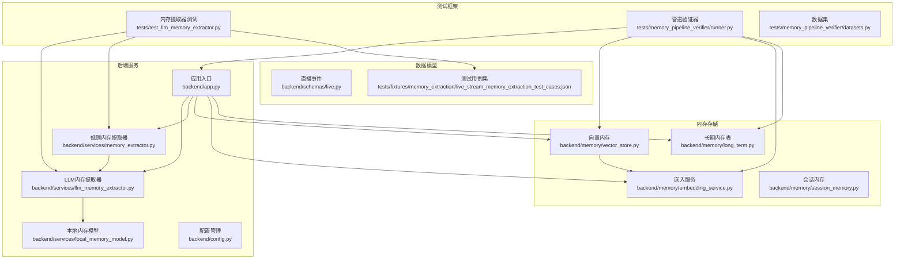
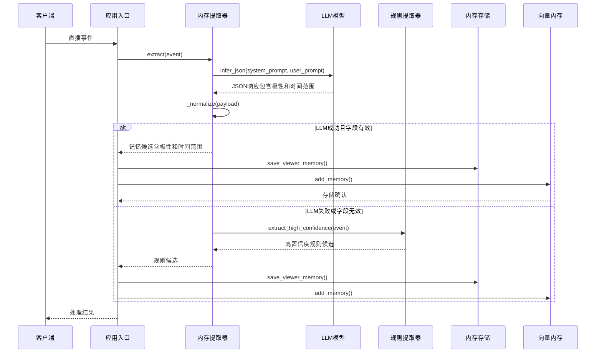
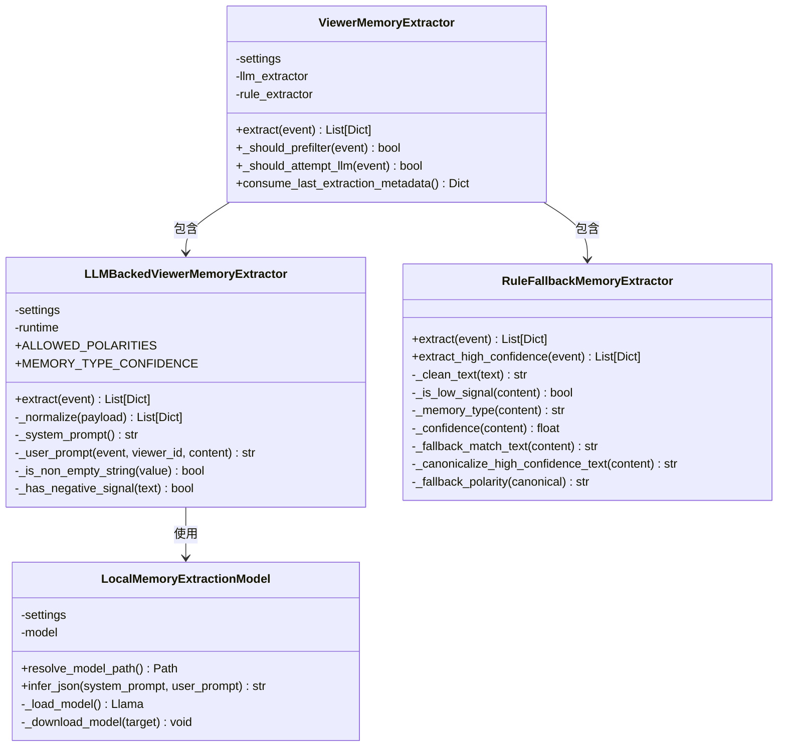
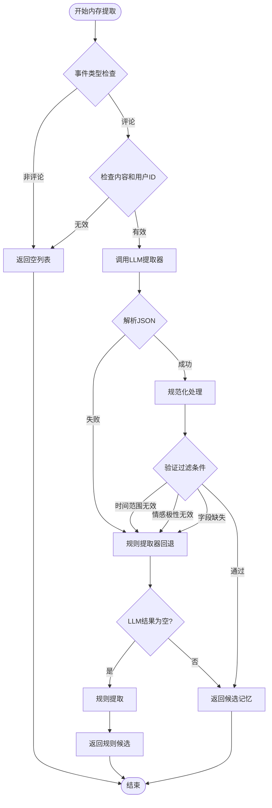
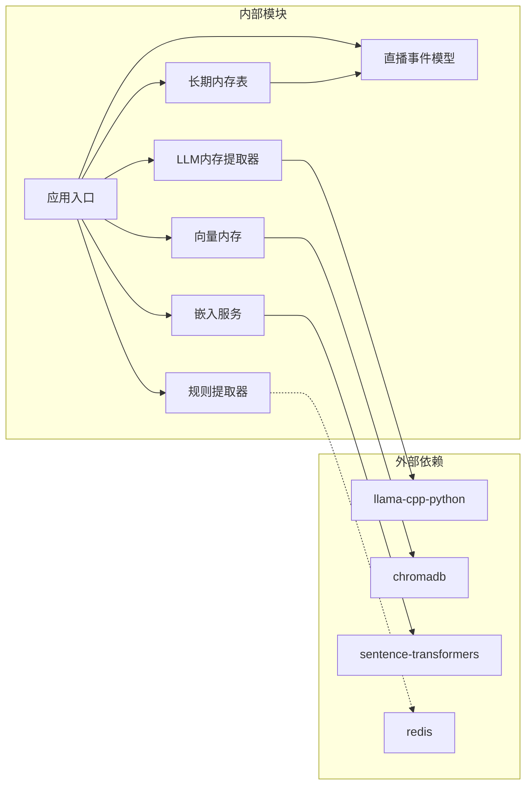

# LLM内存提取器测试

<cite>
**本文档引用的文件**
- [llm_memory_extractor.py](file://backend/services/llm_memory_extractor.py)
- [memory_extractor.py](file://backend/services/memory_extractor.py)
- [test_llm_memory_extractor.py](file://tests/test_llm_memory_extractor.py)
- [vector_store.py](file://backend/memory/vector_store.py)
- [embedding_service.py](file://backend/memory/embedding_service.py)
- [live.py](file://backend/schemas/live.py)
- [app.py](file://backend/app.py)
- [config.py](file://backend/config.py)
- [README.md](file://README.md)
- [datasets.py](file://tests/memory_pipeline_verifier/datasets.py)
- [runner.py](file://tests/memory_pipeline_verifier/runner.py)
- [long_term.py](file://backend/memory/long_term.py)
- [live_stream_memory_extraction_test_cases.json](file://tests/fixtures/memory_extraction/live_stream_memory_extraction_test_cases.json)
- [hard.json](file://tests/fixtures/memory_extraction/hard.json)
</cite>

## 更新摘要
**变更内容**
- 新增极性（polarity）字段测试用例，验证positive、negative、neutral情感极性的正确处理
- 新增时间范围（temporal_scope）字段测试用例，验证long_term和short_term时间范围的过滤逻辑
- 扩展了内存提取器的字段验证和过滤规则
- 更新了测试用例以覆盖新的极性和时间范围字段
- 新增规则回退测试用例，包括回退触发条件、模板接受性、规范化行为和极性标记等测试覆盖
- 增强了复合提取器的回退机制测试，验证异常处理和高置信度规则回退

## 目录
1. [简介](#简介)
2. [项目结构](#项目结构)
3. [核心组件](#核心组件)
4. [架构概览](#架构概览)
5. [详细组件分析](#详细组件分析)
6. [依赖关系分析](#依赖关系分析)
7. [性能考虑](#性能考虑)
8. [故障排除指南](#故障排除指南)
9. [结论](#结论)

## 简介

本文档详细分析了DouYin_llm项目中的LLM内存提取器测试框架。该项目是一个面向抖音直播场景的实时提词与观众记忆工作台，专注于观众长期记忆的抽取、存储和语义召回。

项目的核心目标是帮助主播更好地理解观众、维护互动关系，通过实时处理直播事件、沉淀观众长期记忆、进行真实语义召回，并将可操作信息反馈到前端工作台。

## 项目结构

**图表来源**
- [llm_memory_extractor.py:1-208](file://backend/services/llm_memory_extractor.py#L1-L208)
- [memory_extractor.py:1-296](file://backend/services/memory_extractor.py#L1-L296)
- [app.py:1-507](file://backend/app.py#L1-L507)

**章节来源**
- [README.md:1-351](file://README.md#L1-L351)

## 核心组件

### LLM内存提取器

LLM内存提取器是项目的核心组件，负责从直播评论中抽取长期有效的观众记忆。它实现了严格的JSON协议验证和多种过滤规则：

- **系统提示词验证**：确保只抽取对主播后续互动有用的长期记忆
- **时间范围过滤**：只接受"long_term"标记的记忆，拒绝"short_term"记忆
- **情感极性检测**：支持positive、negative、neutral三种情感极性
- **置信度映射**：将模型输出映射到稳定的置信度分数
- **文本信号检测**：识别负面表达的明确信号
- **字段完整性验证**：确保所有必需字段的存在和有效性

### 规则内存提取器

作为LLM提取器的后备方案，规则提取器基于关键词匹配和长度规则进行记忆抽取：

- **低信号过滤**：过滤简短、无意义的评论
- **关键词识别**：识别偏好、计划、上下文等不同类型的记忆
- **置信度计算**：基于文本长度、关键词命中率计算置信度
- **类型分类**：将评论分类为preference、plan、context、fact等类型

### 向量内存存储

向量内存系统提供了高效的语义召回能力：

- **嵌入向量生成**：支持本地和云端嵌入模型
- **Chroma集成**：使用Chroma数据库进行向量存储和查询
- **相似度计算**：基于余弦相似度进行语义匹配
- **内存索引优化**：支持批量索引和增量更新

**章节来源**
- [llm_memory_extractor.py:35-208](file://backend/services/llm_memory_extractor.py#L35-L208)
- [memory_extractor.py:65-296](file://backend/services/memory_extractor.py#L65-L296)
- [vector_store.py:59-388](file://backend/memory/vector_store.py#L59-L388)

## 架构概览

**图表来源**
- [app.py:161-223](file://backend/app.py#L161-L223)
- [llm_memory_extractor.py:40-54](file://backend/services/llm_memory_extractor.py#L40-L54)
- [memory_extractor.py:129-142](file://backend/services/memory_extractor.py#L129-L142)

## 详细组件分析

### LLM内存提取器类图

**图表来源**
- [llm_memory_extractor.py:35-208](file://backend/services/llm_memory_extractor.py#L35-L208)
- [memory_extractor.py:65-296](file://backend/services/memory_extractor.py#L65-L296)

### 内存提取流程

**图表来源**
- [llm_memory_extractor.py:99-167](file://backend/services/llm_memory_extractor.py#L99-L167)
- [memory_extractor.py:140-193](file://backend/services/memory_extractor.py#L140-L193)

**章节来源**
- [test_llm_memory_extractor.py:43-381](file://tests/test_llm_memory_extractor.py#L43-L381)

### 测试用例分析

项目包含全面的测试用例，覆盖了各种边界情况和异常处理：

#### LLM内存提取器测试

测试用例涵盖了以下关键场景：

- **有效长期偏好记忆**：验证正确的JSON响应处理，包含极性和时间范围字段
- **短期记忆拒绝**：确保短期计划不被接受，测试temporal_scope过滤
- **JSON解析错误**：测试异常输入处理
- **负面偏好保留**：验证负面表达的正确处理，包含polarity字段
- **字段验证**：测试各种字段的合法性检查，包括polarity和temporal_scope
- **情感极性过滤**：验证情感极性的有效性，测试ALLOWED_POLARITIES集合
- **时间范围过滤**：验证temporal_scope字段的过滤逻辑
- **交互壳子检测**：测试问句壳子、互动壳子的识别

#### 复合提取器测试

测试验证了提取器的回退机制：

- **LLM失败回退**：LLM异常时自动切换到规则提取
- **空结果回退**：LLM返回空结果时使用规则提取
- **优先级保证**：LLM结果优先于规则结果
- **高置信度规则回退**：仅在LLM异常时使用高置信度规则提取

#### 规则回退提取器测试

新增的规则回退测试用例：

- **规则回退拒绝问句内容**：验证问句壳子的正确识别和拒绝
- **规则回退接受明确负面食物约束**：测试负面偏好的正确识别
- **规则回退接受明确负面偏好**：验证偏好类型的正确分类
- **规则回退接受明确稳定工作模式**：测试上下文类型的识别
- **规则回退规范化食物约束**：验证文本规范化处理
- **规则回退规范化上下文去除尾部解释**：测试上下文文本的清理
- **规则回退标记负面食物约束为负面**：验证情感极性的正确标注

**新增** 极性和时间范围字段的测试用例

测试用例现在包含专门验证新字段的测试：

- `test_extract_returns_candidate_with_raw_and_canonical_fields`：验证原始文本和规范文本字段
- `test_extract_rejects_short_term_candidate`：验证短期记忆的拒绝逻辑
- `test_extract_rejects_negative_polarity_without_negative_signal`：验证负面情感的信号检测
- `test_extract_rejects_missing_canonical_text`：验证规范文本字段的必要性

**章节来源**
- [test_llm_memory_extractor.py:28-381](file://tests/test_llm_memory_extractor.py#L28-L381)

## 依赖关系分析

**图表来源**
- [requirements.txt](file://requirements.txt)
- [app.py:1-507](file://backend/app.py#L1-L507)

### 关键依赖特性

- **可选依赖**：项目使用可选依赖机制，当依赖不可用时提供降级方案
- **环境配置**：通过环境变量控制各种功能的启用和配置
- **模型管理**：支持本地模型文件和云端模型的灵活切换
- **数据持久化**：长期内存表支持极性和时间范围字段的存储

**章节来源**
- [config.py:80-178](file://backend/config.py#L80-L178)
- [embedding_service.py:1-119](file://backend/memory/embedding_service.py#L1-L119)

## 性能考虑

### 内存优化策略

1. **懒加载机制**：模型和嵌入服务采用懒加载，避免启动时的资源占用
2. **批处理优化**：向量索引支持批量更新，提高大规模数据处理效率
3. **缓存策略**：内存中缓存最近的3000条记忆，平衡内存使用和查询性能

### 并发处理

- **异步事件处理**：使用asyncio处理并发事件，避免阻塞
- **线程池管理**：配置合理的线程数量，平衡CPU使用和响应时间
- **连接池**：数据库和Redis连接使用连接池，减少连接开销

### 性能监控

- **健康检查**：提供详细的健康状态报告，包括语义后端状态
- **严格模式**：支持严格语义模式，确保真实的向量召回
- **降级策略**：在依赖不可用时提供明确的降级路径

## 故障排除指南

### 常见问题及解决方案

#### LLM模型相关问题

1. **模型文件缺失**
   - 检查MEMORY_EXTRACTOR_MODEL_PATH配置
   - 确认MODEL_URL配置正确
   - 验证网络连接和下载权限

2. **推理超时**
   - 增加MEMORY_EXTRACTOR_TIMEOUT_SECONDS
   - 检查CPU性能和内存使用
   - 考虑减少MAX_TOKENS

#### 向量存储问题

1. **Chroma初始化失败**
   - 检查CHROMA_DIR权限
   - 验证磁盘空间充足
   - 确认Python版本兼容性

2. **嵌入服务异常**
   - 检查EMBEDDING_MODE配置
   - 验证API密钥和网络连接
   - 查看严格模式设置

#### 回退机制问题

当LLM提取器出现问题时，系统会自动切换到规则提取器：

1. **日志检查**：查看LLM提取器异常日志
2. **规则验证**：确认规则提取器正常工作
3. **配置验证**：检查MEMORY_EXTRACTOR_ENABLED设置

#### 新字段相关问题

1. **极性字段验证失败**
   - 检查polarity字段是否在ALLOWED_POLARITIES集合中
   - 验证负面情感的信号检测逻辑
   - 确认情感极性与文本内容的一致性

2. **时间范围字段过滤问题**
   - 检查temporal_scope字段是否为"long_term"或"short_term"
   - 验证短期记忆的正确过滤逻辑
   - 确认时间范围字段的默认值处理

3. **规则回退相关问题**
   - 检查规则提取器的高置信度模式是否正确触发
   - 验证问句壳子的正则表达式匹配
   - 确认规范化函数的文本处理逻辑

**章节来源**
- [app.py:105-141](file://backend/app.py#L105-L141)
- [embedding_service.py:25-65](file://backend/memory/embedding_service.py#L25-L65)

## 结论

LLM内存提取器测试框架展现了现代AI应用开发的最佳实践：

### 技术优势

1. **健壮的错误处理**：完善的异常捕获和回退机制
2. **严格的协议验证**：确保输出质量和一致性，包含新的极性和时间范围字段
3. **灵活的配置管理**：支持多种部署场景和环境
4. **全面的测试覆盖**：涵盖正常流程和异常处理，包括新字段的验证

### 架构特点

1. **模块化设计**：清晰的职责分离和依赖关系
2. **可扩展性**：支持插件化的提取器和存储后端
3. **容错性**：多层回退机制确保系统稳定性
4. **可观测性**：详细的日志和健康检查

### 应用价值

该测试框架不仅验证了内存提取器的功能正确性，更重要的是：

- 为直播场景的观众记忆管理提供了可靠的技术基础
- 展示了如何在生产环境中安全地集成和测试AI组件
- 为类似项目提供了可复用的架构模式和最佳实践

通过这个测试框架，开发者可以信心满满地部署和维护基于LLM的内存提取系统，为用户提供更好的直播互动体验。

### 新字段的重要意义

新增的极性和时间范围字段显著增强了内存提取系统的智能化水平：

- **情感理解**：通过polarity字段，系统能够理解观众的情感倾向，为个性化推荐提供依据
- **时间感知**：通过temporal_scope字段，系统能够区分长期记忆和短期状态，避免将临时信息误认为长期偏好
- **决策支持**：这些字段为后续的智能决策提供了更丰富的上下文信息

### 规则回退机制的价值

增强的规则回退测试用例体现了系统设计的完整性：

- **异常处理**：确保在LLM失败时的优雅降级
- **质量保证**：通过高置信度规则提取保证最低质量标准
- **用户体验**：减少因AI组件故障导致的服务中断

**章节来源**
- [llm_memory_extractor.py:11-17](file://backend/services/llm_memory_extractor.py#L11-L17)
- [long_term.py:172-174](file://backend/memory/long_term.py#L172-L174)
- [memory_extractor.py:190-221](file://backend/services/memory_extractor.py#L190-L221)