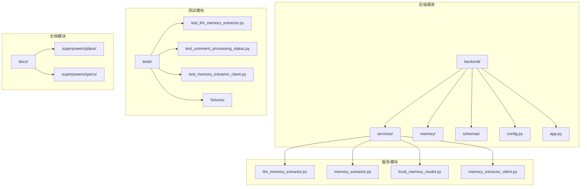
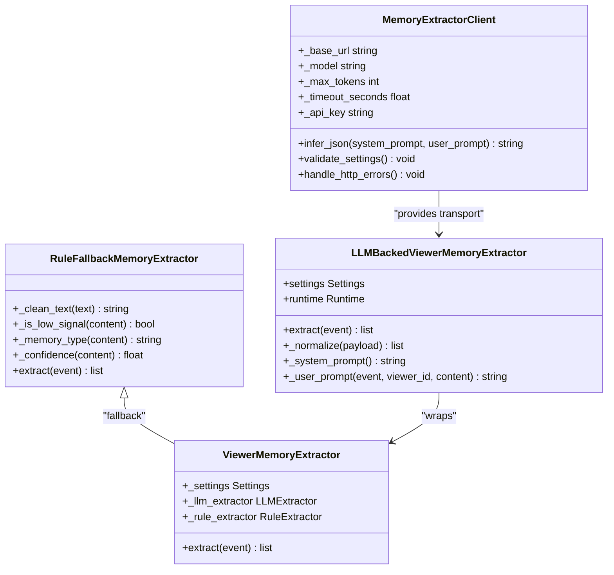
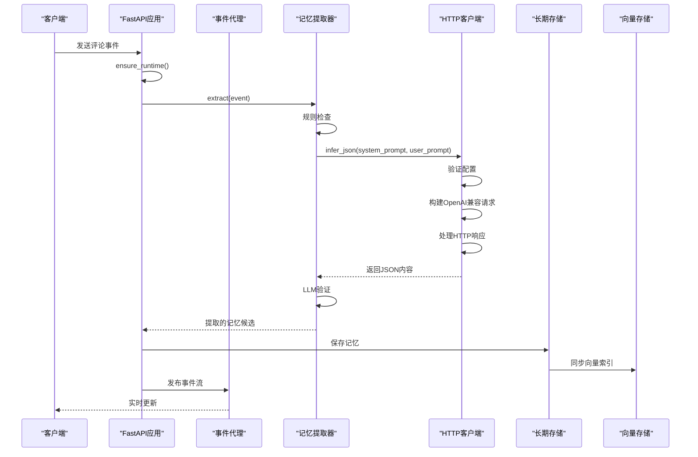
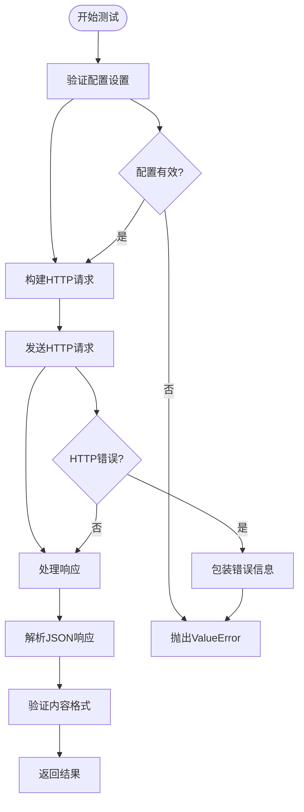
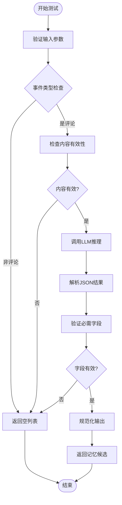
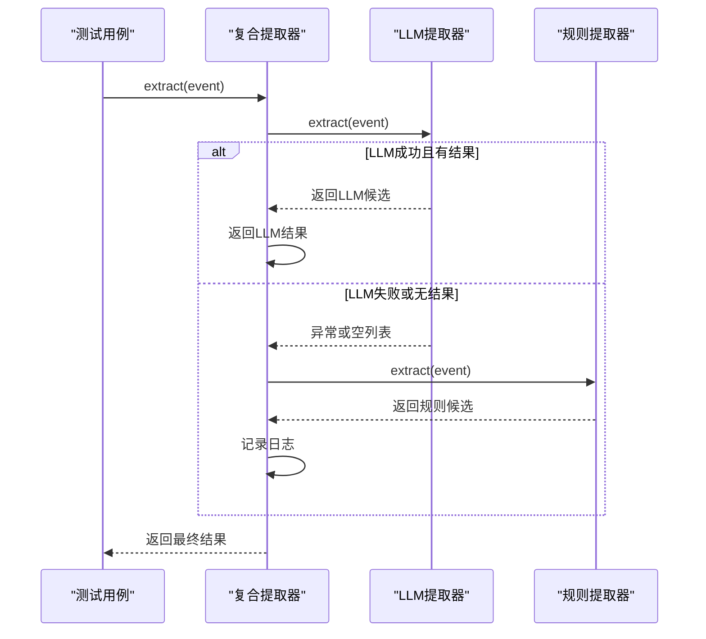
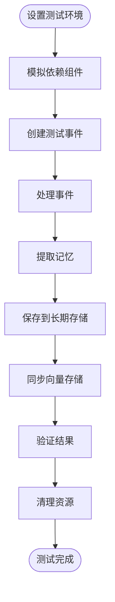
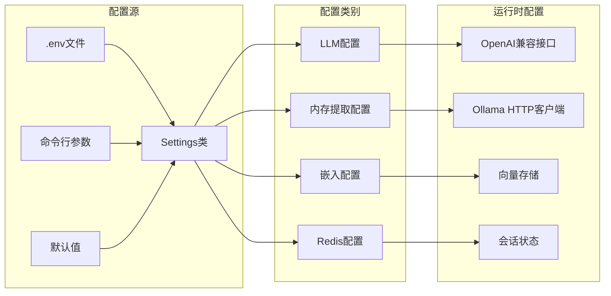

# Ollama内存提取器测试

<cite>
**本文档引用的文件**
- [memory_extractor.py](file://backend/services/memory_extractor.py)
- [llm_memory_extractor.py](file://backend/services/llm_memory_extractor.py)
- [memory_extractor_client.py](file://backend/services/memory_extractor_client.py)
- [test_memory_extractor_client.py](file://tests/test_memory_extractor_client.py)
- [test_llm_memory_extractor.py](file://tests/test_llm_memory_extractor.py)
- [test_comment_processing_status.py](file://tests/test_comment_processing_status.py)
- [live.py](file://backend/schemas/live.py)
- [app.py](file://backend/app.py)
- [config.py](file://backend/config.py)
- [requirements.txt](file://requirements.txt)
- [2026-04-18-memory-extractor-ollama.md](file://docs/superpowers/plans/2026-04-18-memory-extractor-ollama.md)
</cite>

## 更新摘要
**变更内容**
- 新增MemoryExtractorClient的全面测试套件，涵盖HTTP请求处理、错误处理、配置验证等核心功能
- 扩展测试策略文档以反映新的测试覆盖范围
- 更新架构图以包含新的HTTP客户端组件
- 增强错误处理和配置验证的测试覆盖
- 反映从本地GGUF运行时到Ollama HTTP客户端的架构迁移

## 目录
1. [简介](#简介)
2. [项目结构](#项目结构)
3. [核心组件](#核心组件)
4. [架构概览](#架构概览)
5. [详细组件分析](#详细组件分析)
6. [依赖关系分析](#依赖关系分析)
7. [性能考虑](#性能考虑)
8. [故障排除指南](#故障排除指南)
9. [结论](#结论)

## 简介

本文档详细分析了DouYin_llm项目中的Ollama内存提取器测试实现。该项目是一个直播场景下的智能助手系统，专注于从观众评论中提取长期记忆信息。文档重点介绍了从本地GGUF运行时迁移到Ollama支持的OpenAI兼容HTTP客户端的测试策略和实现细节。

**更新** 新增了对MemoryExtractorClient的全面测试套件，包括HTTP请求处理、错误处理、配置验证等功能测试，显著增强了系统的测试覆盖率和可靠性。该测试套件涵盖了HTTP客户端行为测试、协议规范化测试和错误处理测试用例，确保了从基础URL规范化到复杂错误场景的完整覆盖。

该系统采用分层架构设计，包括规则基础的记忆提取器、基于LLM的记忆提取器以及复合记忆提取器。测试覆盖了完整的内存提取流程，从原始评论输入到最终的记忆持久化，现在还包括HTTP客户端的端到端测试。

## 项目结构

项目采用模块化的Python架构，主要包含以下核心目录：

**图表来源**
- [app.py:1-50](file://backend/app.py#L1-L50)
- [config.py:1-30](file://backend/config.py#L1-L30)
- [test_llm_memory_extractor.py:1-30](file://tests/test_llm_memory_extractor.py#L1-L30)
- [test_memory_extractor_client.py:1-30](file://tests/test_memory_extractor_client.py#L1-L30)

**章节来源**
- [app.py:1-50](file://backend/app.py#L1-L50)
- [config.py:1-50](file://backend/config.py#L1-L50)

## 核心组件

### 记忆提取器架构

系统实现了三层记忆提取架构：

1. **规则基础提取器**：处理低信号内容和基本模式识别
2. **LLM支持提取器**：基于OpenAI兼容接口的智能提取
3. **复合提取器**：结合规则和LLM的优势

**图表来源**
- [memory_extractor.py:65-143](file://backend/services/memory_extractor.py#L65-L143)
- [llm_memory_extractor.py:35-134](file://backend/services/llm_memory_extractor.py#L35-L134)
- [memory_extractor_client.py:19-115](file://backend/services/memory_extractor_client.py#L19-L115)

**章节来源**
- [memory_extractor.py:65-143](file://backend/services/memory_extractor.py#L65-L143)
- [llm_memory_extractor.py:35-134](file://backend/services/llm_memory_extractor.py#L35-L134)
- [memory_extractor_client.py:19-115](file://backend/services/memory_extractor_client.py#L19-L115)

## 架构概览

系统采用事件驱动的异步架构，通过WebSocket实时处理直播评论：

**图表来源**
- [app.py:161-223](file://backend/app.py#L161-L223)
- [memory_extractor.py:129-143](file://backend/services/memory_extractor.py#L129-L143)
- [memory_extractor_client.py:38-100](file://backend/services/memory_extractor_client.py#L38-L100)

## 详细组件分析

### MemoryExtractorClient测试

**新增** MemoryExtractorClient作为新的HTTP传输层，提供了全面的功能测试覆盖：

#### 测试用例分类

1. **HTTP请求构建测试**
   - OpenAI兼容负载验证
   - 请求头配置测试
   - 基础URL规范化处理

2. **配置验证测试**
   - 必需设置验证
   - 数据类型和范围检查
   - API密钥处理

3. **错误处理测试**
   - HTTP错误包装
   - URL错误处理
   - JSON解析错误

4. **功能集成测试**
   - 超时传播测试
   - 模型和令牌数配置
   - 授权头添加逻辑

**图表来源**
- [memory_extractor_client.py:22-37](file://backend/services/memory_extractor_client.py#L22-L37)
- [memory_extractor_client.py:38-100](file://backend/services/memory_extractor_client.py#L38-L100)
- [test_memory_extractor_client.py:35-65](file://tests/test_memory_extractor_client.py#L35-L65)

**章节来源**
- [test_memory_extractor_client.py:35-210](file://tests/test_memory_extractor_client.py#L35-L210)

### LLM内存提取器测试

LLM内存提取器经过了全面的单元测试，覆盖了各种边界情况和错误处理场景：

#### 测试用例分类

1. **有效记忆提取测试**
   - 长期偏好记忆提取
   - 负面偏好记忆处理
   - 上下文记忆识别

2. **边界条件测试**
   - 短期记忆过滤
   - 无效JSON处理
   - 空内容和缺失用户ID

3. **错误处理测试**
   - 缺失必需字段
   - 无效数据类型
   - 不支持的记忆类型

**图表来源**
- [llm_memory_extractor.py:40-103](file://backend/services/llm_memory_extractor.py#L40-L103)
- [test_llm_memory_extractor.py:44-131](file://tests/test_llm_memory_extractor.py#L44-L131)

**章节来源**
- [test_llm_memory_extractor.py:44-437](file://tests/test_llm_memory_extractor.py#L44-L437)

### 复合记忆提取器测试

复合提取器实现了智能回退机制，确保系统的鲁棒性：

**图表来源**
- [memory_extractor.py:129-143](file://backend/services/memory_extractor.py#L129-L143)
- [test_llm_memory_extractor.py:440-486](file://tests/test_llm_memory_extractor.py#L440-L486)

**章节来源**
- [test_llm_memory_extractor.py:440-486](file://tests/test_llm_memory_extractor.py#L440-L486)

### 应用程序集成测试

应用程序级别的测试验证了完整的内存提取流程：

**图表来源**
- [test_comment_processing_status.py:30-177](file://tests/test_comment_processing_status.py#L30-L177)
- [app.py:161-223](file://backend/app.py#L161-L223)

**章节来源**
- [test_comment_processing_status.py:30-177](file://tests/test_comment_processing_status.py#L30-L177)

## 依赖关系分析

### 配置管理

系统使用集中式配置管理，支持多种部署模式：

**图表来源**
- [config.py:80-144](file://backend/config.py#L80-L144)
- [2026-04-18-memory-extractor-ollama.md:137-153](file://docs/superpowers/plans/2026-04-18-memory-extractor-ollama.md#L137-L153)

**章节来源**
- [config.py:80-185](file://backend/config.py#L80-L185)

### 依赖项管理

项目依赖关系相对简单，主要依赖于标准库和第三方库：

| 依赖项 | 版本要求 | 用途 |
|--------|----------|------|
| fastapi | >=0.115.0 | Web框架 |
| uvicorn | >=0.30.0 | ASGI服务器 |
| redis | >=5.0.0 | 缓存和会话存储 |
| chromadb | >=0.5.0 | 向量数据库 |

**更新** 移除了llama-cpp-python依赖，因为本地运行时已被Ollama HTTP客户端替代。

**章节来源**
- [requirements.txt:1-7](file://requirements.txt#L1-L7)

## 性能考虑

### 内存提取性能优化

1. **延迟优化**
   - 使用连接池减少HTTP请求开销
   - 实现请求缓存机制
   - 异步处理提高吞吐量

2. **资源管理**
   - 合理设置超时时间
   - 监控内存使用情况
   - 实现优雅降级机制

3. **并发处理**
   - 支持多线程内存提取
   - 实现队列管理
   - 避免阻塞操作

### HTTP客户端性能特性

**新增** MemoryExtractorClient的性能考虑：

- **连接复用**：利用urllib的内置连接管理
- **超时控制**：精确的超时参数传递
- **错误快速失败**：及时捕获和报告HTTP错误
- **内存效率**：流式读取响应内容

## 故障排除指南

### 常见问题诊断

1. **Ollama连接问题**
   - 检查Ollama服务状态
   - 验证模型名称正确性
   - 确认网络连通性

2. **内存提取失败**
   - 查看日志输出
   - 验证输入格式
   - 检查模型可用性

3. **配置错误**
   - 验证.env文件设置
   - 检查环境变量
   - 确认权限设置

4. **HTTP客户端错误**
   - **配置验证失败**：检查基础URL、模型名、令牌数、超时设置
   - **HTTP 503错误**：Ollama服务暂时不可用
   - **连接拒绝**：网络连接问题或端口错误
   - **JSON解析错误**：响应格式不符合预期

**章节来源**
- [memory_extractor.py:133-137](file://backend/services/memory_extractor.py#L133-L137)
- [test_llm_memory_extractor.py:97-104](file://tests/test_llm_memory_extractor.py#L97-L104)
- [memory_extractor_client.py:65-92](file://backend/services/memory_extractor_client.py#L65-L92)

## 结论

Ollama内存提取器测试展示了现代AI应用的完整测试策略。通过分层测试方法，包括单元测试、集成测试和端到端测试，确保了系统的可靠性和稳定性。

**主要成就包括**：

1. **全面的测试覆盖**：从基础功能到边界条件的完整测试套件，包括新增的HTTP客户端测试
2. **鲁棒的错误处理**：完善的异常处理和回退机制，涵盖HTTP错误、配置错误、JSON解析错误
3. **清晰的架构分离**：模块化设计便于维护和扩展
4. **灵活的配置管理**：支持多种部署模式和运行时配置
5. **增强的可靠性**：通过全面的错误处理和配置验证提高了系统的稳定性

**新增功能亮点**：
- MemoryExtractorClient提供了独立的HTTP传输层测试
- 全面的配置验证确保了运行时的健壮性
- 完善的错误处理机制提供了更好的用户体验
- 端到端的集成测试验证了完整的内存提取流程

该测试框架为类似项目的内存提取功能提供了优秀的参考模板，特别是在从本地运行时迁移到云端服务的场景中。新增的测试套件显著提升了系统的质量保证水平，为生产环境的稳定运行提供了坚实保障。

**架构迁移总结**：
- 成功从本地GGUF运行时迁移到Ollama HTTP客户端
- 保持了原有的规则回退机制和LLM验证逻辑
- 新增了完整的HTTP客户端测试套件
- 移除了过时的本地运行时依赖和配置
- 更新了文档和示例配置以反映新的架构