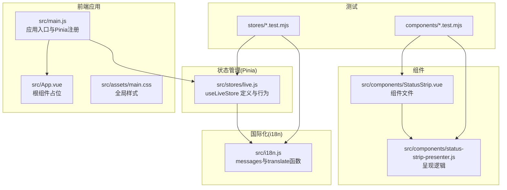
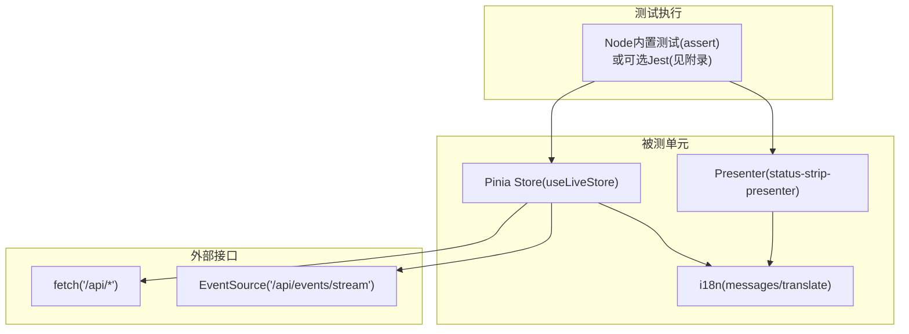
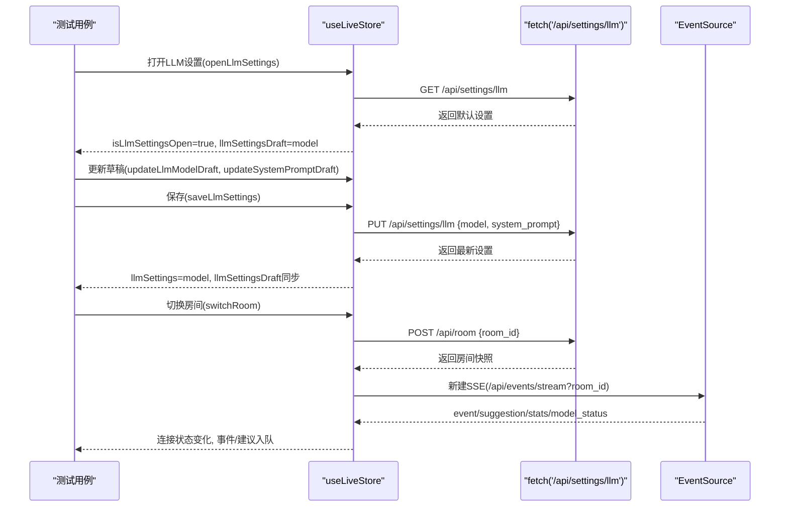
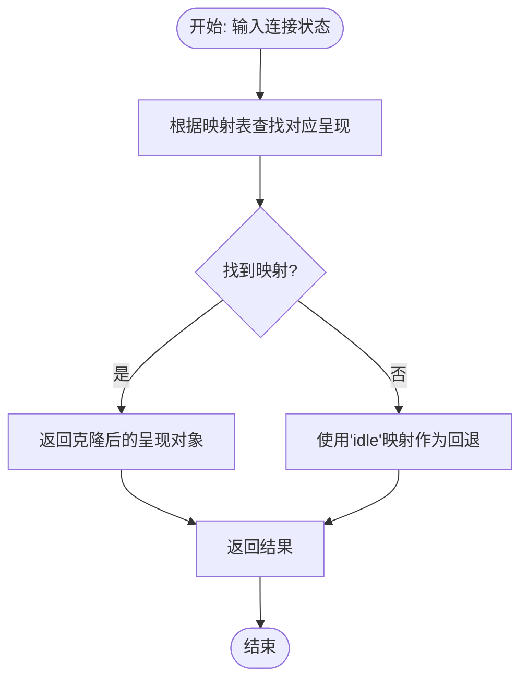
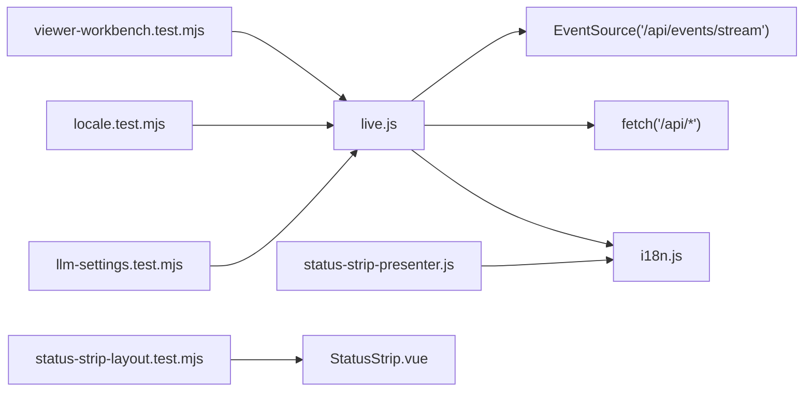

# 前端测试

<cite>
**本文引用的文件**
- [frontend/package.json](file://frontend/package.json)
- [frontend/vite.config.js](file://frontend/vite.config.js)
- [frontend/src/main.js](file://frontend/src/main.js)
- [frontend/src/i18n.js](file://frontend/src/i18n.js)
- [frontend/src/stores/live.js](file://frontend/src/stores/live.js)
- [frontend/src/stores/live.test.mjs](file://frontend/src/stores/live.test.mjs)
- [frontend/src/stores/llm-settings.test.mjs](file://frontend/src/stores/llm-settings.test.mjs)
- [frontend/src/stores/locale.test.mjs](file://frontend/src/stores/locale.test.mjs)
- [frontend/src/stores/viewer-workbench.test.mjs](file://frontend/src/stores/viewer-workbench.test.mjs)
- [frontend/src/components/status-strip-presenter.js](file://frontend/src/components/status-strip-presenter.js)
- [frontend/src/components/status-strip-presenter.test.mjs](file://frontend/src/components/status-strip-presenter.test.mjs)
- [frontend/src/components/status-strip-layout.test.mjs](file://frontend/src/components/status-strip-layout.test.mjs)
</cite>

## 目录
1. [简介](#简介)
2. [项目结构](#项目结构)
3. [核心组件](#核心组件)
4. [架构总览](#架构总览)
5. [详细组件分析](#详细组件分析)
6. [依赖关系分析](#依赖关系分析)
7. [性能考量](#性能考量)
8. [故障排查指南](#故障排查指南)
9. [结论](#结论)
10. [附录](#附录)

## 简介
本文件面向 DouYin_llm 项目的前端测试，聚焦于测试框架与配置、Pinia Store 测试、Vue 组件测试、状态管理测试、组件交互与 UI 测试、测试数据模拟与异步操作策略、测试覆盖率与性能测试方法、测试环境搭建与持续集成配置，以及测试调试技巧与常见问题解决方案。当前仓库采用原生 Node 测试（assert）与 Vite 开发工具链，未包含 Jest 配置文件；本文在不改变现有实现的前提下，给出可直接落地的测试实践建议与可视化图示。

## 项目结构
前端位于 frontend 目录，采用 Vue 3 + Pinia 架构，Vite 提供开发与构建支持。测试文件分布在 src/stores 与 src/components 下，分别覆盖状态管理与组件逻辑。

图表来源
- [frontend/src/main.js:1-17](file://frontend/src/main.js#L1-L17)
- [frontend/src/stores/live.js:1-846](file://frontend/src/stores/live.js#L1-L846)
- [frontend/src/i18n.js:1-316](file://frontend/src/i18n.js#L1-L316)
- [frontend/src/components/status-strip-presenter.js:1-35](file://frontend/src/components/status-strip-presenter.js#L1-L35)

章节来源
- [frontend/package.json:1-23](file://frontend/package.json#L1-L23)
- [frontend/vite.config.js:1-23](file://frontend/vite.config.js#L1-L23)
- [frontend/src/main.js:1-17](file://frontend/src/main.js#L1-L17)

## 核心组件
- Pinia Store（useLiveStore）
  - 负责房间状态、SSE 连接、事件与建议流、模型状态、语言与主题、观众工作台等。
  - 关键行为包括：引导初始化、连接/断开 SSE、事件与建议入队、房间切换、LLM 设置读取/保存、观众备注增删改查等。
- 国际化模块（i18n）
  - 提供 messages 与 translate/translateError，支撑多语言标签与错误文案。
- 组件呈现逻辑（status-strip-presenter）
  - 将连接状态映射为 UI 呈现（色调、图标、标签键）。

章节来源
- [frontend/src/stores/live.js:75-846](file://frontend/src/stores/live.js#L75-L846)
- [frontend/src/i18n.js:278-316](file://frontend/src/i18n.js#L278-L316)
- [frontend/src/components/status-strip-presenter.js:29-35](file://frontend/src/components/status-strip-presenter.js#L29-L35)

## 架构总览
前端测试围绕“状态管理 + 组件呈现 + 异步交互”三类对象展开，测试策略以数据模拟（fetch/EventSource）、断言与流程控制为主，确保：
- Store 行为正确性（同步/异步）
- 组件呈现逻辑正确性
- UI 文案与布局符合预期

图表来源
- [frontend/src/stores/live.js:440-523](file://frontend/src/stores/live.js#L440-L523)
- [frontend/src/components/status-strip-presenter.js:29-35](file://frontend/src/components/status-strip-presenter.js#L29-L35)
- [frontend/src/i18n.js:278-316](file://frontend/src/i18n.js#L278-L316)

## 详细组件分析

### Pinia Store 测试（状态管理）
- 测试目标
  - 初始化与引导：bootstrap、connect、连接状态机
  - LLM 设置：打开、读取、更新、保存、重置
  - 观众工作台：打开、加载、编辑、保存、删除、房间切换
  - 语言与主题：切换、持久化、UI 文案
- 数据模拟策略
  - 全局替换 fetch 与 EventSource，按路由与方法断言请求体与响应
  - 使用数组记录请求，便于断言 PUT/POST/DELETE 的负载与顺序
- 异步测试要点
  - 使用 await 等待 Promise 完成，断言副作用（状态变更、错误文案）
  - 对 SSE 事件进行最小化模拟，避免真实连接
- 覆盖场景
  - 成功路径、失败路径（HTTP 错误、业务错误）、边界条件（空值、非法输入）

图表来源
- [frontend/src/stores/live.js:354-431](file://frontend/src/stores/live.js#L354-L431)
- [frontend/src/stores/live.js:525-569](file://frontend/src/stores/live.js#L525-L569)
- [frontend/src/stores/live.js:474-523](file://frontend/src/stores/live.js#L474-L523)
- [frontend/src/stores/llm-settings.test.mjs:1-70](file://frontend/src/stores/llm-settings.test.mjs#L1-L70)

章节来源
- [frontend/src/stores/live.test.mjs:1-68](file://frontend/src/stores/live.test.mjs#L1-L68)
- [frontend/src/stores/llm-settings.test.mjs:1-70](file://frontend/src/stores/llm-settings.test.mjs#L1-L70)
- [frontend/src/stores/locale.test.mjs:1-35](file://frontend/src/stores/locale.test.mjs#L1-L35)
- [frontend/src/stores/viewer-workbench.test.mjs:1-445](file://frontend/src/stores/viewer-workbench.test.mjs#L1-L445)

### 组件交互与 UI 测试
- 呈现逻辑测试（status-strip-presenter）
  - 输入连接状态，输出 UI 呈现（tone/icon/labelKey），并验证返回对象不被外部修改
- 布局与文案测试（status-strip-layout）
  - 通过读取组件源码字符串，断言关键 CSS Grid 列定义、工具文本与布局断言
  - 使用正则匹配与反向断言确保布局与文案符合预期

图表来源
- [frontend/src/components/status-strip-presenter.js:29-35](file://frontend/src/components/status-strip-presenter.js#L29-L35)

章节来源
- [frontend/src/components/status-strip-presenter.test.mjs:1-50](file://frontend/src/components/status-strip-presenter.test.mjs#L1-L50)
- [frontend/src/components/status-strip-layout.test.mjs:1-18](file://frontend/src/components/status-strip-layout.test.mjs#L1-L18)

### 测试数据模拟与异步策略
- fetch 模拟
  - 记录请求数组，断言 URL、方法与请求体
  - 按路由分支返回成功/失败响应，含错误详情
- EventSource 模拟
  - 最小化类实现，仅计数或记录 URL，避免真实长连接
- 异步断言
  - 使用 await 等待 Promise 完成，断言副作用（状态、错误文案、UI 字段）
- 边界与异常
  - 空值、非法输入、网络错误、业务错误、并发请求（viewer 请求 ID）等

章节来源
- [frontend/src/stores/live.test.mjs:9-50](file://frontend/src/stores/live.test.mjs#L9-L50)
- [frontend/src/stores/llm-settings.test.mjs:8-44](file://frontend/src/stores/llm-settings.test.mjs#L8-L44)
- [frontend/src/stores/viewer-workbench.test.mjs:41-57](file://frontend/src/stores/viewer-workbench.test.mjs#L41-L57)

## 依赖关系分析
- Store 依赖
  - i18n：用于动态翻译标签与错误文案
  - 浏览器 API：fetch、EventSource、localStorage、documentElement
- 组件依赖
  - Presenter：将状态映射为 UI 呈现
  - 组件源码：通过读取源码字符串进行布局与文案断言
- 外部服务
  - /api/*：引导、房间切换、设置、观众详情与备注
  - /ws 与 /api/events/stream：SSE 实时事件流

图表来源
- [frontend/src/stores/live.js:1-846](file://frontend/src/stores/live.js#L1-L846)
- [frontend/src/i18n.js:1-316](file://frontend/src/i18n.js#L1-L316)
- [frontend/src/components/status-strip-presenter.js:1-35](file://frontend/src/components/status-strip-presenter.js#L1-L35)
- [frontend/src/components/status-strip-layout.test.mjs:5-18](file://frontend/src/components/status-strip-layout.test.mjs#L5-L18)

章节来源
- [frontend/src/stores/live.js:1-846](file://frontend/src/stores/live.js#L1-L846)
- [frontend/src/components/status-strip-presenter.js:1-35](file://frontend/src/components/status-strip-presenter.js#L1-L35)
- [frontend/src/components/status-strip-layout.test.mjs:1-18](file://frontend/src/components/status-strip-layout.test.mjs#L1-L18)

## 性能考量
- 测试性能优化
  - 使用最小化 fetch/EventSource 模拟，避免真实网络与长连接
  - 通过断言请求数组长度与顺序，减少不必要的等待
  - 将复杂流程拆分为多个小用例，提升定位效率
- 覆盖率统计
  - 当前仓库未包含覆盖率配置；如需统计，可在附录中参考 Jest 集成方案
- 性能测试方法
  - 可对关键函数（如 presenter 映射）进行微基准测试，评估映射查找性能
  - 对 Store 中的事件入队与过滤逻辑进行压力测试（大量事件注入）

## 故障排查指南
- 常见问题
  - fetch/EventSource 未被替换导致真实调用
    - 解决：在测试前替换全局对象，结束后恢复
  - 断言失败：请求 URL/方法/体不匹配
    - 解决：检查模拟函数是否按路由分支返回，确认请求构造逻辑
  - 并发请求导致的竞态
    - 解决：使用 viewer 请求 ID 机制，忽略过期请求
  - 国际化文案不一致
    - 解决：统一使用 translate/translateError，确保键存在
- 调试技巧
  - 在模拟函数中打印请求参数，快速定位问题
  - 将复杂流程拆分为步骤断言，逐步缩小范围
  - 使用最小化用例复现问题，避免无关干扰

章节来源
- [frontend/src/stores/live.test.mjs:64-68](file://frontend/src/stores/live.test.mjs#L64-L68)
- [frontend/src/stores/viewer-workbench.test.mjs:193-192](file://frontend/src/stores/viewer-workbench.test.mjs#L193-L192)
- [frontend/src/i18n.js:278-316](file://frontend/src/i18n.js#L278-L316)

## 结论
本项目前端测试以原生 Node 测试为核心，结合对 fetch/EventSource 的数据模拟，覆盖了 Pinia Store 的核心行为与组件呈现逻辑。通过拆分用例、最小化模拟与严格的断言，能够有效保障状态管理、异步交互与 UI 文案的正确性。若需进一步引入 Jest 生态（如覆盖率、更丰富的断言库、Vue 组件测试工具），可参考附录中的配置建议。

## 附录

### A. 测试框架与配置（基于现有仓库）
- 当前实现
  - 使用 Node 内置断言（assert）与 .mjs 文件组织测试
  - Vite 用于开发与代理（/api 与 /ws 转发至后端）
- 推荐补充（可选）
  - 添加 Jest：安装 jest、@jest/globals、jest-environment-jsdom（如需 DOM 环境）
  - 配置 jest.config.mjs 或 package.json 中的 jest 字段
  - 使用 @testing-library/vue（如需组件渲染测试）
  - 配置覆盖率：collectCoverageFrom、coverageDirectory 等
- 与现有实现的关系
  - 无需强制迁移，可在保持 .mjs 测试的同时引入 Jest 作为补充或替代

章节来源
- [frontend/package.json:1-23](file://frontend/package.json#L1-L23)
- [frontend/vite.config.js:8-22](file://frontend/vite.config.js#L8-L22)

### B. Pinia Store 测试清单
- 初始化与引导
  - bootstrap：断言房间号、统计数据、模型状态、连接状态
  - connect：断言 SSE URL、连接状态变化
- LLM 设置
  - 打开设置：断言 isLlmSettingsOpen 与草稿模型
  - 更新草稿：断言 model/system_prompt 草稿更新
  - 保存设置：断言 PUT 请求体与返回值
  - 重置设置：断言草稿回退到默认值
- 观众工作台
  - 打开/加载：断言 viewer 加载、loading/error 清理
  - 编辑/保存：断言保存请求、错误文案、刷新
  - 删除：断言 DELETE 请求、错误处理
  - 房间切换：断言切换流程、错误回滚、SSE 重建
- 语言与主题
  - 切换语言：断言 locale 与 UI 文案
  - 切换主题：断言主题持久化与 UI 标签

章节来源
- [frontend/src/stores/live.test.mjs:1-68](file://frontend/src/stores/live.test.mjs#L1-L68)
- [frontend/src/stores/llm-settings.test.mjs:1-70](file://frontend/src/stores/llm-settings.test.mjs#L1-L70)
- [frontend/src/stores/locale.test.mjs:1-35](file://frontend/src/stores/locale.test.mjs#L1-L35)
- [frontend/src/stores/viewer-workbench.test.mjs:1-445](file://frontend/src/stores/viewer-workbench.test.mjs#L1-L445)

### C. 组件测试清单
- 呈现逻辑
  - 输入不同连接状态，断言返回对象的 tone/icon/labelKey
  - 断言返回对象为克隆，避免外部修改影响内部状态
- 布局与文案
  - 读取组件源码字符串，断言 CSS Grid 列定义、工具文本与布局断言
  - 使用正则匹配与反向断言确保布局与文案符合预期

章节来源
- [frontend/src/components/status-strip-presenter.test.mjs:1-50](file://frontend/src/components/status-strip-presenter.test.mjs#L1-L50)
- [frontend/src/components/status-strip-layout.test.mjs:1-18](file://frontend/src/components/status-strip-layout.test.mjs#L1-L18)

### D. 异步操作测试策略
- fetch 分支断言
  - 按 URL 与方法区分 GET/PUT/POST/DELETE，返回不同响应
- EventSource 生命周期
  - 记录构造次数与 URL，断言连接与断开时机
- 并发控制
  - 使用请求 ID 与 isViewerRequestStale，忽略过期请求
- 错误处理
  - 模拟 HTTP 错误与业务错误，断言错误文案与状态清理

章节来源
- [frontend/src/stores/viewer-workbench.test.mjs:41-57](file://frontend/src/stores/viewer-workbench.test.mjs#L41-L57)
- [frontend/src/stores/live.js:193-199](file://frontend/src/stores/live.js#L193-L199)

### E. 测试覆盖率与性能测试（建议）
- 覆盖率
  - Jest：collectCoverageFrom、coverageDirectory、coverageReporters
  - 重点关注：store 方法、presenter 函数、i18n 键覆盖
- 性能
  - 微基准：对 presenter 映射与事件过滤进行基准测试
  - 压力：批量注入事件，评估入队与过滤性能

[本节为通用建议，不直接分析具体文件]

### F. 测试环境搭建与持续集成（建议）
- 环境
  - Node.js（与 package.json 一致）
  - Vite 开发服务器（/api 与 /ws 代理）
- CI
  - 安装依赖 → 启动后端 → 运行前端测试 → 生成覆盖率报告（如启用）
- 注意
  - 若引入 Jest，需在 CI 中安装 jsdom 环境与相关依赖

章节来源
- [frontend/package.json:1-23](file://frontend/package.json#L1-L23)
- [frontend/vite.config.js:10-22](file://frontend/vite.config.js#L10-L22)