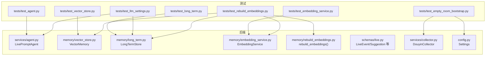
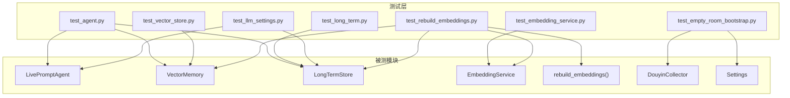
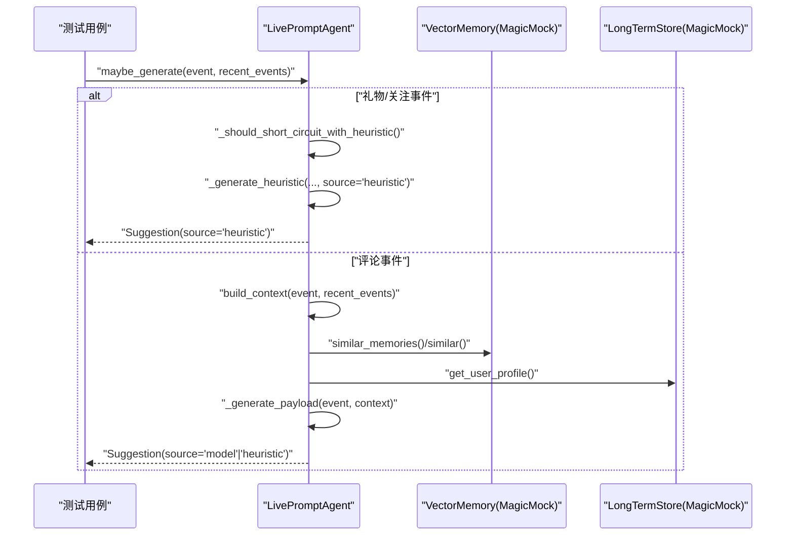
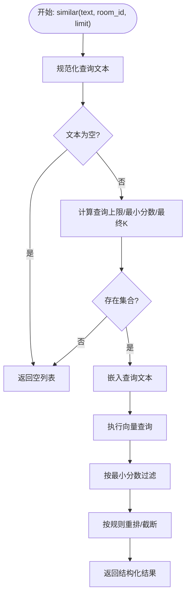
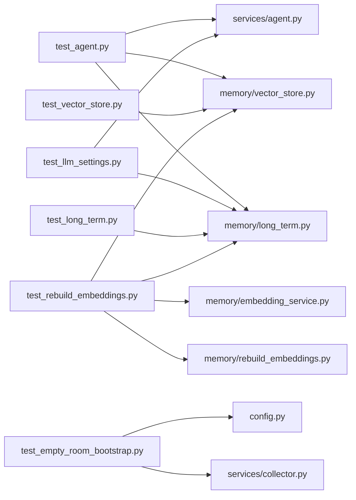

# 单元测试

<cite>
**本文引用的文件**
- [README.md](file://README.md)
- [requirements.txt](file://requirements.txt)
- [backend/config.py](file://backend/config.py)
- [backend/services/agent.py](file://backend/services/agent.py)
- [backend/memory/vector_store.py](file://backend/memory/vector_store.py)
- [backend/memory/long_term.py](file://backend/memory/long_term.py)
- [backend/memory/embedding_service.py](file://backend/memory/embedding_service.py)
- [backend/memory/rebuild_embeddings.py](file://backend/memory/rebuild_embeddings.py)
- [backend/schemas/live.py](file://backend/schemas/live.py)
- [backend/services/collector.py](file://backend/services/collector.py)
- [tests/test_agent.py](file://tests/test_agent.py)
- [tests/test_embedding_service.py](file://tests/test_embedding_service.py)
- [tests/test_vector_store.py](file://tests/test_vector_store.py)
- [tests/test_long_term.py](file://tests/test_long_term.py)
- [tests/test_llm_settings.py](file://tests/test_llm_settings.py)
- [tests/test_empty_room_bootstrap.py](file://tests/test_empty_room_bootstrap.py)
- [tests/test_rebuild_embeddings.py](file://tests/test_rebuild_embeddings.py)
</cite>

## 目录
1. [简介](#简介)
2. [项目结构](#项目结构)
3. [核心组件](#核心组件)
4. [架构总览](#架构总览)
5. [详细组件分析](#详细组件分析)
6. [依赖分析](#依赖分析)
7. [性能考量](#性能考量)
8. [故障排查指南](#故障排查指南)
9. [结论](#结论)
10. [附录](#附录)

## 简介
本文件面向DouYin_llm项目的Python单元测试，系统性说明unittest框架的配置与使用方法，详解核心功能模块的测试实现，包括LivePromptAgent、VectorStore、LongTermStore、LLM设置等关键组件的测试用例设计思路与最佳实践。文档同时提供Mock对象的使用策略、测试数据准备方法、断言技巧、边界条件覆盖要点、测试覆盖率与代码质量标准建议，以及测试环境搭建与调试技巧。

## 项目结构
- 后端核心模块位于backend/，包含服务层（agent、collector等）、内存层（vector_store、long_term、embedding_service、rebuild_embeddings）与数据模型（schemas/live.py）。
- 测试集中于tests/，覆盖agent、embedding、vector store、long term store、LLM设置、空房间引导、嵌入重建等场景。
- README.md提供了测试运行命令与整体架构概览，requirements.txt定义了运行后端所需的依赖。

图表来源
- [backend/services/agent.py:23-200](file://backend/services/agent.py#L23-L200)
- [backend/memory/vector_store.py:59-200](file://backend/memory/vector_store.py#L59-L200)
- [backend/memory/long_term.py:44-200](file://backend/memory/long_term.py#L44-L200)
- [backend/memory/embedding_service.py](file://backend/memory/embedding_service.py)
- [backend/memory/rebuild_embeddings.py:1-267](file://backend/memory/rebuild_embeddings.py#L1-L267)
- [backend/schemas/live.py](file://backend/schemas/live.py)
- [backend/services/collector.py](file://backend/services/collector.py)
- [backend/config.py:40-120](file://backend/config.py#L40-L120)
- [tests/test_agent.py:1-176](file://tests/test_agent.py#L1-L176)
- [tests/test_embedding_service.py:1-83](file://tests/test_embedding_service.py#L1-L83)
- [tests/test_vector_store.py:1-103](file://tests/test_vector_store.py#L1-L103)
- [tests/test_long_term.py:1-30](file://tests/test_long_term.py#L1-L30)
- [tests/test_llm_settings.py:1-63](file://tests/test_llm_settings.py#L1-L63)
- [tests/test_empty_room_bootstrap.py:1-69](file://tests/test_empty_room_bootstrap.py#L1-L69)
- [tests/test_rebuild_embeddings.py:1-267](file://tests/test_rebuild_embeddings.py#L1-L267)

章节来源
- [README.md:180-191](file://README.md#L180-L191)
- [requirements.txt:1-6](file://requirements.txt#L1-L6)

## 核心组件
- LivePromptAgent：负责根据事件与上下文生成提词建议，支持启发式规则与OpenAI兼容LLM两种路径，并维护模型状态。
- VectorMemory：基于Chroma的向量检索与存储，支持事件与观众记忆的相似查询与upsert。
- LongTermStore：基于SQLite的长期存储，持久化事件、建议、观众画像、笔记、记忆与应用设置。
- EmbeddingService：提供云端/本地SentenceTransformer嵌入服务，并在云端失败时回退到哈希嵌入。
- rebuild_embeddings：批量重建向量索引，支持干跑、丢弃已有集合、写入清单等模式。
- Collector与Settings：采集器与配置加载，影响空房间引导与采集行为。

章节来源
- [backend/services/agent.py:23-200](file://backend/services/agent.py#L23-L200)
- [backend/memory/vector_store.py:59-200](file://backend/memory/vector_store.py#L59-L200)
- [backend/memory/long_term.py:44-200](file://backend/memory/long_term.py#L44-L200)
- [backend/memory/embedding_service.py](file://backend/memory/embedding_service.py)
- [backend/memory/rebuild_embeddings.py:1-267](file://backend/memory/rebuild_embeddings.py#L1-L267)
- [backend/services/collector.py](file://backend/services/collector.py)
- [backend/config.py:40-120](file://backend/config.py#L40-L120)

## 架构总览
下图展示了测试与被测模块之间的交互关系，突出Mock策略与关键断言点：

图表来源
- [tests/test_agent.py:1-176](file://tests/test_agent.py#L1-L176)
- [tests/test_embedding_service.py:1-83](file://tests/test_embedding_service.py#L1-L83)
- [tests/test_vector_store.py:1-103](file://tests/test_vector_store.py#L1-L103)
- [tests/test_long_term.py:1-30](file://tests/test_long_term.py#L1-L30)
- [tests/test_llm_settings.py:1-63](file://tests/test_llm_settings.py#L1-L63)
- [tests/test_empty_room_bootstrap.py:1-69](file://tests/test_empty_room_bootstrap.py#L1-L69)
- [tests/test_rebuild_embeddings.py:1-267](file://tests/test_rebuild_embeddings.py#L1-L267)
- [backend/services/agent.py:23-200](file://backend/services/agent.py#L23-L200)
- [backend/memory/vector_store.py:59-200](file://backend/memory/vector_store.py#L59-L200)
- [backend/memory/long_term.py:44-200](file://backend/memory/long_term.py#L44-L200)
- [backend/memory/embedding_service.py](file://backend/memory/embedding_service.py)
- [backend/memory/rebuild_embeddings.py:1-267](file://backend/memory/rebuild_embeddings.py#L1-L267)
- [backend/services/collector.py](file://backend/services/collector.py)
- [backend/config.py:40-120](file://backend/config.py#L40-L120)

## 详细组件分析

### LivePromptAgent 测试
- 测试目标
  - 上下文构建：验证build_context对最近事件、相似历史话术、观众记忆与用户画像的裁剪与拼装逻辑。
  - 生成决策：验证maybe_generate在礼物/关注事件上跳过LLM直走启发式路径，以及在评论事件上按阈值选择启发式或LLM。
  - LLM调用参数：验证_openai兼容调用时max_tokens等关键参数传递。
- Mock策略
  - 使用MagicMock模拟VectorMemory与LongTermStore，控制返回值与调用次数。
  - 使用patch替换urllib.request.urlopen以拦截HTTP请求体与超时参数。
  - 使用patch.object对内部方法进行桩函数替换，避免真实网络调用。
- 关键断言
  - 结果字段完整性：source、priority、reply_text、tone、reason、confidence。
  - 上下文裁剪：recent_events限制为3条，viewer_memory_texts与similar_history的长度限制。
  - 特殊事件短路：礼物/关注事件不触发build_context与LLM调用。
- 边界条件
  - 空内容事件、重复昵称与内容、低相似度召回、空用户画像。
- 代码片段路径
  - [tests/test_agent.py:41-176](file://tests/test_agent.py#L41-L176)
  - [backend/services/agent.py:83-142](file://backend/services/agent.py#L83-L142)

图表来源
- [tests/test_agent.py:91-115](file://tests/test_agent.py#L91-L115)
- [backend/services/agent.py:105-142](file://backend/services/agent.py#L105-L142)

章节来源
- [tests/test_agent.py:41-176](file://tests/test_agent.py#L41-L176)
- [backend/services/agent.py:83-142](file://backend/services/agent.py#L83-L142)

### VectorStore 测试
- 测试目标
  - 集合命名：校验集合名包含embedding签名，确保不同嵌入签名隔离。
  - 写入流程：校验add_event正确调用嵌入服务并upsert到集合。
  - 查询与阈值：校验similar返回结构化结果并应用最小分数阈值与最终K。
  - 记忆排序：当相似分数接近时，偏好更高置信度的记忆项。
- Mock策略
  - 使用MagicMock模拟chromadb客户端与集合，控制返回值与调用序列。
  - 使用patch("chromadb")屏蔽真实依赖，确保测试稳定。
- 关键断言
  - 集合名后缀一致性、嵌入维度与upsert参数。
  - 返回结果字段完整性与顺序。
- 边界条件
  - 空文本、低阈值、limit为0、无room_id过滤。
- 代码片段路径
  - [tests/test_vector_store.py:20-103](file://tests/test_vector_store.py#L20-L103)
  - [backend/memory/vector_store.py:59-200](file://backend/memory/vector_store.py#L59-L200)

图表来源
- [backend/memory/vector_store.py:172-200](file://backend/memory/vector_store.py#L172-L200)
- [tests/test_vector_store.py:55-99](file://tests/test_vector_store.py#L55-L99)

章节来源
- [tests/test_vector_store.py:20-103](file://tests/test_vector_store.py#L20-L103)
- [backend/memory/vector_store.py:59-200](file://backend/memory/vector_store.py#L59-L200)

### LongTermStore 测试
- 测试目标
  - 连接初始化：校验SQLite连接工厂与journal_mode设置。
- Mock策略
  - 使用patch("sqlite3.connect")返回Mock连接对象，验证执行语句与工厂类型。
- 关键断言
  - 连接参数、工厂类型、PRAGMA执行与row_factory设置。
- 代码片段路径
  - [tests/test_long_term.py:7-26](file://tests/test_long_term.py#L7-L26)
  - [backend/memory/long_term.py:44-62](file://backend/memory/long_term.py#L44-L62)

章节来源
- [tests/test_long_term.py:7-26](file://tests/test_long_term.py#L7-L26)
- [backend/memory/long_term.py:44-62](file://backend/memory/long_term.py#L44-L62)

### EmbeddingService 测试
- 测试目标
  - 云端模式：校验embeddings端点URL、请求体字段与超时参数。
  - 本地模式：校验SentenceTransformer编码行为。
  - 回退机制：云端失败时返回固定维度的哈希嵌入。
- Mock策略
  - 使用patch("urllib.request.urlopen")拦截HTTP请求，返回伪造响应。
  - 使用patch("SentenceTransformer")返回自定义编码器。
- 关键断言
  - 请求URL、模型名、输入列表、超时与返回向量。
- 代码片段路径
  - [tests/test_embedding_service.py:23-83](file://tests/test_embedding_service.py#L23-L83)
  - [backend/memory/embedding_service.py](file://backend/memory/embedding_service.py)

章节来源
- [tests/test_embedding_service.py:23-83](file://tests/test_embedding_service.py#L23-L83)
- [backend/memory/embedding_service.py](file://backend/memory/embedding_service.py)

### LLM设置测试
- 测试目标
  - 持久化与回读：校验LongTermStore保存/读取LLM模型与系统提示词。
  - 空提示回退：空提示时回退到默认提示词。
  - Agent运行时覆盖：Agent读取最新LLM设置并反映在current_status与current_system_prompt中。
- Mock策略
  - 使用临时目录创建独立数据库，避免污染。
- 关键断言
  - 字段完整性与默认值回退。
- 代码片段路径
  - [tests/test_llm_settings.py:23-63](file://tests/test_llm_settings.py#L23-L63)
  - [backend/memory/long_term.py:44-200](file://backend/memory/long_term.py#L44-L200)
  - [backend/services/agent.py:37-59](file://backend/services/agent.py#L37-L59)

章节来源
- [tests/test_llm_settings.py:23-63](file://tests/test_llm_settings.py#L23-L63)
- [backend/memory/long_term.py:44-200](file://backend/memory/long_term.py#L44-L200)
- [backend/services/agent.py:37-59](file://backend/services/agent.py#L37-L59)

### 空房间引导测试
- 测试目标
  - 环境变量缺失时Settings默认房间ID为空字符串。
  - 无房间ID时Collector不启动。
  - 切换房间后启动线程并更新room_id。
  - WebSocket心跳使用ping_interval而非文本ping消息。
- Mock策略
  - 使用patch.dict重设环境变量，patch("pathlib.Path.exists")控制配置加载分支。
  - 使用patch.object对threading.Thread.start进行桩函数。
  - 使用patch("websocket.WebSocketApp")返回Mock WS对象。
- 关键断言
  - 启动状态、线程对象、设置值与WS参数。
- 代码片段路径
  - [tests/test_empty_room_bootstrap.py:13-69](file://tests/test_empty_room_bootstrap.py#L13-L69)
  - [backend/services/collector.py](file://backend/services/collector.py)
  - [backend/config.py:40-120](file://backend/config.py#L40-L120)

章节来源
- [tests/test_empty_room_bootstrap.py:13-69](file://tests/test_empty_room_bootstrap.py#L13-L69)
- [backend/services/collector.py](file://backend/services/collector.py)
- [backend/config.py:40-120](file://backend/config.py#L40-L120)

### 嵌入重建测试
- 测试目标
  - 干跑统计：不实际写入，仅统计目标数量。
  - 丢弃集合：按需删除并重建集合。
  - 写入清单：真实运行时生成index_manifest.json并记录集合计数。
- Mock策略
  - 使用临时数据库与Chroma目录，构造viewer_memories与events表。
  - 使用MagicMock模拟客户端、集合与嵌入服务。
- 关键断言
  - 统计字段、集合操作、清单内容与活跃签名。
- 代码片段路径
  - [tests/test_rebuild_embeddings.py:22-267](file://tests/test_rebuild_embeddings.py#L22-L267)
  - [backend/memory/rebuild_embeddings.py:1-267](file://backend/memory/rebuild_embeddings.py#L1-L267)

章节来源
- [tests/test_rebuild_embeddings.py:22-267](file://tests/test_rebuild_embeddings.py#L22-L267)
- [backend/memory/rebuild_embeddings.py:1-267](file://backend/memory/rebuild_embeddings.py#L1-L267)

## 依赖分析
- 测试与被测模块耦合
  - 测试通过Mock隔离外部依赖（网络、数据库、文件系统），提升稳定性与速度。
  - 被测模块之间存在清晰职责边界：Agent依赖VectorMemory与LongTermStore；VectorMemory依赖EmbeddingService；rebuild_embeddings协调三者。
- 外部依赖
  - chromadb、websocket-client、fastapi、uvicorn、redis等在requirements.txt中声明，测试中通过patch屏蔽真实依赖以保证可控性。
- 循环依赖
  - 未发现直接循环导入；测试通过模块级patch避免运行时循环。

图表来源
- [tests/test_agent.py:1-176](file://tests/test_agent.py#L1-L176)
- [tests/test_vector_store.py:1-103](file://tests/test_vector_store.py#L1-L103)
- [tests/test_llm_settings.py:1-63](file://tests/test_llm_settings.py#L1-L63)
- [tests/test_empty_room_bootstrap.py:1-69](file://tests/test_empty_room_bootstrap.py#L1-L69)
- [tests/test_long_term.py:1-30](file://tests/test_long_term.py#L1-L30)
- [tests/test_rebuild_embeddings.py:1-267](file://tests/test_rebuild_embeddings.py#L1-L267)
- [backend/services/agent.py:23-200](file://backend/services/agent.py#L23-L200)
- [backend/memory/vector_store.py:59-200](file://backend/memory/vector_store.py#L59-L200)
- [backend/memory/long_term.py:44-200](file://backend/memory/long_term.py#L44-L200)
- [backend/memory/embedding_service.py](file://backend/memory/embedding_service.py)
- [backend/memory/rebuild_embeddings.py:1-267](file://backend/memory/rebuild_embeddings.py#L1-L267)
- [backend/services/collector.py](file://backend/services/collector.py)
- [backend/config.py:40-120](file://backend/config.py#L40-L120)

章节来源
- [requirements.txt:1-6](file://requirements.txt#L1-L6)

## 性能考量
- Mock优先：通过patch与MagicMock减少I/O与网络调用，显著提升测试吞吐。
- 参数化与边界：对阈值、limit、空输入等进行参数化测试，避免回归。
- 覆盖率建议：重点覆盖分支与异常路径（如云端失败回退、空房间ID、集合不存在等）。
- 并行执行：unittest默认顺序执行；如需加速可在CI中按模块并行运行多个测试文件。

## 故障排查指南
- 网络相关错误
  - 症状：urllib请求失败或超时。
  - 排查：确认patch路径与side_effect返回值；核对请求体字段与超时参数。
  - 参考路径：[tests/test_agent.py:163-169](file://tests/test_agent.py#L163-L169)
- 数据库相关错误
  - 症状：SQLite连接失败或journal_mode未生效。
  - 排查：确认patch("sqlite3.connect")返回Mock对象且执行PRAGMA；检查工厂类型。
  - 参考路径：[tests/test_long_term.py:14-24](file://tests/test_long_term.py#L14-L24)
- 向量检索异常
  - 症状：集合不存在或查询无结果。
  - 排查：确认集合名包含embedding签名；检查最小分数与最终K参数。
  - 参考路径：[tests/test_vector_store.py:26-32](file://tests/test_vector_store.py#L26-L32)
- 采集器启动问题
  - 症状：无房间ID时不启动，切换房间后未启动线程。
  - 排查：确认环境变量与Settings.room_id；检查threading.Thread.start调用次数。
  - 参考路径：[tests/test_empty_room_bootstrap.py:25-47](file://tests/test_empty_room_bootstrap.py#L25-L47)

章节来源
- [tests/test_agent.py:163-169](file://tests/test_agent.py#L163-L169)
- [tests/test_long_term.py:14-24](file://tests/test_long_term.py#L14-L24)
- [tests/test_vector_store.py:26-32](file://tests/test_vector_store.py#L26-L32)
- [tests/test_empty_room_bootstrap.py:25-47](file://tests/test_empty_room_bootstrap.py#L25-L47)

## 结论
本测试体系围绕LivePromptAgent、VectorStore、LongTermStore、EmbeddingService与rebuild_embeddings等核心模块，采用unittest与Mock策略实现了高内聚、低耦合的测试方案。通过参数化与边界条件覆盖，结合明确的断言与流程图/时序图辅助理解，能够有效保障关键路径的稳定性与可维护性。建议在持续集成中引入覆盖率统计与静态检查，进一步提升代码质量。

## 附录
- 测试运行
  - 使用unittest模块运行全部测试文件，参考README中的命令行示例。
  - 参考路径：[README.md:182-191](file://README.md#L182-L191)
- 依赖安装
  - 安装后端依赖以支持chromadb等可选组件。
  - 参考路径：[requirements.txt:1-6](file://requirements.txt#L1-L6)
- 配置加载
  - Settings从环境变量与.env加载，注意空房间ID场景。
  - 参考路径：[backend/config.py:40-120](file://backend/config.py#L40-L120)