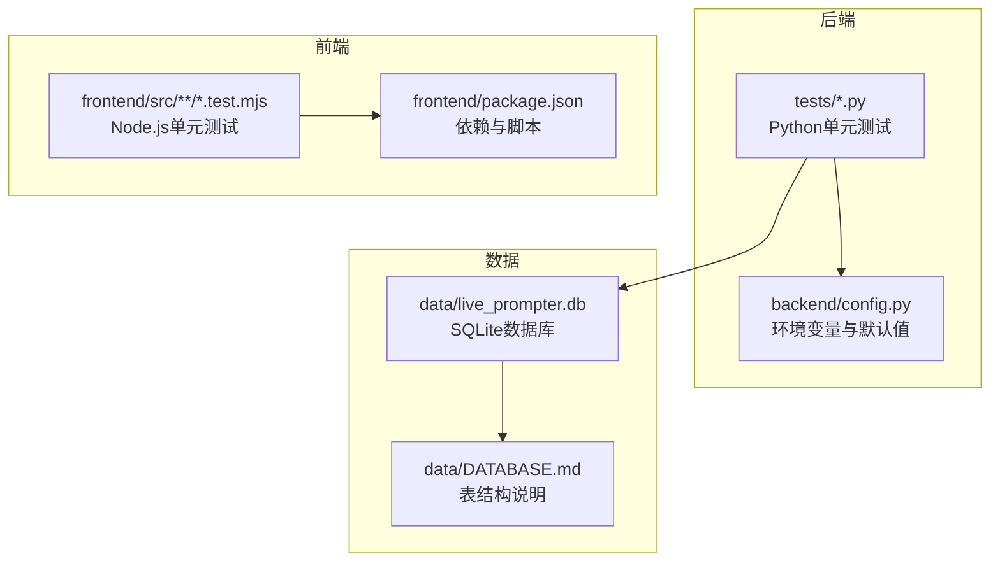
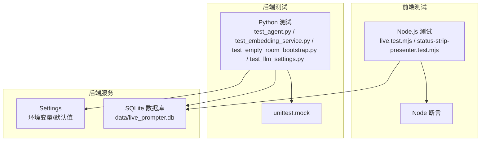
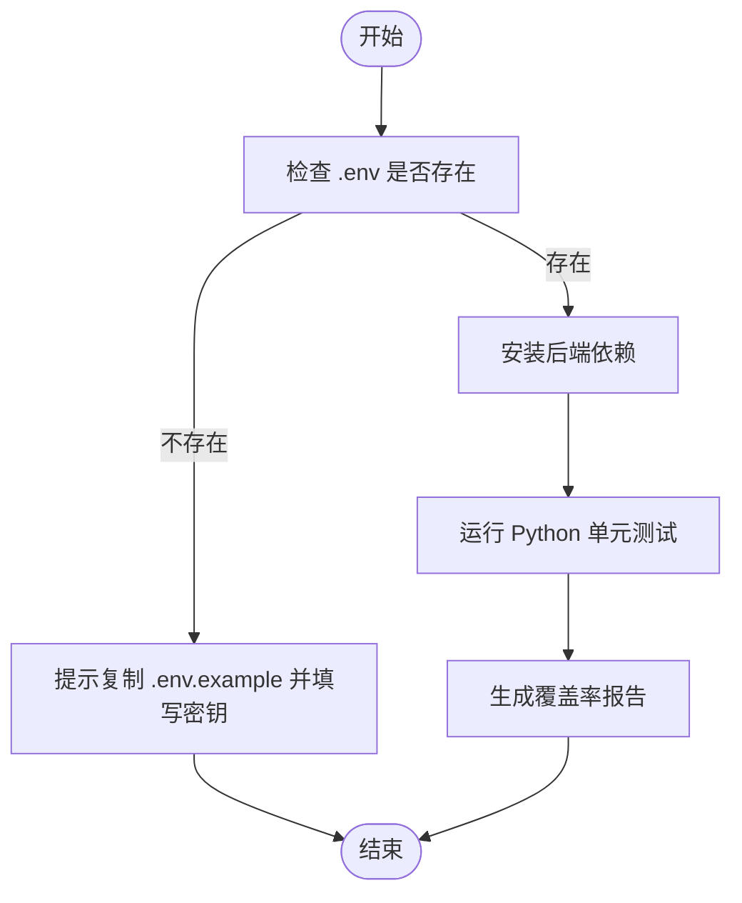
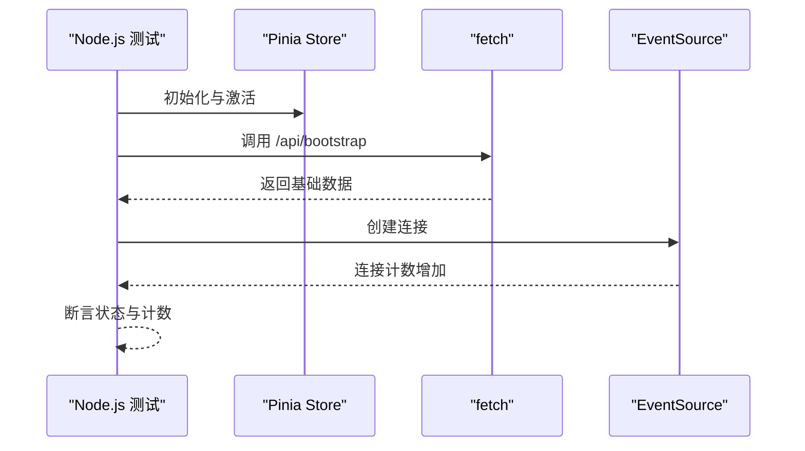
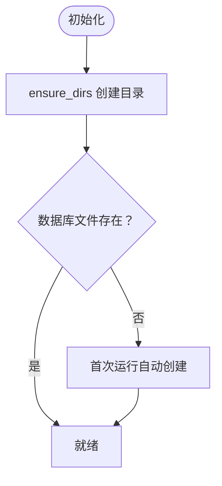
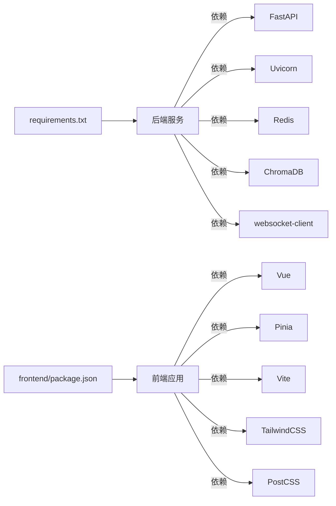

# 测试环境配置

<cite>
**本文引用的文件**
- [backend/config.py](file://backend/config.py)
- [requirements.txt](file://requirements.txt)
- [frontend/package.json](file://frontend/package.json)
- [frontend/src/stores/live.test.mjs](file://frontend/src/stores/live.test.mjs)
- [frontend/src/components/status-strip-presenter.test.mjs](file://frontend/src/components/status-strip-presenter.test.mjs)
- [tests/test_agent.py](file://tests/test_agent.py)
- [tests/test_embedding_service.py](file://tests/test_embedding_service.py)
- [tests/test_empty_room_bootstrap.py](file://tests/test_empty_room_bootstrap.py)
- [tests/test_llm_settings.py](file://tests/test_llm_settings.py)
- [data/DATABASE.md](file://data/DATABASE.md)
- [start_all.ps1](file://start_all.ps1)
- [start_backend_qwen.ps1](file://start_backend_qwen.ps1)
- [start_frontend.ps1](file://start_frontend.ps1)
</cite>

## 目录
1. [简介](#简介)
2. [项目结构](#项目结构)
3. [核心组件](#核心组件)
4. [架构总览](#架构总览)
5. [详细组件分析](#详细组件分析)
6. [依赖分析](#依赖分析)
7. [性能考虑](#性能考虑)
8. [故障排除指南](#故障排除指南)
9. [结论](#结论)
10. [附录](#附录)

## 简介
本文件面向DouYin_llm项目的测试环境配置，目标是帮助开发者与测试工程师快速搭建并运行Python后端与Node.js前端的测试环境，理解测试配置与环境变量，掌握测试数据库的初始化与清理策略，以及如何在CI/CD中执行测试。文档同时提供常见问题排查与性能优化建议，确保测试流程稳定高效。

## 项目结构
项目采用前后端分离的结构，测试覆盖后端Python单元测试与前端Node.js测试（基于原生Node断言）。关键测试文件分布如下：
- 后端测试：位于tests目录，覆盖智能体、嵌入服务、空房间引导、LLM设置等模块。
- 前端测试：位于frontend/src目录，使用Node.js原生断言进行单元测试。
- 配置与依赖：后端配置通过环境变量加载；前端依赖通过package.json管理；后端依赖通过requirements.txt管理。
- 数据库说明：data/DATABASE.md描述了SQLite数据库schema及常用查询。

**图表来源**
- [backend/config.py:1-113](file://backend/config.py#L1-L113)
- [tests/test_agent.py:1-176](file://tests/test_agent.py#L1-L176)
- [tests/test_embedding_service.py:1-83](file://tests/test_embedding_service.py#L1-L83)
- [frontend/package.json:1-23](file://frontend/package.json#L1-L23)
- [frontend/src/stores/live.test.mjs:1-68](file://frontend/src/stores/live.test.mjs#L1-L68)
- [data/DATABASE.md:1-151](file://data/DATABASE.md#L1-L151)

**章节来源**
- [backend/config.py:1-113](file://backend/config.py#L1-L113)
- [requirements.txt:1-6](file://requirements.txt#L1-L6)
- [frontend/package.json:1-23](file://frontend/package.json#L1-L23)
- [data/DATABASE.md:1-151](file://data/DATABASE.md#L1-L151)

## 核心组件
- 后端配置与环境变量
  - 后端通过Settings类从环境变量与.env文件加载配置，支持应用主机、端口、采集器参数、数据库路径、向量数据库目录、Redis连接、LLM与嵌入模式、超时与最大token等参数。
  - 提供目录创建方法以确保数据目录存在。
  - 提供LLM与嵌入模型解析函数，根据模式返回最终URL与模型名。
- Python测试套件
  - 覆盖智能体上下文构建、礼物事件跳过LLM、OpenAI兼容接口调用、嵌入服务云端与本地模式、回退机制、空房间引导逻辑、LLM设置持久化与读取等。
- Node.js测试套件
  - 使用Node原生断言，验证Pinia Store初始化、bootstrap与connect行为、EventSource连接次数等。
- 数据库与Schema
  - SQLite数据库文件位于data/live_prompter.db，包含events、viewer_profiles、viewer_gifts、live_sessions、viewer_notes等核心表，支持常用画像与会话查询。

**章节来源**
- [backend/config.py:40-113](file://backend/config.py#L40-L113)
- [tests/test_agent.py:41-176](file://tests/test_agent.py#L41-L176)
- [tests/test_embedding_service.py:23-83](file://tests/test_embedding_service.py#L23-L83)
- [tests/test_empty_room_bootstrap.py:13-69](file://tests/test_empty_room_bootstrap.py#L13-L69)
- [tests/test_llm_settings.py:23-63](file://tests/test_llm_settings.py#L23-L63)
- [frontend/src/stores/live.test.mjs:1-68](file://frontend/src/stores/live.test.mjs#L1-L68)
- [frontend/src/components/status-strip-presenter.test.mjs:1-50](file://frontend/src/components/status-strip-presenter.test.mjs#L1-L50)
- [data/DATABASE.md:1-151](file://data/DATABASE.md#L1-L151)

## 架构总览
下图展示了测试环境的整体交互：前端Node.js测试通过fetch与EventSource模拟HTTP与SSE请求；后端Python测试通过unittest与mock对服务层进行隔离验证；数据库由SQLite承载，Schema在data/DATABASE.md中定义。

**图表来源**
- [frontend/src/stores/live.test.mjs:1-68](file://frontend/src/stores/live.test.mjs#L1-L68)
- [frontend/src/components/status-strip-presenter.test.mjs:1-50](file://frontend/src/components/status-strip-presenter.test.mjs#L1-L50)
- [tests/test_agent.py:1-176](file://tests/test_agent.py#L1-L176)
- [tests/test_embedding_service.py:1-83](file://tests/test_embedding_service.py#L1-L83)
- [tests/test_empty_room_bootstrap.py:1-69](file://tests/test_empty_room_bootstrap.py#L1-L69)
- [tests/test_llm_settings.py:1-63](file://tests/test_llm_settings.py#L1-L63)
- [backend/config.py:40-113](file://backend/config.py#L40-L113)
- [data/DATABASE.md:1-151](file://data/DATABASE.md#L1-L151)

## 详细组件分析

### Python测试环境搭建与配置
- 安装依赖
  - 使用requirements.txt安装后端依赖，包括FastAPI、Uvicorn、Redis、ChromaDB等。
- 环境变量与配置
  - 后端配置通过Settings类从环境变量加载，若未设置则使用默认值。建议在测试前准备.env文件，确保LLM与嵌入服务所需密钥可用。
- 运行测试
  - 可直接运行tests目录下的Python测试文件，或使用unittest discover方式批量执行。
- Mock策略
  - 测试广泛使用unittest.mock对网络请求、外部服务与线程进行替换，确保测试可重复且不依赖外部状态。

**图表来源**
- [start_all.ps1:6-9](file://start_all.ps1#L6-L9)
- [requirements.txt:1-6](file://requirements.txt#L1-L6)
- [backend/config.py:12-37](file://backend/config.py#L12-L37)

**章节来源**
- [requirements.txt:1-6](file://requirements.txt#L1-L6)
- [backend/config.py:12-37](file://backend/config.py#L12-L37)
- [tests/test_agent.py:1-176](file://tests/test_agent.py#L1-L176)
- [tests/test_embedding_service.py:1-83](file://tests/test_embedding_service.py#L1-L83)
- [tests/test_empty_room_bootstrap.py:1-69](file://tests/test_empty_room_bootstrap.py#L1-L69)
- [tests/test_llm_settings.py:1-63](file://tests/test_llm_settings.py#L1-L63)

### Node.js测试环境搭建与配置
- 安装依赖
  - 在frontend目录下执行npm install安装Vite、Vue、Pinia等开发依赖。
- 运行测试
  - 使用Node原生断言编写测试，如live.test.mjs与status-strip-presenter.test.mjs，分别验证Store初始化与连接状态呈现。
- 模拟外部依赖
  - 通过全局替换fetch与EventSource实现对HTTP与SSE的模拟，避免真实网络请求影响测试稳定性。

**图表来源**
- [frontend/src/stores/live.test.mjs:1-68](file://frontend/src/stores/live.test.mjs#L1-L68)
- [frontend/src/components/status-strip-presenter.test.mjs:1-50](file://frontend/src/components/status-strip-presenter.test.mjs#L1-L50)
- [frontend/package.json:15-21](file://frontend/package.json#L15-L21)

**章节来源**
- [frontend/package.json:1-23](file://frontend/package.json#L1-L23)
- [frontend/src/stores/live.test.mjs:1-68](file://frontend/src/stores/live.test.mjs#L1-L68)
- [frontend/src/components/status-strip-presenter.test.mjs:1-50](file://frontend/src/components/status-strip-presenter.test.mjs#L1-L50)

### 测试配置文件与环境变量
- .env文件
  - 后端启动脚本会检查.env是否存在，缺失时提示复制示例并填写密钥。测试阶段同样建议准备该文件以确保LLM与嵌入服务可用。
- 关键环境变量
  - 应用与采集器：APP_HOST、APP_PORT、COLLECTOR_*系列。
  - 数据存储：DATA_DIR、DATABASE_PATH、CHROMA_DIR、REDIS_URL。
  - LLM与嵌入：LLM_MODE、LLM_BASE_URL、LLM_MODEL、LLM_API_KEY、EMBEDDING_*系列。
  - 性能与语义：SESSION_TTL_SECONDS、SEMANTIC_*系列。
- 默认值
  - Settings类为所有参数提供合理默认值，确保本地开箱即用。

**章节来源**
- [start_all.ps1:6-9](file://start_all.ps1#L6-L9)
- [backend/config.py:40-113](file://backend/config.py#L40-L113)

### 测试数据库初始化与清理策略
- 初始化
  - SQLite数据库文件位于data/live_prompter.db，Schema在data/DATABASE.md中定义。首次运行时无需额外初始化，Settings.ensure_dirs会创建必要的数据目录。
- 清理
  - 单测中常使用临时目录与临时数据库文件，测试结束后自动清理，避免污染。
- 常用查询
  - 可参考DATABASE.md中的常用查询，便于验证测试结果或手动诊断。

**图表来源**
- [backend/config.py:77-83](file://backend/config.py#L77-L83)
- [data/DATABASE.md:1-151](file://data/DATABASE.md#L1-L151)

**章节来源**
- [backend/config.py:77-83](file://backend/config.py#L77-L83)
- [data/DATABASE.md:1-151](file://data/DATABASE.md#L1-L151)

### 测试覆盖率工具配置与报告生成
- Python覆盖率
  - 推荐使用pytest-cov或coverage.py在CI中生成覆盖率报告。可在项目根目录添加.coveragerc配置文件，指定源码目录与忽略规则。
- Node.js覆盖率
  - 建议使用c8或Istanbul工具对前端测试生成覆盖率报告。可在package.json中添加脚本，结合Vitest或Jest（如后续引入）进行集成。
- CI集成
  - 将覆盖率上传至代码质量平台（如Codecov），并在PR中展示覆盖率变化。

[本节为通用实践指导，不直接分析具体文件，故无“章节来源”]

### CI/CD流水线中的测试执行配置
- 后端测试
  - 步骤：准备.env → 安装requirements → 运行Python测试 → 生成覆盖率报告。
- 前端测试
  - 步骤：进入frontend目录 → 安装依赖 → 运行Node.js测试 → 生成覆盖率报告。
- 并行执行
  - 建议将后端与前端测试并行执行，缩短流水线时间。
- 缓存与重用
  - 对pip与npm依赖进行缓存，提升构建速度。

[本节为通用实践指导，不直接分析具体文件，故无“章节来源”]

## 依赖分析
- 后端依赖
  - FastAPI、Uvicorn用于提供API服务；Redis与ChromaDB用于会话与向量存储；websocket-client用于直播事件采集。
- 前端依赖
  - Vue与Pinia用于状态管理；Vite用于开发与构建；TailwindCSS与PostCSS用于样式。
- 测试依赖
  - Python测试使用unittest与unittest.mock；Node.js测试使用Node原生断言。

**图表来源**
- [requirements.txt:1-6](file://requirements.txt#L1-L6)
- [frontend/package.json:11-21](file://frontend/package.json#L11-L21)

**章节来源**
- [requirements.txt:1-6](file://requirements.txt#L1-L6)
- [frontend/package.json:1-23](file://frontend/package.json#L1-L23)

## 性能考虑
- 测试并发
  - 将独立测试用例并行执行，减少整体测试时间。
- Mock与隔离
  - 充分使用mock减少外部依赖，避免网络抖动影响测试稳定性。
- 数据库事务与临时文件
  - 在单测中使用内存数据库或临时文件，避免磁盘IO成为瓶颈。
- 资源限制
  - 控制向量检索的查询上限与相似度阈值，平衡召回与性能。

[本节为通用实践指导，不直接分析具体文件，故无“章节来源”]

## 故障排除指南
- 启动脚本提示缺少.env
  - 按提示复制示例并填写密钥，再重新运行启动脚本。
- Node.js未找到
  - 确认start_frontend.ps1中Node.js路径正确，或在PATH中添加Node.js安装路径。
- 测试失败：网络相关
  - 检查LLM与嵌入服务的Base URL与API Key是否正确；必要时使用本地嵌入模式降低对外部服务的依赖。
- 数据库权限或路径问题
  - 确认DATA_DIR、DATABASE_PATH、CHROMA_DIR的写权限；必要时以管理员权限运行或调整路径。
- 前端测试断言失败
  - 检查fetch与EventSource的模拟是否正确；确认Store初始化顺序与断言点。

**章节来源**
- [start_all.ps1:6-9](file://start_all.ps1#L6-L9)
- [start_frontend.ps1:7-13](file://start_frontend.ps1#L7-L13)
- [backend/config.py:40-113](file://backend/config.py#L40-L113)
- [tests/test_embedding_service.py:71-79](file://tests/test_embedding_service.py#L71-L79)
- [frontend/src/stores/live.test.mjs:15-44](file://frontend/src/stores/live.test.mjs#L15-L44)

## 结论
通过本文档，您可以在本地快速搭建并运行DouYin_llm项目的Python与Node.js测试环境，理解后端配置与环境变量、掌握数据库初始化与清理策略，并在CI/CD中稳定执行测试。建议在团队内统一测试规范与覆盖率要求，持续优化测试性能与稳定性。

## 附录
- 快速启动与测试
  - 后端：准备.env → 运行start_backend_qwen.ps1 → 执行Python测试。
  - 前端：进入frontend → npm install → 运行Node.js测试。
- 常用命令
  - 后端：python -m pytest tests/ 或 python tests/test_xxx.py。
  - 前端：node frontend/src/stores/live.test.mjs 与 node frontend/src/components/status-strip-presenter.test.mjs。

**章节来源**
- [start_backend_qwen.ps1:11-12](file://start_backend_qwen.ps1#L11-L12)
- [frontend/package.json:6-10](file://frontend/package.json#L6-L10)
- [tests/test_agent.py:174-176](file://tests/test_agent.py#L174-L176)
- [frontend/src/stores/live.test.mjs:52-67](file://frontend/src/stores/live.test.mjs#L52-L67)