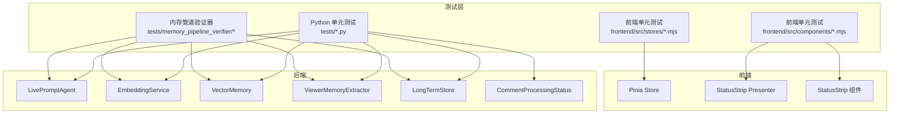
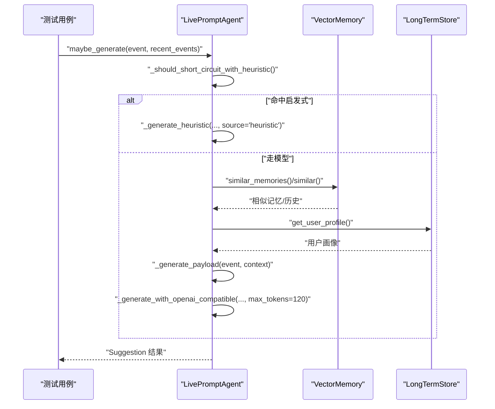

# 测试策略

<cite>
**本文引用的文件**
- [tests/test_agent.py](file://tests/test_agent.py)
- [tests/test_embedding_service.py](file://tests/test_embedding_service.py)
- [tests/test_long_term.py](file://tests/test_long_term.py)
- [tests/test_vector_store.py](file://tests/test_vector_store.py)
- [tests/test_rebuild_embeddings.py](file://tests/test_rebuild_embeddings.py)
- [tests/test_empty_room_bootstrap.py](file://tests/test_empty_room_bootstrap.py)
- [tests/test_llm_settings.py](file://tests/test_llm_settings.py)
- [tests/test_comment_processing_status.py](file://tests/test_comment_processing_status.py)
- [tests/test_verify_memory_pipeline.py](file://tests/test_verify_memory_pipeline.py)
- [tests/verify_memory_pipeline.py](file://tests/verify_memory_pipeline.py)
- [tests/memory_pipeline_verifier/datasets.py](file://tests/memory_pipeline_verifier/datasets.py)
- [tests/memory_pipeline_verifier/runner.py](file://tests/memory_pipeline_verifier/runner.py)
- [tests/fixtures/memory_pipeline_events.json](file://tests/fixtures/memory_pipeline_events.json)
- [backend/services/agent.py](file://backend/services/agent.py)
- [backend/memory/vector_store.py](file://backend/memory/vector_store.py)
- [backend/memory/embedding_service.py](file://backend/memory/embedding_service.py)
- [backend/services/memory_extractor.py](file://backend/services/memory_extractor.py)
- [backend/memory/long_term.py](file://backend/memory/long_term.py)
- [backend/schemas/live.py](file://backend/schemas/live.py)
- [frontend/src/stores/live.test.mjs](file://frontend/src/stores/live.test.mjs)
- [frontend/src/components/status-strip-presenter.test.mjs](file://frontend/src/components/status-strip-presenter.test.mjs)
- [frontend/src/components/status-strip-layout.test.mjs](file://frontend/src/components/status-strip-layout.test.mjs)
- [frontend/package.json](file://frontend/package.json)
- [requirements.txt](file://requirements.txt)
</cite>

## 目录
1. [引言](#引言)
2. [项目结构](#项目结构)
3. [核心组件](#核心组件)
4. [架构总览](#架构总览)
5. [详细组件分析](#详细组件分析)
6. [依赖分析](#依赖分析)
7. [性能考虑](#性能考虑)
8. [故障排查指南](#故障排查指南)
9. [结论](#结论)
10. [附录](#附录)

## 引言
本测试策略文档面向DouYin_llm项目的测试与质量保障工作，系统化阐述单元测试、集成测试与前端测试的组织结构与实施方法；明确Python测试框架配置与核心功能覆盖范围；给出Pinia Store与Vue组件测试实践；提供测试用例编写指南、测试数据准备与模拟对象使用建议；规划性能测试、回归测试与自动化测试方案；制定覆盖率目标与质量门禁流程；并给出测试环境搭建与持续集成配置建议及常见问题与调试技巧。

**更新** 新增内存管道验证器测试框架和评论处理状态测试，扩展了测试覆盖范围和测试策略的完整性。

## 项目结构
项目采用前后端分离的模块化组织：后端以Python为主，包含服务层与内存/向量检索模块；前端基于Vite+Vue3+Pinia，配套单元测试与组件测试；根目录tests集中存放Python单元测试；frontend/src/components与frontend/src/stores分别存放前端组件与状态测试；新增内存管道验证器测试框架提供端到端测试能力。

```mermaid
graph TB
subgraph "后端"
A["backend/services/agent.py"]
B["backend/memory/vector_store.py"]
C["backend/memory/embedding_service.py"]
D["backend/services/memory_extractor.py"]
E["backend/memory/long_term.py"]
F["backend/schemas/live.py"]
end
subgraph "测试"
T1["tests/test_agent.py"]
T2["tests/test_embedding_service.py"]
T3["tests/test_vector_store.py"]
T4["tests/test_rebuild_embeddings.py"]
T5["tests/test_empty_room_bootstrap.py"]
T6["tests/test_llm_settings.py"]
T7["tests/test_long_term.py"]
T8["tests/test_comment_processing_status.py"]
T9["tests/test_verify_memory_pipeline.py"]
T10["tests/verify_memory_pipeline.py"]
subgraph "内存管道验证器"
MV1["tests/memory_pipeline_verifier/datasets.py"]
MV2["tests/memory_pipeline_verifier/runner.py"]
end
end
subgraph "前端"
F1["frontend/src/stores/live.test.mjs"]
F2["frontend/src/components/status-strip-presenter.test.mjs"]
F3["frontend/src/components/status-strip-layout.test.mjs"]
end
T1 --> A
T2 --> C
T3 --> B
T4 --> B
T4 --> C
T5 --> A
T6 --> A
T7 --> E
T8 --> F
T9 --> MV1
T9 --> MV2
T10 --> MV2
F1 --> A
F2 --> A
F3 --> A
```

**图表来源**
- [tests/test_agent.py:1-176](file://tests/test_agent.py#L1-L176)
- [tests/test_embedding_service.py:1-83](file://tests/test_embedding_service.py#L1-L83)
- [tests/test_vector_store.py:1-103](file://tests/test_vector_store.py#L1-L103)
- [tests/test_rebuild_embeddings.py:1-267](file://tests/test_rebuild_embeddings.py#L1-L267)
- [tests/test_empty_room_bootstrap.py:1-69](file://tests/test_empty_room_bootstrap.py#L1-L69)
- [tests/test_llm_settings.py:1-63](file://tests/test_llm_settings.py#L1-L63)
- [tests/test_long_term.py:1-30](file://tests/test_long_term.py#L1-L30)
- [tests/test_comment_processing_status.py:1-109](file://tests/test_comment_processing_status.py#L1-L109)
- [tests/test_verify_memory_pipeline.py:1-175](file://tests/test_verify_memory_pipeline.py#L1-L175)
- [tests/verify_memory_pipeline.py:1-15](file://tests/verify_memory_pipeline.py#L1-L15)
- [tests/memory_pipeline_verifier/datasets.py:1-87](file://tests/memory_pipeline_verifier/datasets.py#L1-L87)
- [tests/memory_pipeline_verifier/runner.py:1-400](file://tests/memory_pipeline_verifier/runner.py#L1-L400)
- [backend/services/agent.py:1-200](file://backend/services/agent.py#L1-L200)
- [backend/memory/vector_store.py:1-200](file://backend/memory/vector_store.py#L1-L200)
- [backend/memory/embedding_service.py:1-102](file://backend/memory/embedding_service.py#L1-L102)
- [backend/services/memory_extractor.py:1-118](file://backend/services/memory_extractor.py#L1-L118)
- [backend/memory/long_term.py:1-967](file://backend/memory/long_term.py#L1-L967)
- [backend/schemas/live.py:1-127](file://backend/schemas/live.py#L1-L127)
- [frontend/src/stores/live.test.mjs:1-68](file://frontend/src/stores/live.test.mjs#L1-L68)
- [frontend/src/components/status-strip-presenter.test.mjs:1-50](file://frontend/src/components/status-strip-presenter.test.mjs#L1-L50)
- [frontend/src/components/status-strip-layout.test.mjs:1-18](file://frontend/src/components/status-strip-layout.test.mjs#L1-L18)

**章节来源**
- [tests/test_agent.py:1-176](file://tests/test_agent.py#L1-L176)
- [tests/test_embedding_service.py:1-83](file://tests/test_embedding_service.py#L1-L83)
- [tests/test_vector_store.py:1-103](file://tests/test_vector_store.py#L1-L103)
- [tests/test_rebuild_embeddings.py:1-267](file://tests/test_rebuild_embeddings.py#L1-L267)
- [tests/test_empty_room_bootstrap.py:1-69](file://tests/test_empty_room_bootstrap.py#L1-L69)
- [tests/test_llm_settings.py:1-63](file://tests/test_llm_settings.py#L1-L63)
- [tests/test_long_term.py:1-30](file://tests/test_long_term.py#L1-L30)
- [tests/test_comment_processing_status.py:1-109](file://tests/test_comment_processing_status.py#L1-L109)
- [tests/test_verify_memory_pipeline.py:1-175](file://tests/test_verify_memory_pipeline.py#L1-L175)
- [tests/verify_memory_pipeline.py:1-15](file://tests/verify_memory_pipeline.py#L1-L15)
- [tests/memory_pipeline_verifier/datasets.py:1-87](file://tests/memory_pipeline_verifier/datasets.py#L1-L87)
- [tests/memory_pipeline_verifier/runner.py:1-400](file://tests/memory_pipeline_verifier/runner.py#L1-L400)
- [backend/services/agent.py:1-200](file://backend/services/agent.py#L1-L200)
- [backend/memory/vector_store.py:1-200](file://backend/memory/vector_store.py#L1-L200)
- [backend/memory/embedding_service.py:1-102](file://backend/memory/embedding_service.py#L1-L102)
- [backend/services/memory_extractor.py:1-118](file://backend/services/memory_extractor.py#L1-L118)
- [backend/memory/long_term.py:1-967](file://backend/memory/long_term.py#L1-L967)
- [backend/schemas/live.py:1-127](file://backend/schemas/live.py#L1-L127)
- [frontend/src/stores/live.test.mjs:1-68](file://frontend/src/stores/live.test.mjs#L1-L68)
- [frontend/src/components/status-strip-presenter.test.mjs:1-50](file://frontend/src/components/status-strip-presenter.test.mjs#L1-L50)
- [frontend/src/components/status-strip-layout.test.mjs:1-18](file://frontend/src/components/status-strip-layout.test.mjs#L1-L18)

## 核心组件
- 后端服务层
  - LivePromptAgent：负责构建上下文、触发启发式或模型生成、维护状态与引用去重等。
  - EmbeddingService：封装本地/云端嵌入调用与回退机制。
  - VectorMemory：事件与用户记忆的向量检索与排序、集合命名与阈值控制。
  - ViewerMemoryExtractor：从评论中提取可重用的观众记忆，包含启发式规则和置信度评估。
  - LongTermStore：SQLite长期存储层，管理事件、观众档案、礼物历史和记忆存储。
  - CommentProcessingStatus：评论处理状态模型，用于前端显示实时处理进度。
- 前端测试
  - Pinia Store测试：验证bootstrap/connect流程与fetch/SSE行为。
  - 组件测试：校验连接状态徽标呈现逻辑与布局断言。
- 内存管道验证器
  - 提供内部验证和端到端验证两种模式，确保记忆提取管道的完整性和正确性。

**更新** 新增ViewerMemoryExtractor、LongTermStore和CommentProcessingStatus组件，以及内存管道验证器测试框架。

**章节来源**
- [backend/services/agent.py:23-200](file://backend/services/agent.py#L23-L200)
- [backend/memory/embedding_service.py:18-102](file://backend/memory/embedding_service.py#L18-L102)
- [backend/memory/vector_store.py:59-200](file://backend/memory/vector_store.py#L59-L200)
- [backend/services/memory_extractor.py:62-118](file://backend/services/memory_extractor.py#L62-L118)
- [backend/memory/long_term.py:44-967](file://backend/memory/long_term.py#L44-L967)
- [backend/schemas/live.py:81-94](file://backend/schemas/live.py#L81-L94)
- [frontend/src/stores/live.test.mjs:1-68](file://frontend/src/stores/live.test.mjs#L1-L68)
- [frontend/src/components/status-strip-presenter.test.mjs:1-50](file://frontend/src/components/status-strip-presenter.test.mjs#L1-L50)

## 架构总览
下图展示测试与被测组件之间的交互关系，突出Python测试对服务层与内存层的覆盖，以及前端测试对Store与Presenter/组件的验证。新增的内存管道验证器测试框架提供了完整的端到端测试能力。

**图表来源**
- [tests/test_agent.py:1-176](file://tests/test_agent.py#L1-L176)
- [tests/test_embedding_service.py:1-83](file://tests/test_embedding_service.py#L1-L83)
- [tests/test_vector_store.py:1-103](file://tests/test_vector_store.py#L1-L103)
- [tests/test_comment_processing_status.py:1-109](file://tests/test_comment_processing_status.py#L1-L109)
- [tests/test_verify_memory_pipeline.py:1-175](file://tests/test_verify_memory_pipeline.py#L1-L175)
- [tests/memory_pipeline_verifier/runner.py:1-400](file://tests/memory_pipeline_verifier/runner.py#L1-L400)
- [frontend/src/stores/live.test.mjs:1-68](file://frontend/src/stores/live.test.mjs#L1-L68)
- [frontend/src/components/status-strip-presenter.test.mjs:1-50](file://frontend/src/components/status-strip-presenter.test.mjs#L1-L50)
- [frontend/src/components/status-strip-layout.test.mjs:1-18](file://frontend/src/components/status-strip-layout.test.mjs#L1-L18)

## 详细组件分析

### Python单元测试策略（后端）
- 测试组织
  - 使用标准库unittest作为测试框架，集中于tests目录，按模块划分文件。
  - 每个测试类聚焦单一职责，如LivePromptAgentTests、EmbeddingServiceTests等。
- Mock与Patch
  - 大量使用unittest.mock进行外部依赖隔离，如urllib请求、Chroma客户端、SentenceTransformer等。
  - 通过patch替换全局函数或类，确保测试可重复且不依赖真实网络/磁盘。
- 关键覆盖点
  - LivePromptAgent
    - 上下文构建与裁剪、相似历史与记忆筛选、启发式短路逻辑、OpenAI兼容接口参数透传。
  - EmbeddingService
    - 云端模式请求体字段、超时、鉴权头；本地模式SentenceTransformer调用；失败回退至HashEmbeddingFunction。
  - VectorMemory
    - 集合命名与签名、事件写入与嵌入、相似查询阈值与排序、记忆偏好排序优先级。
  - ViewerMemoryExtractor
    - 低信号内容过滤、记忆类型分类（偏好、计划、上下文、事实）、置信度计算、关键词匹配规则。
  - LongTermStore
    - SQLite数据库操作、表结构迁移、索引创建、事件持久化、观众档案管理、礼物历史跟踪。
  - CommentProcessingStatus
    - 评论处理状态字段验证、状态流转完整性检查、前端显示一致性保证。
  - 内存管道验证器
    - 内部验证模式：直接调用后端组件进行单元测试。
    - 端到端验证模式：启动后端进程，通过HTTP API进行集成测试。
    - 数据集生成：确定性数据集构建、JSON夹具导出、批量样本生成。
- 示例路径
  - [LivePromptAgentTests.test_build_context_compacts_prompt_inputs:42-90](file://tests/test_agent.py#L42-L90)
  - [EmbeddingServiceTests.test_cloud_mode_uses_embeddings_endpoint:24-54](file://tests/test_embedding_service.py#L24-L54)
  - [VectorMemoryTests.test_collection_names_use_embedding_signature:21-32](file://tests/test_vector_store.py#L21-L32)
  - [ViewerMemoryExtractorTests.test_preference_extraction:62-118](file://backend/services/memory_extractor.py#L62-L118)
  - [LongTermStoreTests.test_memory_persistence:734-785](file://backend/memory/long_term.py#L734-L785)
  - [CommentProcessingStatusTests.test_process_event_attaches_processing_status:29-104](file://tests/test_comment_processing_status.py#L29-L104)
  - [VerifyMemoryPipelineTests.test_run_internal_verification_reports_batch_counts:132-170](file://tests/test_verify_memory_pipeline.py#L132-L170)

**更新** 新增ViewerMemoryExtractor、LongTermStore、CommentProcessingStatus和内存管道验证器的测试覆盖。

**章节来源**
- [tests/test_agent.py:1-176](file://tests/test_agent.py#L1-L176)
- [tests/test_embedding_service.py:1-83](file://tests/test_embedding_service.py#L1-L83)
- [tests/test_vector_store.py:1-103](file://tests/test_vector_store.py#L1-L103)
- [tests/test_rebuild_embeddings.py:1-267](file://tests/test_rebuild_embeddings.py#L1-L267)
- [tests/test_empty_room_bootstrap.py:1-69](file://tests/test_empty_room_bootstrap.py#L1-L69)
- [tests/test_llm_settings.py:1-63](file://tests/test_llm_settings.py#L1-L63)
- [tests/test_long_term.py:1-30](file://tests/test_long_term.py#L1-L30)
- [tests/test_comment_processing_status.py:1-109](file://tests/test_comment_processing_status.py#L1-L109)
- [tests/test_verify_memory_pipeline.py:1-175](file://tests/test_verify_memory_pipeline.py#L1-L175)
- [backend/services/memory_extractor.py:62-118](file://backend/services/memory_extractor.py#L62-L118)
- [backend/memory/long_term.py:44-967](file://backend/memory/long_term.py#L44-L967)
- [backend/schemas/live.py:81-94](file://backend/schemas/live.py#L81-L94)

### 前端测试策略（Pinia Store与组件）
- Store测试
  - 使用Pinia的createPinia与setActivePinia初始化状态容器。
  - 全局替换fetch与EventSource，断言bootstrap与connect的行为与副作用。
  - 路径参考：[frontend/src/stores/live.test.mjs:1-68](file://frontend/src/stores/live.test.mjs#L1-L68)
- 组件测试
  - Presenter测试：断言不同连接状态下的徽标呈现结果，验证返回值不被外部修改。
  - 布局测试：读取组件源码，断言CSS Grid列定义、国际化字符存在性与绝对定位断言。
  - 路径参考：
    - [frontend/src/components/status-strip-presenter.test.mjs:1-50](file://frontend/src/components/status-strip-presenter.test.mjs#L1-L50)
    - [frontend/src/components/status-strip-layout.test.mjs:1-18](file://frontend/src/components/status-strip-layout.test.mjs#L1-L18)
- 运行脚本
  - 前端package.json中未定义test脚本，可在本地使用Node原生assert进行测试执行。

**章节来源**
- [frontend/src/stores/live.test.mjs:1-68](file://frontend/src/stores/live.test.mjs#L1-L68)
- [frontend/src/components/status-strip-presenter.test.mjs:1-50](file://frontend/src/components/status-strip-presenter.test.mjs#L1-L50)
- [frontend/src/components/status-strip-layout.test.mjs:1-18](file://frontend/src/components/status-strip-layout.test.mjs#L1-L18)
- [frontend/package.json:1-23](file://frontend/package.json#L1-L23)

### 内存管道验证器测试框架
- 功能概述
  - 提供内部验证和端到端验证两种模式，确保记忆提取管道的完整性和正确性。
  - 内部验证模式：直接调用后端组件进行单元测试，无需启动后端进程。
  - 端到端验证模式：启动后端进程，通过HTTP API进行集成测试。
- 数据集管理
  - 确定性数据集构建：轮换城市和话题，确保批量样本既稳定又覆盖不同语义。
  - JSON夹具导出：将数据集保存为稳定的JSON文件，方便回归测试。
  - 批量样本生成：支持按数量生成稳定的评论事件样本。
- 核心验证步骤
  - 环境检查：验证数据库路径、嵌入模式和LLM模式配置。
  - 记忆提取：验证从评论中提取记忆的能力和准确性。
  - 数据持久化：验证事件、观众档案和记忆的正确存储。
  - 记忆召回：验证向量检索和记忆召回功能。
- 验证结果报告
  - 步骤结果记录：每个验证步骤的结果和详细信息。
  - 总结报告：整体验证结果和失败步骤列表。
  - 详细日志：格式化的步骤状态输出。

**新增** 内存管道验证器测试框架提供了完整的端到端测试解决方案。

**章节来源**
- [tests/memory_pipeline_verifier/datasets.py:1-87](file://tests/memory_pipeline_verifier/datasets.py#L1-L87)
- [tests/memory_pipeline_verifier/runner.py:1-400](file://tests/memory_pipeline_verifier/runner.py#L1-L400)
- [tests/test_verify_memory_pipeline.py:1-175](file://tests/test_verify_memory_pipeline.py#L1-L175)
- [tests/verify_memory_pipeline.py:1-15](file://tests/verify_memory_pipeline.py#L1-L15)

### API/服务组件调用序列（示例：Agent生成建议）

**图表来源**
- [tests/test_agent.py:91-172](file://tests/test_agent.py#L91-L172)
- [backend/services/agent.py:105-200](file://backend/services/agent.py#L105-L200)

## 依赖分析
- Python测试依赖
  - unittest、unittest.mock、types.SimpleNamespace用于构造测试配置与桩对象。
  - requests/urllib替换用于隔离网络依赖。
  - chromadb、sentence_transformers为可选依赖，测试中通过patch屏蔽或模拟。
  - asyncio用于异步测试，特别是评论处理状态测试。
- 前端测试依赖
  - Node内置assert/strict与EventSource/fetch替身。
  - Vite/Vue/Pinia为运行时依赖，测试仅在Node环境下执行。
- 内存管道验证器依赖
  - uvicorn用于启动后端进程。
  - sqlite3用于数据库操作验证。
  - subprocess用于进程管理和生命周期控制。

**更新** 新增asyncio依赖用于异步测试，新增uvicorn和sqlite3依赖用于内存管道验证器。

**章节来源**
- [tests/test_agent.py:1-10](file://tests/test_agent.py#L1-L10)
- [tests/test_embedding_service.py:1-10](file://tests/test_embedding_service.py#L1-L10)
- [tests/test_vector_store.py:1-10](file://tests/test_vector_store.py#L1-L10)
- [tests/test_comment_processing_status.py:1-6](file://tests/test_comment_processing_status.py#L1-L6)
- [frontend/src/stores/live.test.mjs:1-14](file://frontend/src/stores/live.test.mjs#L1-L14)
- [requirements.txt:1-6](file://requirements.txt#L1-L6)

## 性能考虑
- 向量检索性能
  - 控制查询limit与阈值，避免过量相似项导致排序开销上升。
  - 使用HashEmbeddingFunction作为回退，保证无外部依赖时的可用性。
- 生成接口参数
  - 显式传递max_tokens以限制输出长度，降低LLM成本与延迟。
- 内存管道优化
  - 批量处理：内存管道验证器支持批量样本处理，提高测试效率。
  - 缓存策略：对高频调用的相似查询添加缓存策略（如LRU）以减少重复计算。
  - 数据库优化：LongTermStore使用索引和批量操作优化数据库性能。
- 建议
  - 在CI中增加基准测试（如pytest-benchmark）对比不同嵌入模型与查询参数组合的性能表现。
  - 对内存管道验证器的批量处理能力进行性能监控。

**更新** 新增内存管道优化和性能监控建议。

## 故障排查指南
- 常见问题
  - 云端嵌入失败：检查鉴权头与超时设置，确认fallback逻辑生效。
  - 本地模型缺失：安装sentence-transformers或切换embedding_mode为cloud。
  - Chroma不可用：确认可选依赖安装与权限，或接受内存回退索引。
  - WebSocket启动失败：确认房间ID非空，必要时通过switch_room切换。
  - 内存管道验证器失败：检查后端进程启动、健康检查和API响应。
  - 评论处理状态异常：验证状态字段的完整性和前端显示一致性。
- 调试技巧
  - 使用unittest.mock的side_effect与return_value精确控制外部行为。
  - 在测试中打印捕获的请求URL、Body与超时参数，快速定位配置错误。
  - 前端测试中保留原始全局对象引用并在finally中恢复，避免跨用例污染。
  - 内存管道验证器使用详细日志输出，便于追踪每个验证步骤的状态。
  - 异步测试使用asyncio.run确保异步操作正确执行。

**更新** 新增内存管道验证器和评论处理状态的故障排查指导。

**章节来源**
- [tests/test_embedding_service.py:71-79](file://tests/test_embedding_service.py#L71-L79)
- [tests/test_empty_room_bootstrap.py:25-48](file://tests/test_empty_room_bootstrap.py#L25-L48)
- [tests/test_comment_processing_status.py:44-104](file://tests/test_comment_processing_status.py#L44-L104)
- [frontend/src/stores/live.test.mjs:9-67](file://frontend/src/stores/live.test.mjs#L9-L67)

## 结论
本项目已形成完善的Python单元测试体系与前端单元测试实践，覆盖核心服务、内存检索与设置持久化等关键路径。新增的内存管道验证器测试框架提供了完整的端到端测试能力，评论处理状态测试确保了前端用户体验的一致性。建议在现有基础上继续完善测试覆盖率与质量门禁，并在CI中固化测试与性能基线，确保迭代质量与稳定性。

**更新** 新增内存管道验证器和评论处理状态测试，显著提升了测试体系的完整性和可靠性。

## 附录

### 测试用例编写指南
- 命名规范
  - 测试方法以"test_"开头，描述具体行为与预期。
  - 新增内存管道验证器测试使用"VerifyMemoryPipelineTests"命名空间。
- 断言策略
  - 使用assertEqual/assertIs/assertIsNone等明确断言点。
  - 对返回值结构进行字段级断言，避免整体相等导致的脆弱性。
  - 异步测试使用asyncio.run确保异步操作正确执行。
- 数据准备
  - 使用SimpleNamespace构造settings，便于注入依赖与常量。
  - 使用MagicMock/patch构造外部依赖，确保测试独立性。
  - 内存管道验证器使用确定性数据集，确保测试结果可重现。
- 前端测试
  - 替换全局fetch与EventSource，断言副作用与状态变化。
  - 组件测试通过正则匹配与字符串断言校验样式与国际化内容。
- 内存管道验证器测试
  - 使用build_memory_dataset生成稳定的批量样本。
  - 通过patch隔离外部依赖，确保测试可重复性。
  - 验证步骤结果的详细日志输出，便于问题诊断。

**更新** 新增内存管道验证器测试和异步测试的编写指南。

**章节来源**
- [tests/test_agent.py:11-20](file://tests/test_agent.py#L11-L20)
- [tests/test_embedding_service.py:9-21](file://tests/test_embedding_service.py#L9-L21)
- [tests/test_comment_processing_status.py:29-104](file://tests/test_comment_processing_status.py#L29-L104)
- [frontend/src/stores/live.test.mjs:15-50](file://frontend/src/stores/live.test.mjs#L15-L50)

### 测试数据与模拟对象
- 测试数据
  - 使用SimpleNamespace构造settings与事件对象，便于快速构造多场景输入。
  - 内存管道验证器使用确定性数据集，确保测试结果可重现。
  - 通过export_dataset_fixture导出稳定的JSON夹具文件。
- 模拟对象
  - 使用patch替换urllib.request.urlopen、chromadb.Client、SentenceTransformer等。
  - 使用MagicMock模拟Collection/upsert/query等方法，断言调用次数与参数。
  - 异步测试使用AsyncMock模拟异步操作。
- 内存管道验证器数据
  - build_memory_dataset生成包含城市、话题和时间戳的稳定样本。
  - load_dataset_fixture加载预定义的JSON夹具文件。
  - query_batch_sqlite_counts汇总多个观众的批量统计结果。

**更新** 新增内存管道验证器测试数据和模拟对象的使用方法。

**章节来源**
- [tests/test_agent.py:43-53](file://tests/test_agent.py#L43-L53)
- [tests/test_vector_store.py:26-31](file://tests/test_vector_store.py#L26-L31)
- [tests/test_embedding_service.py:47-48](file://tests/test_embedding_service.py#L47-L48)
- [tests/memory_pipeline_verifier/datasets.py:38-86](file://tests/memory_pipeline_verifier/datasets.py#L38-L86)
- [tests/memory_pipeline_verifier/runner.py:173-208](file://tests/memory_pipeline_verifier/runner.py#L173-L208)

### 性能测试与回归测试
- 性能测试
  - 使用pytest-benchmark或自定义计时器测量向量检索与生成接口耗时。
  - 对比不同embedding模式与查询limit的吞吐与延迟。
  - 内存管道验证器测试批量处理性能，监控处理速度和资源使用。
- 回归测试
  - 将历史问题对应的最小复现用例纳入回归集，防止回归。
  - 对关键路径（Agent生成、Embedding回退、VectorMemory排序）建立快照断言。
  - 内存管道验证器使用确定性数据集确保回归测试的稳定性。
  - 评论处理状态测试验证前端状态显示的一致性。
- 内存管道验证器测试
  - 支持单条和批量样本验证，适应不同测试场景。
  - 提供内部和端到端两种验证模式，满足不同测试需求。
  - 详细的步骤日志输出，便于性能分析和问题诊断。

**更新** 新增内存管道验证器性能测试和回归测试策略。

### 自动化测试与质量门禁
- CI建议
  - 安装Python依赖与可选包（sentence-transformers、chromadb），确保测试可运行。
  - 前端测试在Node环境中执行，无需浏览器。
  - 内存管道验证器测试需要uvicorn和sqlite3支持。
  - 异步测试确保Python版本兼容性。
- 覆盖率
  - 建议引入coverage.py或pytest-cov，设定语句/分支覆盖率门槛（如≥80%）。
  - 内存管道验证器测试应包含在整体覆盖率统计中。
- 质量门禁
  - 通过GitHub Actions等平台执行测试与覆盖率检查，阻断低质量合并。
  - 内存管道验证器测试失败应阻断发布流程。
  - 评论处理状态测试确保前端功能的稳定性。

**更新** 新增内存管道验证器和异步测试的CI配置建议。

### 测试环境搭建
- 后端
  - 安装requirements.txt中的依赖，必要时安装可选依赖以启用完整功能。
  - 内存管道验证器测试需要安装uvicorn用于启动后端进程。
- 前端
  - 使用Node执行.mjs测试文件，无需打包或浏览器环境。
- 运行命令
  - Python测试：python -m unittest tests.test_xxx
  - 前端测试：node frontend/src/stores/live.test.mjs
  - 内存管道验证器：python tests/verify_memory_pipeline.py --mode internal|e2e
  - 异步测试：python -m unittest tests.test_comment_processing_status

**更新** 新增内存管道验证器和异步测试的运行命令。

**章节来源**
- [requirements.txt:1-6](file://requirements.txt#L1-L6)
- [frontend/package.json:6-10](file://frontend/package.json#L6-L10)
- [tests/verify_memory_pipeline.py:1-15](file://tests/verify_memory_pipeline.py#L1-L15)
- [tests/test_comment_processing_status.py:107-109](file://tests/test_comment_processing_status.py#L107-L109)