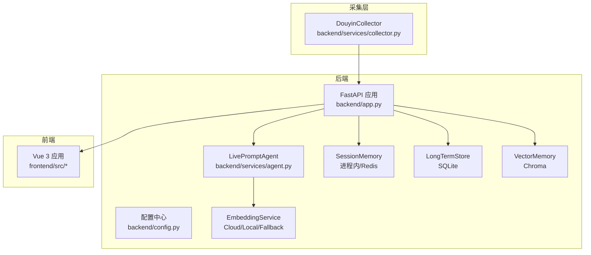
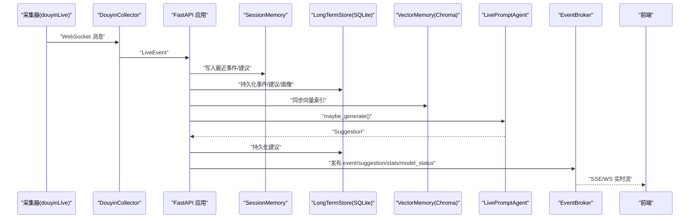
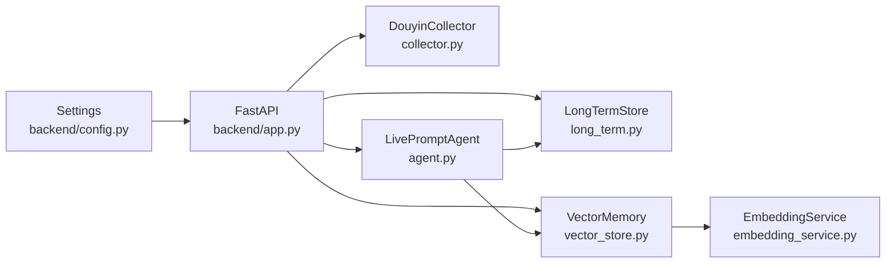

# 集成测试

<cite>
**本文引用的文件**
- [README.md](file://README.md)
- [backend/app.py](file://backend/app.py)
- [backend/config.py](file://backend/config.py)
- [backend/services/collector.py](file://backend/services/collector.py)
- [backend/services/agent.py](file://backend/services/agent.py)
- [backend/memory/vector_store.py](file://backend/memory/vector_store.py)
- [backend/memory/long_term.py](file://backend/memory/long_term.py)
- [tests/test_agent.py](file://tests/test_agent.py)
- [tests/test_embedding_service.py](file://tests/test_embedding_service.py)
- [tests/test_long_term.py](file://tests/test_long_term.py)
- [tests/test_vector_store.py](file://tests/test_vector_store.py)
- [data/DATABASE.md](file://data/DATABASE.md)
- [frontend/src/stores/live.test.mjs](file://frontend/src/stores/live.test.mjs)
- [frontend/src/components/status-strip-presenter.test.mjs](file://frontend/src/components/status-strip-presenter.test.mjs)
- [requirements.txt](file://requirements.txt)
</cite>

## 目录
1. [简介](#简介)
2. [项目结构](#项目结构)
3. [核心组件](#核心组件)
4. [架构总览](#架构总览)
5. [详细组件分析](#详细组件分析)
6. [依赖关系分析](#依赖关系分析)
7. [性能考量](#性能考量)
8. [故障排查指南](#故障排查指南)
9. [结论](#结论)
10. [附录](#附录)

## 简介
本文件面向 DouYin_llm 项目的集成测试，围绕端到端测试的设计思路与实现方法展开，系统性说明后端 API、数据库与实时通信的集成测试策略，并给出测试环境搭建、测试数据准备、性能与压力测试、回归测试、测试自动化与持续集成的实施方案，以及集成测试中的问题诊断与调试技巧。

## 项目结构
项目采用“采集器 + FastAPI 后端 + Vue 3 前端”的三层架构，数据流自下而上依次为：采集器将抖音直播 WebSocket 事件标准化为 LiveEvent，后端进行持久化、记忆抽取、提词生成与实时推送，前端通过 SSE/WS 订阅事件并展示。

图表来源
- [backend/app.py:108-126](file://backend/app.py#L108-L126)
- [backend/config.py:40-113](file://backend/config.py#L40-L113)
- [backend/services/collector.py:38-99](file://backend/services/collector.py#L38-L99)
- [backend/services/agent.py:23-496](file://backend/services/agent.py#L23-L496)
- [backend/memory/vector_store.py:59-317](file://backend/memory/vector_store.py#L59-L317)
- [backend/memory/long_term.py:44-967](file://backend/memory/long_term.py#L44-L967)

章节来源
- [README.md:1-223](file://README.md#L1-L223)
- [backend/app.py:108-126](file://backend/app.py#L108-L126)
- [backend/config.py:40-113](file://backend/config.py#L40-L113)

## 核心组件
- 采集器：负责与本地 douyinLive WebSocket 对接，标准化为 LiveEvent 并投递到后端事件循环。
- 后端应用：提供健康检查、引导数据、房间切换、事件注入、观众画像与笔记、LLM 设置、SSE/WS 实时流等接口。
- 记忆系统：SessionMemory（会话缓存）、LongTermStore（SQLite 长期存储）、VectorMemory（Chroma 向量检索）。
- 提词引擎：LivePromptAgent，结合向量与用户画像生成建议，支持启发式与 LLM 双通道。
- 嵌入服务：EmbeddingService，支持云端、本地与哈希回退。
- 前端：通过 Pinia Store 与组件订阅实时事件流。

章节来源
- [backend/services/collector.py:38-266](file://backend/services/collector.py#L38-L266)
- [backend/app.py:129-285](file://backend/app.py#L129-L285)
- [backend/memory/long_term.py:44-967](file://backend/memory/long_term.py#L44-L967)
- [backend/memory/vector_store.py:59-317](file://backend/memory/vector_store.py#L59-L317)
- [backend/services/agent.py:23-496](file://backend/services/agent.py#L23-L496)
- [tests/test_agent.py:1-176](file://tests/test_agent.py#L1-L176)
- [tests/test_embedding_service.py:1-83](file://tests/test_embedding_service.py#L1-L83)
- [tests/test_long_term.py:1-30](file://tests/test_long_term.py#L1-L30)
- [tests/test_vector_store.py:1-103](file://tests/test_vector_store.py#L1-L103)

## 架构总览
下图展示了从采集到前端展示的完整端到端链路，以及集成测试应覆盖的关键节点。

图表来源
- [backend/services/collector.py:118-266](file://backend/services/collector.py#L118-L266)
- [backend/app.py:73-102](file://backend/app.py#L73-L102)
- [backend/services/agent.py:105-142](file://backend/services/agent.py#L105-L142)
- [backend/memory/vector_store.py:149-317](file://backend/memory/vector_store.py#L149-L317)
- [backend/memory/long_term.py:454-500](file://backend/memory/long_term.py#L454-L500)

## 详细组件分析

### 后端 API 集成测试策略
- 健康检查与引导数据
  - 覆盖 GET /health、GET /api/bootstrap，验证房间状态与初始快照。
- 房间切换与事件注入
  - 覆盖 POST /api/room、POST /api/events，验证切房与事件注入后的快照一致性。
- 观众画像与笔记
  - 覆盖 GET /api/viewer、GET /api/viewer/memories、GET /api/viewer/notes、POST/DELETE /api/viewer/notes，验证数据读写与过滤。
- LLM 设置
  - 覆盖 GET /api/settings/llm、PUT /api/settings/llm，验证模型与系统提示词的持久化。
- 实时流
  - 覆盖 GET /api/events/stream（SSE）与 GET /ws/live（WebSocket），验证事件、建议、统计与模型状态的推送。
- 测试要点
  - 使用 FastAPI 测试客户端或 httpx 客户端发起请求，构造 LiveEvent 与 ViewerNote 请求体，断言响应结构与业务状态。
  - 结合内存与数据库状态校验，确保事件在 SessionMemory、LongTermStore、VectorMemory 的一致性。

章节来源
- [backend/app.py:129-285](file://backend/app.py#L129-L285)
- [README.md:151-166](file://README.md#L151-L166)

### 数据库集成测试策略
- SQLite 表结构与索引
  - 验证 events、viewer_profiles、viewer_gifts、live_sessions、viewer_notes、viewer_memories 等表的创建与索引。
- 事件持久化与会话聚合
  - 验证 persist_event 在首次写入与重建聚合场景下的行为，包括活动会话创建、触摸与画像/礼物聚合更新。
- 观众画像与礼物聚合
  - 验证 _upsert_viewer_profile 与 _upsert_viewer_gift 的 Upsert 逻辑与字段一致性。
- 查询与快照
  - 验证 recent_events、recent_suggestions、stats、snapshot 等查询接口返回的数据完整性。
- 测试要点
  - 使用内存数据库或临时文件数据库进行隔离测试，断言 SQL 查询结果与 Row 工厂返回对象。
  - 结合 data/DATABASE.md 的表结构说明，逐项核对字段与约束。

章节来源
- [backend/memory/long_term.py:63-230](file://backend/memory/long_term.py#L63-L230)
- [backend/memory/long_term.py:310-488](file://backend/memory/long_term.py#L310-L488)
- [backend/memory/long_term.py:501-557](file://backend/memory/long_term.py#L501-L557)
- [data/DATABASE.md:1-151](file://data/DATABASE.md#L1-L151)
- [tests/test_long_term.py:7-30](file://tests/test_long_term.py#L7-L30)

### 向量与嵌入集成测试策略
- 集合命名与嵌入签名
  - 验证 VectorMemory 基于 embedding_signature 的集合命名规则，确保 live_history_* 与 viewer_memories_* 的一致性。
- 事件与记忆向量化
  - 验证 add_event 与 add_memory 将文档与元数据 upsert 到 Chroma，并使用 EmbeddingService 生成向量。
- 相似度检索与排序
  - 验证 similar 与 similar_memories 的阈值过滤、距离到分数转换、重排规则与最终 K 选择。
- 嵌入服务模式
  - 验证 cloud/local/fallback 三种模式的行为差异，断言请求参数与回退向量维度。
- 测试要点
  - 使用 mock chromadb 客户端与 EmbeddingService，断言 upsert 参数与 query 返回值。
  - 针对 fallback 情况断言向量长度与非全零元素。

章节来源
- [backend/memory/vector_store.py:59-317](file://backend/memory/vector_store.py#L59-L317)
- [tests/test_vector_store.py:20-103](file://tests/test_vector_store.py#L20-L103)
- [tests/test_embedding_service.py:23-83](file://tests/test_embedding_service.py#L23-L83)

### 实时通信集成测试策略
- SSE 流
  - 验证 /api/events/stream 在不同 room_id 下的过滤与重试机制，断言事件类型与数据字段。
- WebSocket 流
  - 验证 /ws/live 在连接时下发 bootstrap 快照，并持续推送 event/suggestion/stats/model_status。
- 前端订阅
  - 使用前端 Store 与组件测试验证实时状态呈现与交互，如连接状态徽标、事件列表与建议卡片。
- 测试要点
  - 使用 EventSource 与 WebSocket 客户端模拟前端订阅，断言消息格式与顺序。
  - 结合后端 EventBroker 的队列与订阅机制，验证消息分发的可靠性。

章节来源
- [backend/app.py:252-285](file://backend/app.py#L252-L285)
- [frontend/src/stores/live.test.mjs:1-68](file://frontend/src/stores/live.test.mjs#L1-L68)
- [frontend/src/components/status-strip-presenter.test.mjs:1-50](file://frontend/src/components/status-strip-presenter.test.mjs#L1-L50)

### 提词引擎集成测试策略
- 上下文构建与启发式短路
  - 验证 build_context 的裁剪与合并逻辑，gift/follow 等事件的启发式短路。
- LLM 与启发式双通道
  - 验证 _generate_with_openai_compatible 的请求参数（模型、温度、max_tokens）与错误处理，失败时回退启发式。
- 结果规范化与引用
  - 验证 _normalize_model_payload 的字段校验与归一化，references 去重与保留顺序。
- 测试要点
  - 使用 mock urllib.request 与 chromadb，断言请求体与响应解析。
  - 使用 SimpleNamespace 注入 settings，断言不同模式下的行为差异。

章节来源
- [backend/services/agent.py:83-496](file://backend/services/agent.py#L83-L496)
- [tests/test_agent.py:41-176](file://tests/test_agent.py#L41-L176)

## 依赖关系分析
- 外部依赖
  - websocket-client、fastapi、uvicorn、redis、chromadb。
- 内部耦合
  - app.py 作为装配中心，组合 Collector、Agent、Memory、Broker 等组件。
  - Agent 依赖 VectorMemory 与 LongTermStore，VectorMemory 依赖 EmbeddingService。
- 潜在风险
  - Chroma 不可用时的回退路径（HashEmbeddingFunction）与本地索引。
  - Redis 未配置时 SessionMemory 退化为进程内内存。

图表来源
- [backend/config.py:40-113](file://backend/config.py#L40-L113)
- [backend/app.py:27-35](file://backend/app.py#L27-L35)
- [backend/services/agent.py:23-36](file://backend/services/agent.py#L23-L36)
- [backend/memory/vector_store.py:59-79](file://backend/memory/vector_store.py#L59-L79)

章节来源
- [requirements.txt:1-6](file://requirements.txt#L1-L6)
- [backend/app.py:27-35](file://backend/app.py#L27-L35)

## 性能考量
- SSE/WS 压力测试
  - 使用 locust 或自定义压测脚本，模拟高并发事件注入与实时订阅，观察延迟与丢包率。
- 向量检索性能
  - 针对不同 embedding 模式与查询阈值，评估相似度检索的吞吐与延迟。
- 数据库写入
  - 批量写入 events 与 suggestions，监控 SQLite 写入延迟与索引维护成本。
- LLM 调用
  - 通过代理与限流控制，评估 LLM 调用的 P95/P99 延迟与失败率。
- 回归测试
  - 将性能基线纳入 CI，对关键路径设置阈值告警。

## 故障排查指南
- 采集器异常
  - 检查 ROOM_ID、COLLECTOR_HOST/PORT、ping 间隔与重连延迟配置；查看 Collector 的日志与线程状态。
- 后端接口异常
  - 使用 /health 与 /api/bootstrap 校验房间状态与初始快照；检查 CORS 与生命周期钩子。
- 数据库异常
  - 核对 SQLite journal_mode 与索引；验证 events 表字段补齐与 viewer_profiles 聚合重建。
- 向量检索异常
  - 检查 Chroma 客户端初始化与集合命名；验证 embedding 签名与 fallback 逻辑。
- 实时流异常
  - 校验 EventBroker 订阅与队列；确认 SSE/WS 的过滤与 room_id 匹配。
- 前端订阅异常
  - 校验 Store 初始化、bootstrap 调用与 EventSource/WebSocket 连接状态。

章节来源
- [backend/services/collector.py:118-266](file://backend/services/collector.py#L118-L266)
- [backend/app.py:129-142](file://backend/app.py#L129-L142)
- [backend/memory/long_term.py:49-54](file://backend/memory/long_term.py#L49-L54)
- [backend/memory/vector_store.py:70-84](file://backend/memory/vector_store.py#L70-L84)

## 结论
通过覆盖采集、后端 API、数据库、向量检索与实时通信的端到端测试，可有效保障 DouYin_llm 在多组件协同下的稳定性与正确性。建议将单元测试与集成测试结合，引入性能与压力测试，并在 CI 中固化回归与自动化流程。

## 附录

### 测试环境搭建
- 后端
  - 安装依赖：pip install -r requirements.txt
  - 准备 .env：设置 ROOM_ID、LLM_*、EMBEDDING_*、DATA_DIR 等
  - 启动后端：python -m uvicorn backend.app:app --host 127.0.0.1 --port 8010
- 采集器
  - 启动 tool/douyinLive-windows-amd64.exe，确保 WebSocket 地址与 ROOM_ID 一致
- 前端
  - npm install && npm run dev -- --host 127.0.0.1 --strictPort --port 5173
- 可选依赖
  - Redis（SessionMemory）、Chroma（向量索引）

章节来源
- [README.md:46-94](file://README.md#L46-L94)
- [requirements.txt:1-6](file://requirements.txt#L1-L6)

### 测试数据准备
- LiveEvent 示例
  - 使用 tests/test_agent.py 中的 make_event 构造不同事件类型（评论/礼物/关注）
- 观众笔记
  - 使用 /api/viewer/notes 的 POST/GET/DELETE 接口准备测试数据
- 向量数据
  - 通过 /api/events 注入事件，触发 VectorMemory 同步 upsert
- 数据库快照
  - 使用 data/DATABASE.md 的查询示例验证写入结果

章节来源
- [tests/test_agent.py:23-38](file://tests/test_agent.py#L23-L38)
- [backend/app.py:158-221](file://backend/app.py#L158-L221)
- [data/DATABASE.md:101-151](file://data/DATABASE.md#L101-L151)

### 测试自动化与持续集成
- 单元测试
  - Python：python -m unittest tests.test_agent tests.test_embedding_service tests.test_vector_store tests.test_long_term
  - 前端：node frontend/src/stores/live.test.mjs、status-strip-presenter.test.mjs
- 集成测试
  - 使用 FastAPI TestClient 或 httpx 发起端到端请求，结合临时数据库与 mock 依赖
- CI 配置
  - 在流水线中安装依赖、启动后端与可选依赖、运行测试套件并生成报告

章节来源
- [README.md:180-191](file://README.md#L180-L191)
- [frontend/src/stores/live.test.mjs:1-68](file://frontend/src/stores/live.test.mjs#L1-L68)
- [frontend/src/components/status-strip-presenter.test.mjs:1-50](file://frontend/src/components/status-strip-presenter.test.mjs#L1-L50)