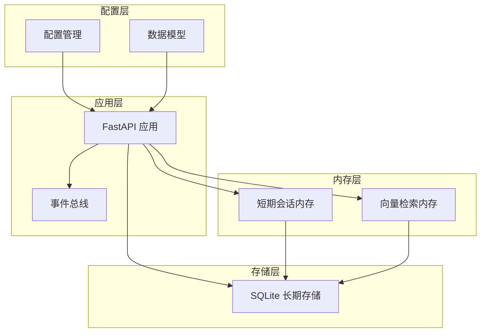
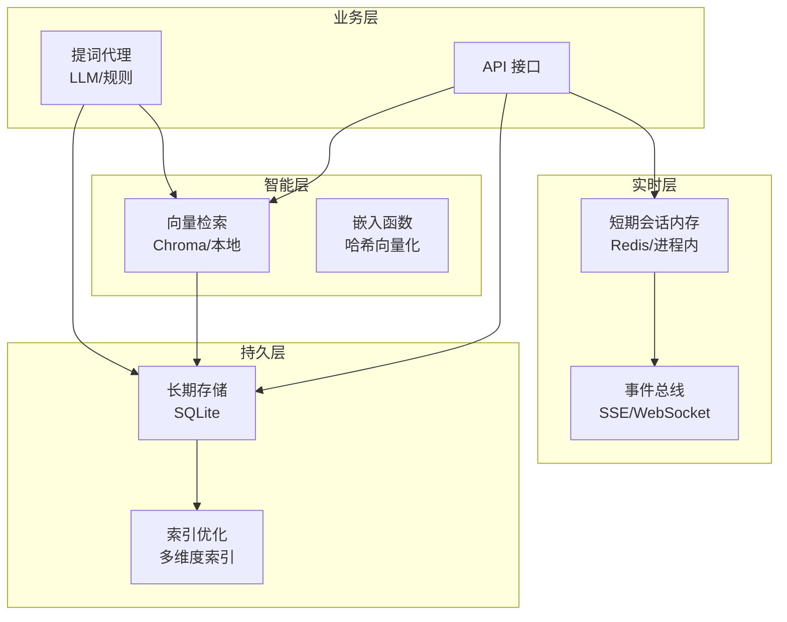
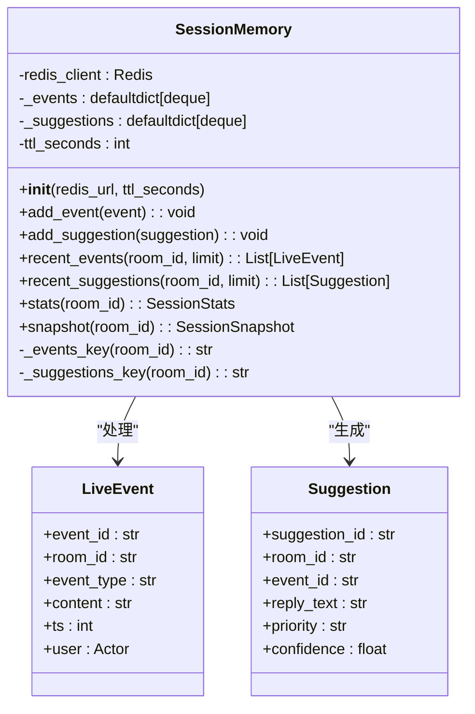
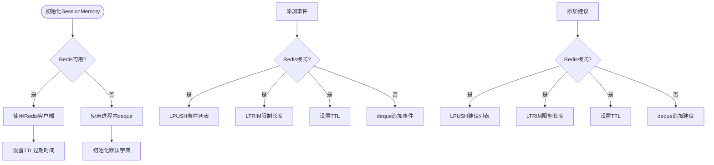
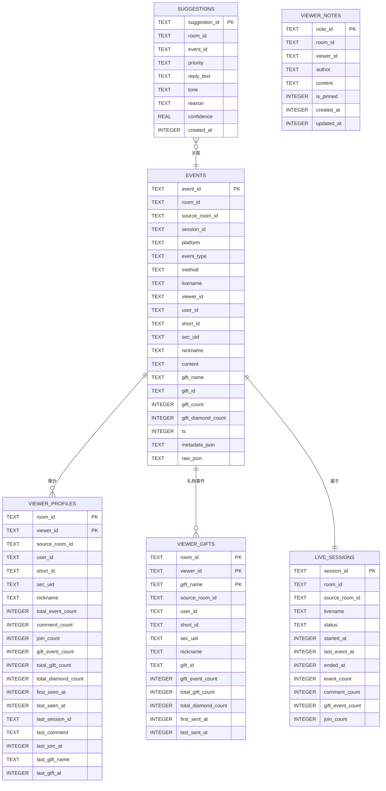
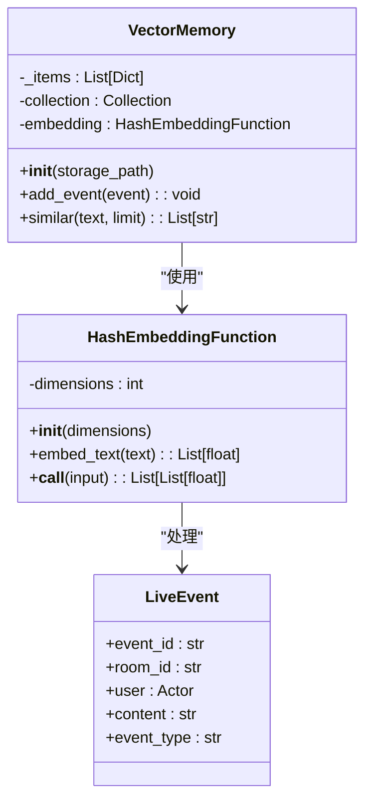
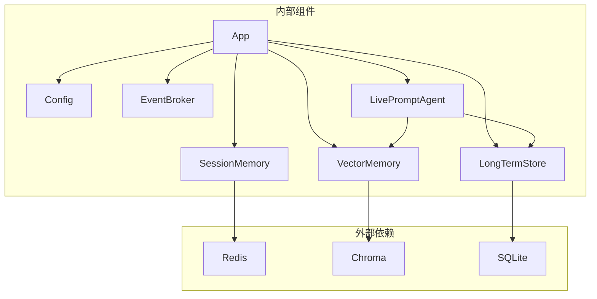
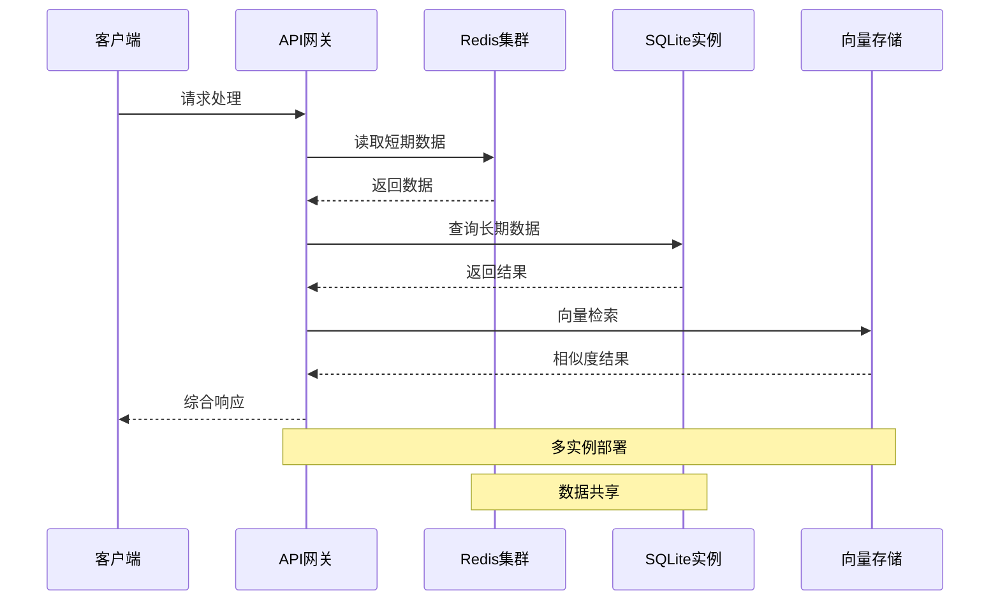

# 内存架构设计

<cite>
**本文档引用的文件**
- [session_memory.py](file://backend/memory/session_memory.py)
- [long_term.py](file://backend/memory/long_term.py)
- [vector_store.py](file://backend/memory/vector_store.py)
- [config.py](file://backend/config.py)
- [live.py](file://backend/schemas/live.py)
- [app.py](file://backend/app.py)
- [agent.py](file://backend/services/agent.py)
- [broker.py](file://backend/services/broker.py)
- [DATABASE.md](file://data/DATABASE.md)
- [requirements.txt](file://requirements.txt)
</cite>

## 目录
1. [简介](#简介)
2. [项目结构](#项目结构)
3. [核心组件](#核心组件)
4. [架构总览](#架构总览)
5. [详细组件分析](#详细组件分析)
6. [依赖关系分析](#依赖关系分析)
7. [性能考量](#性能考量)
8. [故障恢复机制](#故障恢复机制)
9. [扩展性设计](#扩展性设计)
10. [结论](#结论)

## 简介

本项目采用多层内存存储架构设计，通过短期会话内存、长期存储和向量检索三层架构实现高效的数据处理和存储。该架构旨在平衡实时性、持久性和智能化检索需求，为直播场景提供完整的数据管理解决方案。

## 项目结构

项目采用分层架构设计，主要分为以下层次：

**图表来源**
- [app.py:25-29](file://backend/app.py#L25-L29)
- [config.py:39-94](file://backend/config.py#L39-L94)

**章节来源**
- [app.py:1-220](file://backend/app.py#L1-L220)
- [config.py:1-94](file://backend/config.py#L1-L94)

## 核心组件

### 1. 短期会话内存层（SessionMemory）

短期会话内存层负责处理实时性要求极高的数据，采用Redis进程内退化机制确保系统稳定性。

**关键特性：**
- 支持Redis分布式缓存和进程内退化
- 基于时间窗口的事件管理和建议存储
- TTL（生存时间）机制控制数据生命周期
- 房间级别的隔离和并发安全

### 2. 长期存储层（LongTermStore）

长期存储层基于SQLite实现，提供完整的数据持久化和复杂查询能力。

**关键特性：**
- 完整的直播事件流水记录
- 观众画像和礼物历史聚合
- 直播场次管理和状态跟踪
- 多维度索引优化查询性能

### 3. 向量检索层（VectorMemory）

向量检索层提供智能相似度匹配功能，支持Chroma向量数据库和本地退化方案。

**关键特性：**
- Chroma向量数据库集成
- 哈希嵌入函数实现本地退化
- 基于内容的相似度检索
- 文本预处理和向量化

**章节来源**
- [session_memory.py:17-113](file://backend/memory/session_memory.py#L17-L113)
- [long_term.py:36-750](file://backend/memory/long_term.py#L36-L750)
- [vector_store.py:52-108](file://backend/memory/vector_store.py#L52-L108)

## 架构总览

系统采用"实时-持久-智能"三层架构，每层都有明确的职责分工：

**图表来源**
- [app.py:61-78](file://backend/app.py#L61-L78)
- [agent.py:23-37](file://backend/services/agent.py#L23-L37)

## 详细组件分析

### 短期会话内存组件分析

短期会话内存实现了智能的进程内退化机制，确保在Redis不可用时系统仍能正常运行。

#### 类关系图

**图表来源**
- [session_memory.py:17-113](file://backend/memory/session_memory.py#L17-L113)
- [live.py:29-62](file://backend/schemas/live.py#L29-L62)

#### Redis退化机制流程

**图表来源**
- [session_memory.py:11-64](file://backend/memory/session_memory.py#L11-L64)

**章节来源**
- [session_memory.py:1-113](file://backend/memory/session_memory.py#L1-L113)

### 长期存储组件分析

长期存储层基于SQLite实现，提供完整的数据持久化和复杂查询能力。

#### 数据库表结构设计

**图表来源**
- [long_term.py:54-148](file://backend/memory/long_term.py#L54-L148)
- [DATABASE.md:16-151](file://data/DATABASE.md#L16-L151)

#### 查询优化策略

长期存储层采用了多种查询优化技术：

1. **多维度索引设计**
   - `idx_events_room_ts`: 房间+时间戳复合索引
   - `idx_events_room_viewer_ts`: 房间+观众+时间戳复合索引
   - `idx_live_sessions_room_status_last_event`: 活动会话查询优化

2. **动态列管理**
   - 自动检测和添加缺失的列
   - 数据迁移和回填机制
   - 列定义版本控制

3. **事务处理**
   - 原子性操作保证数据一致性
   - 批量操作优化性能

**章节来源**
- [long_term.py:183-195](file://backend/memory/long_term.py#L183-L195)
- [long_term.py:245-276](file://backend/memory/long_term.py#L245-L276)
- [DATABASE.md:1-151](file://data/DATABASE.md#L1-L151)

### 向量检索组件分析

向量检索层提供了智能相似度匹配功能，支持Chroma向量数据库和本地退化方案。

#### 嵌入函数设计

**图表来源**
- [vector_store.py:19-50](file://backend/memory/vector_store.py#L19-L50)
- [vector_store.py:52-108](file://backend/memory/vector_store.py#L52-L108)

#### 相似度检索算法

向量检索层实现了两种检索模式：

1. **Chroma向量检索**
   - 使用嵌入函数将文本转换为向量
   - 基于余弦相似度计算相似度
   - 支持精确的向量匹配

2. **本地退化方案**
   - 基于词频交集的文本相似度
   - 使用哈希函数进行快速向量化
   - 支持中文分词和Unicode字符

**章节来源**
- [vector_store.py:1-108](file://backend/memory/vector_store.py#L1-L108)

## 依赖关系分析

系统采用松耦合的设计，各组件之间通过清晰的接口进行交互。

**图表来源**
- [requirements.txt:1-6](file://requirements.txt#L1-L6)
- [app.py:13-29](file://backend/app.py#L13-L29)

**章节来源**
- [requirements.txt:1-6](file://requirements.txt#L1-L6)
- [app.py:1-220](file://backend/app.py#L1-L220)

## 性能考量

### 数据访问模式优化

1. **读写分离策略**
   - 实时写入：短期会话内存
   - 持久化存储：长期存储
   - 智能查询：向量检索

2. **缓存策略**
   - Redis缓存热点数据
   - 进程内缓存作为退化方案
   - TTL机制控制内存使用

3. **批量处理**
   - SQLite批量插入优化
   - 向量索引批量构建
   - 事件流式处理

### 容量规划

1. **短期内存容量**
   - 事件窗口：120条
   - 建议窗口：40条
   - TTL：4小时

2. **长期存储容量**
   - SQLite文件大小：按事件数量线性增长
   - 索引占用：约20-30%额外空间
   - 备份策略：定期导出重要数据

3. **向量存储容量**
   - Chroma向量维度：64维
   - 单条向量：256字节
   - 本地退化：最多500条历史

### 持久化策略

1. **实时持久化**
   - 事件写入：异步持久化
   - 建议存储：同步持久化
   - 会话管理：自动状态切换

2. **数据备份**
   - SQLite数据库定期备份
   - 向量索引可重建
   - Redis数据可恢复

**章节来源**
- [session_memory.py:18-27](file://backend/memory/session_memory.py#L18-L27)
- [config.py:53-55](file://backend/config.py#L53-L55)

## 故障恢复机制

### 数据备份策略

1. **多层备份**
   - Redis持久化：RDB/AOF
   - SQLite WAL模式：实时日志
   - Chroma文件系统：目录备份

2. **自动恢复**
   - Redis自动重启
   - SQLite事务回滚
   - 向量索引重建

### 负载均衡

1. **Redis集群**
   - 主从复制
   - 分片存储
   - 自动故障转移

2. **应用层扩展**
   - 无状态设计
   - 连接池管理
   - 会话状态共享

### 水平扩展

**图表来源**
- [app.py:61-78](file://backend/app.py#L61-L78)

**章节来源**
- [app.py:84-92](file://backend/app.py#L84-L92)
- [config.py:53-55](file://backend/config.py#L53-L55)

## 扩展性设计

### 微服务架构支持

系统设计支持微服务化部署：

1. **服务拆分**
   - 事件收集服务
   - 数据处理服务
   - 智能生成服务
   - 数据存储服务

2. **接口标准化**
   - RESTful API
   - WebSocket连接
   - SSE流式传输
   - 事件总线

### 容器化部署

1. **Docker支持**
   - 多阶段构建
   - 最小化镜像
   - 健康检查

2. **Kubernetes集成**
   - Pod管理
   - 服务发现
   - 横向扩展
   - 存储卷管理

### 监控和日志

1. **指标收集**
   - 性能指标
   - 错误统计
   - 资源使用

2. **日志管理**
   - 结构化日志
   - 日志轮转
   - 分布式追踪

**章节来源**
- [app.py:94-220](file://backend/app.py#L94-L220)
- [agent.py:23-37](file://backend/services/agent.py#L23-L37)

## 结论

本项目的多层内存架构设计充分考虑了直播场景的实时性、持久性和智能化需求。通过Redis短期会话内存、SQLite长期存储和Chroma向量检索的有机结合，实现了高效的数据处理和存储方案。

### 主要优势

1. **高可用性**：多层退化机制确保系统在任何情况下都能正常运行
2. **高性能**：分层存储优化不同场景的访问模式
3. **可扩展性**：微服务化设计支持水平扩展
4. **智能化**：向量检索提供智能相似度匹配能力

### 技术创新点

1. **智能退化机制**：Redis不可用时自动切换到进程内存储
2. **多维度索引**：针对直播场景优化的复合索引设计
3. **混合检索**：向量检索与传统SQL查询的结合
4. **事件驱动架构**：基于事件总线的解耦设计

该架构为直播场景提供了完整的技术解决方案，既满足了实时性要求，又保证了数据的长期保存和智能检索能力。