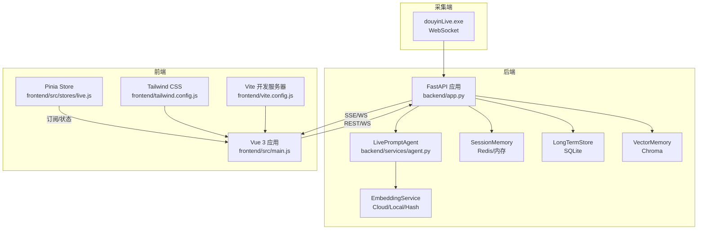
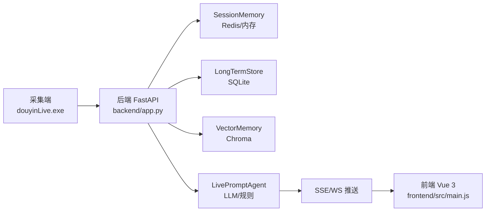
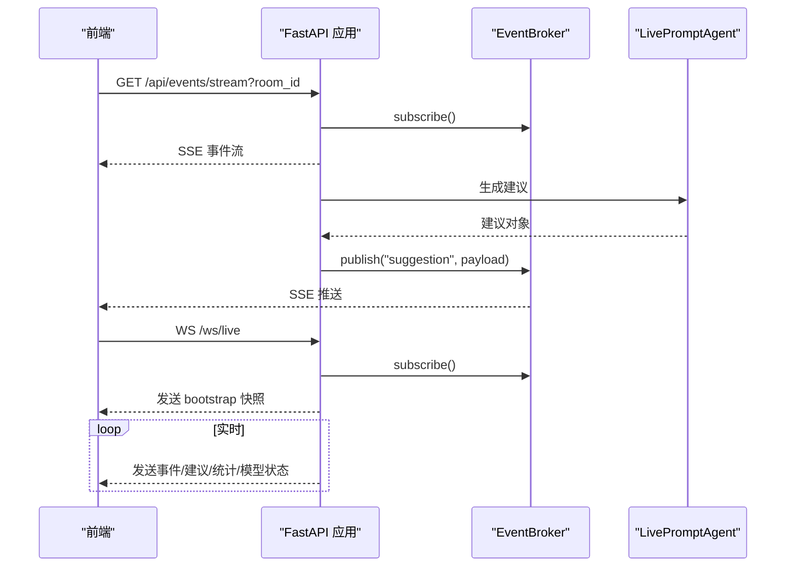
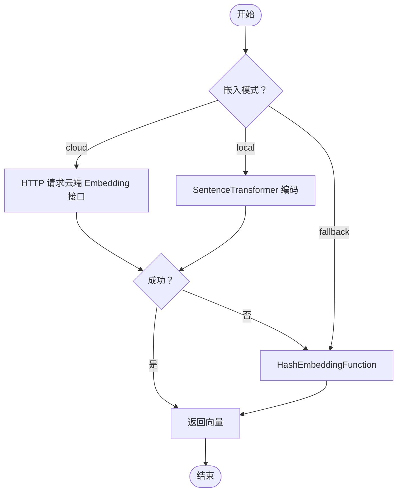
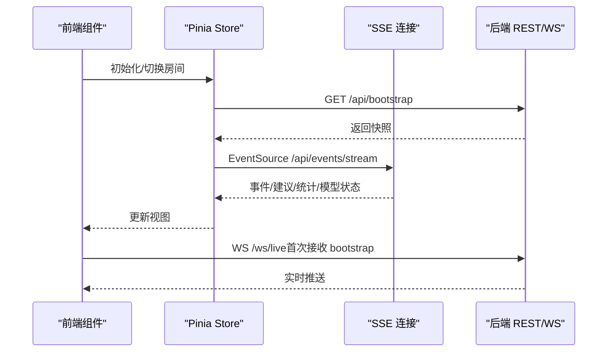
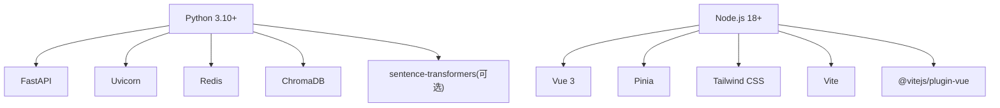

# 技术栈

<cite>
**本文引用的文件**
- [requirements.txt](file://requirements.txt)
- [README.md](file://README.md)
- [USAGE.md](file://USAGE.md)
- [backend/app.py](file://backend/app.py)
- [backend/config.py](file://backend/config.py)
- [backend/memory/embedding_service.py](file://backend/memory/embedding_service.py)
- [backend/memory/vector_store.py](file://backend/memory/vector_store.py)
- [backend/memory/session_memory.py](file://backend/memory/session_memory.py)
- [backend/memory/long_term.py](file://backend/memory/long_term.py)
- [backend/services/agent.py](file://backend/services/agent.py)
- [frontend/package.json](file://frontend/package.json)
- [frontend/src/main.js](file://frontend/src/main.js)
- [frontend/tailwind.config.js](file://frontend/tailwind.config.js)
- [frontend/vite.config.js](file://frontend/vite.config.js)
- [frontend/src/stores/live.js](file://frontend/src/stores/live.js)
</cite>

## 目录
1. [简介](#简介)
2. [项目结构](#项目结构)
3. [核心组件](#核心组件)
4. [架构总览](#架构总览)
5. [详细组件分析](#详细组件分析)
6. [依赖关系分析](#依赖关系分析)
7. [性能考量](#性能考量)
8. [故障排查指南](#故障排查指南)
9. [结论](#结论)
10. [附录](#附录)

## 简介
本技术栈文档面向 DouYin_llm 系统，系统由采集端、FastAPI 后端与 Vue 3 前端构成，围绕抖音直播间的实时事件进行采集、标准化、持久化、语义记忆与提词生成，并通过 SSE 与 WebSocket 实时推送到前端仪表板。技术栈覆盖后端（FastAPI、Pydantic、WebSocket 客户端、Redis、ChromaDB、SQLite）、前端（Vue 3、Pinia、Tailwind CSS、Vite）与数据存储（SQLite、ChromaDB、Redis），并给出版本兼容性、依赖关系、升级策略、对比分析与扩展性维护建议。

## 项目结构
- 后端
  - 应用入口与路由：backend/app.py
  - 配置中心：backend/config.py
  - 记忆与向量：backend/memory/session_memory.py、backend/memory/long_term.py、backend/memory/vector_store.py、backend/memory/embedding_service.py
  - 服务层：backend/services/agent.py
- 前端
  - 包管理与依赖：frontend/package.json
  - 入口与状态：frontend/src/main.js、frontend/src/stores/live.js
  - 样式与主题：frontend/tailwind.config.js
  - 开发与代理：frontend/vite.config.js
- 其他
  - 依赖声明：requirements.txt
  - 顶层说明与运行指南：README.md、USAGE.md

图表来源
- [backend/app.py:108-127](file://backend/app.py#L108-L127)
- [backend/services/agent.py:23-60](file://backend/services/agent.py#L23-L60)
- [backend/memory/session_memory.py:17-31](file://backend/memory/session_memory.py#L17-L31)
- [backend/memory/long_term.py:44-62](file://backend/memory/long_term.py#L44-L62)
- [backend/memory/vector_store.py:59-85](file://backend/memory/vector_store.py#L59-L85)
- [backend/memory/embedding_service.py:18-48](file://backend/memory/embedding_service.py#L18-L48)
- [frontend/src/main.js:6-16](file://frontend/src/main.js#L6-L16)
- [frontend/src/stores/live.js:474-523](file://frontend/src/stores/live.js#L474-L523)
- [frontend/vite.config.js:8-22](file://frontend/vite.config.js#L8-L22)

章节来源
- [README.md:32-44](file://README.md#L32-L44)
- [backend/app.py:108-127](file://backend/app.py#L108-L127)
- [frontend/src/main.js:6-16](file://frontend/src/main.js#L6-L16)

## 核心组件
- 后端核心
  - FastAPI 应用：提供 REST、SSE 与 WebSocket 接口，统一处理事件写入、会话快照、LLM 设置与实时推送。
  - LivePromptAgent：结合向量检索与规则引擎，生成提词建议并上报模型状态。
  - SessionMemory：短期会话缓存，优先 Redis，否则进程内内存，支持 TTL。
  - LongTermStore：SQLite 持久化，维护事件、建议、观众画像、礼物、会话、笔记与记忆。
  - VectorMemory：Chroma 向量索引，支持云端/本地嵌入回退至哈希函数。
  - EmbeddingService：统一云/本地/回退嵌入接口，异常自动降级。
- 前端核心
  - Vue 3 + Pinia：集中管理房间、事件流、筛选、主题、LLM 设置与 Viewer 工作台状态。
  - Tailwind CSS：主题色板与字体定义，支持明暗主题切换。
  - Vite：开发服务器与代理，将 /api 与 /ws 代理到后端 8010 端口。

章节来源
- [backend/app.py:129-285](file://backend/app.py#L129-L285)
- [backend/services/agent.py:23-60](file://backend/services/agent.py#L23-L60)
- [backend/memory/session_memory.py:17-113](file://backend/memory/session_memory.py#L17-L113)
- [backend/memory/long_term.py:44-967](file://backend/memory/long_term.py#L44-L967)
- [backend/memory/vector_store.py:59-317](file://backend/memory/vector_store.py#L59-L317)
- [backend/memory/embedding_service.py:18-102](file://backend/memory/embedding_service.py#L18-L102)
- [frontend/src/main.js:6-16](file://frontend/src/main.js#L6-L16)
- [frontend/src/stores/live.js:75-846](file://frontend/src/stores/live.js#L75-L846)
- [frontend/tailwind.config.js:1-23](file://frontend/tailwind.config.js#L1-L23)
- [frontend/vite.config.js:8-22](file://frontend/vite.config.js#L8-L22)

## 架构总览
系统采用“采集端 → 后端 → 存储/向量 → 前端”的分层架构。采集端将直播事件通过 WebSocket 输入，后端标准化后写入短期会话（Redis/内存）、长期存储（SQLite）与向量索引（Chroma），同时通过 LLM 或启发式规则生成建议，最终通过 SSE/WS 推送至前端。

图表来源
- [README.md:7-17](file://README.md#L7-L17)
- [backend/app.py:108-127](file://backend/app.py#L108-L127)
- [backend/services/agent.py:23-60](file://backend/services/agent.py#L23-L60)
- [frontend/src/main.js:6-16](file://frontend/src/main.js#L6-L16)

## 详细组件分析

### 后端应用与路由（FastAPI）
- 路由职责
  - 健康检查、房间切换、事件注入、观众详情/笔记、LLM 设置、SSE/WS 实时流等。
- 生命周期与中间件
  - 使用 lifespan 管理采集器启停；启用 CORS。
- 实时推送
  - SSE：/api/events/stream，按房间过滤。
  - WebSocket：/ws/live，先下发 bootstrap 快照。

图表来源
- [backend/app.py:252-285](file://backend/app.py#L252-L285)
- [backend/app.py:108-127](file://backend/app.py#L108-L127)
- [backend/services/agent.py:105-142](file://backend/services/agent.py#L105-L142)

章节来源
- [backend/app.py:129-285](file://backend/app.py#L129-L285)

### 配置中心（Settings）
- 配置来源优先级：.env > 环境变量 > 代码默认值。
- 关键配置类别
  - 直播采集：房间号、采集器主机/端口、心跳与重连。
  - 后端进程：监听地址、Session TTL、Redis URL。
  - LLM 与提示词：模式（heuristic/qwen/openai）、Base URL、模型名、API Key、温度、超时、最大 Token。
  - 向量与嵌入：数据目录、SQLite 路径、Chroma 目录、嵌入模式（cloud/local/hash）、本地设备与批大小、相似度阈值与召回参数。
- 解析逻辑：根据模式解析最终 LLM Base URL 与模型名，生成嵌入签名。

章节来源
- [backend/config.py:40-113](file://backend/config.py#L40-L113)

### SessionMemory（短期会话）
- 优先使用 Redis，若不可用则退化为进程内 deque。
- 支持事件与建议的列表写入、裁剪与 TTL。
- 统计计算基于短期窗口。

章节来源
- [backend/memory/session_memory.py:17-113](file://backend/memory/session_memory.py#L17-L113)

### LongTermStore（SQLite 长期存储）
- 表结构：events、suggestions、viewer_profiles、viewer_gifts、live_sessions、viewer_notes、viewer_memories、app_settings。
- 功能：事件/建议持久化、观众画像聚合、礼物统计、会话生命周期、笔记与记忆管理、LLM 设置存储。
- 索引优化：多表多列索引，加速查询。
- 兼容性：Windows 挂载磁盘下调整 journal_mode，提升写入稳定性。

章节来源
- [backend/memory/long_term.py:63-230](file://backend/memory/long_term.py#L63-L230)
- [backend/memory/long_term.py:454-558](file://backend/memory/long_term.py#L454-L558)

### VectorMemory 与 EmbeddingService（向量与嵌入）
- VectorMemory
  - 基于 Chroma 的事件与观众记忆向量索引，支持按房间过滤与相似度召回。
  - 回退逻辑：当 Chroma 不可用时使用内存中的倒排与哈希嵌入函数。
  - 排序与重排：综合相似度、关键词命中、时间戳、置信度与召回次数。
- EmbeddingService
  - 支持 cloud 与 local 两种模式，异常自动降级为哈希嵌入。
  - 本地模式依赖 sentence-transformers，云端模式兼容 OpenAI 兼容接口。

图表来源
- [backend/memory/embedding_service.py:25-102](file://backend/memory/embedding_service.py#L25-L102)
- [backend/memory/vector_store.py:34-57](file://backend/memory/vector_store.py#L34-L57)

章节来源
- [backend/memory/vector_store.py:59-317](file://backend/memory/vector_store.py#L59-L317)
- [backend/memory/embedding_service.py:18-102](file://backend/memory/embedding_service.py#L18-L102)

### LivePromptAgent（LLM/规则双通道）
- 上下文构建：近期事件、相似历史、用户画像、观众记忆。
- 生成策略
  - 若命中特定事件类型或关键词，直接走启发式规则。
  - 否则构造 JSON 提示词，调用 OpenAI 兼容接口；失败则回退到启发式。
- 输出规范化：解析 JSON、校验字段、归一化优先级与置信度。
- 状态上报：记录模式、模型、后端、结果与错误、更新时间。

章节来源
- [backend/services/agent.py:83-142](file://backend/services/agent.py#L83-L142)
- [backend/services/agent.py:200-437](file://backend/services/agent.py#L200-L437)

### 前端应用与状态管理（Vue 3 + Pinia）
- 入口与注册：创建 Vue 应用，注册 Pinia，挂载根组件。
- Store 职责
  - 房间切换、事件过滤、主题切换、模型状态、LLM 设置、Viewer 工作台、笔记 CRUD。
  - SSE 连接与事件解析，按类型分发到事件/建议/统计/模型状态。
- 主题与样式：Tailwind 自定义颜色与字体，支持明暗主题切换。
- 开发代理：将 /api 与 /ws 代理到后端 8010 端口，便于本地联调。

图表来源
- [frontend/src/stores/live.js:440-523](file://frontend/src/stores/live.js#L440-L523)
- [frontend/src/stores/live.js:75-846](file://frontend/src/stores/live.js#L75-L846)
- [frontend/vite.config.js:8-22](file://frontend/vite.config.js#L8-L22)

章节来源
- [frontend/src/main.js:6-16](file://frontend/src/main.js#L6-L16)
- [frontend/src/stores/live.js:75-846](file://frontend/src/stores/live.js#L75-L846)
- [frontend/tailwind.config.js:1-23](file://frontend/tailwind.config.js#L1-L23)
- [frontend/vite.config.js:8-22](file://frontend/vite.config.js#L8-L22)

## 依赖关系分析
- 后端依赖
  - FastAPI、Uvicorn、Pydantic（类型与序列化）、WebSocket 客户端、Redis、ChromaDB、sentence-transformers（可选）。
- 前端依赖
  - Vue 3、Pinia、Tailwind CSS、Vite、@vitejs/plugin-vue。
- 版本与兼容性
  - Python 3.10+（推荐 3.11），Node.js 18+（Vite 4 与原生 ES 模块）。
  - 后端最低版本要求见 requirements.txt。
  - 前端依赖版本见 package.json。
- 升级策略
  - 后端：遵循 requirements.txt 的最小版本约束，逐步升级；对可选依赖（sentence-transformers、redis、chromadb）按需启用并测试。
  - 前端：Vite 与插件版本与 Node 18 兼容；Pinia 与 Vue 3 版本匹配；Tailwind 与 PostCSS 版本保持兼容。
  - 配置与接口：升级前先冻结接口契约，确保 SSE/WS 与 REST 兼容性。

图表来源
- [requirements.txt:1-6](file://requirements.txt#L1-L6)
- [frontend/package.json:11-21](file://frontend/package.json#L11-L21)
- [README.md:48-52](file://README.md#L48-L52)

章节来源
- [requirements.txt:1-6](file://requirements.txt#L1-L6)
- [frontend/package.json:11-21](file://frontend/package.json#L11-L21)
- [README.md:48-52](file://README.md#L48-L52)

## 性能考量
- 实时性
  - SSE/WS 推送降低延迟，前端按房间过滤减少无关数据。
  - SessionMemory 使用 Redis/内存队列，限制窗口长度，避免内存膨胀。
- 向量化检索
  - Chroma 查询与本地回退均支持相似度阈值与召回上限，避免过度扫描。
  - 本地嵌入批大小可调，平衡吞吐与延迟。
- LLM 调用
  - 超时与回退策略确保稳定性；失败时自动切换启发式规则。
- 存储与索引
  - SQLite 索引覆盖高频查询；Chroma 作为可选加速层，不启用时仍可运行。

[本节为通用性能讨论，无需具体文件引用]

## 故障排查指南
- 前端无法连接
  - 检查 Vite 代理是否指向后端 8010 端口；确认 /api 与 /ws 代理配置。
- 页面无建议
  - 确认采集器已启动且房间号正确；查看后端日志是否连接到 WebSocket。
- 模型状态为 fallback/heuristic
  - 检查 LLM_MODE、API Key、网络连通性与超时设置；必要时切换为 heuristic 模式验证链路。
- 数据未写入
  - 确认采集器与后端均已启动；查看 SQLite 文件是否存在与可写。

章节来源
- [frontend/vite.config.js:8-22](file://frontend/vite.config.js#L8-L22)
- [USAGE.md:198-240](file://USAGE.md#L198-L240)

## 结论
该技术栈以 FastAPI 为核心，结合 Redis、Chroma 与 SQLite 形成“短期缓存 + 长期存储 + 向量检索”的数据层，前端通过 Pinia 与 SSE/WS 实时联动，整体具备良好的实时性、可维护性与可扩展性。建议在生产环境中引入鉴权、可观测性与多房间调度能力，并持续评估 LLM 参数与规则策略以提升建议质量。

[本节为总结性内容，无需具体文件引用]

## 附录

### 技术栈选型与对比
- 后端
  - FastAPI：高性能异步、自动生成 OpenAPI 文档、Pydantic 类型安全。
  - WebSocket 客户端：满足实时双向通信需求。
  - Redis：可选共享短期会话，提升横向扩展能力。
  - ChromaDB：嵌入向量检索，云端/本地可选，失败回退至哈希嵌入。
  - SQLite：轻量可靠，满足中小规模直播数据持久化。
- 前端
  - Vue 3：组合式 API、响应式系统、生态成熟。
  - Pinia：轻量状态管理，易于测试与维护。
  - Tailwind CSS：原子化样式，主题定制灵活。
  - Vite：快速开发与构建，代理简化联调。
- 替代方案
  - 向量库：Pinecone、Weaviate、FAISS（取决于部署与性能需求）。
  - 缓存：Memcached、etcd（视团队熟悉度与运维条件）。
  - 前端：React + Zustand、SolidJS + Store（生态与性能权衡）。
  - 服务端：Tornado、Quart（异步生态选择）。

[本节为概念性对比，无需具体文件引用]

### 版本兼容性与升级策略
- Python
  - 建议使用 3.11，兼容 requirements.txt 中的最低版本。
  - 升级时逐项验证可选依赖（redis、chromadb、sentence-transformers）。
- Node.js
  - 18+ 与 Vite 4 兼容；升级前先在 CI 中验证构建与代理。
- FastAPI/Uvicorn
  - 严格遵循 requirements.txt 的最小版本；重大版本升级需回归测试 SSE/WS 与接口契约。
- 前端生态
  - Vue 3 与 Pinia 版本需匹配；Tailwind 与 PostCSS 版本保持兼容；Vite 插件版本随主版本同步。

章节来源
- [requirements.txt:1-6](file://requirements.txt#L1-6)
- [frontend/package.json:11-21](file://frontend/package.json#L11-L21)
- [README.md:48-52](file://README.md#L48-L52)