# 数据流分析

<cite>
**本文引用的文件**
- [backend/app.py](file://backend/app.py)
- [backend/services/collector.py](file://backend/services/collector.py)
- [backend/services/broker.py](file://backend/services/broker.py)
- [backend/memory/session_memory.py](file://backend/memory/session_memory.py)
- [backend/memory/vector_store.py](file://backend/memory/vector_store.py)
- [backend/memory/long_term.py](file://backend/memory/long_term.py)
- [backend/services/agent.py](file://backend/services/agent.py)
- [backend/services/memory_extractor.py](file://backend/services/memory_extractor.py)
- [backend/memory/embedding_service.py](file://backend/memory/embedding_service.py)
- [backend/schemas/live.py](file://backend/schemas/live.py)
- [backend/config.py](file://backend/config.py)
- [data/DATABASE.md](file://data/DATABASE.md)
- [README.md](file://README.md)
- [frontend/src/stores/live.js](file://frontend/src/stores/live.js)
</cite>

## 目录
1. [简介](#简介)
2. [项目结构](#项目结构)
3. [核心组件](#核心组件)
4. [架构总览](#架构总览)
5. [详细组件分析](#详细组件分析)
6. [依赖关系分析](#依赖关系分析)
7. [性能考量](#性能考量)
8. [故障排查指南](#故障排查指南)
9. [结论](#结论)
10. [附录](#附录)

## 简介
本文件对 DouYin_llm 系统的数据流进行深入分析，覆盖从直播事件采集、事件标准化、内存管理、数据库持久化、智能提词生成，到前端推送的完整链路。重点说明数据在不同存储介质之间的迁移与转换过程，包括数据格式、数据完整性与一致性策略，并对比实时数据处理与批量数据处理的差异。

## 项目结构
系统采用三层架构：采集层（本地可执行文件）、后端（FastAPI + 多存储 + LLM）、前端（Vue 3 + Pinia Store）。数据从采集器经 Collector 标准化为 LiveEvent，随后进入后端处理管线，分别写入短期内存、长期数据库与向量索引，并通过 SSE/WebSocket 推送至前端。

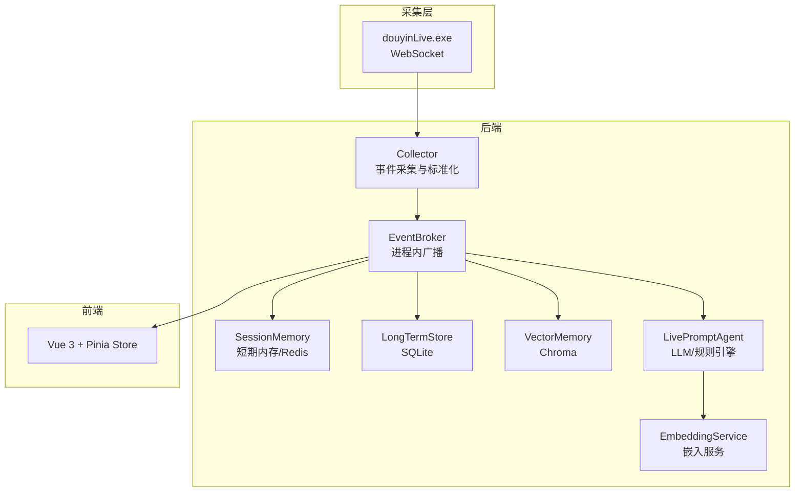

图表来源
- [README.md:7-17](file://README.md#L7-L17)
- [backend/app.py:27-35](file://backend/app.py#L27-L35)
- [backend/services/collector.py:145-159](file://backend/services/collector.py#L145-L159)
- [backend/services/broker.py:28](file://backend/services/broker.py#L28)

章节来源
- [README.md:32-44](file://README.md#L32-L44)

## 核心组件
- 采集器（DouyinCollector）：从本地 WebSocket 接收原始直播事件，标准化为 LiveEvent，并提交到后端事件循环。
- 事件总线（EventBroker）：在后端内部广播事件，供 SSE/WebSocket 订阅。
- 短期内存（SessionMemory）：优先使用 Redis 存储最近事件与建议，否则使用进程内内存，保证热数据可用性。
- 长期存储（LongTermStore）：基于 SQLite 的持久化层，维护事件、观众画像、礼物聚合、直播会话、建议与观众记忆。
- 向量存储（VectorMemory）：基于 Chroma 的语义检索，支持事件与观众记忆的相似度召回。
- 嵌入服务（EmbeddingService）：支持本地/云端嵌入模型，失败时回退到哈希嵌入函数。
- 提词代理（LivePromptAgent）：根据事件类型与上下文选择 LLM 或启发式规则生成建议。
- 数据模型（schemas/live.py）：定义 LiveEvent、Suggestion、ViewerMemory、SessionStats、ModelStatus 等核心数据结构。

章节来源
- [backend/services/collector.py:38-266](file://backend/services/collector.py#L38-L266)
- [backend/services/broker.py:10-40](file://backend/services/broker.py#L10-L40)
- [backend/memory/session_memory.py:17-113](file://backend/memory/session_memory.py#L17-L113)
- [backend/memory/long_term.py:44-967](file://backend/memory/long_term.py#L44-L967)
- [backend/memory/vector_store.py:59-317](file://backend/memory/vector_store.py#L59-L317)
- [backend/memory/embedding_service.py:18-102](file://backend/memory/embedding_service.py#L18-L102)
- [backend/services/agent.py:23-496](file://backend/services/agent.py#L23-L496)
- [backend/schemas/live.py:8-111](file://backend/schemas/live.py#L8-L111)

## 架构总览
系统数据流自下而上分为四层：
- 采集层：douyinLive.exe 通过 WebSocket 输出原始事件。
- 标准化层：Collector 将原始消息映射为 LiveEvent，补充观众 ID、礼物元数据等。
- 处理层：后端统一处理事件，写入短期内存、长期数据库与向量索引，同时生成提词建议并通过事件总线广播。
- 展示层：前端通过 SSE/WebSocket 订阅事件流，渲染状态条、提词卡、事件流与观众工作台。

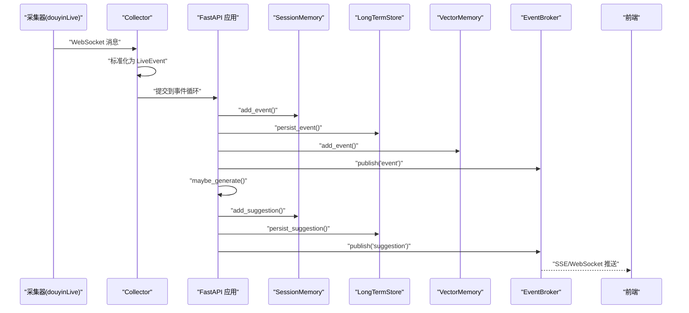

图表来源
- [backend/services/collector.py:145-159](file://backend/services/collector.py#L145-L159)
- [backend/app.py:73-102](file://backend/app.py#L73-L102)
- [backend/services/broker.py:28](file://backend/services/broker.py#L28)
- [frontend/src/stores/live.js:482-515](file://frontend/src/stores/live.js#L482-L515)

## 详细组件分析

### 采集与标准化（DouyinCollector）
- 输入：来自本地 WebSocket 的原始直播消息。
- 标准化逻辑：根据 method 映射事件类型，提取用户信息、礼物元数据，构造 LiveEvent。
- 错误处理：忽略非 JSON 消息，异常记录日志，保证采集器持续运行。
- 线程模型：独立线程维护 WebSocket 连接，断线自动重连，支持切换房间。

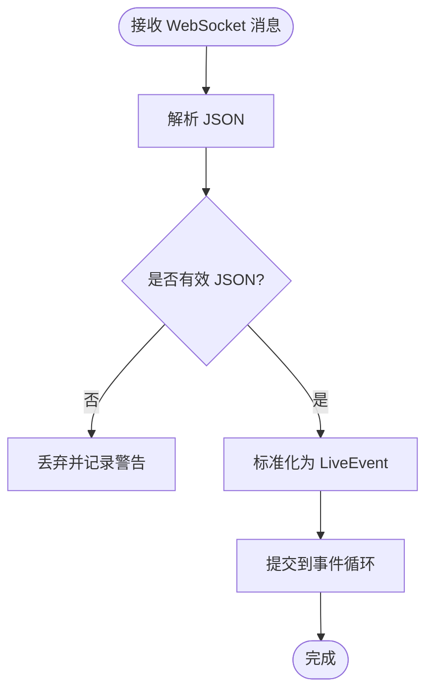

图表来源
- [backend/services/collector.py:145-159](file://backend/services/collector.py#L145-L159)
- [backend/services/collector.py:207-266](file://backend/services/collector.py#L207-L266)

章节来源
- [backend/services/collector.py:38-266](file://backend/services/collector.py#L38-L266)

### 事件处理与广播（FastAPI 应用）
- 事件处理流程：写入短期内存、持久化到 SQLite、写入向量索引，然后通过事件总线广播事件、建议与统计。
- 房间切换：关闭当前活动会话，切换采集器房间，返回最新快照。
- 接口能力：健康检查、房间切换、事件注入、观众画像与笔记查询、LLM 设置管理、SSE 与 WebSocket 实时流。

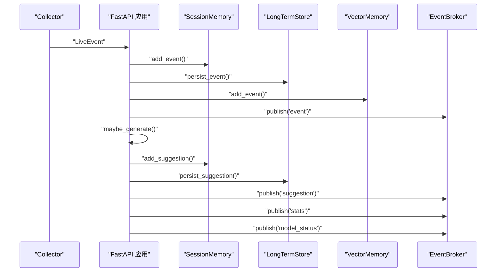

图表来源
- [backend/app.py:73-102](file://backend/app.py#L73-L102)
- [backend/services/broker.py:28](file://backend/services/broker.py#L28)

章节来源
- [backend/app.py:105-285](file://backend/app.py#L105-L285)

### 短期内存（SessionMemory）
- 存储介质：优先 Redis（lpush/ltrim/expire），否则进程内 deque。
- 数据结构：按房间维护事件与建议的固定长度队列。
- 查询与统计：基于最近窗口计算轻量统计（事件总数、各类事件计数）。

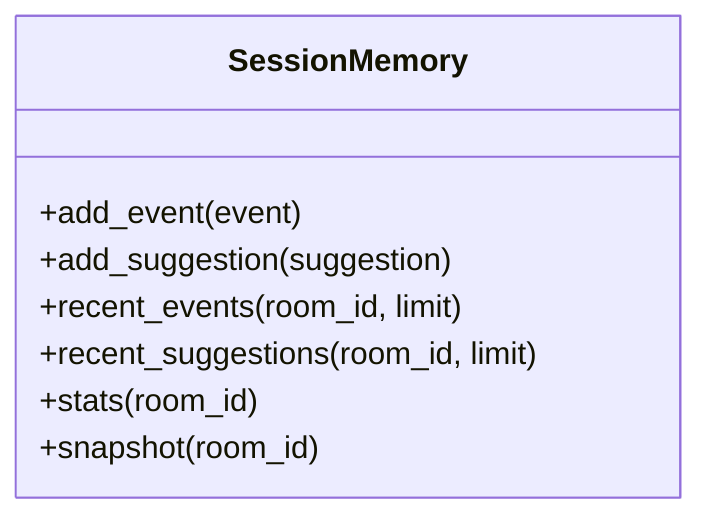

图表来源
- [backend/memory/session_memory.py:17-113](file://backend/memory/session_memory.py#L17-L113)

章节来源
- [backend/memory/session_memory.py:17-113](file://backend/memory/session_memory.py#L17-L113)

### 长期存储（LongTermStore）
- 存储介质：SQLite，包含 events、viewer_profiles、viewer_gifts、live_sessions、viewer_notes、viewer_memories、suggestions、app_settings 等表。
- 写入策略：事件写入时自动维护活动会话、观众画像与礼物聚合；建议与观众记忆单独写入。
- 查询能力：最近事件/建议、统计、观众画像与历史、笔记、记忆列表等。
- 一致性：通过事务与 ON CONFLICT/INSERT OR REPLACE 保证幂等写入。

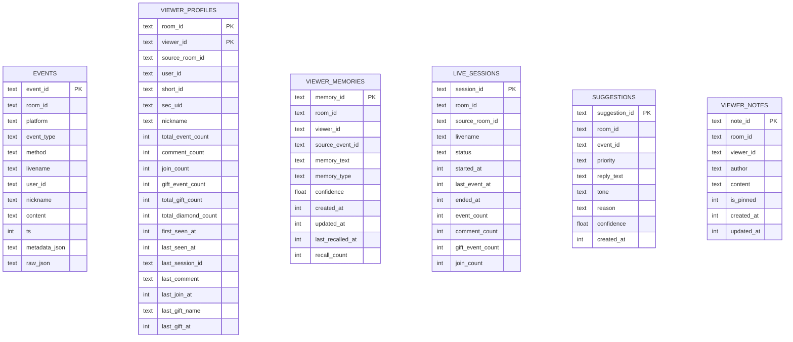

图表来源
- [data/DATABASE.md:16-151](file://data/DATABASE.md#L16-L151)
- [backend/memory/long_term.py:63-187](file://backend/memory/long_term.py#L63-L187)

章节来源
- [backend/memory/long_term.py:44-967](file://backend/memory/long_term.py#L44-L967)
- [data/DATABASE.md:1-151](file://data/DATABASE.md#L1-L151)

### 向量存储与嵌入（VectorMemory + EmbeddingService）
- 向量存储：基于 Chroma 的 Collection，支持事件与观众记忆的 upsert 与 query。
- 嵌入服务：支持本地（SentenceTransformer）与云端（OpenAI 兼容）嵌入，失败回退到哈希嵌入函数。
- 相似度检索：支持按房间过滤、阈值筛选与排序重排，提供事件与记忆的语义召回。

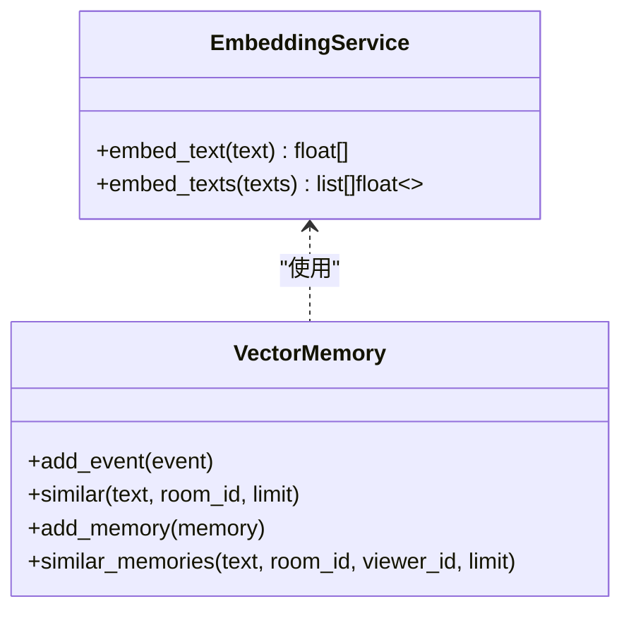

图表来源
- [backend/memory/embedding_service.py:18-102](file://backend/memory/embedding_service.py#L18-L102)
- [backend/memory/vector_store.py:59-317](file://backend/memory/vector_store.py#L59-L317)

章节来源
- [backend/memory/embedding_service.py:18-102](file://backend/memory/embedding_service.py#L18-L102)
- [backend/memory/vector_store.py:59-317](file://backend/memory/vector_store.py#L59-L317)

### 提词生成（LivePromptAgent）
- 上下文构建：结合最近事件、相似历史、观众画像与观众记忆，生成提示词上下文。
- 生成策略：优先尝试 LLM（OpenAI 兼容），失败或命中特定关键词时回退启发式规则。
- 结果落盘：生成的建议写入短期内存与长期数据库，并通过事件总线广播。

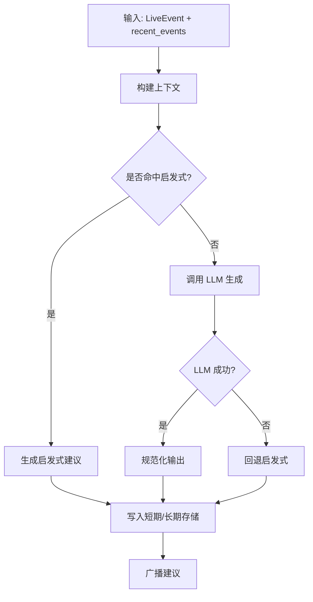

图表来源
- [backend/services/agent.py:83-142](file://backend/services/agent.py#L83-L142)
- [backend/services/agent.py:200-437](file://backend/services/agent.py#L200-L437)

章节来源
- [backend/services/agent.py:23-496](file://backend/services/agent.py#L23-L496)

### 观众记忆抽取（ViewerMemoryExtractor）
- 触发条件：仅对评论事件进行抽取。
- 抽取规则：清洗文本、过滤低信号内容、识别记忆类型（偏好/计划/背景/事实）、计算置信度。
- 输出：候选记忆项（memory_text、memory_type、confidence）。

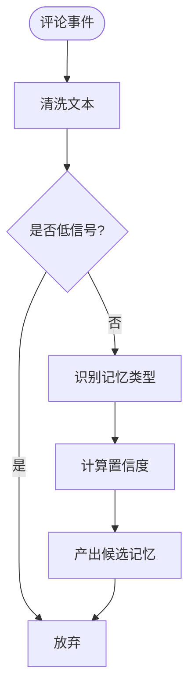

图表来源
- [backend/services/memory_extractor.py:62-118](file://backend/services/memory_extractor.py#L62-L118)

章节来源
- [backend/services/memory_extractor.py:62-118](file://backend/services/memory_extractor.py#L62-L118)

### 前端推送（SSE/WebSocket）
- SSE：后端通过 /api/events/stream 持续推送事件、建议、统计与模型状态。
- WebSocket：后端通过 /ws/live 推送，先下发 bootstrap 快照。
- 前端订阅：前端 Store 使用 EventSource 订阅事件，解析并更新本地状态。

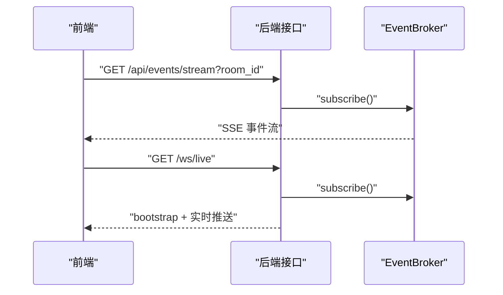

图表来源
- [backend/app.py:252-285](file://backend/app.py#L252-L285)
- [frontend/src/stores/live.js:482-515](file://frontend/src/stores/live.js#L482-L515)

章节来源
- [backend/app.py:252-285](file://backend/app.py#L252-L285)
- [frontend/src/stores/live.js:482-515](file://frontend/src/stores/live.js#L482-L515)

## 依赖关系分析
- 组件耦合：FastAPI 应用集中协调各存储与代理，EventBroker 作为进程内广播中心，降低耦合度。
- 外部依赖：Redis（可选）、Chroma（可选）、SQLite（必需）、OpenAI/DashScope 兼容服务（可选）。
- 循环依赖：未发现循环导入或循环依赖。

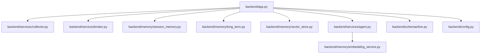

图表来源
- [backend/app.py:13-35](file://backend/app.py#L13-L35)
- [backend/services/agent.py:23-27](file://backend/services/agent.py#L23-L27)
- [backend/memory/embedding_service.py:18-23](file://backend/memory/embedding_service.py#L18-L23)

章节来源
- [backend/app.py:13-35](file://backend/app.py#L13-L35)

## 性能考量
- 实时性：Collector 在独立线程中接收消息，通过 asyncio.run_coroutine_threadsafe 提交到事件循环，避免阻塞网络 I/O。
- 缓存与索引：SessionMemory 使用 Redis 或进程内队列，VectorMemory 使用 Chroma，减少重复计算与 IO。
- 降级策略：当 Redis 不可用时自动退化为内存；当 Chroma 不可用时使用内存回退索引；嵌入服务失败回退到哈希嵌入。
- 批量与并发：SQLite 写入采用事务与幂等写入策略，避免重复；向量插入使用 upsert，支持并发写入。

## 故障排查指南
- 采集器断连：检查 COLLECTOR_HOST/PORT、ROOM_ID 与网络连通性；查看 Collector 日志中的重连与错误信息。
- SSE/WebSocket 无法连接：确认 APP_HOST/PORT 与防火墙设置；检查 /health 与 /api/events/stream、/ws/live 的可达性。
- Redis/Chroma 不可用：确认环境变量与路径；Redis 仅影响 SessionMemory；Chroma 仅影响向量检索。
- LLM 生成失败：检查 LLM_MODE、LLM_BASE_URL、LLM_MODEL、LLM_API_KEY；查看 Agent 的错误状态与回退日志。
- 数据不一致：核对 SQLite 表结构与索引；必要时重建向量索引或回填缺失字段。

章节来源
- [backend/services/collector.py:100-140](file://backend/services/collector.py#L100-L140)
- [backend/services/agent.py:302-437](file://backend/services/agent.py#L302-L437)
- [backend/memory/long_term.py:183-187](file://backend/memory/long_term.py#L183-L187)

## 结论
DouYin_llm 系统通过清晰的数据流分层与多存储协同，实现了从直播事件采集到智能提词生成与前端推送的全链路闭环。短期内存保证实时交互体验，长期数据库提供可追溯与可分析能力，向量索引支撑语义检索与个性化建议。系统具备良好的可配置性与降级能力，适合在本地或受控环境中进行直播提词辅助。

## 附录

### 数据字典
- LiveEvent：标准化后的直播事件，包含事件 ID、房间 ID、平台、事件类型、方法、时间戳、用户信息、内容与元数据。
- Suggestion：提词建议，包含建议 ID、房间 ID、事件 ID、优先级、回复文本、语气、原因、置信度与来源。
- ViewerMemory：观众记忆，包含记忆 ID、房间 ID、观众 ID、来源事件 ID、记忆文本、类型、置信度与时间戳。
- SessionStats：房间统计，包含事件总数与各类事件计数。
- ModelStatus：模型状态，包含模式、模型名、后端、最后结果、错误信息与更新时间。

章节来源
- [backend/schemas/live.py:29-111](file://backend/schemas/live.py#L29-L111)

### 实时 vs 批量处理差异
- 实时处理：Collector 接收 WebSocket 消息后立即标准化并提交到事件循环，随后写入短期内存、长期数据库与向量索引，并通过事件总线广播，延迟低、吞吐高。
- 批量处理：LongTermStore 在事件写入时维护活动会话与观众画像聚合，部分聚合逻辑在事件变更时触发重建，适合离线分析与报表场景。

章节来源
- [backend/services/collector.py:118-159](file://backend/services/collector.py#L118-L159)
- [backend/memory/long_term.py:438-454](file://backend/memory/long_term.py#L438-L454)