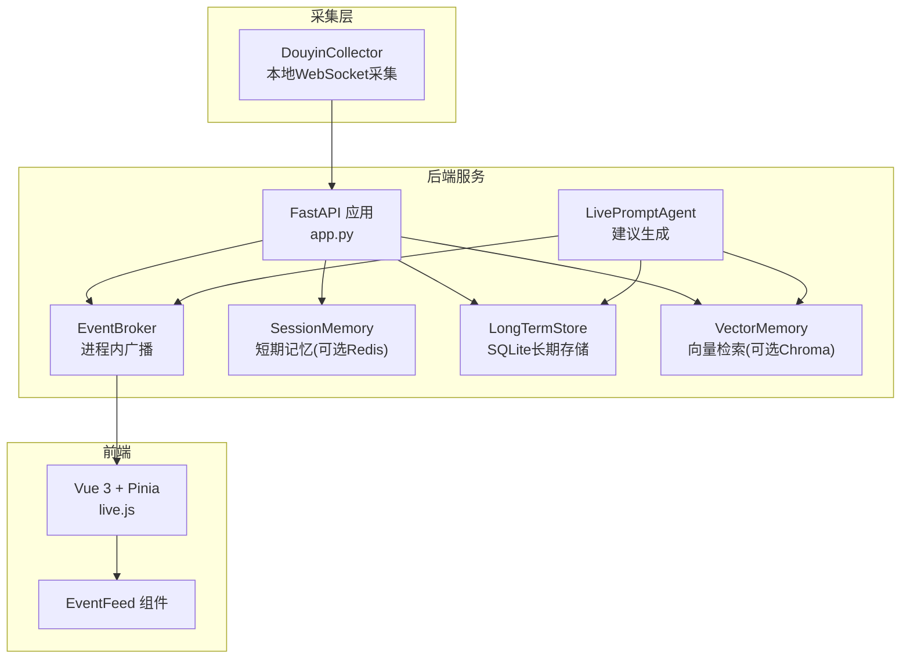
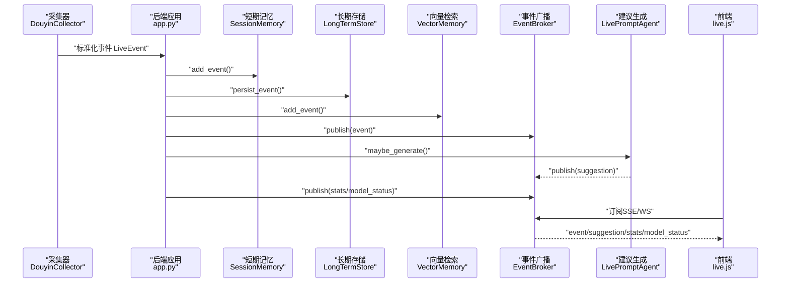
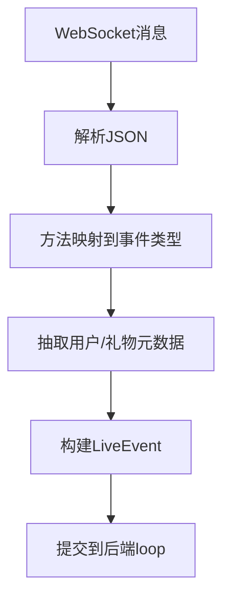
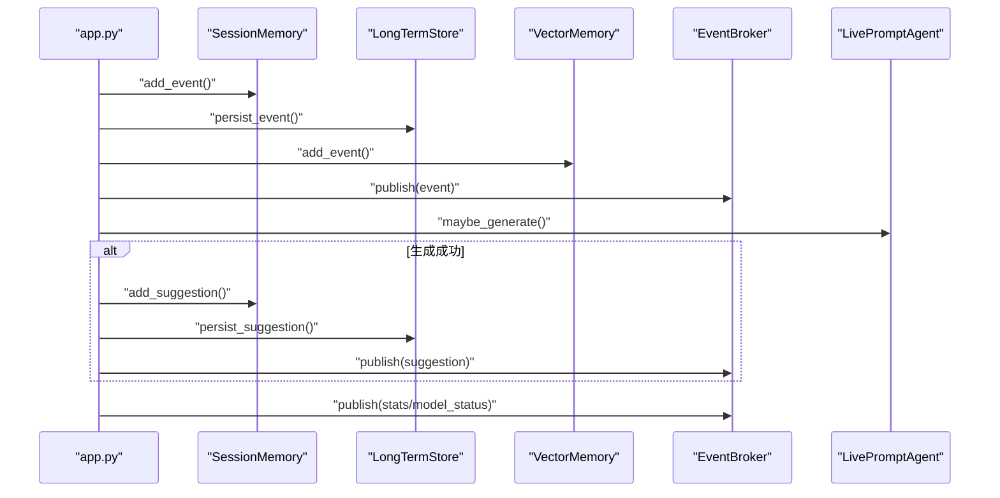
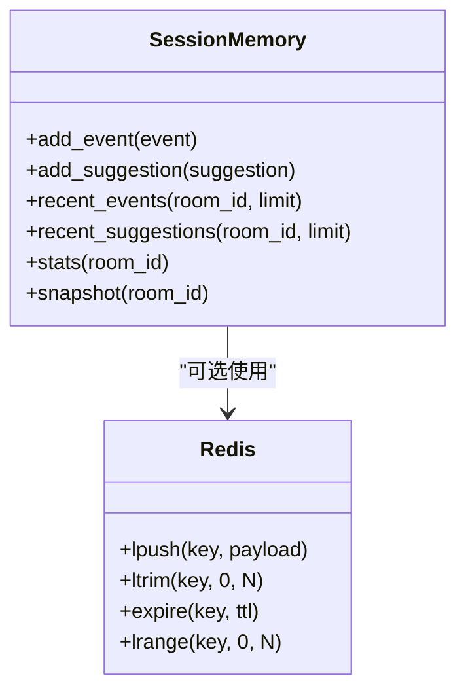
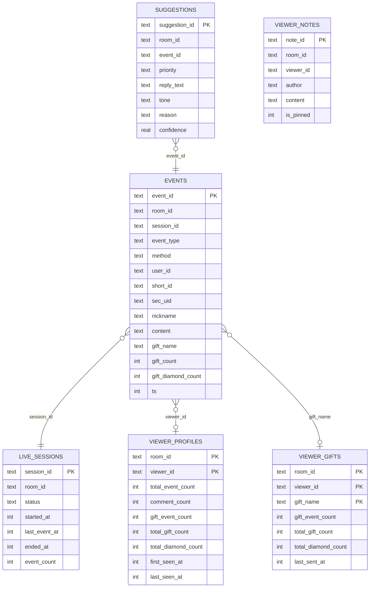
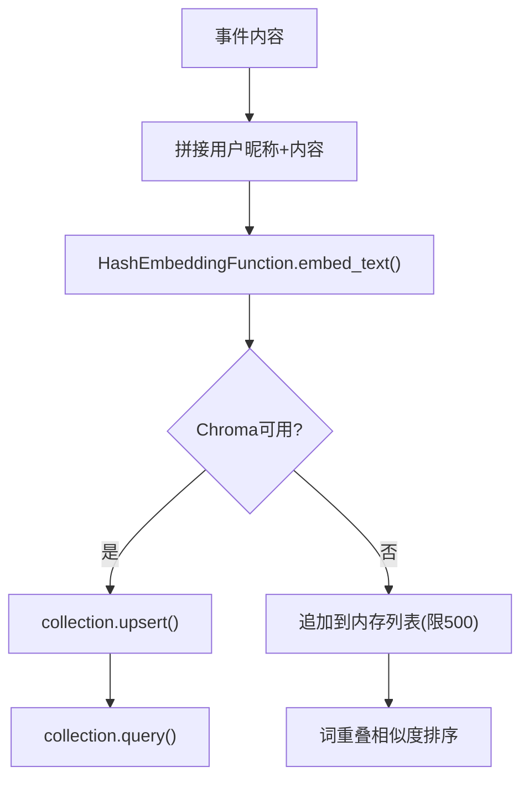
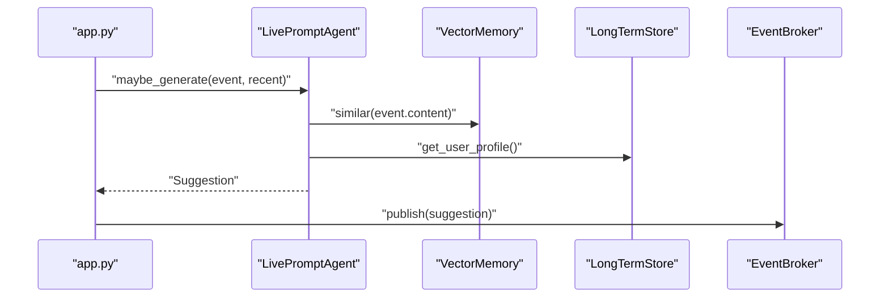
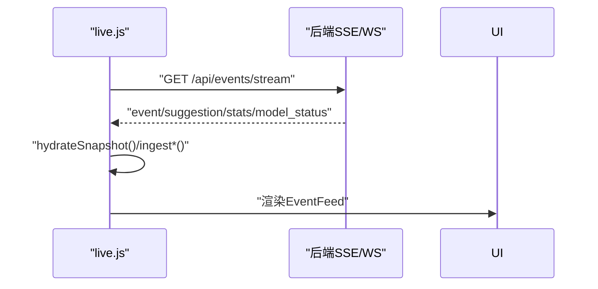
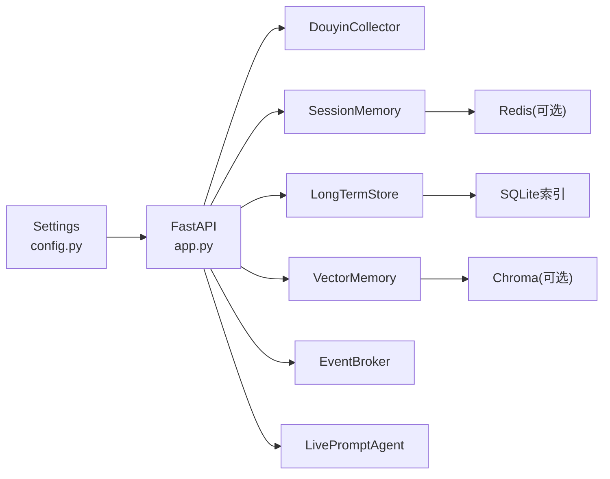

# 数据流架构

<cite>
**本文引用的文件**
- [backend/app.py](file://backend/app.py)
- [backend/config.py](file://backend/config.py)
- [backend/services/collector.py](file://backend/services/collector.py)
- [backend/services/broker.py](file://backend/services/broker.py)
- [backend/services/agent.py](file://backend/services/agent.py)
- [backend/memory/session_memory.py](file://backend/memory/session_memory.py)
- [backend/memory/vector_store.py](file://backend/memory/vector_store.py)
- [backend/memory/long_term.py](file://backend/memory/long_term.py)
- [backend/schemas/live.py](file://backend/schemas/live.py)
- [frontend/src/stores/live.js](file://frontend/src/stores/live.js)
- [frontend/src/components/EventFeed.vue](file://frontend/src/components/EventFeed.vue)
- [data/DATABASE.md](file://data/DATABASE.md)
- [README.md](file://README.md)
- [requirements.txt](file://requirements.txt)
</cite>

## 目录
1. [简介](#简介)
2. [项目结构](#项目结构)
3. [核心组件](#核心组件)
4. [架构总览](#架构总览)
5. [详细组件分析](#详细组件分析)
6. [依赖分析](#依赖分析)
7. [性能考量](#性能考量)
8. [故障排查指南](#故障排查指南)
9. [结论](#结论)
10. [附录](#附录)

## 简介
本文件聚焦“数据流架构”，系统性梳理从抖音采集器的数据输入，到事件标准化、短期/长期/向量记忆、AI建议生成，再到前端实时展示的完整链路。重点包括：
- 数据在 Redis 短期记忆、SQLite 长期存储、Chroma 向量检索中的分布与职责
- 数据一致性保障机制（幂等写入、会话聚合、索引设计）
- 性能优化策略（缓存策略、索引设计、查询优化）

## 项目结构
后端采用 FastAPI 提供 REST/SSE/WebSocket 接口，前端使用 Vue 3 + Pinia 实时消费事件流。核心模块围绕“采集 → 标准化 → 广播 → 记忆 → 建议 → 展示”的闭环展开。

图表来源
- [backend/app.py:84-220](file://backend/app.py#L84-L220)
- [backend/services/collector.py:38-284](file://backend/services/collector.py#L38-L284)
- [backend/services/broker.py:10-40](file://backend/services/broker.py#L10-L40)
- [backend/memory/session_memory.py:17-113](file://backend/memory/session_memory.py#L17-L113)
- [backend/memory/long_term.py:36-750](file://backend/memory/long_term.py#L36-L750)
- [backend/memory/vector_store.py:52-108](file://backend/memory/vector_store.py#L52-L108)
- [backend/services/agent.py:23-393](file://backend/services/agent.py#L23-L393)
- [frontend/src/stores/live.js:70-310](file://frontend/src/stores/live.js#L70-L310)
- [frontend/src/components/EventFeed.vue:1-183](file://frontend/src/components/EventFeed.vue#L1-L183)

章节来源
- [README.md:35-48](file://README.md#L35-L48)
- [backend/app.py:94-220](file://backend/app.py#L94-L220)

## 核心组件
- 抖音采集器（DouyinCollector）：连接本地 WebSocket，解析原始消息为标准化事件，提交到后端事件循环。
- 事件广播（EventBroker）：进程内队列广播，供 SSE/WebSocket 订阅。
- 短期记忆（SessionMemory）：优先 Redis 列表，降级为进程内双端队列，保存最近事件与建议。
- 长期存储（LongTermStore）：SQLite 表结构与索引，负责事件、会话、画像、建议、备注等持久化。
- 向量检索（VectorMemory）：Chroma 持久化或本地哈希嵌入+简单相似度，支撑历史相似片段召回。
- 建议生成（LivePromptAgent）：OpenAI 兼容优先，失败回退启发式规则，产出建议并广播状态。
- 前端（Vue/Pinia）：SSE 订阅事件流，渲染事件与建议卡片，支持房间切换与过滤。

章节来源
- [backend/services/collector.py:38-284](file://backend/services/collector.py#L38-L284)
- [backend/services/broker.py:10-40](file://backend/services/broker.py#L10-L40)
- [backend/memory/session_memory.py:17-113](file://backend/memory/session_memory.py#L17-L113)
- [backend/memory/long_term.py:36-750](file://backend/memory/long_term.py#L36-L750)
- [backend/memory/vector_store.py:52-108](file://backend/memory/vector_store.py#L52-L108)
- [backend/services/agent.py:23-393](file://backend/services/agent.py#L23-L393)
- [frontend/src/stores/live.js:70-310](file://frontend/src/stores/live.js#L70-L310)

## 架构总览
下图展示从采集到前端的端到端数据流，标注各节点职责与数据转换。

图表来源
- [backend/app.py:61-78](file://backend/app.py#L61-L78)
- [backend/services/collector.py:225-284](file://backend/services/collector.py#L225-L284)
- [backend/memory/session_memory.py:42-64](file://backend/memory/session_memory.py#L42-L64)
- [backend/memory/long_term.py:420-454](file://backend/memory/long_term.py#L420-L454)
- [backend/memory/vector_store.py:64-83](file://backend/memory/vector_store.py#L64-L83)
- [backend/services/agent.py:73-94](file://backend/services/agent.py#L73-L94)
- [backend/services/broker.py:28-40](file://backend/services/broker.py#L28-L40)
- [frontend/src/stores/live.js:173-205](file://frontend/src/stores/live.js#L173-L205)

## 详细组件分析

### 数据输入与标准化（抖音采集器）
- 采集器连接本地 WebSocket，解析 JSON，映射方法到事件类型，抽取用户与礼物元数据，构造标准化事件对象。
- 通过线程安全的协程调度将事件提交至后端事件循环，确保与 FastAPI 异步事件循环一致。

图表来源
- [backend/services/collector.py:145-160](file://backend/services/collector.py#L145-L160)
- [backend/services/collector.py:225-284](file://backend/services/collector.py#L225-L284)

章节来源
- [backend/services/collector.py:38-284](file://backend/services/collector.py#L38-L284)
- [backend/schemas/live.py:29-45](file://backend/schemas/live.py#L29-L45)

### 事件处理与广播（后端应用）
- 接收标准化事件，写入短期记忆、长期存储、向量检索，发布事件到广播器。
- 基于近期事件触发建议生成，若产生建议则写入短期/长期并广播。
- 定期发布统计与模型状态，供前端展示。

图表来源
- [backend/app.py:61-78](file://backend/app.py#L61-L78)
- [backend/services/broker.py:28-40](file://backend/services/broker.py#L28-L40)
- [backend/services/agent.py:73-94](file://backend/services/agent.py#L73-L94)

章节来源
- [backend/app.py:61-78](file://backend/app.py#L61-L78)

### 短期记忆（Redis/进程内）
- Redis 模式：使用列表键保存最近事件与建议，限定长度并设置 TTL，提升读写吞吐与生命周期管理。
- 降级模式：使用双端队列，保持基本可用性。

图表来源
- [backend/memory/session_memory.py:17-113](file://backend/memory/session_memory.py#L17-L113)

章节来源
- [backend/memory/session_memory.py:17-113](file://backend/memory/session_memory.py#L17-L113)
- [backend/config.py:54-55](file://backend/config.py#L54-L55)

### 长期存储（SQLite）
- 表结构覆盖事件、会话、画像、礼物、建议、备注等，支持多维索引以优化查询。
- 写入时自动维护活动会话、观众画像与礼物聚合，必要时重建聚合以保证一致性。

图表来源
- [backend/memory/long_term.py:54-148](file://backend/memory/long_term.py#L54-L148)
- [data/DATABASE.md:16-150](file://data/DATABASE.md#L16-L150)

章节来源
- [backend/memory/long_term.py:36-750](file://backend/memory/long_term.py#L36-L750)
- [data/DATABASE.md:1-151](file://data/DATABASE.md#L1-L151)

### 向量检索（Chroma/本地哈希）
- Chroma 模式：持久化集合，使用哈希嵌入函数生成向量，支持相似查询。
- 降级模式：内存中维护有限历史，基于词重叠计算相似度。

图表来源
- [backend/memory/vector_store.py:64-108](file://backend/memory/vector_store.py#L64-L108)
- [backend/memory/vector_store.py:19-50](file://backend/memory/vector_store.py#L19-L50)

章节来源
- [backend/memory/vector_store.py:52-108](file://backend/memory/vector_store.py#L52-L108)

### 建议生成（Agent）
- 上下文：近期事件窗口、相似历史片段、用户画像。
- 优先 OpenAI 兼容接口，失败回退启发式规则；更新模型状态并广播。

图表来源
- [backend/services/agent.py:56-114](file://backend/services/agent.py#L56-L114)
- [backend/services/agent.py:183-393](file://backend/services/agent.py#L183-L393)

章节来源
- [backend/services/agent.py:23-393](file://backend/services/agent.py#L23-L393)

### 前端实时展示
- SSE 订阅事件流，接收 event/suggestion/stats/model_status，更新本地状态并渲染。
- 支持房间切换、事件类型过滤、主题切换与本地持久化。

图表来源
- [frontend/src/stores/live.js:173-205](file://frontend/src/stores/live.js#L173-L205)
- [frontend/src/stores/live.js:129-135](file://frontend/src/stores/live.js#L129-L135)
- [frontend/src/components/EventFeed.vue:88-183](file://frontend/src/components/EventFeed.vue#L88-L183)

章节来源
- [frontend/src/stores/live.js:70-310](file://frontend/src/stores/live.js#L70-L310)
- [frontend/src/components/EventFeed.vue:1-183](file://frontend/src/components/EventFeed.vue#L1-L183)

## 依赖分析
- 后端依赖（requirements.txt）：FastAPI、Uvicorn、websocket-client、Redis、ChromaDB。
- 配置项（config.py）：房间号、采集器参数、LLM 模式与凭据、存储路径、Redis TTL 等。
- 数据库索引：针对房间时间、房间-用户-时间、房间-事件类型-时间、会话ID、昵称等建立索引，支撑高频查询。

图表来源
- [requirements.txt:1-6](file://requirements.txt#L1-L6)
- [backend/config.py:40-94](file://backend/config.py#L40-L94)
- [backend/memory/long_term.py:183-195](file://backend/memory/long_term.py#L183-L195)

章节来源
- [requirements.txt:1-6](file://requirements.txt#L1-L6)
- [backend/config.py:40-94](file://backend/config.py#L40-L94)
- [backend/memory/long_term.py:183-195](file://backend/memory/long_term.py#L183-L195)

## 性能考量
- 缓存策略
  - Redis 列表 + 截断 + TTL：限制短期记忆容量与过期，降低内存压力。
  - 前端本地状态：SSE 订阅减少重复请求，本地过滤与分页渲染。
- 索引设计
  - SQLite 建立多维索引，覆盖房间-时间、房间-用户-时间、房间-事件类型-时间、会话ID等，显著降低查询成本。
- 查询优化
  - 事件与建议读取均按房间与时间倒序限制数量，避免全表扫描。
  - 向量检索在可用时走 Chroma，不可用时使用本地哈希嵌入，兼顾可用性与性能。
- 一致性保障
  - 写入事件时先查是否存在并复用会话ID，保证会话连续性。
  - 若事件变更导致画像/礼物聚合不一致，触发重建流程，确保统计口径正确。
  - 建议写入与广播原子化，避免状态漂移。

章节来源
- [backend/memory/session_memory.py:42-64](file://backend/memory/session_memory.py#L42-L64)
- [backend/memory/long_term.py:420-454](file://backend/memory/long_term.py#L420-L454)
- [backend/memory/long_term.py:404-420](file://backend/memory/long_term.py#L404-L420)
- [backend/memory/long_term.py:183-195](file://backend/memory/long_term.py#L183-L195)
- [backend/memory/vector_store.py:64-108](file://backend/memory/vector_store.py#L64-L108)

## 故障排查指南
- 采集器连接异常
  - 检查本地消息源是否运行、端口与房间号配置是否正确。
  - 关注采集器重连与心跳逻辑，确认网络与防火墙。
- Redis/Chroma 不可用
  - Redis：短期记忆自动降级为进程内队列，不影响核心流程。
  - Chroma：向量检索退化为本地哈希+词重叠，建议安装依赖恢复向量能力。
- 建议生成失败
  - 检查 LLM 模式与凭据、超时设置；若失败会回退启发式规则并更新状态。
- 前端无法接收事件
  - 确认 SSE/WS 地址与房间号匹配；检查浏览器网络面板与跨域配置。
- 数据不一致
  - 长期存储在事件更新时可能触发画像/礼物聚合重建，等待重建完成或手动触发。

章节来源
- [backend/services/collector.py:117-139](file://backend/services/collector.py#L117-L139)
- [backend/memory/session_memory.py:11-31](file://backend/memory/session_memory.py#L11-L31)
- [backend/memory/vector_store.py:60-63](file://backend/memory/vector_store.py#L60-L63)
- [backend/services/agent.py:96-114](file://backend/services/agent.py#L96-L114)
- [frontend/src/stores/live.js:173-205](file://frontend/src/stores/live.js#L173-L205)
- [backend/memory/long_term.py:404-420](file://backend/memory/long_term.py#L404-L420)

## 结论
该系统通过“采集-标准化-广播-记忆-建议-展示”的清晰分层，实现了低延迟、可扩展的直播实时提词能力。短期/长期/向量三层记忆互补，既保证了实时交互体验，又沉淀了可复用的知识与画像。通过索引与缓存策略，系统在资源受限环境下仍能稳定运行，并具备良好的可运维性与可观测性。

## 附录
- 关键接口与行为
  - 健康检查、引导快照、房间切换、事件注入、SSE/WS 实时流、Viewer 画像与备注等。
- 数据模型
  - LiveEvent、Suggestion、SessionStats、ModelStatus、SessionSnapshot 等。

章节来源
- [backend/app.py:104-220](file://backend/app.py#L104-L220)
- [backend/schemas/live.py:29-95](file://backend/schemas/live.py#L29-L95)
- [README.md:208-275](file://README.md#L208-L275)