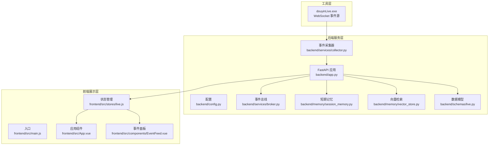
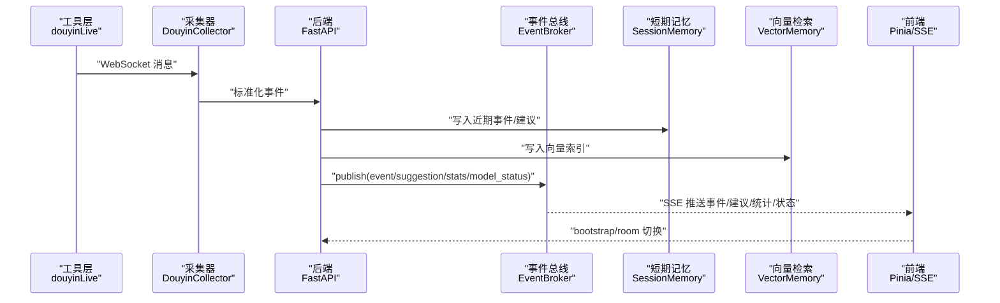
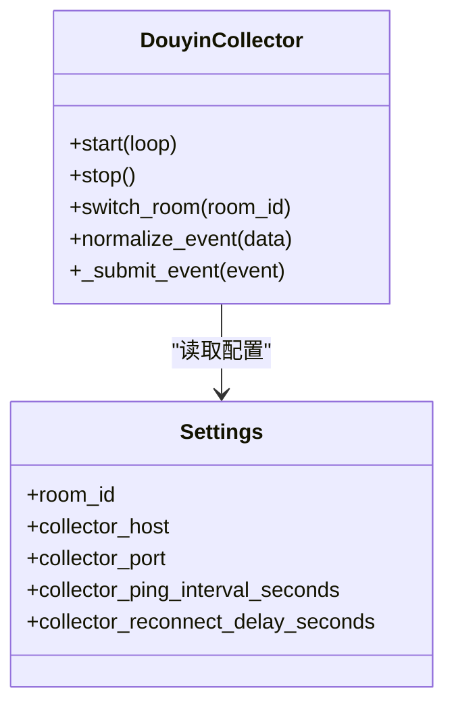
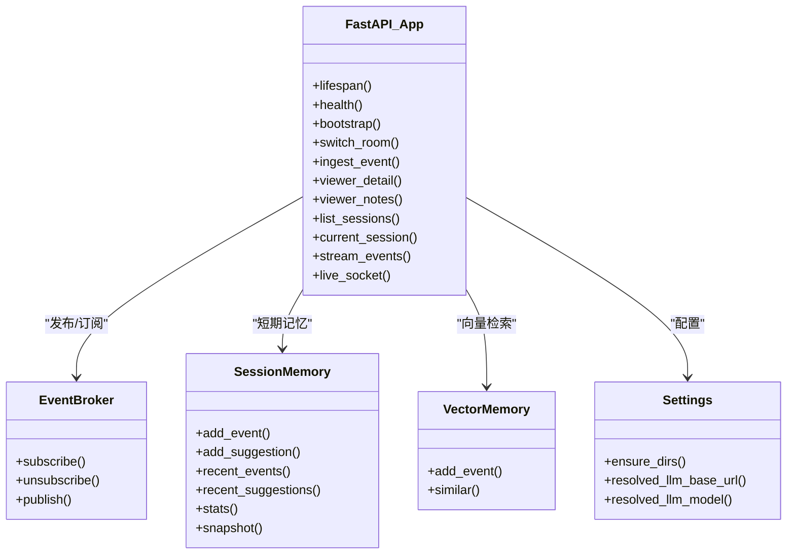
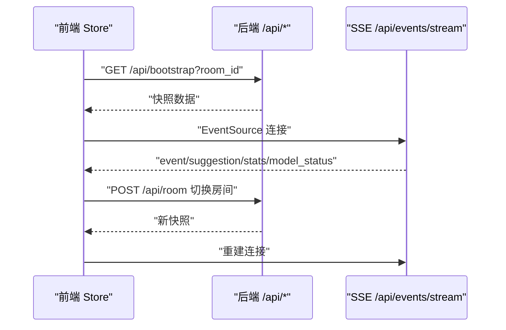
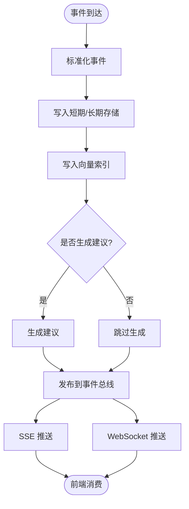
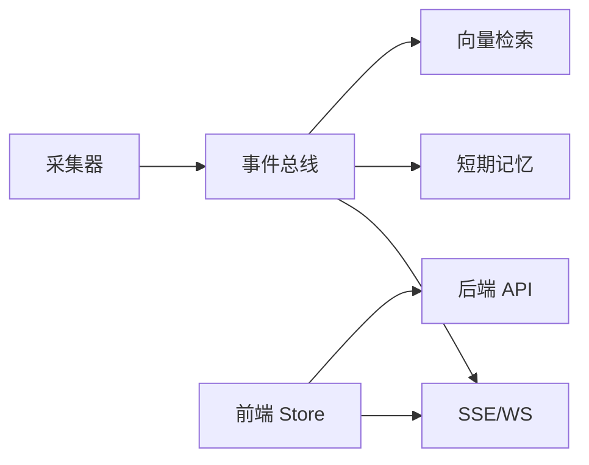

# 整体架构设计

<cite>
**本文引用的文件**
- [backend/app.py](file://backend/app.py)
- [backend/config.py](file://backend/config.py)
- [backend/services/collector.py](file://backend/services/collector.py)
- [backend/services/broker.py](file://backend/services/broker.py)
- [backend/memory/session_memory.py](file://backend/memory/session_memory.py)
- [backend/memory/vector_store.py](file://backend/memory/vector_store.py)
- [backend/schemas/live.py](file://backend/schemas/live.py)
- [frontend/src/main.js](file://frontend/src/main.js)
- [frontend/src/App.vue](file://frontend/src/App.vue)
- [frontend/src/stores/live.js](file://frontend/src/stores/live.js)
- [frontend/src/components/EventFeed.vue](file://frontend/src/components/EventFeed.vue)
- [tool/config.yaml](file://tool/config.yaml)
- [README.md](file://README.md)
- [USAGE.md](file://USAGE.md)
</cite>

## 目录
1. [简介](#简介)
2. [项目结构](#项目结构)
3. [核心组件](#核心组件)
4. [架构总览](#架构总览)
5. [详细组件分析](#详细组件分析)
6. [依赖关系分析](#依赖关系分析)
7. [性能考量](#性能考量)
8. [故障排查指南](#故障排查指南)
9. [结论](#结论)
10. [附录](#附录)

## 简介
本项目围绕抖音直播场景构建“实时提词”系统，采用三层架构设计：
- 工具层：本地抖音采集器（douyinLive）通过 WebSocket 提供直播事件源。
- 后端服务层：基于 FastAPI 的事件处理与实时推送服务，负责事件标准化、短期/长期记忆、向量检索、提示词生成与实时通信。
- 前端展示层：Vue 3 + Pinia + Tailwind，通过 SSE/WS 实时接收事件、建议、统计与模型状态，提供房间切换、事件过滤、主题切换等功能。

系统采用事件驱动架构，通过进程内事件总线（EventBroker）解耦后端处理与前端推送，结合 SSE 与 WebSocket 实现低延迟的实时通信。

## 项目结构
- backend：后端核心，包含 FastAPI 应用、配置、服务与内存/向量存储、数据模型。
- frontend：Vue 3 前端，包含应用入口、状态管理（Pinia）、组件与样式。
- tool：抖音采集器可执行文件及配置样例。
- data：运行期生成的数据目录（SQLite、Chroma）。
- 日志与脚本：logs、启动脚本等。

图表来源
- [backend/app.py:1-220](file://backend/app.py#L1-L220)
- [backend/config.py:1-94](file://backend/config.py#L1-L94)
- [backend/services/collector.py:1-284](file://backend/services/collector.py#L1-L284)
- [backend/services/broker.py:1-40](file://backend/services/broker.py#L1-L40)
- [backend/memory/session_memory.py:1-113](file://backend/memory/session_memory.py#L1-L113)
- [backend/memory/vector_store.py:1-108](file://backend/memory/vector_store.py#L1-L108)
- [backend/schemas/live.py:1-95](file://backend/schemas/live.py#L1-L95)
- [frontend/src/main.js:1-17](file://frontend/src/main.js#L1-L17)
- [frontend/src/App.vue:1-66](file://frontend/src/App.vue#L1-L66)
- [frontend/src/stores/live.js:1-310](file://frontend/src/stores/live.js#L1-L310)
- [frontend/src/components/EventFeed.vue:1-183](file://frontend/src/components/EventFeed.vue#L1-L183)

章节来源
- [README.md:21-34](file://README.md#L21-L34)
- [backend/app.py:1-220](file://backend/app.py#L1-L220)
- [frontend/src/main.js:1-17](file://frontend/src/main.js#L1-L17)

## 核心组件
- 工具层（抖音采集器）
  - 通过本地 WebSocket 暴露抖音直播事件，后端采集器按房间号订阅。
  - 配置文件支持端口、Cookie 等参数。
- 后端服务层（FastAPI 应用）
  - 生命周期管理：启动时启动采集器，关闭时清理会话与停止采集。
  - 事件处理：标准化事件、写入短期/长期存储、向量索引、生成建议、发布事件。
  - 实时通信：SSE 与 WebSocket，统一经事件总线分发。
  - 配置中心：集中解析环境变量与 .env，提供 LLM 地址、模型、Redis、Chroma 等路径。
- 前端展示层
  - 应用入口注册 Pinia，统一状态管理。
  - Store 负责：拉取快照、建立 SSE 连接、事件/建议入队、房间切换、主题持久化。
  - 组件负责：事件面板渲染、过滤、清空、状态条展示。

章节来源
- [backend/app.py:84-92](file://backend/app.py#L84-L92)
- [backend/app.py:104-127](file://backend/app.py#L104-L127)
- [backend/app.py:187-220](file://backend/app.py#L187-L220)
- [backend/config.py:39-94](file://backend/config.py#L39-L94)
- [frontend/src/main.js:1-17](file://frontend/src/main.js#L1-L17)
- [frontend/src/stores/live.js:158-250](file://frontend/src/stores/live.js#L158-L250)

## 架构总览
系统采用“工具层采集 → 后端处理与存储 → 前端实时展示”的三层协作模式。事件驱动体现在：采集器将原始消息投递至后端事件循环，后端标准化后写入短期/长期存储与向量索引，并通过事件总线发布到 SSE/WS。前端通过 Store 统一消费这些事件，驱动 UI 更新。

图表来源
- [backend/services/collector.py:117-139](file://backend/services/collector.py#L117-L139)
- [backend/app.py:61-78](file://backend/app.py#L61-L78)
- [backend/services/broker.py:28-40](file://backend/services/broker.py#L28-L40)
- [backend/memory/session_memory.py:42-64](file://backend/memory/session_memory.py#L42-L64)
- [backend/memory/vector_store.py:64-83](file://backend/memory/vector_store.py#L64-L83)
- [frontend/src/stores/live.js:158-205](file://frontend/src/stores/live.js#L158-L205)

## 详细组件分析

### 工具层（抖音采集器）
- 职责
  - 连接本地 WebSocket，接收抖音直播事件。
  - 将原始消息映射为统一事件结构，提交到后端事件循环。
- 关键点
  - 支持重连、心跳、线程安全地将协程任务提交到后端事件循环。
  - 支持房间切换与配置校验。
- 配置
  - 端口、Cookie 等参数通过配置文件注入。

图表来源
- [backend/services/collector.py:38-98](file://backend/services/collector.py#L38-L98)
- [backend/config.py:43-61](file://backend/config.py#L43-L61)

章节来源
- [backend/services/collector.py:117-139](file://backend/services/collector.py#L117-L139)
- [tool/config.yaml:1-16](file://tool/config.yaml#L1-L16)

### 后端服务层（FastAPI 应用）
- 职责
  - 生命周期管理：启动/停止采集器，关闭活动会话。
  - 事件处理：写入短期/长期存储、向量索引，生成建议，发布事件。
  - 实时通信：SSE 与 WebSocket，统一经事件总线分发。
  - API：健康检查、bootstrap、房间切换、事件注入、Viewer 笔记、会话查询等。
- 设计要点
  - 事件总线：维护订阅队列，广播消息，自动剔除过期队列。
  - 短期记忆：优先 Redis，否则退化为进程内队列，支持 TTL。
  - 向量检索：优先 Chroma，否则退化为哈希嵌入与关键词相似度。
  - 数据模型：统一事件、建议、统计、快照、模型状态。

图表来源
- [backend/app.py:84-220](file://backend/app.py#L84-L220)
- [backend/services/broker.py:10-40](file://backend/services/broker.py#L10-L40)
- [backend/memory/session_memory.py:17-113](file://backend/memory/session_memory.py#L17-L113)
- [backend/memory/vector_store.py:52-108](file://backend/memory/vector_store.py#L52-L108)
- [backend/config.py:63-94](file://backend/config.py#L63-L94)

章节来源
- [backend/app.py:61-78](file://backend/app.py#L61-L78)
- [backend/services/broker.py:28-40](file://backend/services/broker.py#L28-L40)
- [backend/memory/session_memory.py:42-102](file://backend/memory/session_memory.py#L42-L102)
- [backend/memory/vector_store.py:64-107](file://backend/memory/vector_store.py#L64-L107)
- [backend/schemas/live.py:29-95](file://backend/schemas/live.py#L29-L95)

### 前端展示层
- 职责
  - 应用入口注册 Pinia，统一状态。
  - Store 负责：bootstrap、SSE 连接、事件/建议入队、房间切换、主题持久化。
  - 组件负责：事件面板渲染、过滤、清空、状态条展示。
- 实时性
  - 通过 EventSource 订阅 SSE，监听 event/suggestion/stats/model_status 事件。
  - 切换房间时重新拉取快照并重建连接。

图表来源
- [frontend/src/stores/live.js:158-205](file://frontend/src/stores/live.js#L158-L205)
- [frontend/src/stores/live.js:207-250](file://frontend/src/stores/live.js#L207-L250)
- [backend/app.py:109-127](file://backend/app.py#L109-L127)
- [backend/app.py:187-206](file://backend/app.py#L187-L206)

章节来源
- [frontend/src/main.js:1-17](file://frontend/src/main.js#L1-L17)
- [frontend/src/App.vue:29-32](file://frontend/src/App.vue#L29-L32)
- [frontend/src/stores/live.js:158-250](file://frontend/src/stores/live.js#L158-L250)
- [frontend/src/components/EventFeed.vue:1-183](file://frontend/src/components/EventFeed.vue#L1-L183)

### 事件驱动架构与实时通信
- 异步事件处理
  - 采集器在独立线程中接收 WebSocket 消息，将事件提交到后端事件循环，避免阻塞网络 I/O。
- 事件总线
  - 后端维护订阅队列集合，发布消息时尝试非阻塞入队，自动剔除过期队列。
- 实时通信
  - SSE：服务端持续推送事件，客户端自动重连。
  - WebSocket：连接后先下发 bootstrap 快照，随后持续推送增量事件。

图表来源
- [backend/app.py:61-78](file://backend/app.py#L61-L78)
- [backend/services/broker.py:28-40](file://backend/services/broker.py#L28-L40)
- [backend/memory/session_memory.py:42-64](file://backend/memory/session_memory.py#L42-L64)
- [backend/memory/vector_store.py:64-83](file://backend/memory/vector_store.py#L64-L83)

章节来源
- [backend/services/collector.py:200-214](file://backend/services/collector.py#L200-L214)
- [backend/services/broker.py:16-27](file://backend/services/broker.py#L16-L27)
- [backend/app.py:187-220](file://backend/app.py#L187-L220)

## 依赖关系分析
- 组件耦合
  - 后端应用与采集器、事件总线、短期记忆、向量检索松耦合，通过统一事件模型与接口交互。
  - 前端 Store 与后端 API 解耦，通过 REST 与 SSE/WS 通讯。
- 外部依赖
  - 可选：Redis（短期记忆）、Chroma（向量检索）、WebSocket 客户端、FastAPI、Uvicorn。
- 循环依赖
  - 未发现直接循环依赖；模块间通过接口与事件总线间接交互。

图表来源
- [backend/services/collector.py:117-139](file://backend/services/collector.py#L117-L139)
- [backend/services/broker.py:10-40](file://backend/services/broker.py#L10-L40)
- [backend/memory/session_memory.py:17-113](file://backend/memory/session_memory.py#L17-L113)
- [backend/memory/vector_store.py:52-108](file://backend/memory/vector_store.py#L52-L108)
- [frontend/src/stores/live.js:158-205](file://frontend/src/stores/live.js#L158-L205)

章节来源
- [backend/app.py:109-127](file://backend/app.py#L109-L127)
- [backend/app.py:187-220](file://backend/app.py#L187-L220)

## 性能考量
- 事件循环与线程分离
  - 采集器在独立线程中处理网络 I/O，通过线程安全的方式提交到后端事件循环，降低阻塞风险。
- 订阅队列管理
  - 事件总线对满队列进行去脏处理，避免过期消费者拖慢整体吞吐。
- 存储退化策略
  - Redis/Chroma 不可用时自动降级，保证基本功能可用，同时通过 TTL 控制短期数据规模。
- 前端消费窗口
  - 限制事件与建议数量，避免前端渲染压力过大。
- 实时通信
  - SSE/WS 采用长连接与自动重连，确保低延迟与高可用。

## 故障排查指南
- 页面无建议
  - 检查采集器是否启动、房间号是否正确、直播间是否开播、后端是否已重启。
- 顶部显示 fallback
  - 检查在线模型 API Key、网络可达性、超时与限流。
- 顶部显示 heuristic
  - 检查配置是否设置为 heuristic 或 .env 未正确加载。
- 前端无法打开
  - 检查前端脚本是否正常启动、端口是否被占用。
- 后端启动但未写入数据
  - 检查采集器是否运行、后端日志是否连接到 WebSocket、房间是否有消息。

章节来源
- [USAGE.md:200-240](file://USAGE.md#L200-L240)

## 结论
本项目通过清晰的三层架构与事件驱动设计，实现了从抖音直播事件采集到实时提词展示的完整链路。工具层、后端服务层与前端展示层职责明确、协作高效，具备良好的可扩展性与可维护性。通过可选的 Redis 与 Chroma，系统在不同部署环境下均能保持稳定运行。

## 附录
- 快速启动
  - 启动采集器、安装依赖、启动后端与前端，或使用脚本一键启动。
- 配置说明
  - ROOM_ID、LLM_MODE、API Key、Redis/Chroma 路径等关键配置项。

章节来源
- [USAGE.md:90-115](file://USAGE.md#L90-L115)
- [backend/config.py:43-94](file://backend/config.py#L43-L94)