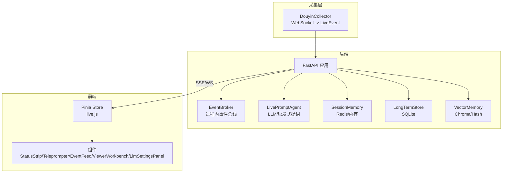
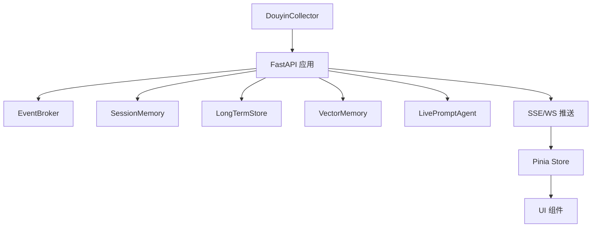
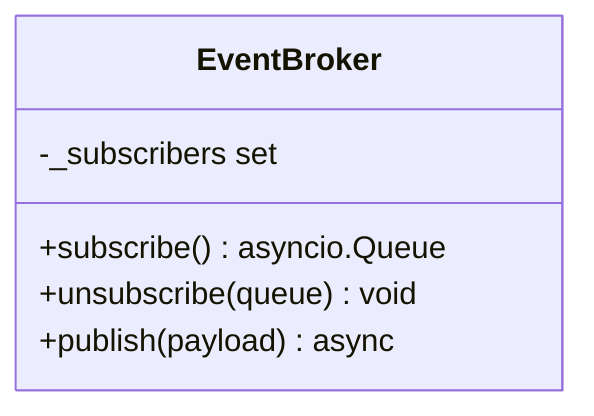
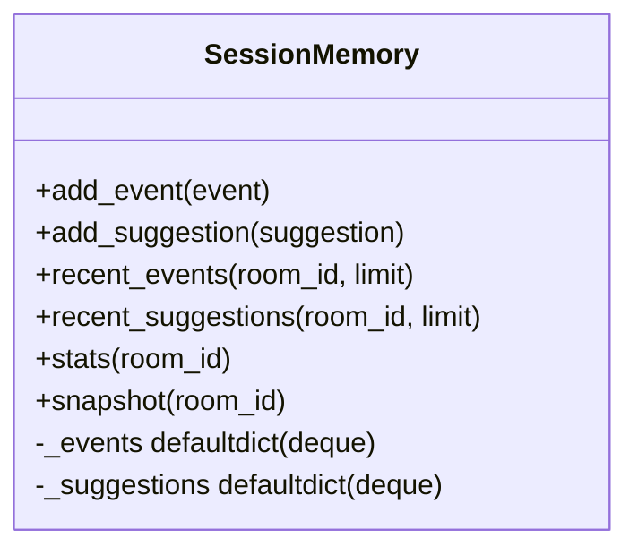
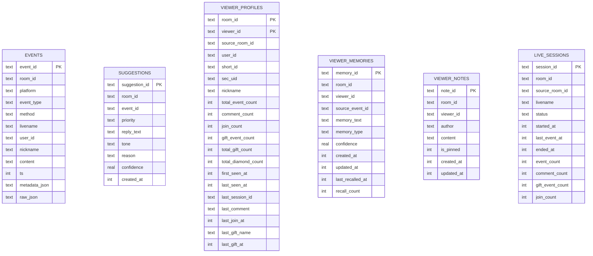
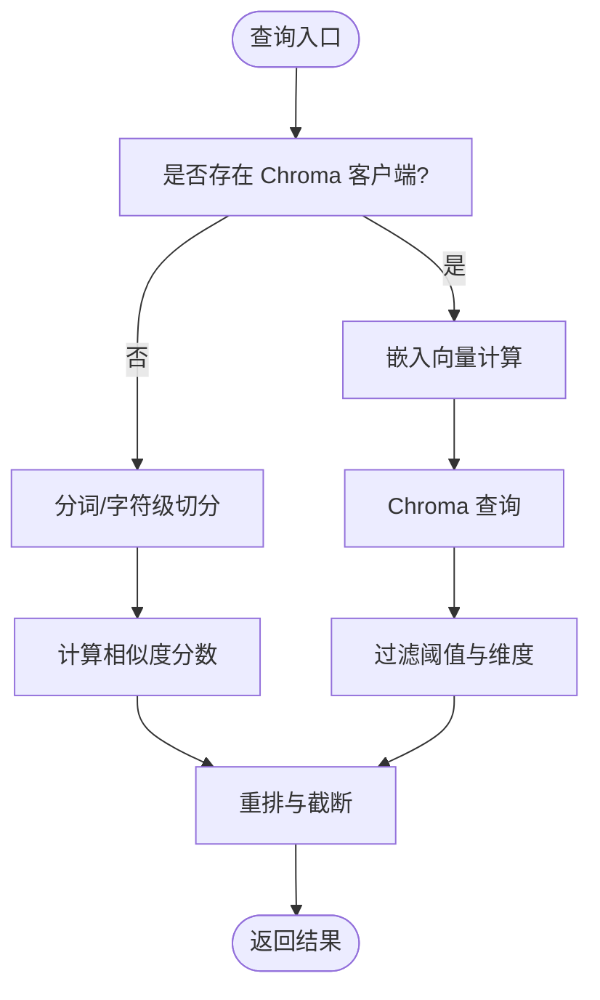
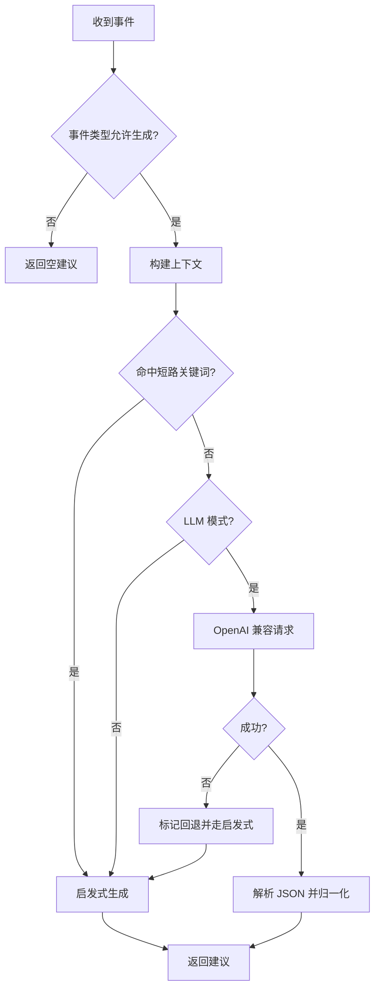
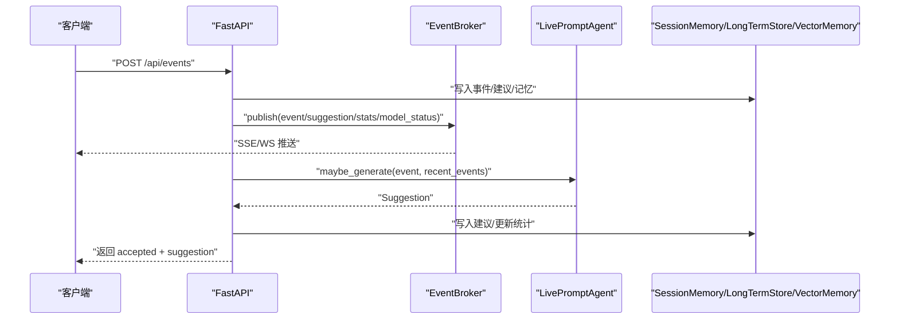
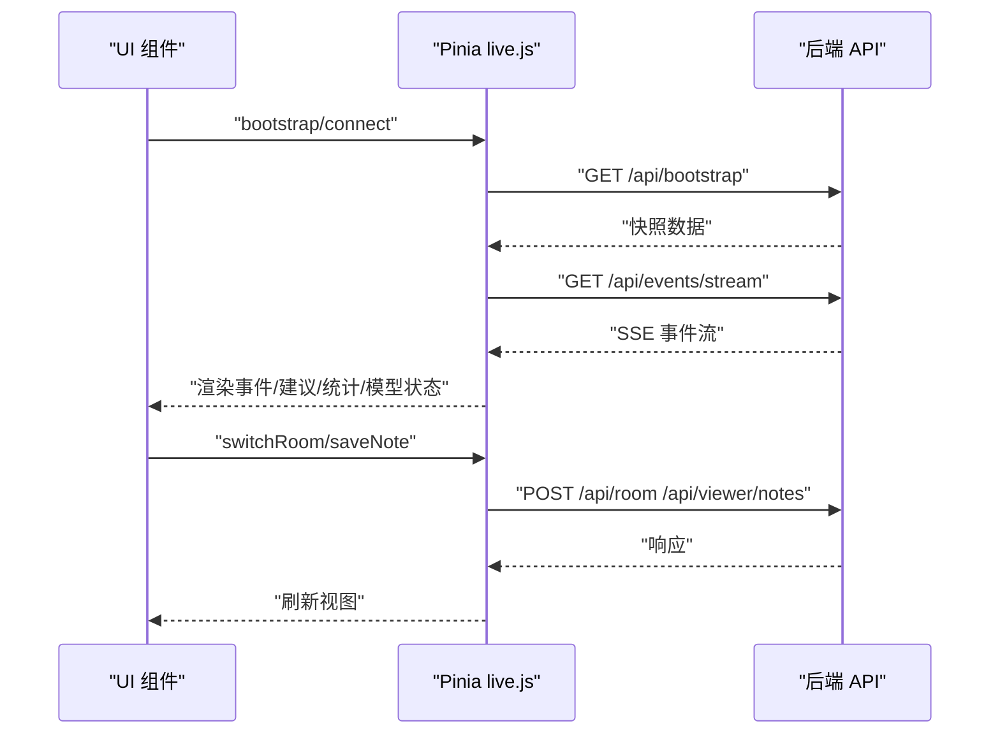
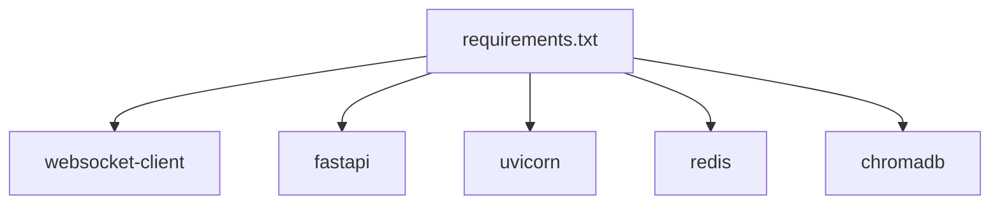

# 整体设计

<cite>
**本文引用的文件**
- [README.md](file://README.md)
- [backend/app.py](file://backend/app.py)
- [backend/config.py](file://backend/config.py)
- [backend/services/broker.py](file://backend/services/broker.py)
- [backend/services/collector.py](file://backend/services/collector.py)
- [backend/services/agent.py](file://backend/services/agent.py)
- [backend/memory/session_memory.py](file://backend/memory/session_memory.py)
- [backend/memory/long_term.py](file://backend/memory/long_term.py)
- [backend/memory/vector_store.py](file://backend/memory/vector_store.py)
- [frontend/src/main.js](file://frontend/src/main.js)
- [frontend/src/stores/live.js](file://frontend/src/stores/live.js)
- [requirements.txt](file://requirements.txt)
</cite>

## 目录
1. [简介](#简介)
2. [项目结构](#项目结构)
3. [核心组件](#核心组件)
4. [架构总览](#架构总览)
5. [详细组件分析](#详细组件分析)
6. [依赖分析](#依赖分析)
7. [性能考量](#性能考量)
8. [故障排查指南](#故障排查指南)
9. [结论](#结论)
10. [附录](#附录)

## 简介
DouYin_llm 是一个面向抖音直播间的实时提词工作栈，采用事件驱动与分层设计，结合本地采集工具、FastAPI 后端与 Vue 3 前端，将直播 WebSocket 流中的评论、礼物与关注事件标准化为 LiveEvent，沉淀观众记忆，通过 LLM 或启发式规则生成提词建议，并以前端仪表板形式实时呈现。系统强调低延迟、可扩展与可运维性，支持可选的 Redis、Chroma 与云端嵌入，满足本地排练与小规模生产的场景需求。

## 项目结构
- 后端（Python）
  - 配置与入口：backend/config.py、backend/app.py
  - 事件采集：backend/services/collector.py
  - 事件总线：backend/services/broker.py
  - 提词引擎：backend/services/agent.py
  - 记忆与存储：backend/memory/session_memory.py、backend/memory/long_term.py、backend/memory/vector_store.py
  - Schema 定义：backend/schemas/live.py（由 README 引用）
- 前端（Vue 3 + Pinia）
  - 入口与应用：frontend/src/main.js、frontend/src/App.vue
  - 状态与交互：frontend/src/stores/live.js
- 工具与脚本
  - 采集器：tool/douyinLive-windows-amd64.exe（Windows）
  - 启动脚本：start_all.ps1、start_backend_qwen.ps1、start_frontend.ps1
- 数据与日志
  - SQLite：data/live_prompter.db
  - 向量库：data/chroma/
  - 日志：logs/



图表来源
- [backend/app.py:108-126](file://backend/app.py#L108-L126)
- [backend/services/broker.py:10-39](file://backend/services/broker.py#L10-L39)
- [backend/services/collector.py:38-100](file://backend/services/collector.py#L38-L100)
- [backend/services/agent.py:23-60](file://backend/services/agent.py#L23-L60)
- [backend/memory/session_memory.py:17-113](file://backend/memory/session_memory.py#L17-L113)
- [backend/memory/long_term.py:44-800](file://backend/memory/long_term.py#L44-L800)
- [backend/memory/vector_store.py:59-317](file://backend/memory/vector_store.py#L59-L317)
- [frontend/src/stores/live.js:75-846](file://frontend/src/stores/live.js#L75-L846)

章节来源
- [README.md:1-223](file://README.md#L1-L223)
- [backend/app.py:108-126](file://backend/app.py#L108-L126)

## 核心组件
- 配置中心（Settings）
  - 负责加载 .env 与环境变量，统一解析 LLM/嵌入/采集/存储等参数，提供 ensure_dirs 与解析方法（如 resolved_llm_base_url、resolved_llm_model）。
- 事件采集器（DouyinCollector）
  - 连接本地 douyinLive WebSocket，将原始消息映射为 LiveEvent，提交至 FastAPI 事件循环。
- 事件总线（EventBroker）
  - 进程内广播器，订阅者队列异步分发事件与建议、统计与模型状态。
- 会话内存（SessionMemory）
  - 优先 Redis，否则回退内存，保存最近事件与建议，提供快照与统计。
- 长期存储（LongTermStore）
  - SQLite 存储事件、建议、观众画像、礼物、会话、笔记与记忆，提供聚合查询与索引。
- 向量记忆（VectorMemory）
  - 基于 Chroma 或本地 Hash 嵌入函数，支持事件与观众记忆的相似检索与重排。
- 提词引擎（LivePromptAgent）
  - 双通道：LLM（OpenAI 兼容）与启发式规则，根据上下文与关键词触发短路策略，生成结构化建议。
- FastAPI 应用（backend/app.py）
  - 生命周期管理、路由与 SSE/WebSocket 推送、与各组件装配。
- 前端状态（Pinia live.js）
  - 管理房间切换、事件过滤、主题、模型状态、ViewerWorkbench 与 LLM 设置，通过 SSE/WS 实时更新。

章节来源
- [backend/config.py:40-113](file://backend/config.py#L40-L113)
- [backend/services/collector.py:38-266](file://backend/services/collector.py#L38-L266)
- [backend/services/broker.py:10-40](file://backend/services/broker.py#L10-L40)
- [backend/memory/session_memory.py:17-113](file://backend/memory/session_memory.py#L17-L113)
- [backend/memory/long_term.py:44-800](file://backend/memory/long_term.py#L44-L800)
- [backend/memory/vector_store.py:59-317](file://backend/memory/vector_store.py#L59-L317)
- [backend/services/agent.py:23-496](file://backend/services/agent.py#L23-L496)
- [backend/app.py:108-285](file://backend/app.py#L108-L285)
- [frontend/src/stores/live.js:75-846](file://frontend/src/stores/live.js#L75-L846)

## 架构总览
系统采用事件驱动与分层设计：
- 事件驱动：采集器将外部流事件化，后端在事件循环中处理，经总线广播，前端通过 SSE/WS 实时消费。
- 分层设计：采集层、服务层（事件处理/提词）、存储层（短期/长期/向量）、前端层清晰分离。
- 微服务分离：后端以 FastAPI 单体服务承载，内部通过模块化组件实现职责分离；前端独立运行，通过 REST/SSE/WS 与后端交互。



图表来源
- [backend/app.py:73-102](file://backend/app.py#L73-L102)
- [backend/services/broker.py:28-39](file://backend/services/broker.py#L28-L39)
- [backend/services/agent.py:105-142](file://backend/services/agent.py#L105-L142)
- [frontend/src/stores/live.js:474-523](file://frontend/src/stores/live.js#L474-L523)

## 详细组件分析

### 事件采集与归一化（DouyinCollector）
- 职责
  - 连接本地 WebSocket，解析 JSON，映射为 LiveEvent，提交到 FastAPI 事件循环。
  - 支持房间切换、断线重连与心跳。
- 关键点
  - 映射方法到事件类型的映射表，提取礼物数量与钻石数，补充 metadata。
  - 使用线程与 asyncio.run_coroutine_threadsafe 将事件提交到事件循环。
- 错误处理
  - 忽略非 JSON 消息，记录错误并继续；异常时记录崩溃日志。

```mermaid
sequenceDiagram
participant COL as "DouyinCollector"
participant WS as "WebSocket"
participant LOOP as "事件循环"
participant APP as "FastAPI 处理函数"
COL->>WS : "建立连接"
WS-->>COL : "消息"
COL->>COL : "解析/归一化为 LiveEvent"
COL->>LOOP : "run_coroutine_threadsafe(event_handler)"
LOOP->>APP : "调用 process_event(event)"
APP-->>COL : "返回"
```

图表来源
- [backend/services/collector.py:145-196](file://backend/services/collector.py#L145-L196)
- [backend/app.py:73-102](file://backend/app.py#L73-L102)

章节来源
- [backend/services/collector.py:38-266](file://backend/services/collector.py#L38-L266)

### 事件总线与广播（EventBroker）
- 职责
  - 维护订阅队列集合，发布消息给所有订阅者；清理阻塞队列。
- 适用场景
  - SSE 与 WebSocket 订阅端通过 subscribe/unsubscribe 获取事件流。



图表来源
- [backend/services/broker.py:10-40](file://backend/services/broker.py#L10-L40)

章节来源
- [backend/services/broker.py:10-40](file://backend/services/broker.py#L10-L40)

### 会话内存（SessionMemory）
- 职责
  - 保存最近事件与建议，提供快照与统计；可选 Redis 后端。
- 特性
  - 事件与建议列表均使用固定长度队列，保证窗口大小可控。
  - Redis 模式下设置 TTL，提升跨进程共享能力。



图表来源
- [backend/memory/session_memory.py:17-113](file://backend/memory/session_memory.py#L17-L113)

章节来源
- [backend/memory/session_memory.py:17-113](file://backend/memory/session_memory.py#L17-L113)

### 长期存储（LongTermStore）
- 职责
  - SQLite 表结构覆盖事件、建议、观众画像、礼物、会话、笔记与记忆。
  - 提供事件/建议/统计快照、观众画像与历史、会话聚合、记忆 CRUD。
- 特性
  - 自动迁移与索引；journal_mode=TRUNCATE 适配部分 Windows 挂载盘写入。
  - 支持回填字段与重建聚合，保证历史数据一致性。



图表来源
- [backend/memory/long_term.py:63-187](file://backend/memory/long_term.py#L63-L187)

章节来源
- [backend/memory/long_term.py:44-800](file://backend/memory/long_term.py#L44-L800)

### 向量记忆（VectorMemory）
- 职责
  - 事件与观众记忆的相似检索与重排；支持 Chroma 与本地 Hash 嵌入。
- 特性
  - 事件检索按时间戳与事件类型加权排序；记忆检索叠加置信度、召回次数与更新时间。
  - 支持按房间与观众维度过滤。



图表来源
- [backend/memory/vector_store.py:172-230](file://backend/memory/vector_store.py#L172-L230)
- [backend/memory/vector_store.py:257-316](file://backend/memory/vector_store.py#L257-L316)

章节来源
- [backend/memory/vector_store.py:59-317](file://backend/memory/vector_store.py#L59-L317)

### 提词引擎（LivePromptAgent）
- 职责
  - 根据事件类型与上下文决定是否命中 LLM；失败或命中特定关键词时退回启发式规则。
- 上下文构建
  - 结合最近事件、相似历史、用户画像与观众记忆，形成紧凑上下文。
- 短路策略
  - 礼物/关注事件优先启发式；命中价格/购买/减脂等关键词时启发式优先。
- LLM 通道
  - 发送系统提示词与用户消息，解析 JSON 输出，校验字段并归一化优先级与置信度。
- 模型状态
  - 记录模式、模型、后端、最近结果与错误，便于前端展示。



图表来源
- [backend/services/agent.py:105-142](file://backend/services/agent.py#L105-L142)
- [backend/services/agent.py:200-216](file://backend/services/agent.py#L200-L216)
- [backend/services/agent.py:228-300](file://backend/services/agent.py#L228-L300)

章节来源
- [backend/services/agent.py:23-496](file://backend/services/agent.py#L23-L496)

### 后端应用（FastAPI）
- 职责
  - 生命周期管理（lifespan），启动采集器与关闭逻辑。
  - 路由：健康检查、引导快照、房间切换、事件注入、观众详情/笔记、LLM 设置、SSE/WS。
  - 事件处理流水线：写入短期/长期/向量，广播事件、建议、统计与模型状态。
- SSE/WS
  - SSE：/api/events/stream，按房间过滤。
  - WebSocket：/ws/live，先下发 bootstrap 快照。



图表来源
- [backend/app.py:73-102](file://backend/app.py#L73-L102)
- [backend/app.py:252-285](file://backend/app.py#L252-L285)

章节来源
- [backend/app.py:108-285](file://backend/app.py#L108-L285)

### 前端状态与交互（Pinia live.js）
- 职责
  - 管理房间号、过滤器、主题、模型状态、LLM 设置、事件与建议列表。
  - 通过 SSE/WS 订阅事件流，支持房间切换、ViewerWorkbench、笔记 CRUD。
- 特性
  - 本地持久化事件类型与主题；错误处理与请求幂等（请求 ID）。
  - 主题切换、语言切换、过滤器联动。



图表来源
- [frontend/src/stores/live.js:440-451](file://frontend/src/stores/live.js#L440-L451)
- [frontend/src/stores/live.js:474-523](file://frontend/src/stores/live.js#L474-L523)
- [frontend/src/stores/live.js:525-569](file://frontend/src/stores/live.js#L525-L569)
- [frontend/src/stores/live.js:609-635](file://frontend/src/stores/live.js#L609-L635)

章节来源
- [frontend/src/stores/live.js:75-846](file://frontend/src/stores/live.js#L75-L846)

## 依赖分析
- 后端依赖
  - websocket-client：WebSocket 客户端。
  - fastapi/uvicorn：Web 服务框架与 ASGI 服务器。
  - redis：可选，用于 SessionMemory。
  - chromadb：可选，用于 VectorMemory。
- 前端依赖
  - Vue 3 + Pinia：响应式状态管理。
  - Vite/Tailwind：构建与样式。



图表来源
- [requirements.txt:1-6](file://requirements.txt#L1-L6)

章节来源
- [requirements.txt:1-6](file://requirements.txt#L1-L6)

## 性能考量
- 事件处理吞吐
  - 采集器与 FastAPI 事件循环解耦，避免阻塞主线程；EventBroker 采用异步队列广播。
- 内存与存储
  - SessionMemory 使用固定长度队列与可选 Redis，控制短期窗口内存占用。
  - LongTermStore 使用索引与分区字段（room_id/ts、viewer_id 等）优化查询。
- 向量检索
  - VectorMemory 支持 Chroma 与本地哈希嵌入；通过阈值与最终 K 截断控制召回规模。
- LLM 调用
  - 超时与回退策略降低端到端延迟风险；前端模型状态实时反馈。
- 前端渲染
  - Pinia 本地持久化与增量更新，减少网络往返与 DOM 更新。

## 故障排查指南
- 采集器问题
  - 检查 ROOM_ID 与采集器配置；确认 WebSocket 地址可达；查看日志中“连接/错误/重试”信息。
- 后端接口
  - /health：确认房间与活动会话状态；/api/bootstrap：检查最近事件/建议与统计。
  - /api/events/stream：确认房间过滤与 SSE 连接状态。
- 存储问题
  - SQLite 写入失败可能与 journal_mode 相关；Chroma 初始化失败时回退本地哈希嵌入。
- LLM 问题
  - 检查 LLM_MODE、LLM_BASE_URL、LLM_MODEL、LLM_API_KEY；查看模型状态与错误码。
- 前端问题
  - 查看 Pinia store 的连接状态与错误信息；确认本地持久化是否可用。

章节来源
- [backend/app.py:129-135](file://backend/app.py#L129-L135)
- [backend/services/agent.py:330-393](file://backend/services/agent.py#L330-L393)
- [frontend/src/stores/live.js:487-522](file://frontend/src/stores/live.js#L487-L522)

## 结论
DouYin_llm 通过事件驱动与分层设计，实现了从直播流到实时提词的完整闭环。系统在可扩展性与可运维性之间取得平衡：可选 Redis/Chroma/嵌入服务满足不同部署场景；LLM 与启发式双通道兼顾稳定性与时效性；前后端分离与 SSE/WS 提供良好的实时体验。未来可在多房间并行接入、鉴权与多租户、可观测性等方面进一步演进。

## 附录
- 系统目标
  - 实时：毫秒级事件归一化与建议生成。
  - 可靠：采集器断线重连、LLM 回退、前端错误兜底。
  - 可扩展：模块化组件、可选依赖、可替换嵌入与向量库。
- 约束条件
  - 采集端为 Windows 可执行文件；单房间串行接入；当前未实现鉴权与多租户。
- 设计权衡
  - 低延迟 vs 高质量：启发式优先；可配置温度与最大 token。
  - 本地 vs 云端：支持本地嵌入与云端嵌入；自动降级。
  - 单机 vs 分布式：当前单体服务，Redis/Chroma 可横向扩展。