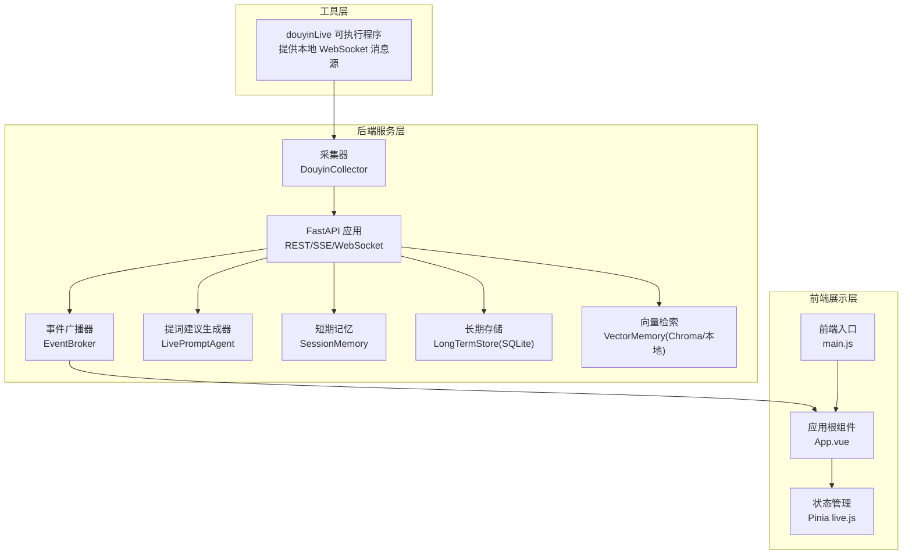
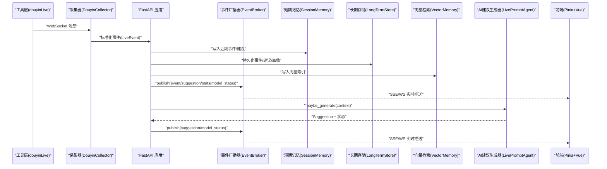
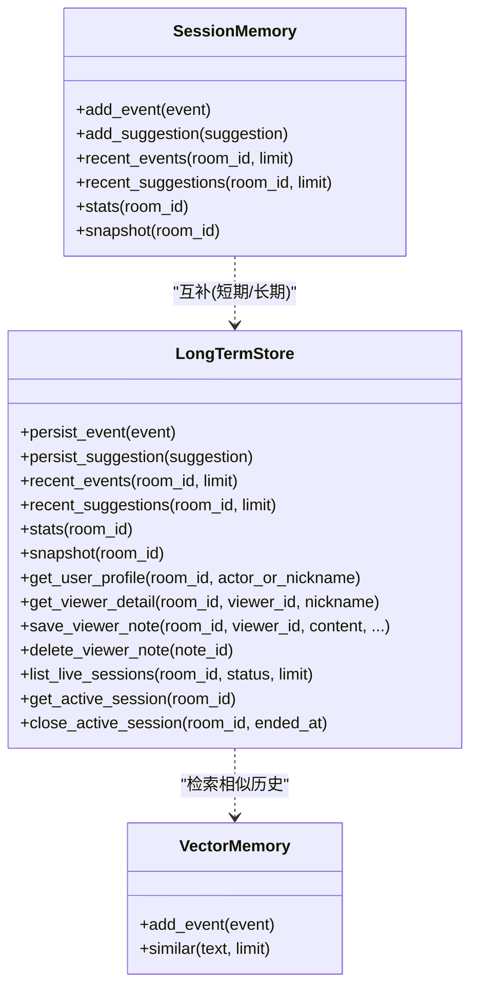
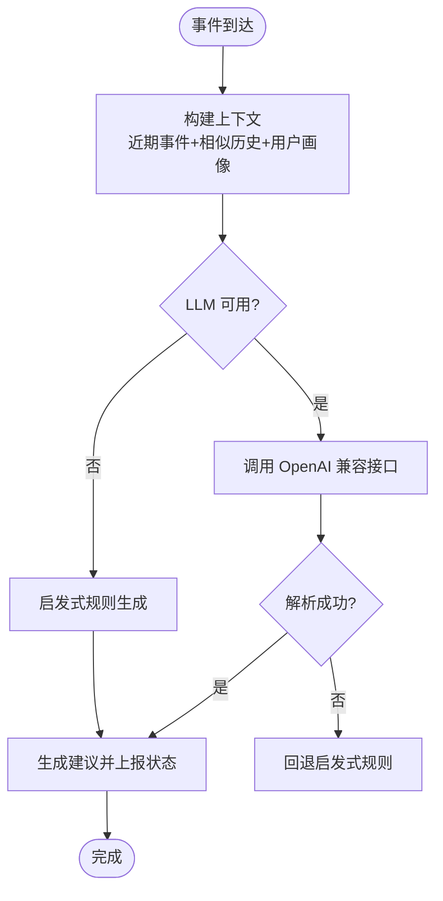
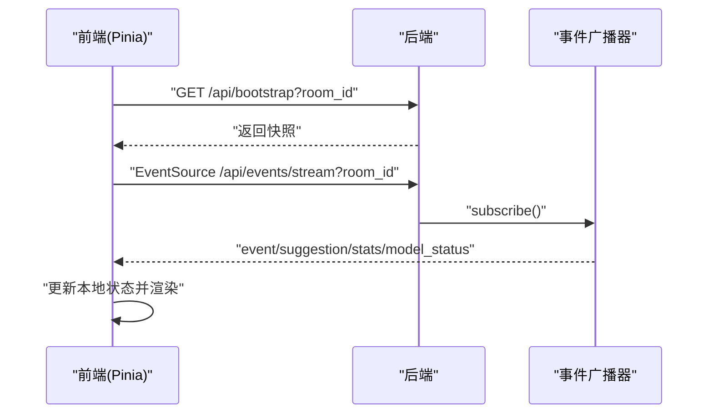
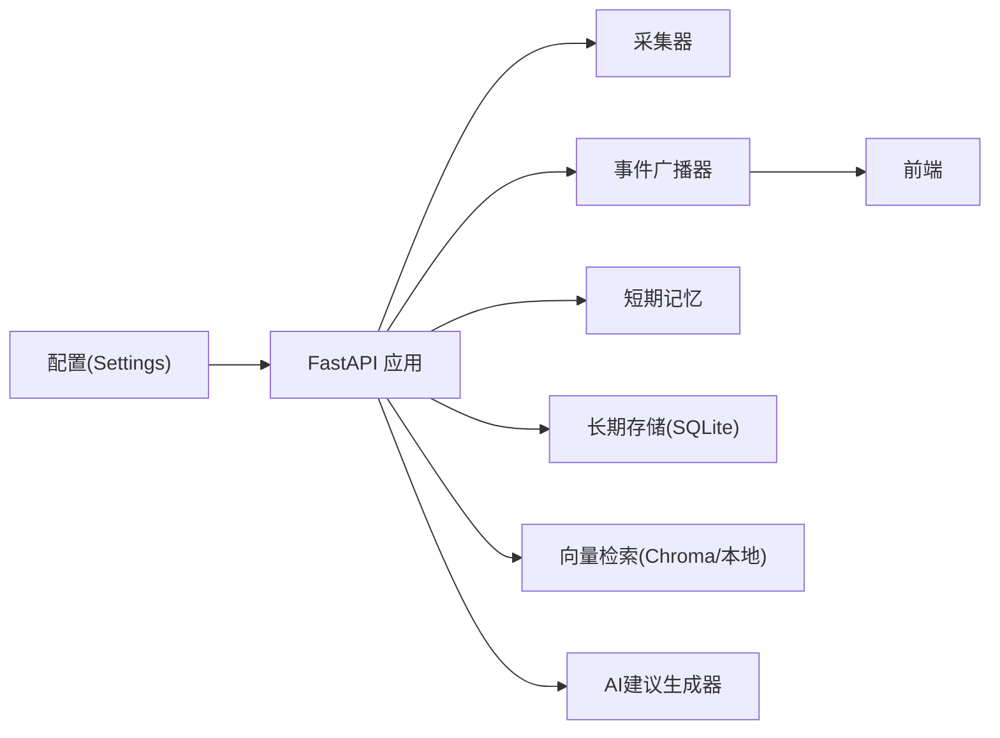

# 系统架构

<cite>
**本文引用的文件**
- [backend/app.py](file://backend/app.py)
- [backend/config.py](file://backend/config.py)
- [backend/memory/session_memory.py](file://backend/memory/session_memory.py)
- [backend/memory/long_term.py](file://backend/memory/long_term.py)
- [backend/memory/vector_store.py](file://backend/memory/vector_store.py)
- [backend/services/agent.py](file://backend/services/agent.py)
- [backend/services/broker.py](file://backend/services/broker.py)
- [backend/services/collector.py](file://backend/services/collector.py)
- [backend/schemas/live.py](file://backend/schemas/live.py)
- [frontend/src/main.js](file://frontend/src/main.js)
- [frontend/src/App.vue](file://frontend/src/App.vue)
- [frontend/src/stores/live.js](file://frontend/src/stores/live.js)
- [README.md](file://README.md)
</cite>

## 目录
1. [简介](#简介)
2. [项目结构](#项目结构)
3. [核心组件](#核心组件)
4. [架构总览](#架构总览)
5. [组件详解](#组件详解)
6. [依赖关系分析](#依赖关系分析)
7. [性能考量](#性能考量)
8. [故障排查指南](#故障排查指南)
9. [结论](#结论)
10. [附录](#附录)

## 简介
本系统围绕“抖音直播”场景构建，采用三层架构（工具层、后端服务层、前端展示层）实现从本地消息源采集、事件标准化、短期/长期/向量记忆、AI建议生成到实时前端展示的完整闭环。系统同时支持事件驱动架构，通过 SSE 与 WebSocket 实时推送事件、建议、统计与模型状态；在多层内存架构上，结合 Redis 短期记忆、SQLite 长期存储与 Chroma 向量检索，形成“热数据-温数据-知识检索”的协同工作机制。

## 项目结构
- 工具层：本地可执行程序提供直播 WebSocket 消息源，供采集器接入。
- 后端服务层：FastAPI 应用承载 REST、SSE、WebSocket 接口，负责事件处理、内存与存储、AI 建议生成与事件广播。
- 前端展示层：Vue 3 + Pinia + Tailwind，通过 SSE/WS 实时消费后端事件流，提供房间切换、事件筛选、主题切换等功能。

图表来源
- [backend/app.py:1-220](file://backend/app.py#L1-L220)
- [backend/services/collector.py:1-284](file://backend/services/collector.py#L1-L284)
- [backend/services/broker.py:1-40](file://backend/services/broker.py#L1-L40)
- [backend/memory/session_memory.py:1-113](file://backend/memory/session_memory.py#L1-L113)
- [backend/memory/long_term.py:1-750](file://backend/memory/long_term.py#L1-L750)
- [backend/memory/vector_store.py:1-108](file://backend/memory/vector_store.py#L1-L108)
- [backend/services/agent.py:1-393](file://backend/services/agent.py#L1-L393)
- [frontend/src/main.js:1-17](file://frontend/src/main.js#L1-L17)
- [frontend/src/App.vue:1-66](file://frontend/src/App.vue#L1-L66)
- [frontend/src/stores/live.js:1-310](file://frontend/src/stores/live.js#L1-L310)

章节来源
- [README.md:21-34](file://README.md#L21-L34)
- [backend/app.py:1-220](file://backend/app.py#L1-L220)

## 核心组件
- FastAPI 应用：提供健康检查、房间切换、事件注入、SSE/WS 实时流、Viewer 相关查询等接口；通过 lifespan 管理采集器生命周期。
- 事件采集器：连接本地 WebSocket，解析并标准化为统一事件模型，提交至事件循环。
- 事件广播器：进程内异步广播，供 SSE/WS 订阅。
- 多层内存架构：
  - SessionMemory：Redis 或进程内队列，保存近期事件与建议，支持 TTL。
  - LongTermStore(SQLite)：持久化事件、建议、用户画像、会话、备注等。
  - VectorMemory(Chroma/本地)：向量检索或本地相似度，用于历史相似片段召回。
- AI 建议生成器：优先调用 OpenAI 兼容接口，失败回退启发式规则，产出建议并上报模型状态。
- 前端：Pinia 管理状态，SSE/WS 订阅后端事件流，渲染事件流、建议、统计与模型状态。

章节来源
- [backend/app.py:84-220](file://backend/app.py#L84-L220)
- [backend/services/collector.py:38-284](file://backend/services/collector.py#L38-L284)
- [backend/services/broker.py:10-40](file://backend/services/broker.py#L10-L40)
- [backend/memory/session_memory.py:17-113](file://backend/memory/session_memory.py#L17-L113)
- [backend/memory/long_term.py:36-750](file://backend/memory/long_term.py#L36-L750)
- [backend/memory/vector_store.py:52-108](file://backend/memory/vector_store.py#L52-L108)
- [backend/services/agent.py:23-393](file://backend/services/agent.py#L23-L393)
- [frontend/src/stores/live.js:70-310](file://frontend/src/stores/live.js#L70-L310)

## 架构总览
系统采用事件驱动架构，后端在 FastAPI 生命周期内启动采集器，事件经标准化后写入短期/长期/向量三层记忆，并触发建议生成与模型状态更新，随后通过广播器向 SSE/WS 推送。前端通过 Pinia 订阅事件流，实时渲染。

图表来源
- [backend/app.py:61-78](file://backend/app.py#L61-L78)
- [backend/services/broker.py:28-40](file://backend/services/broker.py#L28-L40)
- [backend/services/agent.py:73-94](file://backend/services/agent.py#L73-L94)
- [frontend/src/stores/live.js:173-205](file://frontend/src/stores/live.js#L173-L205)

## 组件详解

### FastAPI 应用与生命周期管理
- 应用初始化：读取配置、创建内存与存储实例、初始化代理与采集器。
- 生命周期：lifespan 在启动时启动采集器，在关闭时关闭活动会话并停止采集器。
- CORS：全局启用跨域，允许任意来源与方法。
- 接口：
  - GET /health：健康检查。
  - GET /api/bootstrap：返回前端初始化快照（最近事件、建议、统计、模型状态）。
  - POST /api/room：切换房间并返回新快照。
  - POST /api/events：手动注入事件。
  - GET /api/events/stream：SSE 实时事件流。
  - WS /ws/live：WebSocket 实时事件流。
  - Viewer 相关查询与操作接口：详情、备注增删改查、会话列表与当前会话等。

章节来源
- [backend/app.py:22-30](file://backend/app.py#L22-L30)
- [backend/app.py:84-92](file://backend/app.py#L84-L92)
- [backend/app.py:94-101](file://backend/app.py#L94-L101)
- [backend/app.py:104-184](file://backend/app.py#L104-L184)
- [backend/app.py:187-220](file://backend/app.py#L187-L220)

### 配置与中间件
- 配置加载：优先读取根目录 .env，支持 APP_HOST/PORT、房间号、采集器参数、LLM 模式与凭据、存储路径等。
- 中间件：CORS 允许任意来源与头，便于前端开发调试。
- LLM 解析：根据模式解析最终模型与基座地址，支持 DashScope/OpenAI/自定义兼容服务。

章节来源
- [backend/config.py:11-36](file://backend/config.py#L11-L36)
- [backend/config.py:39-94](file://backend/config.py#L39-L94)
- [backend/app.py:94-101](file://backend/app.py#L94-L101)

### 事件处理与实时推送
- 事件处理流程：写入短期记忆、长期存储、向量索引；发布 event；基于近期事件生成建议并写入存储；发布 suggestion；发布 stats 与 model_status。
- SSE：按房间过滤，持续推送事件类型、建议、统计与模型状态。
- WebSocket：连接即推送 bootstrap 快照，随后持续推送。

章节来源
- [backend/app.py:49-78](file://backend/app.py#L49-L78)
- [backend/app.py:187-206](file://backend/app.py#L187-L206)
- [backend/app.py:209-220](file://backend/app.py#L209-L220)

### 采集器（DouyinCollector）
- 连接与重连：按配置连接本地 WebSocket，异常断开后按间隔重连。
- 消息解析：将原始消息映射为统一事件模型，处理礼物数量、组合/组数等元数据。
- 线程安全：通过 asyncio.run_coroutine_threadsafe 将事件提交到后端事件循环。
- 房间切换：动态更新房间号并重启连接。

章节来源
- [backend/services/collector.py:38-284](file://backend/services/collector.py#L38-L284)

### 事件广播器（EventBroker）
- 订阅/取消订阅：维护订阅队列集合。
- 广播：向所有订阅者投递消息，清理阻塞过久的队列。

章节来源
- [backend/services/broker.py:10-40](file://backend/services/broker.py#L10-L40)

### 多层内存架构
- SessionMemory（短期记忆）
  - Redis 模式：使用列表与过期键，支持 TTL 控制热数据生命周期。
  - 退化模式：进程内双端队列，保证基本可用。
  - 功能：写入事件/建议、读取近期事件/建议、统计事件类型。
- LongTermStore（长期存储，SQLite）
  - 表结构：events、suggestions、viewer_profiles、viewer_gifts、live_sessions、viewer_notes。
  - 功能：持久化事件与建议、聚合用户画像与礼物统计、维护直播会话、Viewer 备注管理、会话查询与当前会话。
- VectorMemory（向量检索）
  - Chroma 模式：持久化集合，支持 upsert/query。
  - 退化模式：本地哈希嵌入与词重叠相似度，维持检索能力。

图表来源
- [backend/memory/session_memory.py:17-113](file://backend/memory/session_memory.py#L17-L113)
- [backend/memory/long_term.py:36-750](file://backend/memory/long_term.py#L36-L750)
- [backend/memory/vector_store.py:52-108](file://backend/memory/vector_store.py#L52-L108)

章节来源
- [backend/memory/session_memory.py:17-113](file://backend/memory/session_memory.py#L17-L113)
- [backend/memory/long_term.py:36-750](file://backend/memory/long_term.py#L36-L750)
- [backend/memory/vector_store.py:52-108](file://backend/memory/vector_store.py#L52-L108)

### AI 建议生成器（LivePromptAgent）
- 上下文构建：近期事件窗口、相似历史片段、用户画像。
- 生成策略：优先 OpenAI 兼容接口，失败回退启发式规则。
- 状态上报：记录模式、模型、后端、结果与错误、更新时间。
- 输出：标准化建议对象，包含优先级、回复文本、语调、理由、置信度等。

图表来源
- [backend/services/agent.py:73-114](file://backend/services/agent.py#L73-L114)
- [backend/services/agent.py:183-329](file://backend/services/agent.py#L183-L329)

章节来源
- [backend/services/agent.py:23-393](file://backend/services/agent.py#L23-L393)

### 前端架构与实时订阅
- 入口与状态：main.js 创建应用并注册 Pinia；App.vue 作为根组件，挂载状态条、提词卡与事件流。
- 状态管理：live.js 维护房间号、主题、连接状态、事件与建议列表、模型状态与统计；提供 bootstrap、connect、switchRoom 等方法。
- 实时订阅：SSE 订阅 /api/events/stream，监听 event/suggestion/stats/model_status 事件；首次连接时通过 bootstrap 获取初始快照。

图表来源
- [frontend/src/stores/live.js:158-205](file://frontend/src/stores/live.js#L158-L205)
- [frontend/src/App.vue:29-32](file://frontend/src/App.vue#L29-L32)
- [backend/app.py:187-206](file://backend/app.py#L187-L206)

章节来源
- [frontend/src/main.js:1-17](file://frontend/src/main.js#L1-L17)
- [frontend/src/App.vue:1-66](file://frontend/src/App.vue#L1-L66)
- [frontend/src/stores/live.js:70-310](file://frontend/src/stores/live.js#L70-L310)

## 依赖关系分析
- 组件耦合：
  - FastAPI 应用依赖配置、内存/存储、代理与采集器；通过广播器解耦 SSE/WS 订阅端。
  - 采集器与 FastAPI 通过事件循环解耦，避免阻塞。
  - 建议生成器依赖向量检索与长期存储，用于上下文构建。
- 外部依赖：
  - Redis（可选）、Chroma（可选）、SQLite（内置）、OpenAI 兼容服务（可选）。
- 循环依赖：未发现循环导入或强耦合。

图表来源
- [backend/app.py:22-30](file://backend/app.py#L22-L30)
- [backend/config.py:39-94](file://backend/config.py#L39-L94)
- [backend/services/broker.py:10-40](file://backend/services/broker.py#L10-L40)
- [frontend/src/stores/live.js:173-205](file://frontend/src/stores/live.js#L173-L205)

章节来源
- [backend/app.py:1-220](file://backend/app.py#L1-L220)
- [backend/services/broker.py:1-40](file://backend/services/broker.py#L1-L40)

## 性能考量
- 热点优化
  - 短期记忆：Redis 模式下使用列表与过期键，限制长度并设置 TTL，降低内存膨胀。
  - SSE/WS：广播器对阻塞队列进行清理，避免订阅端积压导致延迟。
  - SQLite：建立多处索引，减少高频查询成本；批量写入与事务化处理提升吞吐。
  - 向量检索：Chroma 持久化集合，退化模式使用本地哈希嵌入与词重叠，兼顾可用性。
- 模型调用
  - LLM 调用设置超时与错误分类，失败快速回退启发式规则，保障稳定性。
- I/O 与并发
  - 采集器使用独立线程与心跳保活，异常自动重连。
  - FastAPI 使用异步生命周期与事件循环，避免阻塞主线程。

## 故障排查指南
- 采集器无法连接
  - 检查本地消息源是否运行、端口与房间号配置是否正确。
  - 关注采集器日志中的重连与错误提示。
- SSE/WS 无法接收
  - 确认后端 CORS 配置与防火墙；检查前端 EventSource/WS 连接状态。
- Redis/Chroma 不可用
  - 短期记忆与向量检索会自动退化为进程内内存与本地相似度，系统仍可运行。
- LLM 调用失败
  - 查看模型状态上报与错误分类；确认 API Key、基座地址与超时设置。
- 房间切换异常
  - 检查后端 /api/room 返回与前端错误提示；必要时回滚到 bootstrap 快照。

章节来源
- [backend/services/collector.py:117-198](file://backend/services/collector.py#L117-L198)
- [backend/services/broker.py:31-40](file://backend/services/broker.py#L31-L40)
- [backend/services/agent.py:222-285](file://backend/services/agent.py#L222-L285)
- [frontend/src/stores/live.js:207-250](file://frontend/src/stores/live.js#L207-L250)

## 结论
该系统通过三层架构与事件驱动设计，实现了从本地消息源到实时前端展示的完整链路。多层内存架构在不同层次承担不同职责，既保证了实时性与可用性，又提供了可扩展的知识检索能力。FastAPI 的生命周期管理、CORS 与中间件配置确保了服务的稳定与易用；前端通过 SSE/WS 实时订阅，提供流畅的交互体验。在可选依赖缺失的情况下，系统仍能保持基本功能，具备良好的工程韧性。

## 附录
- 数据模型：Actor、LiveEvent、Suggestion、SessionStats、ModelStatus、SessionSnapshot。
- 前端状态：房间号、主题、连接状态、事件与建议列表、模型状态与统计、事件过滤器等。
- 启动与配置：参考 README 的环境变量与启动脚本说明。

章节来源
- [backend/schemas/live.py:8-95](file://backend/schemas/live.py#L8-L95)
- [frontend/src/stores/live.js:70-310](file://frontend/src/stores/live.js#L70-L310)
- [README.md:142-201](file://README.md#L142-L201)