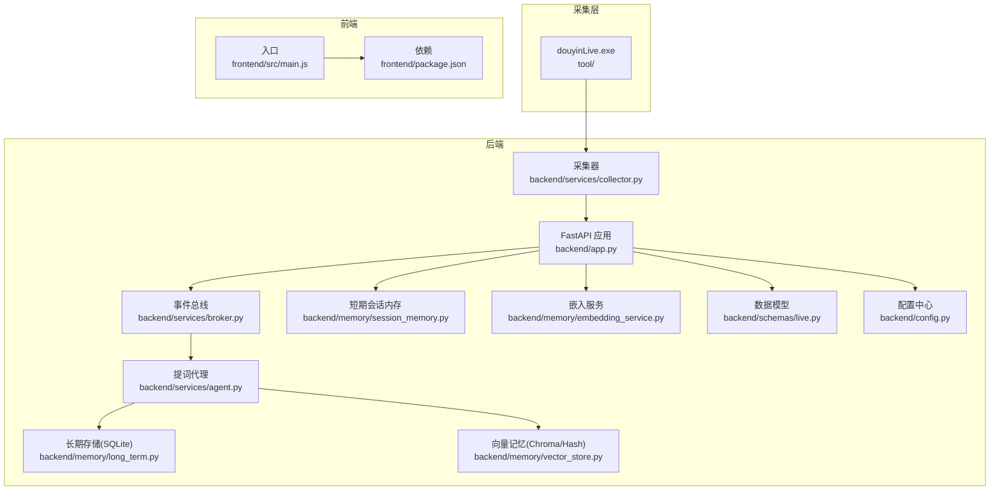
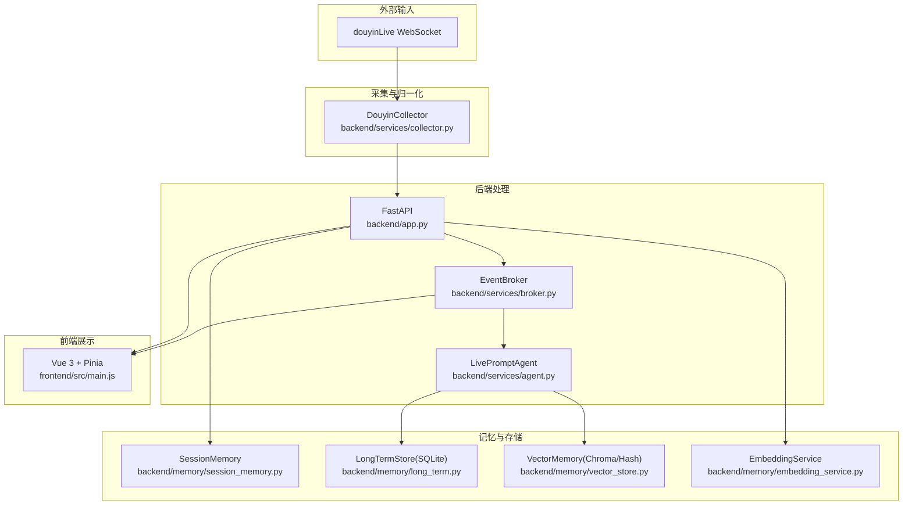
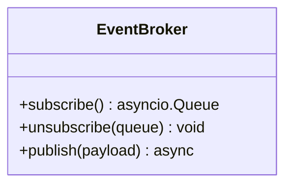
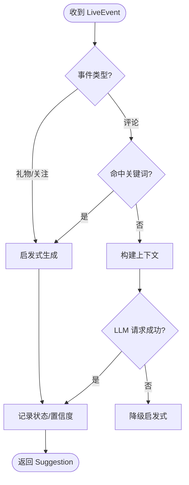
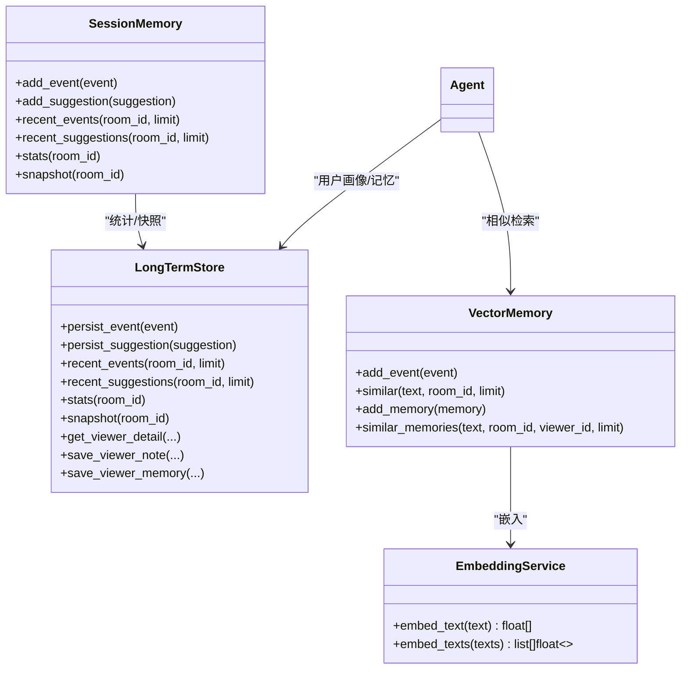
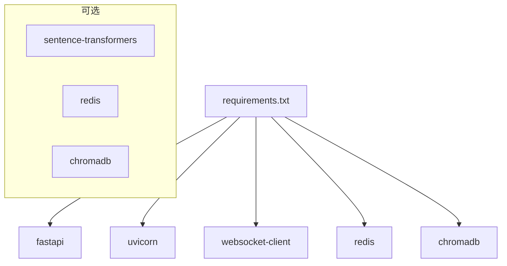
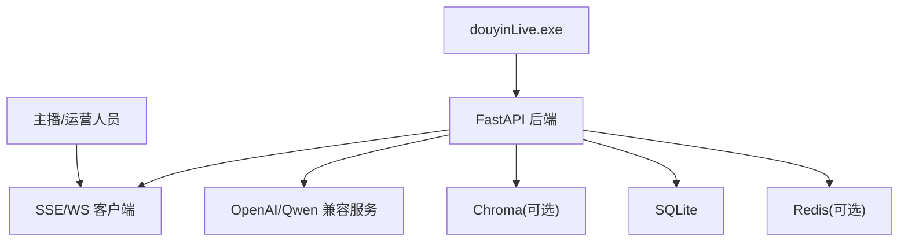
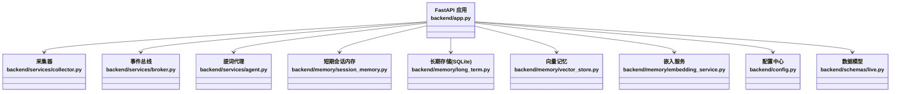

# 系统架构

<cite>
**本文引用的文件**
- [README.md](file://README.md)
- [backend/app.py](file://backend/app.py)
- [backend/config.py](file://backend/config.py)
- [backend/services/collector.py](file://backend/services/collector.py)
- [backend/services/agent.py](file://backend/services/agent.py)
- [backend/services/broker.py](file://backend/services/broker.py)
- [backend/memory/session_memory.py](file://backend/memory/session_memory.py)
- [backend/memory/long_term.py](file://backend/memory/long_term.py)
- [backend/memory/vector_store.py](file://backend/memory/vector_store.py)
- [backend/memory/embedding_service.py](file://backend/memory/embedding_service.py)
- [backend/schemas/live.py](file://backend/schemas/live.py)
- [requirements.txt](file://requirements.txt)
- [frontend/package.json](file://frontend/package.json)
- [frontend/src/main.js](file://frontend/src/main.js)
- [start_all.ps1](file://start_all.ps1)
</cite>

## 目录
1. [简介](#简介)
2. [项目结构](#项目结构)
3. [核心组件](#核心组件)
4. [架构总览](#架构总览)
5. [详细组件分析](#详细组件分析)
6. [依赖分析](#依赖分析)
7. [性能考量](#性能考量)
8. [故障排查指南](#故障排查指南)
9. [结论](#结论)
10. [附录](#附录)

## 简介
DouYin_llm 是一个面向抖音直播间的实时提词工作栈，采用事件驱动与分层设计，结合本地采集工具、FastAPI 后端与 Vue 3 前端，将直播流中的评论、礼物与关注事件标准化为结构化 LiveEvent，沉淀短期会话与长期记忆，通过 LLM 或启发式规则生成提词建议，并通过 SSE/WS 实时推送到前端仪表板。

系统特性包括：
- 事件驱动：采集器将原始消息转换为 LiveEvent，进入异步事件循环，经由 Broker 广播，再由 Agent 生成建议并持久化。
- 分层设计：采集层、服务层、内存层（短期/长期/向量）、Schema 定义清晰分离。
- 微服务分离：采集器与后端进程解耦，前端独立运行，通过 REST/SSE/WebSocket 交互。
- 可插拔记忆：SessionMemory（Redis/内存）、LongTermStore（SQLite）、VectorMemory（Chroma/本地哈希）三套存储协同。
- 双通道提词：优先 OpenAI 兼容模型，失败即降级启发式规则，兼顾时延与稳定性。

## 项目结构
后端采用 Python 包结构组织，前端使用 Vite + Vue 3，采集器为独立可执行程序。整体目录要点如下：
- backend：FastAPI 应用入口、配置、服务与内存模块
- frontend：Vue 3 前端应用，使用 Pinia 管理状态
- tool：douyinLive 可执行文件与采集配置
- tests：Python 单元测试
- docs/superpowers：设计稿与实施计划
- data：SQLite 与 Chroma 数据目录
- 日志：logs 目录用于调试输出



图表来源
- [backend/app.py:1-285](file://backend/app.py#L1-L285)
- [backend/services/collector.py:1-266](file://backend/services/collector.py#L1-L266)
- [backend/services/broker.py:1-40](file://backend/services/broker.py#L1-L40)
- [backend/services/agent.py:1-496](file://backend/services/agent.py#L1-L496)
- [backend/memory/session_memory.py:1-113](file://backend/memory/session_memory.py#L1-L113)
- [backend/memory/long_term.py:1-967](file://backend/memory/long_term.py#L1-L967)
- [backend/memory/vector_store.py:1-317](file://backend/memory/vector_store.py#L1-L317)
- [backend/memory/embedding_service.py:1-102](file://backend/memory/embedding_service.py#L1-L102)
- [backend/schemas/live.py:1-111](file://backend/schemas/live.py#L1-L111)
- [backend/config.py:1-113](file://backend/config.py#L1-L113)
- [frontend/src/main.js:1-17](file://frontend/src/main.js#L1-L17)
- [frontend/package.json:1-23](file://frontend/package.json#L1-L23)

章节来源
- [README.md:32-44](file://README.md#L32-L44)
- [backend/app.py:108-127](file://backend/app.py#L108-L127)

## 核心组件
- FastAPI 应用入口与路由：负责健康检查、引导数据、房间切换、事件注入、观众画像与笔记、LLM 设置、SSE/WS 实时流等。
- 采集器：连接本地 douyinLive WebSocket，标准化为 LiveEvent，提交至后端事件循环。
- 事件总线：进程内异步队列广播，供 SSE 与 WebSocket 订阅。
- 提词代理：根据事件类型与上下文选择 LLM 或启发式规则生成建议，维护模型状态。
- 内存层：
  - SessionMemory：短期事件与建议，支持 Redis 或内存退化。
  - LongTermStore：SQLite 持久化，含事件、建议、观众画像、礼物、会话、笔记、记忆与应用设置。
  - VectorMemory：Chroma 向量索引或本地 Hash 嵌入，支持相似事件与观众记忆检索。
  - EmbeddingService：本地 SentenceTransformer 或云端 OpenAI 兼容嵌入。
- 数据模型：Actor、LiveEvent、Suggestion、ViewerMemory、SessionStats、ModelStatus、SessionSnapshot。
- 配置中心：集中管理运行参数，支持环境变量与 .env 优先级。

章节来源
- [backend/app.py:129-285](file://backend/app.py#L129-L285)
- [backend/services/collector.py:38-266](file://backend/services/collector.py#L38-L266)
- [backend/services/broker.py:10-40](file://backend/services/broker.py#L10-L40)
- [backend/services/agent.py:23-496](file://backend/services/agent.py#L23-L496)
- [backend/memory/session_memory.py:17-113](file://backend/memory/session_memory.py#L17-L113)
- [backend/memory/long_term.py:44-967](file://backend/memory/long_term.py#L44-L967)
- [backend/memory/vector_store.py:59-317](file://backend/memory/vector_store.py#L59-L317)
- [backend/memory/embedding_service.py:18-102](file://backend/memory/embedding_service.py#L18-L102)
- [backend/schemas/live.py:8-111](file://backend/schemas/live.py#L8-L111)
- [backend/config.py:40-113](file://backend/config.py#L40-L113)

## 架构总览
系统采用事件驱动与分层设计，围绕 LiveEvent 构建数据通路，Agent 作为核心处理单元，结合短期、长期与向量记忆实现“所见即所得”的提词体验。



图表来源
- [README.md:7-17](file://README.md#L7-L17)
- [backend/app.py:73-102](file://backend/app.py#L73-L102)
- [backend/services/collector.py:118-160](file://backend/services/collector.py#L118-L160)
- [backend/services/broker.py:28-40](file://backend/services/broker.py#L28-L40)
- [backend/services/agent.py:105-142](file://backend/services/agent.py#L105-L142)
- [backend/memory/session_memory.py:42-84](file://backend/memory/session_memory.py#L42-L84)
- [backend/memory/long_term.py:454-536](file://backend/memory/long_term.py#L454-L536)
- [backend/memory/vector_store.py:149-230](file://backend/memory/vector_store.py#L149-L230)
- [frontend/src/main.js:1-17](file://frontend/src/main.js#L1-L17)

## 详细组件分析

### 采集器（DouyinCollector）
- 职责：连接本地 WebSocket，解析消息，标准化为 LiveEvent，提交到后端事件循环。
- 关键点：
  - 支持配置开关、房间切换、重连与心跳。
  - 使用线程与 asyncio.run_coroutine_threadsafe 在线程间传递事件。
  - 映射方法到事件类型，提取礼物数量、钻石数等元数据。
- 错误处理：忽略非 JSON、记录异常、重试与优雅关闭。

```mermaid
sequenceDiagram
participant Tool as "douyinLive.exe"
participant DC as "DouyinCollector"
participant Loop as "后端事件循环"
participant APP as "FastAPI 处理函数"
Tool->>DC : "WebSocket 消息(JSON)"
DC->>DC : "解析/校验/映射"
DC->>Loop : "run_coroutine_threadsafe(process_event)"
Loop->>APP : "调度处理"
APP-->>DC : "事件处理完成"
```

图表来源
- [backend/services/collector.py:118-196](file://backend/services/collector.py#L118-L196)
- [backend/app.py:73-102](file://backend/app.py#L73-L102)

章节来源
- [backend/services/collector.py:38-266](file://backend/services/collector.py#L38-L266)

### 事件总线（EventBroker）
- 职责：维护订阅队列，发布事件到所有订阅者，清理阻塞队列。
- 交互：SSE 与 WebSocket 路由通过订阅队列消费事件。



图表来源
- [backend/services/broker.py:10-40](file://backend/services/broker.py#L10-L40)

章节来源
- [backend/services/broker.py:10-40](file://backend/services/broker.py#L10-L40)

### 提词代理（LivePromptAgent）
- 职责：根据事件与上下文生成建议，支持 LLM 与启发式规则双通道。
- 上下文构建：近期事件、相似历史、用户画像、观众记忆。
- 生成策略：
  - 礼物/关注事件直走启发式；
  - 命中关键词（价格、购买、身材等）走启发式；
  - 否则构建提示词，调用 OpenAI 兼容接口；
  - 失败则降级启发式并记录状态。
- 输出：Suggestion 结构，包含优先级、语气、理由、置信度与引用。



图表来源
- [backend/services/agent.py:105-142](file://backend/services/agent.py#L105-L142)
- [backend/services/agent.py:200-217](file://backend/services/agent.py#L200-L217)
- [backend/services/agent.py:228-300](file://backend/services/agent.py#L228-L300)

章节来源
- [backend/services/agent.py:23-496](file://backend/services/agent.py#L23-L496)

### 内存与存储
- SessionMemory：短期事件与建议，支持 Redis 或内存退化，TTL 控制热数据生命周期。
- LongTermStore：SQLite 表结构覆盖事件、建议、观众画像、礼物、会话、笔记、记忆与应用设置，提供聚合查询与索引。
- VectorMemory：Chroma 向量集合或本地 Hash 嵌入，支持相似事件与观众记忆检索，具备评分与重排逻辑。
- EmbeddingService：本地 SentenceTransformer 或云端 OpenAI 兼容嵌入，异常时回退 Hash 嵌入。



图表来源
- [backend/memory/session_memory.py:17-113](file://backend/memory/session_memory.py#L17-L113)
- [backend/memory/long_term.py:44-967](file://backend/memory/long_term.py#L44-L967)
- [backend/memory/vector_store.py:59-317](file://backend/memory/vector_store.py#L59-L317)
- [backend/memory/embedding_service.py:18-102](file://backend/memory/embedding_service.py#L18-L102)

章节来源
- [backend/memory/session_memory.py:17-113](file://backend/memory/session_memory.py#L17-L113)
- [backend/memory/long_term.py:44-967](file://backend/memory/long_term.py#L44-L967)
- [backend/memory/vector_store.py:59-317](file://backend/memory/vector_store.py#L59-L317)
- [backend/memory/embedding_service.py:18-102](file://backend/memory/embedding_service.py#L18-L102)

### 数据模型（Pydantic）
- Actor：最小用户身份，计算 viewer_id。
- LiveEvent：标准化直播事件，包含用户、内容、元数据与原始数据。
- Suggestion：提词建议，包含来源、优先级、语气、理由、置信度与引用。
- ViewerMemory：观众记忆，支持类型、置信度与召回统计。
- SessionStats：房间统计。
- ModelStatus：模型状态。
- SessionSnapshot：前端引导数据。

章节来源
- [backend/schemas/live.py:8-111](file://backend/schemas/live.py#L8-L111)

### 配置中心（Settings）
- 集中管理运行参数：采集、后端、LLM、嵌入、向量与数据目录等。
- 支持环境变量与 .env 优先级，提供解析与默认值。
- 关键解析：LLM 基础地址与模型名解析、嵌入签名生成。

章节来源
- [backend/config.py:40-113](file://backend/config.py#L40-L113)

### 前端（Vue 3 + Pinia）
- 入口：创建应用实例，注册 Pinia，挂载根节点。
- 依赖：Vue 3、Pinia、Vite、TailwindCSS 等。
- 作用：展示状态条、提词卡、事件流、观众工坊与 LLM 设置面板。

章节来源
- [frontend/src/main.js:1-17](file://frontend/src/main.js#L1-L17)
- [frontend/package.json:1-23](file://frontend/package.json#L1-L23)

## 依赖分析
- 后端依赖：FastAPI、Uvicorn、websocket-client、redis、chromadb。
- 嵌入选项：sentence-transformers（本地嵌入）、Chroma（向量索引）、Redis（会话共享）。
- 前端依赖：Vue 3、Pinia、Vite、TailwindCSS。



图表来源
- [requirements.txt:1-6](file://requirements.txt#L1-L6)

章节来源
- [requirements.txt:1-6](file://requirements.txt#L1-L6)

## 性能考量
- 事件吞吐：采集器与 Agent 解耦，Agent 采用启发式优先与 LLM 失败降级，降低端到端延迟。
- 存储优化：
  - SessionMemory 使用固定长度队列与 TTL，避免内存膨胀。
  - LongTermStore 建立多索引，加速查询与聚合。
  - VectorMemory 查询限制与评分阈值，减少无效匹配。
- 嵌入性能：本地嵌入支持批处理与设备选择；云端嵌入设置超时与错误回退。
- 前端渲染：Pinia 管理响应式状态，组件按需刷新，减少重绘。

[本节为通用性能讨论，不直接分析具体文件]

## 故障排查指南
- 采集器问题：
  - 检查 ROOM_ID 与采集器 WebSocket 地址配置。
  - 查看日志中“连接/重连/错误/关闭”信息。
  - 确认网络与 ping 间隔设置。
- 后端健康：
  - 访问 /health 检查房间与活动会话。
  - 查看 SSE/WS 订阅是否正常。
- LLM 与嵌入：
  - 检查 API Key、Base URL、超时与模型名。
  - 若云端失败，确认本地嵌入可用或回退 Hash 嵌入。
- 存储：
  - SQLite 数据库路径与权限。
  - Chroma 目录存在与磁盘空间。
- 前端：
  - 确认端口占用与 CORS 配置。
  - 检查浏览器控制台与网络面板。

章节来源
- [backend/app.py:129-136](file://backend/app.py#L129-L136)
- [backend/services/collector.py:118-180](file://backend/services/collector.py#L118-L180)
- [backend/services/agent.py:302-437](file://backend/services/agent.py#L302-L437)
- [backend/memory/embedding_service.py:33-48](file://backend/memory/embedding_service.py#L33-L48)

## 结论
DouYin_llm 通过事件驱动与分层设计，实现了从直播流采集到实时提词建议的完整闭环。短期、长期与向量记忆协同，结合 LLM 与启发式规则，既保证了响应速度也提升了建议质量。系统当前为单机本地场景，后续可在采集端跨平台化、后端可观测性与鉴权隔离等方面扩展。

[本节为总结性内容，不直接分析具体文件]

## 附录

### 系统上下文图


图表来源
- [README.md:7-17](file://README.md#L7-L17)
- [backend/config.py:55-75](file://backend/config.py#L55-L75)
- [requirements.txt:1-6](file://requirements.txt#L1-L6)

### 组件分解图（代码级）


图表来源
- [backend/app.py:27-35](file://backend/app.py#L27-L35)
- [backend/services/collector.py:38-50](file://backend/services/collector.py#L38-L50)
- [backend/services/broker.py:10-21](file://backend/services/broker.py#L10-L21)
- [backend/services/agent.py:23-35](file://backend/services/agent.py#L23-L35)
- [backend/memory/session_memory.py:17-31](file://backend/memory/session_memory.py#L17-L31)
- [backend/memory/long_term.py:44-47](file://backend/memory/long_term.py#L44-L47)
- [backend/memory/vector_store.py:59-74](file://backend/memory/vector_store.py#L59-L74)
- [backend/memory/embedding_service.py:18-23](file://backend/memory/embedding_service.py#L18-L23)
- [backend/config.py:40-50](file://backend/config.py#L40-L50)
- [backend/schemas/live.py:8-44](file://backend/schemas/live.py#L8-L44)

### 部署拓扑与脚本
- 本地双端启动：PowerShell 脚本 start_all.ps1 同时启动后端与前端。
- 后端启动：uvicorn 运行 FastAPI 应用。
- 前端启动：Vite 开发服务器或生产构建。
- 采集器：Windows 可执行文件，需配置 ROOM_ID 与 Cookie。

章节来源
- [start_all.ps1:1-18](file://start_all.ps1#L1-L18)
- [README.md:73-93](file://README.md#L73-L93)