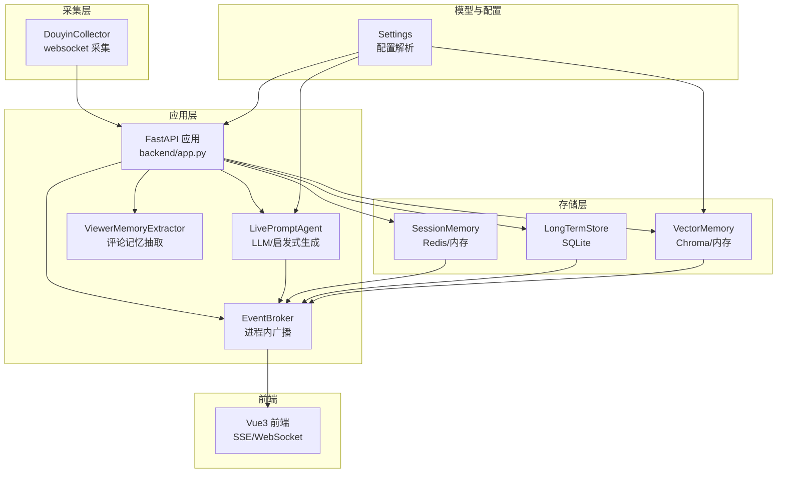
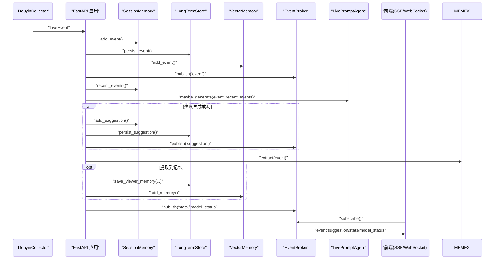
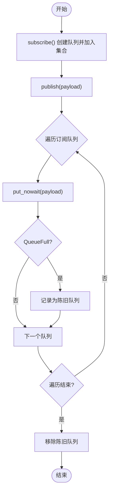
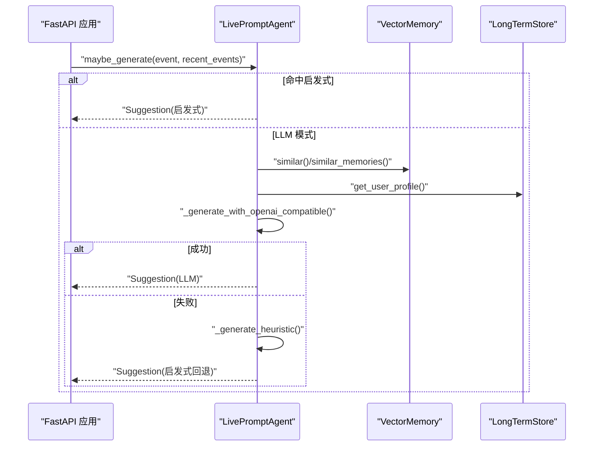
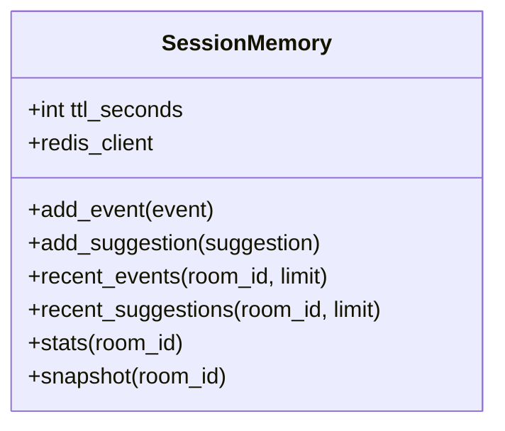
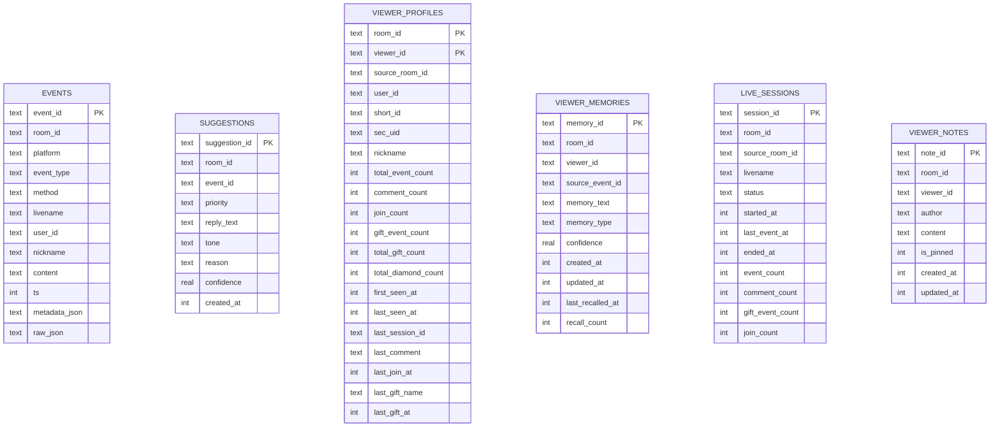
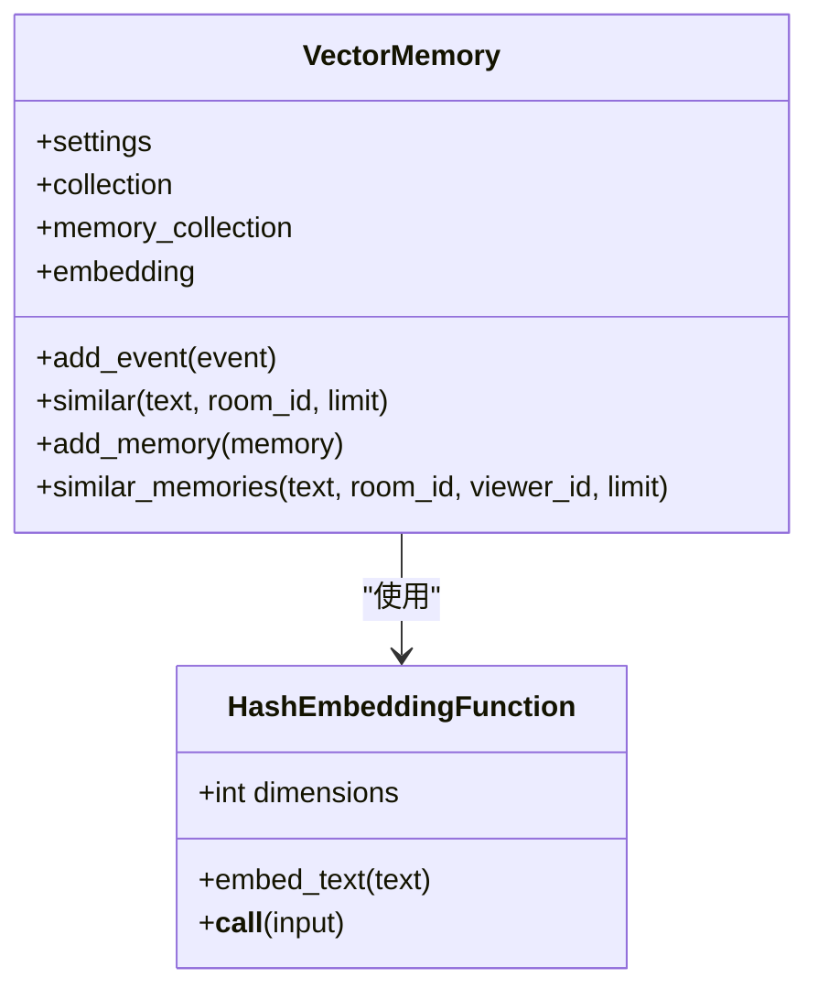
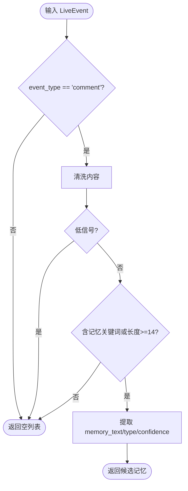
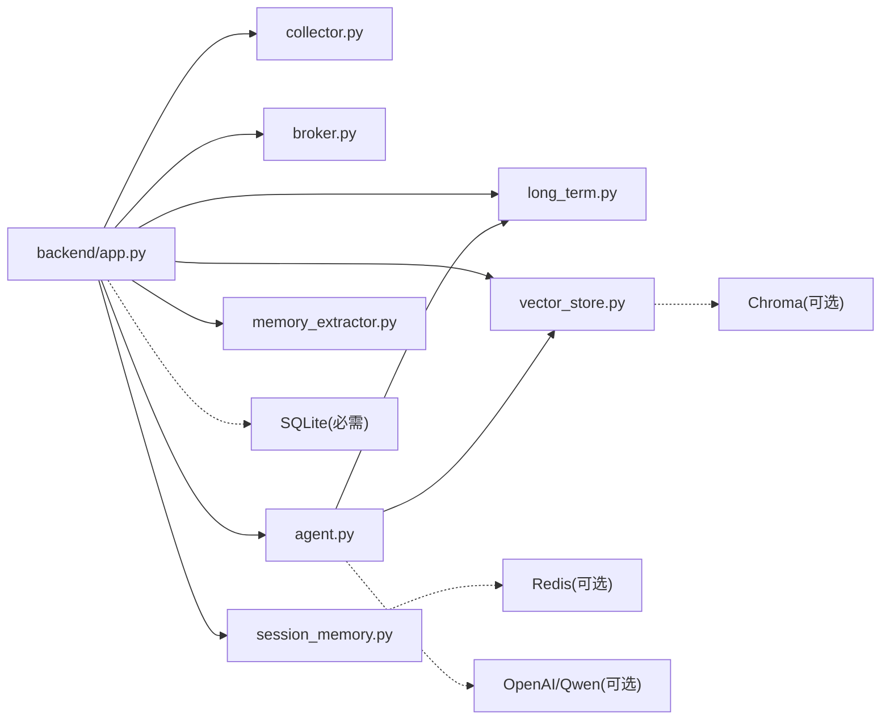

# 组件交互

<cite>
**本文引用的文件**
- [backend/app.py](file://backend/app.py)
- [backend/services/collector.py](file://backend/services/collector.py)
- [backend/services/broker.py](file://backend/services/broker.py)
- [backend/services/agent.py](file://backend/services/agent.py)
- [backend/memory/session_memory.py](file://backend/memory/session_memory.py)
- [backend/memory/long_term.py](file://backend/memory/long_term.py)
- [backend/memory/vector_store.py](file://backend/memory/vector_store.py)
- [backend/schemas/live.py](file://backend/schemas/live.py)
- [backend/config.py](file://backend/config.py)
- [backend/services/memory_extractor.py](file://backend/services/memory_extractor.py)
- [README.md](file://README.md)
</cite>

## 目录
1. [简介](#简介)
2. [项目结构](#项目结构)
3. [核心组件](#核心组件)
4. [架构总览](#架构总览)
5. [详细组件分析](#详细组件分析)
6. [依赖关系分析](#依赖关系分析)
7. [性能考量](#性能考量)
8. [故障排查指南](#故障排查指南)
9. [结论](#结论)
10. [附录](#附录)

## 简介
本文件聚焦于 DouYin_llm 系统的组件交互与通信机制，围绕以下核心组件展开：DouyinCollector（直播事件采集器）、EventBroker（事件广播器）、LivePromptAgent（提词智能体）、SessionMemory（短期会话内存）、LongTermStore（长期存储）、VectorMemory（向量检索）与 ViewerMemoryExtractor（观众记忆抽取器）。文档将阐明它们之间的协作流程、数据传递、事件传播、生命周期管理、错误处理与异常传播，并提供序列图与时序图辅助理解。

## 项目结构
后端采用 FastAPI 应用入口集中编排各子系统，组件职责清晰、边界明确，遵循“采集—处理—存储—检索—生成—推送”的流水线式数据流。



图表来源
- [backend/app.py:108-126](file://backend/app.py#L108-L126)
- [backend/services/collector.py:38-100](file://backend/services/collector.py#L38-L100)
- [backend/services/broker.py:10-40](file://backend/services/broker.py#L10-L40)
- [backend/services/agent.py:23-496](file://backend/services/agent.py#L23-L496)
- [backend/memory/session_memory.py:17-113](file://backend/memory/session_memory.py#L17-L113)
- [backend/memory/long_term.py:44-967](file://backend/memory/long_term.py#L44-L967)
- [backend/memory/vector_store.py:59-317](file://backend/memory/vector_store.py#L59-L317)
- [backend/config.py:40-113](file://backend/config.py#L40-L113)

章节来源
- [README.md:7-17](file://README.md#L7-L17)
- [backend/app.py:108-126](file://backend/app.py#L108-L126)

## 核心组件
- DouyinCollector：从本地采集器 WebSocket 接收原始直播事件，标准化为 LiveEvent，并通过 asyncio 线程安全地提交到后端事件循环。
- EventBroker：进程内事件广播器，维护订阅队列，向 SSE 与 WebSocket 订阅者广播事件、建议、统计与模型状态。
- LivePromptAgent：根据事件类型与上下文选择 LLM 或启发式规则生成提词建议，同时维护模型状态。
- SessionMemory：短期会话内存，优先使用 Redis，否则回退到进程内内存，保存最近事件与建议。
- LongTermStore：SQLite 长期存储，持久化事件、建议、观众画像、礼物、会话、笔记与记忆。
- VectorMemory：Chroma 向量检索与回溯，支持事件与观众记忆的语义相似度查询。
- ViewerMemoryExtractor：从评论中提取潜在的观众记忆，用于增强 Agent 上下文与后续检索。
- Settings：统一配置解析，决定 LLM 模型、嵌入模式、超时与语义阈值等。

章节来源
- [backend/services/collector.py:38-266](file://backend/services/collector.py#L38-L266)
- [backend/services/broker.py:10-40](file://backend/services/broker.py#L10-L40)
- [backend/services/agent.py:23-496](file://backend/services/agent.py#L23-L496)
- [backend/memory/session_memory.py:17-113](file://backend/memory/session_memory.py#L17-L113)
- [backend/memory/long_term.py:44-967](file://backend/memory/long_term.py#L44-L967)
- [backend/memory/vector_store.py:59-317](file://backend/memory/vector_store.py#L59-L317)
- [backend/services/memory_extractor.py:62-118](file://backend/services/memory_extractor.py#L62-L118)
- [backend/config.py:40-113](file://backend/config.py#L40-L113)

## 架构总览
系统采用“采集—处理—存储—检索—生成—推送”的流水线架构。采集器将原始事件标准化后进入 FastAPI 处理流程，随后写入短期与长期存储，同步更新向量索引，触发事件广播，Agent 基于上下文生成建议并再次广播。



图表来源
- [backend/app.py:73-102](file://backend/app.py#L73-L102)
- [backend/services/collector.py:182-196](file://backend/services/collector.py#L182-L196)
- [backend/services/broker.py:28-40](file://backend/services/broker.py#L28-L40)
- [backend/services/agent.py:105-142](file://backend/services/agent.py#L105-L142)
- [backend/memory/session_memory.py:42-102](file://backend/memory/session_memory.py#L42-L102)
- [backend/memory/long_term.py:454-500](file://backend/memory/long_term.py#L454-L500)
- [backend/memory/vector_store.py:149-171](file://backend/memory/vector_store.py#L149-L171)
- [backend/services/memory_extractor.py:99-118](file://backend/services/memory_extractor.py#L99-L118)

## 详细组件分析

### DouyinCollector：事件采集与线程安全提交
- 职责：连接本地采集器 WebSocket，解析 JSON，标准化为 LiveEvent，通过 asyncio.run_coroutine_threadsafe 提交到后端事件循环。
- 生命周期：start() 创建守护线程，stop() 清理资源；支持 switch_room() 切换房间。
- 错误处理：忽略非 JSON 消息；捕获连接异常与回调异常；记录警告与崩溃日志；ping_interval 控制心跳。
- 通信机制：通过 Settings 配置 HOST/PORT/ROOM_ID/PING 等参数；事件经 event_handler 回调进入 FastAPI。

```mermaid
sequenceDiagram
participant COL as "DouyinCollector"
participant WS as "采集器WebSocket"
participant LOOP as "后端事件循环"
participant APP as "FastAPI 应用"
COL->>WS : "connect(url)"
WS-->>COL : "on_open/on_message/on_error/on_close"
COL->>COL : "normalize_event(data)"
COL->>LOOP : "run_coroutine_threadsafe(event_handler(event))"
LOOP-->>APP : "await process_event(event)"
```

图表来源
- [backend/services/collector.py:118-196](file://backend/services/collector.py#L118-L196)
- [backend/services/collector.py:207-266](file://backend/services/collector.py#L207-L266)
- [backend/app.py:105](file://backend/app.py#L105)

章节来源
- [backend/services/collector.py:38-266](file://backend/services/collector.py#L38-L266)

### EventBroker：进程内事件广播
- 职责：维护订阅队列集合，发布消息给所有订阅者；对阻塞队列进行清理。
- 订阅/取消订阅：subscribe() 返回 asyncio.Queue；unsubscribe() 移除队列。
- 发布：publish() 将负载放入每个队列，对满队列进行标记清理。



图表来源
- [backend/services/broker.py:16-40](file://backend/services/broker.py#L16-L40)

章节来源
- [backend/services/broker.py:10-40](file://backend/services/broker.py#L10-L40)

### LivePromptAgent：LLM/启发式提词生成
- 职责：根据事件与上下文生成建议；维护模型状态（模式、模型名、后端、结果、错误、更新时间）。
- 生成策略：命中特定关键词或礼物/关注事件时走启发式；否则构建上下文（最近事件、相似历史、用户画像、观众记忆）并调用 LLM；失败则回退启发式。
- 上下文构建：从 VectorMemory 查询相似事件与观众记忆，从 LongTermStore 获取用户画像。
- 输出：Suggestion 结构，包含优先级、回复文本、语调、理由、置信度、引用与来源事件。



图表来源
- [backend/app.py:80-85](file://backend/app.py#L80-L85)
- [backend/services/agent.py:105-142](file://backend/services/agent.py#L105-L142)
- [backend/services/agent.py:83-103](file://backend/services/agent.py#L83-L103)
- [backend/services/agent.py:302-437](file://backend/services/agent.py#L302-L437)

章节来源
- [backend/services/agent.py:23-496](file://backend/services/agent.py#L23-L496)

### SessionMemory：短期会话内存
- 职责：保存最近事件与建议，支持 Redis 与进程内两种后端；提供快照与统计。
- 行为：add_event/add_suggestion 写入；recent_events/recent_suggestions 读取；stats 基于窗口统计。
- 退化策略：当 Redis 不可用或未配置时，自动回退到内存队列。



图表来源
- [backend/memory/session_memory.py:17-113](file://backend/memory/session_memory.py#L17-L113)

章节来源
- [backend/memory/session_memory.py:17-113](file://backend/memory/session_memory.py#L17-L113)

### LongTermStore：长期存储（SQLite）
- 职责：持久化事件、建议、观众画像、礼物、会话、笔记与记忆；提供查询接口。
- 表结构：events、suggestions、viewer_profiles、viewer_gifts、live_sessions、viewer_notes、viewer_memories、app_settings。
- 会话管理：_ensure_active_session/_touch_live_session；支持回填字段与重建聚合。
- 记忆与笔记：save_viewer_memory/list_viewer_memories/get_viewer_memory/touch_viewer_memories；save_viewer_note/list_viewer_notes/get_viewer_note/delete_viewer_note。



图表来源
- [backend/memory/long_term.py:63-187](file://backend/memory/long_term.py#L63-L187)
- [backend/memory/long_term.py:454-500](file://backend/memory/long_term.py#L454-L500)
- [backend/memory/long_term.py:734-785](file://backend/memory/long_term.py#L734-L785)

章节来源
- [backend/memory/long_term.py:44-967](file://backend/memory/long_term.py#L44-L967)

### VectorMemory：向量检索与回溯
- 职责：事件与观众记忆的向量索引与相似度检索；支持 Chroma 与内存回退。
- 算法：HashEmbeddingFunction 作为本地回退；tokenization + TF-IDF 风格评分；支持按房间过滤与重排。
- 接口：add_event/similar；add_memory/similar_memories。



图表来源
- [backend/memory/vector_store.py:34-57](file://backend/memory/vector_store.py#L34-L57)
- [backend/memory/vector_store.py:59-317](file://backend/memory/vector_store.py#L59-L317)

章节来源
- [backend/memory/vector_store.py:59-317](file://backend/memory/vector_store.py#L59-L317)

### ViewerMemoryExtractor：评论记忆抽取
- 职责：从评论中识别潜在记忆，标注类型（偏好/计划/背景/事实）与置信度。
- 规则：剔除低信号内容；基于关键词与长度判定；清洗文本并计算置信度。



图表来源
- [backend/services/memory_extractor.py:99-118](file://backend/services/memory_extractor.py#L99-L118)

章节来源
- [backend/services/memory_extractor.py:62-118](file://backend/services/memory_extractor.py#L62-L118)

### Settings：配置解析与模型解析
- 职责：统一加载环境变量与 .env；解析 LLM BaseURL/Model；生成嵌入签名；确保目录存在。
- 关键项：APP/采集/Redis/LLM/嵌入/语义阈值等。

章节来源
- [backend/config.py:40-113](file://backend/config.py#L40-L113)

## 依赖关系分析
- 组件耦合与内聚
  - FastAPI 应用集中编排：app.py 作为入口，创建并注入 Broker、SessionMemory、LongTermStore、VectorMemory、LivePromptAgent、ViewerMemoryExtractor。
  - Collector 与应用解耦：通过 event_handler 回调与 asyncio 线程安全提交，避免阻塞采集线程。
  - Agent 与存储解耦：通过 VectorMemory 与 LongTermStore 的接口访问，不直接依赖具体实现细节。
- 外部依赖
  - Redis：可选，用于 SessionMemory 分布式共享。
  - Chroma：可选，用于向量检索；缺失时回退到内存索引。
  - SQLite：必需，用于长期存储。
  - LLM：OpenAI/Qwen 兼容接口，失败时回退启发式。



图表来源
- [backend/app.py:27-35](file://backend/app.py#L27-L35)
- [backend/memory/vector_store.py:70-84](file://backend/memory/vector_store.py#L70-L84)
- [backend/config.py:40-113](file://backend/config.py#L40-L113)

章节来源
- [backend/app.py:27-35](file://backend/app.py#L27-L35)
- [backend/memory/vector_store.py:70-84](file://backend/memory/vector_store.py#L70-L84)

## 性能考量
- 事件吞吐
  - Collector 使用守护线程与 ping_interval，避免阻塞；事件通过 run_coroutine_threadsafe 提交，降低主线程压力。
- 存储与检索
  - SessionMemory 在 Redis 可达更高并发；VectorMemory 在 Chroma 下具备更好的语义检索效果；内存回退保证可用性。
- LLM 生成
  - Agent 支持超时与失败回退；通过启发式规则保障低延迟与稳定性。
- 前端推送
  - SSE/WebSocket 订阅采用 asyncio.Queue，广播时对满队列进行清理，防止内存膨胀。

## 故障排查指南
- 采集器连接问题
  - 确认 ROOM_ID、HOST/PORT 正确；查看 Collector 日志；检查重连延迟与 ping 间隔。
  - 参考：[backend/services/collector.py:118-196](file://backend/services/collector.py#L118-L196)
- 事件处理异常
  - 查看 Collector 回调中的异常日志；确认 event_handler 能力与事件循环可用。
  - 参考：[backend/services/collector.py:182-196](file://backend/services/collector.py#L182-L196)
- LLM 生成失败
  - 检查 LLM_MODE、BASE_URL、MODEL、API_KEY；查看 Agent 的错误状态与回退逻辑。
  - 参考：[backend/services/agent.py:200-217](file://backend/services/agent.py#L200-L217)
- 存储写入失败
  - 检查 SQLite 权限与磁盘空间；确认表结构与索引已创建。
  - 参考：[backend/memory/long_term.py:63-187](file://backend/memory/long_term.py#L63-L187)
- 向量检索异常
  - 若 Chroma 不可用，确认内存回退路径；检查嵌入签名与维度。
  - 参考：[backend/memory/vector_store.py:70-84](file://backend/memory/vector_store.py#L70-L84)

章节来源
- [backend/services/collector.py:118-196](file://backend/services/collector.py#L118-L196)
- [backend/services/agent.py:200-217](file://backend/services/agent.py#L200-L217)
- [backend/memory/long_term.py:63-187](file://backend/memory/long_term.py#L63-L187)
- [backend/memory/vector_store.py:70-84](file://backend/memory/vector_store.py#L70-L84)

## 结论
DouYin_llm 通过清晰的组件划分与事件驱动的数据流，实现了从直播事件采集到实时提词建议生成与前端推送的完整闭环。组件间通过 FastAPI 应用集中编排，采用进程内广播与可选外部存储/检索后端，既保证了可用性，又兼顾了性能与扩展性。建议在生产环境中启用 Redis 与 Chroma，并完善鉴权与可观测性。

## 附录
- 组件生命周期
  - 应用启动：lifespan 创建 Collector、Broker、SessionMemory、LongTermStore、VectorMemory、Agent、ViewerMemoryExtractor；启动 Collector。
  - 应用停止：关闭活动会话、停止 Collector。
  - 参考：[backend/app.py:108-117](file://backend/app.py#L108-L117)
- 数据模型
  - LiveEvent、Suggestion、ViewerMemory、SessionStats、ModelStatus、SessionSnapshot。
  - 参考：[backend/schemas/live.py:29-111](file://backend/schemas/live.py#L29-L111)