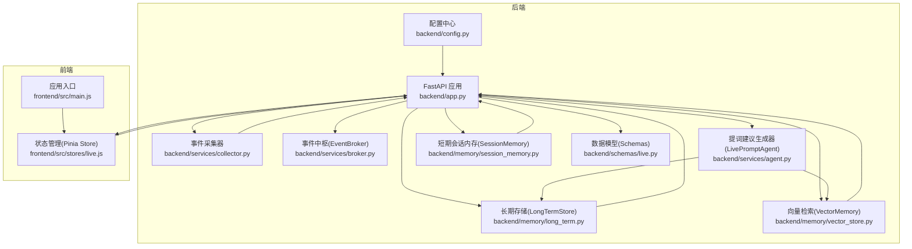
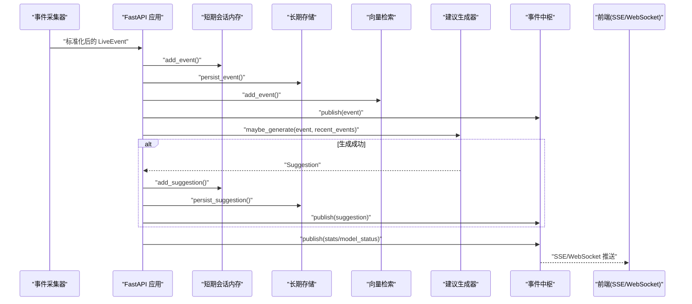
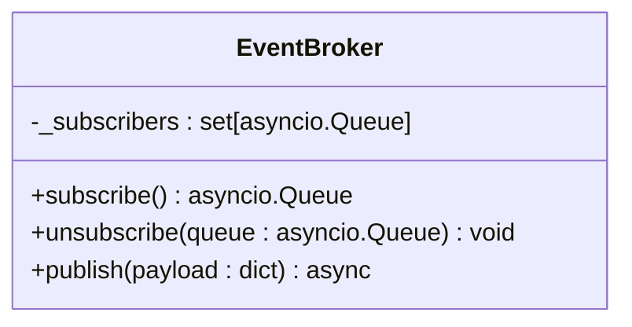
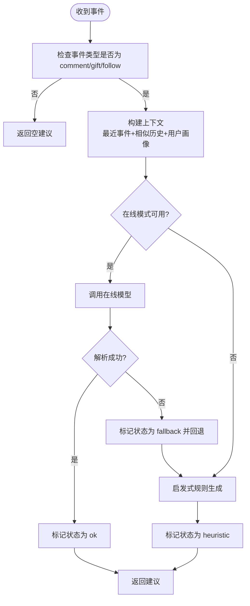
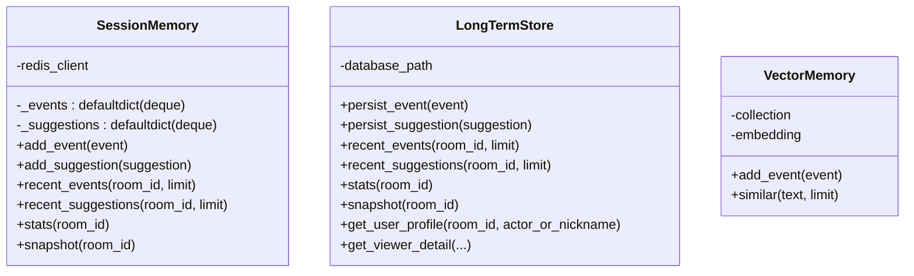
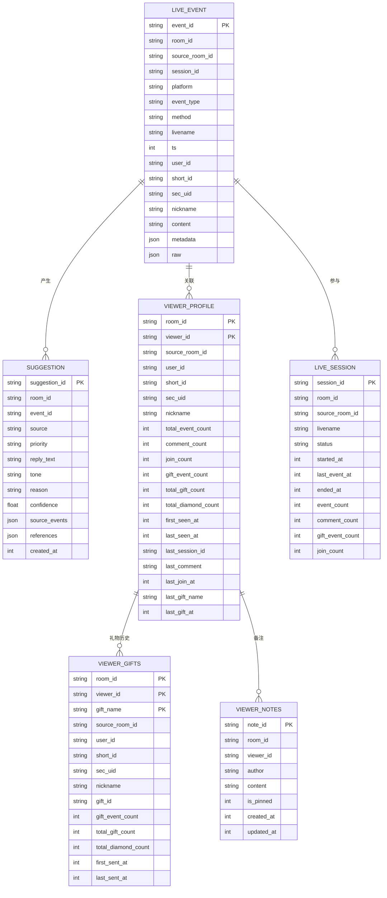
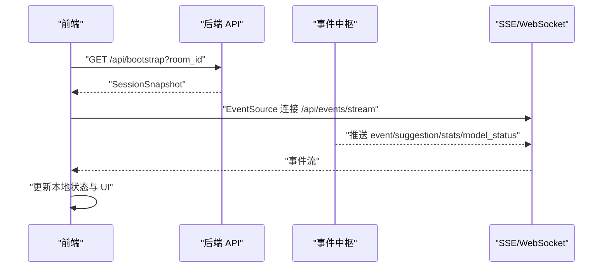
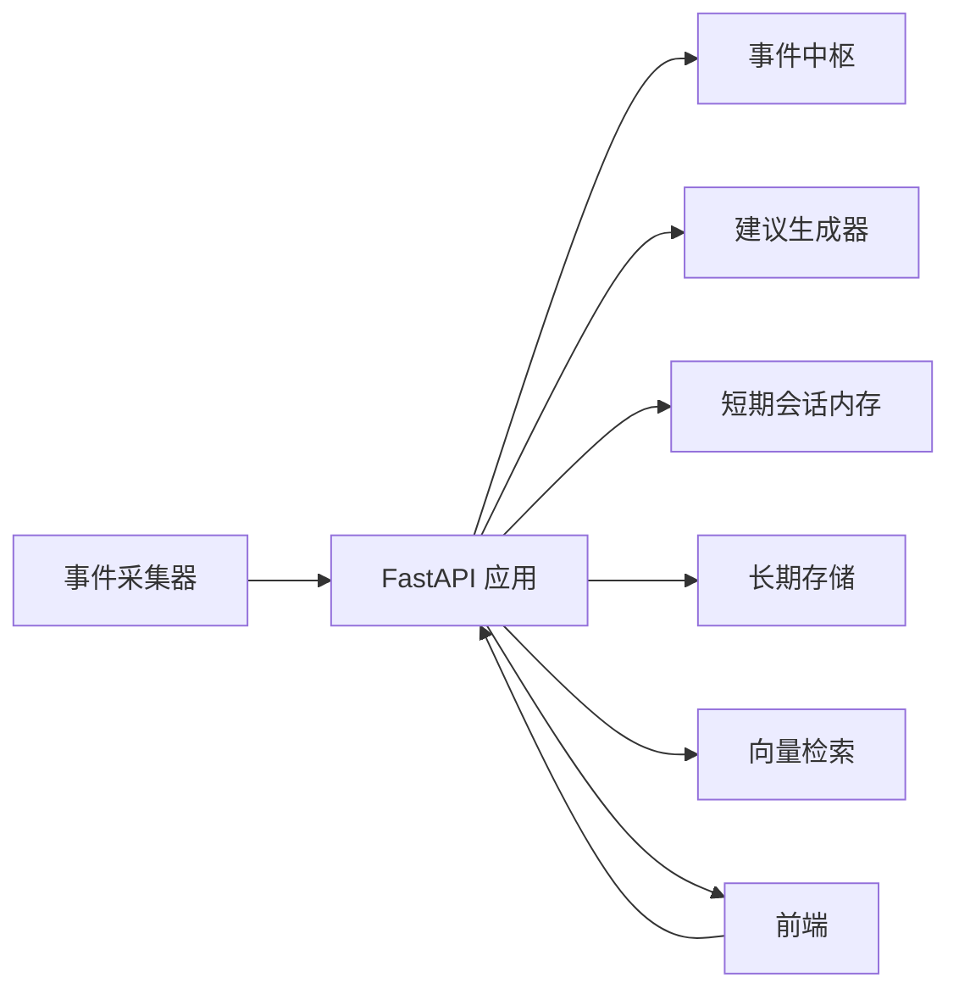

# 组件交互关系

<cite>
**本文引用的文件**
- [backend/app.py](file://backend/app.py)
- [backend/config.py](file://backend/config.py)
- [backend/services/broker.py](file://backend/services/broker.py)
- [backend/services/agent.py](file://backend/services/agent.py)
- [backend/services/collector.py](file://backend/services/collector.py)
- [backend/memory/session_memory.py](file://backend/memory/session_memory.py)
- [backend/memory/long_term.py](file://backend/memory/long_term.py)
- [backend/memory/vector_store.py](file://backend/memory/vector_store.py)
- [backend/schemas/live.py](file://backend/schemas/live.py)
- [frontend/src/stores/live.js](file://frontend/src/stores/live.js)
- [frontend/src/main.js](file://frontend/src/main.js)
</cite>

## 目录
1. [简介](#简介)
2. [项目结构](#项目结构)
3. [核心组件](#核心组件)
4. [架构总览](#架构总览)
5. [详细组件分析](#详细组件分析)
6. [依赖关系分析](#依赖关系分析)
7. [性能考量](#性能考量)
8. [故障排查指南](#故障排查指南)
9. [结论](#结论)

## 简介
本文件聚焦于系统中核心组件的交互关系与依赖，重点阐述以下方面：
- EventBroker 作为事件中枢的作用与消息分发机制
- LivePromptAgent 的建议生成机制（在线模型与本地启发式规则的双轨策略）
- SessionMemory、LongTermStore、VectorMemory 的协作模式与数据流转
- 组件间解耦设计（接口定义、消息传递、状态同步）
- 组件生命周期管理与错误处理策略

## 项目结构
后端采用分层架构：服务层（事件收集、代理、事件中枢）、内存层（短期/长期/向量）、数据模型层（Pydantic），前端通过 SSE/WebSocket 与后端进行实时数据订阅。

图表来源
- [backend/app.py:1-220](file://backend/app.py#L1-L220)
- [backend/config.py:1-94](file://backend/config.py#L1-L94)
- [backend/services/collector.py:1-284](file://backend/services/collector.py#L1-L284)
- [backend/services/broker.py:1-40](file://backend/services/broker.py#L1-L40)
- [backend/services/agent.py:1-393](file://backend/services/agent.py#L1-L393)
- [backend/memory/session_memory.py:1-113](file://backend/memory/session_memory.py#L1-L113)
- [backend/memory/long_term.py:1-750](file://backend/memory/long_term.py#L1-L750)
- [backend/memory/vector_store.py:1-108](file://backend/memory/vector_store.py#L1-L108)
- [backend/schemas/live.py:1-95](file://backend/schemas/live.py#L1-L95)
- [frontend/src/stores/live.js:1-310](file://frontend/src/stores/live.js#L1-L310)
- [frontend/src/main.js:1-17](file://frontend/src/main.js#L1-L17)

章节来源
- [backend/app.py:1-220](file://backend/app.py#L1-L220)
- [backend/config.py:1-94](file://backend/config.py#L1-L94)

## 核心组件
- EventBroker：进程内事件广播器，维护订阅队列，向 SSE/WebSocket 订阅者广播事件与建议
- LivePromptAgent：建议生成器，结合向量检索与长期用户画像，优先使用在线模型，失败时回退至本地启发式规则
- SessionMemory：短期会话内存，优先 Redis，否则回退到进程内队列，提供最近事件与建议的读写与统计
- LongTermStore：SQLite 长期存储，负责事件与建议的持久化、用户画像聚合、会话统计与查询
- VectorMemory：向量检索记忆层，优先 Chroma，否则使用轻量哈希嵌入与文本相似度方案
- 数据模型：统一的事件、建议、统计、状态等模型定义
- 事件采集器：连接本地抖音直播 WebSocket，标准化消息并提交到后端事件循环

章节来源
- [backend/services/broker.py:1-40](file://backend/services/broker.py#L1-L40)
- [backend/services/agent.py:1-393](file://backend/services/agent.py#L1-L393)
- [backend/memory/session_memory.py:1-113](file://backend/memory/session_memory.py#L1-L113)
- [backend/memory/long_term.py:1-750](file://backend/memory/long_term.py#L1-L750)
- [backend/memory/vector_store.py:1-108](file://backend/memory/vector_store.py#L1-L108)
- [backend/schemas/live.py:1-95](file://backend/schemas/live.py#L1-L95)
- [backend/services/collector.py:1-284](file://backend/services/collector.py#L1-L284)

## 架构总览
系统以 FastAPI 应用为中心，接收来自事件采集器的直播事件，写入短期与长期存储，触发建议生成并通过 EventBroker 广播到前端。前端通过 SSE/WebSocket 实时订阅事件流，渲染事件与建议卡片。

图表来源
- [backend/app.py:61-78](file://backend/app.py#L61-L78)
- [backend/services/broker.py:28-40](file://backend/services/broker.py#L28-L40)
- [backend/services/agent.py:73-94](file://backend/services/agent.py#L73-L94)
- [backend/memory/session_memory.py:42-64](file://backend/memory/session_memory.py#L42-L64)
- [backend/memory/long_term.py:420-454](file://backend/memory/long_term.py#L420-L454)
- [backend/memory/vector_store.py:64-83](file://backend/memory/vector_store.py#L64-L83)

## 详细组件分析

### EventBroker 事件中枢
- 职责
  - 维护订阅队列集合，支持动态订阅/取消订阅
  - 广播事件与建议到所有订阅者，自动清理阻塞队列
- 关键点
  - 订阅队列使用 asyncio.Queue，保证异步非阻塞
  - 发布时尝试非阻塞入队，遇到满队列的订阅者会被标记为“陈旧”，随后从订阅集合中移除
- 与前端集成
  - SSE 接口按房间过滤，WebSocket 直播推送全量事件

图表来源
- [backend/services/broker.py:10-40](file://backend/services/broker.py#L10-L40)

章节来源
- [backend/services/broker.py:1-40](file://backend/services/broker.py#L1-L40)
- [backend/app.py:187-220](file://backend/app.py#L187-L220)

### LivePromptAgent 建议生成机制
- 双轨策略
  - 在线模式：调用 OpenAI 兼容接口，严格解析 JSON 输出，失败时记录状态并回退
  - 启发式模式：基于事件类型与关键词规则快速生成建议，保证可用性
- 上下文构建
  - 结合最近事件窗口、相似历史片段（向量检索）、用户画像（长期存储）
- 状态管理
  - 维护当前模型状态快照，包含模式、模型名、后端地址、结果与错误码、更新时间

图表来源
- [backend/services/agent.py:73-114](file://backend/services/agent.py#L73-L114)
- [backend/services/agent.py:183-329](file://backend/services/agent.py#L183-L329)
- [backend/services/agent.py:115-181](file://backend/services/agent.py#L115-L181)

章节来源
- [backend/services/agent.py:1-393](file://backend/services/agent.py#L1-L393)

### SessionMemory、LongTermStore、VectorMemory 协作模式
- SessionMemory
  - 优先使用 Redis 列表结构保存最近事件与建议，支持 TTL 控制热数据生命周期
  - 回退到进程内 deque，保证最小可用性
  - 提供最近事件/建议读取、统计与房间快照
- LongTermStore
  - SQLite 表结构覆盖事件、建议、用户画像、礼物历史、直播会话、备注等
  - 自动建表、索引与列迁移，提供事件与建议的持久化、统计与查询
  - 维护活跃会话、用户画像聚合与历史明细
- VectorMemory
  - 优先使用 Chroma 持久化客户端，提供 upsert/query 能力
  - 回退到轻量哈希嵌入与文本相似度，维持检索能力

图表来源
- [backend/memory/session_memory.py:17-113](file://backend/memory/session_memory.py#L17-L113)
- [backend/memory/long_term.py:36-750](file://backend/memory/long_term.py#L36-L750)
- [backend/memory/vector_store.py:52-108](file://backend/memory/vector_store.py#L52-L108)

章节来源
- [backend/memory/session_memory.py:1-113](file://backend/memory/session_memory.py#L1-L113)
- [backend/memory/long_term.py:1-750](file://backend/memory/long_term.py#L1-L750)
- [backend/memory/vector_store.py:1-108](file://backend/memory/vector_store.py#L1-L108)

### 数据模型与接口契约
- LiveEvent：标准化直播事件，包含用户身份、事件类型、内容、元数据与原始数据
- Suggestion：建议实体，包含来源、优先级、回复文案、语气、理由、置信度、引用与创建时间
- SessionStats：房间统计，用于前端展示
- SessionSnapshot：前端引导快照，包含最近事件、建议、统计与模型状态
- ModelStatus：模型后端状态，用于前端显示

图表来源
- [backend/schemas/live.py:29-95](file://backend/schemas/live.py#L29-L95)
- [backend/memory/long_term.py:54-149](file://backend/memory/long_term.py#L54-L149)

章节来源
- [backend/schemas/live.py:1-95](file://backend/schemas/live.py#L1-L95)
- [backend/memory/long_term.py:1-750](file://backend/memory/long_term.py#L1-L750)

### 前端交互与状态同步
- Pinia Store
  - 维护房间号、主题、连接状态、事件过滤器、统计数据、事件与建议列表、模型状态
  - 通过 SSE 连接订阅事件流，按房间过滤，实时更新视图
- 应用入口
  - 初始化 Vue 应用与 Pinia，挂载到根节点

图表来源
- [frontend/src/stores/live.js:158-205](file://frontend/src/stores/live.js#L158-L205)
- [backend/app.py:109-112](file://backend/app.py#L109-L112)
- [backend/app.py:187-220](file://backend/app.py#L187-L220)

章节来源
- [frontend/src/stores/live.js:1-310](file://frontend/src/stores/live.js#L1-L310)
- [frontend/src/main.js:1-17](file://frontend/src/main.js#L1-L17)
- [backend/app.py:104-112](file://backend/app.py#L104-L112)

## 依赖关系分析
- 组件耦合与内聚
  - EventBroker 仅依赖 asyncio，低耦合，便于替换为其他消息中间件
  - LivePromptAgent 通过接口注入向量与长期存储，保持算法与存储解耦
  - SessionMemory/LongTermStore/VectorMemory 通过统一的数据模型进行协作
- 外部依赖与集成点
  - Redis：短期会话内存的可选持久化
  - Chroma：向量检索的可选持久化
  - SQLite：长期存储
  - WebSocket：事件采集器与后端通信
  - SSE：前端事件流订阅
- 循环依赖
  - 未发现循环依赖，组件间通过接口与事件流解耦

图表来源
- [backend/app.py:1-220](file://backend/app.py#L1-L220)
- [backend/services/collector.py:1-284](file://backend/services/collector.py#L1-L284)
- [backend/services/broker.py:1-40](file://backend/services/broker.py#L1-L40)
- [backend/services/agent.py:1-393](file://backend/services/agent.py#L1-L393)
- [backend/memory/session_memory.py:1-113](file://backend/memory/session_memory.py#L1-L113)
- [backend/memory/long_term.py:1-750](file://backend/memory/long_term.py#L1-L750)
- [backend/memory/vector_store.py:1-108](file://backend/memory/vector_store.py#L1-L108)
- [frontend/src/stores/live.js:1-310](file://frontend/src/stores/live.js#L1-L310)

章节来源
- [backend/app.py:1-220](file://backend/app.py#L1-L220)

## 性能考量
- 异步与并发
  - EventBroker 使用 asyncio.Queue，避免阻塞发布
  - SSE/WebSocket 订阅者独立消费，降低广播压力
- 缓存与降级
  - SessionMemory 在 Redis 不可用时自动回退到进程内队列
  - VectorMemory 在 Chroma 不可用时使用轻量哈希嵌入与文本相似度
  - LivePromptAgent 在在线模型失败时立即回退到启发式规则
- 存储优化
  - Redis 列表截断与 TTL 控制短期数据规模
  - SQLite 索引覆盖高频查询字段
- 前端节流
  - 前端限制事件与建议列表长度，避免 DOM 压力

## 故障排查指南
- 事件中枢相关
  - 订阅队列满导致消息丢失：检查订阅速率与消费者处理速度，必要时增加消费者或提高队列容量
  - 取消订阅未及时清理：确认取消订阅逻辑在异常分支正确执行
- 建议生成相关
  - 在线模型失败：检查网络连通性、超时设置、鉴权头、模型参数与响应格式
  - JSON 解析失败：检查模型输出是否符合要求字段与类型
  - 启发式规则不生效：确认事件类型与关键词匹配逻辑
- 存储相关
  - Redis 不可用：确认连接字符串与网络可达性，观察回退到进程内队列的日志
  - Chroma 不可用：确认持久化目录权限与版本兼容性，观察回退到内存相似度的日志
  - SQLite 写入失败：检查磁盘空间、数据库文件权限与并发写入冲突
- 前端相关
  - SSE 连接断开：检查后端健康状态与房间过滤参数，确认前端重连逻辑
  - 房间切换失败：检查后端返回的错误详情，确认房间 ID 有效性

章节来源
- [backend/services/broker.py:28-40](file://backend/services/broker.py#L28-L40)
- [backend/services/agent.py:222-285](file://backend/services/agent.py#L222-L285)
- [backend/memory/session_memory.py:45-52](file://backend/memory/session_memory.py#L45-L52)
- [backend/memory/vector_store.py:60-83](file://backend/memory/vector_store.py#L60-L83)
- [backend/app.py:187-220](file://backend/app.py#L187-L220)
- [frontend/src/stores/live.js:207-250](file://frontend/src/stores/live.js#L207-L250)

## 结论
该系统通过 EventBroker 将事件采集、存储、建议生成与前端订阅解耦，形成清晰的事件驱动流水线。LivePromptAgent 的双轨策略确保在复杂场景下的稳定性与可用性；SessionMemory、LongTermStore、VectorMemory 分层协作，兼顾性能与可靠性。整体架构具备良好的扩展性与可维护性，适合在生产环境中持续演进。