# 部署拓扑

<cite>
**本文档引用的文件**
- [README.md](file://README.md)
- [backend/app.py](file://backend/app.py)
- [backend/config.py](file://backend/config.py)
- [backend/services/collector.py](file://backend/services/collector.py)
- [backend/services/agent.py](file://backend/services/agent.py)
- [backend/memory/session_memory.py](file://backend/memory/session_memory.py)
- [backend/memory/vector_store.py](file://backend/memory/vector_store.py)
- [backend/schemas/live.py](file://backend/schemas/live.py)
- [frontend/package.json](file://frontend/package.json)
- [frontend/vite.config.js](file://frontend/vite.config.js)
- [requirements.txt](file://requirements.txt)
- [start_all.ps1](file://start_all.ps1)
</cite>

## 目录
1. [简介](#简介)
2. [项目结构](#项目结构)
3. [核心组件](#核心组件)
4. [架构概览](#架构概览)
5. [详细组件分析](#详细组件分析)
6. [部署拓扑](#部署拓扑)
7. [容器化部署方案](#容器化部署方案)
8. [负载均衡与高可用性](#负载均衡与高可用性)
9. [监控与日志](#监控与日志)
10. [安全配置](#安全配置)
11. [性能考虑](#性能考虑)
12. [故障排除](#故障排除)
13. [结论](#结论)

## 简介

DouYin_llm是一个面向抖音直播间的实时提词工作栈，由本地采集工具、FastAPI后端与Vue 3前端组成。该系统能够将抖音直播WebSocket流中的评论、礼物与关注事件转换为结构化的LiveEvent，通过SQLite/Chroma沉淀观众记忆，并通过LLM或启发式规则生成提词建议，最后以前端仪表板的形式推送给主持人。

该系统采用模块化设计，包含事件采集、内存管理、向量检索、LLM推理等多个核心组件，支持单机部署和分布式部署两种模式。

## 项目结构

系统采用清晰的分层架构，主要分为以下层次：

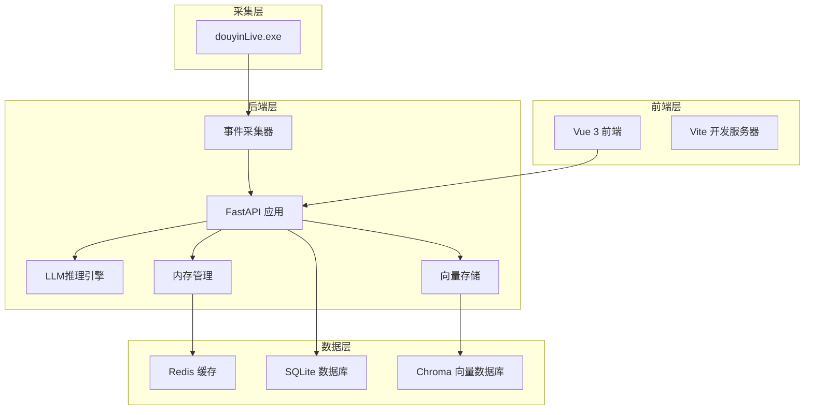

**图表来源**
- [backend/app.py:1-285](file://backend/app.py#L1-L285)
- [backend/services/collector.py:1-266](file://backend/services/collector.py#L1-L266)
- [backend/memory/session_memory.py:1-113](file://backend/memory/session_memory.py#L1-L113)
- [backend/memory/vector_store.py:1-317](file://backend/memory/vector_store.py#L1-L317)

**章节来源**
- [README.md:32-44](file://README.md#L32-L44)
- [backend/app.py:1-285](file://backend/app.py#L1-L285)

## 核心组件

系统包含以下核心组件：

### 1. 事件采集器 (DouyinCollector)
负责从本地douyinLive WebSocket接收实时直播事件，将其标准化为LiveEvent并提交到FastAPI事件循环。

### 2. 内存管理层
- **SessionMemory**: 短期会话内存，优先使用Redis保存最近事件和建议
- **LongTermStore**: 长期存储，使用SQLite保存事件、建议、观众记忆等
- **VectorMemory**: 向量存储，使用Chroma进行语义检索

### 3. LLM推理引擎 (LivePromptAgent)
基于事件类型和上下文决定是否使用LLM生成建议，失败时回退到启发式规则。

### 4. 事件总线 (EventBroker)
负责事件的发布订阅，支持SSE和WebSocket实时推送。

**章节来源**
- [backend/services/collector.py:38-266](file://backend/services/collector.py#L38-L266)
- [backend/memory/session_memory.py:17-113](file://backend/memory/session_memory.py#L17-L113)
- [backend/memory/vector_store.py:59-317](file://backend/memory/vector_store.py#L59-L317)
- [backend/services/agent.py:23-496](file://backend/services/agent.py#L23-L496)

## 架构概览

系统采用事件驱动架构，所有组件通过异步事件流连接：

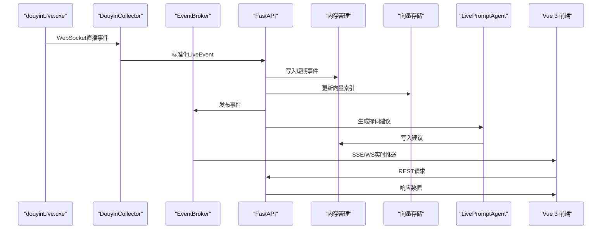

**图表来源**
- [backend/app.py:73-102](file://backend/app.py#L73-L102)
- [backend/services/collector.py:145-196](file://backend/services/collector.py#L145-L196)
- [backend/services/agent.py:105-142](file://backend/services/agent.py#L105-L142)

## 详细组件分析

### 事件采集器组件图

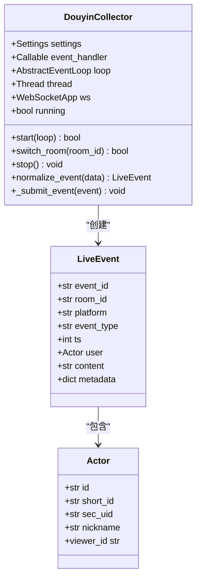

**图表来源**
- [backend/services/collector.py:38-266](file://backend/services/collector.py#L38-L266)
- [backend/schemas/live.py:29-44](file://backend/schemas/live.py#L29-L44)
- [backend/schemas/live.py:8-26](file://backend/schemas/live.py#L8-L26)

### 内存管理组件图

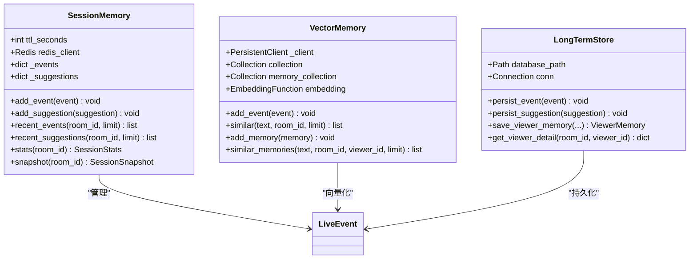

**图表来源**
- [backend/memory/session_memory.py:17-113](file://backend/memory/session_memory.py#L17-L113)
- [backend/memory/vector_store.py:59-317](file://backend/memory/vector_store.py#L59-L317)

### LLM推理引擎组件图

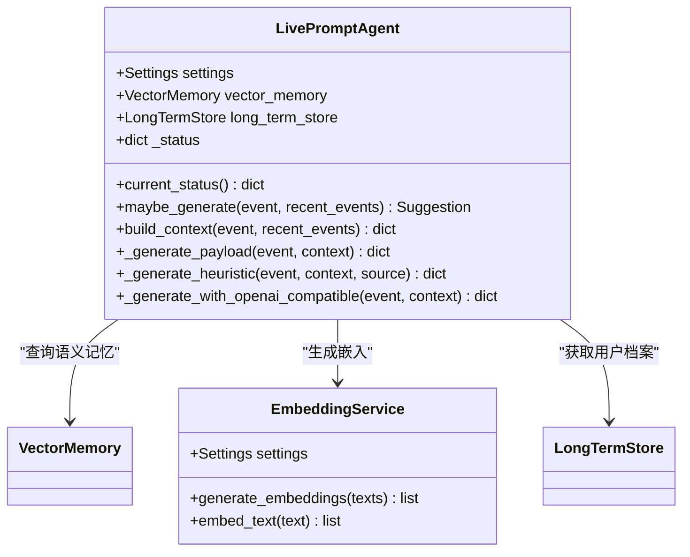

**图表来源**
- [backend/services/agent.py:23-496](file://backend/services/agent.py#L23-L496)

## 部署拓扑

### 单机部署拓扑

单机部署是最简单的部署方式，所有组件运行在同一台机器上：

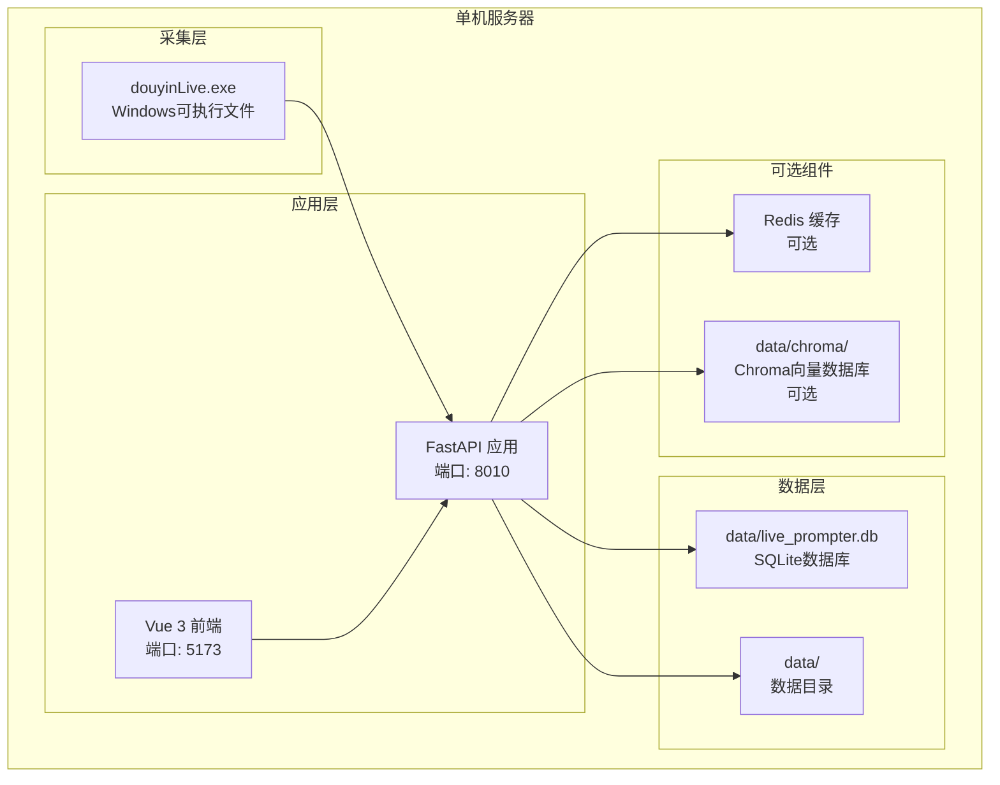

**图表来源**
- [README.md:48-52](file://README.md#L48-L52)
- [backend/config.py:52-82](file://backend/config.py#L52-L82)

### 分布式部署拓扑

分布式部署支持水平扩展，适用于生产环境：

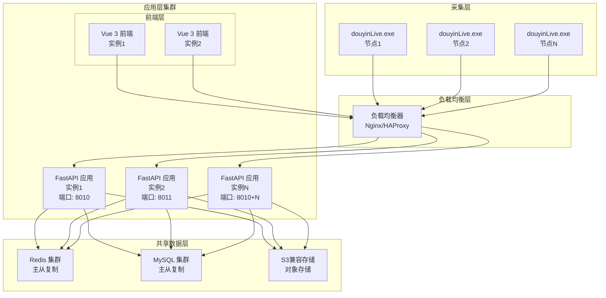

**图表来源**
- [README.md:205-213](file://README.md#L205-L213)
- [backend/config.py:55](file://backend/config.py#L55)

## 容器化部署方案

### Docker Compose 配置

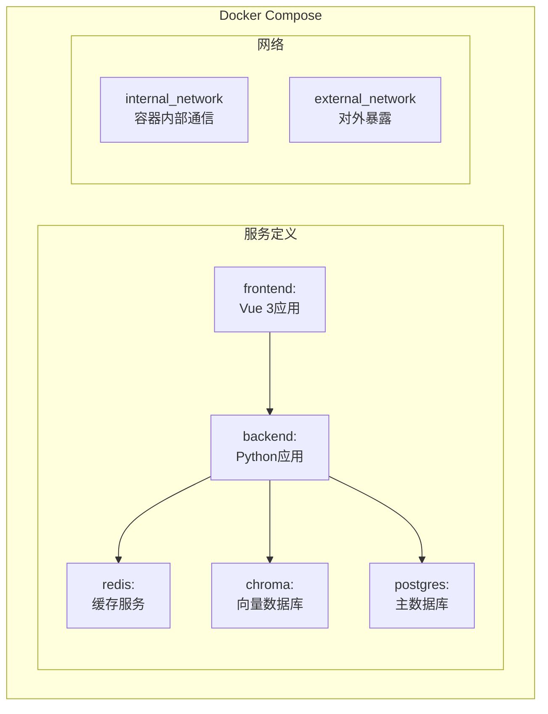

**图表来源**
- [requirements.txt:1-6](file://requirements.txt#L1-L6)
- [frontend/package.json:11-21](file://frontend/package.json#L11-L21)

### 容器部署配置要点

1. **后端服务容器**
   - 基础镜像：python:3.11-slim
   - 端口映射：8010/tcp
   - 环境变量：APP_HOST, APP_PORT, ROOM_ID等
   - 数据卷：/app/data

2. **前端服务容器**
   - 基础镜像：node:18-alpine
   - 端口映射：5173/tcp
   - 环境变量：VITE_BACKEND_URL

3. **数据库容器**
   - Redis：redis:6-alpine
   - Chroma：ghcr.io/chroma-core/chroma:0.5.0
   - PostgreSQL：postgres:15-alpine

## 负载均衡与高可用性

### 负载均衡策略

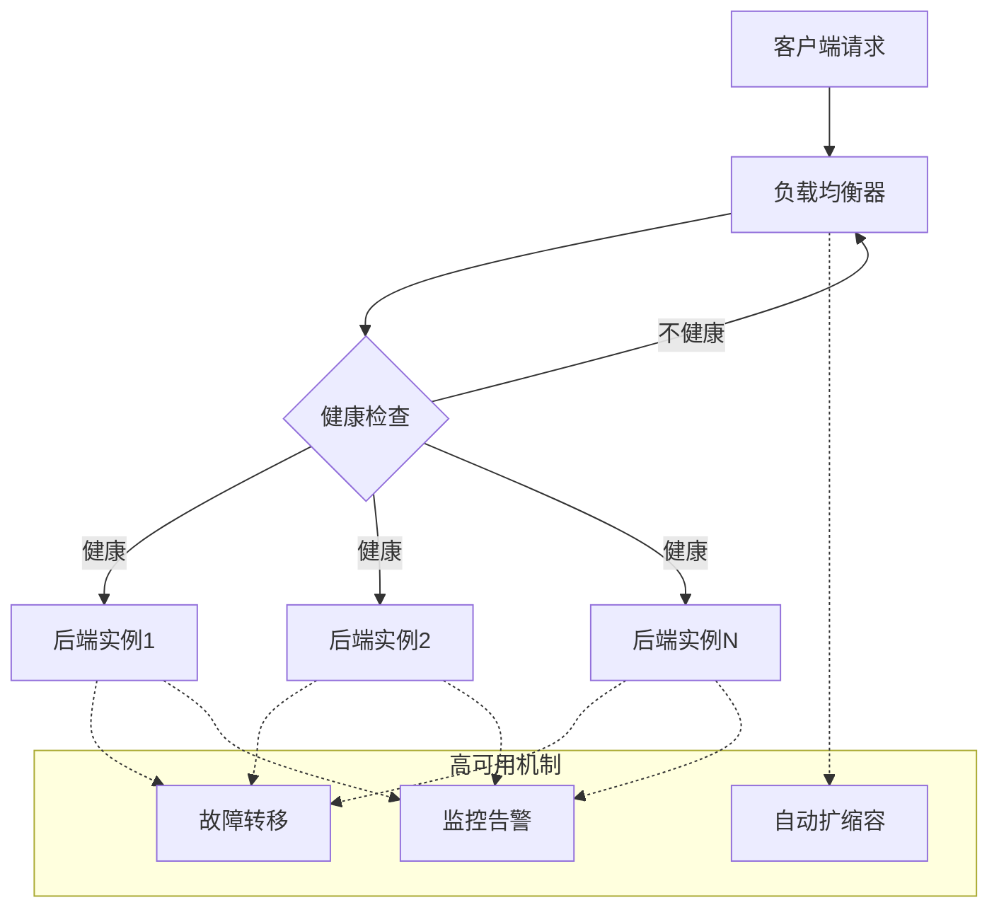

### 故障转移策略

1. **应用层故障转移**
   - 使用健康检查检测后端实例状态
   - 自动将流量切换到健康实例
   - 支持优雅停机和重启

2. **数据层高可用**
   - Redis：主从复制 + Sentinel
   - PostgreSQL：主从复制 + 流复制
   - Chroma：分布式存储

3. **前端层冗余**
   - 多实例部署
   - CDN缓存静态资源
   - 自动故障转移

## 监控与日志

### 监控指标

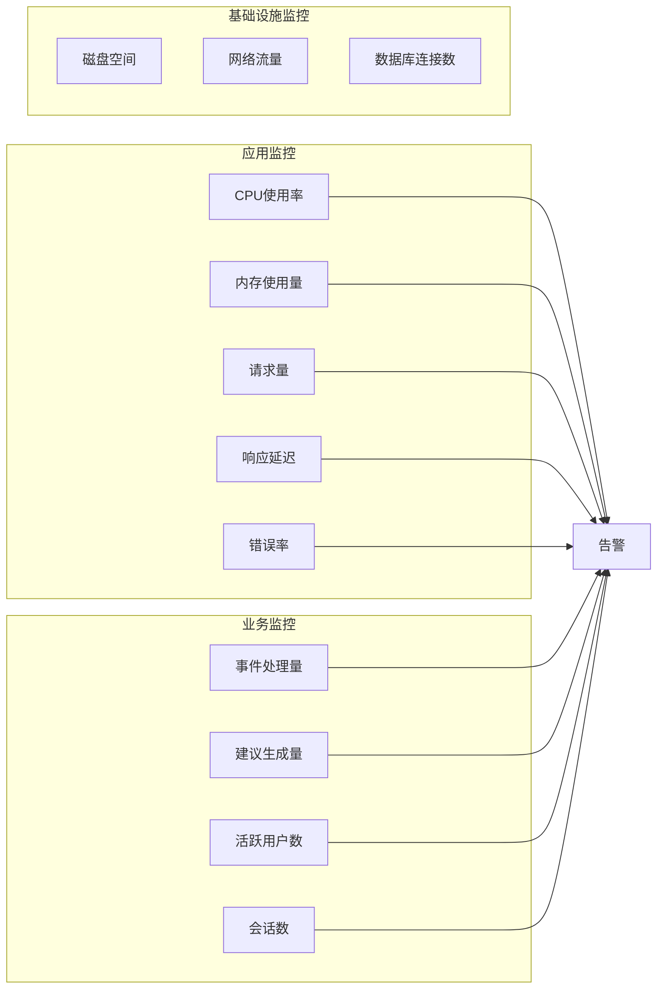

### 日志收集方案

1. **结构化日志**
   - 使用Python logging模块
   - JSON格式输出
   - 包含时间戳、级别、模块、消息

2. **分布式日志**
   - ELK Stack (Elasticsearch, Logstash, Kibana)
   - Fluentd/Falco
   - Prometheus + Grafana

3. **性能监控**
   - Prometheus metrics
   - APM工具 (如New Relic)
   - 自定义指标收集

## 安全配置

### 网络隔离要求

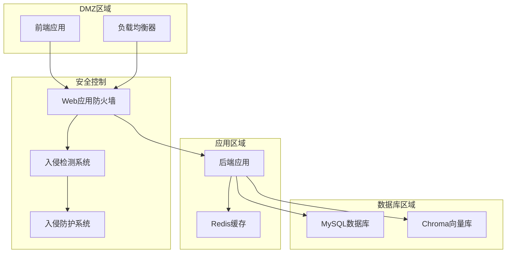

### 安全配置要点

1. **身份认证**
   - JWT令牌管理
   - API密钥轮换
   - OAuth集成

2. **数据保护**
   - HTTPS/TLS加密
   - 数据库加密
   - 敏感信息脱敏

3. **访问控制**
   - RBAC权限管理
   - IP白名单
   - 请求频率限制

## 性能考虑

### 性能优化策略

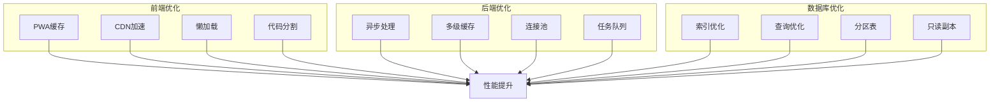

### 性能监控指标

1. **应用性能**
   - 响应时间分布
   - 吞吐量
   - 错误率趋势

2. **资源使用**
   - CPU使用率峰值
   - 内存泄漏检测
   - 磁盘I/O

3. **用户体验**
   - 页面加载时间
   - 交互响应时间
   - 用户留存率

## 故障排除

### 常见问题诊断

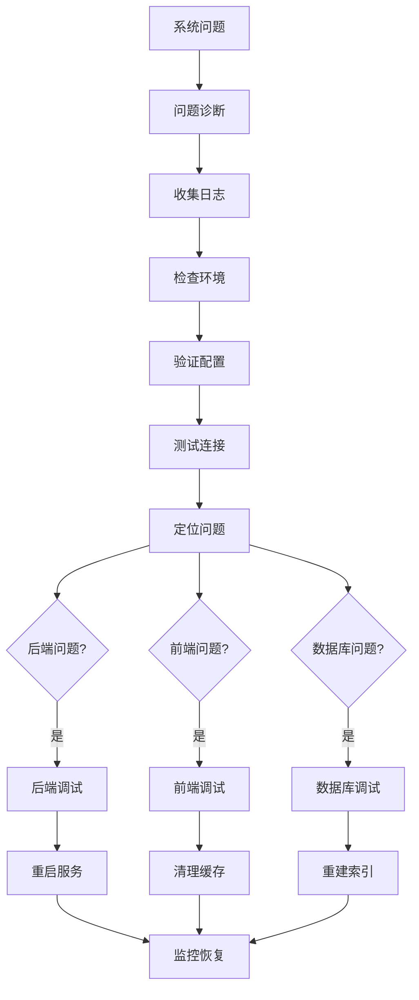

### 故障排除工具

1. **健康检查**
   - /health接口
   - 端口连通性测试
   - 服务状态监控

2. **日志分析**
   - 结构化日志
   - 异常堆栈跟踪
   - 性能分析

3. **数据库维护**
   - 索引优化
   - 表空间检查
   - 连接池监控

**章节来源**
- [backend/app.py:129-135](file://backend/app.py#L129-L135)
- [backend/services/collector.py:118-140](file://backend/services/collector.py#L118-L140)

## 结论

DouYin_llm系统提供了完整的直播提词解决方案，具有以下特点：

1. **模块化设计**：清晰的分层架构，便于维护和扩展
2. **灵活部署**：支持单机和分布式部署模式
3. **高性能**：异步事件驱动架构，支持高并发
4. **可扩展性**：容器化支持，易于水平扩展
5. **可观测性**：完善的监控和日志体系

系统当前版本适合单人本地使用，对于生产环境部署需要增强安全配置、监控告警和高可用性支持。通过合理的架构设计和运维配置，可以满足直播场景的实时性和可靠性要求。