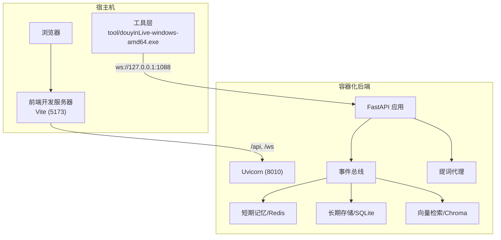
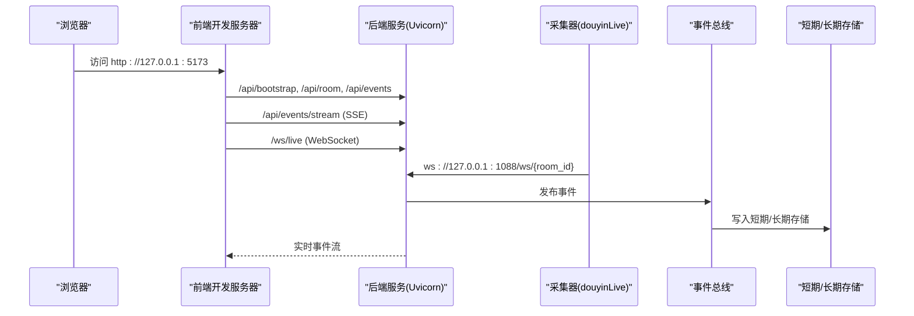
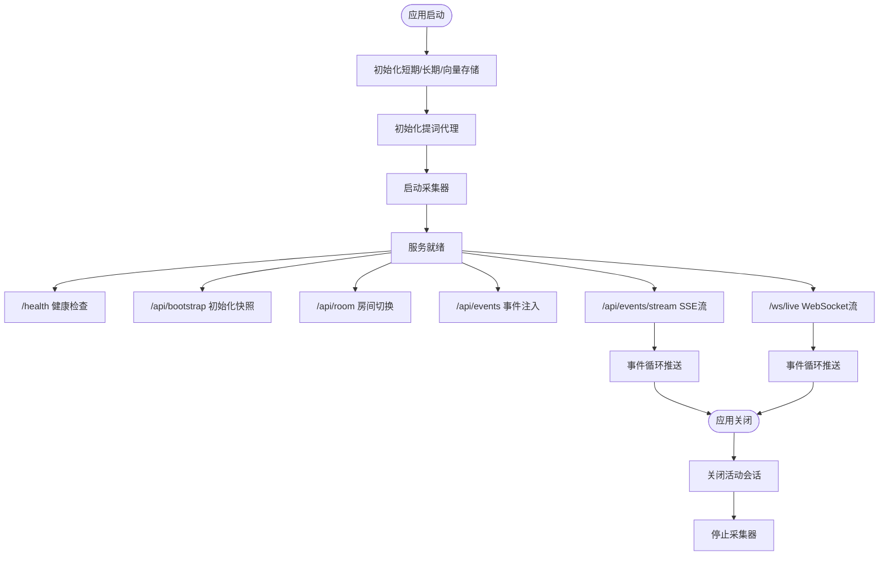
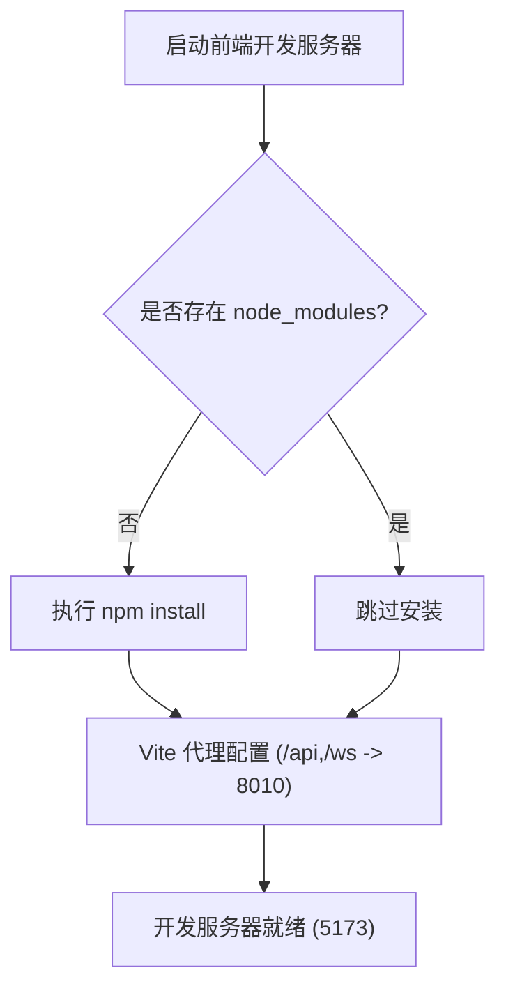
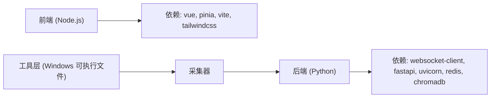

# Docker容器化部署

<cite>
**本文档引用的文件**
- [README.md](file://README.md)
- [USAGE.md](file://USAGE.md)
- [requirements.txt](file://requirements.txt)
- [backend/app.py](file://backend/app.py)
- [backend/config.py](file://backend/config.py)
- [frontend/package.json](file://frontend/package.json)
- [frontend/vite.config.js](file://frontend/vite.config.js)
- [frontend/tailwind.config.js](file://frontend/tailwind.config.js)
- [start_all.ps1](file://start_all.ps1)
- [start_backend_qwen.ps1](file://start_backend_qwen.ps1)
- [start_frontend.ps1](file://start_frontend.ps1)
</cite>

## 目录
1. [简介](#简介)
2. [项目结构](#项目结构)
3. [核心组件](#核心组件)
4. [架构总览](#架构总览)
5. [详细组件分析](#详细组件分析)
6. [依赖关系分析](#依赖关系分析)
7. [性能考虑](#性能考虑)
8. [故障排查指南](#故障排查指南)
9. [结论](#结论)
10. [附录](#附录)

## 简介
本文件面向将该实时提词系统进行容器化部署的需求，提供从镜像构建到容器运行的完整方案。系统由三部分组成：本地抖音消息采集器（Windows可执行文件）、后端FastAPI服务以及前端Vue应用。后端负责事件采集、短期/长期记忆、向量检索、提词建议生成与实时推送；前端通过SSE/WebSocket接收事件流并展示。

## 项目结构
项目采用前后端分离架构，后端使用Python 3.10+与FastAPI，前端使用Vue 3 + Vite。系统默认监听本地回环地址，前端开发服务器通过代理将/api与/ws请求转发至后端8010端口。

**图表来源**
- [backend/app.py:94-220](file://backend/app.py#L94-L220)
- [frontend/vite.config.js:10-22](file://frontend/vite.config.js#L10-L22)
- [README.md:35-48](file://README.md#L35-L48)

**章节来源**
- [README.md:21-34](file://README.md#L21-L34)
- [USAGE.md:15-23](file://USAGE.md#L15-L23)
- [frontend/vite.config.js:10-22](file://frontend/vite.config.js#L10-L22)

## 核心组件
- 后端应用入口与生命周期管理：负责启动采集器、注册路由、处理健康检查、SSE与WebSocket流式推送。
- 配置模块：统一从环境变量与.env文件读取配置，提供默认值与目录确保逻辑。
- 前端开发服务器：通过Vite代理将前端请求转发至后端，便于本地联调。
- 工具层：本地Windows可执行文件提供抖音直播WebSocket消息源。

**章节来源**
- [backend/app.py:84-92](file://backend/app.py#L84-L92)
- [backend/config.py:39-94](file://backend/config.py#L39-L94)
- [frontend/vite.config.js:10-22](file://frontend/vite.config.js#L10-L22)
- [README.md:5-10](file://README.md#L5-L10)

## 架构总览
系统运行时的关键端口与服务：
- 后端服务：默认监听127.0.0.1:8010（可通过环境变量调整）
- 前端开发服务器：默认监听127.0.0.1:5173（可通过Vite配置调整）
- 工具层WebSocket：默认ws://127.0.0.1:1088/ws/{room_id}

容器化部署时，建议将后端暴露为对外服务端口（如8010），前端通过反向代理或直接映射端口提供访问。工具层可在宿主机运行，或通过容器编排方式与后端在同一网络中通信。

**图表来源**
- [backend/app.py:104-220](file://backend/app.py#L104-L220)
- [frontend/vite.config.js:10-22](file://frontend/vite.config.js#L10-L22)
- [README.md:76-80](file://README.md#L76-L80)

**章节来源**
- [backend/app.py:104-220](file://backend/app.py#L104-L220)
- [README.md:136-140](file://README.md#L136-L140)

## 详细组件分析

### 后端服务（FastAPI + Uvicorn）
- 应用入口与生命周期：在应用启动时初始化短期记忆、长期存储、向量检索与提词代理，并启动采集器；在关闭时清理会话并停止采集器。
- 路由与接口：
  - 健康检查：返回服务状态与当前房间信息
  - 初始化快照：返回最近事件、建议、统计与模型状态
  - 房间切换：支持动态切换采集房间
  - 事件注入：手动注入标准化事件，便于联调
  - SSE流：按事件类型推送事件、建议、统计与模型状态
  - WebSocket：推送一次性快照后持续推送事件
- 配置加载：从环境变量与.env文件读取，提供默认值与目录确保逻辑。

**图表来源**
- [backend/app.py:84-92](file://backend/app.py#L84-L92)
- [backend/app.py:104-220](file://backend/app.py#L104-L220)

**章节来源**
- [backend/app.py:84-92](file://backend/app.py#L84-L92)
- [backend/app.py:104-220](file://backend/app.py#L104-L220)
- [backend/config.py:39-94](file://backend/config.py#L39-L94)

### 前端开发服务器（Vite + Vue）
- 代理配置：将/api与/ws请求转发至后端127.0.0.1:8010，便于本地联调
- 依赖管理：通过package.json声明Vue、Pinia与构建工具依赖
- 主题与样式：通过TailwindCSS与自定义变量实现深浅主题切换

**图表来源**
- [frontend/vite.config.js:10-22](file://frontend/vite.config.js#L10-L22)
- [frontend/package.json:1-23](file://frontend/package.json#L1-L23)
- [frontend/tailwind.config.js:1-23](file://frontend/tailwind.config.js#L1-23)

**章节来源**
- [frontend/vite.config.js:10-22](file://frontend/vite.config.js#L10-L22)
- [frontend/package.json:1-23](file://frontend/package.json#L1-L23)
- [frontend/tailwind.config.js:1-23](file://frontend/tailwind.config.js#L1-23)

### 工具层（douyinLive）
- 作用：提供抖音直播WebSocket消息源，后端采集器连接该源并标准化事件
- 默认地址：ws://127.0.0.1:1088/ws/{room_id}
- 配置：可通过工具层配置文件设置登录态等参数

**章节来源**
- [README.md:5-10](file://README.md#L5-L10)
- [README.md:76-80](file://README.md#L76-L80)
- [USAGE.md:49-72](file://USAGE.md#L49-L72)

## 依赖关系分析
- 后端依赖：websocket-client、fastapi、uvicorn、redis、chromadb
- 前端依赖：vue、pinia、vite、tailwindcss等
- 运行时端口：后端8010、前端5173、工具层1088

**图表来源**
- [requirements.txt:1-6](file://requirements.txt#L1-L6)
- [frontend/package.json:11-21](file://frontend/package.json#L11-L21)

**章节来源**
- [requirements.txt:1-6](file://requirements.txt#L1-L6)
- [frontend/package.json:11-21](file://frontend/package.json#L11-L21)

## 性能考虑
- 后端并发与异步：使用FastAPI与异步事件处理，减少阻塞
- 存储选择：Redis用于短期记忆，SQLite用于长期存储，Chroma用于向量检索；可根据资源情况选择启用
- SSE与WebSocket：根据客户端数量与消息频率评估带宽与CPU占用
- 前端代理：开发服务器代理避免跨域问题，生产环境建议通过反向代理统一入口

**章节来源**
- [backend/app.py:1-220](file://backend/app.py#L1-L220)
- [backend/config.py:193-201](file://backend/config.py#L193-L201)

## 故障排查指南
- 页面无建议：检查工具层是否启动、房间ID是否正确、直播间是否开播、后端是否已重启
- 显示回退：检查在线模型API密钥、网络访问与超时设置
- 纯规则模式：检查LLM_MODE配置与.env文件加载
- 前端无法打开：检查前端脚本是否正常启动、5173端口占用情况
- 后端未写入数据：检查工具层WebSocket连接与房间消息是否到达

**章节来源**
- [USAGE.md:198-240](file://USAGE.md#L198-L240)

## 结论
通过容器化部署，可将后端与前端服务解耦并独立扩展。建议采用多阶段构建以减小镜像体积，合理配置环境变量与数据卷挂载，并结合健康检查与重启策略提升稳定性。工具层可在宿主机运行，或通过容器编排与后端共享网络。

## 附录

### Docker镜像构建方案
- 基础镜像选择：建议使用官方Python运行时作为基础镜像，Node.js镜像用于前端构建
- 多阶段构建目标：
  - 第一阶段：安装Node.js依赖并构建前端静态资源
  - 第二阶段：安装Python依赖并复制后端代码，仅打包运行所需文件
- 依赖安装优化策略：
  - 分层缓存：先复制依赖清单再复制源码，最大化利用Docker层缓存
  - 清理构建缓存：构建完成后清理npm/yarn缓存与临时文件
- 镜像大小优化：
  - 使用精简的基础镜像（如Alpine）
  - 合并RUN指令减少层数
  - 使用.gitignore排除不必要的文件

### 容器运行参数配置
- 端口映射：
  - 后端：将容器内部8010端口映射到宿主机可用端口
  - 前端：开发环境可映射5173端口，生产环境通过反向代理暴露
- 环境变量传递：
  - 通过环境变量覆盖APP_HOST、APP_PORT、ROOM_ID、LLM_MODE、LLM_API_KEY等
  - 使用.docker-compose.yml的environment或env_file
- 数据卷挂载：
  - 挂载数据目录（如data/）以持久化SQLite与Chroma数据
  - 挂载日志目录以便排查问题

### 容器间通信与网络配置
- 网络模式：建议使用自定义bridge网络，使后端与工具层在同一网络中
- 服务发现：通过容器名称或自定义网络别名进行通信
- 端口策略：仅暴露必要端口，其余服务通过内部网络访问

### 健康检查与重启策略
- 健康检查：
  - 对后端执行HTTP GET /health，设置合适的超时与重试间隔
- 重启策略：
  - 设置为unless-stopped或on-failure，确保服务异常时自动恢复