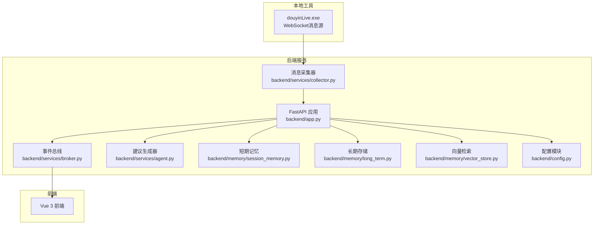
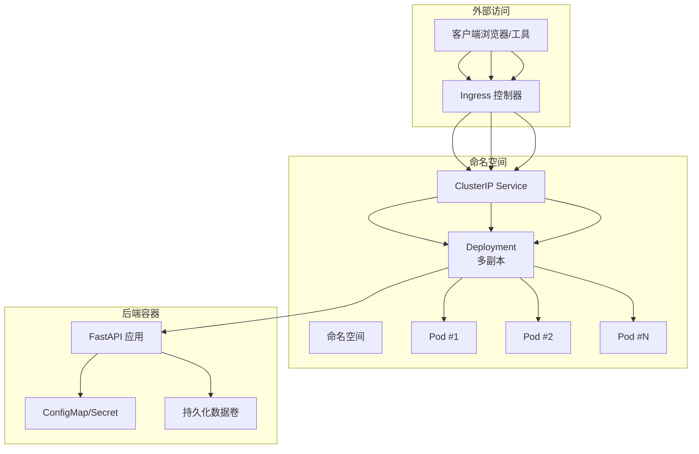
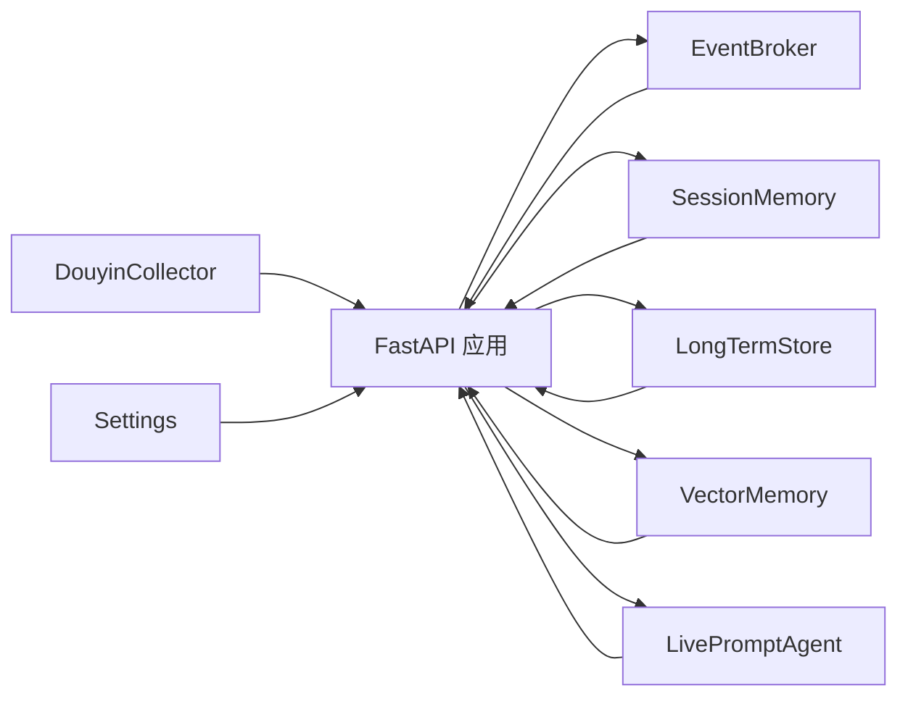

# Kubernetes集群部署

<cite>
**本文档引用的文件**
- [README.md](file://README.md)
- [USAGE.md](file://USAGE.md)
- [requirements.txt](file://requirements.txt)
- [backend/app.py](file://backend/app.py)
- [backend/config.py](file://backend/config.py)
- [backend/services/collector.py](file://backend/services/collector.py)
- [backend/services/agent.py](file://backend/services/agent.py)
- [backend/services/broker.py](file://backend/services/broker.py)
- [backend/memory/session_memory.py](file://backend/memory/session_memory.py)
- [backend/memory/long_term.py](file://backend/memory/long_term.py)
- [backend/memory/vector_store.py](file://backend/memory/vector_store.py)
- [backend/schemas/live.py](file://backend/schemas/live.py)
- [tool/config.yaml](file://tool/config.yaml)
</cite>

## 目录
1. [简介](#简介)
2. [项目结构](#项目结构)
3. [核心组件](#核心组件)
4. [架构总览](#架构总览)
5. [详细组件分析](#详细组件分析)
6. [依赖关系分析](#依赖关系分析)
7. [性能考虑](#性能考虑)
8. [故障排查指南](#故障排查指南)
9. [结论](#结论)
10. [附录](#附录)

## 简介
本项目为面向抖音直播场景的实时提词系统，包含本地消息采集、事件标准化、短期/长期记忆、向量检索、建议生成与前端展示的完整链路。本文档基于现有代码与配置，提供在Kubernetes集群中的部署指导，涵盖Deployment、Service、ConfigMap、Secret等资源配置，以及Service发现、负载均衡、Ingress外部访问、滚动更新、健康检查与故障恢复策略。

## 项目结构
项目采用前后端分离与工具链协同的组织方式：
- backend：FastAPI后端服务，提供REST、SSE、WebSocket接口
- frontend：Vue 3前端应用
- tool：本地抖音消息采集工具（Windows可执行文件）
- data：运行期数据目录（SQLite与Chroma）

**图表来源**
- [backend/app.py:1-220](file://backend/app.py#L1-L220)
- [backend/services/collector.py:1-284](file://backend/services/collector.py#L1-L284)
- [backend/services/broker.py:1-40](file://backend/services/broker.py#L1-L40)
- [backend/services/agent.py:1-393](file://backend/services/agent.py#L1-L393)
- [backend/memory/session_memory.py:1-113](file://backend/memory/session_memory.py#L1-L113)
- [backend/memory/long_term.py:1-750](file://backend/memory/long_term.py#L1-L750)
- [backend/memory/vector_store.py:1-108](file://backend/memory/vector_store.py#L1-L108)
- [backend/config.py:1-94](file://backend/config.py#L1-L94)

**章节来源**
- [README.md:21-34](file://README.md#L21-L34)
- [backend/app.py:1-220](file://backend/app.py#L1-L220)

## 核心组件
- 配置管理：通过环境变量与.env文件加载，支持LLM模式、Redis、Chroma、数据库路径等关键参数
- 事件采集：本地WebSocket消息源标准化为统一LiveEvent
- 事件处理：短期/长期记忆、向量检索、建议生成、事件广播
- 接口服务：健康检查、SSE流、WebSocket、REST API

**章节来源**
- [backend/config.py:39-94](file://backend/config.py#L39-L94)
- [backend/services/collector.py:38-284](file://backend/services/collector.py#L38-L284)
- [backend/services/broker.py:10-40](file://backend/services/broker.py#L10-L40)
- [backend/services/agent.py:23-393](file://backend/services/agent.py#L23-L393)
- [backend/memory/session_memory.py:17-113](file://backend/memory/session_memory.py#L17-L113)
- [backend/memory/long_term.py:36-750](file://backend/memory/long_term.py#L36-L750)
- [backend/memory/vector_store.py:52-108](file://backend/memory/vector_store.py#L52-L108)
- [backend/app.py:104-220](file://backend/app.py#L104-L220)

## 架构总览
Kubernetes部署建议采用多副本Deployment，配合Service进行内部发现与负载均衡；通过Ingress暴露外部访问，结合域名与TLS；使用ConfigMap管理非敏感配置，Secret管理敏感信息如API Key；利用滚动更新策略与健康检查保障服务可用性。

**图表来源**
- [backend/app.py:94-220](file://backend/app.py#L94-L220)
- [backend/config.py:39-94](file://backend/config.py#L39-L94)

## 详细组件分析

### Deployment配置要点
- 副本数：建议至少2个副本，确保滚动更新期间的服务连续性
- 资源限制与请求：根据后端依赖（Redis、Chroma）与并发流量设置CPU/内存配额
- 滚动更新策略：maxUnavailable=25%，maxSurge=25%，确保平滑升级
- Pod就绪探针与存活探针：基于健康检查接口
- 环境变量：通过ConfigMap/Secret注入，避免硬编码

**章节来源**
- [backend/app.py:104-107](file://backend/app.py#L104-L107)
- [backend/config.py:43-61](file://backend/config.py#L43-L61)

### Service与Service发现
- ClusterIP：内部服务发现，供前端与Ingress访问
- 端口映射：APP_PORT对外暴露（默认8010），对应容器端口
- 会话亲和：可按需启用基于客户端IP的亲和性
- 负载均衡：Kubernetes内置轮询策略

**章节来源**
- [backend/config.py:43-44](file://backend/config.py#L43-L44)
- [backend/app.py:94-101](file://backend/app.py#L94-L101)

### ConfigMap与Secret使用
- ConfigMap：存放非敏感配置，如APP_HOST、DATA_DIR、SESSION_TTL_SECONDS等
- Secret：存放敏感信息，如LLM_API_KEY、DASHSCOPE_API_KEY、REDIS_URL等
- 环境变量注入：通过envFrom或env引用ConfigMap/Secret键值

**章节来源**
- [backend/config.py:56-61](file://backend/config.py#L56-L61)
- [USAGE.md:24-47](file://USAGE.md#L24-L47)

### Ingress控制器配置
- IngressClass：指定Ingress控制器（如nginx、contour、traefik）
- TLS：配置证书与密钥，启用HTTPS
- 路由规则：将域名路径转发至后端Service
- 会话保持：可选cookie粘性策略

**章节来源**
- [README.md:130-140](file://README.md#L130-L140)

### 滚动更新策略与健康检查
- 滚动更新：maxUnavailable与maxSurge参数平衡升级速度与可用性
- 健康检查：livenessProbe与readinessProbe基于/health端点
- 故障恢复：Pod重启策略、资源限制防止过载

**章节来源**
- [backend/app.py:104-107](file://backend/app.py#L104-L107)

### 数据持久化与存储
- SQLite：默认数据目录位于DATA_DIR（默认data），可通过PVC挂载持久化
- Redis：可选，通过环境变量REDIS_URL启用；若未配置则退化为进程内内存
- Chroma：可选，通过CHROMA_DIR启用向量检索；未安装时退化为轻量相似度方案

**章节来源**
- [backend/config.py:51-54](file://backend/config.py#L51-L54)
- [backend/memory/session_memory.py:17-31](file://backend/memory/session_memory.py#L17-L31)
- [backend/memory/vector_store.py:52-63](file://backend/memory/vector_store.py#L52-L63)

### 事件处理与内存/存储组件
- 采集器：连接本地WebSocket，标准化事件并提交到事件循环
- 事件总线：SSE/WS订阅与发布
- 短期记忆：Redis或进程内队列，支持TTL
- 长期存储：SQLite表结构与索引，支持会话聚合与用户画像
- 向量检索：Chroma或哈希嵌入函数，提供相似历史检索

**章节来源**
- [backend/services/collector.py:38-284](file://backend/services/collector.py#L38-L284)
- [backend/services/broker.py:10-40](file://backend/services/broker.py#L10-L40)
- [backend/memory/session_memory.py:17-113](file://backend/memory/session_memory.py#L17-L113)
- [backend/memory/long_term.py:36-750](file://backend/memory/long_term.py#L36-L750)
- [backend/memory/vector_store.py:52-108](file://backend/memory/vector_store.py#L52-L108)

### API与接口说明
- 健康检查：GET /health
- 初始化快照：GET /api/bootstrap
- 房间切换：POST /api/room
- 事件注入：POST /api/events
- 实时流：GET /api/events/stream（SSE）
- 实时WS：GET /ws/live

**章节来源**
- [backend/app.py:104-220](file://backend/app.py#L104-L220)

## 依赖关系分析

**图表来源**
- [backend/app.py:25-30](file://backend/app.py#L25-L30)
- [backend/services/collector.py:38-53](file://backend/services/collector.py#L38-L53)
- [backend/services/broker.py:10-14](file://backend/services/broker.py#L10-L14)
- [backend/services/agent.py:23-30](file://backend/services/agent.py#L23-L30)
- [backend/memory/session_memory.py:17-27](file://backend/memory/session_memory.py#L17-L27)
- [backend/memory/long_term.py:36-39](file://backend/memory/long_term.py#L36-L39)
- [backend/memory/vector_store.py:52-59](file://backend/memory/vector_store.py#L52-L59)
- [backend/config.py:39-61](file://backend/config.py#L39-L61)

**章节来源**
- [backend/app.py:25-30](file://backend/app.py#L25-L30)
- [backend/config.py:39-61](file://backend/config.py#L39-L61)

## 性能考虑
- 并发与资源：根据预期并发连接数与SSE/WS订阅数设置CPU/内存请求与限制
- 缓存与索引：Redis短期记忆与SQLite索引优化查询性能
- 向量检索：启用Chroma可提升相似历史检索效率，未安装时使用哈希嵌入函数作为降级方案
- 网络延迟：建议将Ingress与后端部署在同一可用区，减少跨区网络开销

## 故障排查指南
- 页面无建议：检查本地消息源是否运行、ROOM_ID是否正确、后端是否重启
- 模型回退：检查LLM API Key、网络连通性与超时设置
- 前端无法访问：检查端口占用与Ingress配置
- 后端未写入数据：确认消息源连接与房间开播状态

**章节来源**
- [USAGE.md:198-240](file://USAGE.md#L198-L240)

## 结论
本文档基于现有代码与配置，给出了Kubernetes集群部署的实施建议，覆盖资源配置、服务发现、Ingress外部访问、配置与密钥管理、滚动更新与健康检查等关键环节。建议在生产环境中结合监控与日志体系，持续优化资源配额与探针阈值，确保系统的稳定性与可维护性。

## 附录
- 环境变量与端口
  - APP_HOST/APP_PORT：服务监听地址与端口
  - ROOM_ID：采集房间标识
  - LLM_MODE/LLM_API_KEY/LLM_BASE_URL/LLM_MODEL：模型相关配置
  - REDIS_URL：可选Redis连接
  - DATA_DIR/DATABASE_PATH/CHROMA_DIR：数据与模型存储路径
  - SESSION_TTL_SECONDS：短期记忆TTL

**章节来源**
- [backend/config.py:43-61](file://backend/config.py#L43-L61)
- [USAGE.md:24-47](file://USAGE.md#L24-L47)