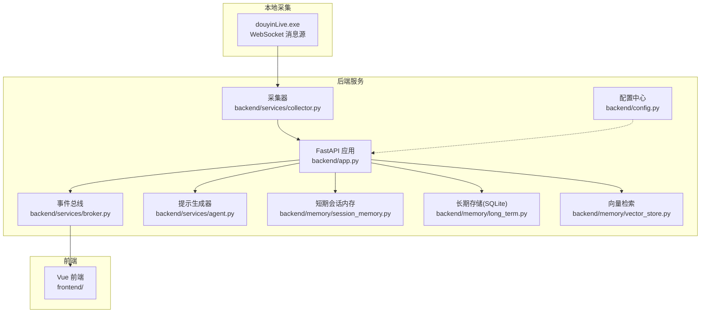
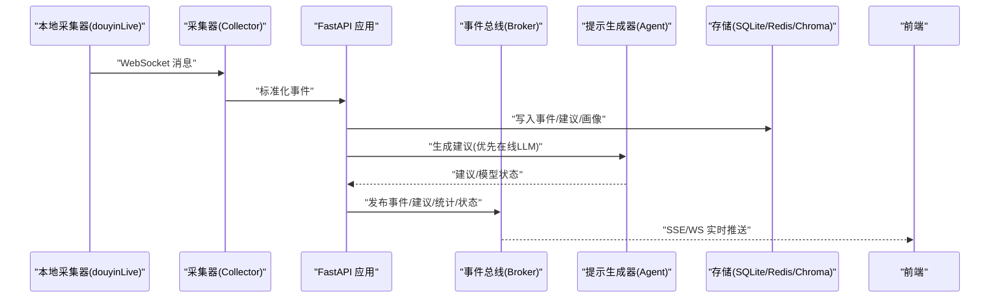
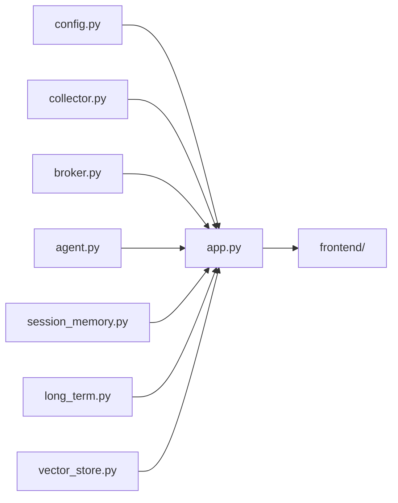

# 云平台部署

<cite>
**本文引用的文件**
- [README.md](file://README.md)
- [USAGE.md](file://USAGE.md)
- [backend/app.py](file://backend/app.py)
- [backend/config.py](file://backend/config.py)
- [backend/services/agent.py](file://backend/services/agent.py)
- [backend/services/broker.py](file://backend/services/broker.py)
- [backend/services/collector.py](file://backend/services/collector.py)
- [backend/memory/long_term.py](file://backend/memory/long_term.py)
- [backend/memory/session_memory.py](file://backend/memory/session_memory.py)
- [backend/memory/vector_store.py](file://backend/memory/vector_store.py)
- [data/DATABASE.md](file://data/DATABASE.md)
- [requirements.txt](file://requirements.txt)
- [frontend/package.json](file://frontend/package.json)
- [tool/config.yaml](file://tool/config.yaml)
</cite>

## 目录
1. [简介](#简介)
2. [项目结构](#项目结构)
3. [核心组件](#核心组件)
4. [架构总览](#架构总览)
5. [详细组件分析](#详细组件分析)
6. [依赖关系分析](#依赖关系分析)
7. [性能考量](#性能考量)
8. [故障排查指南](#故障排查指南)
9. [结论](#结论)
10. [附录](#附录)

## 简介
本项目为面向抖音直播场景的实时提词系统，包含本地消息采集、事件标准化、短期/长期存储、向量检索、提示建议生成与前端实时展示。本文档聚焦于如何在主流云平台（AWS、Azure、阿里云）进行容器化部署与运维，涵盖容器服务选择、存储与网络配置、云原生集成（监控告警、日志、自动扩缩容）、跨区域与高可用设计以及成本优化与资源监控方案。

## 项目结构
项目采用前后端分离与本地采集器协同的架构：
- 后端：FastAPI 应用，提供健康检查、SSE/WS 实时流、REST API
- 采集器：本地工具提供 WebSocket 消息源，后端通过 Collector 组件接入
- 存储：短期会话（可选 Redis）、长期 SQLite、可选向量库（Chroma）
- 前端：Vue 3 + Pinia + Tailwind，提供实时状态与建议展示

图表来源
- [backend/app.py:1-220](file://backend/app.py#L1-L220)
- [backend/services/collector.py:1-284](file://backend/services/collector.py#L1-L284)
- [backend/services/broker.py:1-40](file://backend/services/broker.py#L1-L40)
- [backend/services/agent.py:1-393](file://backend/services/agent.py#L1-L393)
- [backend/memory/session_memory.py:1-113](file://backend/memory/session_memory.py#L1-L113)
- [backend/memory/long_term.py:1-750](file://backend/memory/long_term.py#L1-L750)
- [backend/memory/vector_store.py:1-108](file://backend/memory/vector_store.py#L1-L108)
- [backend/config.py:1-94](file://backend/config.py#L1-L94)

章节来源
- [README.md:21-34](file://README.md#L21-L34)
- [backend/app.py:94-220](file://backend/app.py#L94-L220)
- [backend/config.py:39-94](file://backend/config.py#L39-L94)

## 核心组件
- 配置中心：集中管理运行时配置（主机、端口、房间号、采集器参数、LLM 模式与凭据、存储路径等）
- 采集器：连接本地 WebSocket 消息源，标准化为统一事件模型并提交至事件总线
- 事件总线：进程内异步广播，供 SSE/WS 订阅
- 提示生成器：优先调用 OpenAI 兼容接口，失败回退本地规则
- 存储层：
  - 短期会话：可选 Redis（持久化热数据）或进程内内存
  - 长期存储：SQLite（事件、建议、观众画像、场次、备注）
  - 向量检索：可选 Chroma（持久化向量）或本地哈希近似方案
- 前端：实时展示事件流、建议、统计与模型状态

章节来源
- [backend/config.py:39-94](file://backend/config.py#L39-L94)
- [backend/services/collector.py:38-284](file://backend/services/collector.py#L38-L284)
- [backend/services/broker.py:10-40](file://backend/services/broker.py#L10-L40)
- [backend/services/agent.py:23-393](file://backend/services/agent.py#L23-L393)
- [backend/memory/session_memory.py:17-113](file://backend/memory/session_memory.py#L17-L113)
- [backend/memory/long_term.py:36-750](file://backend/memory/long_term.py#L36-L750)
- [backend/memory/vector_store.py:52-108](file://backend/memory/vector_store.py#L52-L108)

## 架构总览
系统运行链路：本地采集器 -> 后端 FastAPI -> 事件总线 -> SSE/WS -> 前端；同时写入短期/长期存储与向量库，生成建议并回传前端。

图表来源
- [backend/services/collector.py:117-284](file://backend/services/collector.py#L117-L284)
- [backend/app.py:61-78](file://backend/app.py#L61-L78)
- [backend/services/agent.py:73-114](file://backend/services/agent.py#L73-L114)
- [backend/services/broker.py:28-40](file://backend/services/broker.py#L28-L40)
- [backend/memory/long_term.py:420-454](file://backend/memory/long_term.py#L420-L454)
- [backend/memory/session_memory.py:42-84](file://backend/memory/session_memory.py#L42-L84)
- [backend/memory/vector_store.py:64-83](file://backend/memory/vector_store.py#L64-L83)

## 详细组件分析

### 配置与运行参数
- 关键配置项：APP_HOST/APP_PORT、ROOM_ID、COLLECTOR_*、REDIS_URL、DATA_DIR/DATABASE_PATH/CHROMA_DIR、LLM_MODE/LLM_BASE_URL/LLM_MODEL/API_KEY/TEMP/TIMEOUT
- 配置加载顺序：优先 .env，其次系统环境变量
- LLM 解析：根据模式解析最终调用地址与模型名

章节来源
- [backend/config.py:11-36](file://backend/config.py#L11-L36)
- [backend/config.py:43-91](file://backend/config.py#L43-L91)
- [USAGE.md:24-48](file://USAGE.md#L24-L48)

### 采集器与事件处理
- 采集器负责连接本地 WebSocket，标准化消息为统一事件模型
- 事件进入后端事件循环，写入短期/长期存储，触发建议生成与事件总线广播
- 支持房间切换、断线重连、心跳保活

章节来源
- [backend/services/collector.py:38-284](file://backend/services/collector.py#L38-L284)
- [backend/app.py:61-78](file://backend/app.py#L61-L78)

### 事件总线与实时推送
- 事件总线维护订阅队列，支持 SSE 与 WebSocket
- SSE 采用 Server-Sent Events，WS 直接推送 JSON 包裹的事件

章节来源
- [backend/services/broker.py:10-40](file://backend/services/broker.py#L10-L40)
- [backend/app.py:187-220](file://backend/app.py#L187-L220)

### 提示生成器与回退策略
- 优先调用 OpenAI 兼容接口（DashScope/OpenAI 等），失败回退本地规则
- 规则覆盖礼物、关注、评论等典型场景，保证在模型异常时仍可稳定输出

章节来源
- [backend/services/agent.py:23-393](file://backend/services/agent.py#L23-L393)
- [backend/config.py:70-91](file://backend/config.py#L70-L91)

### 存储层设计
- 短期会话：Redis（可选）或进程内内存，支持 TTL 控制热数据生命周期
- 长期存储：SQLite，包含事件、建议、观众画像、礼物聚合、直播场次、备注
- 向量检索：可选 Chroma（持久化向量）或本地哈希近似方案，保障检索能力

章节来源
- [backend/memory/session_memory.py:17-113](file://backend/memory/session_memory.py#L17-L113)
- [backend/memory/long_term.py:36-750](file://backend/memory/long_term.py#L36-L750)
- [backend/memory/vector_store.py:52-108](file://backend/memory/vector_store.py#L52-L108)
- [data/DATABASE.md:1-151](file://data/DATABASE.md#L1-L151)

### 前端与依赖
- 前端基于 Vue 3 + Pinia + Tailwind，提供实时状态、事件流、建议展示与主题切换
- 依赖管理与构建脚本位于前端 package.json

章节来源
- [frontend/package.json:1-23](file://frontend/package.json#L1-L23)
- [README.md:318-329](file://README.md#L318-L329)

## 依赖关系分析
- 后端应用依赖配置、采集器、事件总线、提示生成器与存储模块
- 存储模块之间弱耦合，便于按需启用 Redis/Chroma
- 前端通过 SSE/WS 与后端交互，无后端依赖

图表来源
- [backend/app.py:13-30](file://backend/app.py#L13-L30)
- [backend/config.py:39-94](file://backend/config.py#L39-L94)
- [backend/services/collector.py:16-21](file://backend/services/collector.py#L16-L21)
- [backend/services/broker.py:10-21](file://backend/services/broker.py#L10-L21)
- [backend/services/agent.py:23-30](file://backend/services/agent.py#L23-L30)
- [backend/memory/session_memory.py:17-31](file://backend/memory/session_memory.py#L17-L31)
- [backend/memory/long_term.py:36-40](file://backend/memory/long_term.py#L36-L40)
- [backend/memory/vector_store.py:52-63](file://backend/memory/vector_store.py#L52-L63)

## 性能考量
- 事件处理路径短、无阻塞 IO：采集器在独立线程中处理 WS，通过线程安全的协程调度提交事件，降低主线程阻塞风险
- 存储层可选：Redis 用于短期热数据，Chroma 用于向量检索，SQLite 作为长期存储，满足不同延迟与容量需求
- SSE/WS 广播：事件总线采用异步队列，避免订阅端阻塞
- LLM 回退：当在线模型不可用时，本地规则仍可稳定输出，保障业务连续性

章节来源
- [backend/services/collector.py:117-214](file://backend/services/collector.py#L117-L214)
- [backend/services/broker.py:28-40](file://backend/services/broker.py#L28-L40)
- [backend/services/agent.py:96-114](file://backend/services/agent.py#L96-L114)

## 故障排查指南
- 页面无建议
  - 检查本地采集器是否启动、房间号是否正确、直播间是否开播
  - 后端是否已重启到最新版本
- 顶部显示 fallback
  - 检查 LLM 凭据、网络访问、超时与限流
- 顶部显示 heuristic
  - 检查 .env 中 LLM_MODE 设置或环境变量加载
- 前端无法打开
  - 检查前端脚本是否正常启动、端口是否被占用
- 后端启动但未写入数据
  - 检查采集器是否连接到 WebSocket、房间是否产生消息

章节来源
- [USAGE.md:198-240](file://USAGE.md#L198-L240)

## 结论
该系统具备清晰的模块化结构与可选增强能力，适合在云平台上进行容器化部署与弹性扩展。通过合理选择容器服务、存储与网络配置，并结合云原生监控与自动扩缩容能力，可在多区域与高可用场景下稳定运行。

## 附录

### 云平台部署最佳实践

#### AWS 部署步骤
- 容器服务选择
  - ECS：适合现有 Docker 化应用快速上线，配合 ECR 管理镜像
  - EKS：适合需要 Kubernetes 管理与弹性扩缩容的场景
- 存储服务配置
  - 对象存储：S3 用于静态资源与日志归档
  - 数据库：RDS（PostgreSQL/MySQL）或 Aurora 用于生产级持久化（如需替换 SQLite）
- 网络配置
  - VPC：隔离后端与存储，仅开放必要端口
  - 安全组：仅放行 80/443 与内部管理端口
  - 负载均衡：ALB/NLB 提供入口流量分发
- 云原生集成
  - 监控告警：CloudWatch + SNS
  - 日志收集：CloudWatch Logs + FireLens
  - 自动扩缩容：ECS/EKS + HPA/HPA（基于 CPU/内存或自定义指标）
- 跨区域与高可用
  - 多可用区部署，跨区备份与灾备
  - 使用 Route 53 + 健康检查实现故障转移
- 成本优化
  - Spot 实例/预留实例组合
  - EBS 优化与生命周期策略
  - CloudWatch 指标与预算告警

#### Azure 部署步骤
- 容器服务选择
  - AKS：Kubernetes 管理，适合弹性与自动化
- 存储服务配置
  - 对象存储：Blob Storage 用于静态资源与日志
  - 数据库：Azure SQL/PostgreSQL 用于生产级持久化
- 网络配置
  - VNet：隔离后端与存储
  - NSG：最小权限放行
  - 负载均衡：Azure Load Balancer/Ingress Controller
- 云原生集成
  - 监控告警：Azure Monitor + Action Groups
  - 日志收集：Log Analytics + KQL 查询
  - 自动扩缩容：KEDA + HPA
- 跨区域与高可用
  - 多区域部署 + Traffic Manager/AGW
- 成本优化
  - 节点池与 Spot VM
  - 自动化清理与资源标签

#### 阿里云部署步骤
- 容器服务选择
  - ACK：Kubernetes 管理，适合弹性与自动化
- 存储服务配置
  - 对象存储：OSS 用于静态资源与日志
  - 数据库：RDS/Polardb 用于生产级持久化
- 网络配置
  - VPC：隔离后端与存储
  - 安全组：最小权限放行
  - 负载均衡：SLB/Ingress
- 云原生集成
  - 监控告警：云监控 + 钉钉/短信
  - 日志收集：SLS + 可视化面板
  - 自动扩缩容：HPA/KEDA
- 跨区域与高可用
  - 多可用区与跨区容灾
- 成本优化
  - 包年包月与资源组
  - 自动化运维与资源回收

#### 通用运维建议
- 监控与告警
  - 指标：CPU/内存/磁盘/网络/请求延迟/错误率
  - 日志：结构化日志、采样与分级
  - 告警：阈值与趋势告警、收敛策略
- 自动扩缩容
  - 基于 CPU/内存/请求速率/队列长度
  - 预测性扩缩容（可选）
- 配置与密钥管理
  - 使用平台密钥管理服务（AWS Secrets Manager/Azure Key Vault/阿里云 KMS）
- 安全加固
  - 最小权限 IAM/RBAC、TLS/证书管理、WAF/IPS
- 备份与恢复
  - 定期备份 SQLite/Redis/Chroma 数据
  - RPO/RTO 明确与演练

#### 资源使用监控方案
- 指标采集
  - 容器：CPU/内存/IO/网络
  - 应用：请求速率、响应时间、错误率、队列长度
  - 存储：读写吞吐、IOPS、空间使用
- 可视化与仪表盘
  - 平台自带控制台或第三方可视化（如 Grafana）
- 告警策略
  - 分级告警、静默窗口、抑制规则
- 成本分析
  - 资源标签、成本中心划分、趋势分析