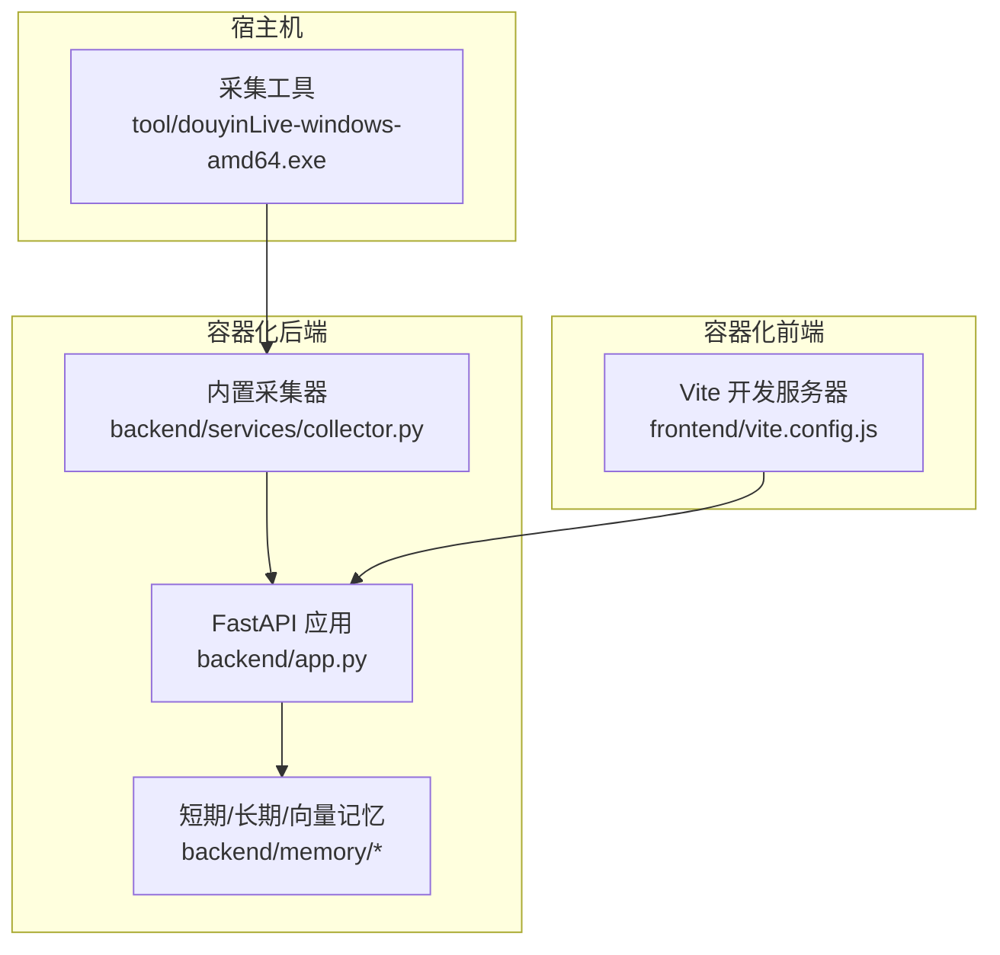
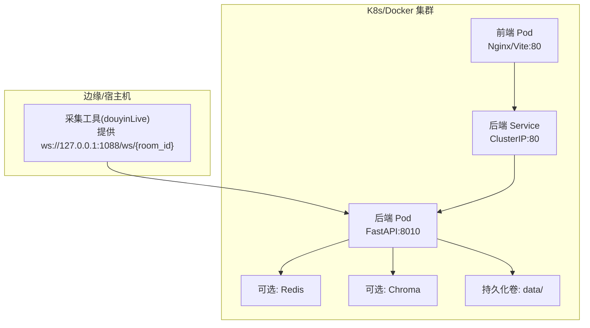
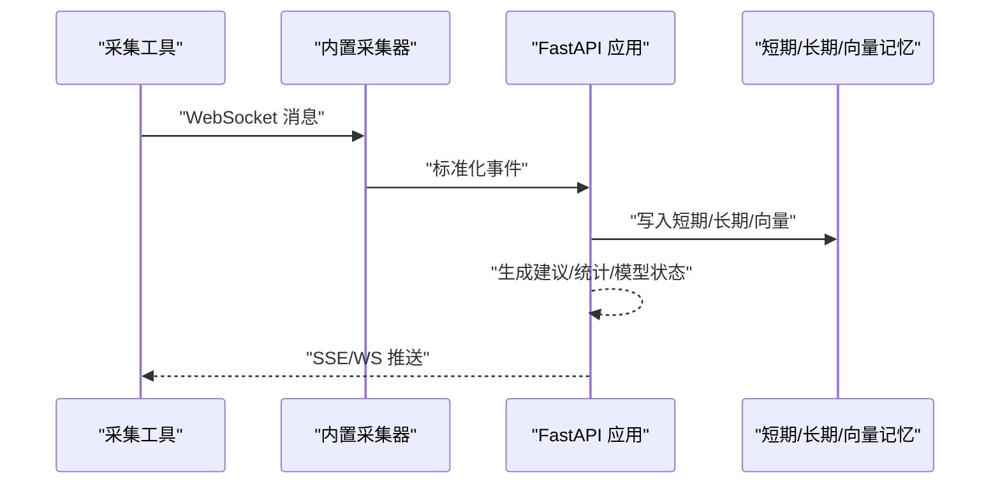
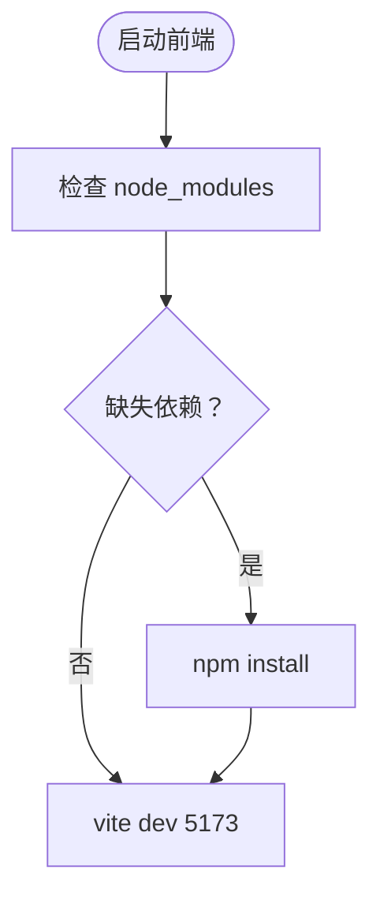
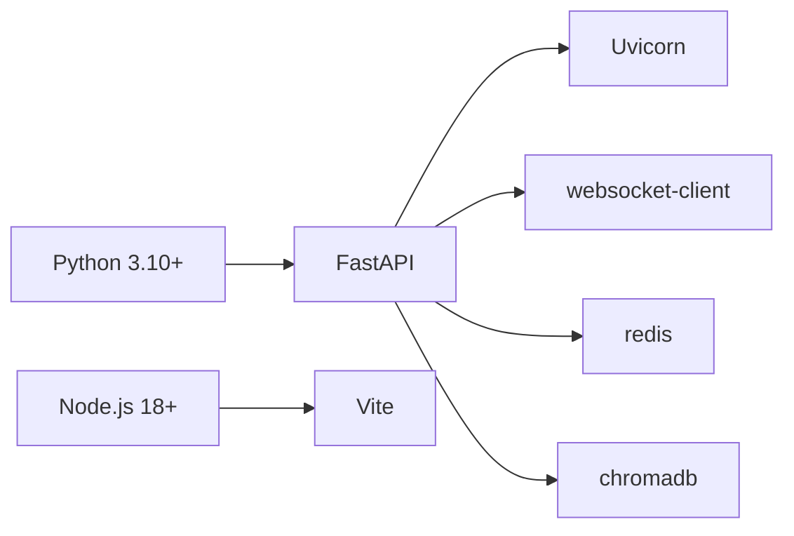

# 容器化部署

<cite>
**本文引用的文件**
- [README.md](file://README.md)
- [USAGE.md](file://USAGE.md)
- [requirements.txt](file://requirements.txt)
- [backend/app.py](file://backend/app.py)
- [backend/config.py](file://backend/config.py)
- [backend/services/collector.py](file://backend/services/collector.py)
- [backend/memory/vector_store.py](file://backend/memory/vector_store.py)
- [frontend/package.json](file://frontend/package.json)
- [frontend/vite.config.js](file://frontend/vite.config.js)
- [frontend/tailwind.config.js](file://frontend/tailwind.config.js)
- [start_all.ps1](file://start_all.ps1)
- [start_backend_qwen.ps1](file://start_backend_qwen.ps1)
- [start_frontend.ps1](file://start_frontend.ps1)
- [tool/config.yaml](file://tool/config.yaml)
</cite>

## 目录
1. [简介](#简介)
2. [项目结构](#项目结构)
3. [核心组件](#核心组件)
4. [架构总览](#架构总览)
5. [详细组件分析](#详细组件分析)
6. [依赖分析](#依赖分析)
7. [性能考虑](#性能考虑)
8. [故障排查指南](#故障排查指南)
9. [结论](#结论)
10. [附录](#附录)

## 简介
本文件面向将该抖音直播实时提词系统进行容器化部署的需求，提供覆盖 Docker 与 Kubernetes 的完整方案。内容涵盖：
- Docker 镜像构建（含多阶段构建、镜像优化、安全基线）
- Docker Compose 编排（后端、前端、采集工具、数据库、可选缓存）
- Kubernetes 部署清单（Deployment、Service、ConfigMap、Secret、持久化卷）
- 云平台部署最佳实践（AWS、Azure、阿里云）
- 关键技术点：容器网络、存储卷挂载、环境变量与密钥管理

## 项目结构
该项目由三大部分构成：
- 后端服务：FastAPI 应用，负责事件采集、短期/长期记忆、向量检索、提词建议生成与实时推送
- 前端应用：Vue 3 + Vite 开发服务器，通过代理转发到后端
- 采集工具：本地可执行程序，提供 WebSocket 消息源；后端内置采集器亦可直接消费

图表来源
- [backend/app.py:1-220](file://backend/app.py#L1-L220)
- [backend/services/collector.py:1-284](file://backend/services/collector.py#L1-L284)
- [frontend/vite.config.js:1-23](file://frontend/vite.config.js#L1-L23)

章节来源
- [README.md:1-349](file://README.md#L1-L349)
- [USAGE.md:1-256](file://USAGE.md#L1-L256)

## 核心组件
- 后端应用
  - 入口与生命周期：应用启动时初始化事件总线、短期记忆、长期存储、向量记忆与提词代理，并在 lifespan 中启动采集器
  - 接口：健康检查、房间切换、事件注入、SSE/WS 实时流、会话与查看者相关接口
- 配置系统
  - 从 .env 与环境变量加载，支持房间号、采集器参数、数据目录、数据库路径、Chroma 目录、Redis 连接、LLM 模式与凭据等
- 内置采集器
  - 连接本地 WebSocket，标准化为统一事件，投递到事件循环并回调处理
- 记忆与检索
  - 短期记忆：可选 Redis；长期存储：SQLite；向量检索：可选 Chroma，不可用时回退为本地哈希嵌入与文本相似度
- 前端
  - Vite 开发服务器，代理到后端 8010 端口；生产构建产物可由反向代理提供

章节来源
- [backend/app.py:1-220](file://backend/app.py#L1-L220)
- [backend/config.py:1-94](file://backend/config.py#L1-L94)
- [backend/services/collector.py:1-284](file://backend/services/collector.py#L1-L284)
- [backend/memory/vector_store.py:1-108](file://backend/memory/vector_store.py#L1-L108)
- [frontend/vite.config.js:1-23](file://frontend/vite.config.js#L1-L23)

## 架构总览
下图展示容器化后的典型拓扑：采集工具在宿主机或独立容器中提供 WebSocket；后端容器消费事件并写入本地数据目录；前端容器通过反向代理访问后端；可选 Redis 与 Chroma 作为增强组件。

图表来源
- [backend/app.py:104-220](file://backend/app.py#L104-L220)
- [backend/config.py:43-61](file://backend/config.py#L43-L61)
- [backend/memory/vector_store.py:52-108](file://backend/memory/vector_store.py#L52-L108)

## 详细组件分析

### 后端服务（FastAPI）
- 端口与网络
  - 监听地址与端口由配置决定；默认 127.0.0.1:8010，可通过环境变量调整
- 生命周期与资源
  - 应用启动时创建数据目录，初始化短期/长期/向量记忆，启动采集器；关闭时清理会话并停止采集
- 接口族
  - 健康检查、房间切换、事件注入、SSE/WS 实时流、会话与查看者查询
- 采集链路
  - 若启用内置采集器且房间号有效，则在生命周期内建立 WebSocket 连接，周期性 Ping 维持，异常重连

图表来源
- [backend/services/collector.py:117-181](file://backend/services/collector.py#L117-L181)
- [backend/app.py:61-78](file://backend/app.py#L61-L78)
- [backend/app.py:187-220](file://backend/app.py#L187-L220)

章节来源
- [backend/app.py:1-220](file://backend/app.py#L1-L220)
- [backend/config.py:43-61](file://backend/config.py#L43-L61)
- [backend/services/collector.py:1-284](file://backend/services/collector.py#L1-L284)

### 前端服务（Vite）
- 开发代理
  - 将 /api 与 /ws 代理至后端 8010 端口，便于前后端同域开发
- 端口
  - 默认 5173，可通过命令行参数调整
- 生产构建
  - 建议将构建产物置于 Nginx/反向代理提供静态资源

图表来源
- [frontend/vite.config.js:10-22](file://frontend/vite.config.js#L10-L22)
- [start_frontend.ps1:15-22](file://start_frontend.ps1#L15-L22)

章节来源
- [frontend/vite.config.js:1-23](file://frontend/vite.config.js#L1-L23)
- [start_frontend.ps1:1-22](file://start_frontend.ps1#L1-L22)

### 采集工具（宿主机/容器）
- 本地 WebSocket
  - 默认监听 ws://127.0.0.1:1088/ws/{room_id}
- 配置
  - 可通过配置文件设置端口、Cookie 等（仅用于本地采集）

章节来源
- [README.md:76-80](file://README.md#L76-L80)
- [tool/config.yaml:1-14](file://tool/config.yaml#L1-L14)

### 记忆与检索（可选增强）
- Redis
  - 短期记忆可选后端；未配置时退化为进程内内存
- SQLite
  - 长期存储默认文件位于 data/live_prompter.db
- Chroma
  - 可选向量检索；不可用时回退为本地哈希嵌入与文本相似度

章节来源
- [backend/config.py:54-55](file://backend/config.py#L54-L55)
- [backend/config.py:52-53](file://backend/config.py#L52-L53)
- [backend/memory/vector_store.py:13-16](file://backend/memory/vector_store.py#L13-L16)
- [backend/memory/vector_store.py:52-108](file://backend/memory/vector_store.py#L52-L108)

## 依赖分析
- 运行时依赖
  - Python 3.10+、Node.js 18+（前端）
  - 后端依赖：FastAPI、Uvicorn、WebSocket 客户端、Redis、Chroma
- 端口与协议
  - 后端：HTTP(SSE/WS)/TCP 8010
  - 前端：HTTP TCP 5173
  - 采集：WebSocket TCP 1088

图表来源
- [requirements.txt:1-6](file://requirements.txt#L1-L6)
- [frontend/package.json:11-22](file://frontend/package.json#L11-L22)

章节来源
- [requirements.txt:1-6](file://requirements.txt#L1-L6)
- [README.md:50-65](file://README.md#L50-L65)

## 性能考虑
- 后端并发与异步
  - 使用异步事件处理与队列，避免阻塞 IO；SSE/WS 为长连接，注意心跳与断线重连
- 记忆层优化
  - Redis 用于短期记忆可显著降低内存压力；Chroma 用于向量检索时建议预热与分片
- 前端静态化
  - 生产构建后由 Nginx 提供静态资源，减少前端容器 CPU 占用
- 端口与网络
  - 后端仅绑定 127.0.0.1 时需通过反向代理暴露；若需跨容器访问，应调整监听地址

## 故障排查指南
- 页面空白或无建议
  - 检查采集工具是否运行、房间号是否正确、后端是否连接到 WebSocket
- 顶部显示回退或规则模式
  - 检查 LLM 凭据、网络连通性、超时与限流
- 前端无法访问
  - 检查前端端口占用与代理配置
- 后端未写入数据
  - 查看后端日志中是否已连接到 WebSocket 地址

章节来源
- [USAGE.md:198-240](file://USAGE.md#L198-L240)

## 结论
通过容器化，可将采集工具、后端、前端与可选的 Redis/Chroma 解耦部署，提升可维护性与弹性。结合多阶段构建与最小化运行时镜像，可在保证功能的前提下降低攻击面与资源消耗。Kubernetes 清单建议采用 ConfigMap/Secret 管理配置与密钥，持久化卷承载数据目录，Service 暴露后端接口，Ingress/NLB 对外提供访问。

## 附录

### Docker 镜像构建（多阶段与优化）
- 基础镜像选择
  - 运行时使用精简的基础镜像（如 Debian/Alpine），仅包含运行时所需组件
- 多阶段构建
  - 阶段一：安装构建依赖，构建前端静态资源
  - 阶段二：复制前端产物与后端依赖，安装运行时依赖，创建非特权用户，设置工作目录与入口
- 安全与合规
  - 固定依赖版本，启用只读根文件系统，禁用不必要的权限
- 运行参数
  - 暴露端口：8010（后端）、5173（前端开发）、1088（采集工具，按需）
  - 健康检查：/health
  - 环境变量：通过 ConfigMap/Secret 注入

### Docker Compose 编排（后端、前端、采集、数据库、缓存）
- 服务
  - backend：运行后端应用，挂载数据目录，暴露 8010
  - frontend：运行 Nginx 提供静态资源，或运行 Vite 开发服务器（开发）
  - collector：运行采集工具（可选，或使用后端内置采集器）
  - redis：可选短期记忆
  - chroma：可选向量检索
- 网络
  - 自定义桥接网络，容器间通过服务名通信
- 存储
  - 使用命名卷或主机挂载 data/ 目录，持久化 SQLite 与 Chroma 数据

### Kubernetes 部署清单（Deployment、Service、ConfigMap、Secret、持久化卷）
- ConfigMap
  - 暴露非敏感配置（如房间号、采集器参数、LLM 模式）
- Secret
  - 暴露敏感信息（如 API Key、数据库密码）
- Deployment
  - 后端：副本数、探针、资源限制与请求
  - 前端：副本数、静态资源提供
- Service
  - ClusterIP 暴露后端 8010；NodePort/NLB 暴露前端 80
- PersistentVolumeClaim
  - 挂载 data/ 目录，确保数据持久化
- Ingress
  - 提供域名与 TLS 终止，转发到前端 Service

### 云平台部署最佳实践（AWS/Azure/阿里云）
- AWS
  - EKS + ALB Ingress；使用 IAM Roles for Service Accounts（IRSA）管理 Secret；EFS/PersistentVolumes
- Azure
  - AKS + Application Gateway；Azure Key Vault 管理 Secret；Azure Files/PersistentVolumes
- 阿里云
  - ACK + SLB；KMS/Secret Manager 管理密钥；NAS/PersistentVolumes
- 通用建议
  - 分离开发/测试/生产命名空间；启用网络策略；使用 Helm/Terraform 管理基础设施与应用

### 容器网络、存储与环境变量
- 网络
  - 后端与前端通过 Service 互联；采集工具可运行在宿主机或独立容器；WebSocket 与 SSE 需通过反向代理透传
- 存储
  - data/ 目录挂载为持久卷；SQLite 与 Chroma 数据持久化
- 环境变量
  - 通过 ConfigMap/Secret 注入；后端优先读取 .env，其次读取环境变量