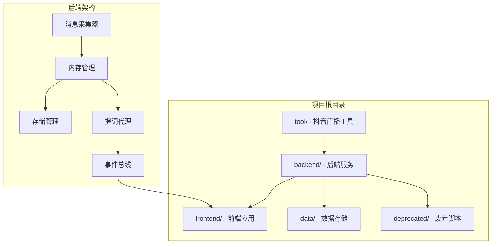
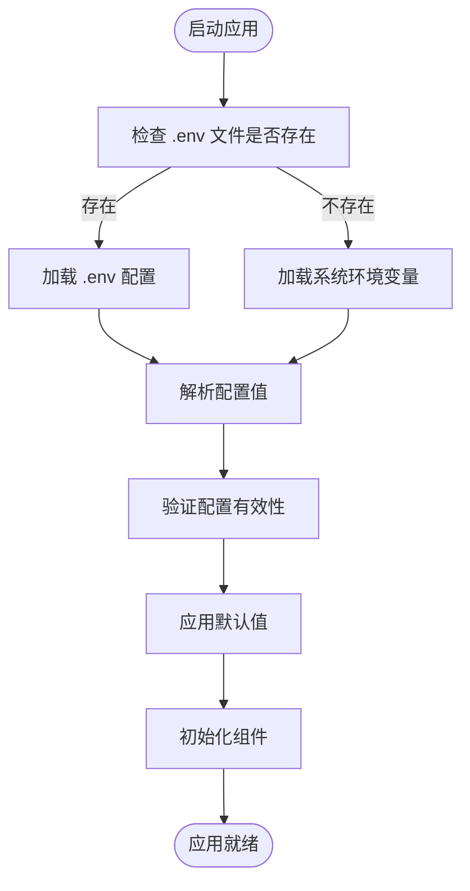
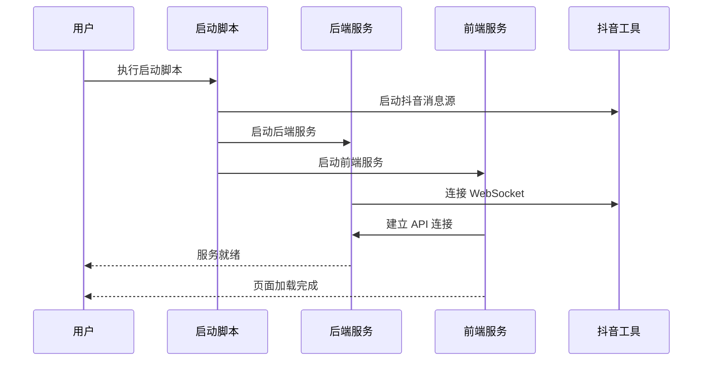

# 开发环境搭建

<cite>
**本文档引用的文件**
- [README.md](file://README.md)
- [USAGE.md](file://USAGE.md)
- [requirements.txt](file://requirements.txt)
- [backend/config.py](file://backend/config.py)
- [backend/app.py](file://backend/app.py)
- [backend/services/collector.py](file://backend/services/collector.py)
- [backend/services/agent.py](file://backend/services/agent.py)
- [frontend/package.json](file://frontend/package.json)
- [start_all.ps1](file://start_all.ps1)
- [start_all.bat](file://start_all.bat)
- [start_backend_qwen.ps1](file://start_backend_qwen.ps1)
- [start_frontend.ps1](file://start_frontend.ps1)
- [tool/config.yaml](file://tool/config.yaml)
- [data/DATABASE.md](file://data/DATABASE.md)
</cite>

## 目录
1. [简介](#简介)
2. [项目结构](#项目结构)
3. [系统要求](#系统要求)
4. [环境变量配置](#环境变量配置)
5. [依赖安装步骤](#依赖安装步骤)
6. [启动方式](#启动方式)
7. [故障排除指南](#故障排除指南)
8. [总结](#总结)

## 简介

这是一个面向抖音直播场景的实时提词项目，采用前后端分离架构设计。项目由三个主要部分组成：

1. **tool/** 目录下的 `douyinLive-windows-amd64.exe` - 负责连接直播间并在本地暴露 WebSocket 消息源
2. **backend/** + **frontend/** - 负责事件采集、短期记忆、长期存储、向量检索、提词建议生成和前端展示
3. **deprecated/** - 保留旧版脚本，仅用于历史参考

项目核心能力包括：从本地 `douyinLive` WebSocket 持续接收直播事件、将原始消息标准化为统一 `LiveEvent`、保存最近会话数据和长期历史数据、基于启发式规则或 OpenAI 兼容接口生成提词建议、通过 SSE/ WebSocket 向前端实时推送事件和建议。

## 项目结构



**图表来源**
- [backend/app.py:1-220](file://backend/app.py#L1-L220)
- [backend/config.py:1-94](file://backend/config.py#L1-L94)

**章节来源**
- [README.md:21-34](file://README.md#L21-L34)
- [backend/app.py:1-220](file://backend/app.py#L1-L220)

## 系统要求

### 硬件和操作系统要求

- **操作系统**: Windows 环境（项目明确要求）
- **Python**: 3.10+ 版本
- **Node.js**: 18+ 版本
- **可选组件**: 
  - Redis（用于短期记忆）
  - ChromaDB（用于向量检索）

### 环境要求详细说明

根据项目文档，系统要求包括：

1. **Windows 环境**: 项目专门为 Windows 平台开发，使用 PowerShell 脚本进行启动
2. **Python 3.10+**: 后端使用 Python 3.10+ 运行时
3. **Node.js 18+**: 前端使用 Node.js 18+ 进行开发和构建
4. **可选组件**: Redis 和 ChromaDB 为可选增强功能

**章节来源**
- [README.md:50-56](file://README.md#L50-L56)
- [USAGE.md:15-22](file://USAGE.md#L15-L22)

## 环境变量配置

### 配置文件位置和加载机制

项目启动时会优先读取根目录 `.env` 文件，如果不存在则读取当前 shell 环境变量。配置文件采用简单的 `KEY=VALUE` 格式，支持注释和空行。

### 关键配置项详解

#### 直播与采集配置

```env
ROOM_ID=32137571630          # 直播间标识符
COLLECTOR_ENABLED=true       # 是否启用内置采集器
COLLECTOR_HOST=127.0.0.1     # 采集器主机地址
COLLECTOR_PORT=1088          # 采集器端口号
COLLECTOR_PING_INTERVAL_SECONDS=30    # 心跳间隔秒数
COLLECTOR_RECONNECT_DELAY_SECONDS=3   # 重连延迟秒数
```

#### 后端服务配置

```env
APP_HOST=127.0.0.1           # 应用监听地址
APP_PORT=8010               # 应用端口号
```

#### 模型相关配置

```env
LLM_MODE=qwen              # 模型模式：heuristic/qwen/openai
DASHSCOPE_API_KEY=         # 百炼 API 密钥
LLM_BASE_URL=             # 模型服务基础 URL
LLM_MODEL=qwen-plus-latest # 模型名称
LLM_TIMEOUT_SECONDS=6      # 请求超时时间
LLM_TEMPERATURE=0.4        # 生成温度
```

#### 存储与记忆配置

```env
REDIS_URL=                 # Redis 连接字符串
DATA_DIR=data             # 数据目录
DATABASE_PATH=data/live_prompter.db  # SQLite 数据库路径
CHROMA_DIR=data/chroma   # Chroma 向量数据库目录
SESSION_TTL_SECONDS=14400 # 会话过期时间（秒）
```

### 配置加载机制



**图表来源**
- [backend/config.py:11-36](file://backend/config.py#L11-L36)
- [backend/config.py:39-94](file://backend/config.py#L39-L94)

**章节来源**
- [README.md:142-207](file://README.md#L142-L207)
- [backend/config.py:11-94](file://backend/config.py#L11-L94)

## 依赖安装步骤

### Python 后端依赖安装

#### 方法一：使用 requirements.txt（推荐）

```powershell
pip install -r requirements.txt
```

#### 方法二：手动安装

```powershell
pip install websocket-client>=1.6.0
pip install fastapi>=0.115.0
pip install uvicorn>=0.30.0
pip install redis>=5.0.0
pip install chromadb>=0.5.0
```

**requirements.txt 包含的依赖说明**：
- `websocket-client`: WebSocket 客户端，用于连接抖音直播消息源
- `fastapi`: Web 框架，提供 REST API 和实时通信接口
- `uvicorn`: ASGI 服务器，用于运行 FastAPI 应用
- `redis`: Redis 客户端，用于短期记忆存储
- `chromadb`: 向量数据库客户端，用于相似事件检索

### Node.js 前端依赖安装

```powershell
cd frontend
npm install
```

**前端依赖说明**：
- `vue`: Vue 3 框架
- `pinia`: 状态管理
- `tailwindcss`: CSS 框架
- `vite`: 构建工具

### 可选组件安装

#### Redis 安装（可选）

```powershell
# Windows 上推荐使用 Docker
docker run -d --name redis -p 6379:6379 redis:alpine

# 或者使用 Redis 官方 Windows 版本
# 下载地址：https://github.com/microsoftarchive/redis/releases
```

#### ChromaDB 安装（可选）

```powershell
pip install chromadb>=0.5.0
```

**章节来源**
- [requirements.txt:1-6](file://requirements.txt#L1-L6)
- [frontend/package.json:11-22](file://frontend/package.json#L11-L22)
- [USAGE.md:73-87](file://USAGE.md#L73-L87)

## 启动方式

### 手动启动步骤

#### 1. 启动抖音消息源

```powershell
# 启动本地消息源程序
.\tool\douyinLive-windows-amd64.exe
```

默认情况下，后端会连接：
```
ws://127.0.0.1:1088/ws/{ROOM_ID}
```

#### 2. 配置环境变量

```powershell
# 复制示例配置文件
Copy-Item .env.example .env

# 编辑 .env 文件，至少填写以下内容：
# ROOM_ID=你的直播间标识
# LLM_MODE=qwen
# DASHSCOPE_API_KEY=你的百炼APIKey
# LLM_BASE_URL=https://dashscope.aliyuncs.com/compatible-mode/v1
# LLM_MODEL=qwen-plus-latest
# LLM_TIMEOUT_SECONDS=6
```

#### 3. 安装后端依赖

```powershell
pip install -r requirements.txt
```

#### 4. 启动后端服务

```powershell
python -m uvicorn backend.app:app --host 127.0.0.1 --port 8010 --reload
```

#### 5. 启动前端服务

```powershell
cd frontend
npm install
npm run dev -- --host 127.0.0.1 --strictPort --port 5173
```

### 自动启动脚本

#### 使用项目自带脚本

```powershell
# 同时启动所有服务
.\start_all.ps1

# 分别启动后端和前端
.\start_backend_qwen.ps1
.\start_frontend.ps1
```

#### 脚本功能说明



**图表来源**
- [start_all.ps1:1-18](file://start_all.ps1#L1-L18)
- [start_backend_qwen.ps1:1-13](file://start_backend_qwen.ps1#L1-L13)
- [start_frontend.ps1:1-22](file://start_frontend.ps1#L1-L22)

**章节来源**
- [README.md:66-129](file://README.md#L66-L129)
- [USAGE.md:24-114](file://USAGE.md#L24-L114)
- [start_all.ps1:1-18](file://start_all.ps1#L1-L18)

## 故障排除指南

### 常见问题及解决方案

#### 1. 页面打开但无提词建议

**可能原因**：
- `tool/douyinLive-windows-amd64.exe` 未启动
- `.env` 中的 `ROOM_ID` 设置错误
- 直播间未开播或无消息
- 后端未重启到最新版本

**解决步骤**：
1. 确认抖音消息源已启动
2. 检查 `.env` 文件中的 `ROOM_ID` 设置
3. 验证直播间状态
4. 重启后端服务

#### 2. 顶部显示 `fallback`

**含义**：Qwen 调用失败，系统正在使用规则兜底

**排查重点**：
- `DASHSCOPE_API_KEY` 是否正确
- 网络是否能访问百炼服务
- 是否触发超时或限流

#### 3. 顶部显示 `heuristic`

**含义**：当前使用本地规则模式

**可能原因**：
- `.env` 中设置了 `LLM_MODE=heuristic`
- 环境变量未正确加载

#### 4. 前端无法打开

**排查步骤**：
1. 检查 `start_frontend.ps1` 是否正常启动
2. 确认 `5173` 端口未被占用

#### 5. 后端启动但无数据写入

**排查要点**：
1. 确认 `tool/douyinLive-windows-amd64.exe` 已运行
2. 查看后端日志中是否连接到 `ws://127.0.0.1:1088/ws/{room_id}`
3. 确认当前房间确实有消息

### 调试工具

#### 使用调试客户端

```powershell
python deprecated/debug_client.py
```

该工具会：
- 打印完整 JSON 消息
- 写日志到 `logs/` 目录
- 帮助确认消息结构和采集状态

**章节来源**
- [USAGE.md:179-240](file://USAGE.md#L179-L240)

## 总结

本项目提供了完整的抖音直播实时提词解决方案，具有以下特点：

### 核心优势
1. **完整的端到端架构**：从直播消息采集到前端展示的完整链路
2. **灵活的模型选择**：支持在线模型和本地规则两种模式
3. **可扩展性设计**：Redis 和 ChromaDB 为可选增强组件
4. **完善的监控和调试**：丰富的状态信息和调试工具

### 开发体验
1. **简洁的启动流程**：提供一键启动脚本
2. **清晰的配置管理**：基于 `.env` 文件的配置系统
3. **跨平台支持**：Windows 专用优化
4. **完善的文档**：详细的使用说明和故障排除指南

### 技术栈亮点
- **后端**：FastAPI + Uvicorn，高性能异步处理
- **前端**：Vue 3 + Pinia + Tailwind，现代化前端框架
- **消息处理**：WebSocket + SSE 实时通信
- **数据存储**：SQLite + 可选 Redis + 可选 ChromaDB

项目适合希望快速搭建直播场景实时提词系统的开发者，既可作为生产环境使用，也可作为学习和二次开发的基础框架。