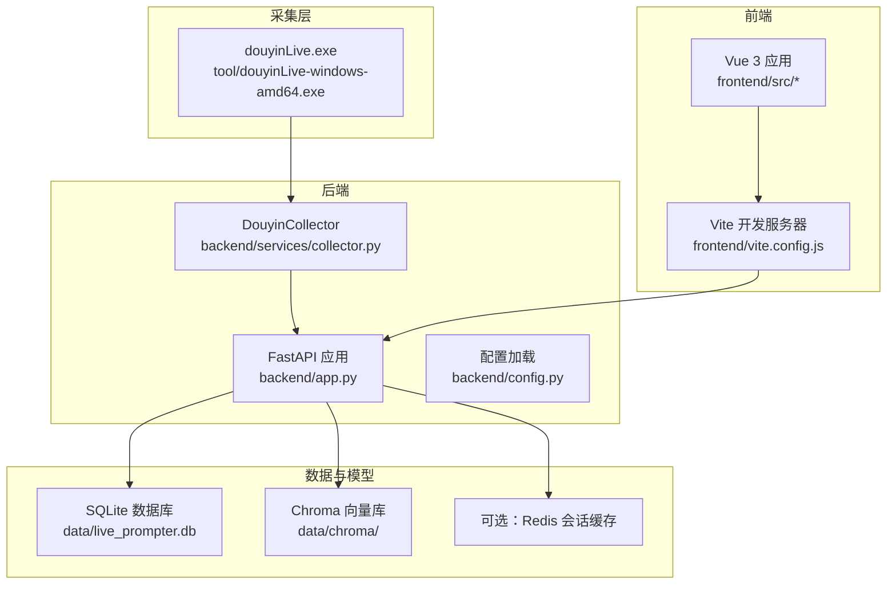
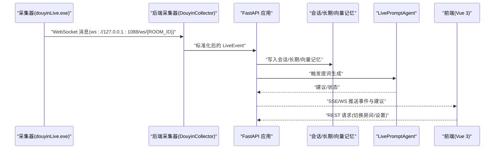
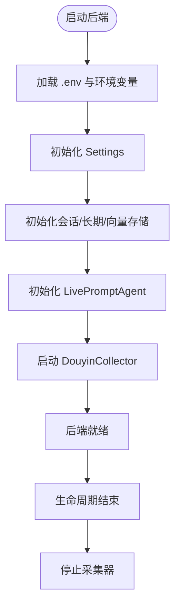
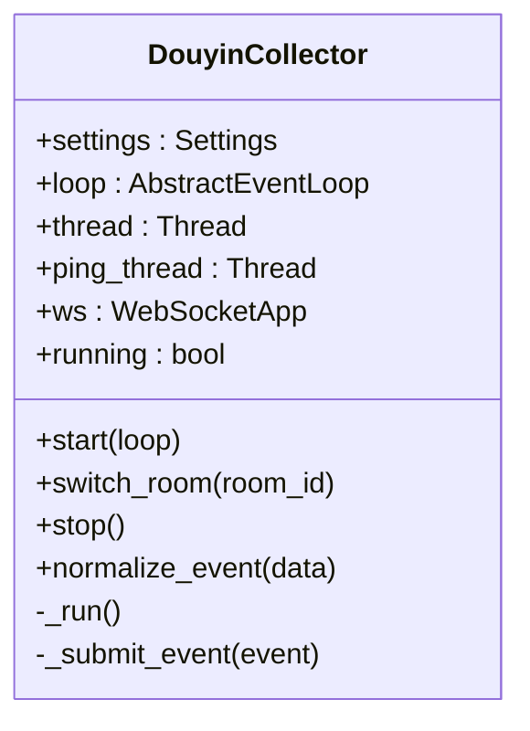
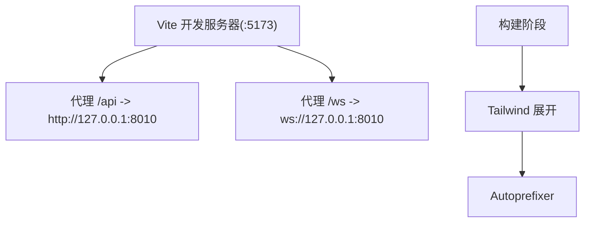
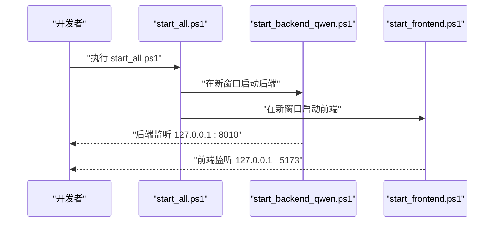
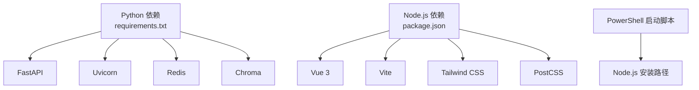

# 开发环境部署

<cite>
**本文引用的文件**
- [README.md](file://README.md)
- [USAGE.md](file://USAGE.md)
- [requirements.txt](file://requirements.txt)
- [package.json](file://frontend/package.json)
- [backend/config.py](file://backend/config.py)
- [backend/app.py](file://backend/app.py)
- [backend/services/collector.py](file://backend/services/collector.py)
- [frontend/vite.config.js](file://frontend/vite.config.js)
- [frontend/tailwind.config.js](file://frontend/tailwind.config.js)
- [frontend/postcss.config.js](file://frontend/postcss.config.js)
- [start_all.ps1](file://start_all.ps1)
- [start_backend_qwen.ps1](file://start_backend_qwen.ps1)
- [start_frontend.ps1](file://start_frontend.ps1)
- [tool/config.yaml](file://tool/config.yaml)
</cite>

## 目录
1. [简介](#简介)
2. [项目结构](#项目结构)
3. [核心组件](#核心组件)
4. [架构总览](#架构总览)
5. [详细组件分析](#详细组件分析)
6. [依赖分析](#依赖分析)
7. [性能考虑](#性能考虑)
8. [故障排查指南](#故障排查指南)
9. [结论](#结论)
10. [附录](#附录)

## 简介
本指南面向Windows用户，提供DouYin_llm项目的完整开发环境部署流程，涵盖Python 3.10+、Node.js 18+的安装配置、pip与npm依赖安装、.env环境变量配置、启动脚本使用方法及组件启动顺序与依赖关系说明，并给出常见问题排查与解决方案。

## 项目结构
项目采用前后端分离架构：
- 后端：FastAPI应用，负责事件采集、存储、记忆抽取、LLM提词与实时推送
- 前端：Vue 3 + Vite应用，通过代理访问后端REST与WebSocket
- 采集器：独立的Windows可执行文件，提供douyinLive WebSocket服务
- 工具与配置：工具配置文件、Tailwind/CSS处理链、启动脚本

图表来源
- [backend/app.py:108-126](file://backend/app.py#L108-L126)
- [backend/services/collector.py:38-100](file://backend/services/collector.py#L38-L100)
- [frontend/vite.config.js:8-22](file://frontend/vite.config.js#L8-L22)

章节来源
- [README.md:32-44](file://README.md#L32-L44)
- [backend/app.py:108-126](file://backend/app.py#L108-L126)
- [frontend/vite.config.js:8-22](file://frontend/vite.config.js#L8-L22)

## 核心组件
- 后端配置模块：从.env与环境变量加载配置，提供默认值，确保本地开箱即用
- FastAPI应用：提供REST接口、SSE与WebSocket，负责事件处理、会话与记忆管理、LLM提词
- 采集器：连接本地douyinLive WebSocket，标准化事件并提交到后端事件循环
- 前端Vite：代理后端REST/WS，开发时提供热更新与构建产物

章节来源
- [backend/config.py:12-37](file://backend/config.py#L12-L37)
- [backend/app.py:108-126](file://backend/app.py#L108-L126)
- [backend/services/collector.py:38-100](file://backend/services/collector.py#L38-L100)
- [frontend/vite.config.js:8-22](file://frontend/vite.config.js#L8-L22)

## 架构总览
下图展示了从采集到前端展示的端到端数据流与组件交互：

图表来源
- [backend/services/collector.py:141-180](file://backend/services/collector.py#L141-L180)
- [backend/app.py:73-102](file://backend/app.py#L73-L102)
- [frontend/vite.config.js:12-20](file://frontend/vite.config.js#L12-L20)

## 详细组件分析

### 后端配置与启动流程
- 配置加载：优先从.env读取，其次环境变量，最后代码默认值
- 启动顺序：FastAPI生命周期中启动采集器，停止时清理资源
- 依赖组件：会话内存、长期存储、向量存储、嵌入服务、提词代理

图表来源
- [backend/config.py:12-37](file://backend/config.py#L12-L37)
- [backend/app.py:24-35](file://backend/app.py#L24-L35)
- [backend/app.py:108-116](file://backend/app.py#L108-L116)

章节来源
- [backend/config.py:40-112](file://backend/config.py#L40-L112)
- [backend/app.py:24-35](file://backend/app.py#L24-L35)
- [backend/app.py:108-116](file://backend/app.py#L108-L116)

### 采集器组件
- 连接与重连：基于WebSocket，支持心跳与断线重连
- 事件标准化：将原始消息映射为标准LiveEvent
- 线程与事件循环：在独立线程中运行，通过asyncio线程安全提交事件

图表来源
- [backend/services/collector.py:38-100](file://backend/services/collector.py#L38-L100)
- [backend/services/collector.py:118-189](file://backend/services/collector.py#L118-L189)

章节来源
- [backend/services/collector.py:38-100](file://backend/services/collector.py#L38-L100)
- [backend/services/collector.py:118-189](file://backend/services/collector.py#L118-L189)

### 前端代理与构建
- 代理配置：将/api与/ws转发至后端127.0.0.1:8010
- 构建链：Tailwind展开工具类，Autoprefixer补全浏览器前缀
- 开发端口：5173，严格端口绑定

图表来源
- [frontend/vite.config.js:10-21](file://frontend/vite.config.js#L10-L21)
- [frontend/postcss.config.js:3-7](file://frontend/postcss.config.js#L3-L7)
- [frontend/tailwind.config.js:3-22](file://frontend/tailwind.config.js#L3-L22)

章节来源
- [frontend/vite.config.js:8-22](file://frontend/vite.config.js#L8-L22)
- [frontend/postcss.config.js:1-9](file://frontend/postcss.config.js#L1-L9)
- [frontend/tailwind.config.js:1-23](file://frontend/tailwind.config.js#L1-L23)

### 启动脚本与使用方法
- start_all.ps1：同时启动后端与前端，自动检测.env
- start_backend_qwen.ps1：启动后端（含内置采集器），支持Qwen在线模式
- start_frontend.ps1：检测Node.js，安装依赖并启动Vite开发服务器

图表来源
- [start_all.ps1:11-17](file://start_all.ps1#L11-L17)
- [start_backend_qwen.ps1:11-12](file://start_backend_qwen.ps1#L11-L12)
- [start_frontend.ps1:20-21](file://start_frontend.ps1#L20-L21)

章节来源
- [start_all.ps1:1-18](file://start_all.ps1#L1-L18)
- [start_backend_qwen.ps1:1-13](file://start_backend_qwen.ps1#L1-L13)
- [start_frontend.ps1:1-22](file://start_frontend.ps1#L1-L22)

## 依赖分析
- Python依赖：通过requirements.txt声明，包含FastAPI、Uvicorn、WebSocket客户端、Redis、Chroma等
- Node.js依赖：前端package.json声明Vue、Vite、Tailwind、PostCSS等
- 启动脚本依赖：PowerShell脚本依赖本地Node.js安装路径

图表来源
- [requirements.txt:1-6](file://requirements.txt#L1-L6)
- [package.json:11-22](file://frontend/package.json#L11-L22)
- [start_frontend.ps1:7-8](file://start_frontend.ps1#L7-L8)

章节来源
- [requirements.txt:1-6](file://requirements.txt#L1-L6)
- [package.json:1-23](file://frontend/package.json#L1-L23)
- [start_frontend.ps1:7-8](file://start_frontend.ps1#L7-L8)

## 性能考虑
- 会话内存：默认进程内内存，可选Redis跨进程共享
- 向量索引：Chroma作为向量存储，支持重建与优化
- 嵌入服务：支持云端与本地模型，设备与批大小可调
- SSE/WS：后端提供事件流与WebSocket，前端通过代理访问

章节来源
- [backend/config.py:55-75](file://backend/config.py#L55-L75)
- [backend/app.py:24-35](file://backend/app.py#L24-L35)

## 故障排查指南
- 页面空白或无建议
  - 检查采集器是否启动、.env ROOM_ID是否正确、直播间是否开播、后端是否重启
- 顶部显示fallback
  - 检查DASHSCOPE_API_KEY、网络访问百炼、是否存在超时或限流
- 顶部显示heuristic
  - 检查LLM_MODE是否为heuristic或.env未正确加载
- 前端无法启动
  - 检查start_frontend.ps1是否正常、5173端口是否被占用
- 后端启动但无数据写入
  - 检查douyinLive.exe是否运行、后端日志是否连接到ws://127.0.0.1:1088/ws/{room_id}

章节来源
- [USAGE.md:198-240](file://USAGE.md#L198-L240)

## 结论
通过本指南，您可以在Windows环境下完成DouYin_llm项目的开发环境部署与运行。建议优先使用提供的启动脚本，确保采集器、后端与前端按序启动，并根据实际需求配置.env中的关键参数。

## 附录

### 环境要求与安装步骤
- Windows 10/11
- Python 3.10+（推荐3.11）
- Node.js 18+
- 可选：Redis 6+、Chroma 0.5+

章节来源
- [README.md:46-52](file://README.md#L46-L52)

### 依赖安装步骤
- Python依赖
  - 在项目根目录执行：pip install -r requirements.txt
- 前端依赖
  - 进入frontend目录，执行：npm install

章节来源
- [USAGE.md:73-87](file://USAGE.md#L73-L87)
- [requirements.txt:1-6](file://requirements.txt#L1-L6)
- [package.json:6-10](file://frontend/package.json#L6-L10)

### 环境变量配置
- 创建.env文件
  - 在项目根目录复制示例：Copy-Item .env.example .env
- 至少填写以下参数
  - ROOM_ID：当前监听的抖音直播间ID
  - LLM_MODE：heuristic/qwen/openai
  - DASHSCOPE_API_KEY：百炼API Key
  - LLM_BASE_URL：OpenAI兼容Endpoint
  - LLM_MODEL：模型名称
  - LLM_TIMEOUT_SECONDS：推理超时

章节来源
- [README.md:62-67](file://README.md#L62-L67)
- [README.md:96-142](file://README.md#L96-L142)
- [USAGE.md:24-48](file://USAGE.md#L24-L48)

### 启动脚本使用方法
- 启动全部
  - 执行：.\start_all.ps1
- 启动后端（含内置采集器）
  - 执行：.\start_backend_qwen.ps1
- 启动前端
  - 执行：.\start_frontend.ps1

章节来源
- [README.md:85-91](file://README.md#L85-L91)
- [USAGE.md:90-114](file://USAGE.md#L90-L114)
- [start_all.ps1:11-17](file://start_all.ps1#L11-L17)
- [start_backend_qwen.ps1:11-12](file://start_backend_qwen.ps1#L11-L12)
- [start_frontend.ps1:20-21](file://start_frontend.ps1#L20-L21)

### 组件启动顺序与依赖关系
- 采集器：先于后端启动，提供WebSocket事件流
- 后端：启动时初始化配置、存储与代理，随后启动采集器
- 前端：启动Vite代理，访问后端REST/WS

章节来源
- [backend/app.py:108-116](file://backend/app.py#L108-L116)
- [frontend/vite.config.js:12-20](file://frontend/vite.config.js#L12-L20)

### 工具与采集配置
- 采集器配置文件
  - tool/config.yaml：端口、Cookie等配置
- 采集器可执行文件
  - tool/douyinLive-windows-amd64.exe：Windows平台采集器

章节来源
- [tool/config.yaml:1-16](file://tool/config.yaml#L1-L16)
- [README.md:56-61](file://README.md#L56-L61)