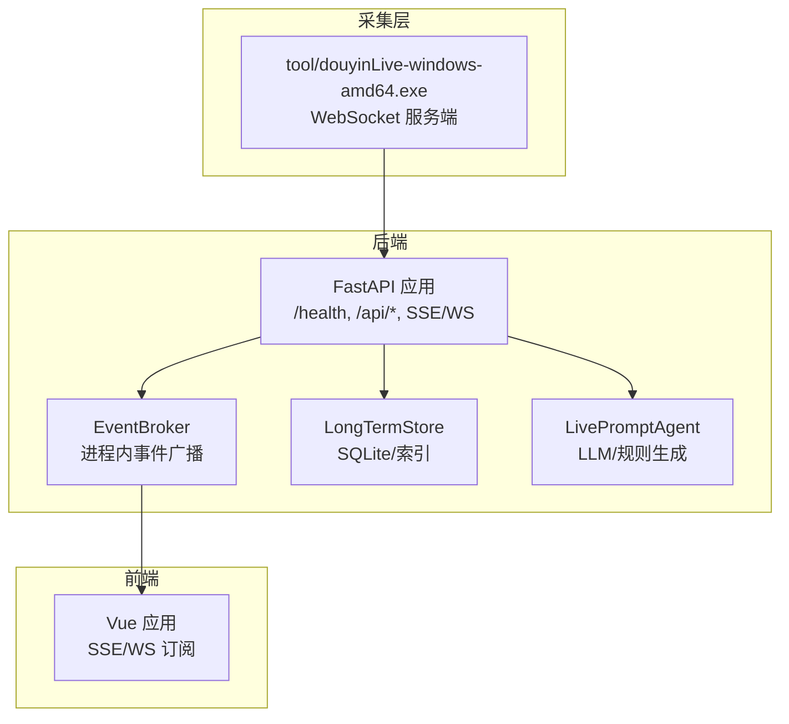
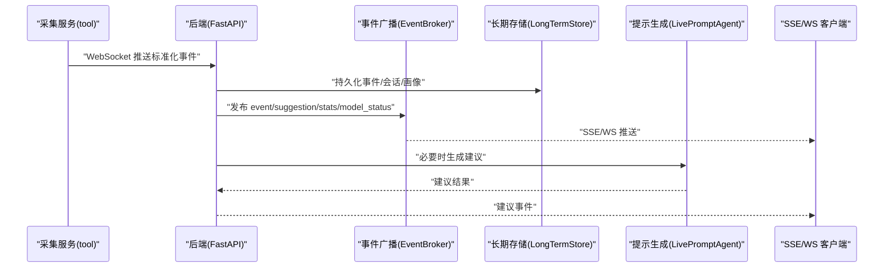
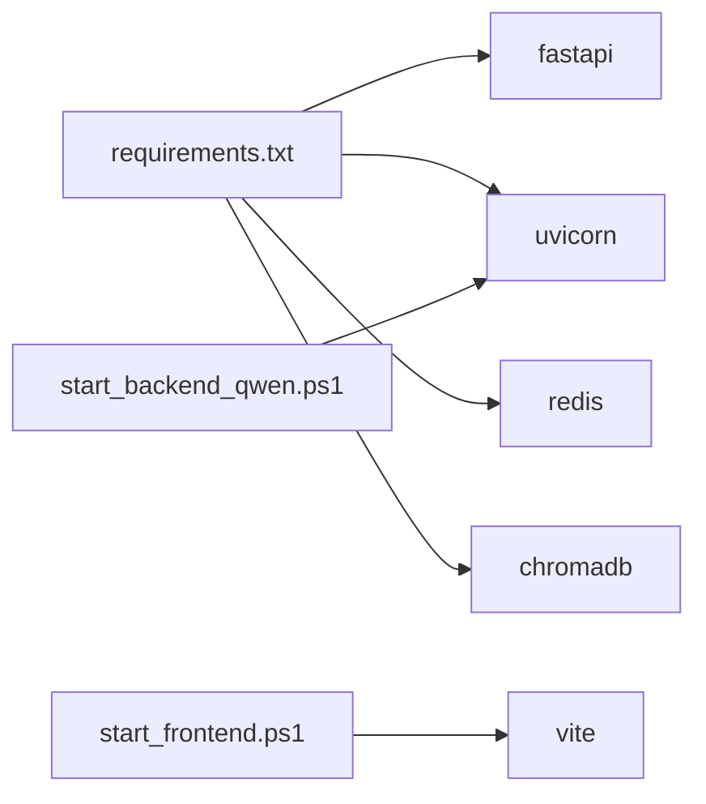

# 服务监控配置

<cite>
**本文引用的文件**
- [backend/app.py](file://backend/app.py)
- [backend/config.py](file://backend/config.py)
- [backend/memory/long_term.py](file://backend/memory/long_term.py)
- [backend/services/agent.py](file://backend/services/agent.py)
- [backend/services/broker.py](file://backend/services/broker.py)
- [requirements.txt](file://requirements.txt)
- [USAGE.md](file://USAGE.md)
- [README.md](file://README.md)
- [tool/config.yaml](file://tool/config.yaml)
- [start_backend_qwen.ps1](file://start_backend_qwen.ps1)
- [start_frontend.ps1](file://start_frontend.ps1)
</cite>

## 目录
1. [简介](#简介)
2. [项目结构](#项目结构)
3. [核心组件](#核心组件)
4. [架构总览](#架构总览)
5. [详细组件分析](#详细组件分析)
6. [依赖分析](#依赖分析)
7. [性能考虑](#性能考虑)
8. [故障排查指南](#故障排查指南)
9. [结论](#结论)
10. [附录](#附录)

## 简介
本指南面向运维人员，帮助在该AI直播提词系统中建立完善的监控体系。内容覆盖健康检查接口使用、日志配置与管理、性能监控指标、告警机制配置以及监控工具集成建议（如Prometheus、Grafana）。文档基于仓库现有代码与脚本进行分析，确保可操作性与可落地。

## 项目结构
系统采用前后端分离架构：
- 后端：FastAPI应用，提供健康检查、事件处理、SSE/WS实时流等接口；内置事件采集器、会话/长期记忆、向量检索与提示生成器。
- 前端：Vue应用，实时展示事件流、建议与模型状态。
- 工具：独立的抖音直播WebSocket采集服务，负责从抖音直播源拉取消息并转发至后端。

图表来源
- [backend/app.py:104-220](file://backend/app.py#L104-L220)
- [backend/services/broker.py:10-40](file://backend/services/broker.py#L10-L40)
- [backend/memory/long_term.py:36-155](file://backend/memory/long_term.py#L36-L155)
- [backend/services/agent.py:23-114](file://backend/services/agent.py#L23-L114)

章节来源
- [backend/app.py:104-220](file://backend/app.py#L104-L220)
- [USAGE.md:15-256](file://USAGE.md#L15-L256)

## 核心组件
- 健康检查接口：/health，返回服务状态、当前房间号与活动会话信息，便于外部探活与编排。
- 事件处理与存储：接收标准化事件，写入SQLite，同时维护会话统计与用户画像。
- 实时推送：SSE与WebSocket两种通道，向前端推送事件、建议、统计与模型状态。
- 提示生成：优先调用在线模型（OpenAI兼容），失败时回退到本地规则。
- 配置中心：Settings类统一加载环境变量与默认值，支持多模式（heuristic/qwen/openai）切换。

章节来源
- [backend/app.py:104-220](file://backend/app.py#L104-L220)
- [backend/config.py:39-94](file://backend/config.py#L39-L94)
- [backend/memory/long_term.py:420-524](file://backend/memory/long_term.py#L420-L524)
- [backend/services/agent.py:23-114](file://backend/services/agent.py#L23-L114)

## 架构总览
下图展示从采集到前端展示的端到端流程，以及关键监控点位。

图表来源
- [backend/app.py:61-78](file://backend/app.py#L61-L78)
- [backend/services/broker.py:28-40](file://backend/services/broker.py#L28-L40)
- [backend/memory/long_term.py:420-454](file://backend/memory/long_term.py#L420-L454)
- [backend/services/agent.py:73-94](file://backend/services/agent.py#L73-L94)

## 详细组件分析

### 健康检查接口 /health
- 调用方式：HTTP GET /health
- 返回内容：包含服务状态、当前房间号与活动会话信息，便于自动化巡检与编排系统识别服务健康度。
- 使用建议：
  - 将/health纳入Kubernetes存活/就绪探针。
  - 在负载均衡器或反向代理中配置健康检查路径。
  - 结合业务侧“活动会话”字段判断采集链路是否正常。

章节来源
- [backend/app.py:104-107](file://backend/app.py#L104-L107)
- [README.md:210-216](file://README.md#L210-L216)

### 日志配置与管理
- 后端日志：
  - 初始化：基础日志级别为INFO，格式包含级别、名称与消息。
  - 关键模块日志：
    - 提示生成器：记录模型调用错误、回退逻辑、成功生成等关键事件。
    - 事件处理：记录事件写入、会话统计、模型状态变更等。
- 前端日志收集：
  - 建议在浏览器控制台与网络面板观察SSE/WS连接状态与事件流。
  - 可在生产环境接入前端错误上报SDK（如Sentry）以捕获JS异常。
- 错误日志分析：
  - 关注提示生成器中的HTTP错误、网络错误、超时、JSON解析失败等分类。
  - 结合/health与SSE/WS状态判断服务与采集链路健康度。

章节来源
- [backend/app.py:23](file://backend/app.py#L23)
- [backend/services/agent.py:20](file://backend/services/agent.py#L20)
- [USAGE.md:179-196](file://USAGE.md#L179-L196)

### 性能监控指标
以下指标建议结合外部监控系统（如Prometheus）采集与可视化（如Grafana）：

- 响应时间
  - 后端接口：对/health、/api/bootstrap、/api/events等关键接口进行P50/P95/P99延迟统计。
  - SSE/WS：计算客户端首次连接到收到第一条事件的时间，评估推送延迟。
- 并发数
  - 后端并发：SSE/WS订阅队列数量、事件广播吞吐量。
  - 采集并发：tool采集服务的连接数与消息速率。
- 内存使用
  - 后端进程RSS/堆使用趋势，关注事件缓存与会话统计增长。
- CPU占用
  - 采集服务与后端进程的CPU使用率，识别热点路径（如JSON解析、模型调用）。
- 数据库与索引
  - SQLite查询耗时分布、索引命中率（基于EXPLAIN QUERY PLAN）。
- 模型调用
  - 模型调用成功率、平均耗时、错误类型分布（HTTP/网络/超时/解析失败）。
- 事件速率
  - 每秒事件数、建议生成速率、会话统计更新频率。

章节来源
- [backend/memory/long_term.py:183-195](file://backend/memory/long_term.py#L183-L195)
- [backend/services/agent.py:183-329](file://backend/services/agent.py#L183-L329)

### 告警机制配置
- 异常检测
  - /health连续失败次数阈值。
  - SSE/WS断连率、消息积压（广播队列满）。
  - SQLite写入失败、索引缺失导致的慢查询。
  - 模型调用错误占比（HTTP错误、超时、JSON解析失败）。
- 阈值设置
  - 建议：/health失败>3次/分钟；SSE首包延迟>10s；模型错误率>5%；数据库写入耗时P95>500ms。
- 通知方式
  - 邮件、企业微信/飞书机器人、PagerDuty等。
- 自愈与降级
  - 模型错误时自动回退至规则模式，需在告警中区分“回退”与“失败”。

章节来源
- [backend/services/agent.py:99-113](file://backend/services/agent.py#L99-L113)
- [backend/app.py:104-107](file://backend/app.py#L104-L107)

### 监控工具选择与集成建议
- Prometheus
  - 采集后端指标（如响应时间、并发、内存/CPU、模型错误率、数据库耗时）。
  - 采集采集服务指标（连接数、消息速率、断连数）。
- Grafana
  - 展示关键仪表盘：服务健康、事件速率、模型表现、数据库健康、SSE/WS健康。
- 日志聚合
  - ELK/EFK或Loki+Grafana，集中收集后端与采集服务日志，支持关键字检索与告警。
- APM（可选）
  - 如需深入追踪接口调用链，可引入OpenTelemetry或APM产品。

[本节为通用实践建议，无需特定文件引用]

## 依赖分析
- 后端运行时依赖：FastAPI、Uvicorn、Redis、Chroma、websocket-client等。
- 启动脚本：后端通过Uvicorn启动，前端通过Vite启动；采集服务为独立可执行文件。

图表来源
- [requirements.txt:1-6](file://requirements.txt#L1-L6)
- [start_backend_qwen.ps1:12](file://start_backend_qwen.ps1#L12)
- [start_frontend.ps1:21](file://start_frontend.ps1#L21)

章节来源
- [requirements.txt:1-6](file://requirements.txt#L1-L6)
- [start_backend_qwen.ps1:12](file://start_backend_qwen.ps1#L12)
- [start_frontend.ps1:21](file://start_frontend.ps1#L21)

## 性能考虑
- I/O密集与事件驱动
  - 后端采用异步SSE/WS，建议在高并发场景下合理配置Uvicorn工作进程与线程数。
- 数据库优化
  - SQLite已建立关键索引，建议定期分析慢查询并评估是否引入Redis作为短期缓存。
- 模型调用
  - 控制超时与重试策略，避免阻塞事件处理主循环；错误分类有助于快速定位问题。
- 采集与传输
  - tool采集服务与后端之间网络抖动会影响SSE/WS稳定性，建议在边界做限速与背压。

[本节为通用指导，无需特定文件引用]

## 故障排查指南
- 页面无建议
  - 检查采集服务是否启动、.env房间号是否正确、直播间是否开播、后端是否重启到最新版本。
- 顶部显示“fallback”
  - 检查模型API Key、网络访问、是否触发超时或限流。
- 顶部显示“heuristic”
  - 检查LLM_MODE配置或.env加载是否正确。
- 前端无法打开
  - 检查前端脚本是否正常启动、端口是否被占用。
- 后端启动但未写入数据
  - 检查采集服务是否运行、后端日志中是否连接到指定WebSocket地址、房间是否有消息。

章节来源
- [USAGE.md:198-240](file://USAGE.md#L198-L240)

## 结论
通过健康检查、日志、性能指标与告警的组合，可构建覆盖采集、后端处理与前端展示的全链路监控体系。建议以Prometheus/Grafana为核心，结合日志与APM，形成可观测性闭环，持续优化模型与数据库性能，保障直播场景下的稳定性与实时性。

[本节为总结性内容，无需特定文件引用]

## 附录

### /health 响应格式说明
- 字段
  - status：服务状态字符串
  - room_id：当前房间标识
  - active_session：活动会话信息（若存在）

章节来源
- [backend/app.py:104-107](file://backend/app.py#L104-L107)
- [README.md:210-216](file://README.md#L210-L216)

### 关键接口与用途
- /health：健康检查
- /api/bootstrap：前端初始化快照
- /api/room：切换房间
- /api/events：手动注入事件
- /api/events/stream：SSE实时流
- /ws/live：WebSocket实时流

章节来源
- [backend/app.py:109-220](file://backend/app.py#L109-L220)
- [README.md:208-266](file://README.md#L208-L266)

### 配置要点
- LLM模式与模型参数：支持heuristic/qwen/openai三种模式，具备自动回退能力。
- 存储与会话：SQLite为主，Redis与Chroma为可选增强。
- 采集服务：tool/config.yaml支持端口与Cookie配置。

章节来源
- [backend/config.py:39-94](file://backend/config.py#L39-L94)
- [tool/config.yaml:1-16](file://tool/config.yaml#L1-L16)
- [README.md:157-201](file://README.md#L157-L201)