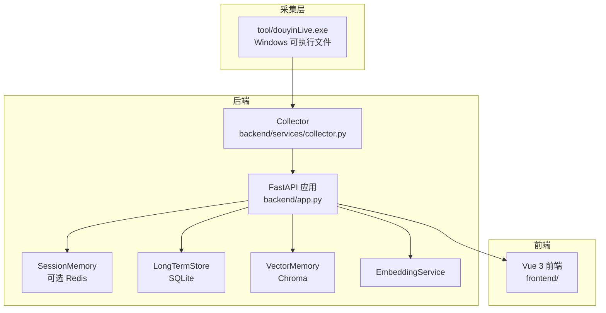
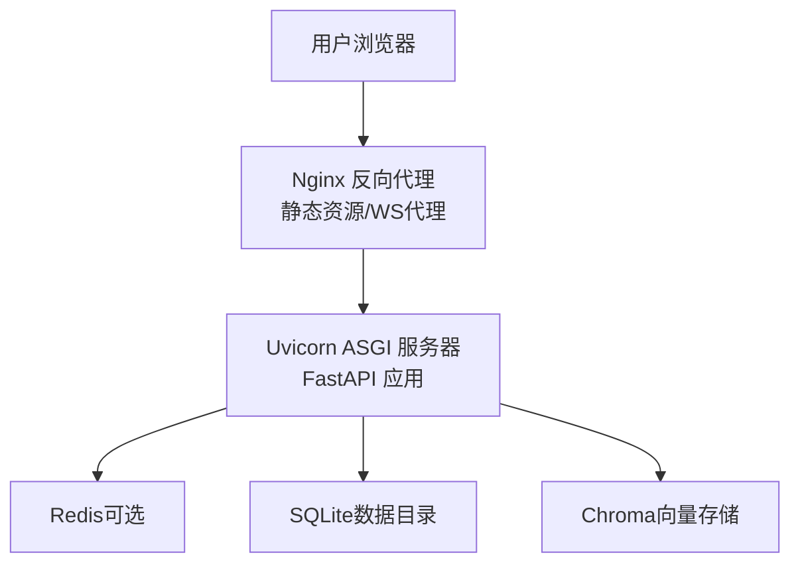
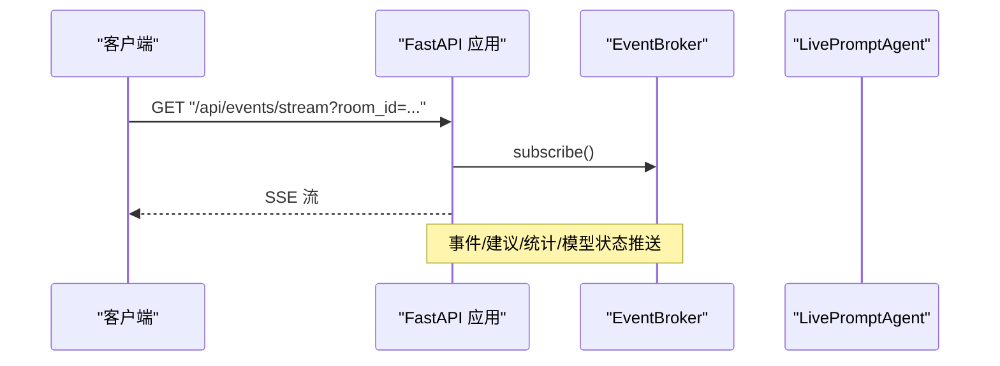
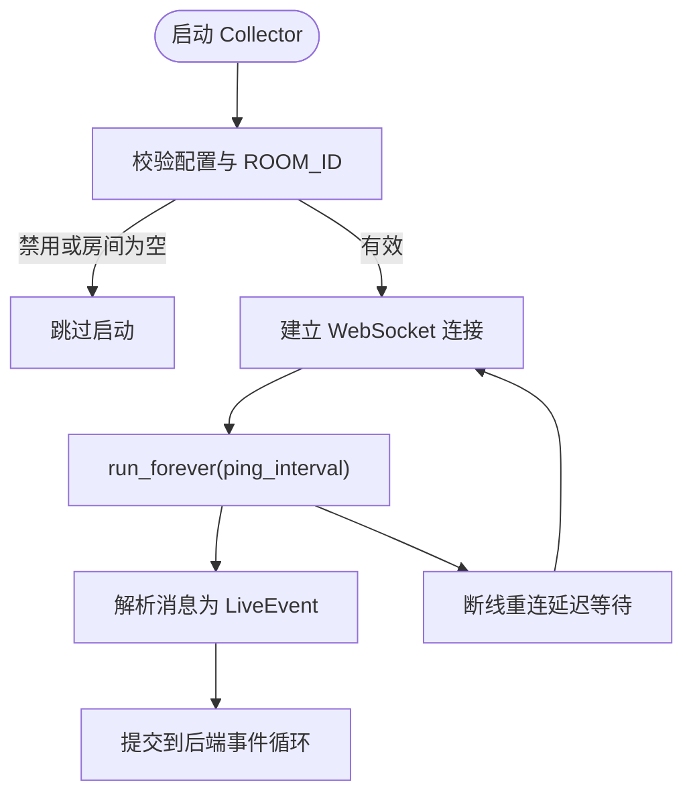
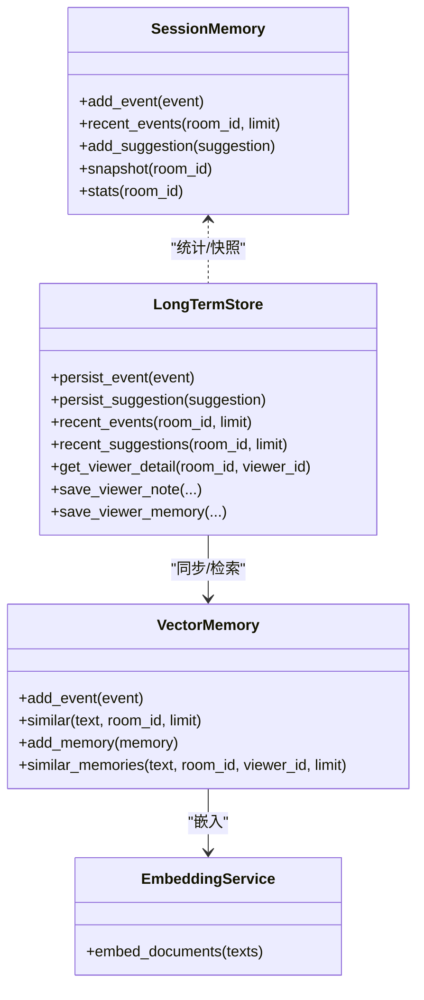
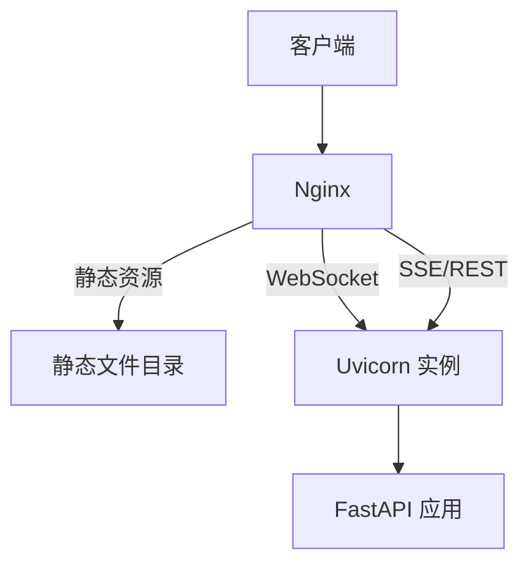

# 生产环境部署

<cite>
**本文引用的文件**
- [README.md](file://README.md)
- [USAGE.md](file://USAGE.md)
- [requirements.txt](file://requirements.txt)
- [backend/app.py](file://backend/app.py)
- [backend/config.py](file://backend/config.py)
- [backend/memory/vector_store.py](file://backend/memory/vector_store.py)
- [backend/memory/long_term.py](file://backend/memory/long_term.py)
- [backend/services/collector.py](file://backend/services/collector.py)
- [data/DATABASE.md](file://data/DATABASE.md)
- [start_all.bat](file://start_all.bat)
- [start_all.ps1](file://start_all.ps1)
</cite>

## 目录
1. [简介](#简介)
2. [项目结构](#项目结构)
3. [核心组件](#核心组件)
4. [架构总览](#架构总览)
5. [详细组件分析](#详细组件分析)
6. [部署要求与差异](#部署要求与差异)
7. [Nginx 反向代理配置](#nginx-反向代理配置)
8. [Uvicorn ASGI 服务器部署](#uvicorn-asgi-服务器部署)
9. [Docker 容器化可能性分析](#docker-容器化可能性分析)
10. [数据库部署与备份策略](#数据库部署与备份策略)
11. [网络安全配置](#网络安全配置)
12. [性能优化建议](#性能优化建议)
13. [监控与日志管理](#监控与日志管理)
14. [故障排查指南](#故障排查指南)
15. [结论](#结论)

## 简介
本指南面向生产环境部署 DouYin_llm 项目，覆盖 Linux 与 Windows 服务器的部署差异、Nginx 反向代理（静态资源与 WebSocket）、Uvicorn ASGI 服务器配置、Docker 容器化可行性、数据库（SQLite、Chroma、可选 Redis）部署与备份、网络安全（防火墙、SSL、访问控制）、性能优化（缓存、连接池、资源限制）以及监控与日志最佳实践。文档基于仓库现有代码与说明文件进行梳理与提炼，确保非技术读者也能理解关键步骤。

## 项目结构
项目采用前后端分离架构：采集器（tool/douyinLive.exe，Windows）负责从抖音直播 WebSocket 拉取事件，后端（FastAPI + Uvicorn）处理事件、持久化、记忆抽取与实时推送，前端（Vue 3）通过 SSE 与 WebSocket 实时展示。

图表来源
- [backend/app.py:108-126](file://backend/app.py#L108-L126)
- [backend/services/collector.py:38-99](file://backend/services/collector.py#L38-L99)
- [backend/memory/vector_store.py:59-84](file://backend/memory/vector_store.py#L59-L84)
- [backend/memory/long_term.py:44-47](file://backend/memory/long_term.py#L44-L47)

章节来源
- [README.md:19-44](file://README.md#L19-L44)
- [backend/app.py:108-126](file://backend/app.py#L108-L126)
- [backend/services/collector.py:38-99](file://backend/services/collector.py#L38-L99)

## 核心组件
- 配置中心：集中于 backend/config.py，支持环境变量与 .env 注入，覆盖采集、后端监听、LLM、向量与嵌入、Redis、数据目录等。
- 事件采集：DouyinCollector 通过本地 WebSocket 接收消息，标准化为 LiveEvent 并投递到后端事件循环。
- 记忆与存储：SessionMemory（可选 Redis）、LongTermStore（SQLite）、VectorMemory（Chroma）协同工作。
- 实时推送：SSE 与 WebSocket 接口，向前端广播事件、建议、统计与模型状态。
- 启动脚本：Windows 下提供 .bat/.ps1 脚本组合，便于一键启动后端与前端。

章节来源
- [backend/config.py:40-113](file://backend/config.py#L40-L113)
- [backend/services/collector.py:38-99](file://backend/services/collector.py#L38-L99)
- [backend/memory/long_term.py:44-47](file://backend/memory/long_term.py#L44-L47)
- [backend/memory/vector_store.py:59-84](file://backend/memory/vector_store.py#L59-L84)
- [backend/app.py:129-285](file://backend/app.py#L129-L285)
- [start_all.bat:1-9](file://start_all.bat#L1-L9)
- [start_all.ps1:1-18](file://start_all.ps1#L1-L18)

## 架构总览
下图展示生产环境典型拓扑：Nginx 作为反向代理与静态资源服务，后端通过 Uvicorn 承载 FastAPI，采集器在独立主机或容器中运行，数据库与向量库位于后端节点或外部服务。

图表来源
- [backend/app.py:108-126](file://backend/app.py#L108-L126)
- [backend/config.py:55-56](file://backend/config.py#L55-L56)
- [backend/memory/long_term.py:44-47](file://backend/memory/long_term.py#L44-L47)
- [backend/memory/vector_store.py:59-84](file://backend/memory/vector_store.py#L59-L84)

## 详细组件分析

### FastAPI 应用与路由
- 生命周期：lifespan 在应用启动时启动 Collector，在关闭时清理会话与停止采集。
- CORS：默认允许任意来源，生产环境应收紧。
- 健康检查：/health 返回运行状态与当前房间。
- 初始化快照：/api/bootstrap 返回前端所需初始数据。
- 房间切换：/api/room 支持动态切换房间并返回快照。
- 事件注入：/api/events 支持手动注入事件（联调/回放）。
- 观众与笔记：/api/viewer、/api/viewer/memories、/api/viewer/notes 提供 CRUD。
- LLM 设置：/api/settings/llm 提供获取与保存模型与系统提示词。
- 会话查询：/api/sessions、/api/sessions/current 查询直播会话。
- 实时流：/api/events/stream（SSE）与 /ws/live（WebSocket）。

图表来源
- [backend/app.py:252-271](file://backend/app.py#L252-L271)

章节来源
- [backend/app.py:108-117](file://backend/app.py#L108-L117)
- [backend/app.py:129-285](file://backend/app.py#L129-L285)

### 采集器（DouyinCollector）
- 连接：根据配置构造 ws://HOST:PORT/ws/{ROOM_ID}，支持 ping 与自动重连。
- 线程模型：独立线程运行 WebSocket 循环，通过 asyncio.run_coroutine_threadsafe 将事件提交到后端事件循环。
- 事件归一化：将不同 method 映射为统一事件类型，提取礼物、点赞、入房、关注等元数据。
- 切房：支持运行时切换房间并重建连接。

图表来源
- [backend/services/collector.py:61-99](file://backend/services/collector.py#L61-L99)
- [backend/services/collector.py:118-140](file://backend/services/collector.py#L118-L140)
- [backend/services/collector.py:207-266](file://backend/services/collector.py#L207-L266)

章节来源
- [backend/services/collector.py:38-99](file://backend/services/collector.py#L38-L99)
- [backend/services/collector.py:118-140](file://backend/services/collector.py#L118-L140)
- [backend/services/collector.py:207-266](file://backend/services/collector.py#L207-L266)

### 记忆与存储
- SessionMemory：可选 Redis，用于跨进程共享会话，支持 TTL。
- LongTermStore：SQLite，负责事件、建议、观众画像、礼物聚合、直播会话、笔记、记忆与应用设置的持久化。
- VectorMemory：Chroma（可选），提供事件与观众记忆的向量检索，支持回退到本地哈希嵌入函数。

图表来源
- [backend/memory/long_term.py:44-47](file://backend/memory/long_term.py#L44-L47)
- [backend/memory/vector_store.py:59-84](file://backend/memory/vector_store.py#L59-L84)
- [backend/config.py:64-75](file://backend/config.py#L64-L75)

章节来源
- [backend/memory/long_term.py:44-47](file://backend/memory/long_term.py#L44-L47)
- [backend/memory/vector_store.py:59-84](file://backend/memory/vector_store.py#L59-L84)
- [backend/config.py:64-75](file://backend/config.py#L64-L75)

## 部署要求与差异
- 操作系统差异
  - Windows：采集器为 Windows 可执行文件，本地开发与测试友好；生产部署可在 Windows 上直接运行。
  - Linux：采集器暂不提供 Linux 二进制或容器镜像，需自行从上游仓库获取或通过容器化改造实现跨平台采集。
- 运行时要求
  - Python 3.10+（推荐 3.11），Node.js 18+（Vite 4）。
  - 可选依赖：Redis（共享 SessionMemory）、Chroma（向量索引）。
  - LLM API Key（Qwen/OpenAI 兼容）。
- 端口与绑定
  - 后端默认监听 127.0.0.1:8010，生产环境建议改为 0.0.0.0 并通过 Nginx 暴露。
  - 采集器默认监听 ws://127.0.0.1:1088/ws/{ROOM_ID}，需确保网络可达性与安全策略。

章节来源
- [README.md:46-52](file://README.md#L46-L52)
- [README.md:94](file://README.md#L94)
- [backend/config.py:44-49](file://backend/config.py#L44-L49)
- [backend/config.py:50-51](file://backend/config.py#L50-L51)

## Nginx 反向代理配置
- 静态资源服务
  - 前端构建产物放置于 dist 或静态目录，Nginx 提供 gzip/缓存优化与 HTTPS 终止。
- WebSocket 代理
  - 将 /ws/live 与 /api/events/stream 代理至后端 Uvicorn，开启 proxy_http_version 1.1 与升级头。
- 负载均衡与高可用
  - 多实例后端时，Nginx 可配置 upstream 并结合健康检查。
- 安全加固
  - 限制来源 IP、速率限制、HTTPS 强制、HSTS、CSP 等。

图表来源
- [backend/app.py:252-285](file://backend/app.py#L252-L285)

章节来源
- [backend/app.py:252-285](file://backend/app.py#L252-L285)

## Uvicorn ASGI 服务器部署
- 进程与并发
  - 建议使用多个 Uvicorn 实例（多进程）配合 Nginx 负载均衡；单进程多线程模型在 I/O 密集场景表现有限。
- 绑定地址与端口
  - 生产环境绑定 0.0.0.0:8010，避免仅 127.0.0.1 导致外网不可达。
- 日志与健康检查
  - 配置 access log 与 error log，结合 /health 接口进行探活。
- 进程管理
  - 使用 systemd 或 supervisor 管理 Uvicorn 进程，自动重启与资源限制。

章节来源
- [README.md:94](file://README.md#L94)
- [backend/config.py:44-45](file://backend/config.py#L44-L45)
- [backend/app.py:129-135](file://backend/app.py#L129-L135)

## Docker 容器化可能性分析
- 可行性
  - 后端与前端均可容器化；采集器目前为 Windows 二进制，Linux 需替代方案或通过自编译/交叉编译实现。
- 镜像建议
  - 后端镜像：基于 Python 3.11-alpine 或 debian slim，安装依赖后复制代码与静态资源。
  - 前端镜像：基于 node:alpine 构建静态产物，再由 Nginx 镜像提供服务。
- 存储与网络
  - SQLite/Chroma 数据目录映射到持久卷；Redis 与 Chroma 可作为独立服务容器。
- 编排
  - docker-compose 示例：web（Nginx）、backend（Uvicorn）、redis（可选）、chroma（可选）。

章节来源
- [requirements.txt:1-6](file://requirements.txt#L1-L6)
- [README.md:207-208](file://README.md#L207-L208)

## 数据库部署与备份策略
- SQLite（默认）
  - 文件路径由配置项 DATABASE_PATH 指定，建议映射到持久卷；生产环境启用 WAL 模式与合适的 fsync 策略。
- Chroma（可选）
  - 存储目录由 CHROMA_DIR 指定，建议独立卷；支持清空重建，配合向量化脚本。
- Redis（可选）
  - 通过 REDIS_URL 连接，建议使用集群或哨兵提升可用性。
- 备份策略
  - SQLite：定期复制 live_prompter.db；结合时间点恢复（WAL）。
  - Chroma：导出/压缩存储目录；必要时重建向量索引。
  - Redis：RDB/AOF 持久化与周期快照；主从复制。

章节来源
- [backend/config.py:53-54](file://backend/config.py#L53-L54)
- [backend/config.py:54-56](file://backend/config.py#L54-L56)
- [backend/config.py:64-75](file://backend/config.py#L64-L75)
- [data/DATABASE.md:1-151](file://data/DATABASE.md#L1-L151)

## 网络安全配置
- 防火墙
  - 仅开放 Nginx（80/443）与后端（8010）端口；采集器端口（1088）仅对可信网络开放。
- SSL/TLS
  - Nginx 提供 HTTPS 终止，使用 Let’s Encrypt 自动续期；后端内部通信可使用 mTLS。
- 访问控制
  - 前端接口默认无鉴权，生产环境建议增加认证与授权（如 JWT/OAuth2）。
  - CORS 在生产环境应明确白名单，避免通配符。
- 入侵检测
  - 结合 WAF 与速率限制，阻断异常请求与扫描行为。

章节来源
- [backend/app.py:120-126](file://backend/app.py#L120-L126)
- [README.md:209-211](file://README.md#L209-L211)

## 性能优化建议
- 缓存策略
  - Redis 作为 SessionMemory 缓存热点事件与建议，降低后端计算压力。
  - 前端静态资源开启强缓存与 CDN 加速。
- 连接池与资源限制
  - Uvicorn worker 数量与后端线程池合理配置；SQLite 使用 WAL 与连接池；Chroma 限制并发查询。
- 资源限制
  - 为 Uvicorn 进程设置 CPU/内存限额；Nginx 限制上传大小与超时。
- 监控指标
  - 指标：请求延迟、错误率、队列长度、向量查询耗时、数据库锁等待；结合日志与 APM。

章节来源
- [backend/config.py:55-56](file://backend/config.py#L55-L56)
- [backend/memory/vector_store.py:172-230](file://backend/memory/vector_store.py#L172-L230)
- [backend/memory/long_term.py:44-54](file://backend/memory/long_term.py#L44-L54)

## 监控与日志管理
- 日志
  - 后端统一输出到 stdout/stderr，结合 systemd/journald 或集中式日志（如 ELK/Fluentd）收集。
  - Nginx access/error log 分离，按天轮转。
- 指标
  - 接口耗时、并发连接数、事件吞吐、向量查询成功率、Redis/Chroma 延迟。
- 告警
  - 错误率阈值、延迟峰值、磁盘空间、数据库锁等待、采集器掉线。
- 可观测性
  - 建议引入 Prometheus + Grafana 或 APM（如 OpenTelemetry）实现端到端可观测。

章节来源
- [backend/app.py:24-25](file://backend/app.py#L24-L25)

## 故障排查指南
- 采集器问题
  - 检查 ROOM_ID、采集器是否启动、WebSocket 地址可达、ping 间隔与重连延迟。
- 后端问题
  - 查看 /health、核对配置项（APP_HOST/APP_PORT、REDIS_URL、DATABASE_PATH、CHROMA_DIR）。
- 数据库问题
  - SQLite 文件权限与磁盘空间；Chroma 存储目录权限；必要时重建索引。
- 前端问题
  - 确认静态资源路径与 Nginx 配置；WebSocket 代理头是否正确传递。

章节来源
- [backend/app.py:129-135](file://backend/app.py#L129-L135)
- [backend/config.py:44-56](file://backend/config.py#L44-L56)
- [backend/config.py:53-54](file://backend/config.py#L53-L54)
- [backend/config.py:54-56](file://backend/config.py#L54-L56)
- [USAGE.md:198-239](file://USAGE.md#L198-L239)

## 结论
DouYin_llm 项目具备清晰的生产部署路径：以 Nginx 为入口，Uvicorn 承载后端，采集器与数据库/向量库按需部署。生产环境中需重点关注采集器跨平台问题、安全加固、缓存与连接池优化、监控与日志体系完善。通过合理的容器化与编排策略，可进一步提升可维护性与弹性。