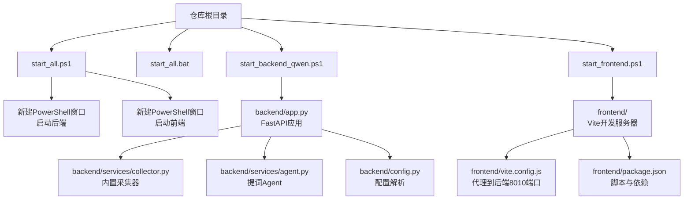
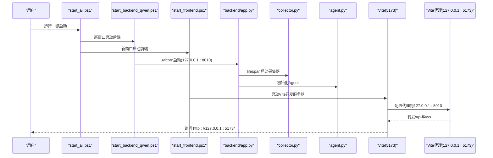
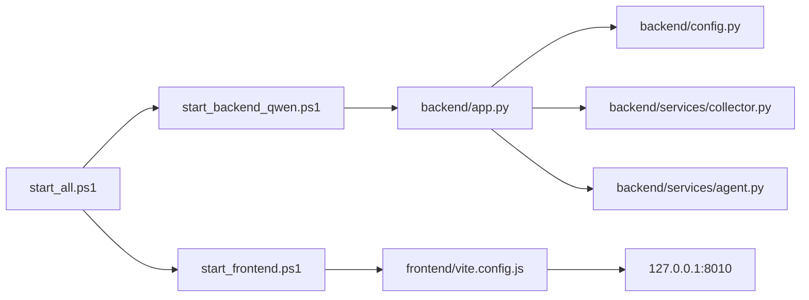
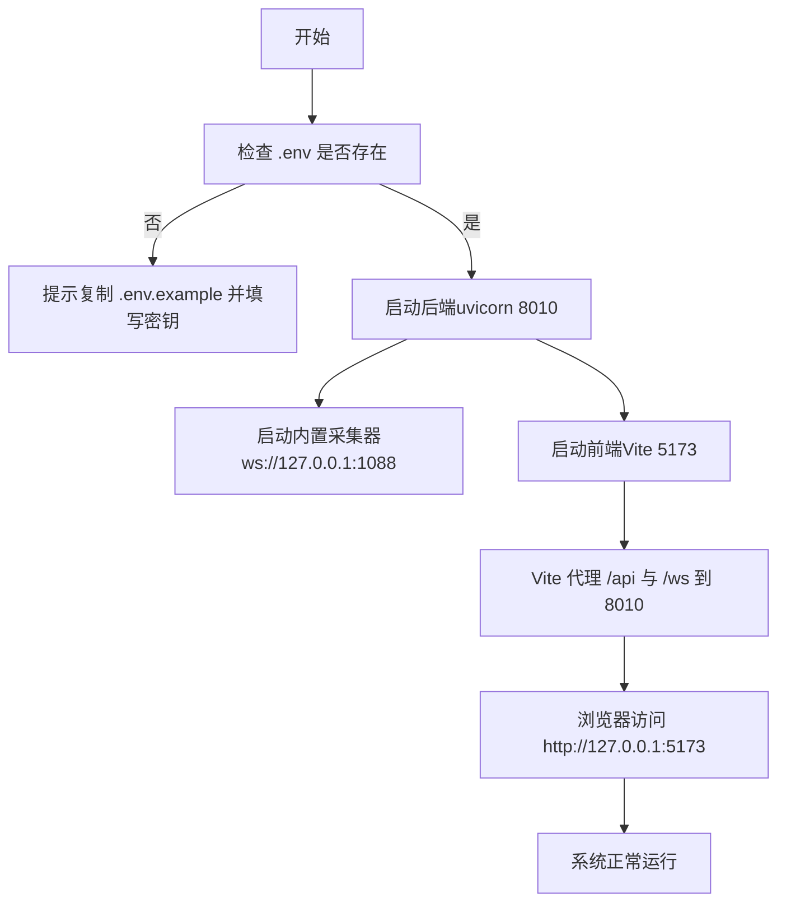

# 服务启动流程

<cite>
**本文引用的文件**
- [start_all.ps1](file://start_all.ps1)
- [start_all.bat](file://start_all.bat)
- [start_backend_qwen.ps1](file://start_backend_qwen.ps1)
- [start_frontend.ps1](file://start_frontend.ps1)
- [backend/app.py](file://backend/app.py)
- [backend/config.py](file://backend/config.py)
- [backend/services/collector.py](file://backend/services/collector.py)
- [backend/services/agent.py](file://backend/services/agent.py)
- [frontend/vite.config.js](file://frontend/vite.config.js)
- [frontend/package.json](file://frontend/package.json)
- [requirements.txt](file://requirements.txt)
- [USAGE.md](file://USAGE.md)
- [tool/config.yaml](file://tool/config.yaml)
</cite>

## 目录
1. [简介](#简介)
2. [项目结构](#项目结构)
3. [核心组件](#核心组件)
4. [架构总览](#架构总览)
5. [详细组件分析](#详细组件分析)
6. [依赖关系分析](#依赖关系分析)
7. [性能考虑](#性能考虑)
8. [故障排查指南](#故障排查指南)
9. [结论](#结论)
10. [附录](#附录)

## 简介
本指南围绕一键启动脚本与各子系统的启动流程展开，帮助你理解：
- start_all.ps1 的工作原理与使用方法
- 后端服务启动脚本 start_backend_qwen.ps1 的职责（含 Qwen 模型集成与内置采集器）
- 前端服务启动脚本 start_frontend.ps1 的作用（含 Vite 开发服务器与代理配置）
- 独立启动各服务的方法与调试策略
- 启动顺序与依赖关系的重要性
- 启动过程中常见错误与解决方案

## 项目结构
该项目采用前后端分离的结构，启动脚本位于仓库根目录，分别控制后端与前端服务的启动；后端以 FastAPI 应用为核心，内置采集器负责对接本地 WebSocket 服务；前端基于 Vite 提供开发服务器并通过代理转发到后端。

图表来源
- [start_all.ps1:1-18](file://start_all.ps1#L1-L18)
- [start_all.bat:1-9](file://start_all.bat#L1-L9)
- [start_backend_qwen.ps1:1-13](file://start_backend_qwen.ps1#L1-L13)
- [start_frontend.ps1:1-22](file://start_frontend.ps1#L1-L22)
- [backend/app.py:1-220](file://backend/app.py#L1-L220)
- [backend/services/collector.py:1-284](file://backend/services/collector.py#L1-L284)
- [backend/services/agent.py:1-393](file://backend/services/agent.py#L1-L393)
- [backend/config.py:1-94](file://backend/config.py#L1-L94)
- [frontend/vite.config.js:1-23](file://frontend/vite.config.js#L1-L23)
- [frontend/package.json:1-23](file://frontend/package.json#L1-L23)

章节来源
- [start_all.ps1:1-18](file://start_all.ps1#L1-L18)
- [start_all.bat:1-9](file://start_all.bat#L1-L9)
- [start_backend_qwen.ps1:1-13](file://start_backend_qwen.ps1#L1-L13)
- [start_frontend.ps1:1-22](file://start_frontend.ps1#L1-L22)
- [backend/app.py:1-220](file://backend/app.py#L1-L220)
- [backend/config.py:1-94](file://backend/config.py#L1-L94)
- [backend/services/collector.py:1-284](file://backend/services/collector.py#L1-L284)
- [backend/services/agent.py:1-393](file://backend/services/agent.py#L1-L393)
- [frontend/vite.config.js:1-23](file://frontend/vite.config.js#L1-L23)
- [frontend/package.json:1-23](file://frontend/package.json#L1-L23)

## 核心组件
- 一键启动脚本：start_all.ps1
  - 负责检查 .env 配置是否存在，若缺失则提示复制示例并填写密钥；随后在新 PowerShell 窗口中分别启动后端与前端。
- 后端启动脚本：start_backend_qwen.ps1
  - 同样检查 .env；随后以 uvicorn 启动 FastAPI 应用，监听 127.0.0.1:8010，并启用热重载。
- 前端启动脚本：start_frontend.ps1
  - 定位到 frontend 目录，检查 Node.js 可用性；如缺少 node_modules 则执行 npm install；最后启动 Vite 开发服务器，监听 127.0.0.1:5173。
- 后端应用：backend/app.py
  - 初始化内存、事件代理、向量库与提词 Agent；在 lifespan 中启动内置采集器并在关闭时清理；提供健康检查、切房、事件注入、SSE 与 WebSocket 接口。
- 配置模块：backend/config.py
  - 解析 .env 与环境变量，提供 LLM 模式、模型名、API Key、超时等关键配置，并负责目录创建。
- 内置采集器：backend/services/collector.py
  - 连接本地 WebSocket（默认 127.0.0.1:1088），标准化消息为 LiveEvent 并提交至事件循环。
- 提词 Agent：backend/services/agent.py
  - 优先调用在线兼容接口（如 Qwen），失败时回退到本地规则；维护模型状态并在前端展示。
- 前端 Vite：frontend/vite.config.js
  - 将 /api 与 /ws 代理到后端 127.0.0.1:8010，便于前端同源访问后端接口。
- 依赖清单：requirements.txt
  - 包含 FastAPI、uvicorn、redis、chromadb 等后端依赖。

章节来源
- [start_all.ps1:1-18](file://start_all.ps1#L1-L18)
- [start_backend_qwen.ps1:1-13](file://start_backend_qwen.ps1#L1-L13)
- [start_frontend.ps1:1-22](file://start_frontend.ps1#L1-L22)
- [backend/app.py:1-220](file://backend/app.py#L1-L220)
- [backend/config.py:1-94](file://backend/config.py#L1-L94)
- [backend/services/collector.py:1-284](file://backend/services/collector.py#L1-L284)
- [backend/services/agent.py:1-393](file://backend/services/agent.py#L1-L393)
- [frontend/vite.config.js:1-23](file://frontend/vite.config.js#L1-L23)
- [requirements.txt:1-6](file://requirements.txt#L1-L6)

## 架构总览
下图展示了启动阶段的系统交互与数据流向：

图表来源
- [start_all.ps1:11-17](file://start_all.ps1#L11-L17)
- [start_backend_qwen.ps1:11-12](file://start_backend_qwen.ps1#L11-L12)
- [start_frontend.ps1:20-21](file://start_frontend.ps1#L20-L21)
- [backend/app.py:84-92](file://backend/app.py#L84-L92)
- [frontend/vite.config.js:10-22](file://frontend/vite.config.js#L10-L22)

## 详细组件分析

### 一键启动脚本 start_all.ps1
- 功能要点
  - 设置错误策略为停止，避免静默失败
  - 定位脚本所在目录并切换工作目录
  - 检查 .env 是否存在，不存在则提示复制示例并填写 DASHSCOPE_API_KEY
  - 使用 Start-Process 在新 PowerShell 窗口中分别启动后端与前端脚本
  - 输出“所有服务已启动”的提示
- 使用方法
  - 在仓库根目录双击运行或在终端执行
  - 若首次运行，请先复制 .env.example 为 .env 并按 USAGE.md 填写必要配置
- 注意事项
  - 新窗口会保持运行，便于观察日志
  - 如需单独调试，可直接运行后端或前端脚本

章节来源
- [start_all.ps1:1-18](file://start_all.ps1#L1-L18)
- [USAGE.md:89-114](file://USAGE.md#L89-L114)

### 后端启动脚本 start_backend_qwen.ps1
- 功能要点
  - 检查 .env 存在性
  - 输出“启动后端（含内置采集器）”提示
  - 以 uvicorn 启动 backend.app:app，绑定 127.0.0.1:8010，启用 reload
- Qwen 集成与模型解析
  - 配置模块会根据 LLM_MODE 解析最终模型服务地址与模型名
  - 当 LLM_MODE 为 qwen 时，使用 DashScope 兼容接口与默认模型
  - API Key 优先从 LLM_API_KEY 读取，否则回退到 DASHSCOPE_API_KEY
- 内置采集器
  - 在 lifespan 中启动，连接本地 WebSocket（默认 127.0.0.1:1088/ws/{room_id}）
  - 将标准化后的事件提交到事件循环，驱动提词 Agent 生成建议
- 独立启动
  - 可直接运行该脚本进行后端调试
  - 若需禁用采集器，可在 .env 中设置 COLLECTOR_ENABLED=false

章节来源
- [start_backend_qwen.ps1:1-13](file://start_backend_qwen.ps1#L1-L13)
- [backend/config.py:70-91](file://backend/config.py#L70-L91)
- [backend/app.py:84-92](file://backend/app.py#L84-L92)
- [backend/services/collector.py:54-59](file://backend/services/collector.py#L54-L59)

### 前端启动脚本 start_frontend.ps1
- 功能要点
  - 切换到 frontend 目录
  - 检测 Node.js 是否安装于固定路径，否则提示并退出
  - 若未安装 node_modules，则执行 npm install
  - 启动 Vite 开发服务器，监听 127.0.0.1:5173
- Vite 代理配置
  - /api 路由代理到后端 127.0.0.1:8010
  - /ws 路由透传 WebSocket 到后端 127.0.0.1:8010
- 独立启动
  - 可直接运行该脚本进行前端调试
  - 若端口 5173 被占用，需释放端口或修改 Vite 配置

章节来源
- [start_frontend.ps1:1-22](file://start_frontend.ps1#L1-L22)
- [frontend/vite.config.js:10-22](file://frontend/vite.config.js#L10-L22)
- [frontend/package.json:6-10](file://frontend/package.json#L6-L10)

### 后端应用 backend/app.py
- 生命周期与采集器
  - 在 lifespan 上下文中启动内置采集器，应用关闭时清理并断开连接
- 主要接口
  - /health 健康检查
  - /api/bootstrap 启动引导（快照）
  - /api/room 切换房间
  - /api/events 事件注入
  - /api/events/stream SSE 实时推送
  - /ws/live WebSocket 实时推送
- 内存与状态
  - 维护会话内存、长期存储与向量记忆
  - 提供模型状态快照，前端用于展示当前模型模式与结果

章节来源
- [backend/app.py:84-92](file://backend/app.py#L84-L92)
- [backend/app.py:104-220](file://backend/app.py#L104-L220)

### 配置模块 backend/config.py
- .env 加载
  - 自定义最小化加载逻辑，支持注释与空行，将键值对写入 os.environ
- 关键配置项
  - APP_HOST/APP_PORT：后端监听地址与端口
  - ROOM_ID：直播房间标识
  - COLLECTOR_*：采集器主机、端口、心跳间隔与重连延迟
  - LLM_*：模型模式、基础 URL、模型名、API Key、温度与超时
  - 数据目录与缓存目录：确保运行期目录存在
- 模型解析
  - resolved_llm_base_url/resolved_llm_model：根据 LLM_MODE 返回对应的服务地址与模型名

章节来源
- [backend/config.py:11-36](file://backend/config.py#L11-L36)
- [backend/config.py:40-94](file://backend/config.py#L40-L94)

### 内置采集器 backend/services/collector.py
- 连接与心跳
  - 通过 ws://127.0.0.1:1088/ws/{room_id} 连接本地 WebSocket
  - 启动心跳线程定期发送 ping，维持连接
- 事件标准化
  - 将原始消息映射为 LiveEvent，填充用户信息、事件类型与元数据
  - 通过 asyncio.run_coroutine_threadsafe 将事件提交到后端事件循环
- 房间切换
  - 支持动态切换房间 ID，并在新房间重新建立连接
- 错误处理
  - 断线自动重连，异常记录日志，避免主线程阻塞

章节来源
- [backend/services/collector.py:54-59](file://backend/services/collector.py#L54-L59)
- [backend/services/collector.py:140-181](file://backend/services/collector.py#L140-L181)
- [backend/services/collector.py:200-214](file://backend/services/collector.py#L200-L214)
- [backend/services/collector.py:225-284](file://backend/services/collector.py#L225-L284)

### 提词 Agent backend/services/agent.py
- 模式选择
  - LLM_MODE 非 heuristic 时优先调用在线兼容接口（如 Qwen）
  - 失败时自动回退到本地规则策略
- 状态管理
  - 维护当前模式、模型、后端地址、最近结果与错误信息
- 上下文构建
  - 结合近期事件、相似历史与用户画像生成建议上下文
- 建议生成
  - 根据事件类型与上下文构造 JSON 负载，调用远程接口或本地规则生成建议

章节来源
- [backend/services/agent.py:23-54](file://backend/services/agent.py#L23-L54)
- [backend/services/agent.py:96-114](file://backend/services/agent.py#L96-L114)
- [backend/services/agent.py:183-330](file://backend/services/agent.py#L183-L330)

## 依赖关系分析
- 启动脚本之间的耦合
  - start_all.ps1 仅作为编排器，通过 Start-Process 启动其他脚本，彼此解耦
- 后端内部依赖
  - app.py 依赖 config.py、services/collector.py、services/agent.py
  - collector.py 依赖 config.py 与 schemas/live（未在本仓库列出）
  - agent.py 依赖 config.py 与向量/长期存储接口
- 前端依赖
  - Vite 代理依赖后端 127.0.0.1:8010
  - package.json 定义 dev/build/preview 脚本

图表来源
- [start_all.ps1:11-17](file://start_all.ps1#L11-L17)
- [start_backend_qwen.ps1:11-12](file://start_backend_qwen.ps1#L11-L12)
- [start_frontend.ps1:20-21](file://start_frontend.ps1#L20-L21)
- [backend/app.py:13-29](file://backend/app.py#L13-L29)
- [backend/config.py:11-36](file://backend/config.py#L11-L36)
- [frontend/vite.config.js:10-22](file://frontend/vite.config.js#L10-L22)

章节来源
- [start_all.ps1:1-18](file://start_all.ps1#L1-L18)
- [start_backend_qwen.ps1:1-13](file://start_backend_qwen.ps1#L1-L13)
- [start_frontend.ps1:1-22](file://start_frontend.ps1#L1-L22)
- [backend/app.py:13-29](file://backend/app.py#L13-L29)
- [frontend/vite.config.js:10-22](file://frontend/vite.config.js#L10-L22)

## 性能考虑
- 启动顺序
  - 先启动抖音采集服务（tool/douyinLive-windows-amd64.exe），再启动后端，最后启动前端，确保采集器可达且后端能接收事件
- 端口占用
  - 8010（后端）、5173（前端）需保持空闲；如被占用，需释放或调整配置
- 代理与网络
  - Vite 代理到 127.0.0.1:8010，确保本地网络可达
- 日志与可观测性
  - 后端日志输出有助于定位采集器连接、事件处理与模型调用问题

[本节为通用指导，无需特定文件引用]

## 故障排查指南
- 页面空白或无建议
  - 检查抖音采集服务是否已启动、.env 中 ROOM_ID 是否正确、直播间是否开播、后端是否已重启
  - 参考：[USAGE.md:200-208](file://USAGE.md#L200-L208)
- 顶部显示 fallback
  - Qwen 调用失败，系统回退到规则；优先检查 DASHSCOPE_API_KEY、网络访问、超时或限流
  - 参考：[USAGE.md:209-218](file://USAGE.md#L209-L218)
- 顶部显示 heuristic
  - 当前未走模型，可能 .env 设为 LLM_MODE=heuristic 或未正确加载 .env
  - 参考：[USAGE.md:219-225](file://USAGE.md#L219-L225)
- 前端无法打开
  - 检查 start_frontend.ps1 是否正常、5173 端口是否被占用
  - 参考：[USAGE.md:226-232](file://USAGE.md#L226-L232)
- 后端启动但无数据写入
  - 检查抖音采集服务是否运行、后端日志是否连接到 ws://127.0.0.1:1088/ws/{room_id}、房间是否开播
  - 参考：[USAGE.md:233-240](file://USAGE.md#L233-L240)
- .env 缺失或配置错误
  - 复制 .env.example 为 .env，填写 ROOM_ID、LLM_MODE、DASHSCOPE_API_KEY、LLM_BASE_URL、LLM_MODEL、LLM_TIMEOUT_SECONDS
  - 参考：[USAGE.md:24-48](file://USAGE.md#L24-L48)
- 采集器连接问题
  - 确认本地 WebSocket 地址与端口（默认 127.0.0.1:1088），必要时在 tool/config.yaml 中调整
  - 参考：[tool/config.yaml:4-5](file://tool/config.yaml#L4-L5)

章节来源
- [USAGE.md:24-48](file://USAGE.md#L24-L48)
- [USAGE.md:200-240](file://USAGE.md#L200-L240)
- [tool/config.yaml:4-5](file://tool/config.yaml#L4-L5)

## 结论
- 一键启动脚本通过并行启动后端与前端，简化了本地联调流程
- 后端内置采集器与 Qwen 集成提供了完整的实时提词链路
- 前端通过 Vite 代理与后端无缝衔接，便于开发调试
- 明确的启动顺序与依赖关系是系统稳定运行的关键
- 遇到问题时，优先检查 .env 配置、采集器连接与端口占用情况

[本节为总结，无需特定文件引用]

## 附录

### 启动顺序与依赖关系流程图

图表来源
- [start_all.ps1:6-9](file://start_all.ps1#L6-L9)
- [start_backend_qwen.ps1:11-12](file://start_backend_qwen.ps1#L11-L12)
- [start_frontend.ps1:20-21](file://start_frontend.ps1#L20-L21)
- [frontend/vite.config.js:10-22](file://frontend/vite.config.js#L10-L22)

### 独立启动各服务清单
- 后端（含内置采集器与 Qwen 集成）
  - 运行：start_backend_qwen.ps1
  - 端口：127.0.0.1:8010
  - 依赖：.env、requirements.txt
- 前端（Vite 开发服务器）
  - 运行：start_frontend.ps1
  - 端口：127.0.0.1:5173
  - 依赖：Node.js、npm、frontend/package.json
- 一键启动
  - 运行：start_all.ps1
  - 行为：并行启动后端与前端

章节来源
- [start_all.ps1:11-17](file://start_all.ps1#L11-L17)
- [start_backend_qwen.ps1:11-12](file://start_backend_qwen.ps1#L11-L12)
- [start_frontend.ps1:20-21](file://start_frontend.ps1#L20-L21)
- [USAGE.md:89-114](file://USAGE.md#L89-L114)