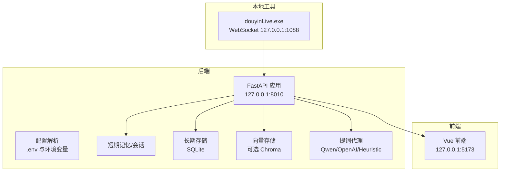
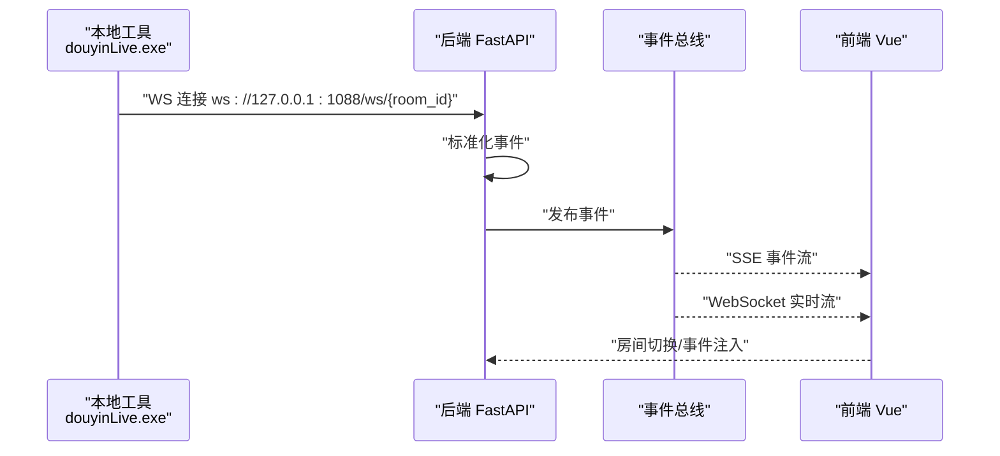
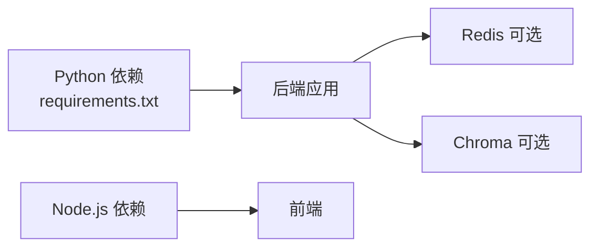

# 服务器环境准备

<cite>
**本文引用的文件**
- [README.md](file://README.md)
- [USAGE.md](file://USAGE.md)
- [backend/app.py](file://backend/app.py)
- [backend/config.py](file://backend/config.py)
- [requirements.txt](file://requirements.txt)
- [start_all.ps1](file://start_all.ps1)
- [start_backend_qwen.ps1](file://start_backend_qwen.ps1)
- [start_frontend.ps1](file://start_frontend.ps1)
- [start_all.bat](file://start_all.bat)
- [tool/config.yaml](file://tool/config.yaml)
- [data/DATABASE.md](file://data/DATABASE.md)
</cite>

## 目录
1. [简介](#简介)
2. [项目结构](#项目结构)
3. [核心组件](#核心组件)
4. [架构总览](#架构总览)
5. [详细组件分析](#详细组件分析)
6. [依赖分析](#依赖分析)
7. [性能考虑](#性能考虑)
8. [故障排查指南](#故障排查指南)
9. [结论](#结论)
10. [附录](#附录)

## 简介
本指南面向部署与运维人员，提供该实时提词系统的服务器环境准备方案，覆盖操作系统要求、硬件配置建议、网络与端口规划、防火墙与安全加固、DNS与证书、以及常见问题排查。系统由三部分组成：本地抖音消息源工具、后端（FastAPI）、前端（Vue），并通过本地 WebSocket 与后端对接，后端再通过 SSE/WebSocket 向前端推送事件与建议。

## 项目结构
- 后端：FastAPI 应用入口、配置解析、内存与存储组件、事件采集与代理服务
- 前端：Vue 3 + Vite 开发服务器
- 工具：本地抖音消息源可执行文件与配置
- 数据：SQLite 数据库与可选的 Redis、Chroma 向量存储

图表来源
- [backend/app.py:94-220](file://backend/app.py#L94-L220)
- [backend/config.py:40-94](file://backend/config.py#L40-L94)
- [README.md:35-48](file://README.md#L35-L48)

章节来源
- [README.md:21-34](file://README.md#L21-L34)
- [USAGE.md:15-23](file://USAGE.md#L15-L23)

## 核心组件
- 后端应用入口与路由：提供健康检查、SSE 与 WebSocket 实时流、事件注入与房间切换等接口
- 配置模块：从 .env 与环境变量读取运行参数，含采集器、存储、LLM 模式与超时等
- 事件采集器：连接本地 WebSocket 消息源，标准化事件并写入短期/长期存储
- 记忆与存储：短期会话内存、SQLite 长期存储、可选 Redis 与 Chroma
- 前端：开发服务器监听 127.0.0.1:5173，实时展示事件与建议

章节来源
- [backend/app.py:104-220](file://backend/app.py#L104-L220)
- [backend/config.py:40-94](file://backend/config.py#L40-L94)
- [USAGE.md:15-23](file://USAGE.md#L15-L23)

## 架构总览
系统采用本地消息源 + 后端处理 + 前端展示的分层架构。后端通过 SSE 与 WebSocket 向前端推送事件、建议与统计；同时提供 REST 接口用于房间切换与事件注入。

图表来源
- [README.md:37-48](file://README.md#L37-L48)
- [backend/app.py:187-220](file://backend/app.py#L187-L220)

## 详细组件分析

### 后端应用与端口
- 监听地址与端口：默认绑定 127.0.0.1:8010，可通过环境变量调整
- 接口类型：REST、SSE、WebSocket
- CORS：允许所有来源，便于本地开发与跨域调试

章节来源
- [backend/app.py:94-101](file://backend/app.py#L94-L101)
- [backend/app.py:104-220](file://backend/app.py#L104-L220)
- [backend/config.py:43-44](file://backend/config.py#L43-L44)

### 配置与环境变量
- 关键配置项：房间号、采集器开关与地址、会话 TTL、数据目录、数据库路径、Chroma 目录、Redis URL、LLM 模式与密钥、超时与温度等
- 解析逻辑：优先读取 .env，其次读取系统环境变量；提供默认值以保证本地开箱即用

章节来源
- [backend/config.py:11-36](file://backend/config.py#L11-L36)
- [backend/config.py:40-94](file://backend/config.py#L40-L94)

### 事件采集与本地消息源
- 本地工具：douyinLive.exe 默认在 127.0.0.1:1088 提供 WebSocket 服务
- 配置文件：可选 Cookie 与调试选项，便于登录态与问题排查
- 后端采集器：连接本地 WS，标准化事件并写入短期/长期存储

章节来源
- [USAGE.md:49-72](file://USAGE.md#L49-L72)
- [tool/config.yaml:1-16](file://tool/config.yaml#L1-L16)
- [backend/app.py:81-81](file://backend/app.py#L81-L81)

### 健康检查与实时流
- 健康检查：返回服务状态、当前房间号与活动会话
- SSE：按房间过滤事件类型，支持重连与心跳
- WebSocket：连接后先下发一次快照，随后持续推送事件与建议

章节来源
- [backend/app.py:104-107](file://backend/app.py#L104-L107)
- [backend/app.py:187-206](file://backend/app.py#L187-L206)
- [backend/app.py:209-220](file://backend/app.py#L209-L220)

### 数据存储与目录
- SQLite：默认文件 data/live_prompter.db，包含事件、观众画像、礼物、直播场次、备注等表
- 目录结构：自动创建 data、data/chroma 等目录
- 可选 Redis：短期记忆可退化为进程内内存
- 可选 Chroma：不可用时向量检索退化为轻量策略

章节来源
- [data/DATABASE.md:1-151](file://data/DATABASE.md#L1-L151)
- [backend/config.py:63-69](file://backend/config.py#L63-L69)

### 前端与开发服务器
- 默认监听 127.0.0.1:5173，严格端口模式
- 通过脚本一键启动后端与前端，或分别启动

章节来源
- [USAGE.md:116-123](file://USAGE.md#L116-L123)
- [start_frontend.ps1:21-22](file://start_frontend.ps1#L21-L22)
- [start_all.ps1:11-17](file://start_all.ps1#L11-L17)

## 依赖分析
- Python 依赖：FastAPI、Uvicorn、WebSocket 客户端、Redis、Chroma
- Node.js 依赖：前端开发与构建工具
- 可选组件：Redis、Chroma，未安装也可运行基础流程

图表来源
- [requirements.txt:1-6](file://requirements.txt#L1-L6)
- [USAGE.md:73-87](file://USAGE.md#L73-L87)

章节来源
- [requirements.txt:1-6](file://requirements.txt#L1-L6)
- [USAGE.md:73-87](file://USAGE.md#L73-L87)

## 性能考虑
- 本地通信：采集器与后端均在 127.0.0.1，延迟低、带宽占用小
- SSE/WebSocket：事件推送采用流式传输，前端可按房间过滤
- 存储选择：Redis 与 Chroma 为可选增强，不安装也能运行基本流程
- 超时与温度：合理设置 LLM 超时与温度，避免阻塞与资源浪费

章节来源
- [backend/config.py:56-61](file://backend/config.py#L56-L61)
- [backend/app.py:187-220](file://backend/app.py#L187-L220)

## 故障排查指南
- 页面打开但无建议：检查本地工具是否启动、房间号是否正确、直播间是否开播、后端是否重启
- 顶部显示 fallback：检查 API Key、网络访问百炼、是否存在超时或限流
- 顶部显示 heuristic：检查 LLM_MODE 配置或 .env 加载情况
- 前端无法访问：检查前端脚本是否正常启动、5173 端口是否被占用
- 后端启动但无数据写入：确认本地 WS 地址、房间是否有消息、后端日志中是否已连接

章节来源
- [USAGE.md:198-240](file://USAGE.md#L198-L240)

## 结论
该系统以本地消息源为核心，后端通过 SSE/WebSocket 实时推送事件与建议，前端提供可视化展示。部署时建议遵循以下原则：优先使用本地 127.0.0.1 绑定、确保采集器与后端端口连通、按需启用 Redis/Chroma、合理配置 LLM 参数与超时、关注日志与健康检查接口。

## 附录

### 操作系统与硬件要求
- 操作系统
  - Windows：官方示例与脚本基于 PowerShell，推荐使用 Windows 环境
  - Linux/macOS：可运行 Python 与 Node.js，但仓库未提供对应启动脚本，需自行适配
- 硬件配置建议（通用）
  - CPU：至少 2 核，建议 4 核以上以应对并发与模型推理
  - 内存：至少 4 GB，建议 8 GB 以上以支持 Redis/Chroma
  - 存储：SSD 20 GB 可满足开发与短期运行，生产建议更大容量与备份策略
- 网络
  - 本地 127.0.0.1 回环通信为主，无需公网暴露
  - 若需外网访问，需开放后端 HTTP 端口与 WebSocket 端口，并配置反向代理与 SSL

章节来源
- [README.md:50-57](file://README.md#L50-L57)
- [USAGE.md:15-23](file://USAGE.md#L15-L23)

### 端口与防火墙配置
- 本地端口
  - 采集器：ws://127.0.0.1:1088
  - 后端：http://127.0.0.1:8010
  - 前端：http://127.0.0.1:5173
- 防火墙建议
  - 本地开发：仅放行 127.0.0.1 对应端口
  - 生产暴露：仅放行 80/443，通过反向代理转发至 8010；禁止直接暴露 5173
  - 限制来源：仅允许内网或受信 IP 访问后端 API

章节来源
- [README.md:76-80](file://README.md#L76-L80)
- [backend/config.py:43-44](file://backend/config.py#L43-L44)
- [USAGE.md:116-123](file://USAGE.md#L116-L123)

### DNS 与 SSL 证书
- DNS：若需外网访问，配置域名解析至服务器公网 IP
- 证书：通过 ACME（Let’s Encrypt）或商业 CA 申请免费/付费证书
- 反向代理：Nginx/Apache 将 443 端口转发至后端 8010，开启 WebSocket 协议升级

章节来源
- [README.md:136-140](file://README.md#L136-L140)

### 安全加固建议
- SSH 密钥：禁用密码登录，仅允许密钥认证；更改默认端口
- 用户权限：创建专用非特权用户运行服务；最小权限原则
- 防火墙：仅开放必要端口；使用 fail2ban 等工具防暴力破解
- 证书与密钥：将 API Key 存放在安全位置，定期轮换；避免提交到版本库
- 日志审计：开启系统与应用日志，定期巡检异常连接与错误

章节来源
- [USAGE.md:32-41](file://USAGE.md#L32-L41)

### 启动脚本与环境准备
- Windows
  - 使用批处理脚本启动 PowerShell 脚本，分别启动后端与前端
  - 后端脚本：指定 host/port 并启用热更新
  - 前端脚本：检测 Node.js 并安装依赖后启动开发服务器
- Linux/macOS
  - 仓库未提供对应脚本，需自行编写 Bash/PowerShell 脚本，遵循相同端口与环境变量约定

章节来源
- [start_all.bat:1-9](file://start_all.bat#L1-L9)
- [start_all.ps1:11-17](file://start_all.ps1#L11-L17)
- [start_backend_qwen.ps1:11-12](file://start_backend_qwen.ps1#L11-L12)
- [start_frontend.ps1:15-18](file://start_frontend.ps1#L15-L18)