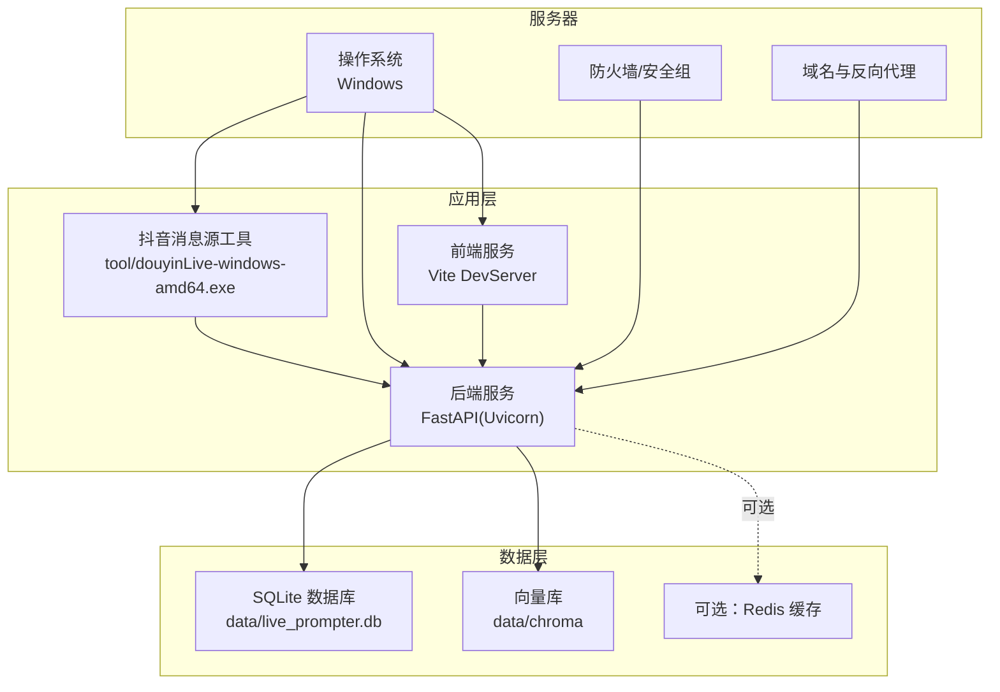
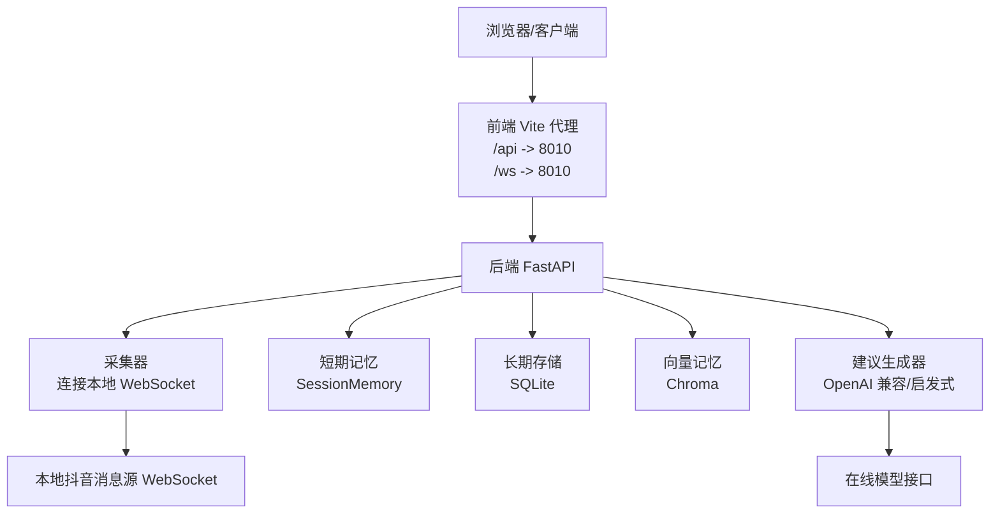
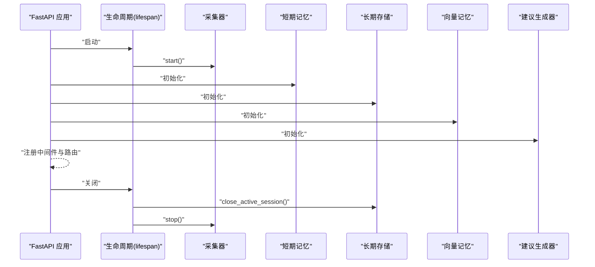
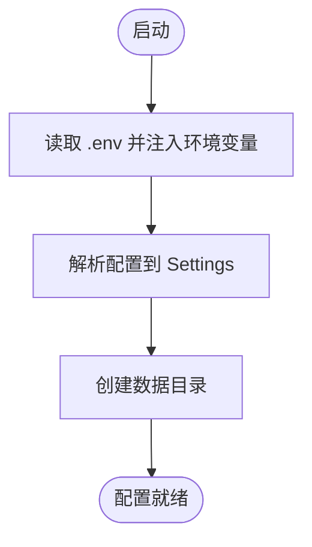
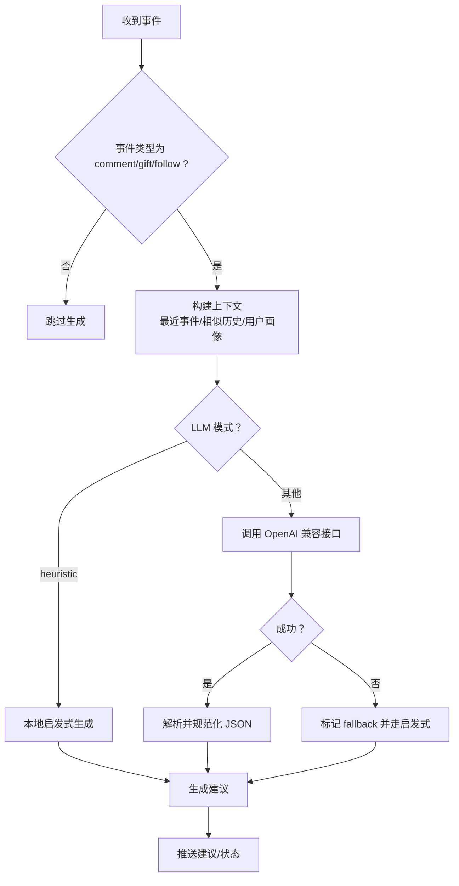
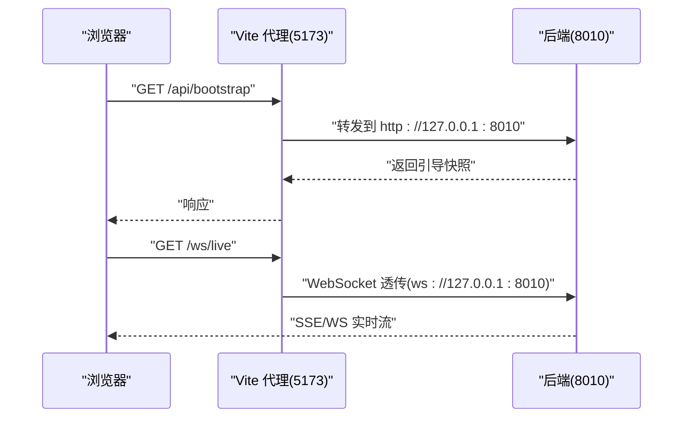
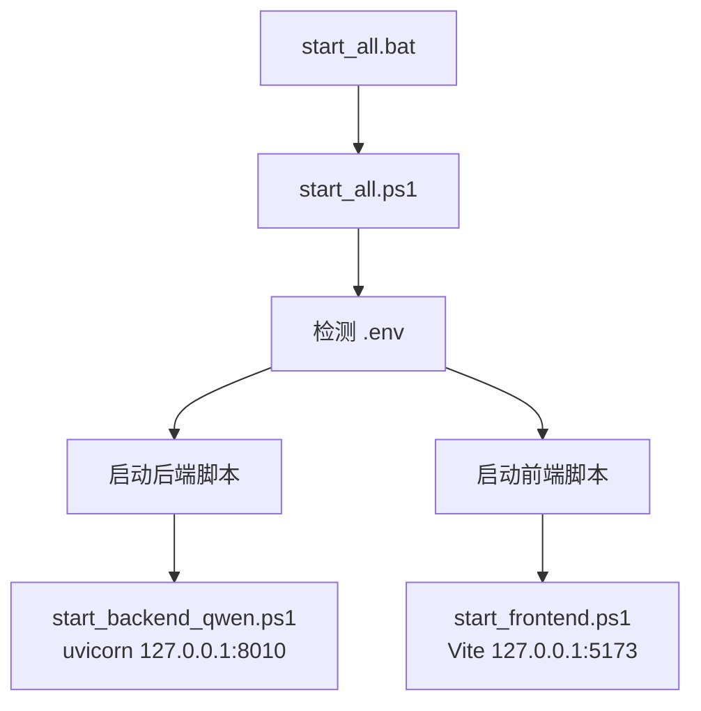
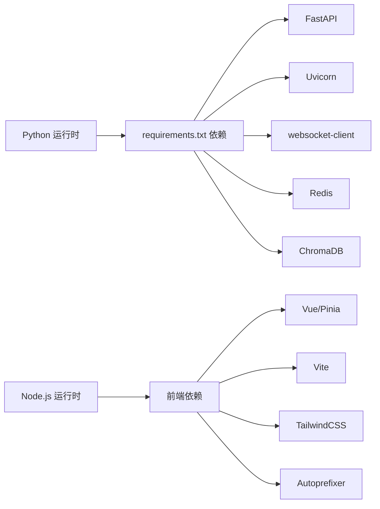

# 生产环境部署

<cite>
**本文引用的文件**
- [README.md](file://README.md)
- [USAGE.md](file://USAGE.md)
- [requirements.txt](file://requirements.txt)
- [start_all.ps1](file://start_all.ps1)
- [start_all.bat](file://start_all.bat)
- [start_backend_qwen.ps1](file://start_backend_qwen.ps1)
- [start_frontend.ps1](file://start_frontend.ps1)
- [backend/app.py](file://backend/app.py)
- [backend/config.py](file://backend/config.py)
- [backend/services/collector.py](file://backend/services/collector.py)
- [backend/services/agent.py](file://backend/services/agent.py)
- [frontend/vite.config.js](file://frontend/vite.config.js)
- [frontend/package.json](file://frontend/package.json)
- [tool/config.yaml](file://tool/config.yaml)
- [data/DATABASE.md](file://data/DATABASE.md)
</cite>

## 目录
1. [简介](#简介)
2. [项目结构](#项目结构)
3. [核心组件](#核心组件)
4. [架构总览](#架构总览)
5. [详细组件分析](#详细组件分析)
6. [依赖关系分析](#依赖关系分析)
7. [性能考虑](#性能考虑)
8. [故障排查指南](#故障排查指南)
9. [结论](#结论)
10. [附录](#附录)

## 简介
本指南面向生产环境部署，覆盖从服务器准备、环境配置、服务启动顺序与依赖关系、到性能优化与安全加固的全流程。项目由三部分组成：本地抖音消息源工具、后端（FastAPI）、前端（Vue）。后端负责事件采集、短期/长期记忆、向量检索、建议生成与实时推送；前端通过代理访问后端 API 与 WebSocket。

## 项目结构
- 后端 backend：FastAPI 应用入口、配置解析、内存与存储组件、采集器、建议生成器
- 前端 frontend：Vue 3 + Vite 开发服务器，通过代理转发 /api 与 /ws 到后端
- 工具 tool：本地抖音消息源可执行文件及配置
- 数据 data：SQLite 与向量库数据目录
- 启动脚本：PowerShell 一键启动与独立启动脚本



**图表来源**
- [backend/app.py:1-220](file://backend/app.py#L1-L220)
- [backend/config.py:1-94](file://backend/config.py#L1-L94)
- [frontend/vite.config.js:1-23](file://frontend/vite.config.js#L1-L23)
- [tool/config.yaml:1-16](file://tool/config.yaml#L1-L16)

**章节来源**
- [README.md:21-34](file://README.md#L21-L34)
- [USAGE.md:15-22](file://USAGE.md#L15-L22)

## 核心组件
- 后端应用入口与生命周期管理：负责启动采集器、内存与存储组件初始化、健康检查、SSE/WS 推送、REST 接口
- 配置模块：优先读取 .env，其次读取当前 Shell 环境变量，解析运行时配置并创建数据目录
- 采集器：连接本地抖音消息源 WebSocket，标准化为统一事件并提交到后端事件循环
- 建议生成器：优先调用 OpenAI 兼容接口，失败回退本地启发式规则
- 前端开发服务器：通过代理将 /api 与 /ws 转发至后端 8010 端口

**章节来源**
- [backend/app.py:1-220](file://backend/app.py#L1-L220)
- [backend/config.py:11-94](file://backend/config.py#L11-L94)
- [backend/services/collector.py:38-284](file://backend/services/collector.py#L38-L284)
- [backend/services/agent.py:23-393](file://backend/services/agent.py#L23-L393)
- [frontend/vite.config.js:8-22](file://frontend/vite.config.js#L8-L22)

## 架构总览
系统采用“本地消息源 + 后端 + 前端”的三层架构。后端内置采集器，通过 SSE/WS 实时推送事件与建议；前端通过代理访问后端接口。可选 Redis 与向量库提升短期记忆与相似事件检索能力。



**图表来源**
- [backend/app.py:84-220](file://backend/app.py#L84-L220)
- [backend/services/collector.py:117-139](file://backend/services/collector.py#L117-L139)
- [backend/services/agent.py:96-114](file://backend/services/agent.py#L96-L114)
- [frontend/vite.config.js:10-22](file://frontend/vite.config.js#L10-L22)

## 详细组件分析

### 后端应用与生命周期
- 生命周期钩子在应用启动时启动采集器，在关闭时清理会话并停止采集
- 初始化内存、存储与建议生成器，注册 CORS 中间件
- 提供健康检查、引导快照、房间切换、事件注入、SSE/WS 实时流等接口



**图表来源**
- [backend/app.py:84-92](file://backend/app.py#L84-L92)
- [backend/app.py:25-29](file://backend/app.py#L25-L29)

**章节来源**
- [backend/app.py:84-92](file://backend/app.py#L84-L92)
- [backend/app.py:104-220](file://backend/app.py#L104-L220)

### 配置模块与环境变量
- 优先读取项目根目录 .env，其次读取当前 Shell 环境变量
- 解析 APP_HOST/PORT、采集器参数、数据目录、Redis/Chroma 路径、LLM 模式与参数
- 自动创建数据目录（data、SQLite、Chroma）



**图表来源**
- [backend/config.py:11-36](file://backend/config.py#L11-L36)
- [backend/config.py:63-69](file://backend/config.py#L63-L69)

**章节来源**
- [backend/config.py:11-94](file://backend/config.py#L11-L94)
- [README.md:142-201](file://README.md#L142-L201)

### 采集器：本地抖音消息源连接
- 根据配置连接本地 WebSocket 地址，心跳保活，断线重连
- 将原始消息标准化为统一事件，提交到后端事件处理循环
- 支持房间切换，动态更新目标房间

```mermaid
sequenceDiagram
participant Col as "采集器"
participant WS as "本地 WebSocket"
participant Loop as "后端事件循环"
participant Proc as "事件处理"
Col->>WS : "建立连接"
WS-->>Col : "消息(JSON)"
Col->>Col : "标准化为 LiveEvent"
Col->>Loop : "run_coroutine_threadsafe(process_event)"
Loop->>Proc : "调度处理"
Proc-->>Loop : "返回建议/统计"
Loop-->>Col : "发布事件/建议/状态"
```

**图表来源**
- [backend/services/collector.py:117-139](file://backend/services/collector.py#L117-L139)
- [backend/services/collector.py:200-214](file://backend/services/collector.py#L200-L214)
- [backend/app.py:61-78](file://backend/app.py#L61-L78)

**章节来源**
- [backend/services/collector.py:38-284](file://backend/services/collector.py#L38-L284)
- [README.md:76-80](file://README.md#L76-L80)

### 建议生成器：模型与启发式回退
- 优先调用 OpenAI 兼容接口生成建议，失败时回退本地启发式规则
- 构造上下文（最近事件、相似历史、用户画像），解析模型返回并规范化字段
- 维护模型状态（模式、模型名、后端地址、最后结果、错误信息）



**图表来源**
- [backend/services/agent.py:73-114](file://backend/services/agent.py#L73-L114)
- [backend/services/agent.py:183-330](file://backend/services/agent.py#L183-L330)

**章节来源**
- [backend/services/agent.py:23-393](file://backend/services/agent.py#L23-L393)
- [README.md:308-317](file://README.md#L308-L317)

### 前端开发服务器与代理
- Vite 开发服务器监听 5173 端口
- 代理规则：/api -> http://127.0.0.1:8010，/ws -> ws://127.0.0.1:8010
- 前端通过同源路径访问后端接口与 WebSocket



**图表来源**
- [frontend/vite.config.js:10-22](file://frontend/vite.config.js#L10-L22)

**章节来源**
- [frontend/vite.config.js:1-23](file://frontend/vite.config.js#L1-L23)
- [USAGE.md:116-122](file://USAGE.md#L116-L122)

### 服务启动脚本与顺序
- 一键启动脚本：检测 .env，分别在新 PowerShell 窗口中启动后端与前端
- 后端脚本：检测 .env，启动 Uvicorn（127.0.0.1:8010）
- 前端脚本：检测 Node.js，安装依赖（如缺失），启动 Vite 开发服务器（127.0.0.1:5173）
- 批处理脚本：调用 PowerShell 一键启动脚本



**图表来源**
- [start_all.bat:1-9](file://start_all.bat#L1-L9)
- [start_all.ps1:1-18](file://start_all.ps1#L1-L18)
- [start_backend_qwen.ps1:1-13](file://start_backend_qwen.ps1#L1-L13)
- [start_frontend.ps1:1-22](file://start_frontend.ps1#L1-L22)

**章节来源**
- [USAGE.md:89-114](file://USAGE.md#L89-L114)
- [README.md:115-128](file://README.md#L115-L128)

## 依赖关系分析
- 后端依赖：FastAPI、Uvicorn、websocket-client、Redis、ChromaDB
- 前端依赖：Vue、Pinia、Vite、TailwindCSS、PostCSS
- 工具：本地抖音消息源可执行文件
- 数据：SQLite 与向量库目录



**图表来源**
- [requirements.txt:1-6](file://requirements.txt#L1-L6)
- [frontend/package.json:11-22](file://frontend/package.json#L11-L22)

**章节来源**
- [requirements.txt:1-6](file://requirements.txt#L1-6)
- [frontend/package.json:1-23](file://frontend/package.json#L1-L23)
- [README.md:50-65](file://README.md#L50-L65)

## 性能考虑
- 线程与事件循环：采集器在独立线程中运行，通过线程安全方式提交事件到后端事件循环，避免阻塞
- 心跳与重连：采集器周期性发送 ping 并具备断线重连延迟，降低网络抖动影响
- SSE/WS：后端使用队列订阅/取消订阅，减少无效推送
- LLM 调用：建议设置合理超时与温度，必要时启用本地启发式兜底
- 数据存储：SQLite 与向量库路径可配置，建议将数据目录置于高性能磁盘
- 前端代理：Vite 代理仅用于开发，生产应通过 Nginx/Apache 反代静态资源与 API

**章节来源**
- [backend/services/collector.py:182-198](file://backend/services/collector.py#L182-L198)
- [backend/services/collector.py:136-138](file://backend/services/collector.py#L136-L138)
- [backend/app.py:187-206](file://backend/app.py#L187-L206)
- [backend/services/agent.py:183-330](file://backend/services/agent.py#L183-L330)
- [backend/config.py:54-61](file://backend/config.py#L54-L61)

## 故障排查指南
- 页面空白或无建议
  - 检查抖音消息源是否已启动，确认 .env 中 ROOM_ID 正确且直播间开播
  - 重启后端以确保加载最新版本
- 顶部显示 fallback
  - 检查 LLM API Key、网络访问百炼、是否存在超时或限流
- 顶部显示 heuristic
  - 检查 .env 中 LLM_MODE 设置或是否正确加载 .env
- 前端无法打开
  - 检查 start_frontend.ps1 是否正常启动，确认 5173 端口未被占用
- 后端启动但无数据写入
  - 确认抖音消息源运行、后端日志中已连接本地 WebSocket、当前房间有消息

**章节来源**
- [USAGE.md:198-239](file://USAGE.md#L198-L239)
- [README.md:142-201](file://README.md#L142-L201)

## 结论
生产部署需重点关注：环境变量与 .env 的正确性、采集器与后端的启动顺序、SSE/WS 的连通性、以及可选组件（Redis、向量库）的可用性。通过合理的超时与回退策略、数据目录与磁盘规划、以及前端代理到生产反向代理的迁移，可获得稳定高效的直播提词系统。

## 附录

### 服务器准备与基础设施
- 操作系统：Windows（项目当前为 Windows 环境）
- 端口规划
  - 后端：127.0.0.1:8010（开发时）
  - 前端：127.0.0.1:5173（开发时）
  - 抖音消息源：默认本地 WebSocket 端口 1088
- 防火墙/安全组：开放 8010（如需外网访问）；生产环境建议通过反向代理暴露
- 域名与反向代理：生产环境通过 Nginx/Apache 将 /api 与 /ws 反代至后端 8010 端口，静态资源由 Nginx 提供

**章节来源**
- [README.md:50-56](file://README.md#L50-L56)
- [USAGE.md:116-122](file://USAGE.md#L116-L122)
- [frontend/vite.config.js:10-22](file://frontend/vite.config.js#L10-L22)

### 生产环境配置优化
- 性能调优
  - 后端：使用生产 WSGI 服务器（如 uvicorn 的生产部署模式）替代开发模式
  - 前端：构建产物由 Nginx 提供，开启 gzip/HTTP2
  - 数据：将 data 目录置于 SSD，定期备份 SQLite 与向量库
- 安全加固
  - 严格管理 .env，禁止提交到版本库
  - 限制后端对外访问，仅开放必要的反向代理端口
  - LLM API Key 使用只读权限与配额控制
- 资源限制
  - 为后端与前端进程设置 CPU/内存上限
  - 采集器与建议生成器的超时与重试策略需结合业务峰值调整

**章节来源**
- [backend/config.py:54-61](file://backend/config.py#L54-L61)
- [USAGE.md:32-41](file://USAGE.md#L32-L41)

### 数据库与存储
- SQLite 表结构与常用查询参考数据说明文档
- 建议定期归档与压缩历史数据，监控磁盘空间

**章节来源**
- [data/DATABASE.md:1-151](file://data/DATABASE.md#L1-L151)