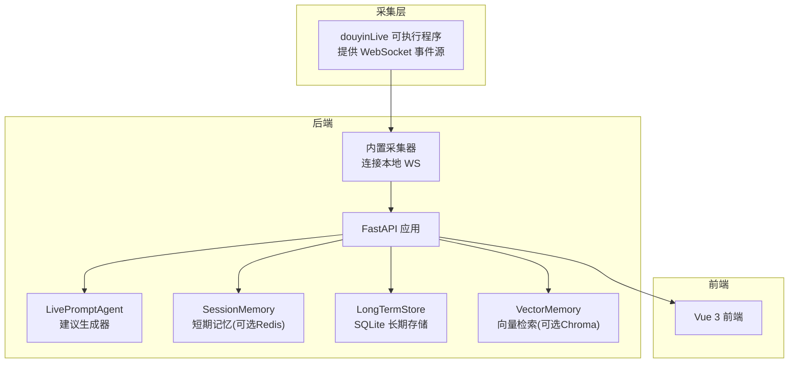
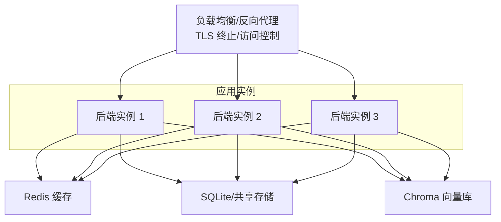
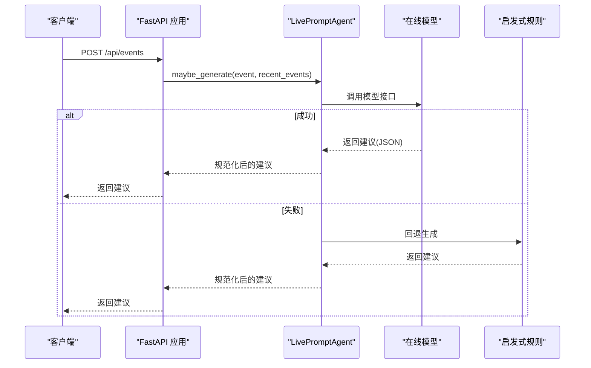
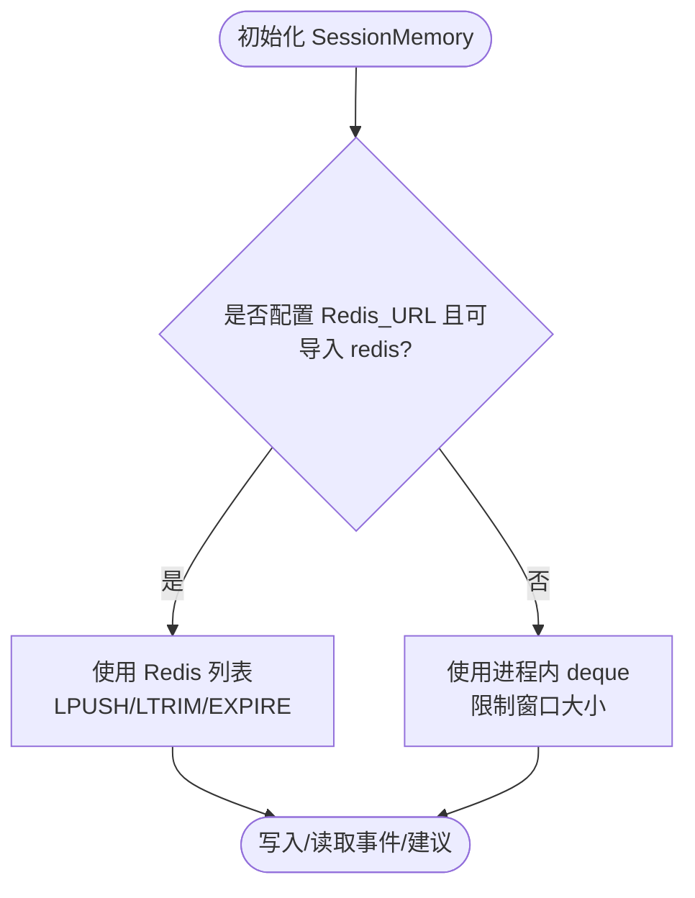
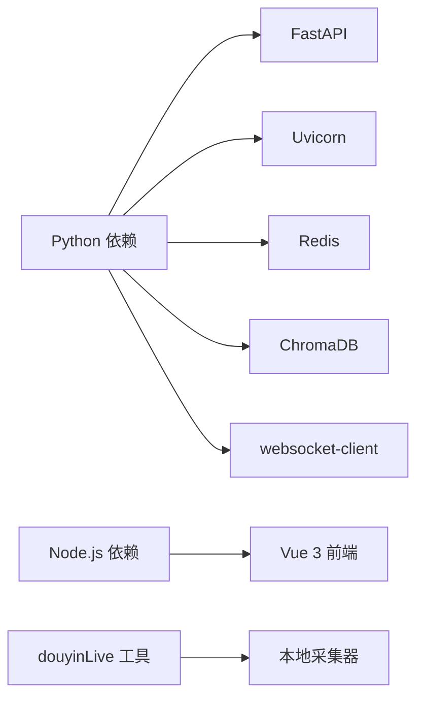

# 配置优化

<cite>
**本文引用的文件**
- [README.md](file://README.md)
- [USAGE.md](file://USAGE.md)
- [backend/config.py](file://backend/config.py)
- [backend/app.py](file://backend/app.py)
- [backend/memory/session_memory.py](file://backend/memory/session_memory.py)
- [backend/memory/vector_store.py](file://backend/memory/vector_store.py)
- [backend/memory/long_term.py](file://backend/memory/long_term.py)
- [backend/services/agent.py](file://backend/services/agent.py)
- [tool/config.yaml](file://tool/config.yaml)
- [requirements.txt](file://requirements.txt)
- [start_all.ps1](file://start_all.ps1)
- [start_backend_qwen.ps1](file://start_backend_qwen.ps1)
</cite>

## 目录
1. [简介](#简介)
2. [项目结构](#项目结构)
3. [核心组件](#核心组件)
4. [架构总览](#架构总览)
5. [详细组件分析](#详细组件分析)
6. [依赖分析](#依赖分析)
7. [性能考虑](#性能考虑)
8. [故障排查指南](#故障排查指南)
9. [结论](#结论)
10. [附录](#附录)

## 简介
本指南聚焦生产环境配置优化，覆盖性能调优、安全加固、资源限制与监控、以及高可用部署方案。结合项目现有实现，系统性梳理 .env 环境变量、后端服务、采集链路、存储与缓存、模型调用与回退策略，并提供可落地的最佳实践与排障建议。

## 项目结构
项目采用前后端分离与工具链协同的结构：
- 后端：FastAPI 应用，负责事件处理、SSE/WebSocket 推送、模型建议生成、短期/长期存储与向量检索。
- 前端：Vue 3 应用，实时展示事件流、建议与模型状态。
- 工具：本地抖音直播消息采集器，提供 WebSocket 事件源。
- 配置：.env 读取与解析、Redis/Chroma 可选增强、SQLite 长期存储。

图示来源
- [backend/app.py:94-220](file://backend/app.py#L94-L220)
- [backend/config.py:39-94](file://backend/config.py#L39-L94)
- [backend/memory/session_memory.py:17-113](file://backend/memory/session_memory.py#L17-L113)
- [backend/memory/long_term.py:36-750](file://backend/memory/long_term.py#L36-L750)
- [backend/memory/vector_store.py:52-108](file://backend/memory/vector_store.py#L52-L108)
- [backend/services/agent.py:23-393](file://backend/services/agent.py#L23-L393)

章节来源
- [README.md:21-34](file://README.md#L21-L34)
- [backend/app.py:94-220](file://backend/app.py#L94-L220)
- [backend/config.py:39-94](file://backend/config.py#L39-L94)

## 核心组件
- 配置系统：优先读取 .env，其次读取当前 shell 环境变量，集中解析运行参数与模型地址/模型名回退逻辑。
- 事件处理：接收标准化直播事件，写入短期/长期存储，触发建议生成与状态推送。
- 建议生成：优先调用在线模型，失败回退至启发式规则；同时维护模型状态快照。
- 存储与检索：短期记忆可选 Redis；长期存储使用 SQLite；向量检索可选 Chroma，否则使用轻量哈希嵌入与文本相似度。

章节来源
- [backend/config.py:11-36](file://backend/config.py#L11-L36)
- [backend/config.py:70-91](file://backend/config.py#L70-L91)
- [backend/app.py:61-78](file://backend/app.py#L61-L78)
- [backend/services/agent.py:23-114](file://backend/services/agent.py#L23-L114)
- [backend/memory/session_memory.py:17-113](file://backend/memory/session_memory.py#L17-L113)
- [backend/memory/long_term.py:36-155](file://backend/memory/long_term.py#L36-L155)
- [backend/memory/vector_store.py:52-108](file://backend/memory/vector_store.py#L52-L108)

## 架构总览
生产环境建议采用反向代理 + 多实例 + 缓存/存储分离的高可用架构，配合健康检查与灰度发布策略。

图示来源
- [backend/memory/session_memory.py:17-31](file://backend/memory/session_memory.py#L17-L31)
- [backend/memory/long_term.py:36-155](file://backend/memory/long_term.py#L36-L155)
- [backend/memory/vector_store.py:52-63](file://backend/memory/vector_store.py#L52-L63)

## 详细组件分析

### 配置与 .env 参数
- 读取顺序：项目根目录 .env 优先；若不存在则读取当前 shell 环境变量。
- 关键参数（按用途分类）：
  - 直播与采集
    - ROOM_ID：直播房间标识
    - COLLECTOR_ENABLED：是否启用内置采集器
    - COLLECTOR_HOST/PORT：本地采集器监听地址
    - COLLECTOR_PING_INTERVAL_SECONDS/RECONNECT_DELAY_SECONDS：心跳与重连策略
  - 后端服务
    - APP_HOST/APP_PORT：服务绑定地址与端口
  - 模型与推理
    - LLM_MODE：模式选择（heuristic/qwen/openai）
    - LLM_API_KEY/DASHSCOPE_API_KEY：API 密钥回退机制
    - LLM_BASE_URL/LLM_MODEL：模型网关与模型名
    - LLM_TEMPERATURE/LLM_TIMEOUT_SECONDS：温度与超时
  - 存储与缓存
    - REDIS_URL：Redis 地址（为空则短期记忆退化为进程内队列）
    - DATA_DIR/DATABASE_PATH/CHROMA_DIR：数据目录与数据库/向量库路径
    - SESSION_TTL_SECONDS：Redis 热数据 TTL
  - 其他
    - 日志与运行时目录由配置类统一创建

章节来源
- [README.md:142-207](file://README.md#L142-L207)
- [USAGE.md:24-48](file://USAGE.md#L24-L48)
- [backend/config.py:11-36](file://backend/config.py#L11-L36)
- [backend/config.py:43-61](file://backend/config.py#L43-L61)
- [backend/config.py:63-69](file://backend/config.py#L63-L69)
- [backend/config.py:70-91](file://backend/config.py#L70-L91)

### 建议生成与回退流程
建议生成器在在线模型失败时自动回退至启发式规则，并记录模型状态快照（模式、模型名、后端地址、结果、错误、时间戳）。

图示来源
- [backend/app.py:129-133](file://backend/app.py#L129-L133)
- [backend/services/agent.py:73-114](file://backend/services/agent.py#L73-L114)
- [backend/services/agent.py:183-329](file://backend/services/agent.py#L183-L329)

章节来源
- [backend/services/agent.py:23-114](file://backend/services/agent.py#L23-L114)
- [backend/services/agent.py:183-329](file://backend/services/agent.py#L183-L329)

### 短期记忆与 Redis 降级
- Redis 模式：使用列表结构维护最近事件与建议，支持 TTL 控制热数据生命周期。
- 未安装 Redis 或未配置地址时，退化为进程内双端队列，保证基本可用。

图示来源
- [backend/memory/session_memory.py:17-31](file://backend/memory/session_memory.py#L17-L31)
- [backend/memory/session_memory.py:42-64](file://backend/memory/session_memory.py#L42-L64)
- [backend/memory/session_memory.py:66-84](file://backend/memory/session_memory.py#L66-L84)

章节来源
- [backend/memory/session_memory.py:17-113](file://backend/memory/session_memory.py#L17-L113)

### 长期存储与索引
- SQLite 表结构：events、suggestions、viewer_profiles、viewer_gifts、live_sessions、viewer_notes。
- 自动建表、索引与列补齐；支持事件回填与聚合重建。
- 会话管理：自动创建/激活/结束直播会话，统计事件计数与类型分布。

章节来源
- [backend/memory/long_term.py:50-155](file://backend/memory/long_term.py#L50-L155)
- [backend/memory/long_term.py:276-325](file://backend/memory/long_term.py#L276-L325)
- [backend/memory/long_term.py:420-454](file://backend/memory/long_term.py#L420-L454)

### 向量检索与降级
- 可选 Chroma：持久化集合，支持 upsert/query。
- 无 Chroma 时：使用哈希嵌入函数与关键词重叠计算，维持检索能力。

章节来源
- [backend/memory/vector_store.py:52-108](file://backend/memory/vector_store.py#L52-L108)

### 采集与事件流
- 采集器连接本地 WebSocket（默认 127.0.0.1:1088），标准化为 LiveEvent。
- 后端提供 SSE 与 WebSocket 实时流，支持房间过滤与事件类型过滤。

章节来源
- [README.md:68-81](file://README.md#L68-L81)
- [backend/app.py:187-206](file://backend/app.py#L187-L206)
- [backend/app.py:209-220](file://backend/app.py#L209-L220)

## 依赖分析
- Python 依赖：FastAPI、Uvicorn、Redis、ChromaDB、websocket-client。
- 前端依赖：Node.js 16+，通过 npm 安装。
- 工具：Windows 平台的抖音直播采集器。

图示来源
- [requirements.txt:1-6](file://requirements.txt#L1-L6)
- [USAGE.md:73-87](file://USAGE.md#L73-L87)

章节来源
- [requirements.txt:1-6](file://requirements.txt#L1-L6)
- [USAGE.md:15-22](file://USAGE.md#L15-L22)

## 性能考虑
- 并发与连接
  - Uvicorn 默认多进程/多线程，建议根据 CPU 核心数与内存上限合理设置 workers 与 threads。
  - SSE/WebSocket 连接数：按峰值在线观众数与活跃房间数评估，预留缓冲。
- 内存与缓存
  - Redis：开启持久化与合理淘汰策略；为短期事件列表设置 TTL，避免无限增长。
  - 进程内短期记忆：限制窗口大小，避免内存膨胀。
- 存储与查询
  - SQLite：为高频查询列建立索引；定期维护与分析表统计。
  - 向量检索：Chroma 需要磁盘空间与内存，建议独立挂载高性能存储。
- 模型调用
  - 超时与重试：合理设置 LLM_TIMEOUT_SECONDS，避免阻塞请求线程。
  - 回退策略：在线失败快速回退启发式规则，保障实时性。
- I/O 与网络
  - 采集器与后端同机部署，减少网络抖动。
  - 前端与后端之间建议启用压缩（gzip/br）与长连接复用。

[本节为通用性能指导，无需特定文件引用]

## 故障排查指南
- 环境变量与密钥
  - 确认 .env 已复制并填写 ROOM_ID、LLM_MODE、API_KEY 等关键参数。
  - 若 LLM_MODE=heuristic，确认非误设导致无模型输出。
- 采集链路
  - 确认本地采集器已启动，WebSocket 地址与房间号一致。
  - 查看后端日志是否连接到 ws://127.0.0.1:1088/ws/{room_id}。
- 模型与回退
  - 顶部状态显示 fallback：检查 API Key、网络连通性、超时与限流。
  - 显示 heuristic：检查 .env 加载与 LLM_MODE 设置。
- 数据写入
  - 确认采集器运行、房间开播且有消息；查看 SQLite 文件是否存在与可写。
- 前端与后端
  - 端口占用与跨域：后端已允许所有来源，生产环境建议收紧 CORS。
  - 健康检查：GET /health 返回服务状态与当前房间号。

章节来源
- [USAGE.md:198-256](file://USAGE.md#L198-L256)
- [README.md:208-275](file://README.md#L208-L275)
- [backend/app.py:104-107](file://backend/app.py#L104-L107)

## 结论
通过 .env 参数化与可插拔的存储/缓存/向量检索，项目可在生产环境中实现高可用与可扩展。建议结合负载均衡、Redis/Chroma 独立部署、严格的超时与回退策略、以及完善的监控告警，持续优化性能与稳定性。

[本节为总结，无需特定文件引用]

## 附录

### 生产环境配置清单（.env）
- 直播与采集
  - ROOM_ID、COLLECTOR_ENABLED、COLLECTOR_HOST、COLLECTOR_PORT、COLLECTOR_PING_INTERVAL_SECONDS、COLLECTOR_RECONNECT_DELAY_SECONDS
- 后端服务
  - APP_HOST、APP_PORT
- 模型与推理
  - LLM_MODE、LLM_API_KEY/DASHSCOPE_API_KEY、LLM_BASE_URL、LLM_MODEL、LLM_TEMPERATURE、LLM_TIMEOUT_SECONDS
- 存储与缓存
  - REDIS_URL、DATA_DIR、DATABASE_PATH、CHROMA_DIR、SESSION_TTL_SECONDS

章节来源
- [README.md:142-207](file://README.md#L142-L207)
- [USAGE.md:24-48](file://USAGE.md#L24-L48)

### 启动脚本与运行方式
- 统一启动：start_all.ps1 会检查 .env 并分别启动后端与前端。
- 后端启动：start_backend_qwen.ps1 以 Qwen 在线模式启动后端。
- 前端：通过 npm 安装依赖后启动开发服务器。

章节来源
- [start_all.ps1:6-17](file://start_all.ps1#L6-L17)
- [start_backend_qwen.ps1:6-12](file://start_backend_qwen.ps1#L6-L12)
- [USAGE.md:73-114](file://USAGE.md#L73-L114)