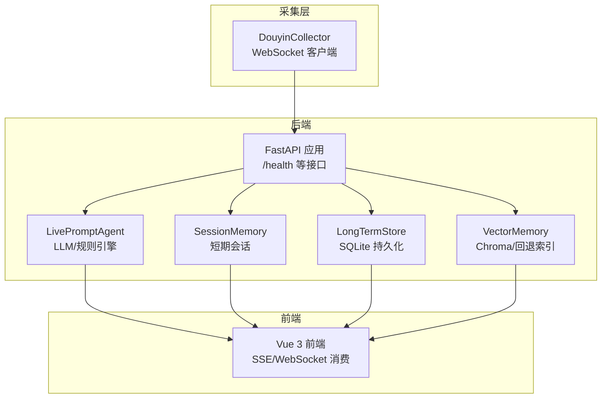
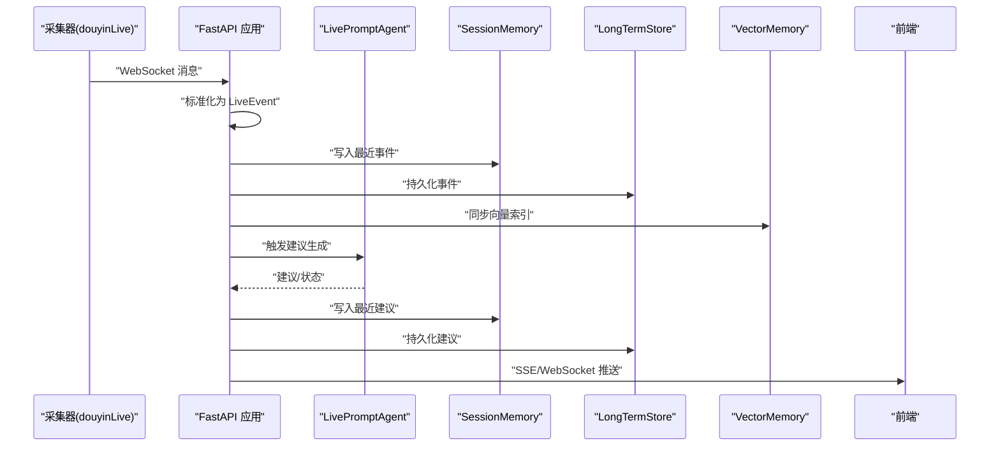
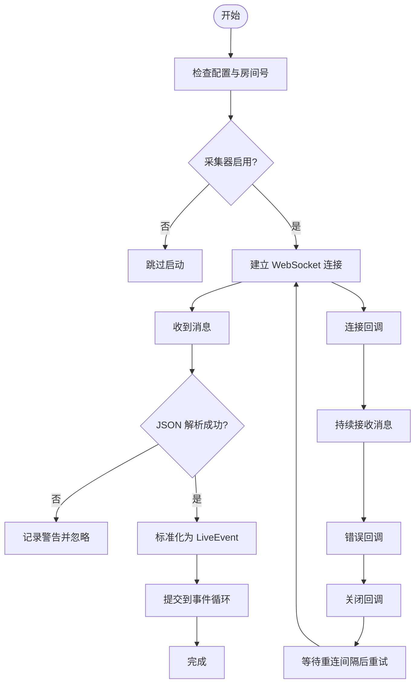
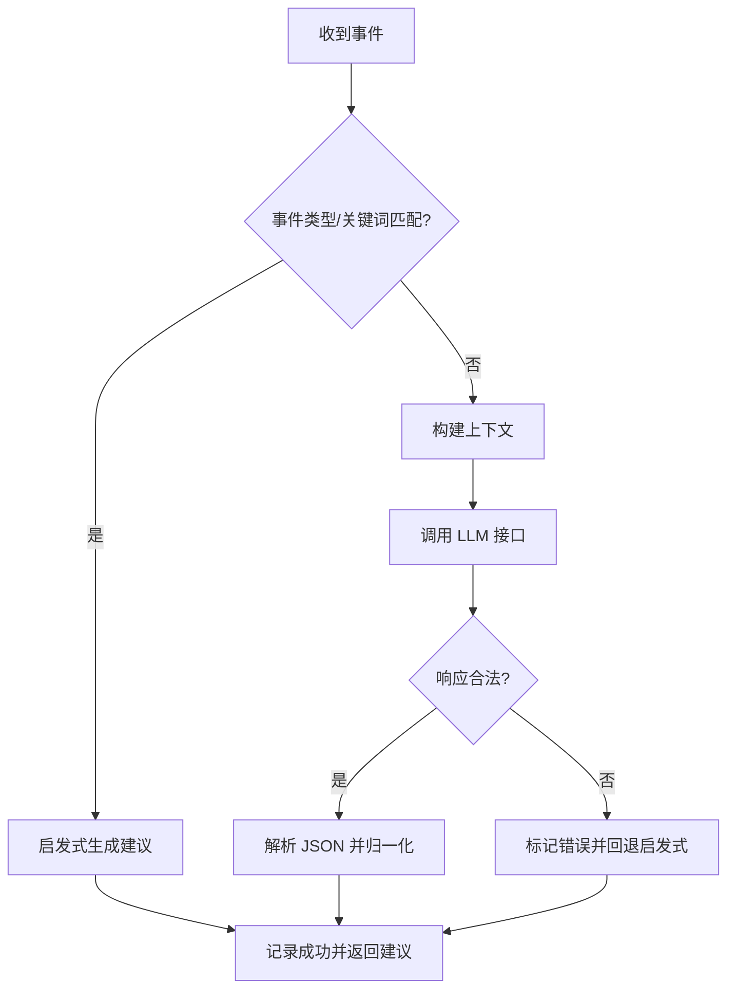
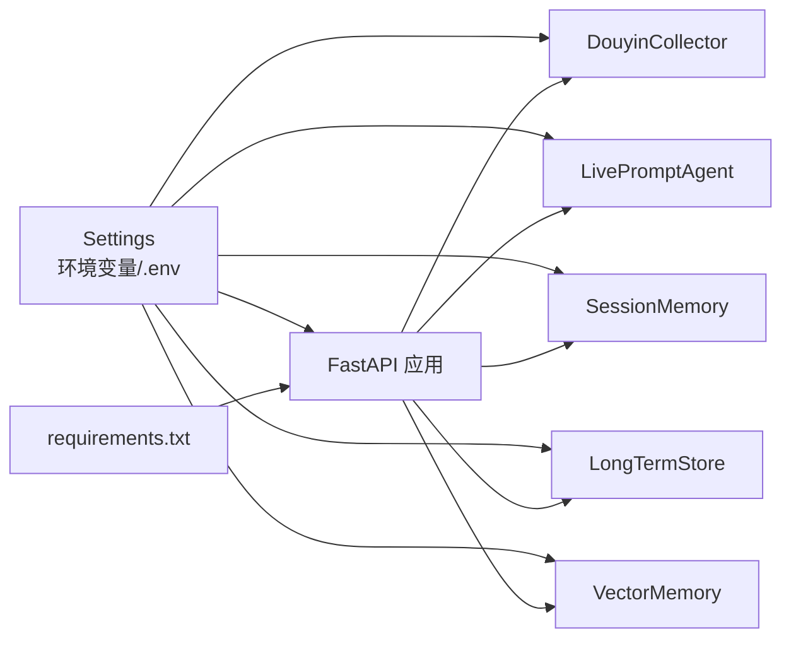

# 监控与日志

<cite>
**本文引用的文件**
- [README.md](file://README.md)
- [backend/app.py](file://backend/app.py)
- [backend/config.py](file://backend/config.py)
- [backend/services/collector.py](file://backend/services/collector.py)
- [backend/services/agent.py](file://backend/services/agent.py)
- [backend/memory/session_memory.py](file://backend/memory/session_memory.py)
- [backend/memory/long_term.py](file://backend/memory/long_term.py)
- [backend/memory/vector_store.py](file://backend/memory/vector_store.py)
- [backend/memory/embedding_service.py](file://backend/memory/embedding_service.py)
- [tests/test_agent.py](file://tests/test_agent.py)
- [tests/test_embedding_service.py](file://tests/test_embedding_service.py)
- [tool/config.yaml](file://tool/config.yaml)
- [requirements.txt](file://requirements.txt)
</cite>

## 目录
1. [简介](#简介)
2. [项目结构](#项目结构)
3. [核心组件](#核心组件)
4. [架构总览](#架构总览)
5. [详细组件分析](#详细组件分析)
6. [依赖分析](#依赖分析)
7. [性能考量](#性能考量)
8. [故障排查指南](#故障排查指南)
9. [结论](#结论)
10. [附录](#附录)

## 简介
本指南围绕 DouYin_llm 项目的监控与日志管理展开，目标是帮助运维与开发者建立完善的运行状态监控、日志组织与分析、性能指标观测、错误收集与告警、日志轮转与归档，以及远程日志收集与集中化管理的实践方案。DouYin_llm 由采集器、FastAPI 后端与 Vue 前端三部分组成，系统当前主要依赖标准日志进行可观测性，后续可扩展集成指标与告警体系。

## 项目结构
- 后端（FastAPI）
  - 应用入口与路由：backend/app.py
  - 配置加载与环境变量：backend/config.py
  - 业务组件：collector（采集器）、agent（LLM/规则引擎）、memory（短期/长期/向量记忆）
- 前端（Vue 3）
  - 通过 Pinia Store 与组件交互，消费后端 SSE/WebSocket 实时流
- 采集器（tool/douyinLive-windows-amd64.exe）
  - 本地 WebSocket 采集抖音直播事件，供后端统一处理
- 日志与数据
  - 日志目录：logs/
  - 数据目录：data/（SQLite 与 Chroma）

图表来源
- [backend/app.py:108-136](file://backend/app.py#L108-L136)
- [backend/services/collector.py:38-100](file://backend/services/collector.py#L38-L100)
- [backend/services/agent.py:23-496](file://backend/services/agent.py#L23-L496)
- [backend/memory/session_memory.py:17-113](file://backend/memory/session_memory.py#L17-L113)
- [backend/memory/long_term.py:44-967](file://backend/memory/long_term.py#L44-L967)
- [backend/memory/vector_store.py:59-317](file://backend/memory/vector_store.py#L59-L317)

章节来源
- [README.md:19-223](file://README.md#L19-L223)
- [backend/app.py:108-136](file://backend/app.py#L108-L136)
- [backend/config.py:40-113](file://backend/config.py#L40-L113)

## 核心组件
- 健康检查接口
  - GET /health：返回后端运行状态、当前房间与活动会话摘要
- 事件处理链路
  - 采集器接收 WebSocket 事件，标准化为 LiveEvent，投递至 FastAPI 事件循环
  - 后端写入短期会话、长期数据库、向量索引，同时生成建议并通过 SSE/WebSocket 推送
- 记忆与检索
  - SessionMemory：短期事件与建议缓存（Redis 或内存队列）
  - LongTermStore：SQLite 表结构与聚合统计
  - VectorMemory：Chroma 向量索引或本地回退
- LLM 与规则引擎
  - LivePromptAgent：根据事件类型与上下文选择 LLM 或启发式规则生成建议
- 配置与环境
  - Settings：集中管理运行参数，含采集、后端、模型、向量与嵌入等配置项

章节来源
- [backend/app.py:129-136](file://backend/app.py#L129-L136)
- [backend/services/collector.py:207-266](file://backend/services/collector.py#L207-L266)
- [backend/memory/session_memory.py:17-113](file://backend/memory/session_memory.py#L17-L113)
- [backend/memory/long_term.py:44-967](file://backend/memory/long_term.py#L44-L967)
- [backend/memory/vector_store.py:59-317](file://backend/memory/vector_store.py#L59-L317)
- [backend/services/agent.py:23-496](file://backend/services/agent.py#L23-L496)
- [backend/config.py:40-113](file://backend/config.py#L40-L113)

## 架构总览
系统运行时的关键交互如下：

图表来源
- [backend/app.py:73-102](file://backend/app.py#L73-L102)
- [backend/services/collector.py:145-160](file://backend/services/collector.py#L145-L160)
- [backend/services/agent.py:105-142](file://backend/services/agent.py#L105-L142)
- [backend/memory/session_memory.py:42-64](file://backend/memory/session_memory.py#L42-L64)
- [backend/memory/long_term.py:454-488](file://backend/memory/long_term.py#L454-L488)
- [backend/memory/vector_store.py:149-171](file://backend/memory/vector_store.py#L149-L171)

## 详细组件分析

### 健康检查与运行状态
- /health 接口
  - 返回 status、当前房间号、活动会话摘要
  - 便于外部探活与编排系统判断后端可用性
- 生命周期与资源释放
  - FastAPI lifespan 在启动时启动采集器，在关闭时关闭活动会话并停止采集器

章节来源
- [backend/app.py:129-136](file://backend/app.py#L129-L136)
- [backend/app.py:108-117](file://backend/app.py#L108-L117)

### 采集器日志与监控要点
- 连接与重连
  - 连接成功/失败、异常关闭、ping 间隔、重连延迟
- 事件解析
  - 非 JSON 消息忽略、消息标准化失败、提交到事件循环结果记录
- 建议关键日志
  - 连接建立、断开、异常、重连等待、事件提交结果

图表来源
- [backend/services/collector.py:61-140](file://backend/services/collector.py#L61-L140)
- [backend/services/collector.py:145-180](file://backend/services/collector.py#L145-L180)
- [backend/services/collector.py:207-266](file://backend/services/collector.py#L207-L266)

章节来源
- [backend/services/collector.py:61-140](file://backend/services/collector.py#L61-L140)
- [backend/services/collector.py:145-180](file://backend/services/collector.py#L145-L180)
- [backend/services/collector.py:207-266](file://backend/services/collector.py#L207-L266)

### LLM/规则引擎日志与性能
- LLM 调用
  - 成功生成建议、HTTP 错误、网络错误、超时、JSON 非法、缺失字段、异常等
  - 状态上报：模式、模型、后端、最后结果、错误码、更新时间
- 规则引擎
  - 基于事件类型与关键词的短路逻辑，优先使用启发式规则
- 性能观测点
  - LLM 请求耗时、超时阈值、模型响应体解析、建议置信度与优先级

图表来源
- [backend/services/agent.py:105-142](file://backend/services/agent.py#L105-L142)
- [backend/services/agent.py:200-217](file://backend/services/agent.py#L200-L217)
- [backend/services/agent.py:302-437](file://backend/services/agent.py#L302-L437)

章节来源
- [backend/services/agent.py:105-142](file://backend/services/agent.py#L105-L142)
- [backend/services/agent.py:200-217](file://backend/services/agent.py#L200-L217)
- [backend/services/agent.py:302-437](file://backend/services/agent.py#L302-L437)

### 向量与嵌入服务日志
- 向量检索
  - 事件相似度检索、观众记忆检索、评分与排序、回退到本地索引
- 嵌入服务
  - 云嵌入/本地嵌入/哈希回退，异常时记录警告并切换回退策略
- 关键日志
  - 初始化集合、查询结果、回退原因、评分计算

章节来源
- [backend/memory/vector_store.py:59-317](file://backend/memory/vector_store.py#L59-L317)
- [backend/memory/embedding_service.py:18-102](file://backend/memory/embedding_service.py#L18-L102)

### 短期/长期记忆与统计
- SessionMemory
  - 事件与建议的滑动窗口、统计指标（评论/礼物/点赞/成员/关注）
- LongTermStore
  - SQLite 表结构、索引、聚合统计、会话生命周期、观众画像与笔记

章节来源
- [backend/memory/session_memory.py:17-113](file://backend/memory/session_memory.py#L17-L113)
- [backend/memory/long_term.py:44-967](file://backend/memory/long_term.py#L44-L967)

### 前端应用日志与监控
- 前端通过 SSE 与 WebSocket 接收后端推送的事件、建议、统计与模型状态
- 建议在前端侧记录连接状态、重连次数、消息类型与解析耗时，辅助定位网络与协议问题

章节来源
- [backend/app.py:252-285](file://backend/app.py#L252-L285)
- [README.md:151-166](file://README.md#L151-L166)

## 依赖分析
- 运行时依赖
  - FastAPI、Uvicorn、websocket-client、redis、chromadb
- 配置来源
  - 环境变量与 .env 文件，Settings 类统一解析与默认值
- 采集器配置
  - tool/config.yaml 提供 WebSocket 端口与 Cookie 示例

图表来源
- [backend/config.py:40-113](file://backend/config.py#L40-L113)
- [requirements.txt:1-6](file://requirements.txt#L1-L6)
- [tool/config.yaml:1-16](file://tool/config.yaml#L1-L16)

章节来源
- [backend/config.py:40-113](file://backend/config.py#L40-L113)
- [requirements.txt:1-6](file://requirements.txt#L1-L6)
- [tool/config.yaml:1-16](file://tool/config.yaml#L1-L16)

## 性能考量
- 响应时间
  - LLM 请求超时阈值（秒）、SSE/WebSocket 推送延迟
- 并发连接数
  - Uvicorn/ASGI 服务器并发、WebSocket 连接数、Chroma 查询并发
- 内存使用率
  - SessionMemory 窗口大小、VectorMemory 本地回退索引容量、Chroma 磁盘占用
- I/O 与索引
  - SQLite 写入策略（journal_mode=TRUNCATE）、Chroma 索引重建与查询阈值
- 建议优化
  - 事件类型短路（礼物/关注）减少 LLM 调用
  - 向量检索阈值与召回数量参数可调

章节来源
- [backend/config.py:57-104](file://backend/config.py#L57-L104)
- [backend/memory/long_term.py:50-54](file://backend/memory/long_term.py#L50-L54)
- [backend/memory/vector_store.py:86-108](file://backend/memory/vector_store.py#L86-L108)
- [backend/services/agent.py:172-177](file://backend/services/agent.py#L172-L177)

## 故障排查指南
- 健康检查
  - 使用 /health 检查后端状态与房间号，确认活动会话是否存在
- 采集器问题
  - 连接失败、断开、重连、非 JSON 消息、标准化失败、事件提交失败
- LLM 问题
  - HTTP 错误码、网络错误、超时、响应体非法、缺少字段、异常
- 向量与嵌入
  - Chroma 不可用时回退到本地索引；云嵌入失败时切换哈希回退
- 前端问题
  - SSE/WebSocket 连接状态、消息类型过滤、重连策略

章节来源
- [backend/app.py:129-136](file://backend/app.py#L129-L136)
- [backend/services/collector.py:138-180](file://backend/services/collector.py#L138-L180)
- [backend/services/agent.py:334-437](file://backend/services/agent.py#L334-L437)
- [backend/memory/vector_store.py:80-84](file://backend/memory/vector_store.py#L80-L84)
- [backend/memory/embedding_service.py:38-48](file://backend/memory/embedding_service.py#L38-L48)

## 结论
当前项目以标准日志作为主要观测手段，已具备健康检查与关键组件日志。建议在现有基础上逐步引入指标采集（如 Prometheus）、分布式追踪与告警（如 AlertManager），并完善日志轮转与集中化收集（如 Fluent Bit/Fluentd + Elasticsearch/OpenSearch）。通过这些措施，可显著提升系统的可观测性与可维护性。

## 附录

### 日志级别与组织
- 日志级别
  - INFO：常规运行状态、初始化完成、成功事件
  - WARNING：异常/错误但可恢复（如连接断开、解析失败、回退策略）
  - ERROR：严重错误（如 LLM 网络/超时/格式错误）
- 日志位置
  - 后端标准输出（uvicorn），结合系统日志服务或容器日志驱动
  - 日志目录 logs/（仓库中存在该目录，可用于历史调试输出）

章节来源
- [backend/app.py:25](file://backend/app.py#L25)
- [README.md:193-198](file://README.md#L193-L198)

### 自定义监控指标建议
- 指标类别
  - 业务指标：事件速率、建议生成速率、会话活跃数、观众画像条目数
  - 性能指标：LLM 请求耗时分布、SSE/WebSocket 延迟、Chroma 查询耗时
  - 健康指标：采集器连接状态、后端存活、Redis/Chroma 可用性
- 指标来源
  - FastAPI 路由统计、Agent 状态上报、SessionMemory/LongTermStore/VectorMemory 统计
- 建议实现
  - 使用 Prometheus 客户端导出指标，结合 Grafana 可视化

[本节为通用实践建议，无需具体文件引用]

### 健康检查接口使用
- 接口：GET /health
- 返回内容：状态、房间号、活动会话摘要
- 使用场景：Kubernetes readiness/liveness 探针、编排系统巡检

章节来源
- [backend/app.py:129-136](file://backend/app.py#L129-L136)

### 日志轮转与存储策略
- 轮转
  - 使用系统日志守护（如 systemd journald、Windows Event Log、logrotate）进行按大小/时间轮转
- 存储
  - 保留周期：按合规与容量策略设定（如 7/30 天）
  - 归档：压缩归档至对象存储或冷存储
- 建议
  - 前端与后端日志分离存储，关键错误日志单独标记

[本节为通用实践建议，无需具体文件引用]

### 远程日志收集与集中化管理
- 方案
  - Fluent Bit/Fluentd 收集后端与采集器日志，输出到 ELK 或 OpenSearch
  - Kubernetes 环境可使用 DaemonSet 收集 Pod 日志
- 关键点
  - 结构化日志（JSON），包含时间戳、级别、模块、房间号、事件 ID
  - 过滤与脱敏（Cookie、API Key）

[本节为通用实践建议，无需具体文件引用]