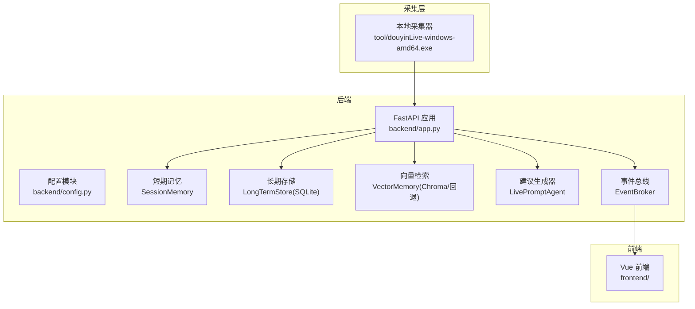
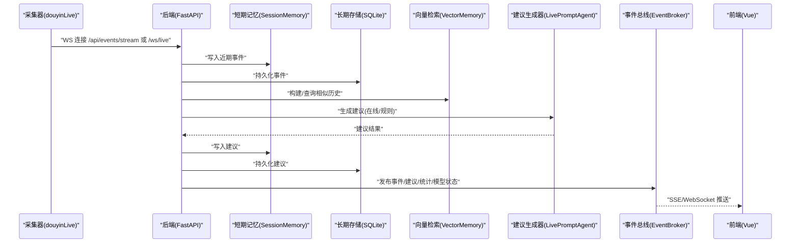
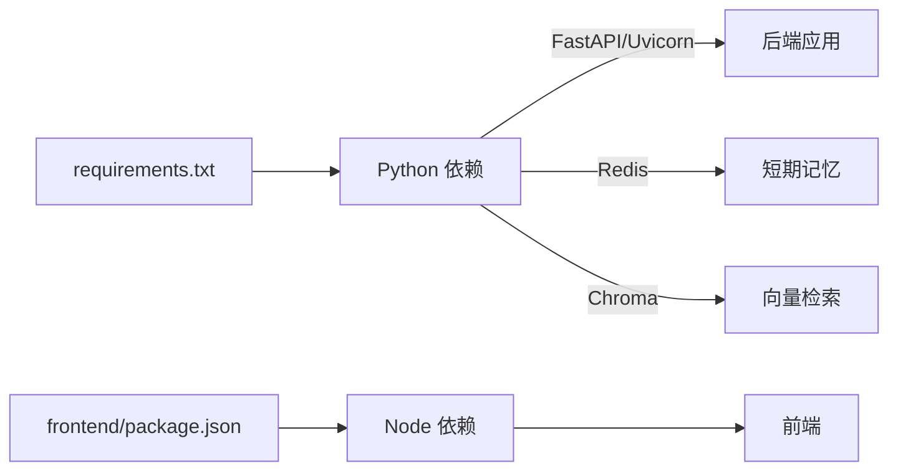

# 部署指南

<cite>
**本文引用的文件**
- [README.md](file://README.md)
- [USAGE.md](file://USAGE.md)
- [requirements.txt](file://requirements.txt)
- [backend/config.py](file://backend/config.py)
- [backend/app.py](file://backend/app.py)
- [backend/memory/vector_store.py](file://backend/memory/vector_store.py)
- [backend/memory/long_term.py](file://backend/memory/long_term.py)
- [frontend/package.json](file://frontend/package.json)
- [start_all.ps1](file://start_all.ps1)
- [start_all.bat](file://start_all.bat)
- [start_backend_qwen.ps1](file://start_backend_qwen.ps1)
- [start_frontend.ps1](file://start_frontend.ps1)
- [tool/config.yaml](file://tool/config.yaml)
- [data/DATABASE.md](file://data/DATABASE.md)
</cite>

## 目录
1. [简介](#简介)
2. [项目结构](#项目结构)
3. [核心组件](#核心组件)
4. [架构总览](#架构总览)
5. [详细组件分析](#详细组件分析)
6. [依赖分析](#依赖分析)
7. [性能考虑](#性能考虑)
8. [故障排查指南](#故障排查指南)
9. [结论](#结论)
10. [附录](#附录)

## 简介
本指南面向生产环境部署，帮助您从系统准备到服务上线，完成后端、前端、采集端与可选存储组件的完整部署与运维。文档覆盖开发与生产环境差异、环境变量配置、服务启动顺序、监控与日志、容器化与高可用方案，以及负载均衡与多实例部署要点。

## 项目结构
项目采用前后端分离与本地采集器协同的架构：
- 后端：FastAPI 应用，提供 REST、SSE、WebSocket 接口，负责事件处理、会话与长期存储、向量检索、建议生成与前端推送。
- 前端：Vue 3 + Vite 开发服务器，提供实时展示与交互。
- 采集端：独立的本地可执行文件，提供 WebSocket 消息源；后端内置采集器连接该源。
- 可选存储：Redis（短期记忆）、Chroma（向量检索）、SQLite（长期存储）。

图表来源
- [backend/app.py:1-220](file://backend/app.py#L1-L220)
- [backend/config.py:1-94](file://backend/config.py#L1-L94)
- [backend/memory/vector_store.py:1-108](file://backend/memory/vector_store.py#L1-L108)
- [backend/memory/long_term.py:1-750](file://backend/memory/long_term.py#L1-L750)

章节来源
- [README.md:21-34](file://README.md#L21-L34)
- [USAGE.md:7-14](file://USAGE.md#L7-L14)

## 核心组件
- 后端应用入口与生命周期管理：负责启动采集器、注册中间件、暴露健康检查与业务接口、管理 SSE/WebSocket 实时流。
- 配置模块：统一读取 .env 与环境变量，提供默认值，解析 LLM 服务地址与模型名，确保数据目录存在。
- 记忆与存储层：
  - SessionMemory：短期记忆，可选 Redis。
  - LongTermStore：SQLite 长期存储，维护事件、建议、观众画像、直播场次与备注等。
  - VectorMemory：Chroma 向量检索，不可用时回退为轻量文本相似度。
- 建议生成器：根据事件与上下文生成提词建议，支持在线模型与启发式规则双路径。
- 事件总线：将事件与建议广播至 SSE/WebSocket 客户端。

章节来源
- [backend/app.py:84-92](file://backend/app.py#L84-L92)
- [backend/config.py:39-94](file://backend/config.py#L39-L94)
- [backend/memory/vector_store.py:52-108](file://backend/memory/vector_store.py#L52-L108)
- [backend/memory/long_term.py:36-155](file://backend/memory/long_term.py#L36-L155)

## 架构总览
下图展示从采集端到前端的端到端数据流与组件交互。

图表来源
- [backend/app.py:61-78](file://backend/app.py#L61-L78)
- [backend/app.py:187-220](file://backend/app.py#L187-L220)
- [backend/memory/vector_store.py:64-83](file://backend/memory/vector_store.py#L64-L83)
- [backend/memory/long_term.py:420-454](file://backend/memory/long_term.py#L420-L454)

## 详细组件分析

### 后端应用与服务配置
- 生命周期与启动顺序：应用启动时先初始化短期/长期/向量存储与建议生成器，随后启动采集器；关闭时先结束活动会话再停止采集器。
- 接口与流：
  - 健康检查：返回服务状态、当前房间与活动会话。
  - 初始化快照：返回最近事件、建议、统计与模型状态。
  - 房间切换：关闭当前活动会话并切换采集房间。
  - SSE 与 WebSocket：实时推送事件、建议、统计与模型状态。
- CORS：允许任意来源，便于前端开发与跨域访问。

章节来源
- [backend/app.py:84-92](file://backend/app.py#L84-L92)
- [backend/app.py:104-107](file://backend/app.py#L104-L107)
- [backend/app.py:109-112](file://backend/app.py#L109-L112)
- [backend/app.py:115-126](file://backend/app.py#L115-L126)
- [backend/app.py:187-220](file://backend/app.py#L187-L220)

### 配置模块与环境变量
- 优先级：.env 文件优先于当前 Shell 环境变量。
- 关键配置项（节选）：
  - 直播与采集：房间号、采集开关、主机与端口、心跳与重连间隔。
  - 后端服务：监听地址与端口。
  - 模型相关：模式（启发式/Qwen/OpenAI 兼容）、API 密钥、基础地址、模型名、温度与超时。
  - 存储与记忆：Redis 地址、数据目录、数据库路径、向量目录、会话 TTL。
- 解析逻辑：根据模式自动解析默认 LLM 基础地址与模型名，若未显式配置则回退到默认值。

章节来源
- [backend/config.py:11-36](file://backend/config.py#L11-L36)
- [backend/config.py:43-61](file://backend/config.py#L43-L61)
- [backend/config.py:70-91](file://backend/config.py#L70-L91)
- [README.md:142-201](file://README.md#L142-L201)

### 记忆与存储层
- 向量检索：优先使用 Chroma；若不可用则回退为基于哈希的轻量相似度方案，保证检索能力可用。
- 长期存储：SQLite 表结构覆盖事件、建议、观众画像、礼物聚合、直播场次与备注；自动建索引并维护聚合数据。
- 短期记忆：可选 Redis；未配置时退化为进程内内存。

章节来源
- [backend/memory/vector_store.py:13-16](file://backend/memory/vector_store.py#L13-L16)
- [backend/memory/vector_store.py:52-108](file://backend/memory/vector_store.py#L52-L108)
- [backend/memory/long_term.py:50-155](file://backend/memory/long_term.py#L50-L155)
- [data/DATABASE.md:1-151](file://data/DATABASE.md#L1-L151)

### 建议生成器与事件处理
- 事件处理流程：写入短期/长期存储，构建向量索引，发布事件；根据最近事件生成建议，写入短期/长期存储并发布建议；更新统计与模型状态。
- 建议生成：优先调用在线模型，失败时回退到本地启发式规则。

章节来源
- [backend/app.py:61-78](file://backend/app.py#L61-L78)

### 前端与采集器
- 前端：基于 Vue 3 与 Vite，开发服务器默认监听 127.0.0.1:5173。
- 采集器：本地可执行文件，提供 WebSocket 消息源；可通过配置文件设置端口与 Cookie。

章节来源
- [frontend/package.json:1-23](file://frontend/package.json#L1-L23)
- [tool/config.yaml:1-16](file://tool/config.yaml#L1-L16)

## 依赖分析
- 后端依赖：FastAPI、Uvicorn、WebSocket 客户端、Redis、Chroma。
- 前端依赖：Vue 3、Pinia、TailwindCSS、Vite。
- 采集器：独立可执行文件，提供 WebSocket 服务。

图表来源
- [requirements.txt:1-6](file://requirements.txt#L1-L6)
- [frontend/package.json:11-22](file://frontend/package.json#L11-L22)

章节来源
- [requirements.txt:1-6](file://requirements.txt#L1-L6)
- [frontend/package.json:1-23](file://frontend/package.json#L1-L23)

## 性能考虑
- 向量检索降级：当 Chroma 不可用时，使用轻量哈希嵌入与文本相似度，避免完全中断检索能力。
- 短期记忆降级：未配置 Redis 时退化为进程内内存，减少外部依赖。
- 数据库索引：SQLite 表已建立常用索引，建议在高并发场景下评估分片与只读副本策略。
- SSE/WebSocket：事件总线采用队列分发，建议在生产中结合反向代理与连接池优化吞吐。

章节来源
- [backend/memory/vector_store.py:13-16](file://backend/memory/vector_store.py#L13-L16)
- [backend/memory/vector_store.py:85-108](file://backend/memory/vector_store.py#L85-L108)
- [backend/memory/long_term.py:183-195](file://backend/memory/long_term.py#L183-L195)

## 故障排查指南
- 页面打开但无建议：
  - 检查采集器是否启动、房间号是否正确、直播间是否开播、后端是否已重启。
- 顶部显示回退：
  - 检查 API 密钥、网络可达性、超时与限流。
- 顶部显示启发式：
  - 检查配置模式是否为启发式或 .env 未正确加载。
- 前端无法访问：
  - 检查前端脚本是否正常启动、端口是否被占用。
- 后端启动但无数据写入：
  - 检查采集器 WS 地址、后端日志连接情况与房间是否有消息。

章节来源
- [USAGE.md:198-240](file://USAGE.md#L198-L240)

## 结论
本指南提供了从开发到生产的部署路径与运维要点。建议在生产中启用健康检查、日志与监控，合理选择存储组件并进行容量规划，同时结合反向代理与容器编排实现高可用与弹性扩展。

## 附录

### 开发环境与生产环境差异
- 开发环境：
  - 后端使用 Uvicorn 本地开发服务器，自动重载。
  - 前端使用 Vite 开发服务器，热更新。
  - 采集器独立运行，后端内置采集器连接本地 WS。
- 生产环境：
  - 后端使用生产 WSGI 服务器（如 uvicorn/worker 模式），绑定内网 IP 与安全端口。
  - 前端构建产物由反向代理提供静态资源。
  - 采集器与后端在同一网络内通信，必要时通过内网域名或服务发现。
  - 存储组件（Redis、Chroma、SQLite）按需部署与备份。

章节来源
- [README.md:101-114](file://README.md#L101-L114)
- [USAGE.md:89-114](file://USAGE.md#L89-L114)

### 环境变量配置清单
- 直播与采集
  - ROOM_ID：房间标识
  - COLLECTOR_ENABLED：是否启用内置采集器
  - COLLECTOR_HOST/PORT：采集器主机与端口
  - COLLECTOR_PING_INTERVAL_SECONDS/RECONNECT_DELAY_SECONDS：心跳与重连间隔
- 后端服务
  - APP_HOST/APP_PORT：监听地址与端口
- 模型相关
  - LLM_MODE：启发式/heuristic、Qwen、OpenAI 兼容
  - LLM_API_KEY/DASHSCOPE_API_KEY：API 密钥（后者在前者为空时回退）
  - LLM_BASE_URL/LLM_MODEL/LLM_TEMPERATURE/LLM_TIMEOUT_SECONDS：模型服务地址、模型名、温度与超时
- 存储与记忆
  - REDIS_URL：Redis 连接串（留空则短期记忆退化）
  - DATA_DIR/DATABASE_PATH/CHROMA_DIR：数据目录、SQLite 路径、向量目录
  - SESSION_TTL_SECONDS：会话过期时间

章节来源
- [backend/config.py:43-61](file://backend/config.py#L43-L61)
- [README.md:146-201](file://README.md#L146-L201)

### 服务启动顺序与依赖关系
- 采集器 → 后端 → 前端
- 后端内部依赖：短期记忆（可选 Redis）→ 长期存储（SQLite）→ 向量检索（可选 Chroma）→ 建议生成器 → 事件总线 → 前端

章节来源
- [backend/app.py:25-29](file://backend/app.py#L25-L29)
- [backend/app.py:84-92](file://backend/app.py#L84-L92)
- [USAGE.md:116-114](file://USAGE.md#L116-L114)

### 监控与日志
- 健康检查：/health 返回服务状态与当前房间。
- 日志：后端默认 INFO 级别日志格式；建议在生产中接入结构化日志与集中化收集。
- 建议：结合反向代理日志、应用日志与数据库慢查询日志，建立告警与审计。

章节来源
- [backend/app.py:104-107](file://backend/app.py#L104-L107)
- [backend/app.py:23](file://backend/app.py#L23)

### 容器化部署方案
- Docker
  - 后端镜像：基于 Python 基础镜像，安装 requirements.txt，暴露 APP_PORT，ENTRYPOINT 启动 uvicorn。
  - 前端镜像：基于 Node 基础镜像，安装依赖并构建，使用 Nginx 提供静态资源。
  - 采集器：打包为独立镜像或直接在宿主机运行。
  - 存储：Redis、Chroma 与 SQLite 数据卷挂载。
- Kubernetes
  - Deployment：后端与前端各一个 Deployment，Service 暴露端口。
  - ConfigMap：存放 .env 或环境变量。
  - Secret：存放 API 密钥与敏感配置。
  - PVC：挂载 SQLite 与向量目录。
  - Ingress：暴露对外域名与 TLS。
- 云平台
  - 使用托管容器服务（如云原生应用托管），配合对象存储与托管数据库服务，简化运维。

[本节为通用实践建议，不直接对应具体源文件]

### 负载均衡与高可用
- 多实例部署：后端多副本，前端静态资源由 CDN/NAS 分发。
- 数据同步：短期记忆使用 Redis 集群；长期存储使用共享卷或主从数据库。
- 故障转移：反向代理健康检查失败自动摘除；采集器与后端通过服务发现与 DNS 解析实现自动切换。

[本节为通用实践建议，不直接对应具体源文件]