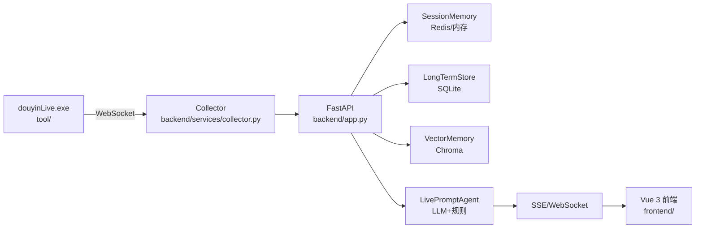
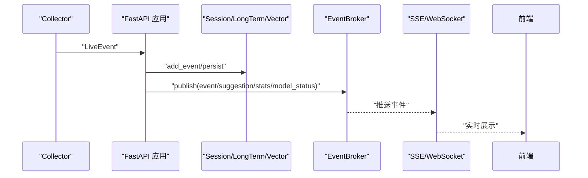
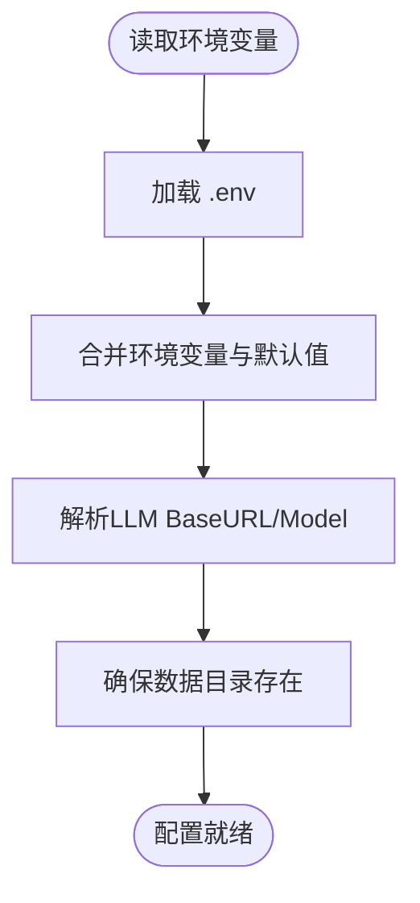
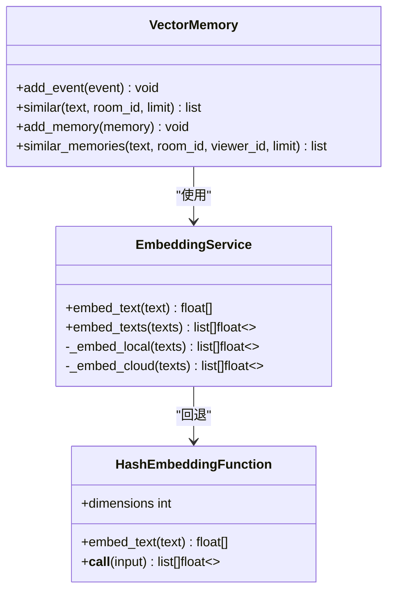
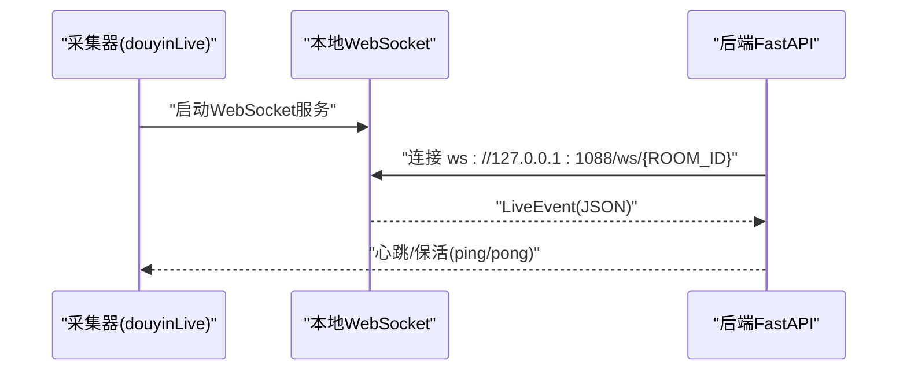
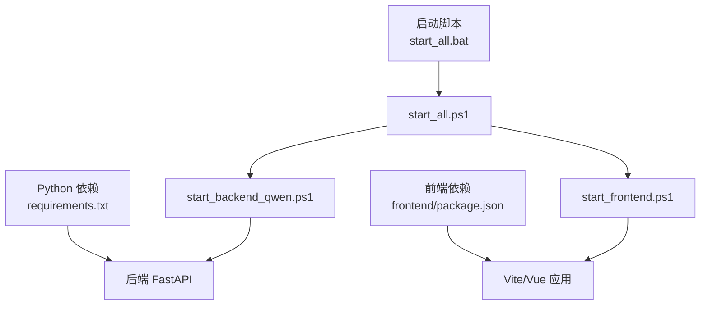

# 部署指南

<cite>
**本文引用的文件**   
- [README.md](file://README.md)
- [USAGE.md](file://USAGE.md)
- [requirements.txt](file://requirements.txt)
- [backend/app.py](file://backend/app.py)
- [backend/config.py](file://backend/config.py)
- [backend/memory/embedding_service.py](file://backend/memory/embedding_service.py)
- [backend/memory/vector_store.py](file://backend/memory/vector_store.py)
- [frontend/package.json](file://frontend/package.json)
- [start_all.bat](file://start_all.bat)
- [start_all.ps1](file://start_all.ps1)
- [start_backend_qwen.ps1](file://start_backend_qwen.ps1)
- [start_frontend.ps1](file://start_frontend.ps1)
- [tool/README.md](file://tool/README.md)
- [tool/config.yaml](file://tool/config.yaml)
- [data/DATABASE.md](file://data/DATABASE.md)
- [tests/test_agent.py](file://tests/test_agent.py)
- [tests/test_embedding_service.py](file://tests/test_embedding_service.py)
</cite>

## 目录
1. [简介](#简介)
2. [项目结构](#项目结构)
3. [核心组件](#核心组件)
4. [架构总览](#架构总览)
5. [详细组件分析](#详细组件分析)
6. [依赖关系分析](#依赖关系分析)
7. [性能考量](#性能考量)
8. [故障排除指南](#故障排除指南)
9. [结论](#结论)
10. [附录](#附录)

## 简介
本指南面向DouYin_llm项目的开发与生产部署，覆盖环境准备、依赖安装、配置与启动脚本使用、Docker容器化可能性与注意事项、服务器配置与安全、性能优化、监控与日志、故障排除、跨平台部署要点，以及高可用与灾难恢复的实现思路。项目由采集端（Windows可执行文件）、FastAPI后端与Vue 3前端构成，支持本地采集、事件归一化、记忆抽取、LLM/规则双通道提词生成与SSE/WebSocket实时推送。

## 项目结构
项目采用前后端分离与采集端独立的三层架构：
- 采集端：tool/douyinLive-windows-amd64.exe（Windows），通过WebSocket将抖音直播事件转发至本地端口
- 后端：FastAPI应用，提供REST/SSE/WebSocket接口，负责事件处理、会话与长期记忆、向量检索、LLM提词
- 前端：Vue 3 + Vite，通过Pinia Store与组件展示状态、事件流与观众工单
- 数据：SQLite（事件/建议/观众画像/笔记/会话）与可选Chroma向量库

```mermaid
graph TB
subgraph "采集端"
DL["douyinLive.exe<br/>tool/"]
end
subgraph "后端"
APP["FastAPI 应用<br/>backend/app.py"]
CFG["配置模块<br/>backend/config.py"]
MEM["记忆与向量<br/>backend/memory/*"]
AG["提词代理<br/>backend/services/agent.py"]
end
subgraph "前端"
FE["Vue 3 应用<br/>frontend/"]
end
DL --> APP
APP --> MEM
APP --> AG
APP <- --> FE
```

图表来源
- [backend/app.py:108-127](file://backend/app.py#L108-L127)
- [backend/config.py:40-113](file://backend/config.py#L40-L113)
- [tool/README.md:78-115](file://tool/README.md#L78-L115)

章节来源
- [README.md:32-44](file://README.md#L32-L44)
- [backend/app.py:108-127](file://backend/app.py#L108-L127)
- [backend/config.py:40-113](file://backend/config.py#L40-L113)
- [tool/README.md:78-115](file://tool/README.md#L78-L115)

## 核心组件
- 采集器（DouyinCollector）：对接本地WebSocket，标准化为LiveEvent并投递到事件循环
- 事件处理管线：SessionMemory（会话缓存）、LongTermStore（SQLite）、VectorMemory（Chroma/回退）
- 提词代理（LivePromptAgent）：优先OpenAI兼容LLM，失败回退启发式规则
- 前端仪表板：StatusStrip、Teleprompter、EventFeed、ViewerWorkbench、LlmSettingsPanel
- 配置系统：.env优先于代码默认值，支持LLM、嵌入、Redis、Chroma、会话等参数

章节来源
- [backend/app.py:73-102](file://backend/app.py#L73-L102)
- [backend/config.py:40-113](file://backend/config.py#L40-L113)
- [README.md:95-165](file://README.md#L95-L165)

## 架构总览


图表来源
- [README.md:7-17](file://README.md#L7-L17)
- [backend/app.py:105-106](file://backend/app.py#L105-L106)

章节来源
- [README.md:7-17](file://README.md#L7-L17)
- [backend/app.py:105-106](file://backend/app.py#L105-L106)

## 详细组件分析

### 后端应用与生命周期
- 应用入口与中间件：CORSMiddleware允许跨域；lifespan在启动时启动Collector，在关闭时清理会话
- 接口清单：健康检查、引导数据、房间切换、事件注入、观众画像/笔记、LLM设置、SSE与WebSocket
- 事件处理：写入会话/长期记忆/向量，发布事件/建议/统计/模型状态，触发前端实时更新



图表来源
- [backend/app.py:73-102](file://backend/app.py#L73-L102)
- [backend/app.py:252-285](file://backend/app.py#L252-L285)

章节来源
- [backend/app.py:108-127](file://backend/app.py#L108-L127)
- [backend/app.py:129-136](file://backend/app.py#L129-L136)
- [backend/app.py:138-156](file://backend/app.py#L138-L156)
- [backend/app.py:158-167](file://backend/app.py#L158-L167)
- [backend/app.py:169-176](file://backend/app.py#L169-L176)
- [backend/app.py:178-194](file://backend/app.py#L178-L194)
- [backend/app.py:196-222](file://backend/app.py#L196-L222)
- [backend/app.py:224-235](file://backend/app.py#L224-L235)
- [backend/app.py:237-250](file://backend/app.py#L237-L250)
- [backend/app.py:252-285](file://backend/app.py#L252-L285)

### 配置系统与环境变量
- 配置优先级：.env > 当前shell > 代码默认值
- 关键变量：房间ID、采集器开关与地址、后端监听地址、Redis、LLM模式与鉴权、嵌入模式与模型、数据目录与路径、会话TTL、语义召回阈值与数量
- 解析逻辑：根据LLM_MODE推导默认BaseURL与模型名；生成嵌入签名；确保数据目录存在



图表来源
- [backend/config.py:12-37](file://backend/config.py#L12-L37)
- [backend/config.py:40-113](file://backend/config.py#L40-L113)

章节来源
- [backend/config.py:12-37](file://backend/config.py#L12-L37)
- [backend/config.py:40-113](file://backend/config.py#L40-L113)
- [README.md:95-142](file://README.md#L95-L142)

### 嵌入服务与向量存储
- 嵌入服务：支持cloud与local两种模式，失败自动回退到哈希嵌入函数
- 向量存储：优先Chroma持久客户端，否则使用内存回退索引；提供事件与观众记忆的相似检索与排序



图表来源
- [backend/memory/embedding_service.py:18-102](file://backend/memory/embedding_service.py#L18-L102)
- [backend/memory/vector_store.py:34-57](file://backend/memory/vector_store.py#L34-L57)
- [backend/memory/vector_store.py:59-317](file://backend/memory/vector_store.py#L59-L317)

章节来源
- [backend/memory/embedding_service.py:18-102](file://backend/memory/embedding_service.py#L18-L102)
- [backend/memory/vector_store.py:59-317](file://backend/memory/vector_store.py#L59-L317)

### 采集器（douyinLive）与容器化
- 采集器为独立可执行文件，支持Docker运行，对外WebSocket地址为ws://127.0.0.1:1088/ws/{ROOM_ID}
- 支持挂载配置文件、后台运行与自动重启策略
- 采集端当前仅提供Windows二进制，Linux/macOS需从上游仓库获取



图表来源
- [tool/README.md:78-115](file://tool/README.md#L78-L115)
- [tool/README.md:127-160](file://tool/README.md#L127-L160)

章节来源
- [tool/README.md:78-115](file://tool/README.md#L78-L115)
- [tool/README.md:127-160](file://tool/README.md#L127-L160)

## 依赖关系分析
- Python依赖：FastAPI、Uvicorn、websocket-client、Redis、Chroma
- 前端依赖：Vue 3、Pinia、Vite、TailwindCSS
- 启动脚本：PowerShell脚本与批处理，分别启动后端与前端



图表来源
- [requirements.txt:1-6](file://requirements.txt#L1-L6)
- [frontend/package.json:11-22](file://frontend/package.json#L11-L22)
- [start_all.bat:1-9](file://start_all.bat#L1-L9)
- [start_all.ps1:1-18](file://start_all.ps1#L1-L18)
- [start_backend_qwen.ps1:1-13](file://start_backend_qwen.ps1#L1-L13)
- [start_frontend.ps1:1-22](file://start_frontend.ps1#L1-L22)

章节来源
- [requirements.txt:1-6](file://requirements.txt#L1-L6)
- [frontend/package.json:11-22](file://frontend/package.json#L11-L22)
- [start_all.bat:1-9](file://start_all.bat#L1-L9)
- [start_all.ps1:1-18](file://start_all.ps1#L1-L18)
- [start_backend_qwen.ps1:1-13](file://start_backend_qwen.ps1#L1-L13)
- [start_frontend.ps1:1-22](file://start_frontend.ps1#L1-L22)

## 性能考量
- 会话与长期记忆：合理设置SESSION_TTL_SECONDS，避免内存膨胀；SQLite写入批量化与索引优化
- 向量检索：调整SEMANTIC_*系列参数（最小分数、查询上限、最终K），平衡召回质量与延迟
- LLM调用：控制LLM_TIMEOUT_SECONDS与MAX_TOKENS，结合启发式规则降低时延与成本
- 嵌入模式：Cloud模式依赖网络与API限流；Local模式需GPU/CPU资源；失败自动回退Hash嵌入
- 前端渲染：组件按需更新，避免不必要的重渲染；WebSocket/SSE订阅范围限定

章节来源
- [backend/config.py:64-76](file://backend/config.py#L64-L76)
- [backend/config.py:70-76](file://backend/config.py#L70-L76)
- [backend/memory/embedding_service.py:33-48](file://backend/memory/embedding_service.py#L33-L48)
- [backend/memory/vector_store.py:86-108](file://backend/memory/vector_store.py#L86-L108)
- [backend/memory/vector_store.py:172-231](file://backend/memory/vector_store.py#L172-L231)
- [backend/memory/vector_store.py:257-317](file://backend/memory/vector_store.py#L257-L317)

## 故障排除指南
- 页面空白或无建议
  - 检查采集器是否启动、ROOM_ID是否正确、直播间是否开播、后端是否重启
- 顶部显示fallback
  - 检查LLM_API_KEY、网络访问、超时与限流
- 顶部显示heuristic
  - 检查LLM_MODE是否被设置为heuristic或.env未正确加载
- 前端无法访问
  - 检查start_frontend.ps1是否成功、5173端口占用
- 后端启动但无数据写入
  - 确认采集器已运行、后端日志中已连接到ws://127.0.0.1:1088/ws/{room_id}

章节来源
- [USAGE.md:198-240](file://USAGE.md#L198-L240)

## 结论
DouYin_llm提供了从采集到实时提词的完整链路。开发环境可通过脚本一键启动，生产环境建议结合容器化与反向代理、安全加固与可观测性建设。当前版本未内置鉴权与多租户，需在前置网关或反向代理层进行安全控制。向量检索与LLM调用是性能瓶颈的关键点，应结合业务场景调优参数与回退策略。

## 附录

### 开发环境部署步骤
- 准备配置：复制.env.example为.env，至少填写ROOM_ID、LLM_MODE、LLM_API_KEY/兼容BaseURL与模型名
- 安装Python依赖：pip install -r requirements.txt
- 安装前端依赖：cd frontend && npm install
- 启动采集器：tool/douyinLive-windows-amd64.exe（Windows）
- 启动后端：python -m uvicorn backend.app:app --host 127.0.0.1 --port 8010 --reload
- 启动前端：cd frontend && npm run dev -- --host 127.0.0.1 --strictPort --port 5173
- 使用封装脚本：start_all.ps1一键启动后端与前端

章节来源
- [USAGE.md:24-88](file://USAGE.md#L24-L88)
- [README.md:54-94](file://README.md#L54-L94)
- [start_all.ps1:1-18](file://start_all.ps1#L1-L18)
- [start_backend_qwen.ps1:1-13](file://start_backend_qwen.ps1#L1-L13)
- [start_frontend.ps1:1-22](file://start_frontend.ps1#L1-L22)

### 生产环境部署策略
- 反向代理与域名：使用Nginx/Traefik暴露后端与前端，开启HTTPS与压缩
- 安全加固：在反向代理层启用认证/鉴权、速率限制、WAF；后端开放内网访问
- 容器化：后端与前端分别打包为容器，采集器当前仅Windows二进制；可考虑将采集器容器化或通过外部服务接入
- 存储与备份：SQLite与Chroma目录持久化；定期备份live_prompter.db与Chroma目录
- 日志与监控：统一收集后端与前端日志，结合SSE/WebSocket事件流建立指标与告警

章节来源
- [README.md:205-213](file://README.md#L205-L213)
- [data/DATABASE.md:1-151](file://data/DATABASE.md#L1-L151)

### Docker容器化部署可能性与注意事项
- 采集器：支持Docker运行，对外WebSocket地址为ws://127.0.0.1:1088/ws/{ROOM_ID}；可挂载配置文件、后台运行与自动重启
- 后端：可打包为容器，暴露8010端口；建议挂载数据目录（SQLite/Chroma）
- 前端：可打包为静态站点，通过反向代理提供
- 注意事项：采集器当前无Linux/macOS容器镜像；容器网络需确保后端可访问采集器WebSocket；采集器Cookie与登录态需通过配置文件挂载

章节来源
- [tool/README.md:78-115](file://tool/README.md#L78-L115)
- [tool/README.md:127-160](file://tool/README.md#L127-L160)

### 服务器配置与网络安全
- 端口规划：采集器WebSocket 1088；后端HTTP 8010；前端开发5173（生产建议反代）
- 网络访问：后端仅对内网开放，通过反向代理对外提供；采集器仅本地访问
- 认证与鉴权：在反向代理层启用Basic Auth或OIDC；后端接口当前未鉴权
- 防火墙与WAF：限制入站流量，开启DDoS防护与速率限制

章节来源
- [tool/README.md:127-160](file://tool/README.md#L127-L160)
- [README.md:209](file://README.md#L209)

### 性能优化建议
- 事件与建议写入：批量写入SQLite，合理设置事务边界
- 向量检索：预估查询负载，调整相似度阈值与召回数量；必要时启用Chroma远程实例
- LLM调用：设置合理超时与最大token；对礼物等低价值事件直接走规则
- 嵌入：Cloud模式受限于API配额；Local模式需评估设备资源；失败自动回退Hash嵌入

章节来源
- [backend/config.py:64-76](file://backend/config.py#L64-L76)
- [backend/memory/embedding_service.py:33-48](file://backend/memory/embedding_service.py#L33-L48)
- [tests/test_agent.py:91-115](file://tests/test_agent.py#L91-L115)

### 监控设置与日志管理
- 后端日志：INFO级别格式化输出，建议接入集中式日志系统
- 前端日志：Vite开发模式日志；生产构建后通过反代与浏览器控制台观察
- 指标与告警：建议集成Prometheus/Grafana或APM，监控SSE/WebSocket连接数、事件吞吐、LLM延迟与错误率

章节来源
- [backend/app.py:24-25](file://backend/app.py#L24-L25)

### 不同操作系统与硬件平台的部署注意事项
- Windows：采集器原生支持；后端与前端均支持；建议使用PowerShell脚本启动
- Linux/macOS：采集器需从上游仓库获取对应平台版本；后端与前端可直接运行；容器化部署更易
- 硬件资源：LLM推理与向量检索对CPU/GPU有要求；Local嵌入模型需充足内存；Chroma建议SSD存储

章节来源
- [README.md:207](file://README.md#L207)
- [backend/memory/embedding_service.py:50-73](file://backend/memory/embedding_service.py#L50-L73)

### 负载均衡、高可用与灾难恢复
- 负载均衡：前端静态资源可由CDN分发；后端通过反向代理实现多实例负载
- 高可用：后端多实例无共享状态（除Redis/Chroma外）；采集器可多实例接入不同房间
- 灾难恢复：定期备份live_prompter.db与Chroma目录；采集器配置文件挂载持久化；容器编排使用健康检查与自动重启

章节来源
- [data/DATABASE.md:1-151](file://data/DATABASE.md#L1-L151)
- [tool/README.md:106-115](file://tool/README.md#L106-L115)

### 数据与日志
- 数据文件：data/live_prompter.db（事件/建议/观众画像/笔记/会话）
- 向量索引：data/chroma/（可清空重建，配合rebuild_embeddings.py）
- 日志目录：logs/（调试输出）

章节来源
- [README.md:193-198](file://README.md#L193-L198)
- [data/DATABASE.md:1-151](file://data/DATABASE.md#L1-L151)