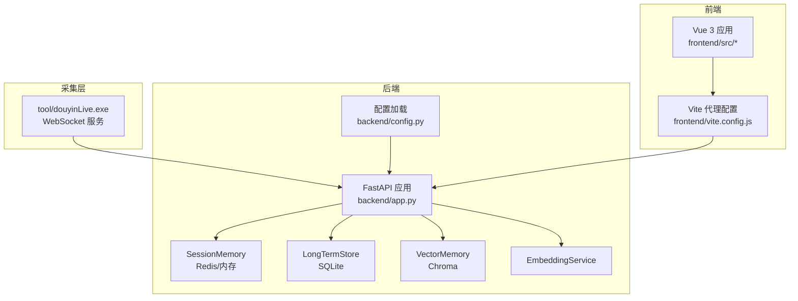
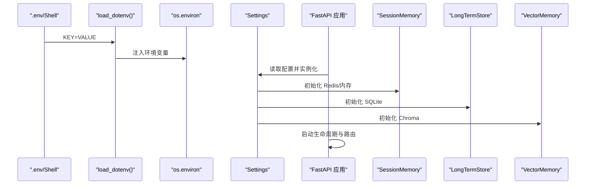
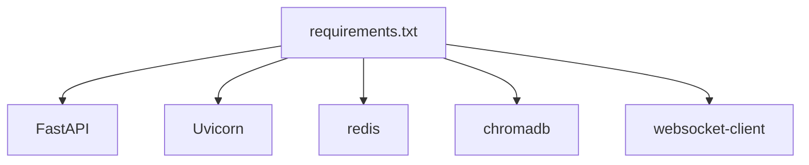

# 配置管理

<cite>
**本文引用的文件**   
- [backend/config.py](file://backend/config.py)
- [backend/app.py](file://backend/app.py)
- [backend/memory/session_memory.py](file://backend/memory/session_memory.py)
- [backend/memory/long_term.py](file://backend/memory/long_term.py)
- [backend/memory/vector_store.py](file://backend/memory/vector_store.py)
- [backend/memory/embedding_service.py](file://backend/memory/embedding_service.py)
- [frontend/src/i18n.js](file://frontend/src/i18n.js)
- [frontend/vite.config.js](file://frontend/vite.config.js)
- [tool/config.yaml](file://tool/config.yaml)
- [requirements.txt](file://requirements.txt)
- [README.md](file://README.md)
- [USAGE.md](file://USAGE.md)
- [start_all.ps1](file://start_all.ps1)
- [start_backend_qwen.ps1](file://start_backend_qwen.ps1)
- [start_frontend.ps1](file://start_frontend.ps1)
</cite>

## 目录
1. [简介](#简介)
2. [项目结构](#项目结构)
3. [核心组件](#核心组件)
4. [架构总览](#架构总览)
5. [详细组件分析](#详细组件分析)
6. [依赖分析](#依赖分析)
7. [性能考量](#性能考量)
8. [故障排查指南](#故障排查指南)
9. [结论](#结论)
10. [附录](#附录)

## 简介
本指南聚焦于 DouYin_llm 项目的配置管理，覆盖后端 FastAPI、采集器、模型与向量嵌入、数据库与缓存、前端国际化与本地化、以及部署与运维层面的配置策略。文档明确配置优先级（.env 文件 > 环境变量 > 代码默认值），提供不同部署场景的配置模板与最佳实践，说明配置验证与测试方法、热更新与重启策略，以及配置变更的回滚与备份建议。

## 项目结构
项目采用前后端分离与模块化设计：
- 后端（FastAPI）：负责事件采集、持久化、语义记忆、LLM 提词与实时推送
- 采集器（tool/）：Windows 可执行文件，负责从抖音直播 WebSocket 抓取并转发事件
- 前端（frontend/）：Vue 3 应用，通过代理访问后端 REST/WebSocket 接口
- 配置来源：.env 文件、环境变量、代码默认值

图表来源
- [backend/app.py:1-285](file://backend/app.py#L1-L285)
- [backend/config.py:1-113](file://backend/config.py#L1-L113)
- [frontend/vite.config.js:1-22](file://frontend/vite.config.js#L1-L22)

章节来源
- [README.md:1-223](file://README.md#L1-L223)
- [backend/app.py:1-285](file://backend/app.py#L1-L285)
- [backend/config.py:1-113](file://backend/config.py#L1-L113)
- [frontend/vite.config.js:1-22](file://frontend/vite.config.js#L1-L22)

## 核心组件
- 配置加载与解析：.env 文件读取与环境变量覆盖，统一在 Settings 数据类中定义
- 采集与事件处理：内置 Collector 连接本地 WebSocket，标准化事件并写入内存/数据库/向量库
- 记忆与检索：SessionMemory（Redis/内存）、LongTermStore（SQLite）、VectorMemory（Chroma）
- 模型与提示词：LivePromptAgent 依据 LLM_MODE 与 API Key 决定在线模型或启发式规则
- 嵌入与向量：EmbeddingService 支持云端与本地模型，向量索引由 Chroma 管理
- 前端国际化：i18n.js 提供中英双语翻译与占位符替换

章节来源
- [backend/config.py:40-113](file://backend/config.py#L40-L113)
- [backend/app.py:24-36](file://backend/app.py#L24-L36)
- [backend/memory/session_memory.py:1-43](file://backend/memory/session_memory.py#L1-L43)
- [backend/memory/long_term.py:44-58](file://backend/memory/long_term.py#L44-L58)
- [backend/memory/vector_store.py](file://backend/memory/vector_store.py)
- [backend/memory/embedding_service.py](file://backend/memory/embedding_service.py)
- [frontend/src/i18n.js:1-316](file://frontend/src/i18n.js#L1-L316)

## 架构总览
配置在应用启动阶段集中加载，Settings 作为唯一权威来源，贯穿后端各子系统初始化与运行时决策。

图表来源
- [backend/config.py:12-37](file://backend/config.py#L12-L37)
- [backend/config.py:40-113](file://backend/config.py#L40-L113)
- [backend/app.py:24-36](file://backend/app.py#L24-L36)

## 详细组件分析

### 配置优先级与加载机制
- 优先级：.env 文件 > 当前 Shell 环境变量 > 代码默认值
- .env 加载：自定义最小实现，逐行解析 KEY=VALUE，忽略注释与空行，注入 os.environ
- Settings：集中定义所有运行时配置项，提供 ensure_dirs() 创建数据目录，解析 LLM 基础地址与模型名，生成嵌入签名

章节来源
- [backend/config.py:12-37](file://backend/config.py#L12-L37)
- [backend/config.py:40-113](file://backend/config.py#L40-L113)
- [README.md:95-97](file://README.md#L95-L97)

### 直播采集配置（.env 与采集器）
- ROOM_ID：当前监听的抖音直播间 ID，需与采集器配置一致
- COLLECTOR_ENABLED：是否启用内置 Collector
- COLLECTOR_HOST/PORT：采集器 WebSocket 地址
- COLLECTOR_PING_INTERVAL_SECONDS：心跳间隔
- COLLECTOR_RECONNECT_DELAY_SECONDS：断线重连等待
- 采集器配置文件：tool/config.yaml，包含端口、Cookie 等（采集器独立于后端）

章节来源
- [backend/config.py:44-51](file://backend/config.py#L44-L51)
- [README.md:99-108](file://README.md#L99-L108)
- [tool/config.yaml:1-16](file://tool/config.yaml#L1-L16)

### 后端进程配置（.env）
- APP_HOST/APP_PORT：FastAPI 监听地址与端口
- SESSION_TTL_SECONDS：SessionMemory 过期时间（秒）
- REDIS_URL：为空使用进程内内存，设置后启用 Redis 共享短期会话

章节来源
- [backend/config.py:44-55](file://backend/config.py#L44-L55)
- [backend/memory/session_memory.py:17-31](file://backend/memory/session_memory.py#L17-L31)
- [README.md:109-116](file://README.md#L109-L116)

### 模型与提示词配置（.env）
- LLM_MODE：heuristic/qwen/openai
- LLM_BASE_URL：OpenAI/Qwen 兼容 API Endpoint
- LLM_MODEL：模型名称，可被前端覆盖
- LLM_API_KEY/DASHSCOPE_API_KEY：模型鉴权，若为空会尝试兼容 DashScope Key
- LLM_TIMEOUT_SECONDS/TEMPERATURE/MAX_TOKENS：推理超时、温度与最大输出 token
- LLM 设置持久化：后端通过 SQLite 表 app_settings 存储，前端 LlmSettingsPanel 可在线编辑

章节来源
- [backend/config.py:57-63](file://backend/config.py#L57-L63)
- [backend/app.py:224-235](file://backend/app.py#L224-L235)
- [docs/superpowers/specs/2026-04-13-llm-settings-design.md:8](file://docs/superpowers/specs/2026-04-13-llm-settings-design.md#L8)
- [docs/superpowers/specs/2026-04-13-llm-settings-design.md:11](file://docs/superpowers/specs/2026-04-13-llm-settings-design.md#L11)
- [docs/superpowers/specs/2026-04-13-llm-settings-design.md:45](file://docs/superpowers/specs/2026-04-13-llm-settings-design.md#L45)

### 向量与嵌入配置（.env）
- DATA_DIR/DATABASE_PATH/CHROMA_DIR：数据目录、SQLite 文件与 Chroma 存储目录
- EMBEDDING_MODE：cloud/local/hash fallback
- EMBEDDING_MODEL：云端/本地嵌入模型名
- EMBEDDING_BASE_URL/API_KEY：云端嵌入接口与密钥
- LOCAL_EMBEDDING_DEVICE/BATCH_SIZE：SentenceTransformer 运行设备与批大小
- 语义相似度阈值与召回参数：SEMANTIC_* 系列参数

章节来源
- [backend/config.py:52-75](file://backend/config.py#L52-L75)
- [README.md:129-142](file://README.md#L129-L142)

### 数据库与缓存配置
- SQLite：LongTermStore 使用 SQLite 持久化事件、建议、观众记忆、笔记与 LLM 设置
- Redis：SessionMemory 可选 Redis，提升跨进程共享短期会话能力
- Chroma：VectorMemory 使用磁盘目录存储向量索引，支持重建

章节来源
- [backend/memory/long_term.py:44-58](file://backend/memory/long_term.py#L44-L58)
- [backend/memory/session_memory.py:17-31](file://backend/memory/session_memory.py#L17-L31)
- [backend/memory/vector_store.py](file://backend/memory/vector_store.py)
- [backend/memory/rebuild_embeddings.py:1-51](file://backend/memory/rebuild_embeddings.py#L1-L51)

### 前端国际化与本地化
- 国际化资源：messages.zh/messages.en，包含通用、状态、主题、提词器、消息流、观众工坊、LLM 设置、错误提示等键值
- 翻译函数：translate(locale, key, params)，支持占位符替换与回退逻辑
- 错误消息翻译：translateError(locale, value)，对错误键进行映射
- 本地化开关：前端提供中英文切换按钮（UI 层），翻译逻辑在 i18n.js

章节来源
- [frontend/src/i18n.js:1-316](file://frontend/src/i18n.js#L1-L316)

### 前端代理与后端对接
- Vite 代理：将 /api 与 /ws 代理至后端 127.0.0.1:8010，便于本地开发与调试
- 前端访问：http://127.0.0.1:5173，后端健康检查：http://127.0.0.1:8010/health

章节来源
- [frontend/vite.config.js:1-22](file://frontend/vite.config.js#L1-L22)
- [README.md:93](file://README.md#L93)

### 配置验证与测试
- 后端健康检查：/health 返回房间号与活动会话状态
- 接口测试：/api/bootstrap、/api/room、/api/events、/api/events/stream、/ws/live
- Python 测试：unittest 覆盖 agent、LLM 设置、嵌入服务、向量存储、空房间引导、长期记忆、重建嵌入等
- 前端测试：status-strip、viewer-workbench、llm-settings、locale 等单元测试

章节来源
- [backend/app.py:129-136](file://backend/app.py#L129-L136)
- [backend/app.py:138-167](file://backend/app.py#L138-L167)
- [backend/app.py:252-285](file://backend/app.py#L252-L285)
- [README.md:151-166](file://README.md#L151-L166)
- [USAGE.md:180-191](file://USAGE.md#L180-L191)

### 配置热更新与重启策略
- 环境变量热更新：.env 文件修改后需重启后端进程以重新加载 os.environ
- 前端热更新：Vite 开发服务器支持热更新，无需重启后端
- LLM 设置热更新：后端将模型与系统提示词持久化至 SQLite，前端可在线编辑并立即生效
- 采集器：tool/douyinLive.exe 与后端 Collector 独立运行，采集器配置在 tool/config.yaml，需重启采集器以应用 Cookie 等变更

章节来源
- [backend/app.py:224-235](file://backend/app.py#L224-L235)
- [start_all.ps1:1-18](file://start_all.ps1#L1-L18)
- [start_backend_qwen.ps1:1-13](file://start_backend_qwen.ps1#L1-L13)
- [start_frontend.ps1:1-22](file://start_frontend.ps1#L1-L22)

### 配置回滚与备份建议
- .env 备份：每次变更前复制 .env 为 .env.<timestamp>，出现问题时回滚
- SQLite 备份：定期导出 data/live_prompter.db，或使用 SQLite 备份命令
- Chroma 备份：复制 data/chroma 目录，或使用向量库导出/导入工具
- Redis 备份：如启用 Redis，使用 RDB/AOF 持久化策略
- 采集器配置备份：tool/config.yaml 与抖音 Cookie 配置单独备份

章节来源
- [README.md:193-198](file://README.md#L193-L198)
- [backend/memory/rebuild_embeddings.py:1-51](file://backend/memory/rebuild_embeddings.py#L1-L51)

## 依赖分析
- 后端依赖：FastAPI、Uvicorn、Redis、Chroma、websocket-client
- 前端依赖：Vue 3、Vite、TailwindCSS（通过 vite.config.js 与 tailwind.config.js）

图表来源
- [requirements.txt:1-6](file://requirements.txt#L1-L6)

章节来源
- [requirements.txt:1-6](file://requirements.txt#L1-L6)

## 性能考量
- SessionMemory：Redis 模式下可提升跨进程共享与吞吐，内存模式适合单进程与轻量场景
- SQLite：默认 TRUNCATE 日志模式，减少写入冲突，适合本地开发与小规模生产
- Chroma：向量索引磁盘 IO 密集，建议使用 SSD 与合理批大小
- LLM 推理：合理设置超时与温度，避免阻塞事件循环
- 嵌入服务：本地模型需根据设备选择 CPU/GPU，批大小影响吞吐与显存

章节来源
- [backend/memory/session_memory.py:17-31](file://backend/memory/session_memory.py#L17-L31)
- [backend/memory/long_term.py:44-58](file://backend/memory/long_term.py#L44-L58)
- [backend/config.py:64-75](file://backend/config.py#L64-L75)

## 故障排查指南
- 页面无建议：检查采集器是否启动、.env ROOM_ID 是否正确、直播间是否开播、后端是否重启
- 显示 fallback：检查 DASHSCOPE_API_KEY、网络访问、超时或限流
- 显示 heuristic：检查 LLM_MODE 是否为 heuristic 或 .env 未正确加载
- 前端无法访问：检查 start_frontend.ps1、5173 端口占用
- 后端未写入数据：检查采集器是否运行、后端日志是否连接到 ws://127.0.0.1:1088/ws/{room_id}

章节来源
- [USAGE.md:198-240](file://USAGE.md#L198-L240)

## 结论
DouYin_llm 的配置体系以 .env 为核心，结合环境变量与代码默认值，形成清晰的优先级与可追溯性。通过 Settings 统一加载，后端各模块（采集、内存、数据库、向量、模型）得以按需启用与优化。建议在生产环境中启用 Redis 与 Chroma，并完善配置备份与回滚策略，同时利用前端代理与健康检查接口保障开发与运维效率。

## 附录

### 不同部署场景的配置模板与最佳实践
- 本地开发（单机）
  - .env：APP_HOST=127.0.0.1、APP_PORT=8010、REDIS_URL=（留空使用内存）
  - 启动：start_all.ps1 或分别启动后端与前端脚本
- 本地开发（Redis 共享）
  - .env：REDIS_URL=redis://localhost:6379/0
  - 启动：同上，后端自动启用 Redis SessionMemory
- 生产（云端/容器）
  - .env：APP_HOST=0.0.0.0、APP_PORT=8010、REDIS_URL=（外部 Redis）、CHROMA_DIR=/data/chroma、DATABASE_PATH=/data/live_prompter.db
  - 前端：通过反向代理暴露 /api 与 /ws 至 8010 端口
- 采集器独立部署
  - tool/config.yaml：配置端口与 Cookie，采集器独立运行，后端通过 Collector_HOST/PORT 连接

章节来源
- [README.md:95-97](file://README.md#L95-L97)
- [start_all.ps1:1-18](file://start_all.ps1#L1-L18)
- [start_backend_qwen.ps1:1-13](file://start_backend_qwen.ps1#L1-L13)
- [start_frontend.ps1:1-22](file://start_frontend.ps1#L1-L22)
- [tool/config.yaml:1-16](file://tool/config.yaml#L1-L16)