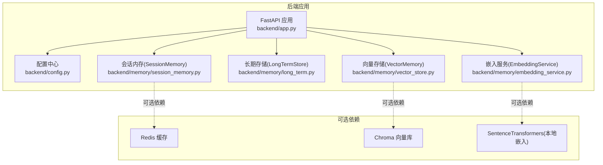
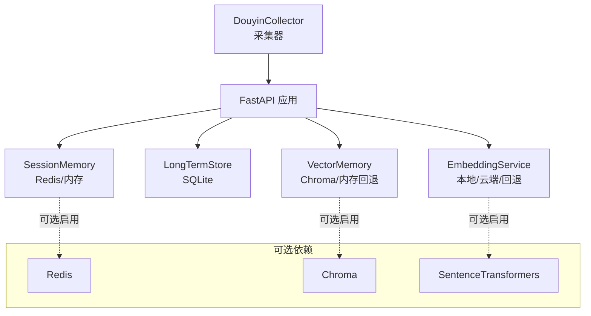
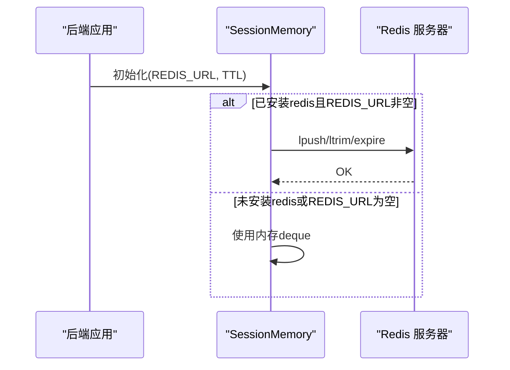
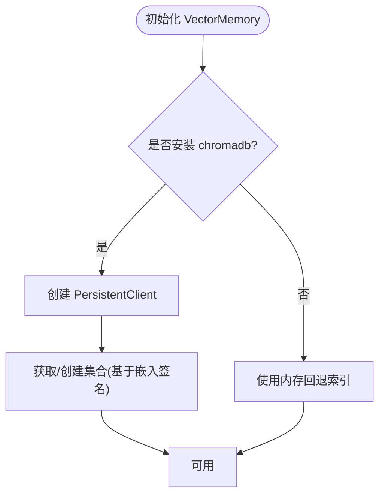
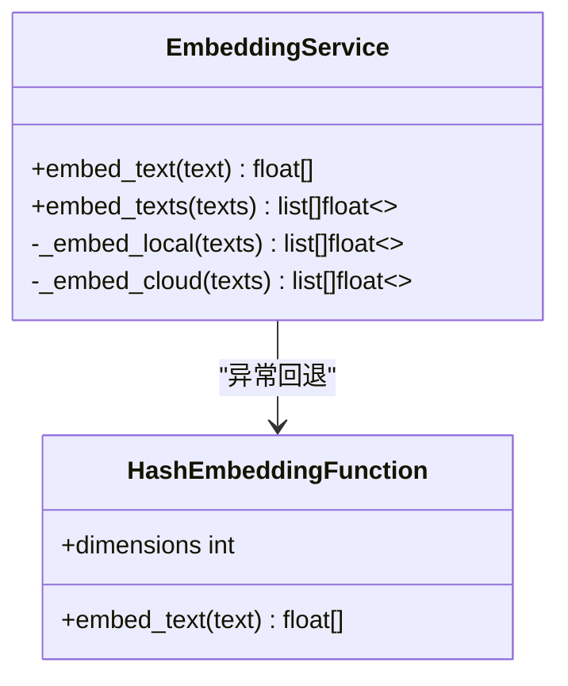
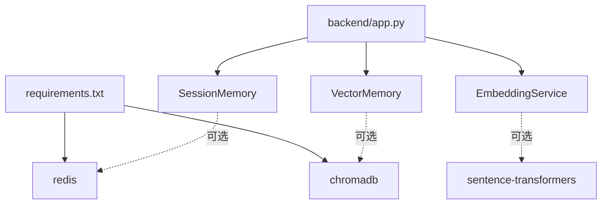

# 可选依赖配置

<cite>
**本文引用的文件**
- [backend/config.py](file://backend/config.py)
- [requirements.txt](file://requirements.txt)
- [backend/app.py](file://backend/app.py)
- [backend/memory/session_memory.py](file://backend/memory/session_memory.py)
- [backend/memory/vector_store.py](file://backend/memory/vector_store.py)
- [backend/memory/embedding_service.py](file://backend/memory/embedding_service.py)
- [backend/memory/long_term.py](file://backend/memory/long_term.py)
- [backend/memory/rebuild_embeddings.py](file://backend/memory/rebuild_embeddings.py)
- [README.md](file://README.md)
- [USAGE.md](file://USAGE.md)
- [start_backend_qwen.ps1](file://start_backend_qwen.ps1)
- [start_all.ps1](file://start_all.ps1)
</cite>

## 目录
1. [简介](#简介)
2. [项目结构](#项目结构)
3. [核心组件](#核心组件)
4. [架构总览](#架构总览)
5. [详细组件分析](#详细组件分析)
6. [依赖分析](#依赖分析)
7. [性能考量](#性能考量)
8. [故障排查指南](#故障排查指南)
9. [结论](#结论)
10. [附录](#附录)

## 简介
本文件聚焦于 DouYin_llm 项目的可选依赖配置，围绕以下三个方向展开：
- Redis 缓存系统：配置项（REDIS_URL、过期时间等）与启用条件、连接池与客户端行为、健康检查与故障转移策略
- Chroma 向量数据库：配置参数（CHROMA_DIR、集合命名、向量维度与距离度量）与性能调优
- 本地嵌入模型：LOCAL_EMBEDDING_DEVICE、BATCH_SIZE 等配置与硬件要求
同时给出不同部署场景（单机 vs 分布式）下的依赖配置策略、依赖服务的健康检查与故障转移机制、依赖配置对系统性能与资源消耗的影响，以及监控指标与日志配置建议。

## 项目结构
可选依赖主要涉及后端配置、会话内存（Redis/内存）、向量存储（Chroma/内存回退）、嵌入服务（本地/云端）与长期存储（SQLite）。整体结构如下：

图表来源
- [backend/app.py](file://backend/app.py)
- [backend/config.py](file://backend/config.py)
- [backend/memory/session_memory.py](file://backend/memory/session_memory.py)
- [backend/memory/vector_store.py](file://backend/memory/vector_store.py)
- [backend/memory/embedding_service.py](file://backend/memory/embedding_service.py)
- [backend/memory/long_term.py](file://backend/memory/long_term.py)

章节来源
- [backend/app.py](file://backend/app.py)
- [backend/config.py](file://backend/config.py)
- [README.md](file://README.md)

## 核心组件
- 配置中心 Settings：集中定义所有可选依赖相关的环境变量与默认值，包括 Redis、Chroma、嵌入模型等
- 会话内存 SessionMemory：优先使用 Redis 存储短期事件与建议；未安装 Redis 或未配置 REDIS_URL 时退化为进程内内存
- 向量存储 VectorMemory：优先使用 Chroma 持久化集合；未安装 chromadb 时退化为内存回退索引
- 嵌入服务 EmbeddingService：支持本地（SentenceTransformers）与云端（OpenAI 兼容）两种模式，异常时回退到哈希嵌入
- 长期存储 LongTermStore：基于 SQLite，提供事件、建议、观众记忆等持久化能力

章节来源
- [backend/config.py](file://backend/config.py)
- [backend/memory/session_memory.py](file://backend/memory/session_memory.py)
- [backend/memory/vector_store.py](file://backend/memory/vector_store.py)
- [backend/memory/embedding_service.py](file://backend/memory/embedding_service.py)
- [backend/memory/long_term.py](file://backend/memory/long_term.py)

## 架构总览
可选依赖在系统中的位置与启用条件如下：

图表来源
- [backend/app.py](file://backend/app.py)
- [backend/memory/session_memory.py](file://backend/memory/session_memory.py)
- [backend/memory/vector_store.py](file://backend/memory/vector_store.py)
- [backend/memory/embedding_service.py](file://backend/memory/embedding_service.py)

## 详细组件分析

### Redis 缓存系统配置
- 配置项
  - REDIS_URL：用于启用 Redis 会话内存；为空字符串时退化为进程内内存
  - SESSION_TTL_SECONDS：Redis 模式下短期事件与建议的过期时间（秒）
- 启用条件
  - 安装 redis 包且设置 REDIS_URL 时启用 Redis；否则使用内存队列
- 连接与客户端行为
  - 使用 redis.Redis.from_url 创建客户端，decode_responses=True
  - 使用列表类型存储事件与建议，上限分别为 120 与 40
  - 过期时间仅在 Redis 模式下生效
- 健康检查与故障转移
  - 未安装 redis 包或 REDIS_URL 为空时自动降级；异常时不影响核心流程
  - 建议通过外部探活脚本或容器健康检查探测 Redis 可达性
- 性能影响
  - Redis 模式下可跨进程共享短期数据，降低重复计算与内存占用
  - 网络延迟与序列化开销需纳入评估

图表来源
- [backend/memory/session_memory.py](file://backend/memory/session_memory.py)

章节来源
- [backend/memory/session_memory.py](file://backend/memory/session_memory.py)
- [backend/config.py](file://backend/config.py)
- [backend/app.py](file://backend/app.py)

### Chroma 向量数据库配置
- 配置项
  - CHROMA_DIR：Chroma 持久化目录路径
  - 集合命名：基于嵌入签名动态生成，避免不同模型/模式下的冲突
- 向量维度与距离度量
  - 向量维度由嵌入模型决定；查询结果通过距离计算相似度分数
  - 距离到分数的转换函数用于阈值筛选与排序
- 性能调优
  - 查询限制与最终返回条数受 SEMANTIC_* 系列参数控制
  - 通过重建索引脚本批量导入 SQLite 数据，提升召回质量
- 健康检查与故障转移
  - 未安装 chromadb 时自动退化为内存回退索引；不影响事件/记忆写入
  - 建议定期检查集合存在性与文档数量，必要时重建索引

图表来源
- [backend/memory/vector_store.py](file://backend/memory/vector_store.py)
- [backend/memory/rebuild_embeddings.py](file://backend/memory/rebuild_embeddings.py)

章节来源
- [backend/memory/vector_store.py](file://backend/memory/vector_store.py)
- [backend/memory/rebuild_embeddings.py](file://backend/memory/rebuild_embeddings.py)
- [backend/config.py](file://backend/config.py)

### 本地嵌入模型配置
- 配置项
  - LOCAL_EMBEDDING_DEVICE：运行设备（如 cpu/cuda）
  - LOCAL_EMBEDDING_BATCH_SIZE：本地嵌入批处理大小
- 启用条件
  - 安装 sentence-transformers 包且选择 embedding_mode=local
- 硬件要求
  - GPU 设备可显著提升吞吐；CPU 上较小的批大小可避免 OOM
- 异常与回退
  - 云端调用失败或网络异常时自动回退到哈希嵌入

图表来源
- [backend/memory/embedding_service.py](file://backend/memory/embedding_service.py)
- [backend/memory/vector_store.py](file://backend/memory/vector_store.py)

章节来源
- [backend/memory/embedding_service.py](file://backend/memory/embedding_service.py)
- [backend/memory/vector_store.py](file://backend/memory/vector_store.py)
- [backend/config.py](file://backend/config.py)

## 依赖分析
- 依赖声明
  - requirements.txt 明确声明 redis 与 chromadb 为可选依赖
- 运行时检测
  - 通过 try/except 导入检测依赖可用性，未安装时自动退化
- 组件耦合
  - SessionMemory、VectorMemory、EmbeddingService 对可选依赖采用弱耦合设计
- 外部集成点
  - 云端嵌入调用 OpenAI 兼容接口，支持自定义 Base URL 与 API Key

图表来源
- [requirements.txt](file://requirements.txt)
- [backend/app.py](file://backend/app.py)
- [backend/memory/session_memory.py](file://backend/memory/session_memory.py)
- [backend/memory/vector_store.py](file://backend/memory/vector_store.py)
- [backend/memory/embedding_service.py](file://backend/memory/embedding_service.py)

章节来源
- [requirements.txt](file://requirements.txt)
- [backend/app.py](file://backend/app.py)

## 性能考量
- Redis
  - 优点：跨进程共享短期数据，减少重复计算；TTL 自动清理热数据
  - 成本：网络往返与序列化开销；需合理设置 TTL 与列表长度
- Chroma
  - 优点：持久化向量索引，支持高效相似检索
  - 成本：磁盘 IO 与内存占用；需定期重建索引与监控集合规模
- 本地嵌入
  - 优点：低延迟、可控隐私
  - 成本：GPU/CPU 资源占用；批大小与设备选择直接影响吞吐与延迟

## 故障排查指南
- Redis 未安装或未配置
  - 现象：短期事件/建议未跨进程共享
  - 处理：安装 redis 包并设置 REDIS_URL；或接受内存退化
- Chroma 未安装
  - 现象：向量检索退化为内存回退
  - 处理：安装 chromadb；或使用 SQLite/内存方案
- 本地嵌入模型缺失
  - 现象：本地模式报错
  - 处理：安装 sentence-transformers；或切换为云端模式
- 健康检查
  - 后端健康端点：GET /health
  - 建议增加外部探活：Redis 可达性、Chroma 服务状态、嵌入服务可用性

章节来源
- [backend/app.py](file://backend/app.py)
- [README.md](file://README.md)

## 结论
本项目通过“可选依赖 + 自动退化”的设计，在不牺牲核心功能的前提下提供了灵活的部署策略。Redis、Chroma 与本地嵌入均可按需启用，既满足单机快速起步，也支持分布式场景下的横向扩展。建议在生产环境中结合资源与 SLA 要求，合理配置各项参数并建立完善的健康检查与监控体系。

## 附录

### 不同部署场景下的依赖配置策略
- 单机部署（快速起步）
  - 关闭可选依赖：REDIS_URL 留空、不安装 redis；不安装 chromadb；不安装 sentence-transformers
  - 仅使用内存与 SQLite，满足最小可用
- 单机增强（跨进程共享）
  - 启用 Redis：设置 REDIS_URL，合理配置 SESSION_TTL_SECONDS
  - 启用 Chroma：设置 CHROMA_DIR，确保磁盘空间充足
  - 启用本地嵌入：设置 LOCAL_EMBEDDING_DEVICE 与 BATCH_SIZE
- 分布式部署（高可用）
  - Redis 集群：使用稳定可达的 REDIS_URL，配置哨兵/集群模式
  - Chroma 集群：使用共享存储或独立服务，确保数据一致性
  - 嵌入服务：统一模型与设备配置，避免节点差异

### 依赖服务的健康检查与故障转移
- 健康检查
  - 后端健康端点：GET /health
  - Redis：PING 命令与连接池可用性
  - Chroma：客户端连接与集合存在性
  - 嵌入服务：云端接口连通性与超时
- 故障转移
  - 未安装依赖时自动退化（内存/回退索引）
  - 云端嵌入失败时回退到哈希嵌入
  - Redis 不可用时继续使用内存队列

### 依赖配置对系统性能与资源消耗的影响
- Redis：提升跨进程共享效率，降低重复计算；网络与序列化带来额外开销
- Chroma：提升检索性能与持久化能力；磁盘与内存占用增加
- 本地嵌入：降低对外部服务依赖；GPU/CPU 资源占用取决于模型与批大小

### 监控指标与日志配置建议
- 指标建议
  - Redis：连接数、命令耗时、过期键数量
  - Chroma：集合文档数、查询耗时、磁盘使用率
  - 嵌入服务：请求次数、平均耗时、错误率
- 日志建议
  - 后端：INFO 级别记录初始化与退化信息；WARNING 记录异常回退
  - Redis/Chroma：错误与超时日志；周期性健康检查日志
  - 嵌入服务：云端调用日志与回退警告

章节来源
- [backend/app.py](file://backend/app.py)
- [backend/config.py](file://backend/config.py)
- [README.md](file://README.md)
- [USAGE.md](file://USAGE.md)
- [start_backend_qwen.ps1](file://start_backend_qwen.ps1)
- [start_all.ps1](file://start_all.ps1)