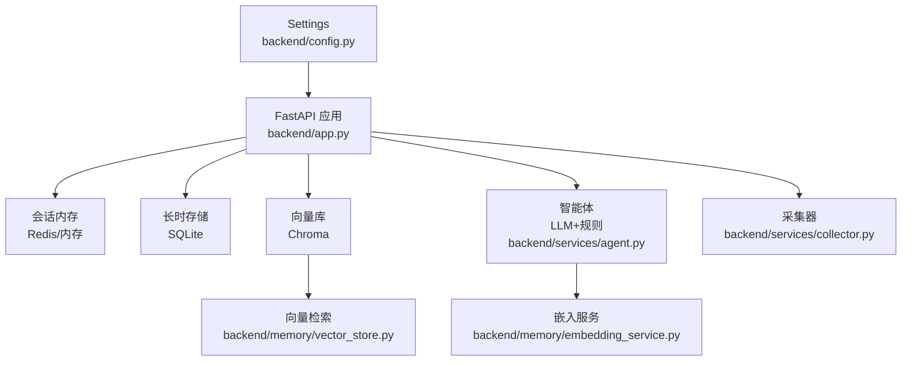
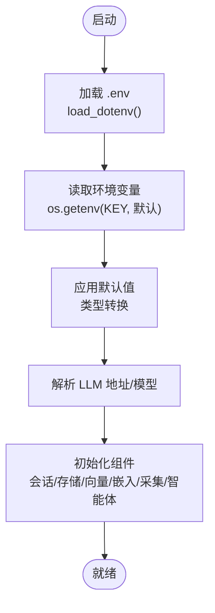
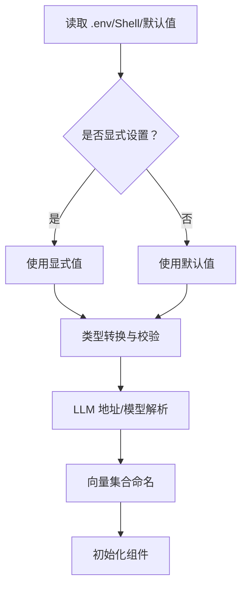

# 环境变量配置

<cite>
**本文引用的文件**
- [backend/config.py](file://backend/config.py)
- [backend/app.py](file://backend/app.py)
- [backend/services/collector.py](file://backend/services/collector.py)
- [backend/memory/embedding_service.py](file://backend/memory/embedding_service.py)
- [backend/memory/vector_store.py](file://backend/memory/vector_store.py)
- [backend/services/agent.py](file://backend/services/agent.py)
- [README.md](file://README.md)
- [requirements.txt](file://requirements.txt)
- [tool/config.yaml](file://tool/config.yaml)
- [deprecated/config.py](file://deprecated/config.py)
</cite>

## 目录
1. [简介](#简介)
2. [项目结构](#项目结构)
3. [核心组件](#核心组件)
4. [架构总览](#架构总览)
5. [详细组件分析](#详细组件分析)
6. [依赖关系分析](#依赖关系分析)
7. [性能考量](#性能考量)
8. [故障排查指南](#故障排查指南)
9. [结论](#结论)
10. [附录](#附录)

## 简介
本文件为 DouYin_llm 项目的环境变量配置权威指南，覆盖应用配置、直播采集配置、数据库与向量数据库配置、LLM 与嵌入模型配置、性能调优配置等。文档明确各变量的默认值、数据类型、作用范围与解析规则，并给出配置优先级、完整 .env 示例、最佳实践与常见问题排查方法。

## 项目结构
- 后端配置集中于 backend/config.py，通过 Settings 类统一读取环境变量与默认值。
- 后端主程序 backend/app.py 在启动时加载 Settings 并初始化各子系统（会话内存、长时存储、向量库、嵌入服务、采集器、智能体）。
- 直播采集器 backend/services/collector.py 使用 Settings 中的采集相关参数连接本地采集器。
- 向量与嵌入 backend/memory/vector_store.py 与 backend/memory/embedding_service.py 依据 Settings 的嵌入模式与阈值进行检索与向量化。
- LLM 与系统提示词解析 backend/services/agent.py 依据 Settings 的 LLM 模式与模型名，结合 SQLite 中的运行时覆盖项生效。

**图表来源**
- [backend/config.py:40-113](file://backend/config.py#L40-L113)
- [backend/app.py:24-36](file://backend/app.py#L24-L36)
- [backend/services/collector.py:38-98](file://backend/services/collector.py#L38-L98)
- [backend/memory/embedding_service.py:18-102](file://backend/memory/embedding_service.py#L18-L102)
- [backend/memory/vector_store.py:59-133](file://backend/memory/vector_store.py#L59-L133)
- [backend/services/agent.py:23-60](file://backend/services/agent.py#L23-L60)

**章节来源**
- [backend/config.py:12-37](file://backend/config.py#L12-L37)
- [backend/app.py:24-36](file://backend/app.py#L24-L36)

## 核心组件
- 配置加载与优先级
  - 优先级：.env > 当前 shell 环境 > 代码默认值
  - .env 由项目内最小实现 load_dotenv() 读取，支持 KEY=VALUE 与注释/空行
- Settings 数据类
  - 统一声明所有运行时配置项，含类型转换与默认值
  - 提供 ensure_dirs() 确保数据目录存在
  - 提供 resolved_llm_base_url()/resolved_llm_model() 解析最终 LLM 地址与模型名
  - 提供 embedding_signature() 生成嵌入签名，用于向量集合命名

**章节来源**
- [backend/config.py:12-37](file://backend/config.py#L12-L37)
- [backend/config.py:40-113](file://backend/config.py#L40-L113)

## 架构总览
下图展示环境变量在系统中的作用点与解析顺序：

**图表来源**
- [backend/config.py:12-37](file://backend/config.py#L12-L37)
- [backend/config.py:84-104](file://backend/config.py#L84-L104)
- [backend/app.py:24-36](file://backend/app.py#L24-L36)

## 详细组件分析

### 应用配置（APP_HOST、APP_PORT）
- APP_HOST
  - 类型：字符串
  - 默认值：127.0.0.1
  - 作用范围：FastAPI 监听地址
- APP_PORT
  - 类型：整数
  - 默认值：8010
  - 作用范围：FastAPI 监听端口
- 说明
  - 与 README 中“后端进程”说明一致
  - 与 uvicorn 启动命令中的 host/port 参数对应

**章节来源**
- [backend/config.py:44-45](file://backend/config.py#L44-L45)
- [README.md:109-115](file://README.md#L109-L115)

### 直播采集配置（ROOM_ID、COLLECTOR_ENABLED、COLLECTOR_HOST、COLLECTOR_PORT、COLLECTOR_PING_INTERVAL_SECONDS、COLLECTOR_RECONNECT_DELAY_SECONDS）
- ROOM_ID
  - 类型：字符串
  - 默认值：空字符串
  - 作用范围：采集器目标房间 ID，需与采集器配置一致
- COLLECTOR_ENABLED
  - 类型：布尔
  - 默认值：true
  - 作用范围：是否启用内置采集器
- COLLECTOR_HOST / COLLECTOR_PORT
  - 类型：字符串/整数
  - 默认值：127.0.0.1 / 1088
  - 作用范围：采集器 WebSocket 地址
- COLLECTOR_PING_INTERVAL_SECONDS
  - 类型：浮点
  - 默认值：30
  - 作用范围：心跳间隔（秒）
- COLLECTOR_RECONNECT_DELAY_SECONDS
  - 类型：浮点
  - 默认值：3
  - 作用范围：断线重连等待（秒）
- 说明
  - 采集器根据 ROOM_ID 与 HOST:PORT 组装 ws://HOST:PORT/ws/{ROOM_ID}
  - 若 ROOM_ID 为空或禁用，则跳过采集

**章节来源**
- [backend/config.py:46-51](file://backend/config.py#L46-L51)
- [backend/services/collector.py:54-59](file://backend/services/collector.py#L54-L59)
- [backend/services/collector.py:61-79](file://backend/services/collector.py#L61-L79)
- [README.md:99-107](file://README.md#L99-L107)

### 数据库与向量数据库配置（DATA_DIR、DATABASE_PATH、CHROMA_DIR、REDIS_URL、SESSION_TTL_SECONDS）
- DATA_DIR
  - 类型：路径
  - 默认值：data
  - 作用范围：数据根目录，包含 SQLite 与 Chroma
- DATABASE_PATH
  - 类型：路径
  - 默认值：data/live_prompter.db
  - 作用范围：SQLite 文件路径
- CHROMA_DIR
  - 类型：路径
  - 默认值：data/chroma
  - 作用范围：Chroma 持久化目录
- REDIS_URL
  - 类型：字符串
  - 默认值：空字符串
  - 作用范围：为空使用进程内内存，设置后启用 Redis 共享会话
- SESSION_TTL_SECONDS
  - 类型：整数
  - 默认值：14400（4 小时）
  - 作用范围：会话过期时间（秒）
- 说明
  - Settings.ensure_dirs() 会在启动时创建上述目录
  - Redis 用于跨进程共享 SessionMemory

**章节来源**
- [backend/config.py:52-56](file://backend/config.py#L52-L56)
- [backend/config.py:77-82](file://backend/config.py#L77-L82)
- [backend/app.py:28](file://backend/app.py#L28)
- [README.md:109-115](file://README.md#L109-L115)

### LLM 配置（LLM_MODE、LLM_BASE_URL、LLM_MODEL、LLM_API_KEY、LLM_TEMPERATURE、LLM_TIMEOUT_SECONDS、LLM_MAX_TOKENS）
- LLM_MODE
  - 类型：字符串
  - 默认值：heuristic
  - 取值：heuristic / qwen / openai
  - 作用范围：选择推理模式
- LLM_BASE_URL
  - 类型：字符串
  - 默认值：根据模式解析
  - 作用范围：OpenAI 兼容 API Endpoint
- LLM_MODEL
  - 类型：字符串
  - 默认值：根据模式解析
  - 作用范围：模型名称，可被前端覆盖
- LLM_API_KEY / DASHSCOPE_API_KEY
  - 类型：字符串
  - 默认值：空字符串
  - 作用范围：模型鉴权；若为空会尝试兼容 DashScope Key
- LLM_TEMPERATURE
  - 类型：浮点
  - 默认值：0.4
  - 作用范围：生成温度
- LLM_TIMEOUT_SECONDS
  - 类型：浮点
  - 默认值：6.0
  - 作用范围：单次推理超时（秒）
- LLM_MAX_TOKENS
  - 类型：整数
  - 默认值：120
  - 作用范围：最大输出 token
- 说明
  - resolved_llm_base_url()/resolved_llm_model() 依据 LLM_MODE 与显式设置解析最终地址与模型名
  - README 中对 LLM 相关变量有汇总说明

**章节来源**
- [backend/config.py:57-63](file://backend/config.py#L57-L63)
- [backend/config.py:84-104](file://backend/config.py#L84-L104)
- [README.md:117-127](file://README.md#L117-L127)

### 嵌入模型配置（EMBEDDING_MODE、EMBEDDING_MODEL、EMBEDDING_BASE_URL、EMBEDDING_API_KEY、EMBEDDING_TIMEOUT_SECONDS、LOCAL_EMBEDDING_DEVICE、LOCAL_EMBEDDING_BATCH_SIZE）
- EMBEDDING_MODE
  - 类型：字符串
  - 默认值：cloud
  - 取值：cloud / local / 其他（回退到哈希嵌入）
  - 作用范围：选择嵌入后端
- EMBEDDING_MODEL
  - 类型：字符串
  - 默认值：text-embedding-3-small
  - 作用范围：云端/本地嵌入模型名
- EMBEDDING_BASE_URL
  - 类型：字符串
  - 默认值：https://api.openai.com/v1
  - 作用范围：云端嵌入接口地址
- EMBEDDING_API_KEY
  - 类型：字符串
  - 默认值：空字符串（可回退到 LLM_API_KEY/DASHSCOPE_API_KEY）
  - 作用范围：云端嵌入鉴权
- EMBEDDING_TIMEOUT_SECONDS
  - 类型：浮点
  - 默认值：10.0
  - 作用范围：云端嵌入请求超时（秒）
- LOCAL_EMBEDDING_DEVICE
  - 类型：字符串
  - 默认值：cpu
  - 作用范围：SentenceTransformer 运行设备
- LOCAL_EMBEDDING_BATCH_SIZE
  - 类型：整数
  - 默认值：32
  - 作用范围：本地嵌入批处理大小
- 说明
  - embedding_signature() 用于向量集合命名，避免不同模式/模型导致集合冲突
  - 本地嵌入依赖 sentence-transformers，缺失时会回退到哈希嵌入

**章节来源**
- [backend/config.py:64-70](file://backend/config.py#L64-L70)
- [backend/memory/embedding_service.py:34-48](file://backend/memory/embedding_service.py#L34-L48)
- [backend/memory/embedding_service.py:50-73](file://backend/memory/embedding_service.py#L50-L73)
- [backend/config.py:106-109](file://backend/config.py#L106-L109)

### 性能调优配置（SEMANTIC_* 参数）
- SEMANTIC_EVENT_MIN_SCORE
  - 类型：浮点
  - 默认值：0.35
  - 作用范围：事件相似检索最低分数
- SEMANTIC_MEMORY_MIN_SCORE
  - 类型：浮点
  - 默认值：0.35
  - 作用范围：观众记忆相似检索最低分数
- SEMANTIC_EVENT_QUERY_LIMIT
  - 类型：整数
  - 默认值：8
  - 作用范围：事件相似检索查询上限
- SEMANTIC_MEMORY_QUERY_LIMIT
  - 类型：整数
  - 默认值：6
  - 作用范围：观众记忆相似检索查询上限
- SEMANTIC_FINAL_K
  - 类型：整数
  - 默认值：3
  - 作用范围：最终候选保留数量
- 说明
  - VectorMemory 根据这些阈值与限制控制召回质量与数量
  - 与向量检索排序与重排逻辑协同工作

**章节来源**
- [backend/config.py:71-75](file://backend/config.py#L71-L75)
- [backend/memory/vector_store.py:92-108](file://backend/memory/vector_store.py#L92-L108)

### 配置优先级与解析规则
- 优先级
  - .env > 当前 shell 环境 > 代码默认值
- 解析细节
  - .env 通过 load_dotenv() 逐行解析 KEY=VALUE，去除注释与空行，赋值到 os.environ
  - Settings 通过 os.getenv(KEY, 默认) 读取并进行类型转换
  - LLM 地址与模型名通过 resolved_llm_base_url()/resolved_llm_model() 解析
  - 嵌入签名 embedding_signature() 用于向量集合命名

**章节来源**
- [backend/config.py:12-37](file://backend/config.py#L12-L37)
- [backend/config.py:40-113](file://backend/config.py#L40-L113)

### 完整 .env 文件示例与最佳实践
- 示例要点（基于已实现变量）
  - 必填项：ROOM_ID、至少一种 API Key（LLM_API_KEY 或 DASHSCOPE_API_KEY）
  - 常用项：APP_HOST、APP_PORT、COLLECTOR_*、DATA_DIR、DATABASE_PATH、CHROMA_DIR、REDIS_URL、SESSION_TTL_SECONDS、LLM_*、EMBEDDING_*、SEMANTIC_*
- 最佳实践
  - 将敏感信息（API Key）放入 .env，不要提交到版本库
  - 本地开发使用默认值即可，生产环境建议显式设置 REDIS_URL、LLM_BASE_URL/LLM_MODEL/LLM_API_KEY、EMBEDDING_*、SEMANTIC_* 以获得稳定行为
  - 如需本地嵌入，确保安装 sentence-transformers 并设置 LOCAL_EMBEDDING_DEVICE/BATCH_SIZE
  - 启动前执行 Settings.ensure_dirs()，确保 data 目录存在

**章节来源**
- [README.md:62-66](file://README.md#L62-L66)
- [backend/config.py:77-82](file://backend/config.py#L77-L82)

## 依赖关系分析
- 外部依赖
  - websocket-client：采集器连接 WebSocket
  - fastapi/uvicorn：后端服务
  - redis：可选，用于共享会话
  - chromadb：可选，用于向量索引
- 与环境变量的关系
  - 采集器依赖 COLLECTOR_HOST/PORT/ROOM_ID/PING/RECONNECT
  - LLM 依赖 LLM_MODE/LLM_BASE_URL/LLM_MODEL/LLM_API_KEY/LLM_TIMEOUT_SECONDS/LLM_TEMPERATURE/LLM_MAX_TOKENS
  - 嵌入依赖 EMBEDDING_MODE/MODEL/URL/API_KEY/TIMEOUT 与本地设备/批大小
  - 存储依赖 DATA_DIR/DATABASE_PATH/CHROMA_DIR/REDIS_URL/SESSION_TTL_SECONDS
  - 向量检索依赖 SEMANTIC_* 参数

**章节来源**
- [requirements.txt:1-6](file://requirements.txt#L1-L6)
- [backend/services/collector.py:54-59](file://backend/services/collector.py#L54-L59)
- [backend/memory/embedding_service.py:75-96](file://backend/memory/embedding_service.py#L75-L96)
- [backend/memory/vector_store.py:172-200](file://backend/memory/vector_store.py#L172-L200)

## 性能考量
- 采集链路
  - 合理设置 COLLECTOR_PING_INTERVAL_SECONDS 与 COLLECTOR_RECONNECT_DELAY_SECONDS，避免频繁重连
  - ROOM_ID 与采集器配置保持一致，减少无效连接
- LLM 推理
  - 适当降低 LLM_TEMPERATURE 与 LLM_MAX_TOKENS 可提升稳定性与时延
  - 合理设置 LLM_TIMEOUT_SECONDS，避免阻塞
- 向量检索
  - 调整 SEMANTIC_* 参数平衡召回质量与性能
  - 使用 Redis 共享会话可提升多实例场景的一致性
- 本地嵌入
  - 在 CPU 上运行时适当增大 LOCAL_EMBEDDING_BATCH_SIZE，注意内存占用

[本节为通用指导，无需列出具体文件来源]

## 故障排查指南
- 采集器无法连接
  - 检查 ROOM_ID 是否为空
  - 检查 COLLECTOR_HOST/PORT 是否正确
  - 检查 COLLECTOR_PING_INTERVAL_SECONDS/COLLECTOR_RECONNECT_DELAY_SECONDS 是否合理
  - 查看采集器日志与网络连通性
- LLM 推理失败
  - 检查 LLM_MODE/LLM_BASE_URL/LLM_MODEL/LLM_API_KEY 是否正确
  - 检查 LLM_TIMEOUT_SECONDS 是否过小
  - 检查 LLM_TEMPERATURE/LLM_MAX_TOKENS 是否合理
- 嵌入服务异常
  - 检查 EMBEDDING_MODE/EMBEDDING_MODEL/EMBEDDING_BASE_URL/EMBEDDING_API_KEY
  - 本地嵌入需安装 sentence-transformers，否则回退到哈希嵌入
- 向量检索结果不佳
  - 调整 SEMANTIC_* 参数，观察召回数量与分数变化
- 数据持久化问题
  - 确认 DATA_DIR/DATABASE_PATH/CHROMA_DIR 权限与磁盘空间
  - 启动时执行 Settings.ensure_dirs()

**章节来源**
- [backend/services/collector.py:61-79](file://backend/services/collector.py#L61-L79)
- [backend/memory/embedding_service.py:34-48](file://backend/memory/embedding_service.py#L34-L48)
- [backend/memory/vector_store.py:92-108](file://backend/memory/vector_store.py#L92-L108)
- [backend/config.py:77-82](file://backend/config.py#L77-L82)

## 结论
- 环境变量是 DouYin_llm 的运行时配置中枢，遵循“.env > 当前 shell > 代码默认值”的优先级
- 通过 Settings 统一解析与校验，结合 resolved_* 与 embedding_signature，确保 LLM 与向量系统的可预测行为
- 建议在生产环境显式配置关键变量，并结合 SEMANTIC_* 参数与外部依赖（Redis/Chroma）优化性能与稳定性

[本节为总结性内容，无需列出具体文件来源]

## 附录

### 环境变量清单与解析流程

**图表来源**
- [backend/config.py:12-37](file://backend/config.py#L12-L37)
- [backend/config.py:40-113](file://backend/config.py#L40-L113)
- [backend/config.py:84-109](file://backend/config.py#L84-L109)

### 与采集器配置的对应关系
- 采集器端口与房间号
  - tool/config.yaml 中 port 与 ROOM_ID 需保持一致
- Cookie 与登录态
  - tool/config.yaml 中可配置 Cookie，用于需要登录态的请求

**章节来源**
- [tool/config.yaml:4-5](file://tool/config.yaml#L4-L5)
- [README.md:60](file://README.md#L60)