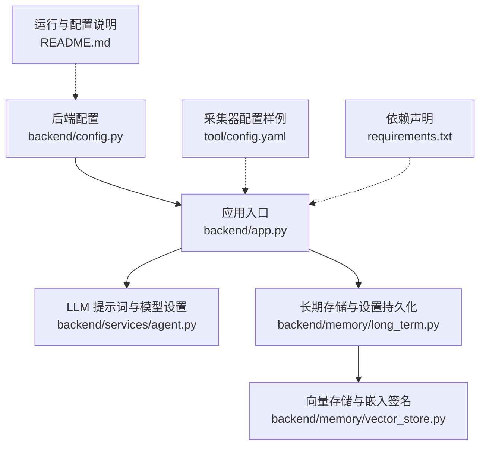
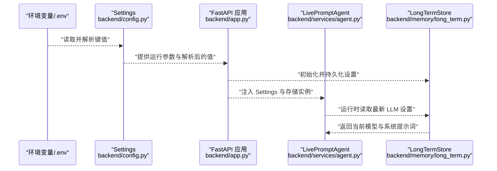
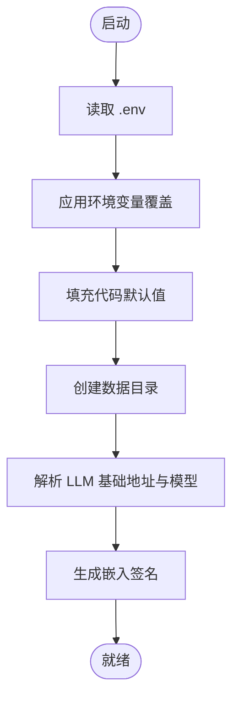
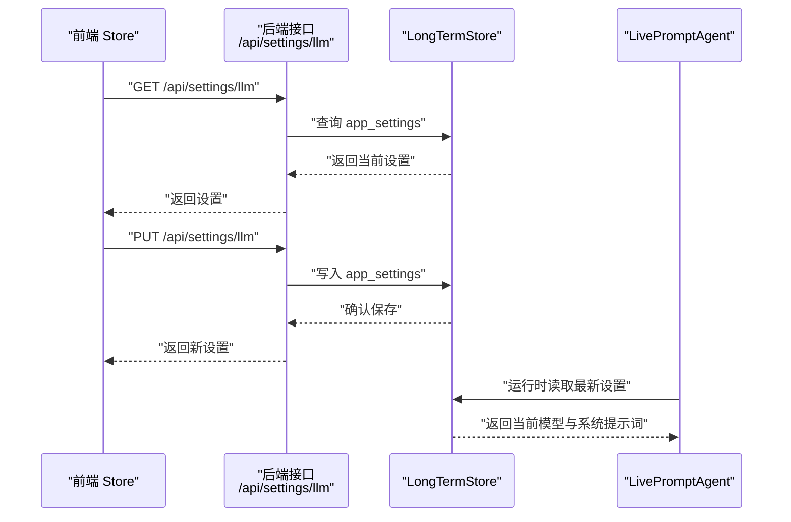
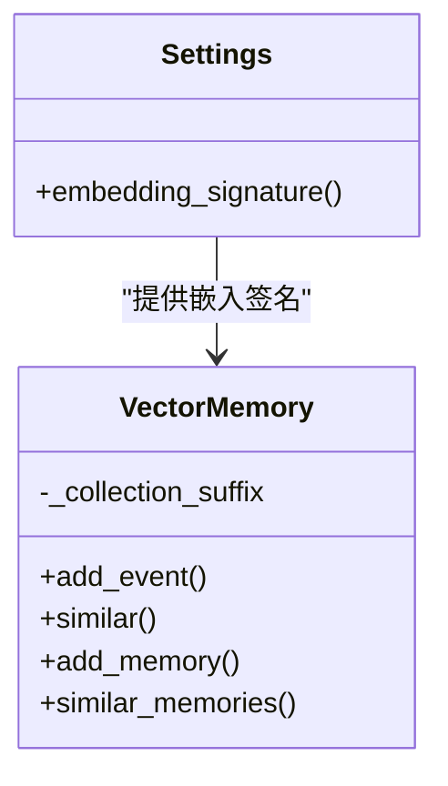
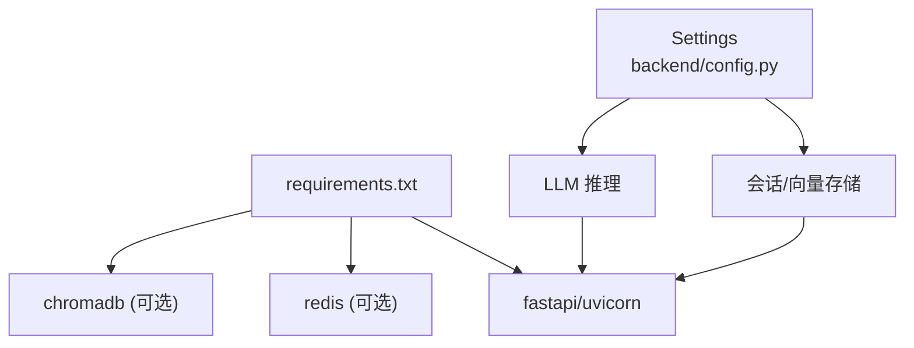

# 运行时配置

<cite>
**本文引用的文件**
- [backend/config.py](file://backend/config.py)
- [backend/app.py](file://backend/app.py)
- [backend/services/agent.py](file://backend/services/agent.py)
- [backend/memory/vector_store.py](file://backend/memory/vector_store.py)
- [backend/memory/long_term.py](file://backend/memory/long_term.py)
- [tool/config.yaml](file://tool/config.yaml)
- [README.md](file://README.md)
- [requirements.txt](file://requirements.txt)
- [tests/test_llm_settings.py](file://tests/test_llm_settings.py)
- [frontend/src/stores/llm-settings.test.mjs](file://frontend/src/stores/llm-settings.test.mjs)
</cite>

## 目录
1. [简介](#简介)
2. [项目结构](#项目结构)
3. [核心组件](#核心组件)
4. [架构总览](#架构总览)
5. [详细组件分析](#详细组件分析)
6. [依赖分析](#依赖分析)
7. [性能考量](#性能考量)
8. [故障排查指南](#故障排查指南)
9. [结论](#结论)
10. [附录](#附录)

## 简介
本文件聚焦于 DouYin_llm 项目的“运行时配置管理”。内容涵盖：
- 启动时配置加载机制与验证流程
- 动态更新能力（LLM 设置、提示词模板等）与热重载策略
- 配置文件格式、语法规范与错误处理
- 不同运行模式下的配置差异（开发/生产）
- 配置备份、恢复与迁移方法
- 配置变更对系统性能的影响与重启要求
- 配置监控与审计的日志策略

## 项目结构
围绕运行时配置，关键位置如下：
- 后端配置定义与加载：backend/config.py
- 应用入口与生命周期：backend/app.py
- LLM 提示词与模型设置的动态读写：backend/services/agent.py、backend/memory/long_term.py
- 向量检索与嵌入签名：backend/memory/vector_store.py
- 采集器配置样例：tool/config.yaml
- 运行与配置说明：README.md
- 依赖声明：requirements.txt
- 配置相关测试：tests/test_llm_settings.py、frontend/src/stores/llm-settings.test.mjs

**图表来源**
- [backend/config.py:1-113](file://backend/config.py#L1-L113)
- [backend/app.py:1-285](file://backend/app.py#L1-L285)
- [backend/services/agent.py:1-496](file://backend/services/agent.py#L1-L496)
- [backend/memory/long_term.py:1-967](file://backend/memory/long_term.py#L1-L967)
- [backend/memory/vector_store.py:1-317](file://backend/memory/vector_store.py#L1-L317)
- [tool/config.yaml:1-16](file://tool/config.yaml#L1-L16)
- [README.md:1-223](file://README.md#L1-L223)
- [requirements.txt:1-6](file://requirements.txt#L1-L6)

**章节来源**
- [backend/config.py:1-113](file://backend/config.py#L1-L113)
- [backend/app.py:1-285](file://backend/app.py#L1-L285)
- [README.md:95-166](file://README.md#L95-L166)

## 核心组件
- 配置加载与解析
  - 优先级：.env > 环境变量 > 代码默认值
  - 自动读取项目根目录 .env 文件，支持注释与空行
  - 提供目录创建、LLM 服务地址与模型名解析、嵌入签名生成等辅助方法
- 应用生命周期与配置使用
  - 启动时创建必要目录，初始化事件代理、会话内存、长期存储、向量存储与 Agent
  - 提供切换房间、事件注入、SSE/WebSocket 实时流、LLM 设置读写等接口
- LLM 设置的动态更新
  - 通过 /api/settings/llm 接口读取/保存当前模型与系统提示词
  - 存储于 SQLite 表 app_settings，Agent 运行时读取最新值
- 向量检索与嵌入签名
  - 基于 Settings.embedding_signature() 生成 collection 后缀，避免不同嵌入配置互相污染
  - 支持 Chroma 与本地哈希嵌入回退

**章节来源**
- [backend/config.py:12-113](file://backend/config.py#L12-L113)
- [backend/app.py:24-36](file://backend/app.py#L24-L36)
- [backend/app.py:224-235](file://backend/app.py#L224-L235)
- [backend/services/agent.py:48-59](file://backend/services/agent.py#L48-L59)
- [backend/memory/vector_store.py:60-84](file://backend/memory/vector_store.py#L60-L84)

## 架构总览
下图展示了配置在系统中的流转与影响范围。

**图表来源**
- [backend/config.py:12-113](file://backend/config.py#L12-L113)
- [backend/app.py:24-36](file://backend/app.py#L24-L36)
- [backend/services/agent.py:48-59](file://backend/services/agent.py#L48-L59)
- [backend/memory/long_term.py:176-181](file://backend/memory/long_term.py#L176-L181)

## 详细组件分析

### 配置加载与验证（启动阶段）
- 加载顺序与覆盖规则
  - 优先级：.env 文件 → 当前 Shell 环境变量 → 代码默认值
  - .env 解析仅支持 KEY=VALUE、注释（# 开头）与空行
- 目录与路径校验
  - ensure_dirs() 在启动时创建 data、SQLite 数据库目录、Chroma 存储目录
- LLM 服务地址与模型解析
  - resolved_llm_base_url() 根据 LLM_MODE 推导默认服务地址
  - resolved_llm_model() 根据 LLM_MODE 推导默认模型名
- 嵌入签名
  - embedding_signature() 将 embedding_mode 与 embedding_model 归一化为安全字符串，作为向量集合后缀

**图表来源**
- [backend/config.py:12-37](file://backend/config.py#L12-L37)
- [backend/config.py:77-113](file://backend/config.py#L77-L113)

**章节来源**
- [backend/config.py:12-37](file://backend/config.py#L12-L37)
- [backend/config.py:77-113](file://backend/config.py#L77-L113)

### LLM 设置的动态更新与热重载
- 接口
  - GET /api/settings/llm：返回当前模型与系统提示词（含默认值）
  - PUT /api/settings/llm：保存模型与系统提示词（空提示词回退到默认）
- 存储
  - 使用 SQLite 表 app_settings 持久化设置
  - 读取时以当前 resolved_llm_model() 为键，结合默认值返回完整 payload
- Agent 侧读取
  - Agent 运行时从 LongTermStore 获取最新设置，无需重启即可生效
- 前端交互
  - 前端 Store 通过 /api/settings/llm 读取/保存，支持草稿与重置

**图表来源**
- [backend/app.py:224-235](file://backend/app.py#L224-L235)
- [backend/memory/long_term.py:176-181](file://backend/memory/long_term.py#L176-L181)
- [backend/services/agent.py:48-59](file://backend/services/agent.py#L48-L59)
- [tests/test_llm_settings.py:24-58](file://tests/test_llm_settings.py#L24-L58)
- [frontend/src/stores/llm-settings.test.mjs:46-70](file://frontend/src/stores/llm-settings.test.mjs#L46-L70)

**章节来源**
- [backend/app.py:224-235](file://backend/app.py#L224-L235)
- [backend/memory/long_term.py:176-181](file://backend/memory/long_term.py#L176-L181)
- [backend/services/agent.py:48-59](file://backend/services/agent.py#L48-L59)
- [tests/test_llm_settings.py:24-58](file://tests/test_llm_settings.py#L24-L58)
- [frontend/src/stores/llm-settings.test.mjs:46-70](file://frontend/src/stores/llm-settings.test.mjs#L46-L70)

### 向量检索与嵌入签名（配置影响）
- 嵌入签名
  - 基于 Settings.embedding_signature() 生成 collection 后缀，避免不同 embedding_mode/model 组合互相污染
- 回退策略
  - 若未安装 Chroma，则使用本地哈希嵌入函数作为回退
- 查询与排序
  - 支持按房间维度过滤、阈值与最终 K 值控制、基于置信度与召回次数的重排序

**图表来源**
- [backend/config.py:106-110](file://backend/config.py#L106-L110)
- [backend/memory/vector_store.py:60-84](file://backend/memory/vector_store.py#L60-L84)

**章节来源**
- [backend/config.py:106-110](file://backend/config.py#L106-L110)
- [backend/memory/vector_store.py:60-84](file://backend/memory/vector_store.py#L60-L84)

### 采集器配置（tool/config.yaml）
- 作用：为采集器提供 WebSocket 端口、Cookie 等运行参数
- 重要字段：port、unknown、cookie.douyin
- 注意：该文件为采集器配置，与后端运行时配置互补

**章节来源**
- [tool/config.yaml:1-16](file://tool/config.yaml#L1-L16)

## 依赖分析
- 后端运行时依赖
  - fastapi、uvicorn：Web 服务与 ASGI 服务器
  - redis：可选，用于分布式会话内存
  - chromadb：可选，用于向量索引
  - websocket-client：采集器与 WebSocket 通信
- 配置对依赖的影响
  - REDIS_URL 非空时启用 Redis 会话内存
  - CHROMA_DIR 存在且 chromadb 可用时启用向量检索

**图表来源**
- [requirements.txt:1-6](file://requirements.txt#L1-L6)
- [backend/config.py:44-75](file://backend/config.py#L44-L75)

**章节来源**
- [requirements.txt:1-6](file://requirements.txt#L1-L6)
- [backend/config.py:44-75](file://backend/config.py#L44-L75)

## 性能考量
- LLM 推理
  - 超时、温度、最大 token 数等参数直接影响延迟与稳定性
  - 失败时自动回退至启发式规则，保障低时延
- 向量检索
  - 嵌入签名避免重复构建集合，提升一致性
  - 查询阈值与最终 K 值可平衡召回质量与性能
- 存储与索引
  - SQLite 写入采用 TRUNCATE 日志模式，减少部分磁盘场景的写入开销
  - Chroma 可选，本地回退时仍可用内存索引维持基本检索能力

**章节来源**
- [backend/services/agent.py:200-217](file://backend/services/agent.py#L200-L217)
- [backend/memory/vector_store.py:86-108](file://backend/memory/vector_store.py#L86-L108)
- [backend/memory/long_term.py:50-54](file://backend/memory/long_term.py#L50-L54)

## 故障排查指南
- 配置加载失败
  - 检查 .env 是否存在、语法是否为 KEY=VALUE，注释以 # 开头
  - 确认环境变量覆盖顺序符合预期
- LLM 设置读取异常
  - 确认 /api/settings/llm 接口返回值与 app_settings 表结构一致
  - 空提示词应回退到默认值
- 向量检索异常
  - 检查 embedding_signature 是否与期望一致
  - 若未安装 chromadb，确认本地回退逻辑正常
- 日志与审计
  - LLM 推理过程记录错误码、网络原因、超时、JSON 解析失败等
  - 建议在生产环境开启更细粒度的结构化日志，便于审计与追踪

**章节来源**
- [backend/config.py:12-37](file://backend/config.py#L12-L37)
- [tests/test_llm_settings.py:24-58](file://tests/test_llm_settings.py#L24-L58)
- [backend/memory/vector_store.py:80-84](file://backend/memory/vector_store.py#L80-L84)
- [backend/services/agent.py:330-437](file://backend/services/agent.py#L330-L437)

## 结论
- 本项目采用“.env > 环境变量 > 默认值”的清晰加载链路，确保本地开箱即用与生产可控
- LLM 设置通过 SQLite 持久化并在运行时即时生效，无需重启
- 向量检索通过嵌入签名隔离不同配置组合，兼顾一致性与可移植性
- 建议在生产环境完善日志与审计策略，强化可观测性

## 附录

### 配置文件格式与语法规范
- .env
  - 仅支持 KEY=VALUE、注释（# 开头）与空行
  - 未显式赋值时使用代码默认值
- tool/config.yaml
  - 采集器配置示例，包含 port、unknown、cookie.douyin 等字段
  - 用于驱动采集器 WebSocket 连接与登录态

**章节来源**
- [backend/config.py:12-37](file://backend/config.py#L12-L37)
- [tool/config.yaml:1-16](file://tool/config.yaml#L1-L16)

### 不同运行模式下的配置差异（开发 vs 生产）
- 开发模式
  - 常用默认值即可运行，.env 中至少配置 ROOM_ID 与 LLM API Key
  - 可启用 uvicorn --reload 以便前端/后端热更新
- 生产模式
  - 明确设置 REDIS_URL、CHROMA_DIR、数据库路径等
  - 严格管理 LLM 超时、温度、最大 token 等参数，确保稳定性
  - 建议固定 LLM_MODE 与模型名，避免频繁切换

**章节来源**
- [README.md:62-93](file://README.md#L62-L93)
- [README.md:95-142](file://README.md#L95-L142)

### 配置备份、恢复与迁移
- 备份
  - 备份 data/live_prompter.db（含 app_settings）
  - 备份 .env 与 tool/config.yaml
- 恢复
  - 恢复数据库与配置文件后重启服务
  - 确认 LLM 设置与向量集合签名一致，避免检索异常
- 迁移
  - 更换 embedding_mode/model 时，集合后缀变化，需重建向量索引或接受冷启动

**章节来源**
- [README.md:193-197](file://README.md#L193-L197)
- [backend/memory/vector_store.py:68-84](file://backend/memory/vector_store.py#L68-L84)

### 配置变更对系统性能的影响与重启要求
- LLM 参数调整
  - 温度、超时、最大 token 等参数即时生效，无需重启
- 向量检索参数调整
  - semantic_* 系列参数即时生效，无需重启
- 采集器配置
  - 修改 tool/config.yaml 后需重启采集器进程

**章节来源**
- [backend/services/agent.py:200-217](file://backend/services/agent.py#L200-L217)
- [backend/memory/vector_store.py:92-108](file://backend/memory/vector_store.py#L92-L108)
- [tool/config.yaml:4-5](file://tool/config.yaml#L4-L5)

### 配置监控与审计的日志记录策略
- 建议
  - 记录 LLM 推理错误（HTTP 码、网络原因、超时、JSON 异常）
  - 记录配置解析与覆盖过程（便于审计）
  - 记录向量检索阈值与最终 K 值，便于性能分析
- 当前实现
  - LLM 推理过程已记录多种错误场景与状态

**章节来源**
- [backend/services/agent.py:330-437](file://backend/services/agent.py#L330-L437)